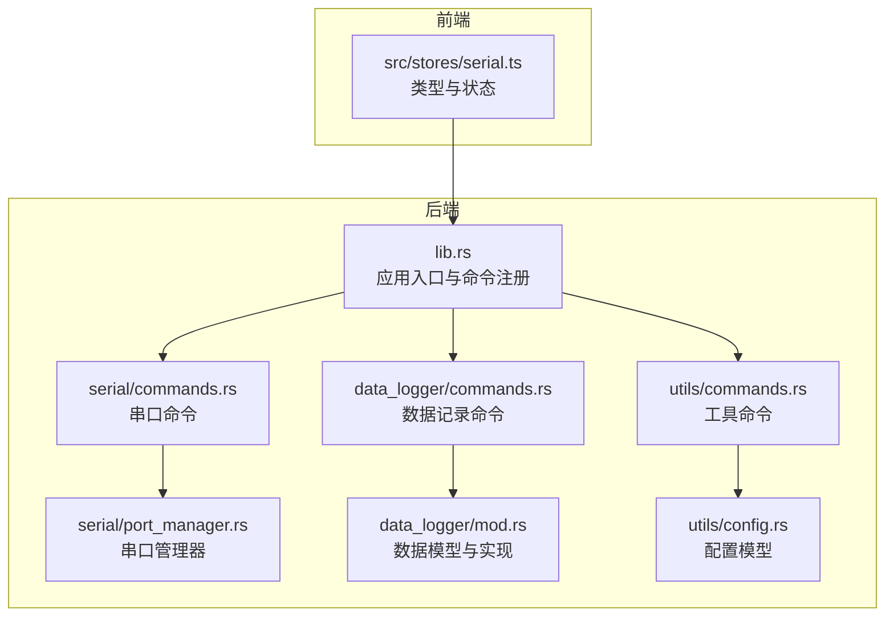
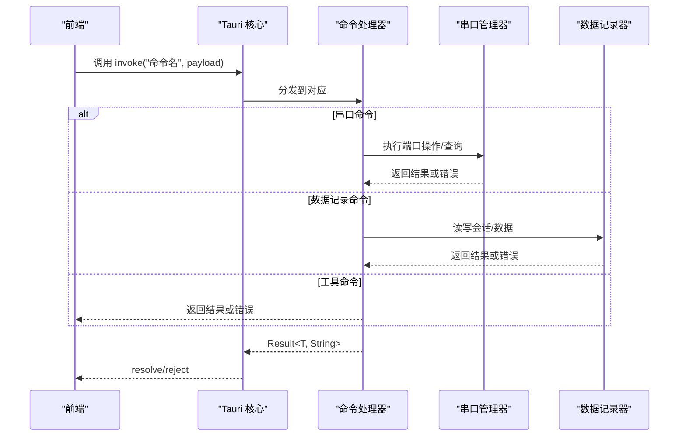
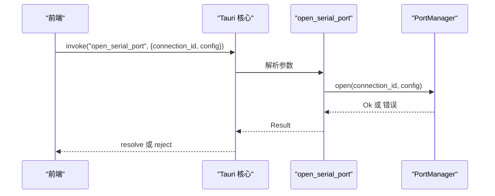
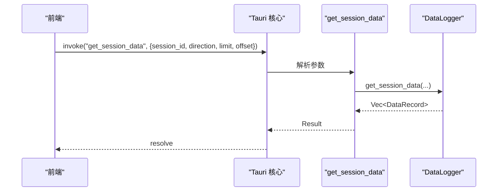
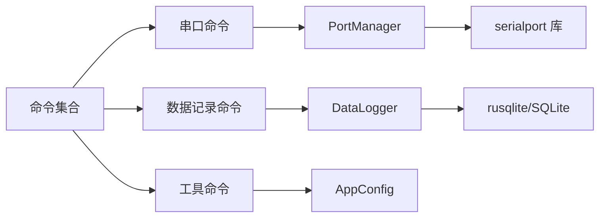

# API 参考

<cite>
**本文引用的文件**
- [src-tauri/src/lib.rs](file://src-tauri/src/lib.rs)
- [src-tauri/src/main.rs](file://src-tauri/src/main.rs)
- [src-tauri/tauri.conf.json](file://src-tauri/tauri.conf.json)
- [src-tauri/Cargo.toml](file://src-tauri/Cargo.toml)
- [src-tauri/src/serial/commands.rs](file://src-tauri/src/serial/commands.rs)
- [src-tauri/src/serial/port_manager.rs](file://src-tauri/src/serial/port_manager.rs)
- [src-tauri/src/data_logger/commands.rs](file://src-tauri/src/data_logger/commands.rs)
- [src-tauri/src/data_logger/mod.rs](file://src-tauri/src/data_logger/mod.rs)
- [src-tauri/src/utils/commands.rs](file://src-tauri/src/utils/commands.rs)
- [src-tauri/src/utils/config.rs](file://src-tauri/src/utils/config.rs)
- [src/stores/serial.ts](file://src/stores/serial.ts)
</cite>

## 目录
1. [简介](#简介)
2. [项目结构](#项目结构)
3. [核心组件](#核心组件)
4. [架构总览](#架构总览)
5. [详细组件分析](#详细组件分析)
6. [依赖关系分析](#依赖关系分析)
7. [性能考量](#性能考量)
8. [故障排查指南](#故障排查指南)
9. [结论](#结论)
10. [附录](#附录)

## 简介
本文件为 KonSerial 的 Tauri 命令接口 API 参考，覆盖串口通信、数据记录与工具类命令的完整规范。内容包括：
- 每个命令的用途、参数、返回值与错误说明
- 请求/响应数据结构定义与示例
- 调用方式、认证与权限控制说明
- 版本兼容性与废弃 API 迁移建议
- 第三方集成与最佳实践

KonSerial 基于 Tauri v2，Rust 后端通过 #[tauri::command] 暴露命令，前端通过 @tauri-apps/api 调用。

## 项目结构
后端采用模块化组织，主要模块如下：
- serial：串口管理与命令
- data_logger：数据记录与会话管理
- utils：配置与通用命令
- lib.rs：应用入口与命令注册
- tauri.conf.json：应用与插件配置
- Cargo.toml：依赖与版本

**图表来源**
- [src-tauri/src/lib.rs:47-82](file://src-tauri/src/lib.rs#L47-L82)
- [src-tauri/src/serial/commands.rs:1-129](file://src-tauri/src/serial/commands.rs#L1-L129)
- [src-tauri/src/serial/port_manager.rs:1-200](file://src-tauri/src/serial/port_manager.rs#L1-L200)
- [src-tauri/src/data_logger/commands.rs:1-49](file://src-tauri/src/data_logger/commands.rs#L1-L49)
- [src-tauri/src/data_logger/mod.rs:1-273](file://src-tauri/src/data_logger/mod.rs#L1-L273)
- [src-tauri/src/utils/commands.rs:1-31](file://src-tauri/src/utils/commands.rs#L1-L31)
- [src-tauri/src/utils/config.rs:1-176](file://src-tauri/src/utils/config.rs#L1-L176)
- [src/stores/serial.ts:1-94](file://src/stores/serial.ts#L1-L94)

**章节来源**
- [src-tauri/src/lib.rs:17-82](file://src-tauri/src/lib.rs#L17-L82)
- [src-tauri/tauri.conf.json:1-47](file://src-tauri/tauri.conf.json#L1-L47)
- [src-tauri/Cargo.toml:1-40](file://src-tauri/Cargo.toml#L1-L40)

## 核心组件
- 应用入口与命令注册：在 lib.rs 中初始化日志、配置、数据库与串口管理器，并注册全部命令。
- 串口管理器：负责多连接管理、端口枚举、读写任务、会话记录与全局运行时信息聚合。
- 数据记录器：基于 SQLite 的会话与数据记录管理，支持查询、删除与 CSV 导出。
- 工具命令：配置加载/保存、默认配置路径获取等。

**章节来源**
- [src-tauri/src/lib.rs:24-82](file://src-tauri/src/lib.rs#L24-L82)
- [src-tauri/src/serial/port_manager.rs:159-171](file://src-tauri/src/serial/port_manager.rs#L159-L171)
- [src-tauri/src/data_logger/mod.rs:47-111](file://src-tauri/src/data_logger/mod.rs#L47-L111)
- [src-tauri/src/utils/commands.rs:1-31](file://src-tauri/src/utils/commands.rs#L1-L31)

## 架构总览
Tauri 前后端交互流程概览：

**图表来源**
- [src-tauri/src/lib.rs:56-80](file://src-tauri/src/lib.rs#L56-L80)
- [src-tauri/src/serial/commands.rs:1-129](file://src-tauri/src/serial/commands.rs#L1-L129)
- [src-tauri/src/data_logger/commands.rs:1-49](file://src-tauri/src/data_logger/commands.rs#L1-L49)
- [src-tauri/src/utils/commands.rs:1-31](file://src-tauri/src/utils/commands.rs#L1-L31)

## 详细组件分析

### 串口通信命令
以下命令均通过 #[tauri::command] 暴露，使用 State/Arc<Mutex<...>> 管理共享状态，异步执行。

- 命令：列出可用串口
  - 名称：list_serial_ports
  - 参数：无
  - 返回：字符串数组（串口名称）
  - 错误：底层串口枚举失败
  - 示例：参见“调用示例”章节
  - 复杂度：O(n)，n 为系统可用串口数

- 命令：获取串口详细信息
  - 名称：get_serial_ports_info
  - 参数：无
  - 返回：串口简单信息数组（名称、类型）
  - 错误：底层串口枚举失败
  - 复杂度：O(n)

- 命令：刷新可用串口列表（详细）
  - 名称：refresh_serial_ports
  - 参数：无
  - 返回：串口详细信息数组（含厂商、产品、VID/PID 等）
  - 错误：底层串口枚举失败
  - 复杂度：O(n)

- 命令：打开串口
  - 名称：open_serial_port
  - 参数：
    - connection_id: 字符串（连接标识）
    - config: SerialPortConfig（完整串口配置）
  - 返回：空
  - 错误：端口打开失败、配置不合法、并发冲突
  - 复杂度：O(1)

- 命令：关闭指定串口
  - 名称：close_serial_port
  - 参数：connection_id
  - 返回：空
  - 错误：连接不存在或关闭异常
  - 复杂度：O(1)

- 命令：关闭所有串口
  - 名称：close_all_serial_ports
  - 参数：无
  - 返回：空
  - 错误：无（内部处理）
  - 复杂度：O(k)，k 为活跃连接数

- 命令：获取连接状态
  - 名称：get_connection_info
  - 参数：connection_id
  - 返回：ConnectionInfo（状态、配置、字节计数、错误、创建时间）
  - 错误：连接不存在
  - 复杂度：O(1)

- 命令：获取所有连接状态
  - 名称：get_all_connections
  - 参数：无
  - 返回：ConnectionInfo 数组
  - 错误：无
  - 复杂度：O(k)

- 命令：获取全局运行时信息
  - 名称：get_global_runtime_info
  - 参数：无
  - 返回：GlobalRuntimeInfo（可用端口、活跃连接、总数）
  - 错误：无
  - 复杂度：O(n+k)

- 命令：发送数据
  - 名称：send_serial_data
  - 参数：connection_id, data: Uint8Array
  - 返回：发送字节数
  - 错误：连接不存在或发送失败
  - 复杂度：O(1)

- 命令：检查连接状态
  - 名称：is_serial_connected
  - 参数：connection_id
  - 返回：布尔
  - 错误：无
  - 复杂度：O(1)

数据结构定义（后端）：
- SerialPortConfig：端口名、波特率、数据位、停止位、校验、流控、超时
- PortStatus：断开、连接中、已连接、错误
- ConnectionInfo：连接标识、状态、配置、收发字节、最后错误、创建时间
- GlobalRuntimeInfo：可用端口列表、活跃连接列表、总数
- PortInfo：端口名、类型、厂商、产品、序列号、VID/PID
- SerialPortInfoSimple：端口名、类型（简版）

调用方式与前端类型：
- 前端通过 @tauri-apps/api 的 invoke 调用命令
- 前端类型定义与状态管理位于 src/stores/serial.ts

**章节来源**
- [src-tauri/src/serial/commands.rs:1-129](file://src-tauri/src/serial/commands.rs#L1-L129)
- [src-tauri/src/serial/port_manager.rs:14-124](file://src-tauri/src/serial/port_manager.rs#L14-L124)
- [src/stores/serial.ts:9-94](file://src/stores/serial.ts#L9-L94)

#### 串口命令调用时序

**图表来源**
- [src-tauri/src/serial/commands.rs:49-59](file://src-tauri/src/serial/commands.rs#L49-L59)
- [src-tauri/src/serial/port_manager.rs:196-200](file://src-tauri/src/serial/port_manager.rs#L196-L200)

### 数据记录命令
- 命令：获取会话列表
  - 名称：get_sessions
  - 参数：无
  - 返回：SessionInfo 数组（id、连接id、端口名、波特率、起止时间、收发字节）
  - 错误：数据库查询失败
  - 复杂度：O(n)

- 命令：获取会话数据
  - 名称：get_session_data
  - 参数：session_id, direction(可选), limit(可选), offset(可选)
  - 返回：DataRecord 数组（id、会话id、方向、数据、时间戳）
  - 错误：数据库查询失败
  - 复杂度：O(limit)

- 命令：删除会话
  - 名称：delete_session
  - 参数：session_id
  - 返回：空
  - 错误：删除失败
  - 复杂度：O(1)，受外键级联影响

- 命令：导出会话为 CSV
  - 名称：export_session_csv
  - 参数：session_id
  - 返回：CSV 文本
  - 错误：导出失败
  - 复杂度：O(n)

数据结构定义（后端）：
- SessionInfo：会话基本信息与统计
- DataRecord：单条记录（方向为 TX/RX）

**章节来源**
- [src-tauri/src/data_logger/commands.rs:1-49](file://src-tauri/src/data_logger/commands.rs#L1-L49)
- [src-tauri/src/data_logger/mod.rs:22-43](file://src-tauri/src/data_logger/mod.rs#L22-L43)
- [src-tauri/src/data_logger/mod.rs:168-271](file://src-tauri/src/data_logger/mod.rs#L168-L271)

#### 数据记录命令时序

**图表来源**
- [src-tauri/src/data_logger/commands.rs:15-30](file://src-tauri/src/data_logger/commands.rs#L15-L30)
- [src-tauri/src/data_logger/mod.rs:203-244](file://src-tauri/src/data_logger/mod.rs#L203-L244)

### 工具命令
- 命令：加载配置
  - 名称：load_config
  - 参数：path(可选)
  - 返回：AppConfig
  - 错误：文件读取/解析失败
  - 默认路径：default_config_path()

- 命令：保存配置
  - 名称：save_config
  - 参数：config(AppConfig), path(可选)
  - 返回：空
  - 错误：保存失败
  - 默认路径：default_config_path()

- 命令：获取默认配置路径
  - 名称：get_config_path
  - 参数：无
  - 返回：字符串（路径）
  - 错误：无
  - 默认路径：跨平台配置目录下的 config.json

数据结构定义（后端）：
- SerialConfig、UiConfig、DataConfig、AppConfig

**章节来源**
- [src-tauri/src/utils/commands.rs:1-31](file://src-tauri/src/utils/commands.rs#L1-L31)
- [src-tauri/src/utils/config.rs:18-63](file://src-tauri/src/utils/config.rs#L18-L63)

## 依赖关系分析
- 命令注册：lib.rs 统一注册所有命令，包括基础、串口、数据记录与工具命令。
- 串口命令依赖 PortManager；数据记录命令依赖 DataLogger；工具命令依赖 AppConfig。
- 插件：dialog、clipboard-manager、cli、fs、opener 等在 tauri.conf.json 中声明。
- 版本：Tauri v2，Rust 依赖版本在 Cargo.toml 中声明。

**图表来源**
- [src-tauri/src/lib.rs:56-80](file://src-tauri/src/lib.rs#L56-L80)
- [src-tauri/Cargo.toml:20-36](file://src-tauri/Cargo.toml#L20-L36)

**章节来源**
- [src-tauri/src/lib.rs:47-82](file://src-tauri/src/lib.rs#L47-L82)
- [src-tauri/Cargo.toml:20-36](file://src-tauri/Cargo.toml#L20-L36)

## 性能考量
- 串口命令：多连接并发访问通过 Arc<Mutex<...>> 保护，避免竞态；发送/查询为 O(1)/O(limit)。
- 数据库：WAL 模式与外键启用提升并发与一致性；索引 idx_serial_data_session 支持按会话与时间排序查询。
- 建议：
  - 控制查询 limit 与 offset，避免一次性拉取大量数据。
  - 合理设置超时与缓冲大小，避免阻塞。
  - 使用 get_global_runtime_info 聚合查询替代多次分散查询。

[本节为通用建议，无需特定文件引用]

## 故障排查指南
- 串口打开失败
  - 检查端口占用、权限与配置合法性
  - 查看 PortStatus 是否为 Error(String)
- 发送失败
  - 确认连接状态与连接标识
  - 检查超时与流控设置
- 数据库异常
  - 确认数据库文件可写、路径正确
  - 检查 PRAGMA 设置与表结构
- 配置加载失败
  - 检查 JSON 格式与路径权限

**章节来源**
- [src-tauri/src/serial/port_manager.rs:68-87](file://src-tauri/src/serial/port_manager.rs#L68-L87)
- [src-tauri/src/data_logger/mod.rs:76-106](file://src-tauri/src/data_logger/mod.rs#L76-L106)
- [src-tauri/src/utils/commands.rs:3-23](file://src-tauri/src/utils/commands.rs#L3-L23)

## 结论
本文档提供了 KonSerial 的完整 Tauri 命令 API 规范，涵盖串口通信、数据记录与工具命令。通过明确的参数、返回值与错误处理，结合数据结构定义与调用示例，可帮助第三方开发者与集成商快速完成对接与扩展。

[本节为总结，无需特定文件引用]

## 附录

### 调用方式与示例
- 前端调用
  - 使用 @tauri-apps/api 的 invoke("命令名", payload) 调用
  - 串口命令示例：打开串口、发送数据、关闭连接
  - 数据记录命令示例：获取会话列表、导出 CSV
  - 工具命令示例：加载/保存配置、获取默认路径
- 前端类型
  - 前端类型定义与状态管理位于 src/stores/serial.ts

**章节来源**
- [src/stores/serial.ts:1-94](file://src/stores/serial.ts#L1-L94)

### 权限与认证
- 权限控制
  - 串口访问需系统权限；建议在桌面平台以足够权限运行
  - 文件系统访问通过 tauri-plugin-fs 提供，需在 tauri.conf.json 中配置
- 认证机制
  - 本项目未实现内置认证；如需安全访问，请在上层业务中自行实现

**章节来源**
- [src-tauri/tauri.conf.json:24-33](file://src-tauri/tauri.conf.json#L24-L33)
- [src-tauri/Cargo.toml:23-30](file://src-tauri/Cargo.toml#L23-L30)

### 版本兼容性与迁移
- 版本
  - 应用版本：0.1.0
  - 依赖：Tauri v2、serialport、rusqlite、tokio 等
- 迁移建议
  - 若升级 Tauri 版本，注意命令注册与插件 API 变更
  - 若调整数据结构，需同步更新前后端类型定义与序列化字段

**章节来源**
- [src-tauri/tauri.conf.json:3-4](file://src-tauri/tauri.conf.json#L3-L4)
- [src-tauri/Cargo.toml:20-36](file://src-tauri/Cargo.toml#L20-L36)

### 数据结构一览（后端）
- 串口相关
  - SerialPortConfig：端口名、波特率、数据位、停止位、校验、流控、超时
  - PortStatus：断开、连接中、已连接、错误
  - ConnectionInfo：连接标识、状态、配置、收发字节、最后错误、创建时间
  - GlobalRuntimeInfo：可用端口、活跃连接、总数
  - PortInfo：端口名、类型、厂商、产品、序列号、VID/PID
  - SerialPortInfoSimple：端口名、类型（简版）
- 数据记录相关
  - SessionInfo：会话 id、连接 id、端口名、波特率、起止时间、收发字节
  - DataRecord：记录 id、会话 id、方向、数据、时间戳
- 工具相关
  - SerialConfig、UiConfig、DataConfig、AppConfig

**章节来源**
- [src-tauri/src/serial/port_manager.rs:14-124](file://src-tauri/src/serial/port_manager.rs#L14-L124)
- [src-tauri/src/data_logger/mod.rs:22-43](file://src-tauri/src/data_logger/mod.rs#L22-L43)
- [src-tauri/src/utils/config.rs:18-63](file://src-tauri/src/utils/config.rs#L18-L63)