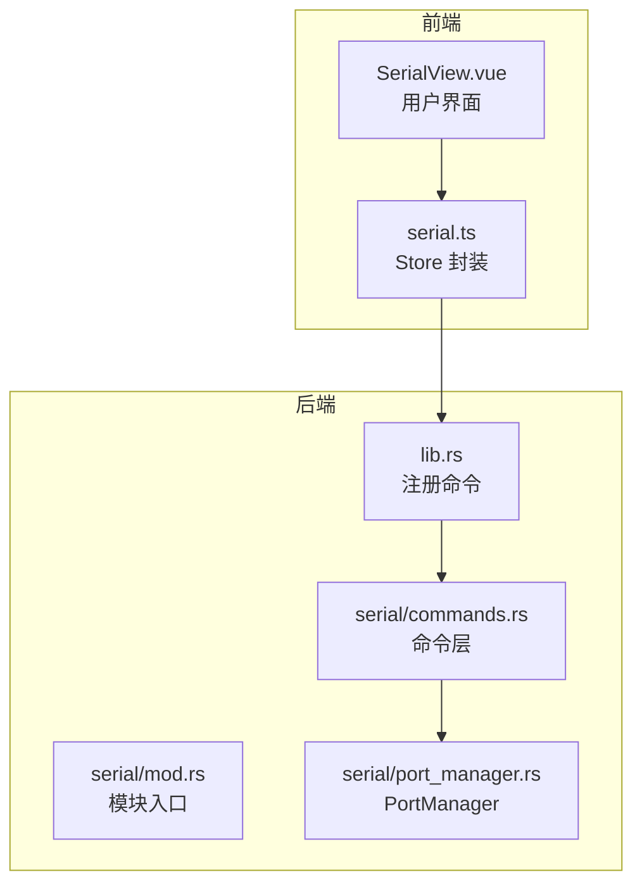
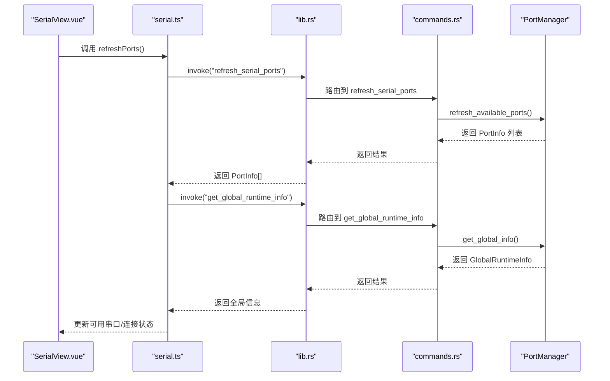
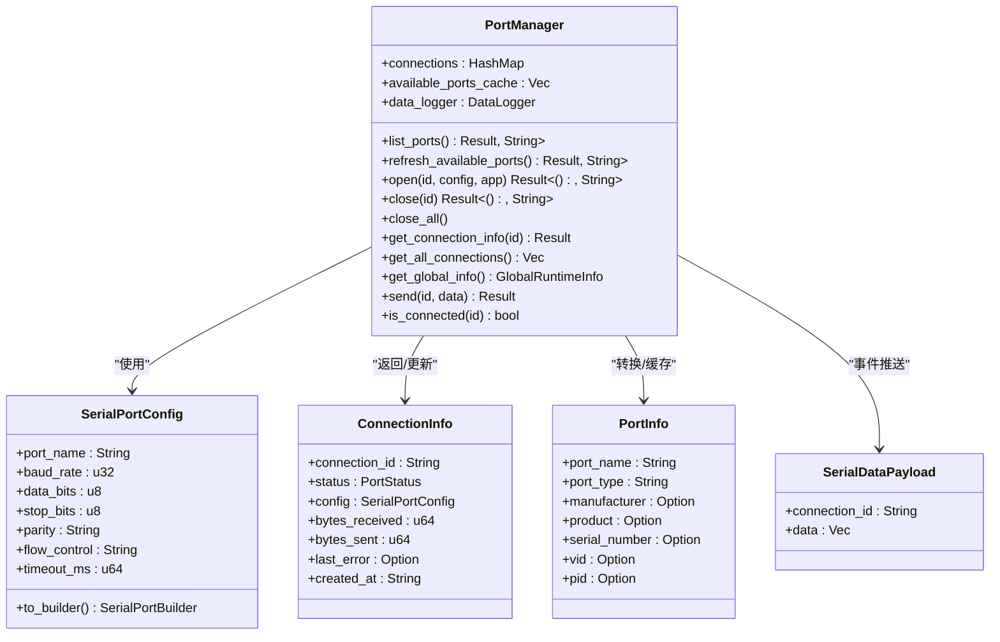

# 串口发现与管理

<cite>
**本文引用的文件**
- [src-tauri/src/serial/mod.rs](file://src-tauri/src/serial/mod.rs)
- [src-tauri/src/serial/commands.rs](file://src-tauri/src/serial/commands.rs)
- [src-tauri/src/serial/port_manager.rs](file://src-tauri/src/serial/port_manager.rs)
- [src-tauri/src/lib.rs](file://src-tauri/src/lib.rs)
- [src/stores/serial.ts](file://src/stores/serial.ts)
- [src/views/SerialView.vue](file://src/views/SerialView.vue)
- [src-tauri/Cargo.toml](file://src-tauri/Cargo.toml)
</cite>

## 目录
1. [简介](#简介)
2. [项目结构](#项目结构)
3. [核心组件](#核心组件)
4. [架构总览](#架构总览)
5. [详细组件分析](#详细组件分析)
6. [依赖关系分析](#依赖关系分析)
7. [性能考量](#性能考量)
8. [故障排查指南](#故障排查指南)
9. [结论](#结论)
10. [附录：API 参考](#附录api-参考)

## 简介
本文件面向串口发现与管理功能，系统性梳理后端 Rust 模块与前端 Vue Store 的交互，重点覆盖以下能力：
- 串口枚举与信息获取
- 串口刷新与缓存机制
- 设备类型识别（USB/PCI/蓝牙/未知）
- 端口状态检查与连接生命周期管理
- 动态刷新与并发安全设计
- 实际调用示例与错误处理策略
- 性能优化与并发安全建议

## 项目结构
该功能横跨 Tauri 后端与 Vue 前端两部分：
- 后端（Rust）：通过 Tauri 命令暴露串口发现与管理 API，并以 PortManager 统一管理连接与缓存。
- 前端（Vue）：通过 Store 封装 invoke 调用、事件监听与状态轮询，提供用户界面与交互。

图表来源
- [src/views/SerialView.vue](file://src/views/SerialView.vue)
- [src/stores/serial.ts](file://src/stores/serial.ts)
- [src-tauri/src/lib.rs](file://src-tauri/src/lib.rs)
- [src-tauri/src/serial/mod.rs](file://src-tauri/src/serial/mod.rs)
- [src-tauri/src/serial/commands.rs](file://src-tauri/src/serial/commands.rs)
- [src-tauri/src/serial/port_manager.rs](file://src-tauri/src/serial/port_manager.rs)

章节来源
- [src-tauri/src/lib.rs](file://src-tauri/src/lib.rs)
- [src-tauri/src/serial/mod.rs](file://src-tauri/src/serial/mod.rs)

## 核心组件
- PortManager：串口管理器，负责枚举、缓存、连接、读写、状态统计与事件推送。
- Tauri 命令层：将 PortManager 的能力以命令形式暴露给前端。
- 前端 Store：封装 invoke 调用、事件监听、轮询与 UI 状态。

章节来源
- [src-tauri/src/serial/port_manager.rs](file://src-tauri/src/serial/port_manager.rs)
- [src-tauri/src/serial/commands.rs](file://src-tauri/src/serial/commands.rs)
- [src/stores/serial.ts](file://src/stores/serial.ts)

## 架构总览
后端通过 Tauri 命令注册串口相关 API；前端通过 Store 调用命令并订阅后端推送的串口数据事件，同时定期轮询全局运行时信息以保持 UI 与后端状态一致。

图表来源
- [src-tauri/src/lib.rs](file://src-tauri/src/lib.rs)
- [src-tauri/src/serial/commands.rs](file://src-tauri/src/serial/commands.rs)
- [src-tauri/src/serial/port_manager.rs](file://src-tauri/src/serial/port_manager.rs)
- [src/stores/serial.ts](file://src/stores/serial.ts)
- [src/views/SerialView.vue](file://src/views/SerialView.vue)

## 详细组件分析

### 串口发现与信息获取
- 枚举串口名称
  - 命令：list_serial_ports
  - 行为：调用 PortManager::list_ports，返回可用串口名称字符串数组
  - 适用场景：仅需要端口名列表时，避免额外信息解析成本
- 获取串口详细信息
  - 命令：get_serial_ports_info
  - 行为：调用 PortManager::list_ports，转换为 SerialPortInfoSimple，返回包含端口名与类型（字符串化）的列表
  - 适用场景：UI 需要显示端口类型（如 USB/PCI/蓝牙/未知）
- 刷新可用串口列表（返回详细信息）
  - 命令：refresh_serial_ports
  - 行为：通过 PortManager 刷新缓存并返回 PortInfo 列表（含厂商、产品、序列号、VID/PID 等）
  - 适用场景：用户点击“刷新”或首次进入页面时，需要完整设备信息

章节来源
- [src-tauri/src/serial/commands.rs](file://src-tauri/src/serial/commands.rs)
- [src-tauri/src/serial/port_manager.rs](file://src-tauri/src/serial/port_manager.rs)

### 设备类型识别与 PortInfo 字段
PortInfo 提供了丰富的设备识别信息，便于 UI 展示与过滤：
- port_name：串口名称
- port_type：设备类型字符串（"USB"/"PCI"/"Bluetooth"/"Unknown"）
- manufacturer：厂商信息（可选）
- product：产品信息（可选）
- serial_number：序列号（可选）
- vid/pid：USB 厂商/产品 ID（可选）

章节来源
- [src-tauri/src/serial/port_manager.rs](file://src-tauri/src/serial/port_manager.rs)

### 端口状态检查与连接生命周期
- 端口状态枚举：Disconnected/Connecting/Connected/Error(...)
- 连接状态查询：is_serial_connected
- 连接详情：get_connection_info/get_all_connections
- 全局运行时信息：get_global_runtime_info（包含可用端口与活跃连接）
- 连接生命周期：open → 后台读取任务 → 发送/接收事件 → close/close_all

章节来源
- [src-tauri/src/serial/commands.rs](file://src-tauri/src/serial/commands.rs)
- [src-tauri/src/serial/port_manager.rs](file://src-tauri/src/serial/port_manager.rs)
- [src/stores/serial.ts](file://src/stores/serial.ts)

### 动态刷新与并发安全
- 缓存策略：PortManager 内部维护 available_ports_cache，refresh_serial_ports 会更新该缓存并返回 PortInfo 列表
- 并发安全：使用 Arc<Mutex<...>> 与 Arc<RwLock<...>> 管理共享状态，避免竞态
- 事件推送：后端读取循环通过 Tauri 事件向前端推送原始字节数据，前端统一解码展示
- 轮询更新：前端 Store 提供定时轮询，保证 UI 与后端状态一致

章节来源
- [src-tauri/src/serial/port_manager.rs](file://src-tauri/src/serial/port_manager.rs)
- [src/stores/serial.ts](file://src/stores/serial.ts)

### 错误处理策略
- 命令层统一返回 Result<Vec<T>, String> 或 Result<T, String>，错误信息透传
- 前端 Store 在调用失败时捕获异常并抛出，便于 UI 层提示
- 连接错误：PortManager 将连接状态置为 Error(...) 并记录 last_error，可通过 get_connection_info 获取

章节来源
- [src-tauri/src/serial/commands.rs](file://src-tauri/src/serial/commands.rs)
- [src-tauri/src/serial/port_manager.rs](file://src-tauri/src/serial/port_manager.rs)
- [src/stores/serial.ts](file://src/stores/serial.ts)

## 依赖关系分析

图表来源
- [src-tauri/src/serial/port_manager.rs](file://src-tauri/src/serial/port_manager.rs)

章节来源
- [src-tauri/src/serial/port_manager.rs](file://src-tauri/src/serial/port_manager.rs)

## 性能考量
- 枚举成本：串口枚举来自底层 serialport 库，频繁调用可能带来开销。建议：
  - 使用 refresh_serial_ports 获取一次完整信息，后续通过轮询 get_global_runtime_info 更新状态
  - 在 UI 中对下拉列表进行“展开时冻结选项”，避免轮询导致的列表抖动
- 并发安全：
  - PortManager 使用 Arc<Mutex<...>> 和 Arc<RwLock<...>> 保护共享状态
  - 读取循环在独立线程中运行，避免阻塞主线程
- 事件与缓存：
  - 串口数据事件采用原始字节推送，前端按需解码，减少后端格式化负担
  - available_ports_cache 缓存最近一次枚举结果，降低重复枚举频率

章节来源
- [src-tauri/src/serial/port_manager.rs](file://src-tauri/src/serial/port_manager.rs)
- [src/views/SerialView.vue](file://src/views/SerialView.vue)
- [src/stores/serial.ts](file://src/stores/serial.ts)

## 故障排查指南
- 无法打开串口
  - 检查端口是否被占用或权限不足
  - 查看 last_error 字段与错误信息
  - 确认配置参数（波特率、数据位、停止位、校验、流控、超时）正确
- 串口列表为空
  - 点击“刷新”触发 refresh_serial_ports
  - 若仍为空，确认系统已安装对应驱动或设备已连接
- 数据不显示
  - 确认已开启数据监听 startSerialDataListener
  - 检查编码设置（UTF-8/GBK）与十六进制显示开关
- 连接状态不同步
  - 前端已内置轮询 startStatusPolling，若失效可手动调用 updateGlobalInfo

章节来源
- [src-tauri/src/serial/commands.rs](file://src-tauri/src/serial/commands.rs)
- [src-tauri/src/serial/port_manager.rs](file://src-tauri/src/serial/port_manager.rs)
- [src/stores/serial.ts](file://src/stores/serial.ts)
- [src/views/SerialView.vue](file://src/views/SerialView.vue)

## 结论
本功能通过清晰的命令层与 PortManager 抽象，实现了稳定的串口发现、信息获取与动态刷新；结合前端 Store 的事件监听与轮询机制，提供了良好的用户体验。建议在高频刷新场景下合理利用缓存与轮询策略，在复杂设备环境下关注错误信息与状态同步。

## 附录：API 参考

### 命令一览（后端）
- list_serial_ports
  - 参数：无
  - 返回：Result<Vec<String>, String>
  - 用途：仅返回串口名称列表
- get_serial_ports_info
  - 参数：无
  - 返回：Result<Vec<SerialPortInfoSimple>, String>
  - 用途：返回包含端口名与类型的简化信息
- refresh_serial_ports
  - 参数：State<Arc<Mutex<PortManager>>>
  - 返回：Result<Vec<PortInfo>, String>
  - 用途：刷新可用串口缓存并返回详细信息
- open_serial_port
  - 参数：connection_id: String, config: SerialPortConfig
  - 返回：Result<(), String>
  - 用途：打开指定串口连接
- close_serial_port
  - 参数：connection_id: String
  - 返回：Result<(), String>
  - 用途：关闭指定串口连接
- close_all_serial_ports
  - 参数：无
  - 返回：Result<(), String>
  - 用途：关闭所有串口连接
- get_connection_info
  - 参数：connection_id: String
  - 返回：Result<ConnectionInfo, String>
  - 用途：获取指定连接的运行时信息
- get_all_connections
  - 参数：无
  - 返回：Result<Vec<ConnectionInfo>, String>
  - 用途：获取所有连接的运行时信息
- get_global_runtime_info
  - 参数：无
  - 返回：Result<GlobalRuntimeInfo, String>
  - 用途：获取全局运行时信息（可用端口+活跃连接）
- send_serial_data
  - 参数：connection_id: String, data: Vec<u8>
  - 返回：Result<usize, String>
  - 用途：向指定连接发送数据
- is_serial_connected
  - 参数：connection_id: String
  - 返回：Result<bool, String>
  - 用途：检查指定连接是否已连接

章节来源
- [src-tauri/src/serial/commands.rs](file://src-tauri/src/serial/commands.rs)

### 数据模型
- SerialPortInfoSimple
  - 字段：port_name: String, port_type: String
  - 用途：简化串口信息，常用于仅需名称与类型的场景
- PortInfo
  - 字段：port_name, port_type, manufacturer, product, serial_number, vid, pid
  - 用途：完整串口设备信息，用于 UI 展示与筛选
- ConnectionInfo
  - 字段：connection_id, status, config, bytes_received, bytes_sent, last_error, created_at
  - 用途：单个连接的运行时状态与统计数据
- GlobalRuntimeInfo
  - 字段：available_ports, active_connections, total_connections
  - 用途：全局状态快照，包含可用端口与活跃连接

章节来源
- [src-tauri/src/serial/commands.rs](file://src-tauri/src/serial/commands.rs)
- [src-tauri/src/serial/port_manager.rs](file://src-tauri/src/serial/port_manager.rs)

### 前端调用示例（Store 封装）
- 刷新串口列表：refreshPorts()
- 打开串口：openSerialPort(connectionId, config)
- 关闭串口：closeSerialPort(connectionId)
- 关闭全部：closeAllSerialPorts()
- 发送数据：sendData(connectionId, text, isHex)
- 获取连接信息：getConnectionInfo(connectionId)
- 更新全局信息：updateGlobalInfo()
- 启动/停止轮询：startStatusPolling()/stopStatusPolling()

章节来源
- [src/stores/serial.ts](file://src/stores/serial.ts)
- [src/views/SerialView.vue](file://src/views/SerialView.vue)

### 并发与性能要点
- PortManager 使用 Arc<Mutex<...>> 与 Arc<RwLock<...>> 保护共享状态
- 读取循环在独立线程中运行，避免阻塞主线程
- 建议：减少频繁枚举，优先使用 refresh_serial_ports 与轮询 get_global_runtime_info

章节来源
- [src-tauri/src/serial/port_manager.rs](file://src-tauri/src/serial/port_manager.rs)
- [src/stores/serial.ts](file://src/stores/serial.ts)