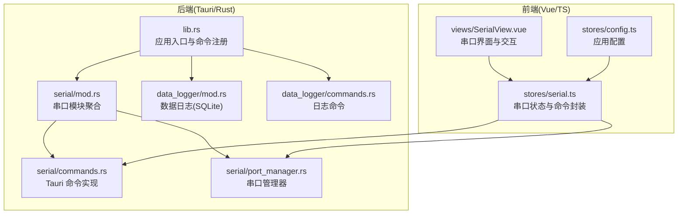
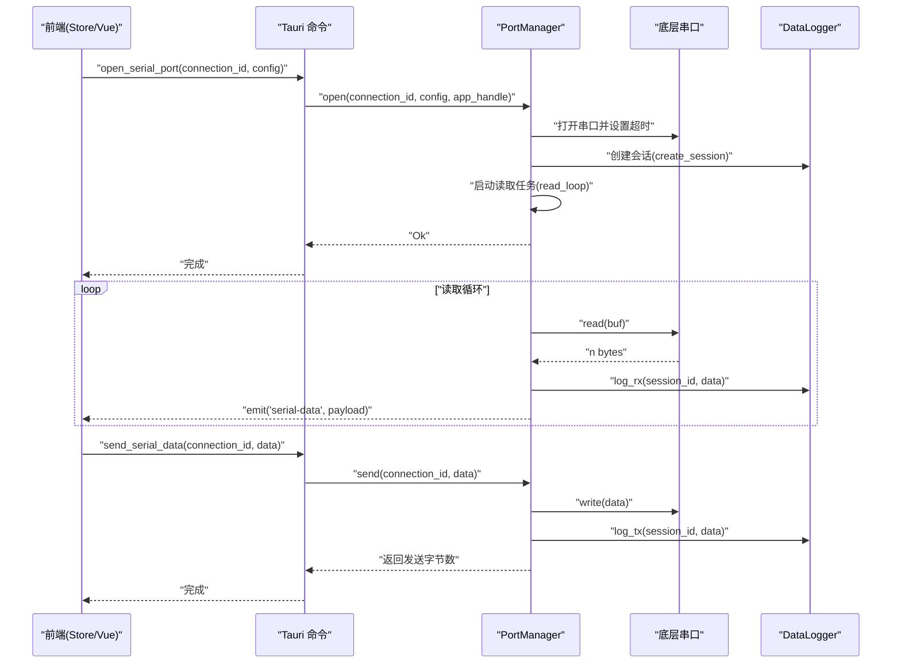
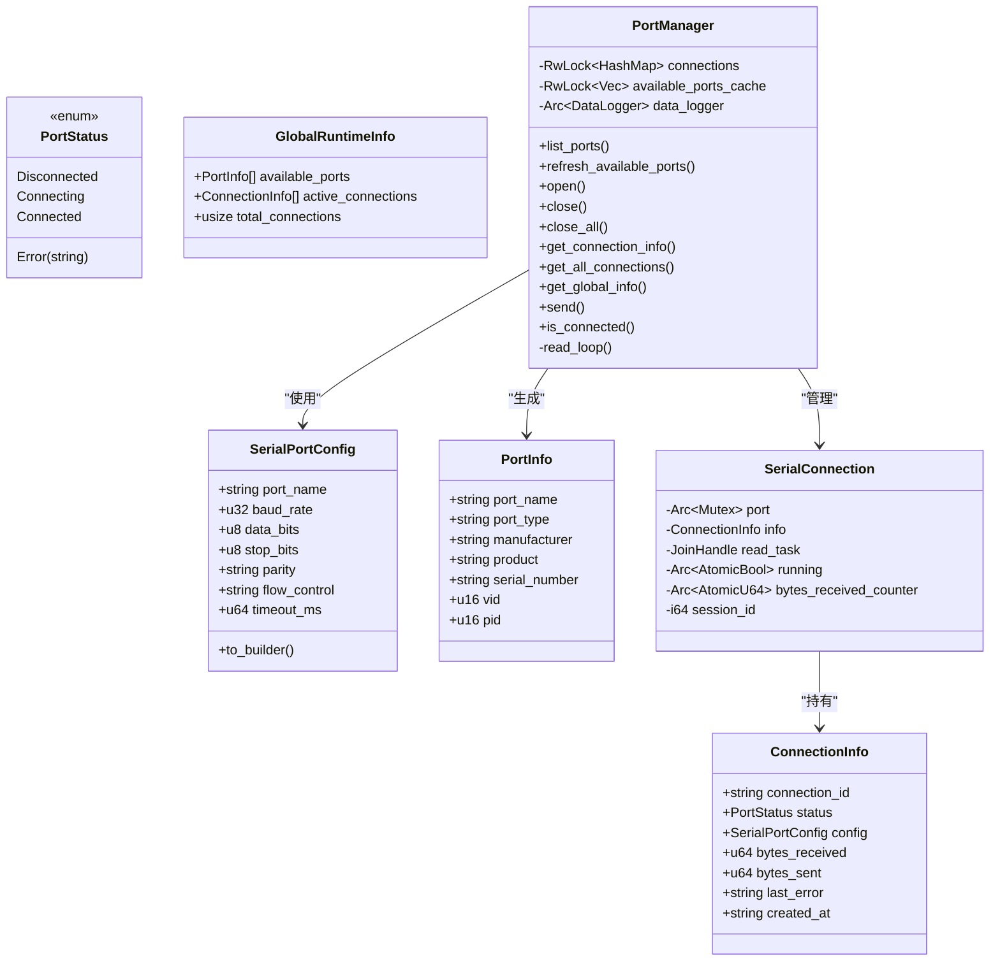
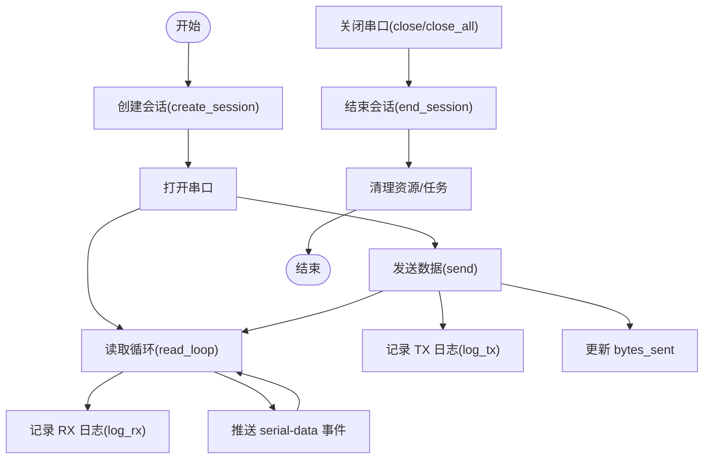
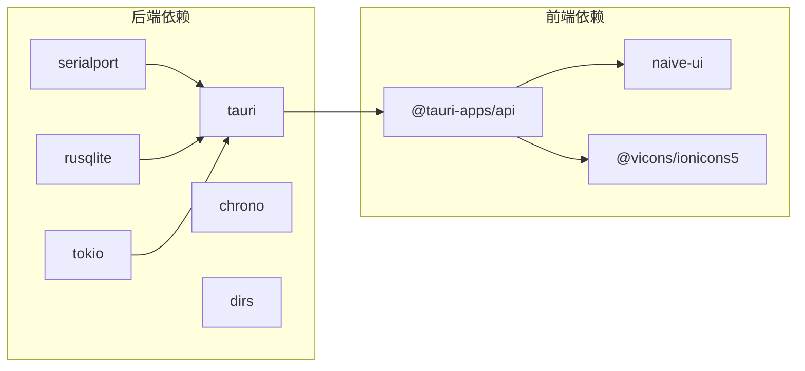

# 串口通信 API

<cite>
**本文引用的文件**
- [src-tauri/src/serial/mod.rs](file://src-tauri/src/serial/mod.rs)
- [src-tauri/src/serial/commands.rs](file://src-tauri/src/serial/commands.rs)
- [src-tauri/src/serial/port_manager.rs](file://src-tauri/src/serial/port_manager.rs)
- [src-tauri/src/lib.rs](file://src-tauri/src/lib.rs)
- [src-tauri/src/data_logger/mod.rs](file://src-tauri/src/data_logger/mod.rs)
- [src-tauri/src/data_logger/commands.rs](file://src-tauri/src/data_logger/commands.rs)
- [src-tauri/Cargo.toml](file://src-tauri/Cargo.toml)
- [src-tauri/tauri.conf.json](file://src-tauri/tauri.conf.json)
- [src/stores/serial.ts](file://src/stores/serial.ts)
- [src/views/SerialView.vue](file://src/views/SerialView.vue)
- [src/stores/config.ts](file://src/stores/config.ts)
</cite>

## 目录
1. [简介](#简介)
2. [项目结构](#项目结构)
3. [核心组件](#核心组件)
4. [架构总览](#架构总览)
5. [详细组件分析](#详细组件分析)
6. [依赖关系分析](#依赖关系分析)
7. [性能考量](#性能考量)
8. [故障排查指南](#故障排查指南)
9. [结论](#结论)
10. [附录：API 参考](#附录api-参考)

## 简介
本文件为 KonSerial 串口通信模块的详细 API 参考文档，覆盖 Tauri 命令接口、数据结构定义、异步与并发处理、错误处理机制以及连接生命周期管理。目标读者既包括需要快速上手的开发者，也包括希望深入理解实现细节的技术人员。

## 项目结构
后端采用 Rust + Tauri 架构，串口功能位于 src-tauri/src/serial 目录；前端使用 Vue 3 + TypeScript，串口状态与交互逻辑位于 src/stores/serial.ts 与 src/views/SerialView.vue。

**图表来源**
- [src-tauri/src/lib.rs:47-82](file://src-tauri/src/lib.rs#L47-L82)
- [src-tauri/src/serial/mod.rs:1-4](file://src-tauri/src/serial/mod.rs#L1-L4)
- [src-tauri/src/serial/commands.rs:1-129](file://src-tauri/src/serial/commands.rs#L1-L129)
- [src-tauri/src/serial/port_manager.rs:1-402](file://src-tauri/src/serial/port_manager.rs#L1-L402)
- [src-tauri/src/data_logger/mod.rs:1-273](file://src-tauri/src/data_logger/mod.rs#L1-L273)
- [src-tauri/src/data_logger/commands.rs:1-49](file://src-tauri/src/data_logger/commands.rs#L1-L49)
- [src/stores/serial.ts:1-363](file://src/stores/serial.ts#L1-L363)
- [src/views/SerialView.vue:1-746](file://src/views/SerialView.vue#L1-L746)
- [src/stores/config.ts:1-89](file://src/stores/config.ts#L1-L89)

**章节来源**
- [src-tauri/src/lib.rs:47-82](file://src-tauri/src/lib.rs#L47-L82)
- [src-tauri/src/serial/mod.rs:1-4](file://src-tauri/src/serial/mod.rs#L1-L4)
- [src/stores/serial.ts:1-363](file://src/stores/serial.ts#L1-L363)

## 核心组件
- 串口命令层：提供列出串口、打开/关闭串口、发送/接收数据、查询连接状态等命令。
- 串口管理器：负责多连接管理、读写循环、状态统计、错误上报与会话持久化。
- 数据日志：基于 SQLite 的会话与数据记录管理，支持查询、导出与删除。
- 前端状态与交互：封装 invoke 调用、事件监听、连接状态轮询、UI 行为控制。

**章节来源**
- [src-tauri/src/serial/commands.rs:1-129](file://src-tauri/src/serial/commands.rs#L1-L129)
- [src-tauri/src/serial/port_manager.rs:162-401](file://src-tauri/src/serial/port_manager.rs#L162-L401)
- [src-tauri/src/data_logger/mod.rs:47-273](file://src-tauri/src/data_logger/mod.rs#L47-L273)
- [src/stores/serial.ts:143-363](file://src/stores/serial.ts#L143-L363)

## 架构总览
后端通过 Tauri 将 Rust 命令暴露给前端 JS/TS 调用；串口管理器以互斥锁保护共享状态，使用 Tokio 异步运行读取任务；数据通过 Tauri 事件向前端推送原始字节，前端再进行解码与展示。

**图表来源**
- [src-tauri/src/serial/commands.rs:49-118](file://src-tauri/src/serial/commands.rs#L49-L118)
- [src-tauri/src/serial/port_manager.rs:196-303](file://src-tauri/src/serial/port_manager.rs#L196-L303)
- [src-tauri/src/data_logger/mod.rs:115-164](file://src-tauri/src/data_logger/mod.rs#L115-L164)
- [src/stores/serial.ts:157-274](file://src/stores/serial.ts#L157-L274)

## 详细组件分析

### 串口命令接口
以下命令均通过 Tauri 注册，前端可通过 invoke 调用。所有命令均为异步，返回 Result<T, String>，错误以字符串形式返回。

- 列出串口（简要）
  - 名称: list_serial_ports
  - 参数: 无
  - 返回: 成功时为串口名称数组；失败时为错误字符串
  - 用途: 快速获取可用串口名列表
  - 复杂度: O(n)，n 为系统枚举的串口数量

- 获取串口详细信息
  - 名称: get_serial_ports_info
  - 参数: 无
  - 返回: 成功时为包含名称与类型的数组；失败时为错误字符串
  - 用途: 展示带类型的串口列表（如 USB/PCI/蓝牙）

- 刷新可用串口列表（详细）
  - 名称: refresh_serial_ports
  - 参数: State<Arc<Mutex<PortManager>>>
  - 返回: 成功时为 PortInfo 数组；失败时为错误字符串
  - 用途: 更新并返回详细串口信息（含厂商、产品、VID/PID 等）

- 打开串口
  - 名称: open_serial_port
  - 参数:
    - connection_id: 连接标识符（字符串）
    - config: SerialPortConfig（完整串口配置）
  - 返回: 成功时 Ok；失败时错误字符串
  - 并发: 通过 Mutex 保护 PortManager，避免重复打开同一连接 ID
  - 错误: 若连接已存在或底层串口打开失败则返回错误

- 关闭指定串口
  - 名称: close_serial_port
  - 参数:
    - connection_id: 连接标识符
  - 返回: 成功时 Ok；失败时错误字符串
  - 行为: 停止读取任务、结束会话、释放资源

- 关闭所有串口
  - 名称: close_all_serial_ports
  - 参数: 无
  - 返回: Ok
  - 行为: 遍历并关闭所有连接

- 获取指定连接状态
  - 名称: get_connection_info
  - 参数:
    - connection_id: 连接标识符
  - 返回: 成功时 ConnectionInfo；失败时错误字符串
  - 注意: 返回的 bytes_received 为实时计数

- 获取所有连接状态
  - 名称: get_all_connections
  - 参数: 无
  - 返回: 成功时 ConnectionInfo 数组

- 获取全局运行时信息
  - 名称: get_global_runtime_info
  - 参数: 无
  - 返回: GlobalRuntimeInfo（包含可用串口、活跃连接、总数）

- 发送数据
  - 名称: send_serial_data
  - 参数:
    - connection_id: 连接标识符
    - data: 字节数组
  - 返回: 成功时发送字节数；失败时错误字符串
  - 行为: 写入底层串口并持久化 TX 记录

- 检查连接状态
  - 名称: is_serial_connected
  - 参数:
    - connection_id: 连接标识符
  - 返回: true/false

**章节来源**
- [src-tauri/src/serial/commands.rs:15-129](file://src-tauri/src/serial/commands.rs#L15-L129)

### 串口管理器与数据结构
- SerialPortConfig（完整配置）
  - 字段: port_name, baud_rate, data_bits, stop_bits, parity, flow_control, timeout_ms
  - 说明: 用于构建底层串口实例；支持数据位、停止位、校验与流控映射

- PortStatus（连接状态）
  - 枚举: Disconnected, Connecting, Connected, Error(String)

- ConnectionInfo（连接运行时信息）
  - 字段: connection_id, status, config, bytes_received, bytes_sent, last_error, created_at

- PortInfo（串口详细信息）
  - 字段: port_name, port_type, manufacturer, product, serial_number, vid, pid

- GlobalRuntimeInfo（全局运行时）
  - 字段: available_ports, active_connections, total_connections

- SerialConnection（内部连接对象）
  - 字段: port, info, read_task, running, bytes_received_counter, session_id

- 读取循环与事件推送
  - 使用 tokio::task::spawn_blocking 运行 read_loop
  - 每次读取后持久化 RX 数据并 emit "serial-data" 事件
  - 读取超时设置为 100ms，便于及时响应关闭信号

- 发送流程
  - 加锁访问串口，写入数据并更新 bytes_sent
  - 持久化 TX 记录；若写入失败，更新状态与 last_error

- 关闭流程
  - 标记 running=false，终止读取任务，结束会话

**图表来源**
- [src-tauri/src/serial/port_manager.rs:16-124](file://src-tauri/src/serial/port_manager.rs#L16-L124)
- [src-tauri/src/serial/port_manager.rs:161-171](file://src-tauri/src/serial/port_manager.rs#L161-L171)
- [src-tauri/src/serial/port_manager.rs:274-303](file://src-tauri/src/serial/port_manager.rs#L274-L303)

**章节来源**
- [src-tauri/src/serial/port_manager.rs:16-124](file://src-tauri/src/serial/port_manager.rs#L16-L124)
- [src-tauri/src/serial/port_manager.rs:161-401](file://src-tauri/src/serial/port_manager.rs#L161-L401)

### 数据日志模块
- DataLogger 提供会话与数据记录的 CRUD 能力，基于 SQLite，启用 WAL 与外键约束。
- 支持创建会话、结束会话、记录 RX/TX、查询会话列表、查询会话数据、删除会话、导出 CSV。
- 会话与数据记录通过外键关联，删除会话会级联清理数据。

**图表来源**
- [src-tauri/src/serial/port_manager.rs:196-303](file://src-tauri/src/serial/port_manager.rs#L196-L303)
- [src-tauri/src/data_logger/mod.rs:115-164](file://src-tauri/src/data_logger/mod.rs#L115-L164)

**章节来源**
- [src-tauri/src/data_logger/mod.rs:47-273](file://src-tauri/src/data_logger/mod.rs#L47-L273)
- [src-tauri/src/data_logger/commands.rs:1-49](file://src-tauri/src/data_logger/commands.rs#L1-L49)

### 前端集成与最佳实践
- 前端通过 stores/serial.ts 封装 invoke 调用，统一错误处理与状态更新。
- 使用 Tauri 事件 "serial-data" 接收原始字节，前端自行解码（如 UTF-8/GBK）。
- 建议:
  - 为每个连接生成唯一 connection_id
  - 使用 updateGlobalInfo() 或定时轮询获取最新状态
  - 发送十六进制数据时，先解析为字节数组再调用 send_serial_data
  - 在组件卸载时停止事件监听与轮询

**章节来源**
- [src/stores/serial.ts:143-363](file://src/stores/serial.ts#L143-L363)
- [src/views/SerialView.vue:234-253](file://src/views/SerialView.vue#L234-L253)

## 依赖关系分析
- 后端依赖:
  - tauri、tokio、serialport、rusqlite、chrono、dirs 等
- 前端依赖:
  - @tauri-apps/api（invoke、事件监听）
  - naive-ui、@vicons/ionicons5 等 UI 组件

**图表来源**
- [src-tauri/Cargo.toml:20-40](file://src-tauri/Cargo.toml#L20-L40)
- [src-tauri/tauri.conf.json:1-47](file://src-tauri/tauri.conf.json#L1-L47)

**章节来源**
- [src-tauri/Cargo.toml:20-40](file://src-tauri/Cargo.toml#L20-L40)
- [src-tauri/tauri.conf.json:1-47](file://src-tauri/tauri.conf.json#L1-L47)

## 性能考量
- 读取循环使用 100ms 超时，平衡吞吐与响应性。
- 使用 tokio::task::spawn_blocking 执行阻塞读取，避免阻塞主线程。
- 通过 AtomicU64 原子计数统计收发字节，减少锁竞争。
- SQLite 使用 WAL 模式与外键约束，提升并发与一致性。
- 前端接收缓冲区可配置上限，防止内存膨胀。

[本节为通用性能建议，不直接分析具体文件]

## 故障排查指南
- 打开串口失败
  - 检查 port_name 是否正确、权限是否足够、设备是否被占用
  - 查看 last_error 字段与日志输出
- 发送失败
  - 检查连接状态是否为 Connected
  - 查看底层串口错误信息（字符串）
- 无数据到达
  - 确认波特率、数据位、停止位、校验一致
  - 检查读取循环是否仍在运行
- 事件未收到
  - 确认已调用 startSerialDataListener 并未被重复监听
  - 检查前端 onSerialData 回调是否注册

**章节来源**
- [src-tauri/src/serial/port_manager.rs:274-303](file://src-tauri/src/serial/port_manager.rs#L274-L303)
- [src/stores/serial.ts:297-332](file://src/stores/serial.ts#L297-L332)

## 结论
该串口通信模块以清晰的分层设计实现了多连接管理、异步读写、事件推送与持久化记录。通过 Tauri 将 Rust 的高性能与前端的易用性结合，提供了稳定可靠的串口调试能力。遵循本文档的 API 使用规范与最佳实践，可在保证并发安全的同时获得良好的性能与可观测性。

[本节为总结性内容，不直接分析具体文件]

## 附录：API 参考

### 串口命令一览
- list_serial_ports
  - 输入: 无
  - 输出: 成功时为串口名称数组；失败时为错误字符串
- get_serial_ports_info
  - 输入: 无
  - 输出: 成功时为包含名称与类型的数组；失败时为错误字符串
- refresh_serial_ports
  - 输入: State<Arc<Mutex<PortManager>>>
  - 输出: 成功时为 PortInfo 数组；失败时为错误字符串
- open_serial_port
  - 输入: connection_id: string, config: SerialPortConfig
  - 输出: 成功时 Ok；失败时错误字符串
- close_serial_port
  - 输入: connection_id: string
  - 输出: 成功时 Ok；失败时错误字符串
- close_all_serial_ports
  - 输入: 无
  - 输出: Ok
- get_connection_info
  - 输入: connection_id: string
  - 输出: 成功时 ConnectionInfo；失败时错误字符串
- get_all_connections
  - 输入: 无
  - 输出: 成功时 ConnectionInfo 数组
- get_global_runtime_info
  - 输入: 无
  - 输出: GlobalRuntimeInfo
- send_serial_data
  - 输入: connection_id: string, data: number[]（字节）
  - 输出: 成功时发送字节数；失败时错误字符串
- is_serial_connected
  - 输入: connection_id: string
  - 输出: true/false

**章节来源**
- [src-tauri/src/serial/commands.rs:15-129](file://src-tauri/src/serial/commands.rs#L15-L129)

### 数据结构定义
- SerialPortConfig
  - 字段: port_name, baud_rate, data_bits, stop_bits, parity, flow_control, timeout_ms
  - 说明: 用于构建底层串口实例
- ConnectionInfo
  - 字段: connection_id, status, config, bytes_received, bytes_sent, last_error, created_at
- PortInfo
  - 字段: port_name, port_type, manufacturer, product, serial_number, vid, pid
- GlobalRuntimeInfo
  - 字段: available_ports, active_connections, total_connections
- PortStatus
  - 枚举: Disconnected, Connecting, Connected, Error(String)

**章节来源**
- [src-tauri/src/serial/port_manager.rs:16-124](file://src-tauri/src/serial/port_manager.rs#L16-L124)

### 前端调用示例与最佳实践
- 生成连接 ID 并打开串口
  - 使用 generateConnectionId() 生成唯一 ID
  - 调用 openSerialPort(connectionId, config)，随后 updateGlobalInfo()
- 发送数据
  - 十六进制: 将输入按两位解析为字节数组后调用 send_serial_data
  - 文本: 使用 TextEncoder 编码为字节数组
- 接收数据
  - 调用 startSerialDataListener() 注册 "serial-data" 事件
  - 在回调中使用 TextDecoder 解码为文本或自行处理十六进制显示
- 生命周期管理
  - 组件挂载时启动轮询与事件监听
  - 组件卸载时停止轮询与事件监听，关闭活动连接

**章节来源**
- [src/stores/serial.ts:143-363](file://src/stores/serial.ts#L143-L363)
- [src/views/SerialView.vue:234-253](file://src/views/SerialView.vue#L234-L253)