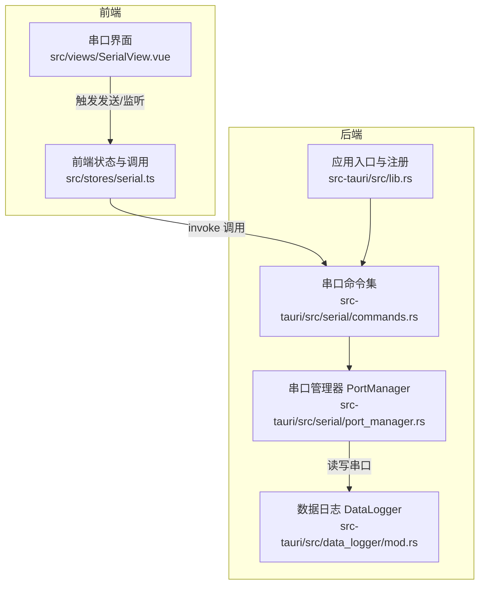
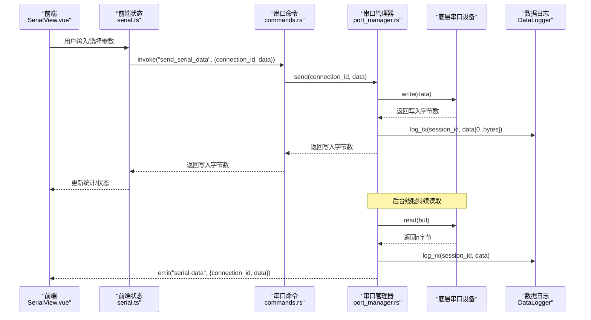
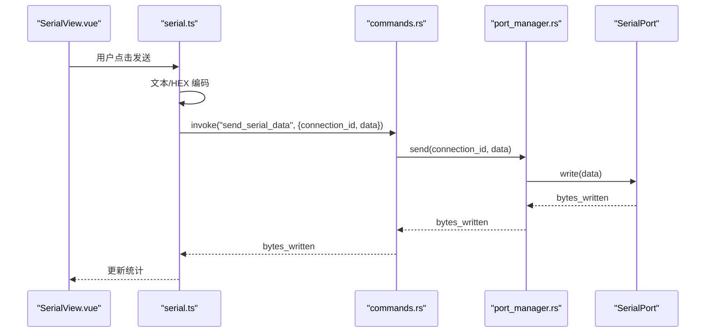
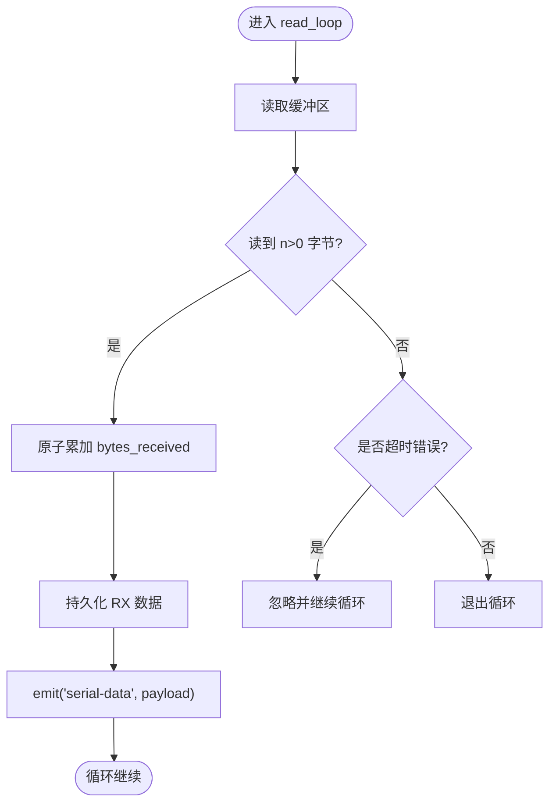
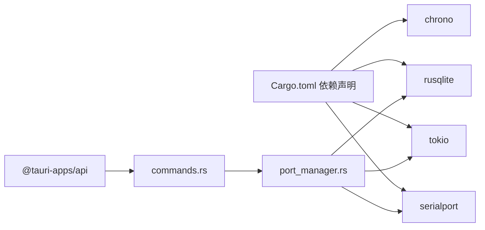

# 数据收发传输

<cite>
**本文引用的文件**
- [src-tauri/src/serial/mod.rs](file://src-tauri/src/serial/mod.rs)
- [src-tauri/src/serial/commands.rs](file://src-tauri/src/serial/commands.rs)
- [src-tauri/src/serial/port_manager.rs](file://src-tauri/src/serial/port_manager.rs)
- [src-tauri/src/serial/data_process.rs](file://src-tauri/src/serial/data_process.rs)
- [src-tauri/src/serial/protocol.rs](file://src-tauri/src/serial/protocol.rs)
- [src-tauri/src/lib.rs](file://src-tauri/src/lib.rs)
- [src-tauri/src/main.rs](file://src-tauri/src/main.rs)
- [src-tauri/src/data_logger/mod.rs](file://src-tauri/src/data_logger/mod.rs)
- [src-tauri/src/data_logger/commands.rs](file://src-tauri/src/data_logger/commands.rs)
- [src-tauri/Cargo.toml](file://src-tauri/Cargo.toml)
- [src/stores/serial.ts](file://src/stores/serial.ts)
- [src/views/SerialView.vue](file://src/views/SerialView.vue)
- [DESIGN.md](file://DESIGN.md)
</cite>

## 目录
1. [简介](#简介)
2. [项目结构](#项目结构)
3. [核心组件](#核心组件)
4. [架构总览](#架构总览)
5. [详细组件分析](#详细组件分析)
6. [依赖关系分析](#依赖关系分析)
7. [性能考量](#性能考量)
8. [故障排查指南](#故障排查指南)
9. [结论](#结论)
10. [附录](#附录)

## 简介
本文件聚焦“串口数据传输”能力，围绕 Tauri 前端与 Rust 后端之间的数据收发 API，系统阐述以下内容：
- 数据发送与接收的核心命令与调用流程
- 数据格式转换、编码解码与缓冲区管理
- 异步处理机制、错误处理与重试策略
- 大数据量传输优化与内存管理
- 实际使用示例与性能调优建议
- 数据完整性校验与错误检测机制

## 项目结构
后端采用 Rust + Tauri，前端采用 Vue3 + TypeScript。串口相关逻辑集中于后端的 serial 模块，并通过 Tauri 命令暴露给前端；数据持久化由 DataLogger 模块负责。

**图表来源**
- [src-tauri/src/lib.rs:47-82](file://src-tauri/src/lib.rs#L47-L82)
- [src-tauri/src/serial/commands.rs:16-129](file://src-tauri/src/serial/commands.rs#L16-L129)
- [src-tauri/src/serial/port_manager.rs:196-303](file://src-tauri/src/serial/port_manager.rs#L196-L303)
- [src-tauri/src/data_logger/mod.rs:115-164](file://src-tauri/src/data_logger/mod.rs#L115-L164)

**章节来源**
- [src-tauri/src/lib.rs:25-84](file://src-tauri/src/lib.rs#L25-L84)
- [src-tauri/src/serial/mod.rs:1-4](file://src-tauri/src/serial/mod.rs#L1-L4)

## 核心组件
- 串口命令层：提供 list/refresh/open/close/send/is_connected 等命令，供前端调用。
- 串口管理器：负责串口打开、读取循环、发送、状态统计与生命周期管理。
- 数据日志：负责会话管理、RX/TX 数据持久化与查询。
- 前端状态与 UI：负责数据编码/解码、缓冲区管理、事件监听与 UI 展示。

**章节来源**
- [src-tauri/src/serial/commands.rs:16-129](file://src-tauri/src/serial/commands.rs#L16-L129)
- [src-tauri/src/serial/port_manager.rs:196-392](file://src-tauri/src/serial/port_manager.rs#L196-L392)
- [src-tauri/src/data_logger/mod.rs:115-164](file://src-tauri/src/data_logger/mod.rs#L115-L164)
- [src/stores/serial.ts:242-274](file://src/stores/serial.ts#L242-L274)

## 架构总览
下图展示了从前端到后端再到硬件的完整数据通路，以及异步读取、事件推送与持久化的关键节点。

**图表来源**
- [src-tauri/src/serial/commands.rs:109-118](file://src-tauri/src/serial/commands.rs#L109-L118)
- [src-tauri/src/serial/port_manager.rs:274-303](file://src-tauri/src/serial/port_manager.rs#L274-L303)
- [src-tauri/src/data_logger/mod.rs:144-164](file://src-tauri/src/data_logger/mod.rs#L144-L164)
- [src/stores/serial.ts:312-332](file://src/stores/serial.ts#L312-L332)

## 详细组件分析

### 1) 发送数据 API：send_serial_data
- 命令签名：invoke("send_serial_data", { connection_id, data: number[] })
- 后端实现要点：
  - 通过 PortManager::send 查找连接并锁定串口句柄
  - 调用底层串口 write 并统计 bytes_sent
  - 成功时持久化 TX 数据；失败时更新 PortStatus::Error 并返回错误
- 前端调用示例（文本/十六进制）：
  - 文本模式：将字符串编码为字节数组
  - 十六进制模式：将 "AB CD EF" 解析为 [0xAB, 0xCD, 0xEF]
- 性能与可靠性：
  - 发送为同步阻塞 IO，但通过锁粒度最小化并发竞争
  - 失败时立即返回错误，避免上层无限等待

**图表来源**
- [src/stores/serial.ts:242-274](file://src/stores/serial.ts#L242-L274)
- [src-tauri/src/serial/commands.rs:109-118](file://src-tauri/src/serial/commands.rs#L109-L118)
- [src-tauri/src/serial/port_manager.rs:369-392](file://src-tauri/src/serial/port_manager.rs#L369-L392)

**章节来源**
- [src-tauri/src/serial/commands.rs:109-118](file://src-tauri/src/serial/commands.rs#L109-L118)
- [src-tauri/src/serial/port_manager.rs:369-392](file://src-tauri/src/serial/port_manager.rs#L369-L392)
- [src/stores/serial.ts:242-274](file://src/stores/serial.ts#L242-L274)

### 2) 接收数据流：异步读取与事件推送
- 后端在 open 时克隆串口并设置短超时，启动独立线程执行 read_loop
- 读取到 n>0 的数据后：
  - 原子计数 bytes_received
  - 持久化 RX 数据
  - 通过 Tauri 事件 "serial-data" 推送 { connection_id, data: number[] } 给前端
- 前端监听并解码为文本，同时写入全局接收缓冲区

**图表来源**
- [src-tauri/src/serial/port_manager.rs:274-303](file://src-tauri/src/serial/port_manager.rs#L274-L303)
- [src/stores/serial.ts:312-332](file://src/stores/serial.ts#L312-L332)

**章节来源**
- [src-tauri/src/serial/port_manager.rs:274-303](file://src-tauri/src/serial/port_manager.rs#L274-L303)
- [src/stores/serial.ts:312-332](file://src/stores/serial.ts#L312-L332)

### 3) 数据格式转换与编码解码
- 前端编码：
  - 文本模式：UTF-8/GBK 等编码为字节数组
  - 十六进制模式：按两位解析为字节
- 前端解码：
  - 接收时使用 TextDecoder 按所选编码解码为字符串
- 后端不参与编码/解码，仅处理字节流

**章节来源**
- [src/stores/serial.ts:242-274](file://src/stores/serial.ts#L242-L274)
- [src/views/SerialView.vue:238-244](file://src/views/SerialView.vue#L238-L244)

### 4) 缓冲区管理
- 前端：
  - 全局接收缓冲区 receivedBuffer，受 maxBufferSize 限制，超过上限丢弃最早元素
  - 本地终端显示缓冲区 receivedData，同样受 maxBufferSize 影响
- 后端：
  - 读取缓冲区固定 1024 字节，按实际读到的 n 分片使用
  - 无发送队列，write 为一次性写入

**章节来源**
- [src/stores/serial.ts:96-117](file://src/stores/serial.ts#L96-L117)
- [src-tauri/src/serial/port_manager.rs:284-285](file://src-tauri/src/serial/port_manager.rs#L284-L285)

### 5) 错误处理与重试策略
- 发送失败：PortStatus 更新为 Error，last_error 记录，返回错误字符串
- 接收失败：read_loop 遇到非超时错误则退出循环
- 重试策略：当前未实现自动重试；建议上层在 UI 层根据 last_error 提示用户重连或调整参数

**章节来源**
- [src-tauri/src/serial/port_manager.rs:382-388](file://src-tauri/src/serial/port_manager.rs#L382-L388)
- [src-tauri/src/serial/port_manager.rs:298-301](file://src-tauri/src/serial/port_manager.rs#L298-L301)

### 6) 数据完整性与错误检测
- 数据完整性：
  - 通过 DataLogger 对每个会话记录 TX/RX 数据，支持导出 CSV 交叉比对
  - 会话统计包含 RX/TX 字节计数，可用于粗略校验
- 错误检测：
  - 发送错误通过 PortStatus.Error 与 last_error 暴露
  - 接收超时被忽略，非超时错误触发退出
- 建议：
  - 在应用层引入 CRC/校验和字段并在协议层实现
  - 使用 DataLogger 的会话查询与导出进行离线验证

**章节来源**
- [src-tauri/src/data_logger/mod.rs:115-164](file://src-tauri/src/data_logger/mod.rs#L115-L164)
- [src-tauri/src/serial/port_manager.rs:382-388](file://src-tauri/src/serial/port_manager.rs#L382-L388)

### 7) 大数据量传输优化与内存管理
- 优化建议：
  - 前端：降低 maxBufferSize 或按需清空；必要时启用虚拟滚动
  - 后端：增大读取缓冲区（如 4KB/8KB），减少系统调用次数
  - 发送：上层拆分为小包发送，避免单次 write 过大导致阻塞
- 内存管理：
  - 读取循环使用固定大小缓冲区，避免频繁分配
  - 前端接收缓冲区采用 FIFO 滑动窗口，防止 OOM

**章节来源**
- [src-tauri/src/serial/port_manager.rs:284-285](file://src-tauri/src/serial/port_manager.rs#L284-L285)
- [src/stores/serial.ts:108-112](file://src/stores/serial.ts#L108-L112)

### 8) 实际使用示例与最佳实践
- 发送示例（文本/十六进制）：
  - 文本：直接传入字符串，后端按 UTF-8 编码为字节
  - 十六进制：传入 "AA BB CC"，前端解析为 [0xAA, 0xBB, 0xCC]
- 接收示例：
  - 前端监听 "serial-data" 事件，按所选编码解码为文本
  - 同步写入全局接收缓冲区，供波形图等组件消费
- 最佳实践：
  - 发送前检查连接状态（is_serial_connected）
  - 大批量发送时分批发送并观察 bytes_sent
  - 出错时查看 last_error 并重新打开串口

**章节来源**
- [src/stores/serial.ts:242-274](file://src/stores/serial.ts#L242-L274)
- [src/stores/serial.ts:312-332](file://src/stores/serial.ts#L312-L332)
- [src-tauri/src/serial/commands.rs:120-129](file://src-tauri/src/serial/commands.rs#L120-L129)

## 依赖关系分析
- 后端依赖：
  - serialport：串口底层通信
  - tokio：异步运行时与任务管理
  - rusqlite：SQLite 数据持久化
  - chrono：时间戳
- 前端依赖：
  - @tauri-apps/api：与后端命令通信
  - naive-ui：UI 组件库

**图表来源**
- [src-tauri/Cargo.toml:20-40](file://src-tauri/Cargo.toml#L20-L40)
- [src-tauri/src/serial/commands.rs:16-129](file://src-tauri/src/serial/commands.rs#L16-L129)
- [src-tauri/src/serial/port_manager.rs:196-303](file://src-tauri/src/serial/port_manager.rs#L196-L303)

**章节来源**
- [src-tauri/Cargo.toml:20-40](file://src-tauri/Cargo.toml#L20-L40)

## 性能考量
- 读取性能：
  - 固定 1024 字节缓冲区，n>0 时才推送，减少事件风暴
  - 100ms 超时确保及时响应关闭信号
- 发送性能：
  - 单次 write，避免复杂队列；建议上层做分包
- 存储性能：
  - SQLite WAL + NORMAL 同步模式，兼顾性能与可靠性
  - 会话结束自动清理，避免数据膨胀

**章节来源**
- [src-tauri/src/serial/port_manager.rs:225-226](file://src-tauri/src/serial/port_manager.rs#L225-L226)
- [src-tauri/src/data_logger/mod.rs:76-82](file://src-tauri/src/data_logger/mod.rs#L76-L82)

## 故障排查指南
- 常见问题与定位：
  - 打开串口失败：检查端口占用、权限与配置参数
  - 发送无响应：确认连接状态、波特率与线序
  - 接收卡住：检查超时设置与硬件流控
- 建议步骤：
  - 使用 get_connection_info/get_global_runtime_info 查看状态
  - 重新 open 并观察 last_error
  - 使用 DataLogger 导出 CSV 核对 TX/RX 是否匹配

**章节来源**
- [src-tauri/src/serial/commands.rs:82-107](file://src-tauri/src/serial/commands.rs#L82-L107)
- [src-tauri/src/data_logger/commands.rs:7-49](file://src-tauri/src/data_logger/commands.rs#L7-L49)

## 结论
本项目以简洁可靠的架构实现了串口数据的发送与接收：前端专注 UI 与格式转换，后端专注异步读写与持久化。通过明确的命令接口、事件推送与会话日志，既满足日常调试场景，也为后续扩展协议解析与完整性校验提供了清晰路径。

## 附录
- 相关设计文档与背景参考可参阅项目设计文档中的串口通信章节。

**章节来源**
- [DESIGN.md:274-565](file://DESIGN.md#L274-L565)