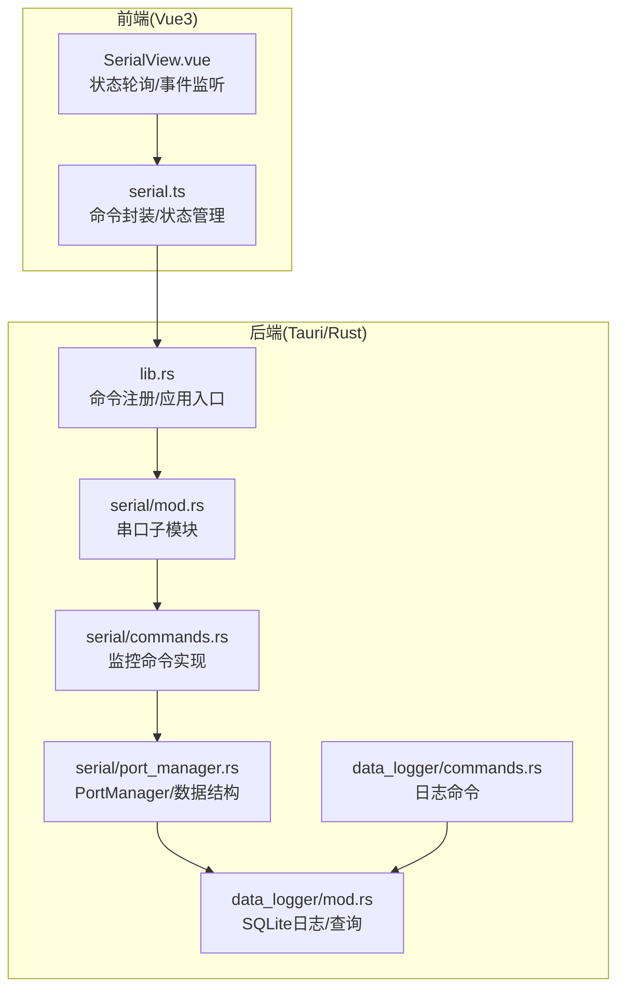
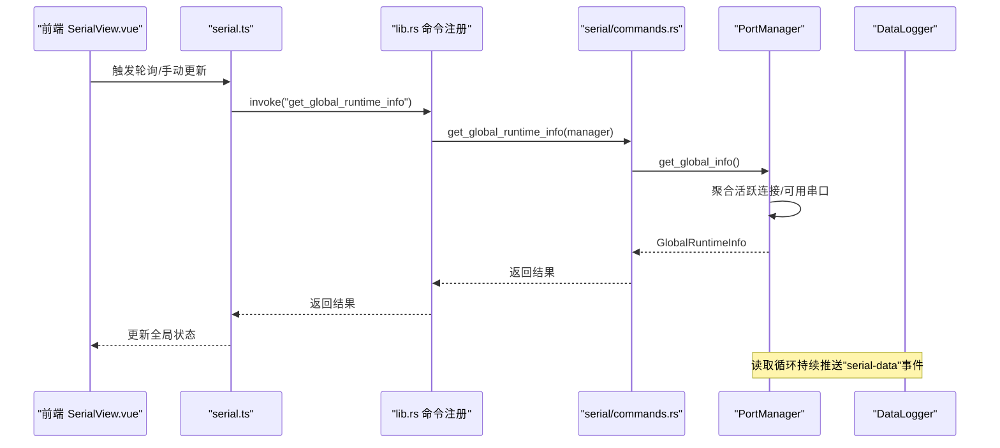
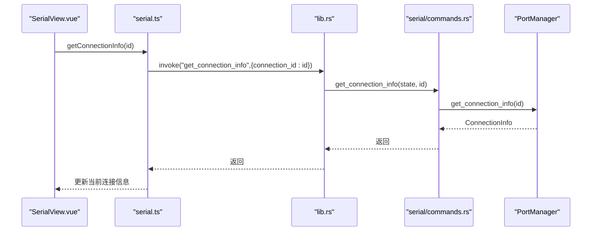
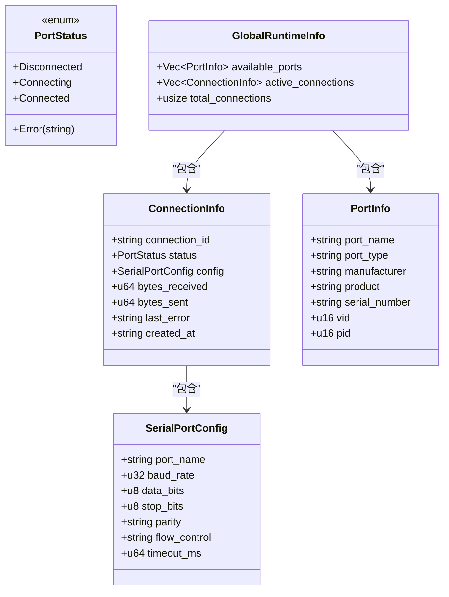
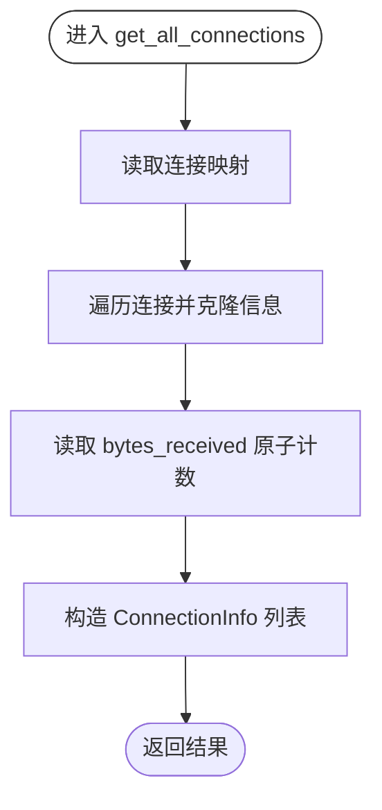
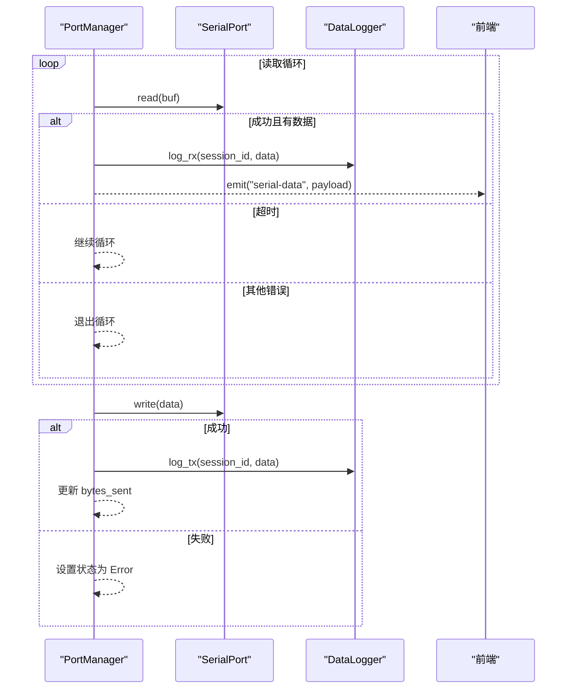
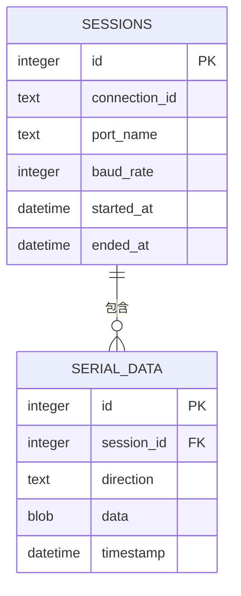
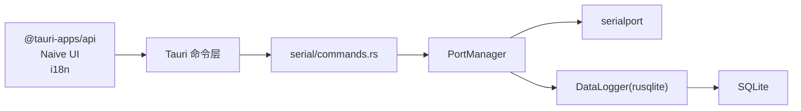

# 运行时监控

<cite>
**本文引用的文件**
- [src-tauri/src/lib.rs](file://src-tauri/src/lib.rs)
- [src-tauri/src/main.rs](file://src-tauri/src/main.rs)
- [src-tauri/src/serial/mod.rs](file://src-tauri/src/serial/mod.rs)
- [src-tauri/src/serial/commands.rs](file://src-tauri/src/serial/commands.rs)
- [src-tauri/src/serial/port_manager.rs](file://src-tauri/src/serial/port_manager.rs)
- [src-tauri/src/data_logger/mod.rs](file://src-tauri/src/data_logger/mod.rs)
- [src-tauri/src/data_logger/commands.rs](file://src-tauri/src/data_logger/commands.rs)
- [src/stores/serial.ts](file://src/stores/serial.ts)
- [src/views/SerialView.vue](file://src/views/SerialView.vue)
- [DESIGN.md](file://DESIGN.md)
- [README.md](file://README.md)
</cite>

## 目录
1. [简介](#简介)
2. [项目结构](#项目结构)
3. [核心组件](#核心组件)
4. [架构总览](#架构总览)
5. [详细组件分析](#详细组件分析)
6. [依赖关系分析](#依赖关系分析)
7. [性能考量](#性能考量)
8. [故障排查指南](#故障排查指南)
9. [结论](#结论)
10. [附录](#附录)

## 简介
本文件面向串口运行时监控功能，围绕 get_connection_info、get_all_connections、get_global_runtime_info 等监控命令，系统化梳理运行时信息获取与状态监控的 API 定义、数据结构、实现细节与最佳实践。文档同时涵盖连接统计、性能指标采集、异常状态检测、监控数据存储与查询优化策略，并提供运行时故障诊断与性能分析的实用指南。

## 项目结构
KonSerial 采用 Tauri + Vue3 + Rust 的前后端分离架构。后端以 Rust 实现串口管理、数据日志与监控接口；前端通过 Tauri 命令与后端交互，实时展示串口状态、统计数据与可视化图表。

**图表来源**
- [src-tauri/src/lib.rs:47-82](file://src-tauri/src/lib.rs#L47-L82)
- [src-tauri/src/serial/mod.rs:1-4](file://src-tauri/src/serial/mod.rs#L1-L4)
- [src-tauri/src/serial/commands.rs:1-129](file://src-tauri/src/serial/commands.rs#L1-L129)
- [src-tauri/src/serial/port_manager.rs:162-401](file://src-tauri/src/serial/port_manager.rs#L162-L401)
- [src-tauri/src/data_logger/mod.rs:47-273](file://src-tauri/src/data_logger/mod.rs#L47-L273)
- [src-tauri/src/data_logger/commands.rs:1-49](file://src-tauri/src/data_logger/commands.rs#L1-L49)

**章节来源**
- [src-tauri/src/lib.rs:25-82](file://src-tauri/src/lib.rs#L25-L82)
- [src-tauri/src/main.rs:4-7](file://src-tauri/src/main.rs#L4-L7)
- [DESIGN.md:101-139](file://DESIGN.md#L101-L139)

## 核心组件
- 监控命令层
  - get_connection_info：按连接 ID 返回单个连接的运行时信息
  - get_all_connections：返回所有活跃连接的运行时信息
  - get_global_runtime_info：返回全局运行时信息（可用串口、活跃连接、总数）
- 数据结构层
  - ConnectionInfo：单连接运行时信息（状态、配置、收发字节、错误、创建时间）
  - GlobalRuntimeInfo：全局运行时信息（可用串口、活跃连接、总数）
  - PortInfo：串口详细信息（类型、厂商、产品、序列号、VID/PID）
  - SerialPortConfig：串口完整配置（波特率、数据位、停止位、校验、流控、超时）
- 管理与日志层
  - PortManager：多连接管理、读取循环、发送/关闭、状态聚合
  - DataLogger：SQLite 存储、会话管理、数据写入、查询与导出

**章节来源**
- [src-tauri/src/serial/commands.rs:81-107](file://src-tauri/src/serial/commands.rs#L81-L107)
- [src-tauri/src/serial/port_manager.rs:78-124](file://src-tauri/src/serial/port_manager.rs#L78-L124)
- [src-tauri/src/serial/port_manager.rs:107-112](file://src-tauri/src/serial/port_manager.rs#L107-L112)
- [src-tauri/src/serial/port_manager.rs:115-124](file://src-tauri/src/serial/port_manager.rs#L115-L124)
- [src-tauri/src/serial/port_manager.rs:17-64](file://src-tauri/src/serial/port_manager.rs#L17-L64)
- [src-tauri/src/serial/port_manager.rs:162-401](file://src-tauri/src/serial/port_manager.rs#L162-L401)
- [src-tauri/src/data_logger/mod.rs:47-273](file://src-tauri/src/data_logger/mod.rs#L47-L273)

## 架构总览
后端通过 Tauri 命令暴露监控接口，前端通过 invoke 调用并轮询更新全局状态。串口数据通过事件实时推送至前端，同时持久化到 SQLite。

**图表来源**
- [src-tauri/src/lib.rs:56-80](file://src-tauri/src/lib.rs#L56-L80)
- [src-tauri/src/serial/commands.rs:100-107](file://src-tauri/src/serial/commands.rs#L100-L107)
- [src-tauri/src/serial/port_manager.rs:356-367](file://src-tauri/src/serial/port_manager.rs#L356-L367)
- [src-tauri/src/serial/port_manager.rs:274-303](file://src-tauri/src/serial/port_manager.rs#L274-L303)
- [src/views/SerialView.vue:234-247](file://src/views/SerialView.vue#L234-L247)

## 详细组件分析

### 监控命令 API 定义与使用
- get_connection_info(connection_id)
  - 参数：connection_id（字符串）
  - 返回：ConnectionInfo
  - 用途：查询指定连接的实时状态与统计
- get_all_connections()
  - 返回：Vec<ConnectionInfo>
  - 用途：获取所有活跃连接的运行时信息
- get_global_runtime_info()
  - 返回：GlobalRuntimeInfo
  - 用途：获取全局运行时概览（可用串口、活跃连接、总数）

调用流程（以 get_connection_info 为例）：

**图表来源**
- [src/views/SerialView.vue:224-231](file://src/views/SerialView.vue#L224-L231)
- [src/stores/serial.ts:224-231](file://src/stores/serial.ts#L224-L231)
- [src-tauri/src/serial/commands.rs:81-89](file://src-tauri/src/serial/commands.rs#L81-L89)
- [src-tauri/src/serial/port_manager.rs:333-344](file://src-tauri/src/serial/port_manager.rs#L333-L344)

**章节来源**
- [src-tauri/src/serial/commands.rs:81-107](file://src-tauri/src/serial/commands.rs#L81-L107)
- [src/stores/serial.ts:224-240](file://src/stores/serial.ts#L224-L240)
- [src/views/SerialView.vue:224-231](file://src/views/SerialView.vue#L224-L231)

### 数据结构定义与字段说明
- ConnectionInfo
  - connection_id：连接标识符
  - status：端口状态（断开/连接中/已连接/错误）
  - config：SerialPortConfig 完整配置
  - bytes_received/bytes_sent：累计收发字节数
  - last_error：最近一次错误信息
  - created_at：连接创建时间戳
- GlobalRuntimeInfo
  - available_ports：可用串口列表（PortInfo）
  - active_connections：活跃连接列表（ConnectionInfo）
  - total_connections：活跃连接总数
- PortInfo
  - port_name：串口名称
  - port_type：串口类型（USB/PCI/蓝牙/未知）
  - manufacturer/product/serial_number：厂商/产品/序列号
  - vid/pid：USB 厂商/产品 ID
- SerialPortConfig
  - port_name、baud_rate、data_bits、stop_bits、parity、flow_control、timeout_ms

**图表来源**
- [src-tauri/src/serial/port_manager.rs:17-64](file://src-tauri/src/serial/port_manager.rs#L17-L64)
- [src-tauri/src/serial/port_manager.rs:69-75](file://src-tauri/src/serial/port_manager.rs#L69-L75)
- [src-tauri/src/serial/port_manager.rs:78-87](file://src-tauri/src/serial/port_manager.rs#L78-L87)
- [src-tauri/src/serial/port_manager.rs:107-112](file://src-tauri/src/serial/port_manager.rs#L107-L112)
- [src-tauri/src/serial/port_manager.rs:115-124](file://src-tauri/src/serial/port_manager.rs#L115-L124)

**章节来源**
- [src-tauri/src/serial/port_manager.rs:78-124](file://src-tauri/src/serial/port_manager.rs#L78-L124)
- [src-tauri/src/serial/port_manager.rs:107-112](file://src-tauri/src/serial/port_manager.rs#L107-L112)
- [src-tauri/src/serial/port_manager.rs:115-124](file://src-tauri/src/serial/port_manager.rs#L115-L124)
- [src-tauri/src/serial/port_manager.rs:17-64](file://src-tauri/src/serial/port_manager.rs#L17-L64)

### 运行时状态聚合与异常检测
- 状态聚合
  - get_all_connections：遍历活跃连接，读取原子计数器，构造 ConnectionInfo 列表
  - get_global_info：汇总活跃连接、可用串口缓存并计算总数
- 异常检测
  - 发送失败时设置 PortStatus::Error 并记录 last_error
  - 读取循环中捕获 IO 错误并退出读取循环
  - 串口打开失败时返回错误消息并记录日志

**图表来源**
- [src-tauri/src/serial/port_manager.rs:346-354](file://src-tauri/src/serial/port_manager.rs#L346-L354)

**章节来源**
- [src-tauri/src/serial/port_manager.rs:346-354](file://src-tauri/src/serial/port_manager.rs#L346-L354)
- [src-tauri/src/serial/port_manager.rs:369-392](file://src-tauri/src/serial/port_manager.rs#L369-L392)
- [src-tauri/src/serial/port_manager.rs:274-303](file://src-tauri/src/serial/port_manager.rs#L274-L303)

### 性能指标采集与监控数据流
- 指标采集
  - bytes_received/bytes_sent：原子计数器，避免锁竞争
  - 读取循环以固定超时读取，保证及时响应关闭
- 数据流
  - 读取循环将 RX 数据持久化到 SQLite，并通过事件推送至前端
  - 发送成功后持久化 TX 数据并更新 bytes_sent

**图表来源**
- [src-tauri/src/serial/port_manager.rs:274-303](file://src-tauri/src/serial/port_manager.rs#L274-L303)
- [src-tauri/src/serial/port_manager.rs:369-392](file://src-tauri/src/serial/port_manager.rs#L369-L392)
- [src/views/SerialView.vue:237-244](file://src/views/SerialView.vue#L237-L244)

**章节来源**
- [src-tauri/src/serial/port_manager.rs:274-303](file://src-tauri/src/serial/port_manager.rs#L274-L303)
- [src-tauri/src/serial/port_manager.rs:369-392](file://src-tauri/src/serial/port_manager.rs#L369-L392)
- [src/views/SerialView.vue:237-244](file://src/views/SerialView.vue#L237-L244)

### 监控数据存储与查询优化
- 存储格式
  - sessions 表：会话元数据（连接 ID、端口名、波特率、起止时间）
  - serial_data 表：数据记录（会话 ID、方向 TX/RX、数据、时间戳）
- 查询优化
  - 为 serial_data(session_id, timestamp) 建立索引，支持按会话与时间排序查询
  - 使用 WAL 模式与 NORMAL 同步策略提升并发写入性能
  - 通过外键约束与级联删除简化数据一致性管理

**图表来源**
- [src-tauri/src/data_logger/mod.rs:85-106](file://src-tauri/src/data_logger/mod.rs#L85-L106)
- [src-tauri/src/data_logger/mod.rs:103-104](file://src-tauri/src/data_logger/mod.rs#L103-L104)

**章节来源**
- [src-tauri/src/data_logger/mod.rs:85-106](file://src-tauri/src/data_logger/mod.rs#L85-L106)
- [src-tauri/src/data_logger/mod.rs:168-201](file://src-tauri/src/data_logger/mod.rs#L168-L201)
- [src-tauri/src/data_logger/mod.rs:203-244](file://src-tauri/src/data_logger/mod.rs#L203-L244)

## 依赖关系分析
- 前端依赖
  - @tauri-apps/api：invoke 与事件监听
  - Naive UI：界面组件
  - i18n：国际化
- 后端依赖
  - serialport：串口底层通信
  - tokio：异步运行时
  - rusqlite：SQLite 持久化
  - serde：序列化
  - tauri-plugin-*：文件系统、对话框、剪贴板等插件

**图表来源**
- [src-tauri/src/lib.rs:47-82](file://src-tauri/src/lib.rs#L47-L82)
- [src-tauri/src/serial/commands.rs:1-129](file://src-tauri/src/serial/commands.rs#L1-L129)
- [src-tauri/src/serial/port_manager.rs:162-401](file://src-tauri/src/serial/port_manager.rs#L162-L401)
- [src-tauri/src/data_logger/mod.rs:47-273](file://src-tauri/src/data_logger/mod.rs#L47-L273)
- [src/stores/serial.ts:3-5](file://src/stores/serial.ts#L3-L5)

**章节来源**
- [src-tauri/src/lib.rs:20-39](file://src-tauri/src/lib.rs#L20-L39)
- [src-tauri/src/serial/commands.rs:1-129](file://src-tauri/src/serial/commands.rs#L1-L129)
- [src-tauri/src/data_logger/mod.rs:64-111](file://src-tauri/src/data_logger/mod.rs#L64-L111)

## 性能考量
- 异步与并发
  - 读取循环在独立线程中运行，避免阻塞主线程
  - 使用原子计数器更新 bytes_received，降低锁竞争
- I/O 与存储
  - 读取循环设置固定超时，提高响应性
  - SQLite 使用 WAL 模式与索引优化查询
- 前端渲染
  - 接收数据缓冲区限制长度，防止内存膨胀
  - 状态轮询间隔可配置，默认 1 秒

[本节为通用指导，不直接分析具体文件]

## 故障排查指南
- 常见问题定位
  - 连接状态为 Error：查看 last_error 字段，结合日志定位串口打开/发送失败原因
  - 无数据：确认读取循环是否正常运行，检查串口配置与线缆连接
  - 性能异常：检查是否有过多活跃连接，适当减少并发或调整轮询间隔
- 日志与事件
  - 后端日志：应用启动、串口打开/关闭、错误信息均有日志输出
  - 前端事件：订阅 "serial-data" 事件，验证数据是否到达
- 数据一致性
  - 会话结束时自动更新 ended_at，确保查询结果准确
  - 删除会话将级联删除对应数据记录

**章节来源**
- [src-tauri/src/serial/port_manager.rs:202-272](file://src-tauri/src/serial/port_manager.rs#L202-L272)
- [src-tauri/src/serial/port_manager.rs:305-331](file://src-tauri/src/serial/port_manager.rs#L305-L331)
- [src-tauri/src/data_logger/mod.rs:131-140](file://src-tauri/src/data_logger/mod.rs#L131-L140)
- [src/views/SerialView.vue:237-244](file://src/views/SerialView.vue#L237-L244)

## 结论
本文系统梳理了 KonSerial 的串口运行时监控能力，明确了监控命令、数据结构与实现细节，并提供了性能优化与故障排查建议。通过全局运行时信息与单连接状态的协同监控，结合 SQLite 的高效存储与查询，能够满足多串口并发场景下的运行时观测与诊断需求。

[本节为总结性内容，不直接分析具体文件]

## 附录

### API 一览与调用示例路径
- get_connection_info(connection_id)
  - 前端调用：[src/stores/serial.ts:224-231](file://src/stores/serial.ts#L224-L231)
  - 后端实现：[src-tauri/src/serial/commands.rs:81-89](file://src-tauri/src/serial/commands.rs#L81-L89)
  - 管理器方法：[src-tauri/src/serial/port_manager.rs:333-344](file://src-tauri/src/serial/port_manager.rs#L333-L344)
- get_all_connections()
  - 前端调用：[src/stores/serial.ts:234-240](file://src/stores/serial.ts#L234-L240)
  - 后端实现：[src-tauri/src/serial/commands.rs:91-98](file://src-tauri/src/serial/commands.rs#L91-L98)
  - 管理器方法：[src-tauri/src/serial/port_manager.rs:346-354](file://src-tauri/src/serial/port_manager.rs#L346-L354)
- get_global_runtime_info()
  - 前端调用：[src/stores/serial.ts:234-240](file://src/stores/serial.ts#L234-L240)
  - 后端实现：[src-tauri/src/serial/commands.rs:100-107](file://src-tauri/src/serial/commands.rs#L100-L107)
  - 管理器方法：[src-tauri/src/serial/port_manager.rs:356-367](file://src-tauri/src/serial/port_manager.rs#L356-L367)

### 数据结构定义参考路径
- ConnectionInfo：[src-tauri/src/serial/port_manager.rs:78-87](file://src-tauri/src/serial/port_manager.rs#L78-L87)
- GlobalRuntimeInfo：[src-tauri/src/serial/port_manager.rs:107-112](file://src-tauri/src/serial/port_manager.rs#L107-L112)
- PortInfo：[src-tauri/src/serial/port_manager.rs:115-124](file://src-tauri/src/serial/port_manager.rs#L115-L124)
- SerialPortConfig：[src-tauri/src/serial/port_manager.rs:17-64](file://src-tauri/src/serial/port_manager.rs#L17-L64)

### 前端状态与轮询
- 状态轮询：[src/stores/serial.ts:347-362](file://src/stores/serial.ts#L347-L362)
- 事件监听：[src/stores/serial.ts:311-332](file://src/stores/serial.ts#L311-L332)
- 页面集成：[src/views/SerialView.vue:237-253](file://src/views/SerialView.vue#L237-L253)