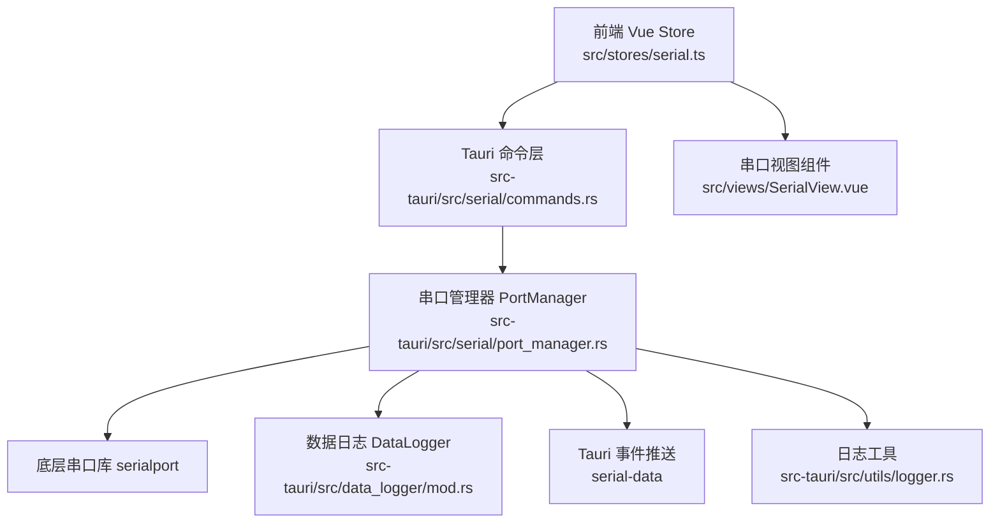
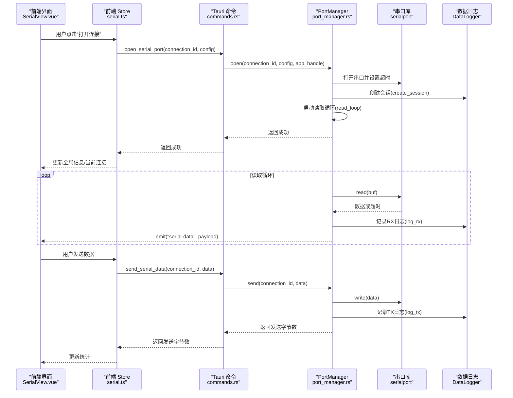
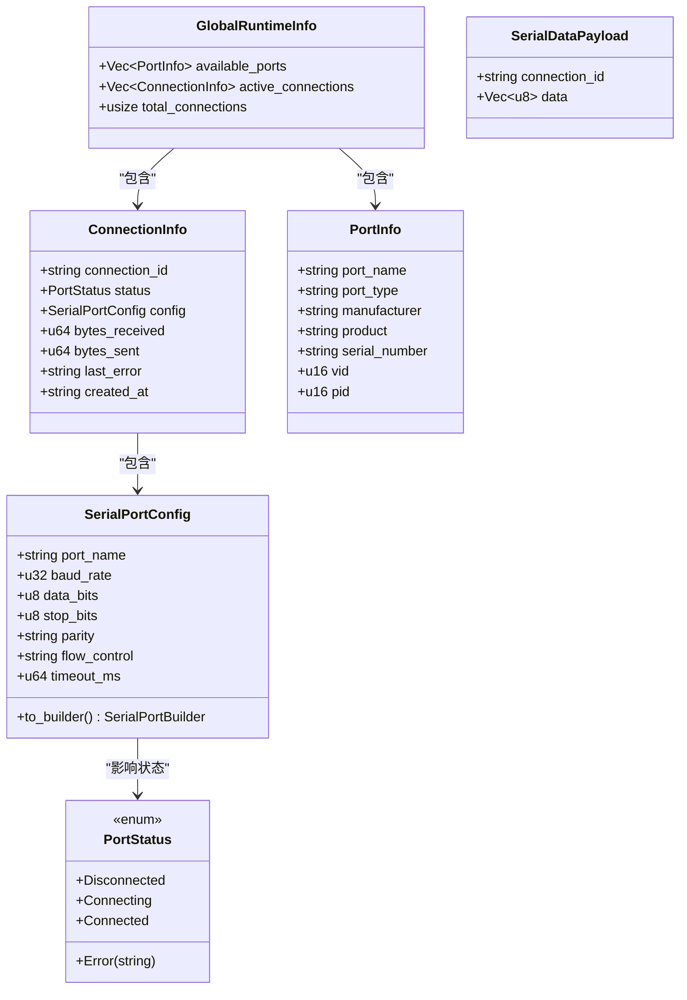
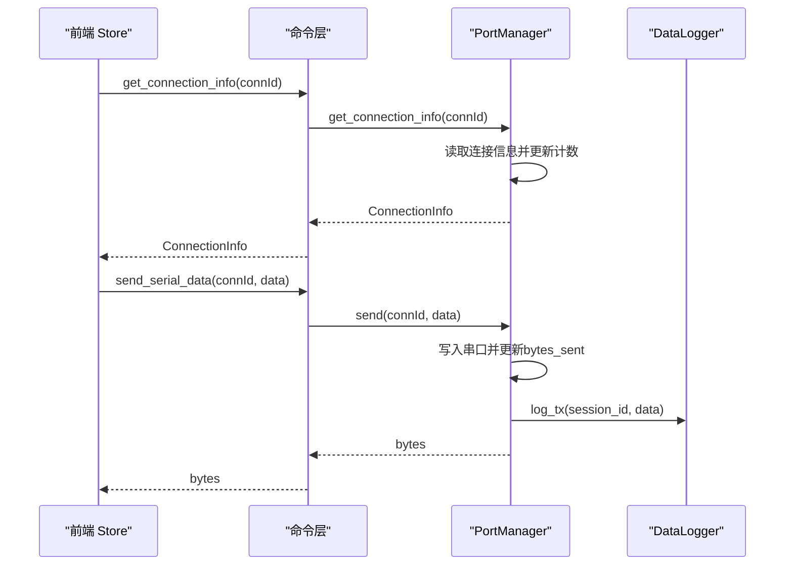
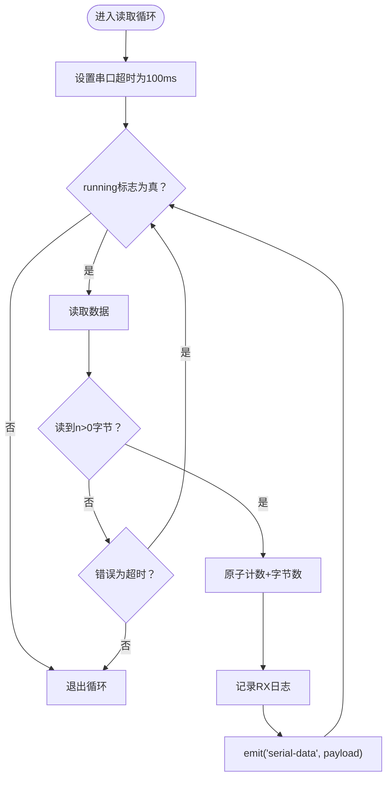
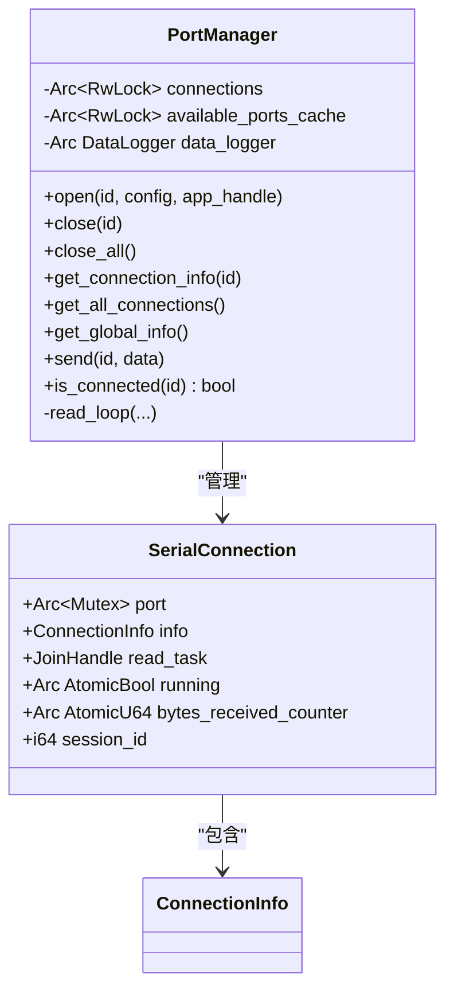
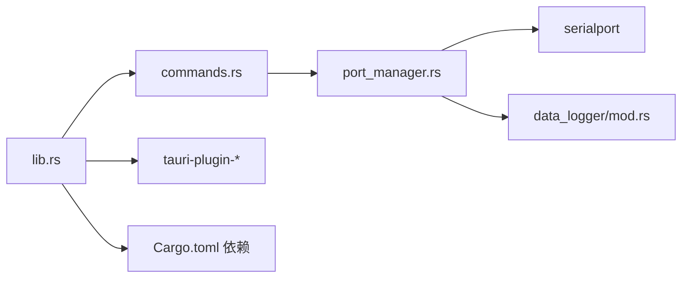

# 连接控制管理

<cite>
**本文引用的文件**
- [src-tauri/src/serial/mod.rs](file://src-tauri/src/serial/mod.rs)
- [src-tauri/src/serial/commands.rs](file://src-tauri/src/serial/commands.rs)
- [src-tauri/src/serial/port_manager.rs](file://src-tauri/src/serial/port_manager.rs)
- [src-tauri/src/lib.rs](file://src-tauri/src/lib.rs)
- [src/stores/serial.ts](file://src/stores/serial.ts)
- [src/views/SerialView.vue](file://src/views/SerialView.vue)
- [src-tauri/src/data_logger/mod.rs](file://src-tauri/src/data_logger/mod.rs)
- [src-tauri/src/utils/logger.rs](file://src-tauri/src/utils/logger.rs)
- [src-tauri/Cargo.toml](file://src-tauri/Cargo.toml)
</cite>

## 目录
1. [简介](#简介)
2. [项目结构](#项目结构)
3. [核心组件](#核心组件)
4. [架构总览](#架构总览)
5. [详细组件分析](#详细组件分析)
6. [依赖关系分析](#依赖关系分析)
7. [性能考量](#性能考量)
8. [故障排查指南](#故障排查指南)
9. [结论](#结论)
10. [附录](#附录)

## 简介
本文件为串口连接控制功能的详细 API 文档，涵盖连接建立、断开与状态查询的完整流程；重点说明 open_serial_port、close_serial_port、close_all_serial_ports 等连接管理命令的使用方法；解释 ConnectionInfo、SerialPortConfig 等数据结构的完整定义与字段含义；阐述连接状态监控、连接池管理与并发连接处理的实现细节；提供连接生命周期管理的最佳实践与错误恢复策略，并记录异步操作处理方式与超时机制。

## 项目结构
本项目采用 Tauri + Vue 的前后端分离架构，串口控制位于 Rust 后端的 serial 子模块，前端通过 Tauri 命令与后端交互。关键文件分布如下：
- 后端串口模块入口：src-tauri/src/serial/mod.rs
- 后端串口命令接口：src-tauri/src/serial/commands.rs
- 后端串口管理器与数据结构：src-tauri/src/serial/port_manager.rs
- 后端应用入口与命令注册：src-tauri/src/lib.rs
- 前端串口状态与命令封装：src/stores/serial.ts
- 前端串口视图与 UI 交互：src/views/SerialView.vue
- 数据日志模块（SQLite）：src-tauri/src/data_logger/mod.rs
- 日志工具宏：src-tauri/src/utils/logger.rs
- 依赖清单：src-tauri/Cargo.toml

**图表来源**
- [src-tauri/src/serial/commands.rs:1-129](file://src-tauri/src/serial/commands.rs#L1-L129)
- [src-tauri/src/serial/port_manager.rs:1-402](file://src-tauri/src/serial/port_manager.rs#L1-L402)
- [src-tauri/src/data_logger/mod.rs:1-273](file://src-tauri/src/data_logger/mod.rs#L1-L273)
- [src-tauri/src/utils/logger.rs:1-132](file://src-tauri/src/utils/logger.rs#L1-L132)
- [src/stores/serial.ts:1-363](file://src/stores/serial.ts#L1-L363)
- [src/views/SerialView.vue:1-746](file://src/views/SerialView.vue#L1-L746)

**章节来源**
- [src-tauri/src/serial/mod.rs:1-4](file://src-tauri/src/serial/mod.rs#L1-L4)
- [src-tauri/src/serial/commands.rs:1-129](file://src-tauri/src/serial/commands.rs#L1-L129)
- [src-tauri/src/serial/port_manager.rs:1-402](file://src-tauri/src/serial/port_manager.rs#L1-L402)
- [src-tauri/src/lib.rs:1-84](file://src-tauri/src/lib.rs#L1-L84)
- [src/stores/serial.ts:1-363](file://src/stores/serial.ts#L1-L363)
- [src/views/SerialView.vue:1-746](file://src/views/SerialView.vue#L1-L746)
- [src-tauri/src/data_logger/mod.rs:1-273](file://src-tauri/src/data_logger/mod.rs#L1-L273)
- [src-tauri/src/utils/logger.rs:1-132](file://src-tauri/src/utils/logger.rs#L1-L132)
- [src-tauri/Cargo.toml:1-40](file://src-tauri/Cargo.toml#L1-L40)

## 核心组件
- 串口命令层：提供 list_serial_ports、get_serial_ports_info、refresh_serial_ports、open_serial_port、close_serial_port、close_all_serial_ports、get_connection_info、get_all_connections、get_global_runtime_info、send_serial_data、is_serial_connected 等命令。
- 串口管理器 PortManager：负责连接池管理、连接状态维护、读取循环、事件推送与数据持久化。
- 前端 Store：封装 invoke 调用、事件监听、状态轮询与 UI 交互。
- 数据日志 DataLogger：基于 SQLite 的会话与数据持久化。
- 日志工具：统一的日志格式化与输出。

**章节来源**
- [src-tauri/src/serial/commands.rs:1-129](file://src-tauri/src/serial/commands.rs#L1-L129)
- [src-tauri/src/serial/port_manager.rs:1-402](file://src-tauri/src/serial/port_manager.rs#L1-L402)
- [src/stores/serial.ts:1-363](file://src/stores/serial.ts#L1-L363)
- [src-tauri/src/data_logger/mod.rs:1-273](file://src-tauri/src/data_logger/mod.rs#L1-L273)
- [src-tauri/src/utils/logger.rs:1-132](file://src-tauri/src/utils/logger.rs#L1-L132)

## 架构总览
后端通过 Tauri 命令暴露串口控制能力，前端通过 Store 封装命令调用与事件监听。PortManager 内部维护连接池与读取任务，使用 tokio 异步模型与互斥锁保证并发安全；读取循环以固定超时读取串口数据，将原始字节通过 Tauri 事件推送到前端；同时将 TX/RX 数据持久化至 SQLite。

**图表来源**
- [src-tauri/src/serial/commands.rs:49-118](file://src-tauri/src/serial/commands.rs#L49-L118)
- [src-tauri/src/serial/port_manager.rs:196-303](file://src-tauri/src/serial/port_manager.rs#L196-L303)
- [src-tauri/src/data_logger/mod.rs:115-164](file://src-tauri/src/data_logger/mod.rs#L115-L164)
- [src/views/SerialView.vue:157-205](file://src/views/SerialView.vue#L157-L205)
- [src/stores/serial.ts:157-285](file://src/stores/serial.ts#L157-L285)

**章节来源**
- [src-tauri/src/serial/commands.rs:1-129](file://src-tauri/src/serial/commands.rs#L1-L129)
- [src-tauri/src/serial/port_manager.rs:1-402](file://src-tauri/src/serial/port_manager.rs#L1-L402)
- [src-tauri/src/data_logger/mod.rs:1-273](file://src-tauri/src/data_logger/mod.rs#L1-L273)
- [src/views/SerialView.vue:1-746](file://src/views/SerialView.vue#L1-L746)
- [src/stores/serial.ts:1-363](file://src/stores/serial.ts#L1-L363)

## 详细组件分析

### 数据结构定义与字段说明
- SerialPortConfig（后端）
  - 字段：port_name、baud_rate、data_bits、stop_bits、parity、flow_control、timeout_ms
  - 作用：完整串口配置，用于构建底层串口对象
  - 转换：to_builder 将配置映射为 serialport::SerialPortBuilder 并设置超时
- ConnectionInfo（后端）
  - 字段：connection_id、status、config、bytes_received、bytes_sent、last_error、created_at
  - 作用：单连接运行时状态快照，包含统计数据与错误信息
- PortStatus（后端）
  - 枚举：Disconnected、Connecting、Connected、Error(String)
  - 作用：连接状态机
- GlobalRuntimeInfo（后端）
  - 字段：available_ports、active_connections、total_connections
  - 作用：全局运行时概览
- PortInfo（后端）
  - 字段：port_name、port_type、manufacturer、product、serial_number、vid、pid
  - 作用：串口硬件信息映射
- SerialDataPayload（后端）
  - 字段：connection_id、data
  - 作用：通过 Tauri 事件推送的原始数据包
- SerialPortConfig（前端）
  - 字段：与后端一致，用于前端调用
- ConnectionInfo（前端）
  - 字段：与后端一致，用于前端展示
- PortInfo（前端）
  - 字段：与后端一致，用于前端展示
- GlobalRuntimeInfo（前端）
  - 字段：与后端一致，用于前端展示

**图表来源**
- [src-tauri/src/serial/port_manager.rs:16-124](file://src-tauri/src/serial/port_manager.rs#L16-L124)

**章节来源**
- [src-tauri/src/serial/port_manager.rs:16-124](file://src-tauri/src/serial/port_manager.rs#L16-L124)
- [src/stores/serial.ts:9-54](file://src/stores/serial.ts#L9-L54)

### 连接管理命令 API
- open_serial_port(connection_id, config)
  - 功能：打开指定串口，创建会话，启动读取循环，推送事件
  - 参数：connection_id（连接标识）、config（SerialPortConfig）
  - 返回：Result<(), String>
  - 错误：若连接已存在或底层串口打开失败
- close_serial_port(connection_id)
  - 功能：关闭指定连接，终止读取任务，结束会话
  - 参数：connection_id
  - 返回：Result<(), String>
  - 错误：连接不存在
- close_all_serial_ports()
  - 功能：关闭所有连接，清空连接池
  - 返回：Result<(), String>
  - 行为：遍历并关闭所有连接
- get_connection_info(connection_id)
  - 功能：获取指定连接的实时状态
  - 返回：Result<ConnectionInfo, String>
- get_all_connections()
  - 功能：获取所有连接的实时状态
  - 返回：Result<Vec<ConnectionInfo>, String>
- get_global_runtime_info()
  - 功能：获取全局运行时信息（可用串口+活跃连接+总数）
  - 返回：Result<GlobalRuntimeInfo, String>
- send_serial_data(connection_id, data)
  - 功能：向指定连接发送数据，记录 TX 日志
  - 返回：Result<usize, String>
  - 错误：连接不存在或写入失败
- is_serial_connected(connection_id)
  - 功能：检查连接是否处于 Connected 状态
  - 返回：Result<bool, String>

**图表来源**
- [src-tauri/src/serial/commands.rs:82-118](file://src-tauri/src/serial/commands.rs#L82-L118)
- [src-tauri/src/serial/port_manager.rs:333-392](file://src-tauri/src/serial/port_manager.rs#L333-L392)
- [src-tauri/src/data_logger/mod.rs:155-164](file://src-tauri/src/data_logger/mod.rs#L155-L164)

**章节来源**
- [src-tauri/src/serial/commands.rs:49-129](file://src-tauri/src/serial/commands.rs#L49-L129)
- [src-tauri/src/serial/port_manager.rs:196-392](file://src-tauri/src/serial/port_manager.rs#L196-L392)
- [src/stores/serial.ts:157-295](file://src/stores/serial.ts#L157-L295)

### 连接状态监控与事件推送
- 读取循环：在独立线程中以固定超时读取串口数据，遇到超时继续循环，非超时错误则退出循环
- 事件推送：将原始数据通过 Tauri 事件 serial-data 推送至前端
- 前端监听：Store 注册监听并在回调中分发给各组件

**图表来源**
- [src-tauri/src/serial/port_manager.rs:225-303](file://src-tauri/src/serial/port_manager.rs#L225-L303)
- [src/stores/serial.ts:311-332](file://src/stores/serial.ts#L311-L332)

**章节来源**
- [src-tauri/src/serial/port_manager.rs:274-303](file://src-tauri/src/serial/port_manager.rs#L274-L303)
- [src/stores/serial.ts:297-332](file://src/stores/serial.ts#L297-L332)

### 连接池管理与并发处理
- 连接池：HashMap<String, SerialConnection>，键为 connection_id
- 并发控制：Tokio Mutex/RwLock 保护连接池与可用串口缓存
- 读取任务：每个连接一个 JoinHandle，使用 AtomicBool 控制循环退出
- 会话管理：DataLogger.create_session/end_session 与连接生命周期绑定

**图表来源**
- [src-tauri/src/serial/port_manager.rs:161-171](file://src-tauri/src/serial/port_manager.rs#L161-L171)
- [src-tauri/src/serial/port_manager.rs:96-104](file://src-tauri/src/serial/port_manager.rs#L96-L104)

**章节来源**
- [src-tauri/src/serial/port_manager.rs:161-180](file://src-tauri/src/serial/port_manager.rs#L161-L180)
- [src-tauri/src/serial/port_manager.rs:305-331](file://src-tauri/src/serial/port_manager.rs#L305-L331)

### 生命周期管理最佳实践
- 连接标识：使用唯一 connection_id，避免重复打开同一连接
- 打开流程：先校验连接是否存在，再尝试打开串口，失败时记录错误
- 关闭流程：设置 running=false，终止读取任务，结束会话，释放资源
- 状态查询：读取时动态更新 bytes_received，避免陈旧数据
- 错误恢复：当写入失败时更新 PortStatus 与 last_error，便于前端提示

**章节来源**
- [src-tauri/src/serial/port_manager.rs:206-212](file://src-tauri/src/serial/port_manager.rs#L206-L212)
- [src-tauri/src/serial/port_manager.rs:266-271](file://src-tauri/src/serial/port_manager.rs#L266-L271)
- [src-tauri/src/serial/port_manager.rs:382-387](file://src-tauri/src/serial/port_manager.rs#L382-L387)

### 异步操作与超时机制
- 命令层：所有串口相关命令均声明为 async，使用 State<Arc<Mutex<PortManager>>> 获取 PortManager
- 读取超时：串口读取设置固定 100ms 超时，确保及时响应关闭信号
- 发送超时：底层串口写入可能受系统与设备影响，错误通过 Result 返回
- 事件驱动：通过 Tauri 事件推送 RX 数据，前端可选择轮询或事件驱动更新

**章节来源**
- [src-tauri/src/serial/commands.rs:49-129](file://src-tauri/src/serial/commands.rs#L49-L129)
- [src-tauri/src/serial/port_manager.rs:225-226](file://src-tauri/src/serial/port_manager.rs#L225-L226)
- [src/stores/serial.ts:347-362](file://src/stores/serial.ts#L347-L362)

## 依赖关系分析
- Tauri 命令注册：在 lib.rs 中集中注册串口相关命令
- 依赖库：serialport、tokio、serde、rusqlite、chrono、log 等
- 插件：tauri-plugin-* 提供对话框、剪贴板、文件系统、CLI 等能力

**图表来源**
- [src-tauri/src/lib.rs:56-80](file://src-tauri/src/lib.rs#L56-L80)
- [src-tauri/Cargo.toml:20-36](file://src-tauri/Cargo.toml#L20-L36)

**章节来源**
- [src-tauri/src/lib.rs:47-83](file://src-tauri/src/lib.rs#L47-L83)
- [src-tauri/Cargo.toml:20-36](file://src-tauri/Cargo.toml#L20-L36)

## 性能考量
- 读取循环：固定超时减少阻塞，提高响应性
- 原子计数：bytes_received 使用 AtomicU64，避免频繁锁竞争
- 事件推送：批量数据通过事件推送，前端按需解码，降低 UI 线程压力
- 数据持久化：SQLite WAL 模式提升写入性能，外键级联删除简化清理逻辑
- 并发模型：Tokio 异步 + Mutex/RwLock，适合 I/O 密集型串口场景

[本节为通用性能建议，不直接分析具体文件]

## 故障排查指南
- 打开串口失败
  - 检查 port_name 是否有效，确认串口未被占用
  - 查看日志输出，定位底层错误信息
- 读不到数据
  - 确认波特率、数据位、停止位、校验位与设备匹配
  - 检查读取超时设置与设备缓冲区
- 发送失败
  - 检查连接状态是否为 Connected
  - 查看 last_error 字段，必要时重连
- 事件未到达
  - 确认前端已注册 serial-data 事件监听
  - 检查状态轮询是否正常工作

**章节来源**
- [src-tauri/src/utils/logger.rs:85-131](file://src-tauri/src/utils/logger.rs#L85-L131)
- [src-tauri/src/serial/port_manager.rs:266-271](file://src-tauri/src/serial/port_manager.rs#L266-L271)
- [src/stores/serial.ts:311-332](file://src/stores/serial.ts#L311-L332)

## 结论
本串口连接控制模块通过清晰的命令层、健壮的 PortManager 与完善的前端 Store，实现了多连接并发管理、事件驱动的数据推送与 SQLite 持久化。遵循唯一连接标识、正确处理超时与错误、合理使用事件与轮询更新，可获得稳定可靠的串口调试体验。

[本节为总结性内容，不直接分析具体文件]

## 附录

### 命令一览与使用要点
- open_serial_port(connection_id, config)
  - 必须先生成唯一 connection_id
  - config 字段需与设备严格匹配
- close_serial_port(connection_id)
  - 关闭后会终止读取任务并结束会话
- close_all_serial_ports()
  - 适用于退出应用或批量清理
- get_connection_info/get_all_connections/get_global_runtime_info
  - 建议结合轮询或事件驱动更新 UI
- send_serial_data(connection_id, data)
  - 支持十六进制与文本两种输入模式
- is_serial_connected(connection_id)
  - 仅判断状态为 Connected

**章节来源**
- [src-tauri/src/serial/commands.rs:49-129](file://src-tauri/src/serial/commands.rs#L49-L129)
- [src/stores/serial.ts:157-295](file://src/stores/serial.ts#L157-L295)