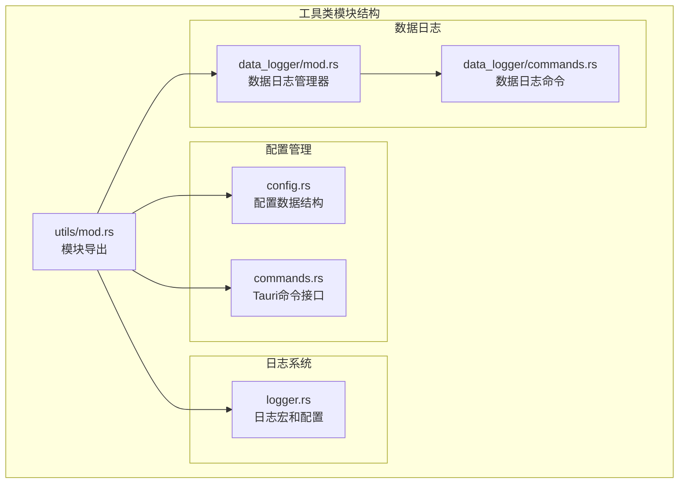
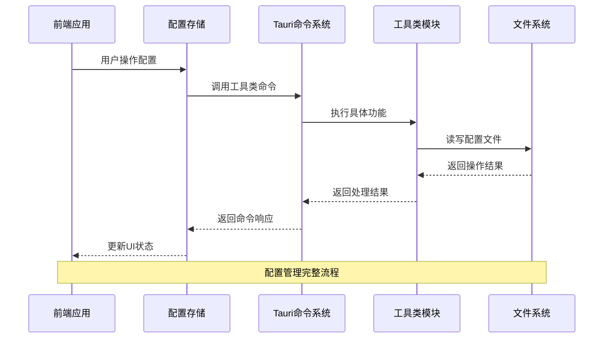
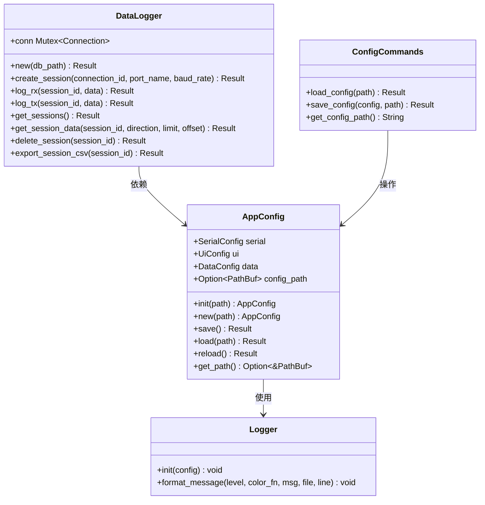
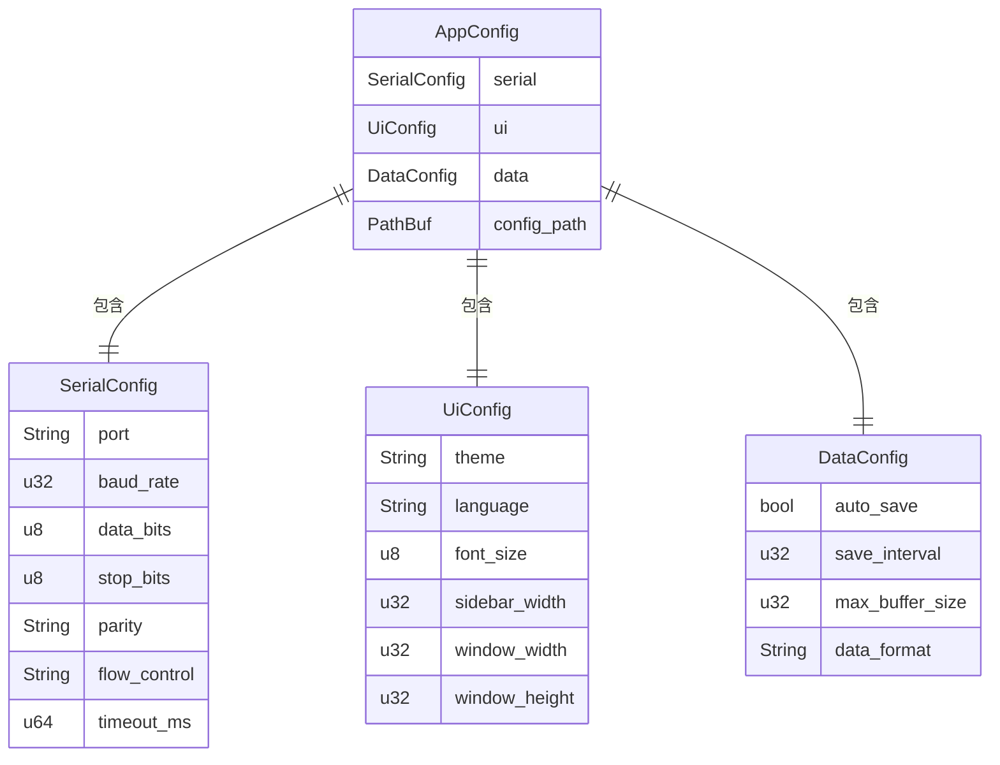
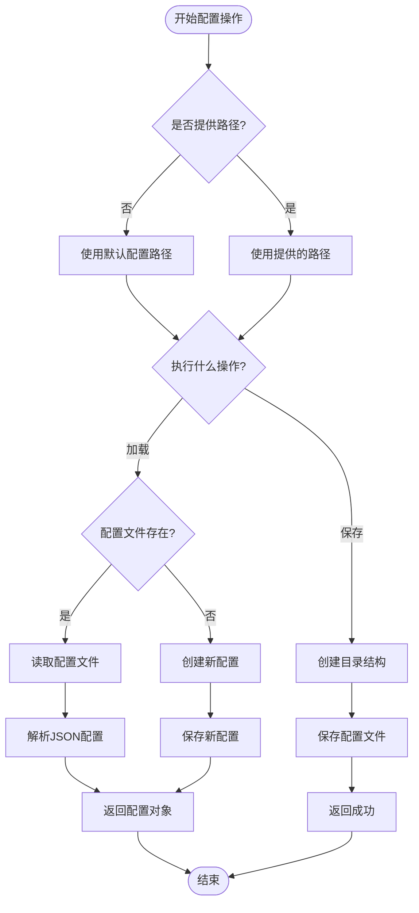
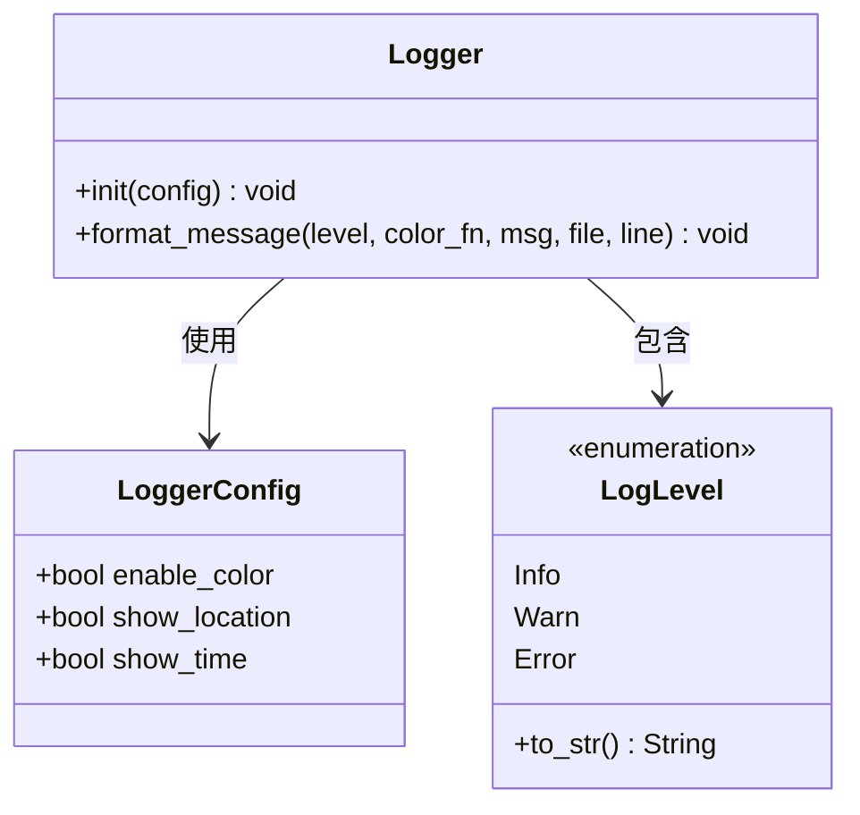
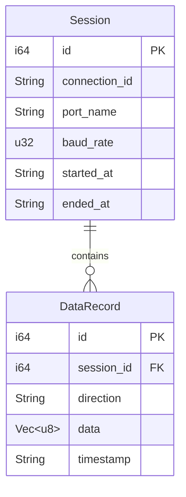
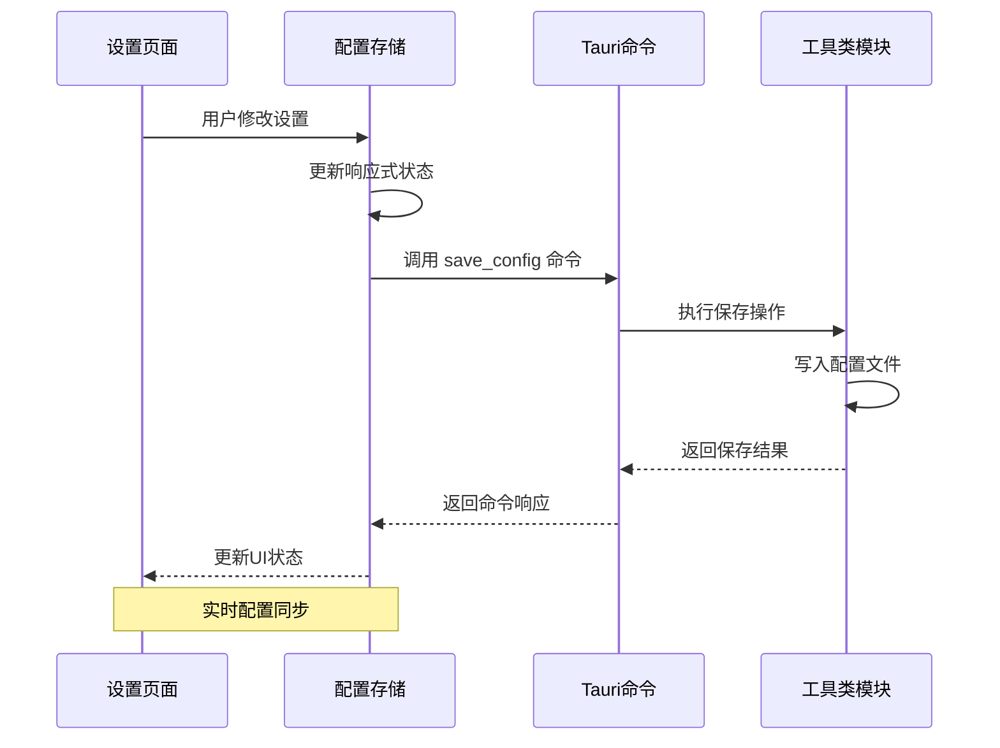
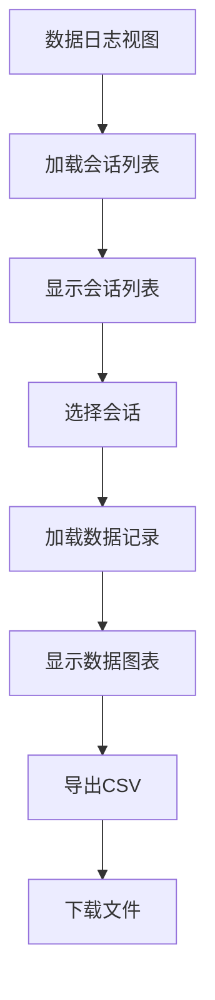
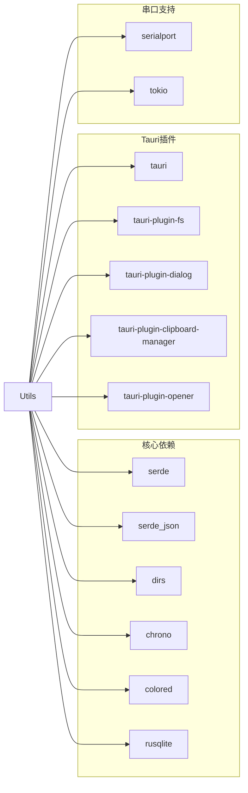

# 工具类 API

<cite>
**本文档引用的文件**
- [src-tauri/src/utils/mod.rs](file://src-tauri/src/utils/mod.rs)
- [src-tauri/src/utils/commands.rs](file://src-tauri/src/utils/commands.rs)
- [src-tauri/src/utils/config.rs](file://src-tauri/src/utils/config.rs)
- [src-tauri/src/utils/logger.rs](file://src-tauri/src/utils/logger.rs)
- [src-tauri/src/lib.rs](file://src-tauri/src/lib.rs)
- [src-tauri/src/main.rs](file://src-tauri/src/main.rs)
- [src/stores/config.ts](file://src/stores/config.ts)
- [src/stores/settings.ts](file://src/stores/settings.ts)
- [src/views/SettingsView.vue](file://src/views/SettingsView.vue)
- [src-tauri/src/data_logger/mod.rs](file://src-tauri/src/data_logger/mod.rs)
- [src-tauri/src/data_logger/commands.rs](file://src-tauri/src/data_logger/commands.rs)
- [src-tauri/Cargo.toml](file://src-tauri/Cargo.toml)
- [README.md](file://README.md)
</cite>

## 目录
1. [简介](#简介)
2. [项目结构](#项目结构)
3. [核心组件](#核心组件)
4. [架构概览](#架构概览)
5. [详细组件分析](#详细组件分析)
6. [依赖分析](#依赖分析)
7. [性能考虑](#性能考虑)
8. [故障排除指南](#故障排除指南)
9. [结论](#结论)

## 简介

KonSerial 是一个基于 Tauri + Vue3 + Rust 构建的现代化串口调试工具。本文档专注于工具类模块的 API 参考，涵盖配置管理、日志记录、文件操作等核心功能。该工具类模块为整个应用程序提供了基础的基础设施支持，包括配置持久化、日志记录、数据存储等功能。

工具类 API 在应用架构中扮演着关键角色：
- **配置管理**：提供跨平台的配置读写功能
- **日志系统**：统一的日志记录和输出格式化
- **数据持久化**：基于 SQLite 的数据存储解决方案
- **状态管理**：为前端提供响应式的配置状态

## 项目结构

工具类模块位于 Rust 后端的 `src-tauri/src/utils/` 目录下，主要包含以下组件：

**图表来源**
- [src-tauri/src/utils/mod.rs:1-6](file://src-tauri/src/utils/mod.rs#L1-L6)
- [src-tauri/src/utils/config.rs:1-176](file://src-tauri/src/utils/config.rs#L1-L176)
- [src-tauri/src/utils/commands.rs:1-31](file://src-tauri/src/utils/commands.rs#L1-L31)
- [src-tauri/src/utils/logger.rs:1-132](file://src-tauri/src/utils/logger.rs#L1-L132)
- [src-tauri/src/data_logger/mod.rs:1-273](file://src-tauri/src/data_logger/mod.rs#L1-L273)
- [src-tauri/src/data_logger/commands.rs:1-49](file://src-tauri/src/data_logger/commands.rs#L1-L49)

**章节来源**
- [src-tauri/src/utils/mod.rs:1-6](file://src-tauri/src/utils/mod.rs#L1-L6)
- [src-tauri/src/lib.rs:1-84](file://src-tauri/src/lib.rs#L1-L84)

## 核心组件

工具类模块包含四个核心组件，每个都提供特定的功能域：

### 配置管理组件
负责应用程序配置的加载、保存和管理，支持跨平台的配置文件存储。

### 日志系统组件
提供统一的日志记录功能，支持彩色输出、时间戳、位置信息等配置选项。

### 数据日志组件
基于 SQLite 实现的高性能数据存储系统，支持会话管理和数据查询。

### Tauri 命令接口
将 Rust 后端功能暴露给前端 JavaScript/Vue3 应用，通过 Tauri 的命令系统进行通信。

**章节来源**
- [src-tauri/src/utils/config.rs:1-176](file://src-tauri/src/utils/config.rs#L1-L176)
- [src-tauri/src/utils/logger.rs:1-132](file://src-tauri/src/utils/logger.rs#L1-L132)
- [src-tauri/src/data_logger/mod.rs:1-273](file://src-tauri/src/data_logger/mod.rs#L1-L273)
- [src-tauri/src/utils/commands.rs:1-31](file://src-tauri/src/utils/commands.rs#L1-L31)

## 架构概览

工具类 API 的整体架构采用分层设计，从前端到后端的完整数据流如下：

**图表来源**
- [src/stores/config.ts:42-64](file://src/stores/config.ts#L42-L64)
- [src-tauri/src/utils/commands.rs:3-29](file://src-tauri/src/utils/commands.rs#L3-L29)
- [src-tauri/src/utils/config.rs:127-152](file://src-tauri/src/utils/config.rs#L127-L152)

### 组件交互关系

**图表来源**
- [src-tauri/src/utils/config.rs:56-175](file://src-tauri/src/utils/config.rs#L56-L175)
- [src-tauri/src/utils/logger.rs:41-83](file://src-tauri/src/utils/logger.rs#L41-L83)
- [src-tauri/src/data_logger/mod.rs:48-272](file://src-tauri/src/data_logger/mod.rs#L48-L272)
- [src-tauri/src/utils/commands.rs:3-29](file://src-tauri/src/utils/commands.rs#L3-L29)

## 详细组件分析

### 配置管理 API

配置管理是工具类模块的核心功能之一，提供了完整的配置生命周期管理。

#### 配置数据结构

配置系统采用分层结构设计，包含三个主要配置类别：

**图表来源**
- [src-tauri/src/utils/config.rs:18-63](file://src-tauri/src/utils/config.rs#L18-L63)

#### Tauri 命令接口

配置管理通过三个主要的 Tauri 命令提供功能：

##### load_config 命令
- **功能**：从指定路径加载配置文件
- **参数**：`path: Option<String>` - 配置文件路径（可选）
- **返回值**：`Result<AppConfig, String>` - 成功返回配置对象，失败返回错误信息
- **行为**：如果未提供路径，使用默认配置路径

##### save_config 命令
- **功能**：保存配置到指定路径
- **参数**：`config: AppConfig` - 要保存的配置对象，`path: Option<String>` - 保存路径（可选）
- **返回值**：`Result<(), String>` - 成功或错误信息
- **行为**：更新配置对象的路径信息并保存

##### get_config_path 命令
- **功能**：获取默认配置文件路径
- **参数**：无
- **返回值**：`String` - 默认配置文件路径
- **行为**：根据操作系统返回相应的配置目录

**章节来源**
- [src-tauri/src/utils/commands.rs:3-29](file://src-tauri/src/utils/commands.rs#L3-L29)
- [src-tauri/src/utils/config.rs:8-16](file://src-tauri/src/utils/config.rs#L8-L16)

#### 配置文件管理

配置文件管理提供了完整的文件操作功能：

**图表来源**
- [src-tauri/src/utils/config.rs:65-94](file://src-tauri/src/utils/config.rs#L65-L94)
- [src-tauri/src/utils/config.rs:127-152](file://src-tauri/src/utils/config.rs#L127-L152)

#### 参数验证规则

配置管理 API 的参数验证规则：

1. **路径参数验证**
   - 路径必须是有效的文件系统路径
   - 路径必须具有适当的权限进行读写操作
   - 路径必须指向 JSON 格式的配置文件

2. **配置数据验证**
   - 必需字段必须存在且不为空
   - 数值字段必须在有效范围内
   - 字符串字段必须符合预定义的枚举值

3. **异常处理机制**
   - 文件系统错误：返回具体的文件操作错误信息
   - JSON 解析错误：返回格式化错误信息
   - 权限错误：返回权限不足的错误信息

**章节来源**
- [src-tauri/src/utils/config.rs:127-175](file://src-tauri/src/utils/config.rs#L127-L175)

### 日志记录 API

日志系统提供了统一的日志记录功能，支持多种输出格式和配置选项。

#### 日志级别系统

日志系统定义了三种基本的日志级别：

| 级别 | 描述 | 颜色 |
|------|------|------|
| Info | 一般信息性消息 | 蓝色 |
| Warn | 警告信息 | 黄色 |
| Error | 错误信息 | 红色 |

#### 日志配置选项

日志系统支持以下配置选项：

**图表来源**
- [src-tauri/src/utils/logger.rs:24-50](file://src-tauri/src/utils/logger.rs#L24-L50)
- [src-tauri/src/utils/logger.rs:7-21](file://src-tauri/src/utils/logger.rs#L7-L21)

#### 日志宏系统

日志系统提供了三个便捷的日志宏：

1. **log_info!** - 用于记录信息性消息
2. **log_warn!** - 用于记录警告消息  
3. **log_error!** - 用于记录错误消息

每个宏都支持以下功能：
- 自动添加时间戳
- 显示调用位置（文件名和行号）
- 可选的颜色输出
- 格式化消息内容

**章节来源**
- [src-tauri/src/utils/logger.rs:85-131](file://src-tauri/src/utils/logger.rs#L85-L131)

### 数据日志 API

数据日志模块基于 SQLite 实现了高性能的数据存储解决方案，专门用于串口数据的持久化存储。

#### 数据模型设计

**图表来源**
- [src-tauri/src/data_logger/mod.rs:22-43](file://src-tauri/src/data_logger/mod.rs#L22-L43)

#### 数据库初始化

数据日志系统在启动时自动完成数据库初始化：

1. **目录创建**：确保数据库文件所在目录存在
2. **WAL 模式**：启用写-ahead logging 提高并发性能
3. **外键约束**：启用外键检查确保数据完整性
4. **表结构创建**：自动创建会话和数据记录表

#### Tauri 命令接口

数据日志模块提供了四个主要的 Tauri 命令：

##### get_sessions 命令
- **功能**：获取所有历史会话列表
- **参数**：无
- **返回值**：`Result<Vec<SessionInfo>, String>`
- **行为**：按时间倒序返回所有会话信息

##### get_session_data 命令
- **功能**：获取指定会话的数据记录
- **参数**：`session_id: i64`, `direction: Option<String>`, `limit: Option<u32>`, `offset: Option<u32>`
- **返回值**：`Result<Vec<DataRecord>, String>`
- **行为**：支持方向过滤和分页查询

##### delete_session 命令
- **功能**：删除指定会话及其所有数据
- **参数**：`session_id: i64`
- **返回值**：`Result<(), String>`
- **行为**：级联删除会话和相关数据记录

##### export_session_csv 命令
- **功能**：导出指定会话为 CSV 格式
- **参数**：`session_id: i64`
- **返回值**：`Result<String, String>`
- **行为**：返回 CSV 格式的字符串内容

**章节来源**
- [src-tauri/src/data_logger/commands.rs:7-48](file://src-tauri/src/data_logger/commands.rs#L7-L48)
- [src-tauri/src/data_logger/mod.rs:168-272](file://src-tauri/src/data_logger/mod.rs#L168-L272)

### 前端集成指南

工具类 API 通过 Tauri 的命令系统与前端进行集成，主要涉及配置管理和数据日志两个方面。

#### 配置管理前端集成

前端通过 Vue 3 的响应式系统与配置管理 API 集成：

**图表来源**
- [src/views/SettingsView.vue:42-63](file://src/views/SettingsView.vue#L42-L63)
- [src/stores/config.ts:52-64](file://src/stores/config.ts#L52-L64)

#### 数据日志前端集成

数据日志功能通过专门的视图组件进行展示：

**图表来源**
- [src-tauri/src/data_logger/commands.rs:8-48](file://src-tauri/src/data_logger/commands.rs#L8-L48)

**章节来源**
- [src/views/SettingsView.vue:1-383](file://src/views/SettingsView.vue#L1-L383)
- [src/stores/config.ts:1-89](file://src/stores/config.ts#L1-L89)
- [src/stores/settings.ts:1-125](file://src/stores/settings.ts#L1-L125)

## 依赖分析

工具类模块的依赖关系相对简单，主要依赖于标准库和第三方 crates。

### 核心依赖

| 依赖项 | 版本 | 用途 |
|--------|------|------|
| serde | 1.x | JSON 序列化/反序列化 |
| serde_json | 1.0 | JSON 格式处理 |
| dirs | 5.0 | 跨平台配置目录获取 |
| chrono | 0.4 | 时间戳处理 |
| colored | 2.1 | 彩色输出支持 |
| rusqlite | 0.31 | SQLite 数据库操作 |

### 外部依赖

**图表来源**
- [src-tauri/Cargo.toml:20-39](file://src-tauri/Cargo.toml#L20-L39)

**章节来源**
- [src-tauri/Cargo.toml:1-40](file://src-tauri/Cargo.toml#L1-L40)

## 性能考虑

工具类模块在设计时充分考虑了性能优化：

### 配置管理性能

1. **延迟初始化**：配置文件仅在需要时才进行读取和解析
2. **缓存机制**：配置对象在内存中缓存，避免重复文件操作
3. **增量更新**：支持部分配置更新，减少不必要的文件写入

### 日志系统性能

1. **异步输出**：日志输出采用非阻塞方式
2. **格式化优化**：使用高效的字符串格式化方法
3. **颜色输出控制**：可选择禁用颜色输出以提高性能

### 数据日志性能

1. **WAL 模式**：启用写-ahead logging 提高并发性能
2. **索引优化**：为常用查询字段建立索引
3. **批量操作**：支持批量数据插入和查询

## 故障排除指南

### 配置文件相关问题

**问题**：配置文件无法读取
- **原因**：文件权限不足或文件损坏
- **解决方案**：检查文件权限，必要时删除损坏文件让系统重新创建

**问题**：配置路径不正确
- **原因**：跨平台路径差异
- **解决方案**：使用 `get_config_path` 命令获取正确的默认路径

### 日志系统相关问题

**问题**：日志输出格式异常
- **原因**：日志配置错误或终端不支持颜色
- **解决方案**：检查日志配置，尝试禁用颜色输出

**问题**：日志级别设置无效
- **原因**：日志系统未正确初始化
- **解决方案**：确保在应用启动时调用 `Logger::init`

### 数据日志相关问题

**问题**：数据库连接失败
- **原因**：数据库文件损坏或权限问题
- **解决方案**：检查数据库文件完整性，修复权限问题

**问题**：查询性能缓慢
- **原因**：缺少必要的索引或查询条件不当
- **解决方案**：优化查询语句，添加适当的索引

**章节来源**
- [src-tauri/src/utils/config.rs:76-91](file://src-tauri/src/utils/config.rs#L76-L91)
- [src-tauri/src/utils/logger.rs:44-50](file://src-tauri/src/utils/logger.rs#L44-L50)
- [src-tauri/src/data_logger/mod.rs:64-111](file://src-tauri/src/data_logger/mod.rs#L64-L111)

## 结论

工具类模块为 KonSerial 应用提供了坚实的基础功能支持。通过精心设计的 API 接口和完善的错误处理机制，该模块能够满足现代桌面应用程序对配置管理、日志记录和数据持久化的需求。

### 主要优势

1. **跨平台兼容性**：支持 Windows、macOS 和 Linux 平台
2. **类型安全**：使用 Rust 的类型系统确保编译时安全
3. **性能优化**：针对高频操作进行了专门的性能优化
4. **易于扩展**：模块化设计便于功能扩展和维护

### 使用场景

- **配置管理**：应用程序设置的持久化存储
- **日志记录**：开发和生产环境的日志输出
- **数据存储**：串口数据的长期保存和检索
- **状态管理**：前后端之间的状态同步

该工具类模块的设计体现了现代 Rust 应用开发的最佳实践，为 KonSerial 的稳定运行提供了重要保障。