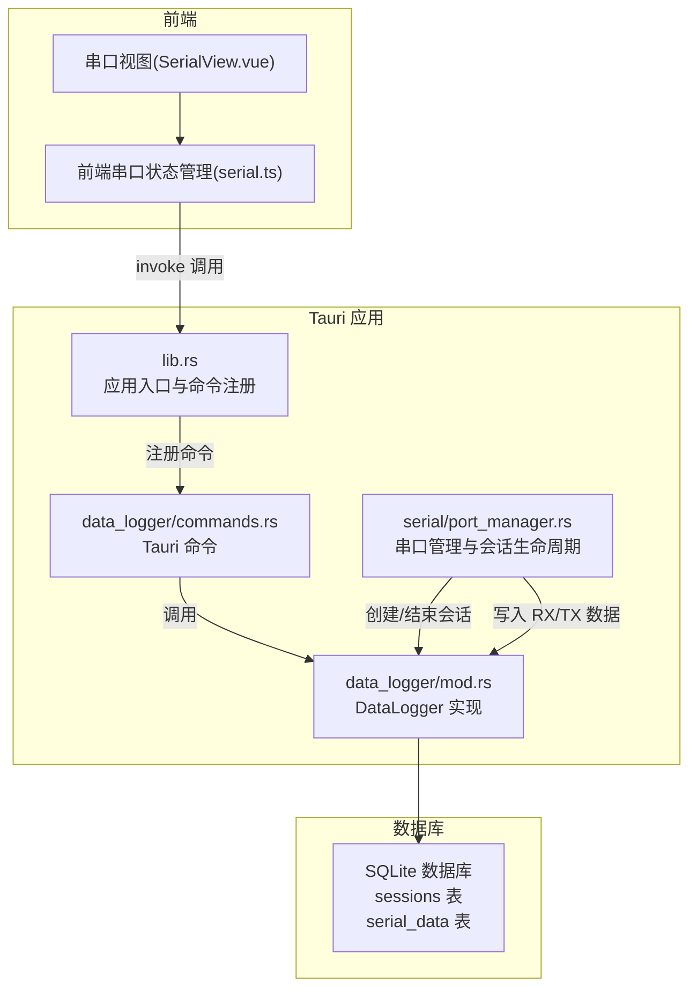
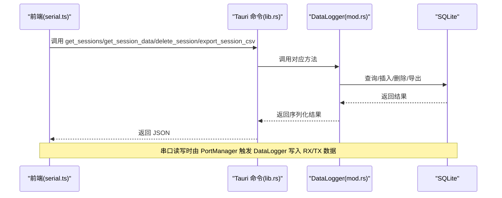
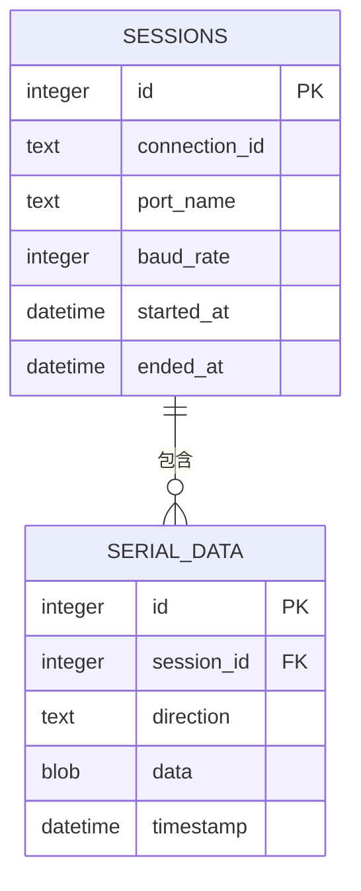
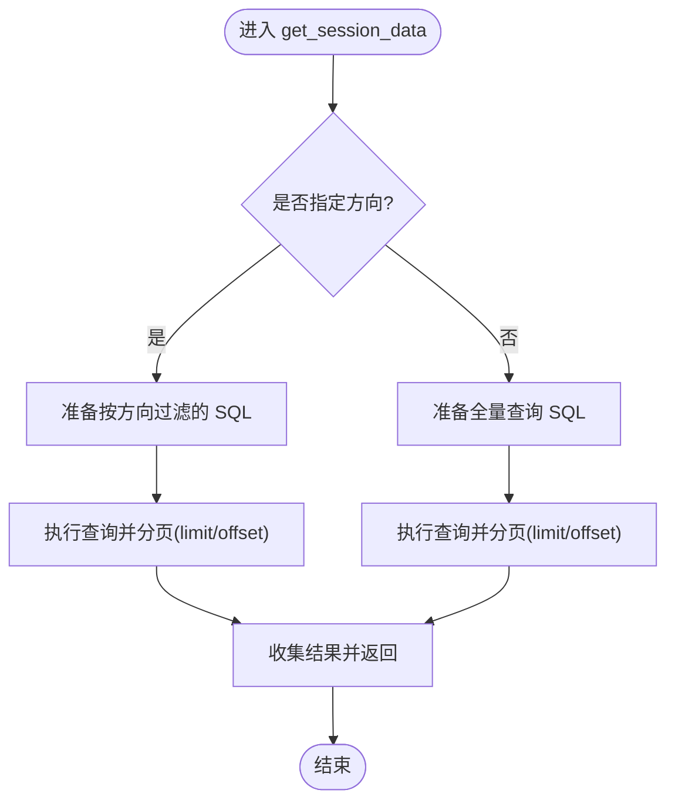
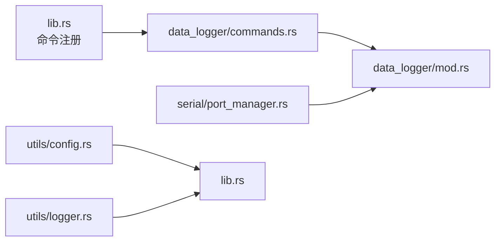

# 数据记录 API

<cite>
**本文引用的文件**
- [mod.rs](file://src-tauri/src/data_logger/mod.rs)
- [commands.rs](file://src-tauri/src/data_logger/commands.rs)
- [lib.rs](file://src-tauri/src/lib.rs)
- [Cargo.toml](file://src-tauri/Cargo.toml)
- [port_manager.rs](file://src-tauri/src/serial/port_manager.rs)
- [commands.rs](file://src-tauri/src/serial/commands.rs)
- [config.rs](file://src-tauri/src/utils/config.rs)
- [logger.rs](file://src-tauri/src/utils/logger.rs)
- [serial.ts](file://src/stores/serial.ts)
- [SerialView.vue](file://src/views/SerialView.vue)
</cite>

## 目录
1. [简介](#简介)
2. [项目结构](#项目结构)
3. [核心组件](#核心组件)
4. [架构总览](#架构总览)
5. [详细组件分析](#详细组件分析)
6. [依赖关系分析](#依赖关系分析)
7. [性能考量](#性能考量)
8. [故障排查指南](#故障排查指南)
9. [结论](#结论)
10. [附录](#附录)

## 简介
本文件为“数据记录模块”的全面 API 参考文档，覆盖基于 SQLite 的数据持久化、会话管理、数据记录创建、历史数据查询与批量导出等能力。文档面向前端与后端开发者，提供：
- Tauri 命令接口规范
- 数据模型定义（SessionInfo、DataRecord）
- SQLite 数据库操作流程与索引设计
- 性能优化建议与最佳实践
- 错误处理策略与常见问题排查
- 数据备份、恢复与迁移指南

## 项目结构
数据记录模块位于 Rust 后端的 data_logger 子模块，通过 Tauri 命令暴露给前端；串口读写在 PortManager 中触发数据记录写入，并在连接生命周期内自动创建/结束会话。

图表来源
- [lib.rs:47-83](file://src-tauri/src/lib.rs#L47-L83)
- [mod.rs:48-111](file://src-tauri/src/data_logger/mod.rs#L48-L111)
- [commands.rs:1-49](file://src-tauri/src/data_logger/commands.rs#L1-L49)
- [port_manager.rs:174-331](file://src-tauri/src/serial/port_manager.rs#L174-L331)

章节来源
- [lib.rs:25-83](file://src-tauri/src/lib.rs#L25-L83)
- [mod.rs:11-18](file://src-tauri/src/data_logger/mod.rs#L11-L18)

## 核心组件
- DataLogger：线程安全的 SQLite 管理器，负责会话与数据记录的创建、查询、删除与导出。
- Tauri 命令：将 DataLogger 的方法暴露为可被前端调用的命令。
- PortManager：在串口连接建立/关闭时自动创建/结束会话，并在读写时写入 RX/TX 数据。
- 数据模型：SessionInfo、DataRecord。

章节来源
- [mod.rs:22-43](file://src-tauri/src/data_logger/mod.rs#L22-L43)
- [commands.rs:7-48](file://src-tauri/src/data_logger/commands.rs#L7-L48)
- [port_manager.rs:174-331](file://src-tauri/src/serial/port_manager.rs#L174-L331)

## 架构总览
下图展示从前端调用到数据库写入的完整链路，包括会话生命周期与数据持久化。

图表来源
- [lib.rs:75-79](file://src-tauri/src/lib.rs#L75-L79)
- [commands.rs:7-48](file://src-tauri/src/data_logger/commands.rs#L7-L48)
- [mod.rs:115-164](file://src-tauri/src/data_logger/mod.rs#L115-L164)
- [port_manager.rs:217-242](file://src-tauri/src/serial/port_manager.rs#L217-L242)

## 详细组件分析

### 数据模型
- SessionInfo：会话元信息，包含连接标识、端口、波特率、起止时间、收发字节数统计。
- DataRecord：单条数据记录，包含方向（TX/RX）、原始字节、时间戳。

章节来源
- [mod.rs:22-43](file://src-tauri/src/data_logger/mod.rs#L22-L43)

### DataLogger（SQLite 管理器）
- 初始化与表结构
  - 默认数据库路径：跨平台配置目录下的 data.db。
  - 启用 WAL 模式、NORMAL 同步级别、外键约束。
  - 创建 sessions 与 serial_data 两张表，并建立索引以加速按会话与时间排序查询。
- 会话管理
  - create_session：创建会话并返回 session_id。
  - end_session：结束会话，填充结束时间。
- 数据写入
  - log_rx：记录接收数据（RX）。
  - log_tx：记录发送数据（TX）。
- 查询与导出
  - get_sessions：按时间倒序列出会话，聚合统计 RX/TX 字节数。
  - get_session_data：按会话查询数据记录，支持方向过滤、分页（limit/offset）。
  - delete_session：删除指定会话及其关联数据（外键级联）。
  - export_session_csv：将指定会话导出为 CSV 字符串（包含时间戳、方向、十六进制数据）。

章节来源
- [mod.rs:11-18](file://src-tauri/src/data_logger/mod.rs#L11-L18)
- [mod.rs:64-111](file://src-tauri/src/data_logger/mod.rs#L64-L111)
- [mod.rs:115-164](file://src-tauri/src/data_logger/mod.rs#L115-L164)
- [mod.rs:168-244](file://src-tauri/src/data_logger/mod.rs#L168-L244)
- [mod.rs:248-271](file://src-tauri/src/data_logger/mod.rs#L248-L271)

### Tauri 命令接口
- get_sessions：获取历史会话列表。
- get_session_data：获取指定会话的数据记录，支持方向过滤、分页。
- delete_session：删除指定会话及其所有数据。
- export_session_csv：导出指定会话为 CSV 格式字符串。

章节来源
- [commands.rs:7-48](file://src-tauri/src/data_logger/commands.rs#L7-L48)
- [lib.rs:75-79](file://src-tauri/src/lib.rs#L75-L79)

### 会话生命周期与数据写入（PortManager）
- 打开串口时：创建会话，记录 connection_id、端口名、波特率。
- 读取循环：收到数据后写入 RX 数据记录，并向前端推送事件。
- 发送数据：写入 TX 数据记录。
- 关闭串口：结束会话，清理资源。

章节来源
- [port_manager.rs:196-272](file://src-tauri/src/serial/port_manager.rs#L196-L272)
- [port_manager.rs:274-303](file://src-tauri/src/serial/port_manager.rs#L274-L303)
- [port_manager.rs:305-331](file://src-tauri/src/serial/port_manager.rs#L305-L331)

### 数据库表结构与索引

图表来源
- [mod.rs:84-106](file://src-tauri/src/data_logger/mod.rs#L84-L106)

章节来源
- [mod.rs:84-106](file://src-tauri/src/data_logger/mod.rs#L84-L106)

### 查询流程（分页与方向过滤）

图表来源
- [mod.rs:204-244](file://src-tauri/src/data_logger/mod.rs#L204-L244)

## 依赖关系分析
- Tauri 命令注册：在应用入口集中注册数据记录相关命令。
- DataLogger 生命周期：随应用启动初始化，作为全局状态注入。
- PortManager 依赖：在打开串口时创建会话，在读写时写入数据。

图表来源
- [lib.rs:47-83](file://src-tauri/src/lib.rs#L47-L83)
- [commands.rs:1-49](file://src-tauri/src/data_logger/commands.rs#L1-L49)
- [mod.rs:48-111](file://src-tauri/src/data_logger/mod.rs#L48-L111)
- [port_manager.rs:174-180](file://src-tauri/src/serial/port_manager.rs#L174-L180)
- [config.rs:8-16](file://src-tauri/src/utils/config.rs#L8-L16)
- [logger.rs:44-46](file://src-tauri/src/utils/logger.rs#L44-L46)

章节来源
- [lib.rs:47-83](file://src-tauri/src/lib.rs#L47-L83)
- [Cargo.toml:20-36](file://src-tauri/Cargo.toml#L20-L36)

## 性能考量
- 数据库模式
  - WAL 模式提升并发读写性能，NORMAL 同步级别平衡可靠性与性能。
  - 外键约束启用，配合 ON DELETE CASCADE 自动清理会话数据，减少手动维护成本。
- 索引设计
  - serial_data(session_id, timestamp) 索引显著提升按会话与时间排序的查询效率。
- 分页查询
  - 前端传入 limit/offset，避免一次性返回大量数据，降低内存占用与网络传输压力。
- 并发与锁
  - DataLogger 内部使用 Mutex 包裹 Connection，保证线程安全；建议前端合理分页与去抖请求。
- 导出策略
  - 导出 CSV 采用字符串拼接，适合中小规模会话；大规模会话建议分批导出或异步任务。

章节来源
- [mod.rs:76-82](file://src-tauri/src/data_logger/mod.rs#L76-L82)
- [mod.rs:103-104](file://src-tauri/src/data_logger/mod.rs#L103-L104)
- [commands.rs:15-30](file://src-tauri/src/data_logger/commands.rs#L15-L30)
- [mod.rs:257-271](file://src-tauri/src/data_logger/mod.rs#L257-L271)

## 故障排查指南
- 数据库初始化失败
  - 检查默认数据库路径权限与父目录创建是否成功。
  - 确认 SQLite PRAGMA 设置是否成功（WAL、外键）。
- 查询无结果或异常
  - 确认 session_id 是否正确，limit/offset 是否过大。
  - 检查方向参数是否符合枚举值（TX/RX）。
- 导出 CSV 异常
  - 确认会话存在且数据量适中；如数据量极大，考虑分批导出。
- 会话未结束
  - 确认串口关闭流程是否触发 end_session；必要时手动清理。
- 日志与配置
  - 应用启动日志与错误日志可用于定位问题；配置文件路径跨平台一致。

章节来源
- [mod.rs:64-111](file://src-tauri/src/data_logger/mod.rs#L64-L111)
- [mod.rs:168-201](file://src-tauri/src/data_logger/mod.rs#L168-L201)
- [mod.rs:248-271](file://src-tauri/src/data_logger/mod.rs#L248-L271)
- [port_manager.rs:305-331](file://src-tauri/src/serial/port_manager.rs#L305-L331)
- [logger.rs:44-83](file://src-tauri/src/utils/logger.rs#L44-L83)
- [config.rs:8-16](file://src-tauri/src/utils/config.rs#L8-L16)

## 结论
数据记录模块通过 DataLogger 提供了完整的会话与数据持久化能力，结合 Tauri 命令与 PortManager 的生命周期管理，实现了从串口读写到数据库落盘的自动化。建议在生产环境中：
- 合理使用分页与索引，避免大查询阻塞。
- 对大规模导出采用异步任务或分批策略。
- 定期备份数据库，确保数据安全。

## 附录

### API 规范

- get_sessions
  - 描述：获取历史会话列表（按时间倒序），包含 RX/TX 字节数统计。
  - 请求：无参数。
  - 返回：数组，元素为 SessionInfo。
  - 示例路径：[commands.rs:7-13](file://src-tauri/src/data_logger/commands.rs#L7-L13)

- get_session_data
  - 描述：获取指定会话的数据记录，支持方向过滤与分页。
  - 参数：
    - session_id: i64
    - direction: 可选，字符串（"TX" 或 "RX"）
    - limit: 可选，u32，默认 10000
    - offset: 可选，u32，默认 0
  - 返回：数组，元素为 DataRecord。
  - 示例路径：[commands.rs:15-30](file://src-tauri/src/data_logger/commands.rs#L15-L30)

- delete_session
  - 描述：删除指定会话及其所有数据记录（外键级联）。
  - 参数：
    - session_id: i64
  - 返回：无。
  - 示例路径：[commands.rs:32-39](file://src-tauri/src/data_logger/commands.rs#L32-L39)

- export_session_csv
  - 描述：导出指定会话为 CSV 字符串（包含 timestamp、direction、data_hex）。
  - 参数：
    - session_id: i64
  - 返回：字符串。
  - 示例路径：[commands.rs:41-48](file://src-tauri/src/data_logger/commands.rs#L41-L48)

### 数据模型字段说明

- SessionInfo
  - id: i64
  - connection_id: 字符串（连接标识）
  - port_name: 字符串（端口名）
  - baud_rate: u32（波特率）
  - started_at: 字符串（ISO 时间）
  - ended_at: 可选字符串（ISO 时间）
  - rx_bytes: u64（累计 RX 字节数）
  - tx_bytes: u64（累计 TX 字节数）

- DataRecord
  - id: i64
  - session_id: i64
  - direction: 字符串（"TX" 或 "RX"）
  - data: 字节数组（原始数据）
  - timestamp: 字符串（ISO 时间）

章节来源
- [mod.rs:22-43](file://src-tauri/src/data_logger/mod.rs#L22-L43)

### SQLite 数据库操作示例（路径指引）
- 初始化数据库与表结构
  - [mod.rs:64-111](file://src-tauri/src/data_logger/mod.rs#L64-L111)
- 创建会话
  - [mod.rs:115-129](file://src-tauri/src/data_logger/mod.rs#L115-L129)
- 结束会话
  - [mod.rs:131-140](file://src-tauri/src/data_logger/mod.rs#L131-L140)
- 写入 RX/TX 数据
  - [mod.rs:144-164](file://src-tauri/src/data_logger/mod.rs#L144-L164)
- 查询会话列表
  - [mod.rs:168-201](file://src-tauri/src/data_logger/mod.rs#L168-L201)
- 查询会话数据（含分页与方向过滤）
  - [mod.rs:204-244](file://src-tauri/src/data_logger/mod.rs#L204-L244)
- 删除会话（级联删除）
  - [mod.rs:248-255](file://src-tauri/src/data_logger/mod.rs#L248-L255)
- 导出 CSV
  - [mod.rs:257-271](file://src-tauri/src/data_logger/mod.rs#L257-L271)

### 性能优化建议
- 使用分页 limit/offset 控制单次查询数据量。
- 在高并发场景下，避免频繁全量导出，建议异步任务或分批导出。
- 定期检查数据库文件大小与磁盘空间，必要时进行归档或压缩。

### 错误处理策略
- 前端：对命令调用统一捕获错误并提示用户。
- 后端：在 DataLogger 方法中返回 Result<String,...>，错误信息包含具体原因，便于定位。
- 日志：通过 Logger 宏输出 INFO/WARN/ERROR 级别日志，辅助排障。

章节来源
- [commands.rs:7-48](file://src-tauri/src/data_logger/commands.rs#L7-L48)
- [mod.rs:115-164](file://src-tauri/src/data_logger/mod.rs#L115-L164)
- [logger.rs:85-131](file://src-tauri/src/utils/logger.rs#L85-L131)

### 数据备份、恢复与迁移指南
- 备份
  - 复制默认数据库文件（跨平台路径见默认数据库路径函数）。
  - 建议在应用关闭或数据库空闲时进行备份。
- 恢复
  - 停止应用后替换数据库文件，重启应用验证。
- 迁移
  - 若需升级表结构，可在 DataLogger::new 中添加迁移逻辑（PRAGMA 设置保持不变）。
  - 迁移前后需确保方向枚举值与数据格式一致。

章节来源
- [mod.rs:11-18](file://src-tauri/src/data_logger/mod.rs#L11-L18)
- [mod.rs:64-111](file://src-tauri/src/data_logger/mod.rs#L64-L111)