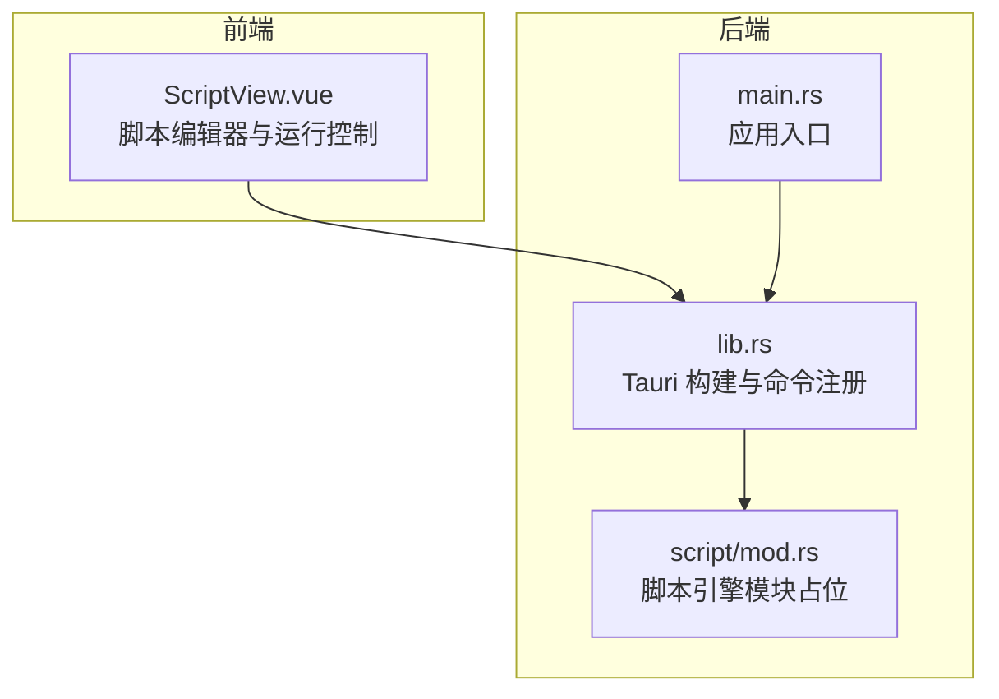
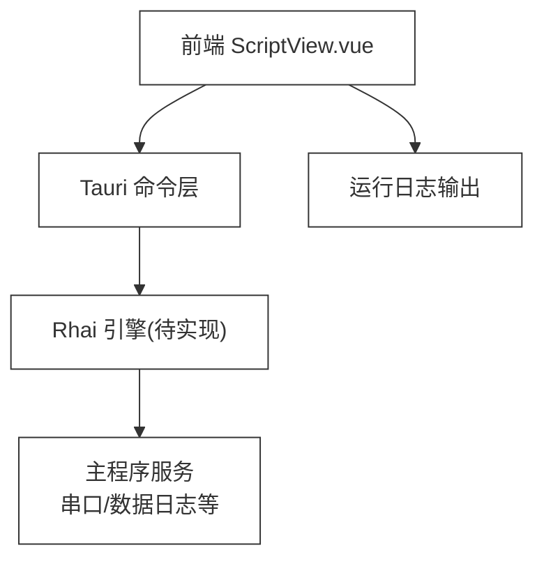
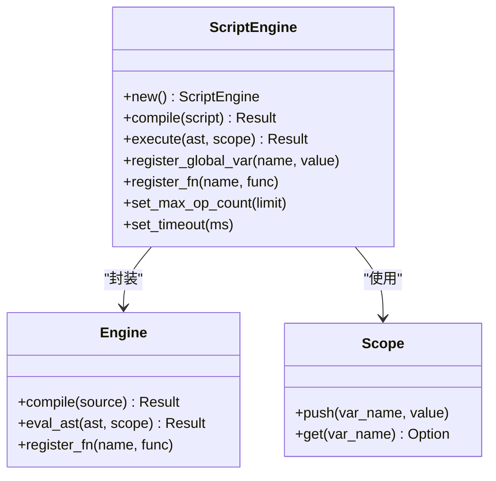
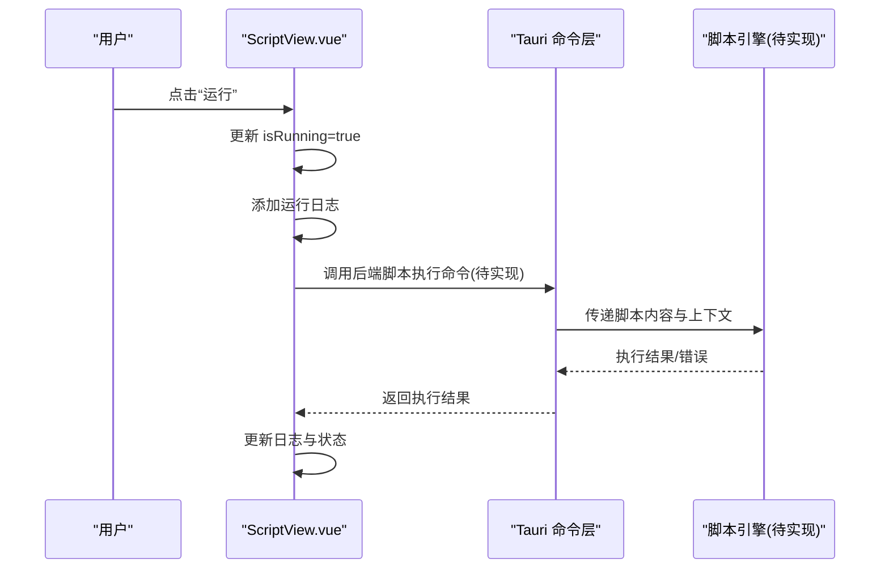
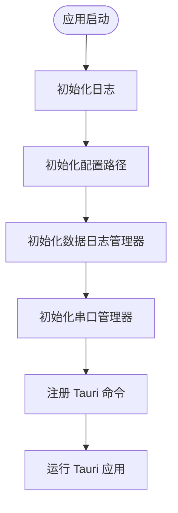
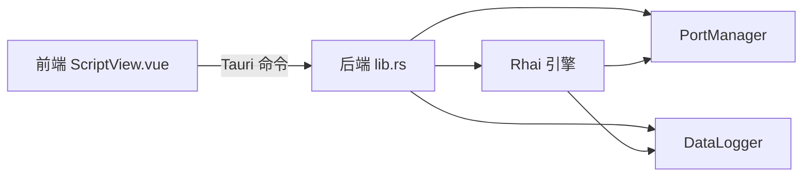

# 脚本引擎 API

<cite>
**本文档引用的文件**
- [Cargo.toml](file://src-tauri/Cargo.toml)
- [lib.rs](file://src-tauri/src/lib.rs)
- [main.rs](file://src-tauri/src/main.rs)
- [mod.rs](file://src-tauri/src/script/mod.rs)
- [ScriptView.vue](file://src/views/ScriptView.vue)
- [DESIGN.md](file://DESIGN.md)
</cite>

## 目录
1. [简介](#简介)
2. [项目结构](#项目结构)
3. [核心组件](#核心组件)
4. [架构总览](#架构总览)
5. [详细组件分析](#详细组件分析)
6. [依赖关系分析](#依赖关系分析)
7. [性能考虑](#性能考虑)
8. [故障排除指南](#故障排除指南)
9. [结论](#结论)
10. [附录](#附录)

## 简介
本文件为 KonSerial 应用中脚本引擎模块的全面 API 参考文档。当前仓库中已声明将集成 Rhai 脚本引擎以支持自定义脚本功能，并在前端提供了脚本编辑器界面。本文档基于现有源码与设计文档，系统梳理脚本引擎的 API 规范、数据类型映射、上下文管理、错误处理与性能监控建议、脚本与主程序的数据交换机制与安全边界、脚本编写参考与最佳实践，以及调试与故障排除指南。

## 项目结构
脚本引擎相关的核心位置如下：
- Rust 后端
  - 根构建与依赖：Cargo.toml
  - 应用入口与运行逻辑：lib.rs、main.rs
  - 脚本模块占位：src-tauri/src/script/mod.rs
- 前端
  - 脚本视图与交互：src/views/ScriptView.vue
- 设计说明
  - 脚本功能规划与 API 设计：DESIGN.md

**图表来源**
- [main.rs:1-7](file://src-tauri/src/main.rs#L1-L7)
- [lib.rs:1-84](file://src-tauri/src/lib.rs#L1-L84)
- [mod.rs:1-3](file://src-tauri/src/script/mod.rs#L1-L3)

**章节来源**
- [Cargo.toml:1-40](file://src-tauri/Cargo.toml#L1-L40)
- [lib.rs:1-84](file://src-tauri/src/lib.rs#L1-L84)
- [main.rs:1-7](file://src-tauri/src/main.rs#L1-L7)
- [mod.rs:1-3](file://src-tauri/src/script/mod.rs#L1-L3)

## 核心组件
- Rhai 脚本引擎集成
  - 依赖声明：rhai 版本 1.23.6，启用 serde、std、sync 特性
  - 目标用途：在 Rust 后端中解析与执行脚本，提供与主程序的数据交换与上下文绑定能力
- 前端脚本编辑器
  - 提供脚本编辑、运行、停止、保存、日志输出等交互
  - 示例脚本展示串口发送能力（通过 serial 对象）

**章节来源**
- [Cargo.toml:29](file://src-tauri/Cargo.toml#L29)
- [ScriptView.vue:18-35](file://src/views/ScriptView.vue#L18-L35)

## 架构总览
下图展示了前端脚本编辑器与后端脚本引擎的交互关系。当前后端尚未实现具体脚本执行逻辑，但已预留脚本模块与 Rhai 依赖；前端提供脚本运行控制与日志输出。

**图表来源**
- [lib.rs:47-82](file://src-tauri/src/lib.rs#L47-L82)
- [ScriptView.vue:60-100](file://src/views/ScriptView.vue#L60-L100)

## 详细组件分析

### 组件一：脚本引擎模块（Rhai）
- 当前状态
  - 模块存在占位文件，尚未实现具体脚本执行逻辑
  - Cargo.toml 已声明 rhai 依赖并启用 serde/std/sync 特性
- 设计预期
  - 提供脚本编译、AST 解析、执行上下文管理、变量绑定、函数注册等能力
  - 与主程序服务（如串口管理）进行安全的数据交换

**图表来源**
- [Cargo.toml:29](file://src-tauri/Cargo.toml#L29)
- [DESIGN.md:305](file://DESIGN.md#L305)
- [DESIGN.md:349](file://DESIGN.md#L349)
- [DESIGN.md:389](file://DESIGN.md#L389)

**章节来源**
- [mod.rs:1-3](file://src-tauri/src/script/mod.rs#L1-L3)
- [Cargo.toml:29](file://src-tauri/Cargo.toml#L29)
- [DESIGN.md:305](file://DESIGN.md#L305)
- [DESIGN.md:349](file://DESIGN.md#L349)
- [DESIGN.md:389](file://DESIGN.md#L389)

### 组件二：前端脚本编辑器（ScriptView.vue）
- 功能特性
  - 脚本编辑区域、运行/停止按钮、保存/新建操作
  - 日志输出面板，支持清空日志
  - 文件列表与脚本统计（行数、字符数）
- 示例脚本
  - 展示如何通过 serial 对象发送数据与定时任务

**图表来源**
- [ScriptView.vue:60-100](file://src/views/ScriptView.vue#L60-L100)
- [lib.rs:56-80](file://src-tauri/src/lib.rs#L56-L80)

**章节来源**
- [ScriptView.vue:18-100](file://src/views/ScriptView.vue#L18-L100)

### 组件三：Tauri 命令层与全局状态
- 全局状态
  - PortManager、DataLogger 等通过 manage 注入到 Tauri 应用生命周期
- 命令注册
  - 已注册基础命令与各模块命令，脚本引擎相关命令可在此扩展

**图表来源**
- [lib.rs:25-82](file://src-tauri/src/lib.rs#L25-L82)

**章节来源**
- [lib.rs:10-56](file://src-tauri/src/lib.rs#L10-L56)
- [lib.rs:56-82](file://src-tauri/src/lib.rs#L56-L82)

## 依赖关系分析
- 外部依赖
  - Rhai：提供脚本编译、执行、上下文与函数注册能力
  - Tauri：提供命令桥接、插件生态与桌面端运行环境
- 内部耦合
  - 前端通过 Tauri 命令与后端脚本引擎交互
  - 脚本引擎需访问主程序服务（如串口），需通过安全的上下文绑定实现

**图表来源**
- [lib.rs:47-82](file://src-tauri/src/lib.rs#L47-L82)
- [Cargo.toml:29](file://src-tauri/Cargo.toml#L29)

**章节来源**
- [Cargo.toml:20-40](file://src-tauri/Cargo.toml#L20-L40)
- [lib.rs:47-82](file://src-tauri/src/lib.rs#L47-L82)

## 性能考虑
- 执行限制
  - 设置最大运算步数与超时时间，防止长时间阻塞
- 上下文优化
  - 合理使用 Scope，避免频繁创建大对象
- 并发与线程
  - 在异步环境中执行脚本，避免阻塞主线程
- 日志与监控
  - 记录脚本执行耗时、错误次数与异常堆栈，便于性能分析

[本节为通用指导，无需特定文件来源]

## 故障排除指南
- 常见问题
  - 脚本无法运行：检查是否正确注册命令与上下文
  - 超时或死循环：设置合理的超时与运算步数限制
  - 数据交换失败：确认变量绑定与函数注册是否正确
- 调试建议
  - 使用日志输出中间结果
  - 分段执行脚本，定位问题范围
  - 检查 Rhai 错误信息与堆栈

[本节为通用指导，无需特定文件来源]

## 结论
当前仓库已为脚本引擎集成做好准备（Rhai 依赖与模块占位），前端提供了完整的脚本编辑与运行界面。后续工作重点是实现脚本引擎模块的具体功能，包括脚本编译执行、上下文绑定、函数注册与安全边界控制，并完善前后端命令对接与错误处理机制。

[本节为总结性内容，无需特定文件来源]

## 附录

### A. 脚本 API 调用规范（设计阶段）
- 脚本执行
  - 输入：脚本字符串
  - 输出：执行结果或错误
  - 关键参数：AST、Scope、Engine
- 变量绑定
  - 全局变量注册：名称、值
  - 作用域变量：按需 push/get
- 函数注册
  - 全局函数注册：名称、函数指针
- 上下文管理
  - 设置最大运算步数、超时时间
- 错误处理
  - 捕获编译错误、运行时错误与超时错误
- 性能监控
  - 记录执行耗时、错误次数、异常堆栈

**章节来源**
- [DESIGN.md:305](file://DESIGN.md#L305)
- [DESIGN.md:349](file://DESIGN.md#L349)
- [DESIGN.md:389](file://DESIGN.md#L389)
- [DESIGN.md:555](file://DESIGN.md#L555)

### B. 数据类型映射（设计阶段）
- Rhai Dynamic 与常见类型的映射关系
  - 数字、字符串、布尔、数组、对象等
  - 与 serde 的序列化/反序列化支持
- 主程序服务接口映射
  - 串口发送、连接状态查询等通过函数注册暴露给脚本

**章节来源**
- [Cargo.toml:29](file://src-tauri/Cargo.toml#L29)
- [DESIGN.md:305](file://DESIGN.md#L305)

### C. 脚本与主程序的数据交换机制与安全边界（设计阶段）
- 数据交换
  - 通过 Scope 与函数注册实现双向数据访问
- 安全边界
  - 限制运算步数与超时，避免恶意脚本
  - 仅暴露必要 API，避免直接访问底层资源

**章节来源**
- [DESIGN.md:305](file://DESIGN.md#L305)
- [DESIGN.md:349](file://DESIGN.md#L349)

### D. 脚本编写 API 参考与最佳实践（设计阶段）
- API 参考
  - Engine.compile、Engine.eval_ast、Scope.push、Engine.register_fn
- 最佳实践
  - 使用 try/catch 捕获错误
  - 控制脚本复杂度，避免长时间阻塞
  - 合理使用定时器与异步任务

**章节来源**
- [DESIGN.md:349](file://DESIGN.md#L349)
- [DESIGN.md:389](file://DESIGN.md#L389)