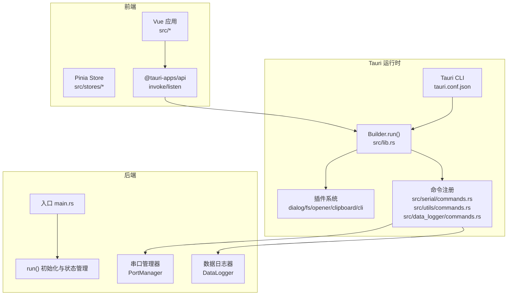
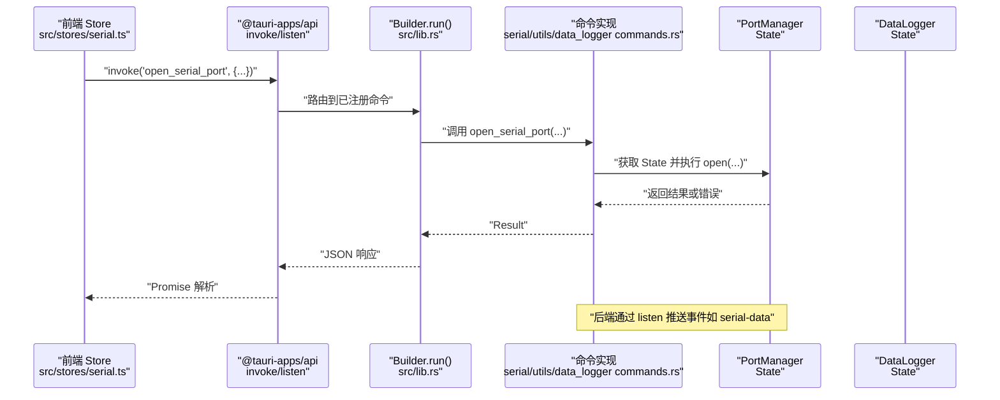
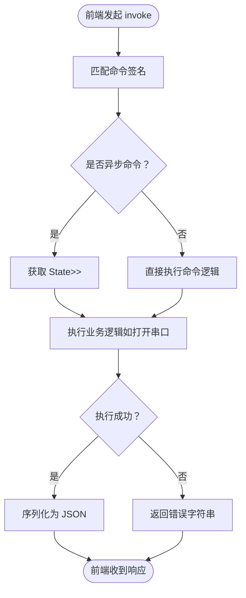
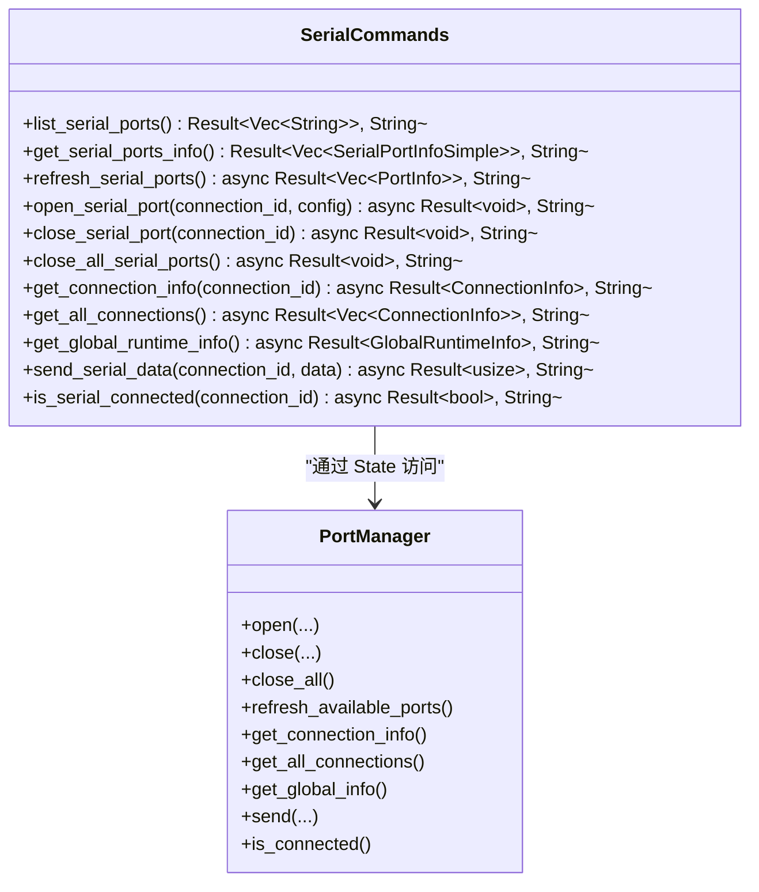
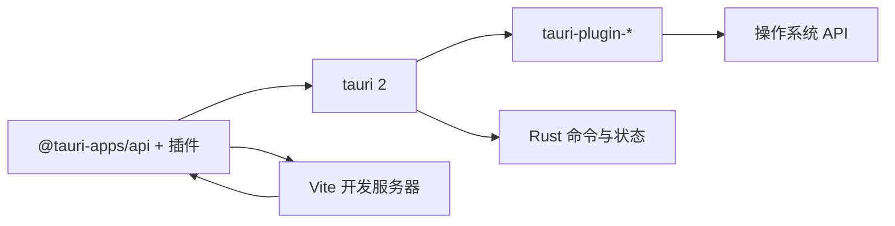

# Tauri 集成

<cite>
**本文引用的文件**
- [src-tauri/tauri.conf.json](file://src-tauri/tauri.conf.json)
- [src-tauri/Cargo.toml](file://src-tauri/Cargo.toml)
- [src-tauri/src/main.rs](file://src-tauri/src/main.rs)
- [src-tauri/src/lib.rs](file://src-tauri/src/lib.rs)
- [src-tauri/src/serial/commands.rs](file://src-tauri/src/serial/commands.rs)
- [src-tauri/src/utils/commands.rs](file://src-tauri/src/utils/commands.rs)
- [src-tauri/src/data_logger/commands.rs](file://src-tauri/src/data_logger/commands.rs)
- [src-tauri/capabilities/default.json](file://src-tauri/capabilities/default.json)
- [src-tauri/capabilities/desktop.json](file://src-tauri/capabilities/desktop.json)
- [src-tauri/build.rs](file://src-tauri/build.rs)
- [package.json](file://package.json)
- [vite.config.ts](file://vite.config.ts)
- [src/stores/serial.ts](file://src/stores/serial.ts)
- [src/stores/config.ts](file://src/stores/config.ts)
</cite>

## 目录
1. [简介](#简介)
2. [项目结构](#项目结构)
3. [核心组件](#核心组件)
4. [架构总览](#架构总览)
5. [详细组件分析](#详细组件分析)
6. [依赖关系分析](#依赖关系分析)
7. [性能考虑](#性能考虑)
8. [故障排查指南](#故障排查指南)
9. [结论](#结论)
10. [附录](#附录)

## 简介
本文件系统性梳理 KonSerial 中 Tauri 框架的集成方案，重点覆盖以下方面：
- Tauri 命令系统与前后端通信机制、数据传递格式
- Tauri 配置文件的各项选项及作用（窗口、权限、构建等）
- 插件系统的集成方式与扩展机制
- 跨平台兼容策略与平台特定配置
- 安全模型（权限控制与能力集）
- Tauri 命令的注册、调用与响应处理全流程
- 实际代码示例与配置模板路径
- 常见问题排查与性能优化建议

## 项目结构
KonSerial 的 Tauri 集成采用“前端 Vue + 后端 Rust + Tauri CLI”的典型分层架构。前端通过 @tauri-apps/api 在浏览器环境中以命令调用的方式与 Rust 后端交互；Rust 侧通过 tauri::Builder 注册命令与插件，统一管理全局状态。

图表来源
- [src-tauri/src/lib.rs:47-82](file://src-tauri/src/lib.rs#L47-L82)
- [src-tauri/src/main.rs:4-6](file://src-tauri/src/main.rs#L4-L6)
- [src-tauri/tauri.conf.json:12-23](file://src-tauri/tauri.conf.json#L12-L23)

章节来源
- [src-tauri/src/lib.rs:24-83](file://src-tauri/src/lib.rs#L24-L83)
- [src-tauri/src/main.rs:1-7](file://src-tauri/src/main.rs#L1-L7)
- [src-tauri/tauri.conf.json:12-23](file://src-tauri/tauri.conf.json#L12-L23)

## 核心组件
- 命令系统：Rust 侧通过 #[tauri::command] 宏声明命令，前端通过 invoke 调用，返回值自动序列化为 JSON。
- 插件系统：通过 tauri::Builder::plugin 注册，如对话框、剪贴板、文件系统、打开器、CLI。
- 全局状态：通过 .manage 注入 PortManager 与 DataLogger，供命令在 State 中访问。
- 能力集与权限：通过 capabilities/*.json 声明窗口与权限，限制命令与插件的可用范围。
- 构建与开发：Vite 配置固定端口与热重载，Tauri 配置 devUrl 与 build 前置脚本。

章节来源
- [src-tauri/src/lib.rs:47-82](file://src-tauri/src/lib.rs#L47-L82)
- [src-tauri/src/serial/commands.rs:16-129](file://src-tauri/src/serial/commands.rs#L16-L129)
- [src-tauri/src/utils/commands.rs:4-31](file://src-tauri/src/utils/commands.rs#L4-L31)
- [src-tauri/src/data_logger/commands.rs:8-49](file://src-tauri/src/data_logger/commands.rs#L8-L49)
- [src-tauri/capabilities/default.json:8-12](file://src-tauri/capabilities/default.json#L8-L12)
- [src-tauri/capabilities/desktop.json:11-13](file://src-tauri/capabilities/desktop.json#L11-L13)
- [vite.config.ts:23-38](file://vite.config.ts#L23-L38)

## 架构总览
下图展示从前端调用到后端执行再到事件回推的完整链路，以及命令注册与插件装载的关键节点。

图表来源
- [src-tauri/src/lib.rs:56-81](file://src-tauri/src/lib.rs#L56-L81)
- [src-tauri/src/serial/commands.rs:50-59](file://src-tauri/src/serial/commands.rs#L50-L59)
- [src/stores/serial.ts:158-179](file://src/stores/serial.ts#L158-L179)

## 详细组件分析

### 命令系统与前后端通信
- 前端调用：通过 @tauri-apps/api 的 invoke 调用后端命令，参数与返回值自动进行 JSON 序列化/反序列化。
- 后端注册：在 lib.rs 的 Builder 中集中注册命令，包括基础命令、配置管理、串口管理、数据日志等。
- 异步与状态：串口相关命令使用 async 并通过 State 获取 PortManager；数据日志命令通过 State 获取 DataLogger。
- 错误处理：命令返回 Result<T, String>，前端捕获错误并打印日志。

图表来源
- [src-tauri/src/lib.rs:56-81](file://src-tauri/src/lib.rs#L56-L81)
- [src-tauri/src/serial/commands.rs:42-59](file://src-tauri/src/serial/commands.rs#L42-L59)
- [src-tauri/src/utils/commands.rs:4-23](file://src-tauri/src/utils/commands.rs#L4-L23)
- [src-tauri/src/data_logger/commands.rs:8-39](file://src-tauri/src/data_logger/commands.rs#L8-L39)

章节来源
- [src/stores/serial.ts:146-179](file://src/stores/serial.ts#L146-L179)
- [src-tauri/src/lib.rs:56-81](file://src-tauri/src/lib.rs#L56-L81)
- [src-tauri/src/serial/commands.rs:16-129](file://src-tauri/src/serial/commands.rs#L16-L129)
- [src-tauri/src/utils/commands.rs:4-31](file://src-tauri/src/utils/commands.rs#L4-L31)
- [src-tauri/src/data_logger/commands.rs:8-49](file://src-tauri/src/data_logger/commands.rs#L8-L49)

### 串口命令族
- 列表与刷新：列出可用串口、刷新详细信息。
- 连接管理：打开/关闭指定连接、关闭全部、查询连接状态、获取全局运行时信息。
- 数据收发：向指定连接发送字节数据，检查连接状态。
- 参数与返回：命令参数多为简单类型或结构体，返回值为 Result<T, String>，前端通过 invoke 获取。

图表来源
- [src-tauri/src/serial/commands.rs:16-129](file://src-tauri/src/serial/commands.rs#L16-L129)

章节来源
- [src-tauri/src/serial/commands.rs:16-129](file://src-tauri/src/serial/commands.rs#L16-L129)

### 配置命令族
- 加载配置：支持传入可选路径，默认使用跨平台默认配置路径。
- 保存配置：将传入配置写入磁盘，同时补全路径字段。
- 获取默认路径：返回默认配置文件路径字符串。

章节来源
- [src-tauri/src/utils/commands.rs:4-31](file://src-tauri/src/utils/commands.rs#L4-L31)
- [src/stores/config.ts:42-64](file://src/stores/config.ts#L42-L64)

### 数据日志命令族
- 会话管理：获取会话列表、读取会话数据、删除会话、导出 CSV。
- 查询参数：支持方向、limit、offset 等筛选条件。
- 返回值：会话数据为结构体数组，导出返回文件路径字符串。

章节来源
- [src-tauri/src/data_logger/commands.rs:8-49](file://src-tauri/src/data_logger/commands.rs#L8-L49)

### 插件系统与扩展机制
- 已启用插件：对话框、剪贴板、文件系统、打开器、CLI。
- 注册方式：在 lib.rs 的 Builder 中逐个 plugin(...) 初始化并注册。
- 扩展方式：新增插件只需在 Cargo.toml 增加依赖并在 lib.rs 注册即可。

章节来源
- [src-tauri/src/lib.rs:48-52](file://src-tauri/src/lib.rs#L48-L52)
- [src-tauri/Cargo.toml:20-36](file://src-tauri/Cargo.toml#L20-L36)

### 能力集与权限控制
- 默认能力 default.json：限定主窗口 main，允许 core、opener、fs 权限。
- 桌面能力 desktop.json：限定 macOS/windows/linux 平台，允许 cli 权限。
- 能力与插件的关系：能力集决定哪些插件/命令可在该窗口可用。

章节来源
- [src-tauri/capabilities/default.json:8-12](file://src-tauri/capabilities/default.json#L8-L12)
- [src-tauri/capabilities/desktop.json:11-13](file://src-tauri/capabilities/desktop.json#L11-L13)

### 跨平台兼容性与平台特定配置
- 平台依赖：仅在非移动端（Android/iOS）编译时启用 CLI 插件。
- 平台能力：desktop.json 显式声明 macOS/windows/linux 支持。
- 窗口与安全：窗口尺寸与标题在 tauri.conf.json 中定义；安全策略中 CSP 设为 null。

章节来源
- [src-tauri/Cargo.toml:38-39](file://src-tauri/Cargo.toml#L38-L39)
- [src-tauri/capabilities/desktop.json:3-7](file://src-tauri/capabilities/desktop.json#L3-L7)
- [src-tauri/tauri.conf.json:13-22](file://src-tauri/tauri.conf.json#L13-L22)

### 前端调用与事件回推
- 前端 Store：封装 invoke 调用、错误处理、轮询更新、事件监听。
- 事件监听：通过 listen('serial-data') 接收后端推送的原始字节数据，交由回调处理。
- 数据发送：支持文本与十六进制两种模式，统一转换为字节数组后调用 send_serial_data。

章节来源
- [src/stores/serial.ts:146-295](file://src/stores/serial.ts#L146-L295)
- [src/stores/config.ts:42-64](file://src/stores/config.ts#L42-L64)

## 依赖关系分析
- 前端依赖：@tauri-apps/api 与各插件包，版本与后端保持一致。
- 后端依赖：tauri 2 与多个官方插件；Cargo.toml 中按平台条件启用 CLI 插件。
- 构建依赖：tauri-build 与 tauri_build::build()。

图表来源
- [package.json:12-27](file://package.json#L12-L27)
- [src-tauri/Cargo.toml:20-36](file://src-tauri/Cargo.toml#L20-L36)
- [src-tauri/build.rs:1-4](file://src-tauri/build.rs#L1-L4)

章节来源
- [package.json:12-27](file://package.json#L12-L27)
- [src-tauri/Cargo.toml:20-36](file://src-tauri/Cargo.toml#L20-L36)
- [src-tauri/build.rs:1-4](file://src-tauri/build.rs#L1-L4)

## 性能考虑
- 异步 I/O：串口读写与数据库操作均采用异步，避免阻塞主线程。
- 状态锁粒度：PortManager 使用 Mutex 包裹，避免并发冲突；尽量缩短持有时间。
- 前端缓冲：接收数据缓冲区限制最大长度，防止内存膨胀。
- 轮询策略：全局状态轮询间隔可调，避免频繁 invoke。
- 事件驱动：优先使用后端推送事件（如 serial-data），减少轮询频率。

章节来源
- [src-tauri/src/serial/commands.rs:42-59](file://src-tauri/src/serial/commands.rs#L42-L59)
- [src/stores/serial.ts:105-112](file://src/stores/serial.ts#L105-L112)
- [src/stores/serial.ts:348-353](file://src/stores/serial.ts#L348-L353)

## 故障排查指南
- 命令未找到
  - 检查命令是否在 lib.rs 的 generate_handler 中注册。
  - 确认命令签名与前端 invoke 调用一致。
- 权限不足
  - 检查 capabilities/*.json 是否包含所需权限（如 fs、opener、cli）。
  - 确认目标平台是否在 desktop-capability 中声明。
- 插件未生效
  - 检查 Cargo.toml 依赖与 lib.rs 的 plugin(...) 调用是否一致。
  - 确认平台条件（非 mobile）满足 CLI 插件启用。
- 开发调试
  - 确认 Vite 端口与 tauri.conf.json 的 devUrl 一致。
  - 若 HMR 失败，检查 host 与 strictPort 配置。
- 日志定位
  - 后端使用日志初始化与 info 输出，前端捕获错误并打印。

章节来源
- [src-tauri/src/lib.rs:56-81](file://src-tauri/src/lib.rs#L56-L81)
- [src-tauri/capabilities/default.json:8-12](file://src-tauri/capabilities/default.json#L8-L12)
- [src-tauri/capabilities/desktop.json:11-13](file://src-tauri/capabilities/desktop.json#L11-L13)
- [src-tauri/Cargo.toml:38-39](file://src-tauri/Cargo.toml#L38-L39)
- [vite.config.ts:23-38](file://vite.config.ts#L23-L38)
- [src-tauri/tauri.conf.json:6-11](file://src-tauri/tauri.conf.json#L6-L11)

## 结论
KonSerial 的 Tauri 集成遵循“命令驱动 + 插件扩展 + 能力集权限控制”的设计，前后端通过 invoke 与事件实现清晰的职责分离。通过合理的异步与状态管理、平台特定配置与能力集约束，项目在功能完整性与安全性之间取得平衡。建议后续可进一步完善错误边界与事件去抖策略，提升用户体验与稳定性。

## 附录

### Tauri 配置项速览与说明
- 基本信息：productName、version、identifier
- 构建：beforeDevCommand、devUrl、beforeBuildCommand、frontendDist
- 应用：windows（窗口标题、宽高）、security.csp
- 插件：cli（命令行参数定义）
- 打包：bundle.targets、bundle.icon

章节来源
- [src-tauri/tauri.conf.json:1-47](file://src-tauri/tauri.conf.json#L1-L47)

### 前端调用模板（路径）
- 打开串口连接：[src/stores/serial.ts:158-179](file://src/stores/serial.ts#L158-L179)
- 发送数据：[src/stores/serial.ts:243-274](file://src/stores/serial.ts#L243-L274)
- 获取全局信息：[src/stores/serial.ts:234-240](file://src/stores/serial.ts#L234-L240)
- 加载/保存配置：[src/stores/config.ts:42-64](file://src/stores/config.ts#L42-L64)

### 后端命令注册模板（路径）
- 命令注册入口：[src-tauri/src/lib.rs:56-81](file://src-tauri/src/lib.rs#L56-L81)
- 串口命令实现：[src-tauri/src/serial/commands.rs:16-129](file://src-tauri/src/serial/commands.rs#L16-L129)
- 配置命令实现：[src-tauri/src/utils/commands.rs:4-31](file://src-tauri/src/utils/commands.rs#L4-L31)
- 数据日志命令实现：[src-tauri/src/data_logger/commands.rs:8-49](file://src-tauri/src/data_logger/commands.rs#L8-L49)

### 能力集与插件清单（路径）
- 默认能力：[src-tauri/capabilities/default.json:8-12](file://src-tauri/capabilities/default.json#L8-L12)
- 桌面能力：[src-tauri/capabilities/desktop.json:11-13](file://src-tauri/capabilities/desktop.json#L11-L13)
- 插件依赖与启用：[src-tauri/Cargo.toml:20-36](file://src-tauri/Cargo.toml#L20-L36)
- 插件注册：[src-tauri/src/lib.rs:48-52](file://src-tauri/src/lib.rs#L48-L52)