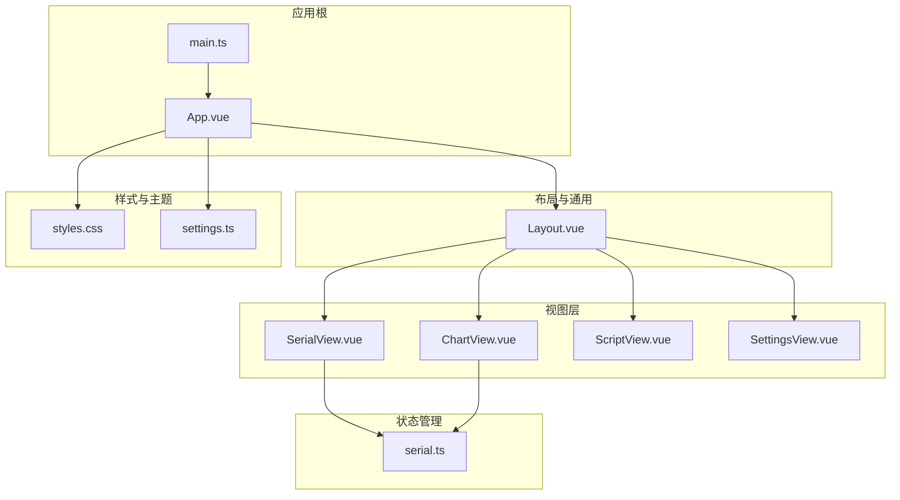
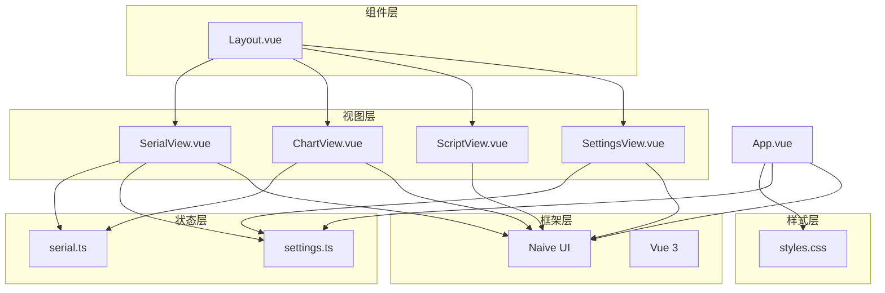
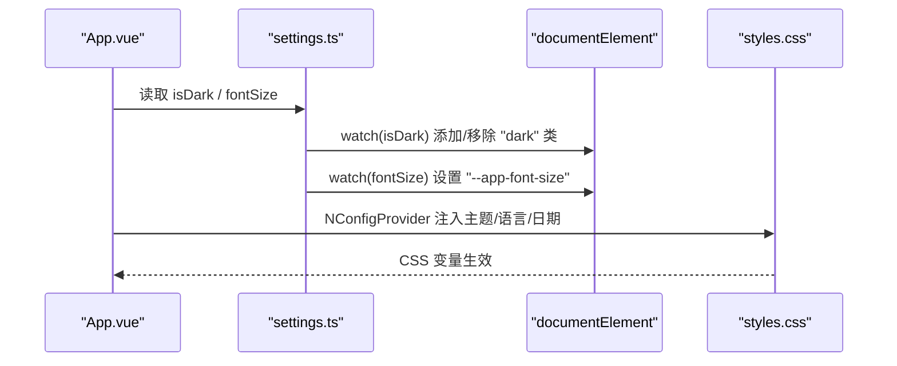
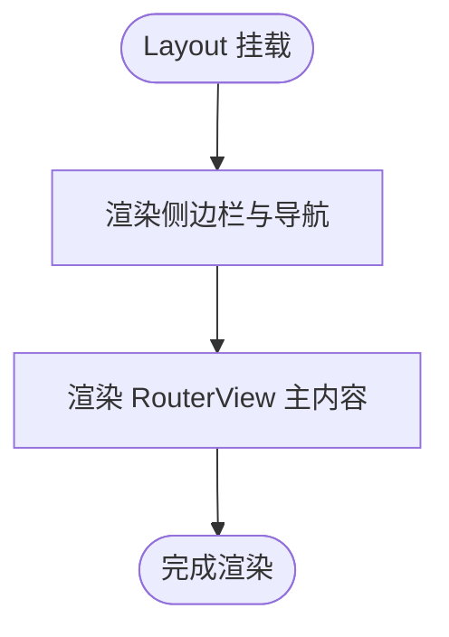
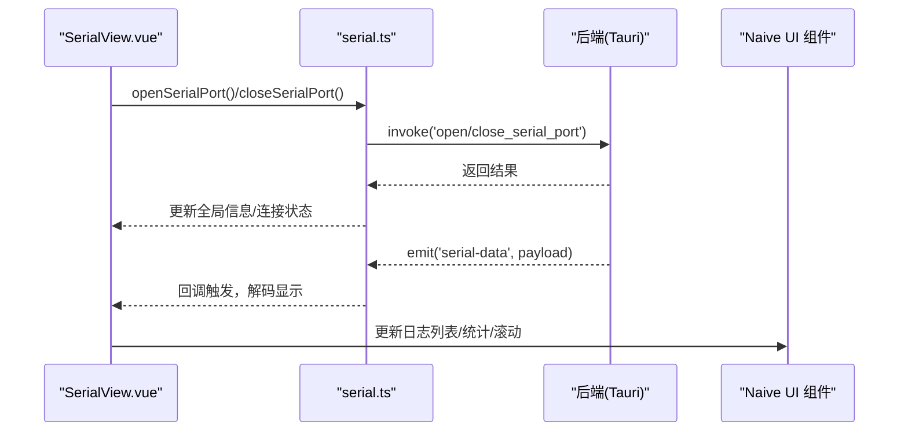
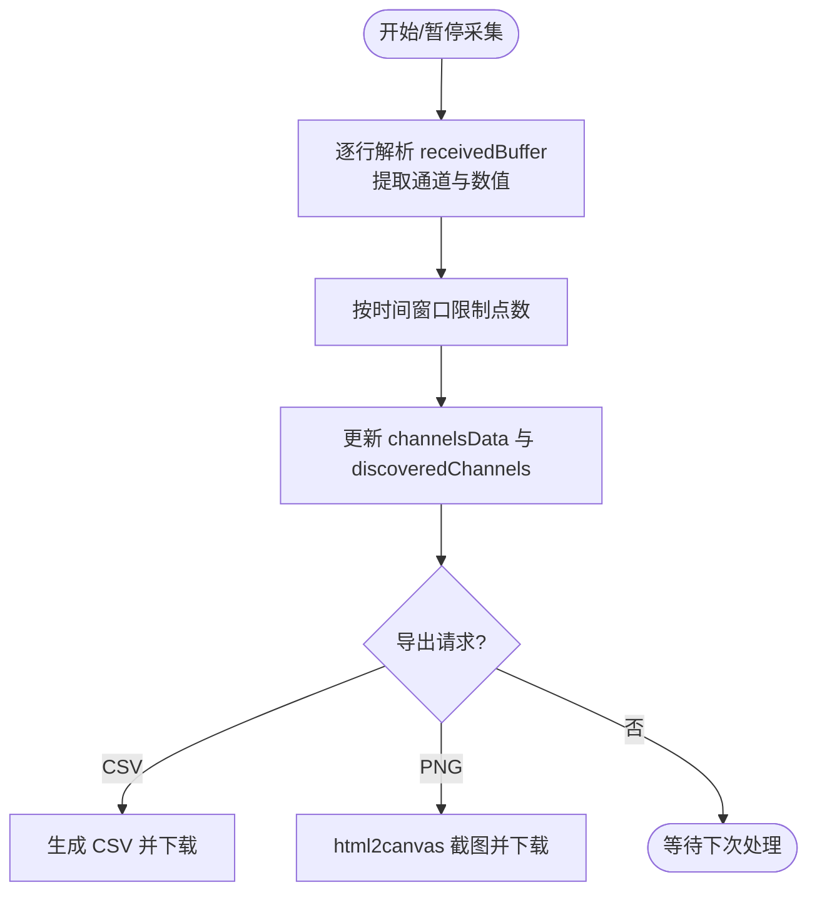
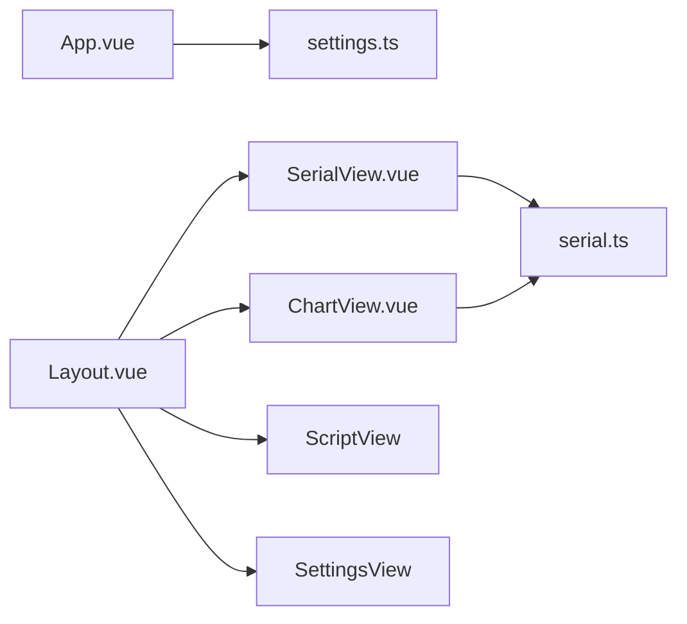

# UI 组件设计

<cite>
**本文引用的文件**
- [App.vue](file://src/App.vue)
- [main.ts](file://src/main.ts)
- [styles.css](file://src/assets/styles.css)
- [Layout.vue](file://src/components/Layout.vue)
- [SerialView.vue](file://src/views/SerialView.vue)
- [ChartView.vue](file://src/views/ChartView.vue)
- [ScriptView.vue](file://src/views/ScriptView.vue)
- [SettingsView.vue](file://src/views/SettingsView.vue)
- [settings.ts](file://src/stores/settings.ts)
- [serial.ts](file://src/stores/serial.ts)
- [DESIGN.md](file://DESIGN.md)
- [README.md](file://README.md)
</cite>

## 目录
1. [简介](#简介)
2. [项目结构](#项目结构)
3. [核心组件](#核心组件)
4. [架构总览](#架构总览)
5. [详细组件分析](#详细组件分析)
6. [依赖关系分析](#依赖关系分析)
7. [性能考量](#性能考量)
8. [故障排查指南](#故障排查指南)
9. [结论](#结论)
10. [附录](#附录)

## 简介
本文件面向 UI/UX 设计师与前端开发者，系统化梳理 KonSerial 的用户界面组件设计与实现。项目采用 Vue 3 + Naive UI + TypeScript 构建，结合 CSS 变量与主题系统、响应式布局与 Tailwind CSS，提供现代化、可定制、跨平台的串口调试工具界面。文档重点覆盖：
- 基于 Naive UI 的组件使用规范与设计原则
- 自定义样式体系（CSS 变量、主题定制、响应式布局）
- 图表可视化（ApexCharts 集成与实时渲染思路）
- 组件状态管理、事件处理与用户交互模式
- 可访问性与跨浏览器兼容性
- 组件复用与组合设计最佳实践
- 实际组件代码示例与使用场景

## 项目结构
前端采用模块化组织，围绕“页面视图 + 组件 + 状态管理 + 工具样式”的层次划分：
- 视图层：SerialView、ChartView、ScriptView、SettingsView
- 布局与通用：Layout.vue
- 样式：全局 CSS 变量与主题注入
- 状态：Pinia stores（settings、serial 等）

**图表来源**
- [App.vue](file://src/App.vue)
- [main.ts](file://src/main.ts)
- [Layout.vue](file://src/components/Layout.vue)
- [SerialView.vue](file://src/views/SerialView.vue)
- [ChartView.vue](file://src/views/ChartView.vue)
- [ScriptView.vue](file://src/views/ScriptView.vue)
- [SettingsView.vue](file://src/views/SettingsView.vue)
- [styles.css](file://src/assets/styles.css)
- [settings.ts](file://src/stores/settings.ts)
- [serial.ts](file://src/stores/serial.ts)

**章节来源**
- [App.vue:1-33](file://src/App.vue#L1-L33)
- [main.ts:1-14](file://src/main.ts#L1-L14)
- [Layout.vue:1-121](file://src/components/Layout.vue#L1-L121)
- [SerialView.vue:1-746](file://src/views/SerialView.vue#L1-L746)
- [ChartView.vue:1-800](file://src/views/ChartView.vue#L1-L800)
- [ScriptView.vue:1-442](file://src/views/ScriptView.vue#L1-L442)
- [SettingsView.vue:1-383](file://src/views/SettingsView.vue#L1-L383)
- [styles.css:1-60](file://src/assets/styles.css#L1-L60)
- [settings.ts:1-125](file://src/stores/settings.ts#L1-L125)
- [serial.ts:1-363](file://src/stores/serial.ts#L1-L363)

## 核心组件
- 应用根与主题注入：App.vue 通过 Naive UI 的 ConfigProvider 注入主题、语言与日期本地化；在挂载时加载配置、应用主题与字号。
- 布局容器：Layout.vue 提供侧边导航与主内容区，使用 CSS 变量实现深浅主题切换与过渡。
- 页面视图：
  - 串口调试：SerialView.vue 提供端口配置、连接控制、终端显示、发送输入与统计信息。
  - 波形图表：ChartView.vue 提供通道解析、时间窗口、显示配置与导出能力（占位为后续集成 ECharts/ApexCharts）。
  - 脚本编辑：ScriptView.vue 提供脚本编辑、运行/停止、日志输出与文件管理。
  - 设置中心：SettingsView.vue 提供外观、语言、字号、数据缓冲等设置项。
- 状态管理：
  - settings.ts：主题、语言、字号、数据设置与 DOM 应用副作用。
  - serial.ts：串口连接、数据收发、事件监听、全局运行时信息与接收缓冲。

**章节来源**
- [App.vue:12-33](file://src/App.vue#L12-L33)
- [Layout.vue:9-42](file://src/components/Layout.vue#L9-L42)
- [SerialView.vue:34-254](file://src/views/SerialView.vue#L34-L254)
- [ChartView.vue:18-209](file://src/views/ChartView.vue#L18-L209)
- [ScriptView.vue:17-101](file://src/views/ScriptView.vue#L17-L101)
- [SettingsView.vue:23-64](file://src/views/SettingsView.vue#L23-L64)
- [settings.ts:20-125](file://src/stores/settings.ts#L20-L125)
- [serial.ts:64-363](file://src/stores/serial.ts#L64-L363)

## 架构总览
整体采用“视图 + 组件 + 状态 + 样式”的分层架构，Naive UI 作为基础 UI 组件库，结合 CSS 变量与 Tailwind 实现主题与响应式设计；Pinia 管理全局状态；路由驱动页面切换。

**图表来源**
- [SerialView.vue](file://src/views/SerialView.vue)
- [ChartView.vue](file://src/views/ChartView.vue)
- [ScriptView.vue](file://src/views/ScriptView.vue)
- [SettingsView.vue](file://src/views/SettingsView.vue)
- [Layout.vue](file://src/components/Layout.vue)
- [settings.ts](file://src/stores/settings.ts)
- [serial.ts](file://src/stores/serial.ts)
- [styles.css](file://src/assets/styles.css)
- [App.vue](file://src/App.vue)

## 详细组件分析

### 应用根与主题系统（App.vue + settings.ts + styles.css）
- 主题注入：App.vue 使用 NConfigProvider 注入 Naive UI 主题、语言与日期本地化；computed 主题根据 isDark 切换。
- 主题与字号应用：settings.ts 通过 watch 将 isDark 与 fontSize 写入 DOM，实现即时主题与字号生效。
- 全局样式：styles.css 定义 CSS 变量（如 --app-font-size、--bg-page、--text-primary），并为深色模式提供覆盖。

**图表来源**
- [App.vue:12-33](file://src/App.vue#L12-L33)
- [settings.ts:102-117](file://src/stores/settings.ts#L102-L117)
- [styles.css:3-60](file://src/assets/styles.css#L3-L60)

**章节来源**
- [App.vue:12-33](file://src/App.vue#L12-L33)
- [settings.ts:20-117](file://src/stores/settings.ts#L20-L117)
- [styles.css:3-60](file://src/assets/styles.css#L3-L60)

### 布局组件（Layout.vue）
- 结构：侧边栏（导航项）+ 主内容区（RouterView）。
- 主题：通过 CSS 变量与类名切换实现深浅主题。
- 导航：菜单项与路由绑定，激活态样式区分。

**图表来源**
- [Layout.vue:17-42](file://src/components/Layout.vue#L17-L42)

**章节来源**
- [Layout.vue:1-121](file://src/components/Layout.vue#L1-L121)

### 串口调试视图（SerialView.vue）
- 功能要点：
  - 端口配置：端口选择、波特率、数据位、停止位、奇偶校验、流控。
  - 连接控制：打开/关闭串口、连接状态指示、统计信息。
  - 终端显示：接收日志（含时间戳、类型、内容）、编码切换、自动滚动。
  - 发送输入：文本/十六进制发送、换行追加、清空日志。
  - 事件监听：注册串口数据回调，解码显示，同步到全局接收缓冲。
- 组件交互：Naive UI 组件（Select、Input、Button、Switch、Scrollbar 等）与本地状态联动。

**图表来源**
- [SerialView.vue:156-254](file://src/views/SerialView.vue#L156-L254)
- [serial.ts:157-240](file://src/stores/serial.ts#L157-L240)
- [serial.ts:311-341](file://src/stores/serial.ts#L311-L341)

**章节来源**
- [SerialView.vue:34-254](file://src/views/SerialView.vue#L34-L254)
- [serial.ts:64-363](file://src/stores/serial.ts#L64-L363)

### 波形图表视图（ChartView.vue）
- 功能要点：
  - 数据采集：从 receivedBuffer 逐行解析“name:value”，按通道存储时间序列。
  - 通道管理：自动发现通道、勾选显示、颜色分配。
  - 显示配置：时间窗口、自动/手动 Y 轴范围、网格、线条宽度。
  - 导出：CSV 导出、截图导出（html2canvas）。
- 当前状态：图表区域为占位，后续可接入 ECharts/ApexCharts 实现实时渲染。

**图表来源**
- [ChartView.vue:100-209](file://src/views/ChartView.vue#L100-L209)
- [serial.ts:96-117](file://src/stores/serial.ts#L96-L117)

**章节来源**
- [ChartView.vue:18-209](file://src/views/ChartView.vue#L18-L209)
- [serial.ts:96-117](file://src/stores/serial.ts#L96-L117)

### 脚本编辑视图（ScriptView.vue）
- 功能要点：
  - 脚本编辑：行号、内容变更检测、运行/停止、保存/新建/打开。
  - 日志输出：带时间戳的日志列表，区分 info/error/success。
  - 文件管理：左侧文件树占位，支持新建/打开/保存。
- 交互：Naive UI 组件与本地状态联动，运行时通过消息提示反馈。

**章节来源**
- [ScriptView.vue:17-101](file://src/views/ScriptView.vue#L17-L101)

### 设置视图（SettingsView.vue）
- 功能要点：
  - 外观：主题（浅色/深色/自动）、语言、字号。
  - 数据：自动保存开关、保存间隔、最大缓冲区。
  - 关于：应用信息与技术栈展示。
- 交互：通过 Pinia store 修改设置并持久化。

**章节来源**
- [SettingsView.vue:23-64](file://src/views/SettingsView.vue#L23-L64)
- [settings.ts:20-125](file://src/stores/settings.ts#L20-L125)

## 依赖关系分析
- 组件耦合：
  - SerialView 与 ChartView 均依赖 serial.ts 的 receivedBuffer 与连接状态。
  - App.vue 依赖 settings.ts 的主题与语言配置。
  - Layout.vue 作为路由容器，承载各视图。
- 外部依赖：
  - Naive UI：提供基础 UI 组件与主题覆盖。
  - CSS 变量与 Tailwind：提供主题与响应式能力。
  - ApexCharts（计划）：用于实时波形渲染。

**图表来源**
- [SerialView.vue](file://src/views/SerialView.vue)
- [ChartView.vue](file://src/views/ChartView.vue)
- [Layout.vue](file://src/components/Layout.vue)
- [App.vue](file://src/App.vue)
- [settings.ts](file://src/stores/settings.ts)
- [serial.ts](file://src/stores/serial.ts)

**章节来源**
- [SerialView.vue:234-254](file://src/views/SerialView.vue#L234-L254)
- [ChartView.vue:100-132](file://src/views/ChartView.vue#L100-L132)
- [App.vue:12-33](file://src/App.vue#L12-L33)
- [settings.ts:20-117](file://src/stores/settings.ts#L20-L117)
- [serial.ts:64-117](file://src/stores/serial.ts#L64-L117)

## 性能考量
- 数据缓冲与裁剪：receivedBuffer 与日志列表均限制最大长度，避免内存膨胀。
- 事件轮询：串口状态轮询与数据处理轮询需在组件卸载时清理，防止内存泄漏。
- 图表渲染：ChartView 当前为占位，接入图表库时建议：
  - 使用虚拟滚动与增量更新
  - 限制每通道点数与采样频率
  - 使用 requestAnimationFrame 控制渲染节奏
- 主题与字号：通过 CSS 变量与 DOM 属性更新，避免全量重绘。

**章节来源**
- [serial.ts:105-117](file://src/stores/serial.ts#L105-L117)
- [SerialView.vue:212-228](file://src/views/SerialView.vue#L212-L228)
- [ChartView.vue:91-98](file://src/views/ChartView.vue#L91-L98)

## 故障排查指南
- 无法连接串口
  - 检查端口权限与占用；查看消息提示与连接状态。
  - 确认波特率、数据位、停止位、校验位配置正确。
- 接收数据显示异常
  - 切换编码（UTF-8/GBK）；检查十六进制显示与自动滚动。
  - 查看日志类型（TX/RX/SYS/ERR）与时间戳。
- 图表无数据
  - 确认数据格式为“name:value”；检查采集开关与时间窗口。
  - 导出 CSV 校验是否生成数据。
- 主题/字号不生效
  - 确认 settings.ts 的 watch 是否执行；检查 DOM 上的 dark 类与 --app-font-size。

**章节来源**
- [SerialView.vue:140-205](file://src/views/SerialView.vue#L140-L205)
- [ChartView.vue:116-177](file://src/views/ChartView.vue#L116-L177)
- [settings.ts:102-117](file://src/stores/settings.ts#L102-L117)

## 结论
KonSerial 的 UI 设计以 Naive UI 为基础，结合 CSS 变量与 Tailwind 实现主题与响应式，通过 Pinia 管理状态与事件，形成清晰的分层架构。串口调试、图表可视化、脚本编辑与设置中心四大视图覆盖核心使用场景。后续可将 ApexCharts 集成至 ChartView，完善实时波形渲染；同时强化可访问性与跨浏览器兼容性，提升用户体验与稳定性。

## 附录
- 设计理念与技术栈参考：[DESIGN.md](file://DESIGN.md)
- 快速上手与使用说明：[README.md](file://README.md)