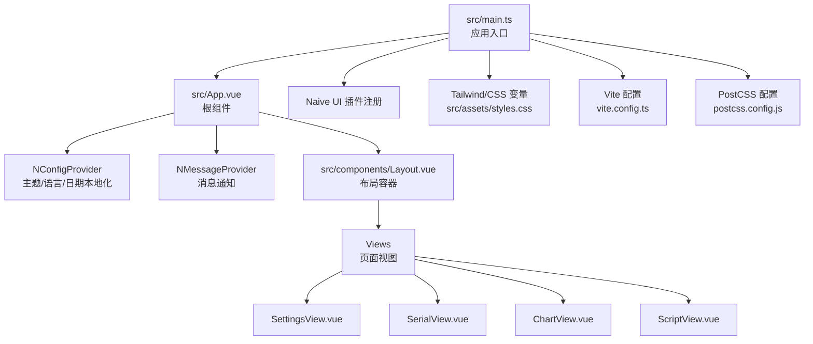
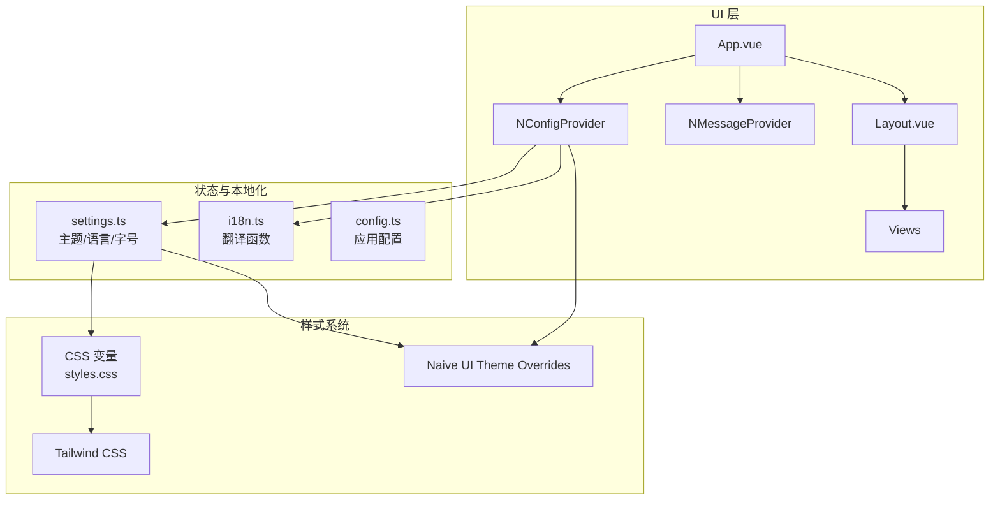
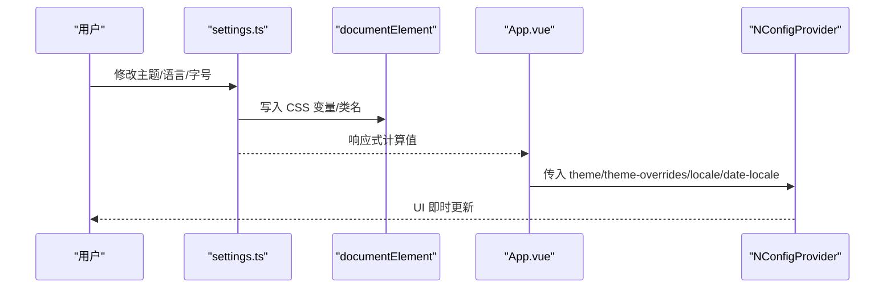
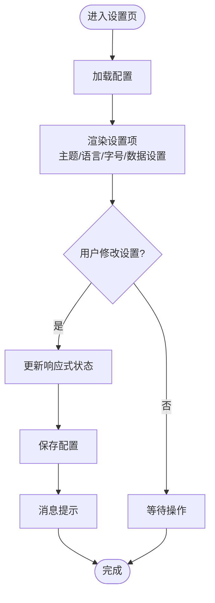
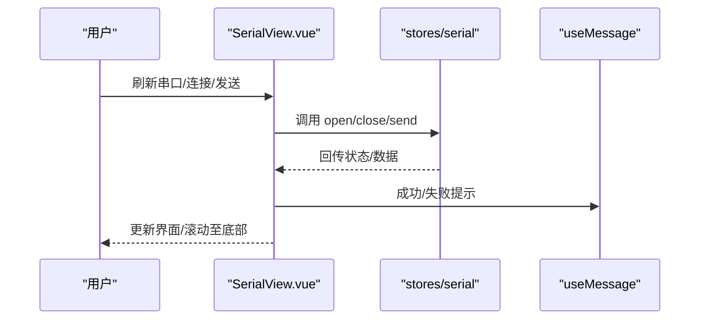
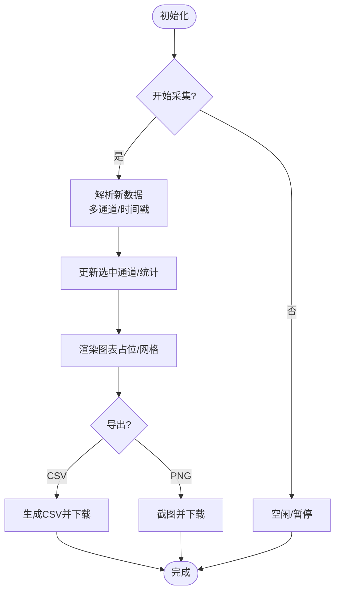
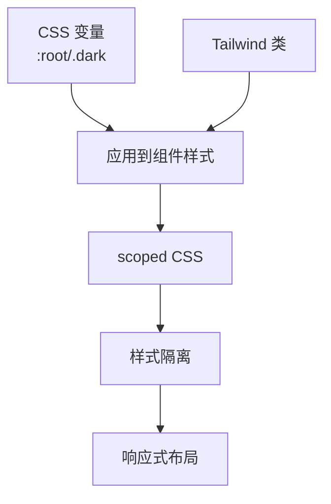
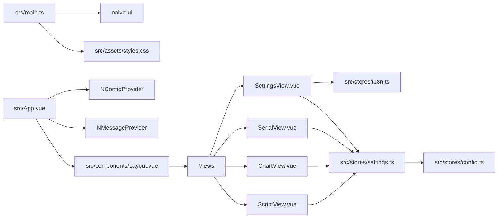

# UI 组件集成

<cite>
**本文引用的文件**
- [package.json](file://package.json)
- [vite.config.ts](file://vite.config.ts)
- [postcss.config.js](file://postcss.config.js)
- [src/assets/styles.css](file://src/assets/styles.css)
- [src/main.ts](file://src/main.ts)
- [src/App.vue](file://src/App.vue)
- [src/components/Layout.vue](file://src/components/Layout.vue)
- [src/stores/settings.ts](file://src/stores/settings.ts)
- [src/stores/i18n.ts](file://src/stores/i18n.ts)
- [src/stores/config.ts](file://src/stores/config.ts)
- [src/views/SettingsView.vue](file://src/views/SettingsView.vue)
- [src/views/SerialView.vue](file://src/views/SerialView.vue)
- [src/views/ChartView.vue](file://src/views/ChartView.vue)
- [src/views/ScriptView.vue](file://src/views/ScriptView.vue)
</cite>

## 目录
1. [简介](#简介)
2. [项目结构](#项目结构)
3. [核心组件](#核心组件)
4. [架构总览](#架构总览)
5. [详细组件分析](#详细组件分析)
6. [依赖关系分析](#依赖关系分析)
7. [性能考量](#性能考量)
8. [故障排查指南](#故障排查指南)
9. [结论](#结论)
10. [附录](#附录)

## 简介
本文件面向 KonSerial 前端 UI 组件集成，围绕 Naive UI 组件库的引入、主题与语言国际化、组件样式覆盖与全局配置进行系统化说明；同时结合项目现有 Tailwind CSS 与 CSS 变量体系，给出样式设计原则、命名规范与响应式策略，并总结常见组件的使用方式、最佳实践与扩展方法。文档还涵盖样式系统的架构（模块化 CSS、CSS-in-JS 与样式隔离）、浏览器兼容性与性能优化建议。

## 项目结构
前端采用 Vue 3 + Vite + Naive UI + Tailwind CSS 的组合，通过 NConfigProvider/NMessageProvider 对全局 UI 行为进行统一配置，配合 Pinia 状态管理与 Tauri 通信实现跨平台桌面应用。

**图示来源**
- [src/main.ts:1-14](file://src/main.ts#L1-L14)
- [src/App.vue:1-33](file://src/App.vue#L1-L33)
- [src/assets/styles.css:1-60](file://src/assets/styles.css#L1-L60)
- [vite.config.ts:1-40](file://vite.config.ts#L1-L40)
- [postcss.config.js:1-6](file://postcss.config.js#L1-L6)

**章节来源**
- [src/main.ts:1-14](file://src/main.ts#L1-L14)
- [src/App.vue:1-33](file://src/App.vue#L1-L33)
- [src/assets/styles.css:1-60](file://src/assets/styles.css#L1-L60)
- [vite.config.ts:1-40](file://vite.config.ts#L1-L40)
- [postcss.config.js:1-6](file://postcss.config.js#L1-L6)

## 核心组件
- Naive UI 全局注入：在应用入口完成插件注册，使全局可用。
- NConfigProvider：统一注入主题、语言与日期本地化，支持动态切换。
- NMessageProvider：提供全局消息通知能力。
- 布局与页面：Layout.vue 提供侧边导航与主内容区；各 View 作为页面级组件承载业务功能。
- 主题与字体：通过 CSS 变量与 Naive UI Theme Overrides 实现主题与字号的联动。

**章节来源**
- [src/main.ts:6-12](file://src/main.ts#L6-L12)
- [src/App.vue:23-32](file://src/App.vue#L23-L32)
- [src/stores/settings.ts:44-56](file://src/stores/settings.ts#L44-L56)
- [src/stores/settings.ts:102-117](file://src/stores/settings.ts#L102-L117)

## 架构总览
下图展示了 UI 层与状态层、本地化与主题系统之间的交互关系：

**图示来源**
- [src/App.vue:1-33](file://src/App.vue#L1-L33)
- [src/stores/settings.ts:1-125](file://src/stores/settings.ts#L1-L125)
- [src/stores/i18n.ts:1-348](file://src/stores/i18n.ts#L1-L348)
- [src/stores/config.ts:1-89](file://src/stores/config.ts#L1-L89)
- [src/assets/styles.css:1-60](file://src/assets/styles.css#L1-L60)

## 详细组件分析

### 主题与语言国际化集成
- 主题：支持 light/dark/auto 三种模式，自动监听系统偏好；通过 NConfigProvider 的 theme 与 theme-overrides 实时生效。
- 语言：支持 zh-CN/en-US，通过 NConfigProvider 的 locale/date-locale 切换。
- 字号：通过 CSS 变量 --app-font-size 与 Naive UI 的 common.fontSize 系列联动，实现全局字号缩放。

**图示来源**
- [src/stores/settings.ts:19-32](file://src/stores/settings.ts#L19-L32)
- [src/stores/settings.ts:44-56](file://src/stores/settings.ts#L44-L56)
- [src/stores/settings.ts:90-97](file://src/stores/settings.ts#L90-L97)
- [src/stores/settings.ts:102-117](file://src/stores/settings.ts#L102-L117)
- [src/App.vue:12-28](file://src/App.vue#L12-L28)

**章节来源**
- [src/stores/settings.ts:1-125](file://src/stores/settings.ts#L1-L125)
- [src/App.vue:1-33](file://src/App.vue#L1-L33)

### 设置页（SettingsView）组件使用
- 使用 NSelect/NInputNumber/NSwitch/NSpace/NDivider/NScrollbar 等 Naive UI 组件构建设置表单。
- 通过 t 函数与 i18n 状态实现文案国际化。
- 通过 persistSettings 保存配置到后端。

**图示来源**
- [src/views/SettingsView.vue:1-383](file://src/views/SettingsView.vue#L1-L383)
- [src/stores/i18n.ts:318-328](file://src/stores/i18n.ts#L318-L328)
- [src/stores/settings.ts:119-125](file://src/stores/settings.ts#L119-L125)

**章节来源**
- [src/views/SettingsView.vue:1-383](file://src/views/SettingsView.vue#L1-L383)
- [src/stores/i18n.ts:1-348](file://src/stores/i18n.ts#L1-L348)
- [src/stores/settings.ts:119-125](file://src/stores/settings.ts#L119-L125)

### 串口页（SerialView）组件使用
- 使用 NButton/NSelect/NInput/NTag/NTooltip/NSwitch/NScrollbar 等组件构建串口配置与终端界面。
- 通过 useMessage 提供操作反馈。
- 通过 maxBufferSize 控制日志缓冲上限，保障性能。

**图示来源**
- [src/views/SerialView.vue:1-746](file://src/views/SerialView.vue#L1-L746)

**章节来源**
- [src/views/SerialView.vue:1-746](file://src/views/SerialView.vue#L1-L746)

### 波形图页（ChartView）组件使用
- 使用 NButton/NSpace/NIcon/NSwitch/NSlider/NInputNumber/NTooltip/NDivider/NTag/NCheckbox/NCheckboxGroup 等组件构建配置面板与图表区域。
- 通过 receivedBuffer 解析多通道数据，支持导出 CSV 与截图。

**图示来源**
- [src/views/ChartView.vue:1-800](file://src/views/ChartView.vue#L1-L800)

**章节来源**
- [src/views/ChartView.vue:1-800](file://src/views/ChartView.vue#L1-L800)

### 脚本页（ScriptView）组件使用
- 使用 NButton/NSpace/NIcon/NTooltip/NDivider/NTag/NScrollbar 构建脚本编辑与日志输出界面。
- 支持新建/保存/运行/停止/清空日志等操作。

**章节来源**
- [src/views/ScriptView.vue:1-442](file://src/views/ScriptView.vue#L1-L442)

### 样式系统与设计原则
- CSS 变量：通过 :root 与 .dark 定义主题变量，实现明暗主题与字号缩放。
- Tailwind CSS：通过 PostCSS 与 Tailwind 插件启用，提供原子化样式能力。
- BEM 命名：组件内部使用 BEM 风格类名，保证可读性与可维护性。
- 响应式设计：结合 CSS 变量与 Tailwind 断点，实现自适应布局。
- 样式隔离：通过 scoped CSS 与 CSS 变量隔离不同页面与组件的样式影响。

**图示来源**
- [src/assets/styles.css:1-60](file://src/assets/styles.css#L1-L60)
- [postcss.config.js:1-6](file://postcss.config.js#L1-L6)
- [src/views/SettingsView.vue:230-382](file://src/views/SettingsView.vue#L230-L382)
- [src/views/SerialView.vue:485-745](file://src/views/SerialView.vue#L485-L745)
- [src/views/ChartView.vue:426-800](file://src/views/ChartView.vue#L426-L800)
- [src/views/ScriptView.vue:235-442](file://src/views/ScriptView.vue#L235-L442)

**章节来源**
- [src/assets/styles.css:1-60](file://src/assets/styles.css#L1-L60)
- [postcss.config.js:1-6](file://postcss.config.js#L1-L6)
- [src/views/SettingsView.vue:230-382](file://src/views/SettingsView.vue#L230-L382)
- [src/views/SerialView.vue:485-745](file://src/views/SerialView.vue#L485-L745)
- [src/views/ChartView.vue:426-800](file://src/views/ChartView.vue#L426-L800)
- [src/views/ScriptView.vue:235-442](file://src/views/ScriptView.vue#L235-L442)

### 组件库使用指南与最佳实践
- 常用组件选择：NButton/NSelect/NInput/NSwitch/NInputNumber/NSlider/NCheckbox/NScrollbar/NIcon/NTooltip/NDivider/NTag 等。
- 配置参数：尺寸(size)/禁用状态(disabled)/宽度(style.width)/分组(NCheckboxGroup)/虚拟滚动(virtual-scroll)等。
- 最佳实践：
  - 使用 NMessageProvider 提供统一的消息提示。
  - 使用 NConfigProvider 的 theme-overrides 统一字号与主题。
  - 使用 scoped CSS 与 CSS 变量避免样式冲突。
  - 对长列表使用虚拟滚动与分页/节流，提升性能。

**章节来源**
- [src/views/SettingsView.vue:1-383](file://src/views/SettingsView.vue#L1-L383)
- [src/views/SerialView.vue:1-746](file://src/views/SerialView.vue#L1-L746)
- [src/views/ChartView.vue:1-800](file://src/views/ChartView.vue#L1-L800)
- [src/views/ScriptView.vue:1-442](file://src/views/ScriptView.vue#L1-L442)

### 扩展方法与第三方组件集成
- 自定义组件开发：基于现有组件风格（颜色/阴影/圆角），复用 CSS 变量与 Tailwind 类。
- 第三方组件集成：如图表库（ApexCharts）与截图库（html2canvas），已在项目中使用，遵循按需引入与懒加载策略。
- 插件与工具：通过 Vite 与 PostCSS 插件链路，确保样式构建流程稳定。

**章节来源**
- [src/views/ChartView.vue:179-201](file://src/views/ChartView.vue#L179-L201)
- [package.json:20-26](file://package.json#L20-L26)
- [vite.config.ts:1-40](file://vite.config.ts#L1-L40)
- [postcss.config.js:1-6](file://postcss.config.js#L1-L6)

## 依赖关系分析
- 依赖关系概览：
  - 应用入口依赖 Naive UI 插件与全局样式。
  - 根组件依赖 NConfigProvider/NMessageProvider 与布局组件。
  - 各页面依赖 Naive UI 组件与 i18n 翻译函数。
  - settings.ts 依赖 naive-ui 的 locale/dateLocale 与主题常量，同时依赖 config.ts 的持久化能力。

**图示来源**
- [src/main.ts:1-14](file://src/main.ts#L1-L14)
- [src/App.vue:1-33](file://src/App.vue#L1-L33)
- [src/components/Layout.vue:1-121](file://src/components/Layout.vue#L1-L121)
- [src/views/SettingsView.vue:1-383](file://src/views/SettingsView.vue#L1-L383)
- [src/views/SerialView.vue:1-746](file://src/views/SerialView.vue#L1-L746)
- [src/views/ChartView.vue:1-800](file://src/views/ChartView.vue#L1-L800)
- [src/views/ScriptView.vue:1-442](file://src/views/ScriptView.vue#L1-L442)
- [src/stores/settings.ts:1-125](file://src/stores/settings.ts#L1-L125)
- [src/stores/i18n.ts:1-348](file://src/stores/i18n.ts#L1-L348)
- [src/stores/config.ts:1-89](file://src/stores/config.ts#L1-L89)

**章节来源**
- [src/main.ts:1-14](file://src/main.ts#L1-L14)
- [src/App.vue:1-33](file://src/App.vue#L1-L33)
- [src/stores/settings.ts:1-125](file://src/stores/settings.ts#L1-L125)
- [src/stores/i18n.ts:1-348](file://src/stores/i18n.ts#L1-L348)
- [src/stores/config.ts:1-89](file://src/stores/config.ts#L1-L89)

## 性能考量
- 渲染性能
  - 串口日志与波形数据量大时，使用缓冲上限与增量更新策略，避免频繁重渲染。
  - 长列表使用虚拟滚动与分页，减少 DOM 节点数量。
- 样式性能
  - 使用 CSS 变量与 Tailwind 原子类，减少重复样式与选择器复杂度。
  - 避免深层嵌套与过度 scoped，降低样式计算成本。
- 资源加载
  - 第三方库按需引入与懒加载，减少首屏体积。
  - Vite 与 PostCSS 插件链路优化构建产物。

[本节为通用指导，不直接分析具体文件]

## 故障排查指南
- 主题/语言未生效
  - 检查 NConfigProvider 的 theme/theme-overrides/locale/date-locale 是否正确传入。
  - 确认 settings.ts 中响应式状态已触发更新。
- 字号未变化
  - 检查 CSS 变量 --app-font-size 是否被正确写入 documentElement。
- 消息提示无效
  - 确认 NMessageProvider 已在根组件注册，且在组件内正确调用 useMessage。
- 样式冲突
  - 检查 scoped CSS 与全局样式优先级，避免 !important。
  - 使用 CSS 变量统一颜色与阴影，减少硬编码。

**章节来源**
- [src/App.vue:23-32](file://src/App.vue#L23-L32)
- [src/stores/settings.ts:102-117](file://src/stores/settings.ts#L102-L117)
- [src/views/SettingsView.vue:21](file://src/views/SettingsView.vue#L21)

## 结论
本项目通过 Naive UI 与 Tailwind CSS 的组合，实现了统一的主题、语言与字号体系，并以 CSS 变量与 scoped 样式保障了良好的样式隔离与可维护性。SettingsView/SerialView/ChartView/ScriptView 等页面充分利用了 Naive UI 的组件能力，结合 i18n 与状态管理，提供了清晰的用户交互与反馈。建议在后续迭代中持续优化长列表渲染与第三方库按需加载策略，进一步提升性能与用户体验。

## 附录
- 浏览器兼容性
  - 使用现代 CSS 变量与 Flex 布局，建议在主流现代浏览器上运行。
  - 如需兼容旧版浏览器，可在 PostCSS 中引入相应 polyfill 或降级方案。
- 构建与开发
  - Vite 提供快速热更新与模块联邦能力；Tailwind 与 Autoprefixer 确保样式兼容性。
  - 通过 package.json 的脚本命令进行开发与构建。

**章节来源**
- [package.json:1-40](file://package.json#L1-L40)
- [vite.config.ts:1-40](file://vite.config.ts#L1-L40)
- [postcss.config.js:1-6](file://postcss.config.js#L1-L6)