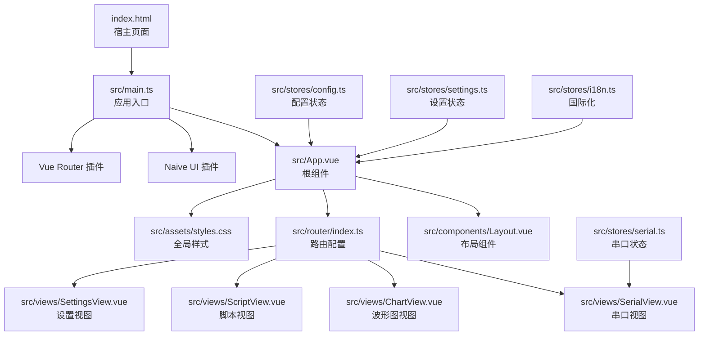
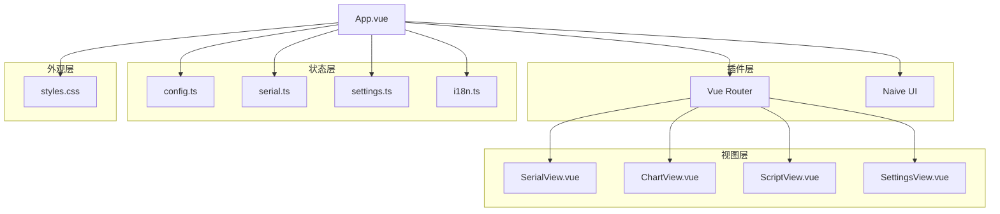
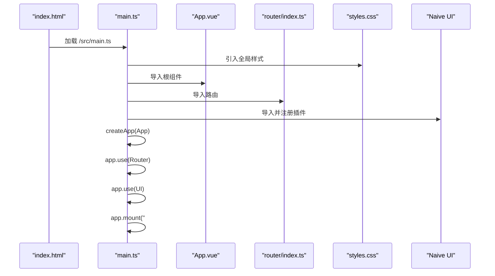
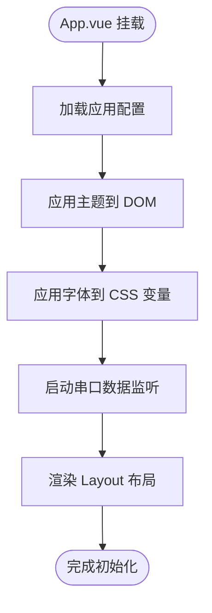
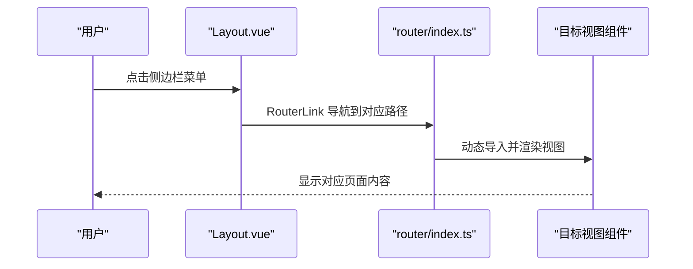
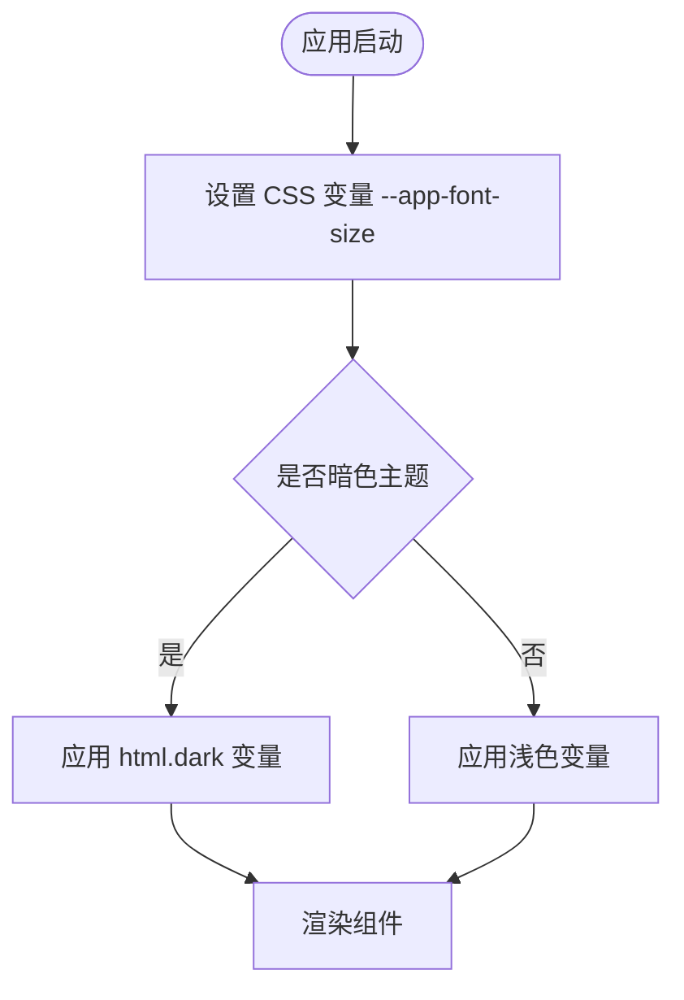
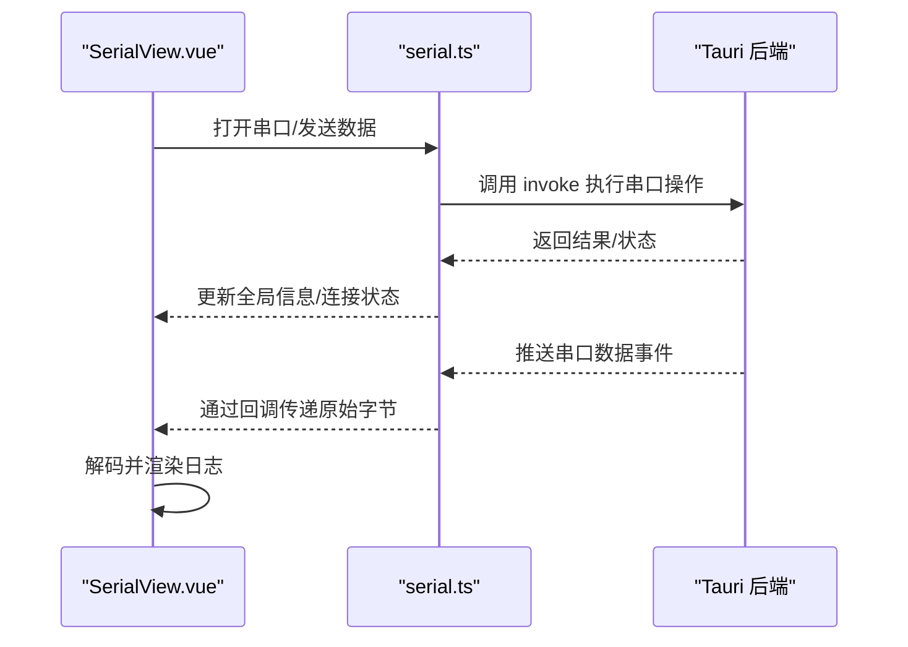
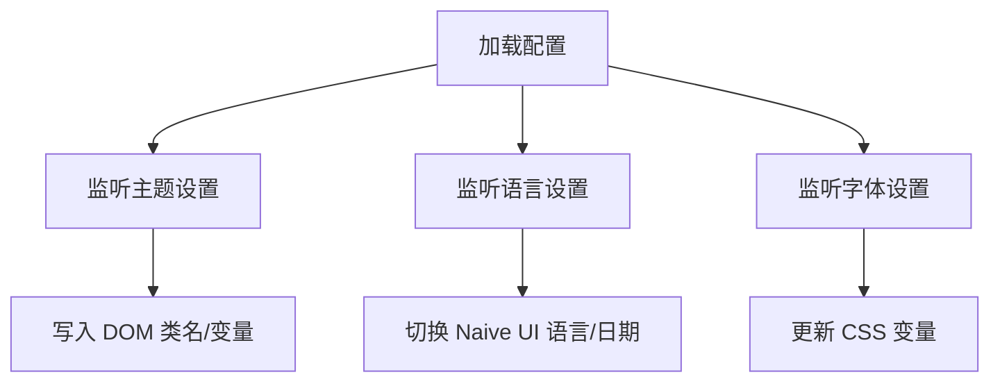
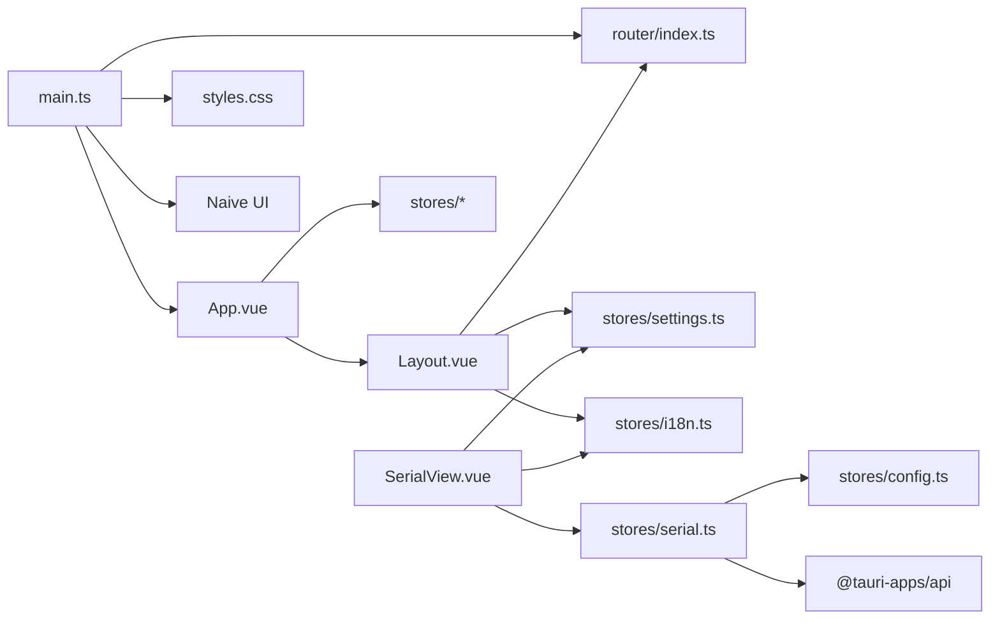

# Vue3 应用结构

<cite>
**本文档引用的文件**
- [main.ts](file://src/main.ts)
- [App.vue](file://src/App.vue)
- [Layout.vue](file://src/components/Layout.vue)
- [router/index.ts](file://src/router/index.ts)
- [styles.css](file://src/assets/styles.css)
- [SerialView.vue](file://src/views/SerialView.vue)
- [config.ts](file://src/stores/config.ts)
- [serial.ts](file://src/stores/serial.ts)
- [settings.ts](file://src/stores/settings.ts)
- [i18n.ts](file://src/stores/i18n.ts)
- [vite.config.ts](file://vite.config.ts)
- [postcss.config.js](file://postcss.config.js)
- [package.json](file://package.json)
- [index.html](file://index.html)
</cite>

## 目录
1. [简介](#简介)
2. [项目结构](#项目结构)
3. [核心组件](#核心组件)
4. [架构总览](#架构总览)
5. [详细组件分析](#详细组件分析)
6. [依赖关系分析](#依赖关系分析)
7. [性能考虑](#性能考虑)
8. [故障排除指南](#故障排除指南)
9. [结论](#结论)
10. [附录](#附录)

## 简介
本文件面向 Vue3 应用的结构与实现进行系统性解析，重点围绕以下方面：
- 应用入口 main.ts 的初始化流程：Vue 应用创建、插件注册、挂载过程
- App.vue 根组件的设计与布局结构
- 路由系统配置与导航机制（含动态路由与路由元信息）
- 全局样式与 CSS 架构设计
- 应用启动流程：依赖注入、插件系统、生命周期管理
- 开发环境配置与生产构建优化建议

该应用采用 Vue 3 + TypeScript + Naive UI + Pinia + Vue Router + Vite + TailwindCSS + Tauri 的组合，具备串口调试、波形图可视化、脚本编辑与设置管理等功能模块。

## 项目结构
项目采用“按功能域分层”的组织方式，核心目录与职责如下：
- src/main.ts：应用入口，创建 Vue 实例、注册插件、挂载根组件
- src/App.vue：根组件，提供主题、消息、国际化等全局上下文
- src/components/Layout.vue：侧边栏导航与主内容区域布局
- src/router/index.ts：路由配置，定义页面路径与懒加载视图
- src/views/*：页面视图组件（串口调试、波形图、脚本编辑、设置）
- src/stores/*：状态管理（Pinia），封装配置、串口、设置、国际化
- src/assets/styles.css：全局样式与 CSS 变量体系
- vite.config.ts：Vite 开发服务器与构建配置
- postcss.config.js：PostCSS 插件链（TailwindCSS + Autoprefixer）
- package.json：依赖与脚本命令
- index.html：HTML 宿主，挂载 #app

**图表来源**
- [index.html:1-15](file://index.html#L1-L15)
- [main.ts:1-14](file://src/main.ts#L1-L14)
- [App.vue:1-33](file://src/App.vue#L1-L33)
- [Layout.vue:1-121](file://src/components/Layout.vue#L1-L121)
- [router/index.ts:1-38](file://src/router/index.ts#L1-L38)
- [styles.css:1-60](file://src/assets/styles.css#L1-L60)
- [SerialView.vue:1-746](file://src/views/SerialView.vue#L1-L746)
- [config.ts:1-89](file://src/stores/config.ts#L1-L89)
- [serial.ts:1-363](file://src/stores/serial.ts#L1-L363)
- [settings.ts:1-125](file://src/stores/settings.ts#L1-L125)
- [i18n.ts:1-348](file://src/stores/i18n.ts#L1-L348)

**章节来源**
- [main.ts:1-14](file://src/main.ts#L1-L14)
- [App.vue:1-33](file://src/App.vue#L1-L33)
- [Layout.vue:1-121](file://src/components/Layout.vue#L1-L121)
- [router/index.ts:1-38](file://src/router/index.ts#L1-L38)
- [styles.css:1-60](file://src/assets/styles.css#L1-L60)
- [index.html:1-15](file://index.html#L1-L15)

## 核心组件
本节聚焦应用启动与核心组件的职责划分与交互。

- 应用入口 main.ts
  - 创建 Vue 应用实例
  - 注册路由与 Naive UI 插件
  - 引入全局样式
  - 挂载到 #app
- 根组件 App.vue
  - 提供 Naive UI 的 NConfigProvider 与 NMessageProvider 上下文
  - 响应式主题与本地化配置
  - 生命周期钩子中加载配置、应用主题与字体、启动串口监听
- 布局组件 Layout.vue
  - 侧边栏导航菜单项与活动态样式
  - 通过 RouterView 展示当前路由视图
- 路由系统 router/index.ts
  - 历史模式路由
  - 动态导入视图组件
  - 路由元信息（标题）
- 全局样式 styles.css
  - CSS 变量驱动的主题与字体体系
  - 暗色主题变量与过渡动画
  - 全局重置与 #app 尺寸约束

**章节来源**
- [main.ts:1-14](file://src/main.ts#L1-L14)
- [App.vue:1-33](file://src/App.vue#L1-L33)
- [Layout.vue:1-121](file://src/components/Layout.vue#L1-L121)
- [router/index.ts:1-38](file://src/router/index.ts#L1-L38)
- [styles.css:1-60](file://src/assets/styles.css#L1-L60)

## 架构总览
应用采用“单页应用 + 插件化”的架构：
- 插件层：Vue Router、Naive UI
- 视图层：基于路由的视图组件
- 状态层：Pinia Store（配置、串口、设置、国际化）
- 外观层：全局样式 + 主题变量 + 国际化

**图表来源**
- [main.ts:1-14](file://src/main.ts#L1-L14)
- [App.vue:1-33](file://src/App.vue#L1-L33)
- [router/index.ts:1-38](file://src/router/index.ts#L1-L38)
- [SerialView.vue:1-746](file://src/views/SerialView.vue#L1-L746)
- [config.ts:1-89](file://src/stores/config.ts#L1-L89)
- [serial.ts:1-363](file://src/stores/serial.ts#L1-L363)
- [settings.ts:1-125](file://src/stores/settings.ts#L1-L125)
- [i18n.ts:1-348](file://src/stores/i18n.ts#L1-L348)
- [styles.css:1-60](file://src/assets/styles.css#L1-L60)

## 详细组件分析

### 应用入口与初始化流程（main.ts）
- 初始化步骤
  - 导入 Vue、App、路由与全局样式
  - 导入并注册 Naive UI 插件
  - 创建应用实例并挂载
- 关键点
  - 插件注册顺序影响全局上下文可用性
  - 全局样式在应用创建后引入，确保主题变量优先级
  - 挂载目标 #app 与 index.html 对应

**图表来源**
- [index.html:10-13](file://index.html#L10-L13)
- [main.ts:1-14](file://src/main.ts#L1-L14)
- [styles.css:1-60](file://src/assets/styles.css#L1-L60)
- [router/index.ts:1-38](file://src/router/index.ts#L1-L38)

**章节来源**
- [main.ts:1-14](file://src/main.ts#L1-L14)
- [index.html:10-13](file://index.html#L10-L13)

### 根组件设计与布局（App.vue）
- 设计要点
  - 在根组件内提供 NConfigProvider 与 NMessageProvider，使全局 UI 组件具备主题、消息能力
  - 响应式主题 computed，依据 isDark 决定是否启用 darkTheme
  - 生命周期 onMounted 中完成配置加载、主题与字体应用、串口数据监听启动
- 布局结构
  - 通过 Layout 组件承载侧边栏与主内容区域
  - 顶层容器使用 Naive UI 的 NConfigProvider/NMessageProvider 包裹

**图表来源**
- [App.vue:14-19](file://src/App.vue#L14-L19)
- [settings.ts:102-117](file://src/stores/settings.ts#L102-L117)

**章节来源**
- [App.vue:1-33](file://src/App.vue#L1-L33)
- [settings.ts:1-125](file://src/stores/settings.ts#L1-L125)

### 路由系统与导航机制（router/index.ts）
- 路由配置
  - 历史模式 createWebHistory
  - 路由表包含重定向与四个视图，均采用动态导入实现懒加载
  - 路由元信息 meta 提供页面标题
- 导航机制
  - Layout.vue 使用 RouterLink 与 RouterView 实现导航与视图切换
  - 菜单项与路由路径一一对应，活动态样式基于当前路由

**图表来源**
- [router/index.ts:1-38](file://src/router/index.ts#L1-L38)
- [Layout.vue:26-36](file://src/components/Layout.vue#L26-L36)

**章节来源**
- [router/index.ts:1-38](file://src/router/index.ts#L1-L38)
- [Layout.vue:1-121](file://src/components/Layout.vue#L1-L121)

### 全局样式与 CSS 架构（styles.css）
- CSS 变量体系
  - 以 --app-font-size 为核心，派生字体尺寸与颜色变量
  - 暗色主题通过 html.dark 伪类切换变量值
- 全局重置与容器
  - 重置 margin/padding，box-sizing
  - #app 占满视口并隐藏溢出
- 与主题联动
  - App.vue 在挂载时将 isDark 写入 documentElement.classList，触发样式切换

**图表来源**
- [styles.css:4-37](file://src/assets/styles.css#L4-L37)
- [settings.ts:102-117](file://src/stores/settings.ts#L102-L117)

**章节来源**
- [styles.css:1-60](file://src/assets/styles.css#L1-L60)
- [settings.ts:102-117](file://src/stores/settings.ts#L102-L117)

### 串口视图与状态管理（SerialView.vue + serial.ts）
- 视图职责
  - 提供串口配置、连接/断开、发送/接收、统计展示、日志记录与滚动控制
  - 使用 Naive UI 组件与图标库
- 状态管理
  - serial.ts 提供串口连接、数据收发、全局信息、事件监听、轮询更新等能力
  - App.vue 在挂载时调用 startSerialDataListener，建立后端推送数据的回调链
- 性能与体验
  - 接收数据缓冲区上限控制，避免内存膨胀
  - 自动滚动与编码切换提升交互体验

**图表来源**
- [SerialView.vue:1-746](file://src/views/SerialView.vue#L1-L746)
- [serial.ts:145-240](file://src/stores/serial.ts#L145-L240)
- [App.vue:18-18](file://src/App.vue#L18-L18)

**章节来源**
- [SerialView.vue:1-746](file://src/views/SerialView.vue#L1-L746)
- [serial.ts:1-363](file://src/stores/serial.ts#L1-L363)
- [App.vue:14-19](file://src/App.vue#L14-L19)

### 配置与设置（config.ts + settings.ts）
- 配置管理
  - config.ts 定义应用配置结构，提供加载/保存逻辑，通过 Tauri invoke 与后端交互
- 设置管理
  - settings.ts 基于 appConfig 派生响应式设置，支持主题、语言、字体大小、缓冲区等
  - 提供 applyThemeToDOM 与 applyFontSizeToDOM 将设置即时应用到 DOM/CSS 变量
- 国际化
  - i18n.ts 提供 t 函数与 useI18n 响应式翻译，支持 zh-CN/en-US

**图表来源**
- [config.ts:42-64](file://src/stores/config.ts#L42-L64)
- [settings.ts:19-117](file://src/stores/settings.ts#L19-L117)
- [i18n.ts:318-347](file://src/stores/i18n.ts#L318-L347)

**章节来源**
- [config.ts:1-89](file://src/stores/config.ts#L1-L89)
- [settings.ts:1-125](file://src/stores/settings.ts#L1-L125)
- [i18n.ts:1-348](file://src/stores/i18n.ts#L1-L348)

## 依赖关系分析
- 入口依赖
  - main.ts 依赖 App.vue、router/index.ts、assets/styles.css、Naive UI
- 组件依赖
  - App.vue 依赖 Layout.vue、Naive UI Provider、stores（config、serial、settings、i18n）
  - Layout.vue 依赖 vue-router（RouterLink/RouterView）、stores（settings、i18n）
  - SerialView.vue 依赖 Naive UI、stores（serial、settings、i18n）
- 状态依赖
  - serial.ts 依赖 config.ts（读取 appConfig），依赖 Tauri API
  - settings.ts 依赖 appConfig，依赖 Naive UI 语言包
  - i18n.ts 依赖 settings.ts（language）

**图表来源**
- [main.ts:1-14](file://src/main.ts#L1-L14)
- [App.vue:1-33](file://src/App.vue#L1-L33)
- [Layout.vue:1-121](file://src/components/Layout.vue#L1-L121)
- [router/index.ts:1-38](file://src/router/index.ts#L1-L38)
- [SerialView.vue:1-746](file://src/views/SerialView.vue#L1-L746)
- [config.ts:1-89](file://src/stores/config.ts#L1-L89)
- [serial.ts:1-363](file://src/stores/serial.ts#L1-L363)
- [settings.ts:1-125](file://src/stores/settings.ts#L1-L125)
- [i18n.ts:1-348](file://src/stores/i18n.ts#L1-L348)

**章节来源**
- [main.ts:1-14](file://src/main.ts#L1-L14)
- [App.vue:1-33](file://src/App.vue#L1-L33)
- [Layout.vue:1-121](file://src/components/Layout.vue#L1-L121)
- [router/index.ts:1-38](file://src/router/index.ts#L1-L38)
- [SerialView.vue:1-746](file://src/views/SerialView.vue#L1-L746)
- [config.ts:1-89](file://src/stores/config.ts#L1-L89)
- [serial.ts:1-363](file://src/stores/serial.ts#L1-L363)
- [settings.ts:1-125](file://src/stores/settings.ts#L1-L125)
- [i18n.ts:1-348](file://src/stores/i18n.ts#L1-L348)

## 性能考虑
- 路由懒加载
  - 路由视图组件采用动态导入，减少首屏体积与加载时间
- 状态管理
  - 使用 Pinia 响应式状态，避免不必要的重渲染
  - 串口接收缓冲区上限控制，防止内存占用过高
- 样式与主题
  - CSS 变量驱动主题切换，避免重复样式计算
  - 暗色主题仅通过类名切换，开销极低
- 构建与开发
  - Vite 提供快速热更新与按需编译
  - PostCSS + TailwindCSS 仅在开发阶段参与，生产构建可通过 Vite 优化

[本节为通用性能建议，不直接分析具体文件]

## 故障排除指南
- 串口无法连接或无数据
  - 检查串口权限与设备占用
  - 确认 serial.ts 中的 invoke 调用与后端命令一致
  - 查看 App.vue 挂载时是否正确启动 startSerialDataListener
- 主题或字体未生效
  - 确认 settings.ts 的 applyThemeToDOM 与 applyFontSizeToDOM 是否被调用
  - 检查 styles.css 中 CSS 变量是否被正确写入
- 路由跳转无效
  - 确认 router/index.ts 中路径与 Layout.vue 的菜单项一致
  - 检查 RouterLink 的 to 属性与路由命名是否匹配
- 国际化文本未切换
  - 确认 language 设置是否变更
  - 检查 i18n.ts 的 t 函数与 useI18n 响应式包装

**章节来源**
- [serial.ts:312-332](file://src/stores/serial.ts#L312-L332)
- [settings.ts:102-117](file://src/stores/settings.ts#L102-L117)
- [styles.css:1-60](file://src/assets/styles.css#L1-L60)
- [Layout.vue:26-36](file://src/components/Layout.vue#L26-L36)
- [i18n.ts:318-347](file://src/stores/i18n.ts#L318-L347)

## 结论
该 Vue3 应用通过清晰的入口初始化、模块化的组件与状态管理、以及完善的插件与样式体系，实现了串口调试工具的核心功能。其架构具备良好的扩展性与可维护性，适合进一步引入更多视图与业务模块。

[本节为总结性内容，不直接分析具体文件]

## 附录

### 开发环境配置与生产构建优化建议
- 开发环境
  - Vite 固定端口与严格端口策略，确保 Tauri HMR 正常工作
  - 忽略 src-tauri 目录监控，避免不必要的文件系统扫描
  - 通过 TAURI_DEV_HOST 支持远程主机热更新
- 生产构建
  - 使用 Vite 的内置压缩与 Tree Shaking
  - TailwindCSS 在生产构建中按需生成样式，建议配合 Purge 配置
  - Pinia 与 Vue Router 的按需导入与代码分割
- 依赖管理
  - package.json 中的脚本命令与依赖版本需保持一致
  - PostCSS 插件链（TailwindCSS + Autoprefixer）在开发阶段生效

**章节来源**
- [vite.config.ts:18-39](file://vite.config.ts#L18-L39)
- [postcss.config.js:1-6](file://postcss.config.js#L1-L6)
- [package.json:1-40](file://package.json#L1-L40)