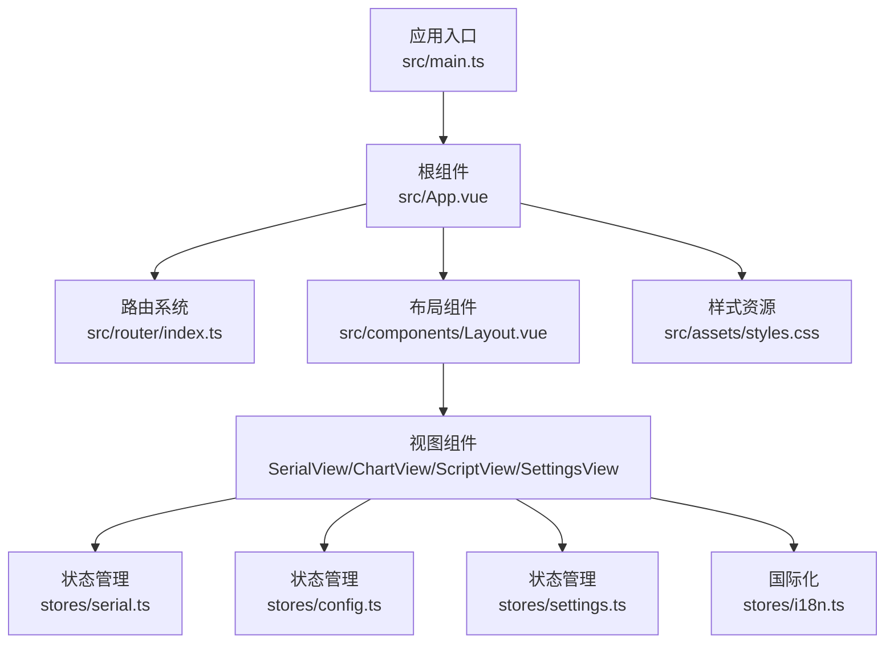
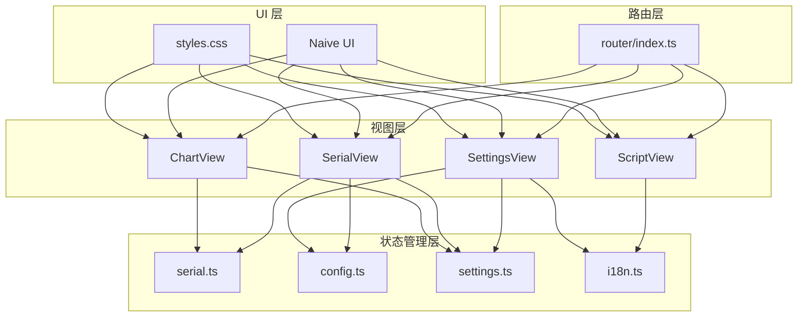
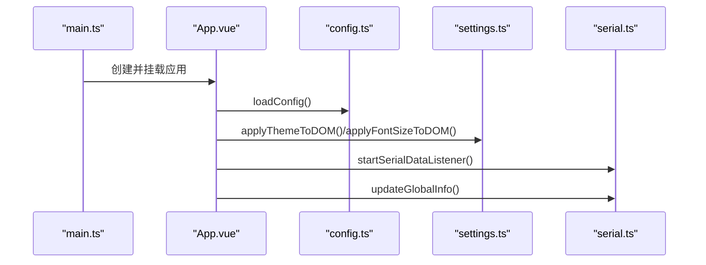
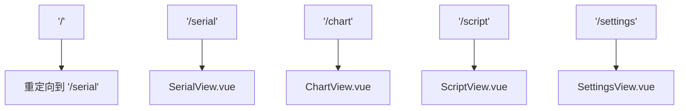
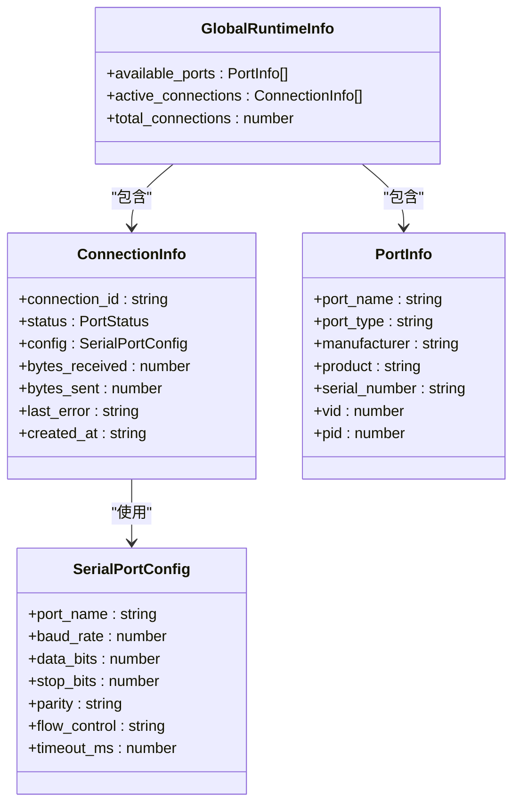
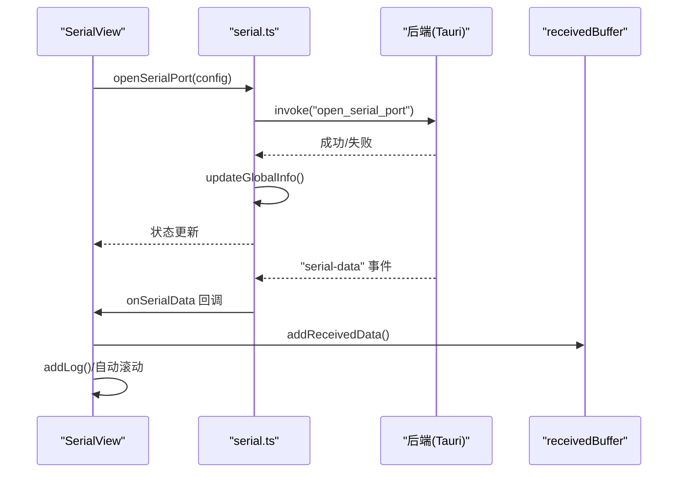
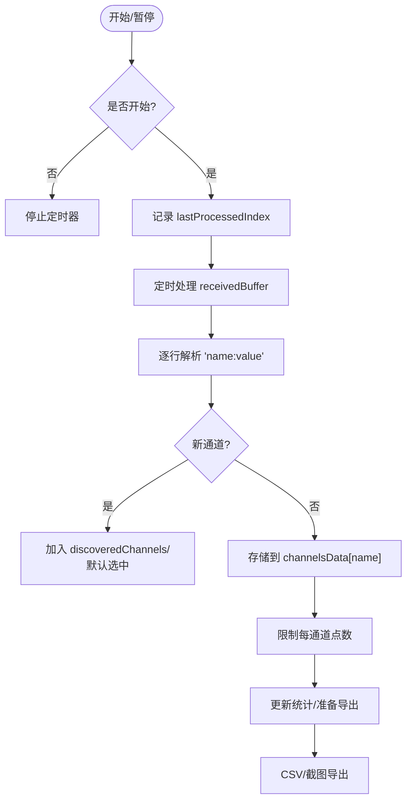
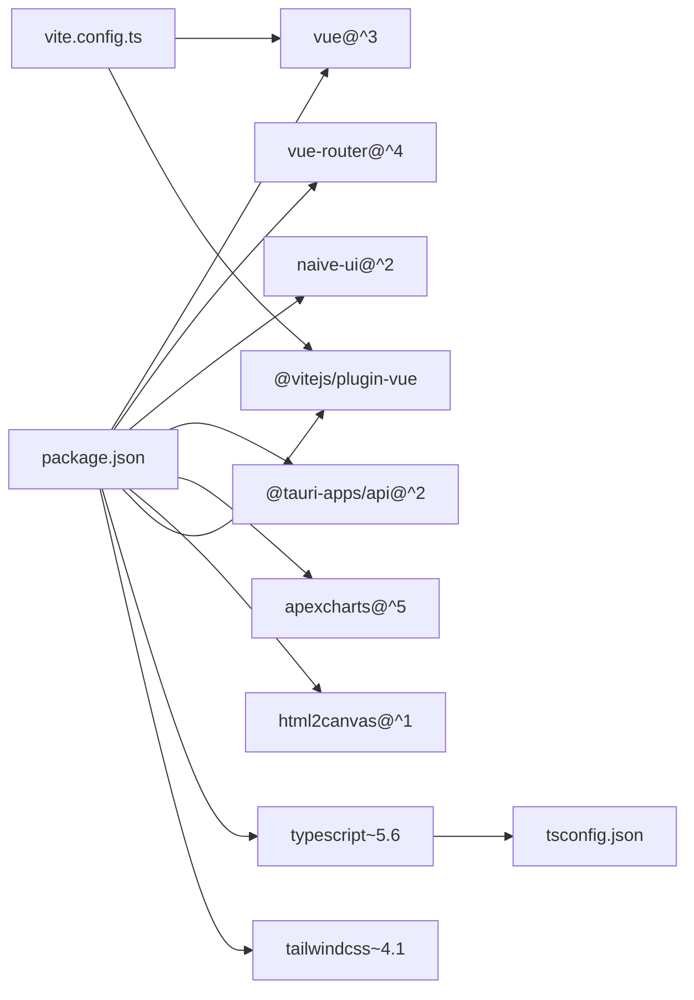

# 前端开发

<cite>
**本文引用的文件**
- [src/main.ts](file://src/main.ts)
- [src/App.vue](file://src/App.vue)
- [src/router/index.ts](file://src/router/index.ts)
- [src/components/Layout.vue](file://src/components/Layout.vue)
- [src/assets/styles.css](file://src/assets/styles.css)
- [src/stores/serial.ts](file://src/stores/serial.ts)
- [src/stores/config.ts](file://src/stores/config.ts)
- [src/stores/settings.ts](file://src/stores/settings.ts)
- [src/stores/i18n.ts](file://src/stores/i18n.ts)
- [src/views/SerialView.vue](file://src/views/SerialView.vue)
- [src/views/ChartView.vue](file://src/views/ChartView.vue)
- [src/views/ScriptView.vue](file://src/views/ScriptView.vue)
- [src/views/SettingsView.vue](file://src/views/SettingsView.vue)
- [package.json](file://package.json)
- [tsconfig.json](file://tsconfig.json)
- [vite.config.ts](file://vite.config.ts)
</cite>

## 目录
1. [简介](#简介)
2. [项目结构](#项目结构)
3. [核心组件](#核心组件)
4. [架构总览](#架构总览)
5. [详细组件分析](#详细组件分析)
6. [依赖关系分析](#依赖关系分析)
7. [性能考量](#性能考量)
8. [故障排查指南](#故障排查指南)
9. [结论](#结论)
10. [附录](#附录)

## 简介
本文件面向 KonSerial 前端开发者，系统性梳理基于 Vue 3 + TypeScript 的应用架构与实现细节。内容涵盖应用入口初始化、组件层次结构、路由系统、Pinia 状态管理（串口状态、配置与设置）、视图组件（SerialView、ChartView、ScriptView、SettingsView）的功能与交互、组件通信机制、组合式函数与响应式数据绑定、UI 组件库与自定义样式、响应式布局，以及开发最佳实践与调试技巧。

## 项目结构
KonSerial 前端采用模块化组织，核心目录与职责如下：
- src/main.ts：应用入口，挂载根组件、注册路由与 UI 库
- src/App.vue：根组件，统一注入主题、消息与布局容器
- src/router/index.ts：Vue Router 路由配置，定义页面导航与元信息
- src/components/Layout.vue：侧边栏导航与主内容区容器
- src/assets/styles.css：CSS 变量与全局样式，支持明暗主题
- src/stores/*：Pinia 状态管理（串口、配置、设置、国际化）
- src/views/*：页面视图组件（Serial、Chart、Script、Settings）
- package.json、tsconfig.json、vite.config.ts：依赖、TypeScript 与构建配置

**图示来源**
- [src/main.ts:1-14](file://src/main.ts#L1-L14)
- [src/App.vue:1-33](file://src/App.vue#L1-L33)
- [src/router/index.ts:1-38](file://src/router/index.ts#L1-L38)
- [src/components/Layout.vue:1-121](file://src/components/Layout.vue#L1-L121)
- [src/assets/styles.css:1-60](file://src/assets/styles.css#L1-L60)
- [src/stores/serial.ts:1-363](file://src/stores/serial.ts#L1-L363)
- [src/stores/config.ts:1-89](file://src/stores/config.ts#L1-L89)
- [src/stores/settings.ts:1-125](file://src/stores/settings.ts#L1-L125)
- [src/stores/i18n.ts:1-348](file://src/stores/i18n.ts#L1-L348)

**章节来源**
- [src/main.ts:1-14](file://src/main.ts#L1-L14)
- [src/App.vue:1-33](file://src/App.vue#L1-L33)
- [src/router/index.ts:1-38](file://src/router/index.ts#L1-L38)
- [src/components/Layout.vue:1-121](file://src/components/Layout.vue#L1-L121)
- [src/assets/styles.css:1-60](file://src/assets/styles.css#L1-L60)

## 核心组件
- 应用入口与挂载
  - 创建 Vue 应用实例，注册路由与 Naive UI 插件，挂载到 DOM
  - 引入全局样式，确保主题与字体变量生效
- 根组件与主题注入
  - 在根组件中注入 NConfigProvider 与 NMessageProvider，统一主题、语言与消息提示
  - 初始化配置加载、主题与字体应用、串口数据监听
- 布局组件
  - 提供侧边导航菜单，结合路由高亮当前页面
  - 作为 RouterView 容器承载视图组件
- 视图组件
  - SerialView：串口连接、发送/接收、统计与日志展示
  - ChartView：从全局接收缓存解析数据，构建通道与波形图占位
  - ScriptView：脚本编辑、运行控制与日志输出
  - SettingsView：主题、语言、字体、数据相关设置的持久化

**章节来源**
- [src/main.ts:1-14](file://src/main.ts#L1-L14)
- [src/App.vue:1-33](file://src/App.vue#L1-L33)
- [src/components/Layout.vue:1-121](file://src/components/Layout.vue#L1-L121)
- [src/views/SerialView.vue:1-746](file://src/views/SerialView.vue#L1-L746)
- [src/views/ChartView.vue:1-800](file://src/views/ChartView.vue#L1-L800)
- [src/views/ScriptView.vue:1-442](file://src/views/ScriptView.vue#L1-L442)
- [src/views/SettingsView.vue:1-383](file://src/views/SettingsView.vue#L1-L383)

## 架构总览
KonSerial 前端采用“视图层 + 状态管理层”的分层架构：
- 视图层：通过组合式 API 与响应式数据驱动 UI，调用状态管理进行业务操作
- 状态管理层：Pinia Store 负责串口连接、配置与设置的集中管理，并与后端通过 Tauri 桥接通信
- 路由层：Vue Router 提供页面级导航与懒加载视图
- UI 层：Naive UI 提供丰富的组件库，配合自定义 CSS 变量实现主题与字体响应式

**图示来源**
- [src/router/index.ts:1-38](file://src/router/index.ts#L1-L38)
- [src/stores/serial.ts:1-363](file://src/stores/serial.ts#L1-L363)
- [src/stores/config.ts:1-89](file://src/stores/config.ts#L1-L89)
- [src/stores/settings.ts:1-125](file://src/stores/settings.ts#L1-L125)
- [src/stores/i18n.ts:1-348](file://src/stores/i18n.ts#L1-L348)
- [src/views/SerialView.vue:1-746](file://src/views/SerialView.vue#L1-L746)
- [src/views/ChartView.vue:1-800](file://src/views/ChartView.vue#L1-L800)
- [src/views/ScriptView.vue:1-442](file://src/views/ScriptView.vue#L1-L442)
- [src/views/SettingsView.vue:1-383](file://src/views/SettingsView.vue#L1-L383)
- [src/assets/styles.css:1-60](file://src/assets/styles.css#L1-L60)

## 详细组件分析

### 应用入口与初始化流程
- 初始化步骤
  - 创建应用实例并挂载根组件
  - 注册路由与 UI 库插件
  - 引入全局样式
  - 在根组件生命周期内加载配置、应用主题与字体、启动串口数据监听
- 关键点
  - 通过 NConfigProvider 注入主题、语言与日期本地化
  - 通过 NMessageProvider 提供全局消息提示
  - startSerialDataListener 与 updateGlobalInfo 保证串口状态与数据的实时性

**图示来源**
- [src/main.ts:1-14](file://src/main.ts#L1-L14)
- [src/App.vue:14-19](file://src/App.vue#L14-L19)
- [src/stores/config.ts:42-49](file://src/stores/config.ts#L42-L49)
- [src/stores/settings.ts:102-117](file://src/stores/settings.ts#L102-L117)
- [src/stores/serial.ts:234-240](file://src/stores/serial.ts#L234-L240)
- [src/stores/serial.ts:312-332](file://src/stores/serial.ts#L312-L332)

**章节来源**
- [src/main.ts:1-14](file://src/main.ts#L1-L14)
- [src/App.vue:14-19](file://src/App.vue#L14-L19)

### 路由系统与导航
- 路由配置
  - 历史模式，包含串口调试、波形图、脚本编辑、设置四个页面
  - 每个路由提供页面标题元信息，便于国际化与 SEO
- 导航实现
  - Layout 组件通过 RouterLink 与 useRoute 动态渲染菜单项
  - 菜单项与当前路由路径匹配，实现高亮

**图示来源**
- [src/router/index.ts:1-38](file://src/router/index.ts#L1-L38)
- [src/components/Layout.vue:9-14](file://src/components/Layout.vue#L9-L14)

**章节来源**
- [src/router/index.ts:1-38](file://src/router/index.ts#L1-L38)
- [src/components/Layout.vue:9-14](file://src/components/Layout.vue#L9-L14)

### Pinia 状态管理设计

#### 串口状态管理（serial.ts）
- 设计要点
  - 全局运行时信息：可用串口列表、活跃连接集合、总连接数
  - 连接模型：连接 ID、状态、配置、统计与错误信息
  - 数据缓存：全局接收缓冲区，限制容量，供图表等页面复用
  - 事件监听：后端推送的串口数据事件，统一转发给订阅者
  - 轮询更新：定时刷新全局状态，保持 UI 与后端一致
- 关键函数
  - 连接管理：刷新端口、打开/关闭连接、查询连接信息
  - 数据传输：发送文本或十六进制数据，更新统计
  - 回调机制：onSerialData 注册/注销数据回调
  - 轮询控制：startStatusPolling/stopStatusPolling
- 复杂度与性能
  - 缓冲区维护 O(1) 入队与最多 O(n) 出队（按容量限制）
  - 轮询频率可调，默认 1 秒，避免频繁请求

**图示来源**
- [src/stores/serial.ts:9-61](file://src/stores/serial.ts#L9-L61)
- [src/stores/serial.ts:64-89](file://src/stores/serial.ts#L64-L89)

**章节来源**
- [src/stores/serial.ts:1-363](file://src/stores/serial.ts#L1-L363)

#### 配置状态管理（config.ts）
- 设计要点
  - AppConfig 结构：串口、UI、数据三部分配置
  - 响应式配置：appConfig.value 作为全局状态
  - 持久化：loadConfig/saveConfig 通过 Tauri 调用后端读写
  - 更新便捷方法：波特率、串口、主题等字段的异步更新与保存
- 复杂度与性能
  - 读写均为 O(1)，保存时触发一次后端调用

**章节来源**
- [src/stores/config.ts:1-89](file://src/stores/config.ts#L1-L89)

#### 设置状态管理（settings.ts）
- 设计要点
  - 主题：light/dark/auto 三种模式，响应系统偏好
  - 字体：通过 CSS 变量与 Naive UI 主题覆盖实现全局字体缩放
  - 数据设置：自动保存开关、保存间隔、缓冲区大小
  - 语言：中英双语，Naive UI 语言与日期本地化
  - DOM 应用：watch 监听主题与字体变化，即时应用到 DOM
- 复杂度与性能
  - 计算属性与 watch 均为 O(1)，DOM 写入按需触发

**章节来源**
- [src/stores/settings.ts:1-125](file://src/stores/settings.ts#L1-L125)

#### 国际化（i18n.ts）
- 设计要点
  - 基于 language 的响应式翻译函数 t 与 useI18n
  - 支持占位符替换，提供中英双语文本
- 复杂度与性能
  - 查找与替换均为 O(n)（n 为参数个数），按需计算

**章节来源**
- [src/stores/i18n.ts:1-348](file://src/stores/i18n.ts#L1-L348)

### 视图组件详解

#### SerialView（串口调试）
- 功能概览
  - 串口选择与刷新、连接/断开、参数配置（波特率、数据位、停止位、校验、流控）
  - 发送文本或十六进制数据，支持追加换行
  - 接收数据显示（文本/HEX），自动滚动与日志清空
  - 连接统计（发送/接收字节数）
- 交互逻辑
  - onMounted 注册串口数据回调，启动状态轮询；onUnmounted 清理回调与轮询
  - 通过 store 的 openSerialPort/closeSerialPort/sendData 等方法与后端交互
  - 本地日志与全局接收缓冲区同步，供 ChartView 使用
- 响应式与组合式
  - computed 表达连接状态与统计数据
  - ref 管理 UI 状态（加载、HEX 模式、编码、自动滚动等）

**图示来源**
- [src/views/SerialView.vue:156-189](file://src/views/SerialView.vue#L156-L189)
- [src/views/SerialView.vue:191-205](file://src/views/SerialView.vue#L191-L205)
- [src/views/SerialView.vue:234-253](file://src/views/SerialView.vue#L234-L253)
- [src/stores/serial.ts:157-221](file://src/stores/serial.ts#L157-L221)
- [src/stores/serial.ts:297-341](file://src/stores/serial.ts#L297-L341)
- [src/stores/serial.ts:105-117](file://src/stores/serial.ts#L105-L117)

**章节来源**
- [src/views/SerialView.vue:1-746](file://src/views/SerialView.vue#L1-L746)
- [src/stores/serial.ts:1-363](file://src/stores/serial.ts#L1-L363)

#### ChartView（波形图）
- 功能概览
  - 从全局接收缓冲区解析“通道名:数值”格式数据，构建多通道时间序列
  - 实时采集开关、时间窗口、自动/手动 Y 轴缩放、网格与线宽设置
  - 通道选择、统计信息（当前值、平均值）、CSV 导出与截图导出
- 处理流程
  - onMounted 启动定时处理，逐行解析新增数据，限制每通道点数
  - 通过 discoveredChannels 与 selectedChannels 管理通道
  - 导出时按时间对齐生成 CSV，截图使用 html2canvas

**图示来源**
- [src/views/ChartView.vue:116-132](file://src/views/ChartView.vue#L116-L132)
- [src/views/ChartView.vue:100-114](file://src/views/ChartView.vue#L100-L114)
- [src/views/ChartView.vue:71-98](file://src/views/ChartView.vue#L71-L98)
- [src/stores/serial.ts:96-117](file://src/stores/serial.ts#L96-L117)

**章节来源**
- [src/views/ChartView.vue:1-800](file://src/views/ChartView.vue#L1-L800)
- [src/stores/serial.ts:96-117](file://src/stores/serial.ts#L96-L117)

#### ScriptView（脚本编辑）
- 功能概览
  - 脚本编辑器（含行号）、运行/停止、保存/新建/打开
  - 运行日志输出与清空
  - 文件列表（占位）
- 交互逻辑
  - runScript/stopScript 控制运行状态，addLog 输出日志
  - 通过 useMessage 提供用户反馈

**章节来源**
- [src/views/ScriptView.vue:1-442](file://src/views/ScriptView.vue#L1-L442)

#### SettingsView（设置）
- 功能概览
  - 主题（浅色/深色/跟随系统）、语言、字体大小
  - 数据设置（自动保存、保存间隔、缓冲区大小）
  - 关于信息与保存/重置操作
- 交互逻辑
  - 通过 settings.ts 的响应式设置直接绑定 UI
  - 保存时调用 persistSettings（内部保存配置）

**章节来源**
- [src/views/SettingsView.vue:1-383](file://src/views/SettingsView.vue#L1-L383)
- [src/stores/settings.ts:101-125](file://src/stores/settings.ts#L101-L125)

### 组件通信机制与组合式函数
- 组件间通信
  - 视图组件通过 store 直接访问全局状态与后端能力
  - ChartView 通过全局 receivedBuffer 与 SerialView 共享数据
- 组合式函数
  - computed/computed 用于派生状态与响应式 UI
  - ref/reactive 用于本地 UI 状态管理
  - watch 用于副作用（主题/DOM 应用、字体变量）
  - 生命周期钩子 onMounted/onUnmounted 管理事件与定时器

**章节来源**
- [src/views/SerialView.vue:60-72](file://src/views/SerialView.vue#L60-L72)
- [src/views/ChartView.vue:23-54](file://src/views/ChartView.vue#L23-L54)
- [src/stores/settings.ts:101-117](file://src/stores/settings.ts#L101-L117)

### UI 组件库与自定义样式
- UI 组件库
  - Naive UI 提供表单、按钮、对话框、滚动条、主题覆盖等
- 自定义样式
  - CSS 变量定义字体梯度与主题色板，支持明暗主题
  - 通过 NConfigProvider 的 theme-overrides 实现字体大小全局覆盖
  - 布局采用 Flex 布局，响应式分割左右区域

**章节来源**
- [src/assets/styles.css:1-60](file://src/assets/styles.css#L1-L60)
- [src/stores/settings.ts:44-56](file://src/stores/settings.ts#L44-L56)
- [src/App.vue:22-32](file://src/App.vue#L22-L32)

## 依赖关系分析
- 依赖生态
  - Vue 3 + TypeScript + Vite + TailwindCSS
  - Naive UI + Ionicons 图标
  - Tauri 生态（@tauri-apps/api 与各类插件）
  - ApexCharts 与 html2canvas（图表与截图占位）
- 构建与开发
  - Vite 固定端口与 HMR 配置，忽略 src-tauri 目录
  - TypeScript 路径别名 @/* 指向 src

**图示来源**
- [package.json:12-38](file://package.json#L12-L38)
- [vite.config.ts:1-40](file://vite.config.ts#L1-L40)
- [tsconfig.json:17-21](file://tsconfig.json#L17-L21)

**章节来源**
- [package.json:12-38](file://package.json#L12-L38)
- [vite.config.ts:1-40](file://vite.config.ts#L1-L40)
- [tsconfig.json:17-21](file://tsconfig.json#L17-L21)

## 性能考量
- 状态更新策略
  - 串口状态轮询默认 1 秒，可根据场景调整
  - 全局接收缓冲区容量限制，避免内存膨胀
- 渲染优化
  - 大列表使用虚拟滚动与分页（如 NScrollbar）
  - 图表区域为占位，建议后续接入专业图表库减少重绘
- I/O 与网络
  - 发送数据前进行输入校验，避免无效调用
  - 事件监听与定时器在组件卸载时及时清理

[本节为通用指导，无需特定文件引用]

## 故障排查指南
- 串口连接问题
  - 检查刷新端口与连接状态，确认端口权限与占用
  - 查看错误日志与消息提示，定位 isSerialConnected 调用结果
- 数据显示异常
  - 确认编码设置与 HEX/文本模式切换
  - 检查 receivedBuffer 是否正确增长与截断
- 设置不生效
  - 确认 persistSettings 已调用且 saveConfig 成功
  - 检查 DOM 主题类名与 CSS 变量是否更新
- 国际化显示
  - 确认 language 设置与 t 函数参数占位符

**章节来源**
- [src/views/SerialView.vue:140-154](file://src/views/SerialView.vue#L140-L154)
- [src/views/SerialView.vue:189-205](file://src/views/SerialView.vue#L189-L205)
- [src/stores/serial.ts:105-117](file://src/stores/serial.ts#L105-L117)
- [src/stores/settings.ts:121-125](file://src/stores/settings.ts#L121-L125)
- [src/stores/i18n.ts:318-328](file://src/stores/i18n.ts#L318-L328)

## 结论
KonSerial 前端以清晰的分层架构与 Pinia 状态管理为核心，结合 Vue 3 组合式 API 与 Naive UI，实现了串口调试、数据可视化、脚本编辑与设置管理的完整体验。通过响应式主题与字体系统、合理的数据缓冲与轮询策略，兼顾了易用性与性能。后续可在图表渲染与脚本引擎方面进一步增强。

[本节为总结，无需特定文件引用]

## 附录
- 开发命令
  - dev：Vite 开发服务器（固定端口与 HMR）
  - build：类型检查与打包
  - preview：预览打包产物
  - tauri：Tauri 命令入口
- 路径别名
  - @/* 指向 src，便于模块导入

**章节来源**
- [package.json:6-11](file://package.json#L6-L11)
- [tsconfig.json:17-21](file://tsconfig.json#L17-L21)
- [vite.config.ts:12-16](file://vite.config.ts#L12-L16)