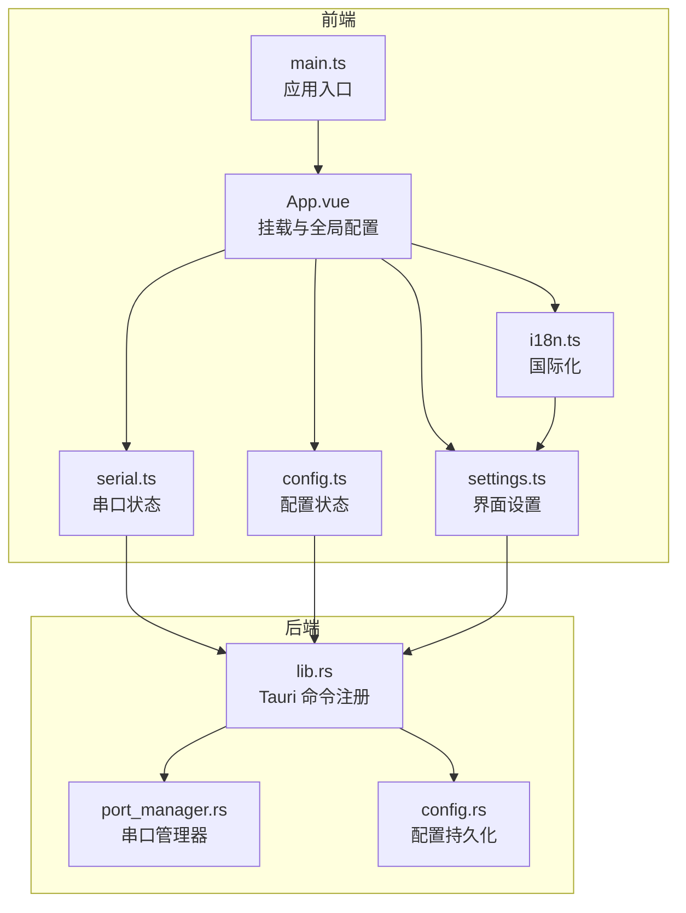
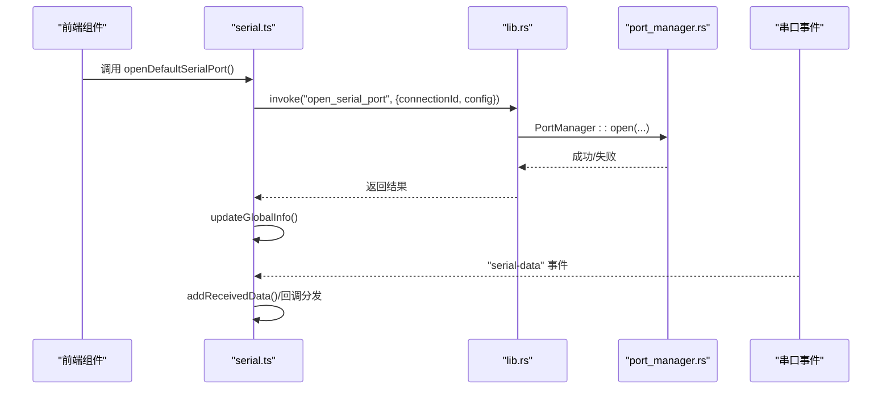
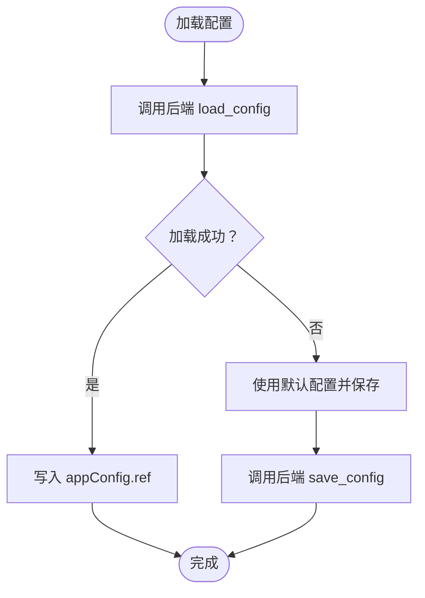
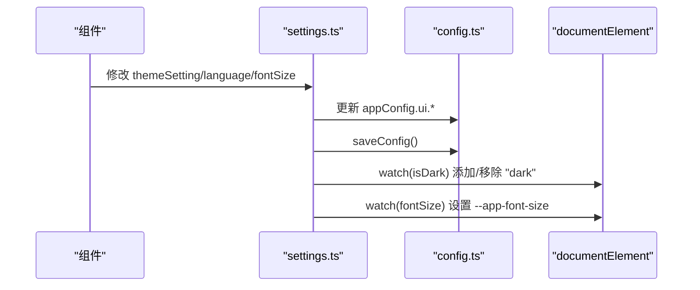
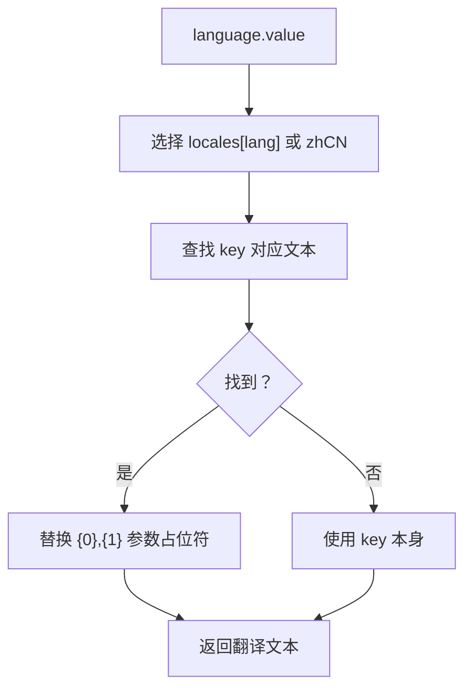
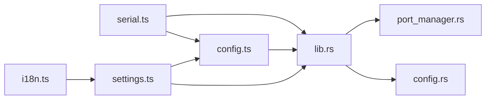

# 状态管理

<cite>
**本文引用的文件**
- [serial.ts](file://src/stores/serial.ts)
- [config.ts](file://src/stores/config.ts)
- [settings.ts](file://src/stores/settings.ts)
- [i18n.ts](file://src/stores/i18n.ts)
- [lib.rs](file://src-tauri/src/lib.rs)
- [port_manager.rs](file://src-tauri/src/serial/port_manager.rs)
- [config.rs](file://src-tauri/src/utils/config.rs)
- [main.ts](file://src/main.ts)
- [App.vue](file://src/App.vue)
- [Cargo.toml](file://src-tauri/Cargo.toml)
</cite>

## 目录
1. [简介](#简介)
2. [项目结构](#项目结构)
3. [核心组件](#核心组件)
4. [架构总览](#架构总览)
5. [组件详解](#组件详解)
6. [依赖关系分析](#依赖关系分析)
7. [性能考量](#性能考量)
8. [故障排查指南](#故障排查指南)
9. [结论](#结论)
10. [附录](#附录)

## 简介
本文件系统性梳理 KonSerial 中基于 Pinia 的状态管理体系，重点覆盖以下方面：
- 设计理念与架构模式：以模块化 Store 组织状态，前后端职责清晰分离，前端负责 UI 响应式与交互，后端负责串口设备与数据持久化。
- Store 组织结构：serial.ts（串口）、config.ts（配置）、settings.ts（界面设置）、i18n.ts（国际化），分别承担连接状态、配置持久化、界面行为与多语言。
- 串口状态管理（serial.ts）：连接状态、数据流控制、错误处理、事件监听与轮询更新。
- 配置状态管理（config.ts）：用户偏好与系统配置的加载与持久化。
- 设置状态管理（settings.ts）：界面主题、字体大小、语言与 Naive UI 集成。
- 国际化状态管理（i18n.ts）：多语言切换与本地化支持。
- 最佳实践、性能优化与调试技巧。

## 项目结构
KonSerial 采用前端 Vue + Pinia + Tauri 的架构，状态管理集中在 src/stores 下的四个模块，配合后端 Rust 实现串口与配置持久化。



**图表来源**
- [App.vue:1-33](file://src/App.vue#L1-L33)
- [main.ts:1-14](file://src/main.ts#L1-L14)
- [serial.ts:1-363](file://src/stores/serial.ts#L1-L363)
- [config.ts:1-89](file://src/stores/config.ts#L1-L89)
- [settings.ts:1-125](file://src/stores/settings.ts#L1-L125)
- [i18n.ts:1-348](file://src/stores/i18n.ts#L1-L348)
- [lib.rs:1-84](file://src-tauri/src/lib.rs#L1-L84)
- [port_manager.rs:1-402](file://src-tauri/src/serial/port_manager.rs#L1-L402)
- [config.rs:1-176](file://src-tauri/src/utils/config.rs#L1-L176)

**章节来源**
- [main.ts:1-14](file://src/main.ts#L1-L14)
- [App.vue:1-33](file://src/App.vue#L1-L33)
- [lib.rs:1-84](file://src-tauri/src/lib.rs#L1-L84)

## 核心组件
- 串口状态（serial.ts）：提供连接生命周期管理、数据收发、事件监听、轮询更新与全局运行时信息。
- 配置状态（config.ts）：封装 AppConfig 结构，提供加载/保存配置与常用字段更新方法。
- 设置状态（settings.ts）：派生响应式设置项，联动主题、字体大小、语言与 Naive UI 主题/语言覆盖。
- 国际化（i18n.ts）：基于语言设置返回对应文案，支持参数占位符与响应式翻译函数。

**章节来源**
- [serial.ts:1-363](file://src/stores/serial.ts#L1-L363)
- [config.ts:1-89](file://src/stores/config.ts#L1-L89)
- [settings.ts:1-125](file://src/stores/settings.ts#L1-L125)
- [i18n.ts:1-348](file://src/stores/i18n.ts#L1-L348)

## 架构总览
前端通过 Tauri invoke 调用后端命令，后端 PortManager 管理多连接串口，实时推送数据事件，同时进行数据持久化与状态维护；前端 Store 负责 UI 响应式与交互逻辑。



**图表来源**
- [serial.ts:158-188](file://src/stores/serial.ts#L158-L188)
- [lib.rs:63-74](file://src-tauri/src/lib.rs#L63-L74)
- [port_manager.rs:196-272](file://src-tauri/src/serial/port_manager.rs#L196-L272)
- [App.vue:14-19](file://src/App.vue#L14-L19)

## 组件详解

### 串口状态管理（serial.ts）
- 设计要点
  - 多连接架构：每个连接拥有唯一 connection_id，支持并行连接与标签页切换。
  - 前后端职责：前端负责 UI 响应式与事件监听，后端负责串口打开/读写/关闭与数据持久化。
  - 数据流控制：接收数据统一入队，带连接标识与时间戳；发送支持文本与十六进制两种模式。
  - 错误处理：连接状态枚举包含 Error 分支，错误信息回传并在 UI 层展示。
  - 自动更新：定时轮询全局运行时信息，保持 UI 与后端状态一致。

- 关键数据结构
  - SerialPortConfig：串口完整配置（波特率、数据位、停止位、校验、流控、超时）。
  - PortStatus：连接状态枚举（断开、连接中、已连接、错误）。
  - ConnectionInfo：单连接运行时信息（状态、配置、字节数、错误、创建时间）。
  - GlobalRuntimeInfo：全局运行时信息（可用串口、活跃连接、总数）。
  - ReceivedLine：接收数据缓存项（连接ID、内容、时间）。

- 关键流程
  - 打开连接：生成 connection_id，调用后端 open_serial_port，随后更新全局信息并设置当前连接。
  - 发送数据：支持文本与十六进制，调用后端 send_serial_data 并更新状态。
  - 接收数据：启动事件监听，收到后端推送的原始字节，分发给订阅者并入队缓存。
  - 关闭连接：调用后端 close_serial_port 或 close_all_serial_ports，必要时切换当前连接。
  - 轮询更新：定时调用 get_global_runtime_info，避免频繁手动刷新。

- 错误处理与边界
  - 打开/关闭/发送失败时捕获异常并抛出，上层组件可据此提示用户。
  - 当前连接为空时禁止发送数据，防止空引用。
  - 缓存大小受 maxBufferSize 控制，超过阈值自动丢弃最早条目。

- 性能与优化建议
  - 接收缓存按需扩容，避免内存无限增长。
  - 发送前可做数据预处理（如十六进制解析），减少后端错误重试。
  - 轮询间隔可按场景调整，默认 1000ms，高负载时可增大或按需启用。

```mermaid
classDiagram
class SerialPortConfig {
+string port_name
+number baud_rate
+number data_bits
+number stop_bits
+string parity
+string flow_control
+number timeout_ms
}
class PortStatus {
<<enumeration>>
"Disconnected"
"Connecting"
"Connected"
"{ Error : string }"
}
class ConnectionInfo {
+string connection_id
+PortStatus status
+SerialPortConfig config
+number bytes_received
+number bytes_sent
+string last_error
+string created_at
}
class GlobalRuntimeInfo {
+PortInfo[] available_ports
+ConnectionInfo[] active_connections
+number total_connections
}
class PortInfo {
+string port_name
+string port_type
+string manufacturer
+string product
+string serial_number
+number vid
+number pid
}
class ReceivedLine {
+string connection_id
+string content
+number time
}
SerialPortConfig --> ConnectionInfo : "配置"
PortStatus --> ConnectionInfo : "状态"
PortInfo --> GlobalRuntimeInfo : "可用串口"
ConnectionInfo --> GlobalRuntimeInfo : "活跃连接"
ReceivedLine --> serial_ts : "接收缓存"
```

**图表来源**
- [serial.ts:9-61](file://src/stores/serial.ts#L9-L61)

**章节来源**
- [serial.ts:1-363](file://src/stores/serial.ts#L1-L363)
- [port_manager.rs:1-402](file://src-tauri/src/serial/port_manager.rs#L1-L402)

### 配置状态管理（config.ts）
- 设计要点
  - AppConfig 结构：serial/ui/data 三段式配置，分别对应串口、界面与数据处理。
  - 前端状态：appConfig.ref 存储当前配置，支持加载与保存。
  - 持久化：通过 Tauri 命令与后端配置模块交互，后端负责跨平台配置文件路径与 JSON 序列化。

- 关键流程
  - 加载配置：调用后端 load_config，将返回的 AppConfig 写入 appConfig。
  - 保存配置：调用后端 save_config，将当前 appConfig 写回磁盘。
  - 更新字段：提供便捷方法更新波特率、串口、主题等，更新后自动保存。

- 持久化细节
  - 默认配置路径：跨平台（Linux/macOS/Windows）自动定位用户配置目录。
  - 新建默认配置：包含串口默认参数、界面默认主题与数据默认策略。
  - 重载与保存：支持从磁盘重载与保存，保证一致性。



**图表来源**
- [config.ts:42-49](file://src/stores/config.ts#L42-L49)
- [config.rs:65-94](file://src-tauri/src/utils/config.rs#L65-L94)

**章节来源**
- [config.ts:1-89](file://src/stores/config.ts#L1-L89)
- [config.rs:1-176](file://src-tauri/src/utils/config.rs#L1-L176)
- [lib.rs:60-62](file://src-tauri/src/lib.rs#L60-L62)

### 设置状态管理（settings.ts）
- 设计要点
  - 响应式派生：基于 appConfig.ui 派生主题、字体大小、语言等设置，修改即时生效。
  - 主题联动：支持 light/dark/auto，自动跟随系统暗色偏好；DOM 上应用 dark 类名。
  - UI 覆盖：Naive UI 主题覆盖通过 computed 返回，统一影响组件字号。
  - 语言与日期：语言切换联动 Naive UI 语言与日期语言，保证组件本地化一致。

- 关键流程
  - 应用主题到 DOM：watch 监听 isDark，动态添加/移除 dark 类名。
  - 应用字体到 CSS：watch 监听 fontSize，设置 --app-font-size 变量。
  - 持久化设置：persistSettings 调用 saveConfig，将当前设置写回磁盘。



**图表来源**
- [settings.ts:102-117](file://src/stores/settings.ts#L102-L117)
- [config.ts:52-64](file://src/stores/config.ts#L52-L64)
- [App.vue:12-19](file://src/App.vue#L12-L19)

**章节来源**
- [settings.ts:1-125](file://src/stores/settings.ts#L1-L125)
- [App.vue:1-33](file://src/App.vue#L1-L33)

### 国际化状态管理（i18n.ts）
- 设计要点
  - 轻量级翻译系统：根据 language 设置返回对应文案，支持 {0}/{1} 参数占位符。
  - 响应式翻译：useI18n 返回一个 computed 包装的翻译函数，依赖 language 触发更新。
  - 语言映射：内置 zh-CN/en-US 两套消息集，缺失键回退到 zh-CN。

- 关键流程
  - t 函数：直接返回翻译文本，适合在模板或逻辑中使用。
  - useI18n：返回一个依赖语言的翻译函数，适合在模板中作为局部变量使用。



**图表来源**
- [i18n.ts:318-347](file://src/stores/i18n.ts#L318-L347)
- [settings.ts:83-97](file://src/stores/settings.ts#L83-L97)

**章节来源**
- [i18n.ts:1-348](file://src/stores/i18n.ts#L1-L348)
- [settings.ts:1-125](file://src/stores/settings.ts#L1-L125)

## 依赖关系分析
- 前端 Store 间耦合
  - serial.ts 依赖 config.ts 提供默认串口配置。
  - settings.ts 依赖 config.ts 提供 UI 配置与 Naive UI 集成。
  - i18n.ts 依赖 settings.ts 的 language 设置。
- 前后端耦合
  - serial.ts 通过 Tauri invoke 调用后端串口命令，后端 PortManager 实现具体逻辑。
  - config.ts 通过 Tauri invoke 调用后端配置命令，后端 config.rs 负责文件读写。
- 外部依赖
  - Naive UI：主题、语言、日期本地化与样式覆盖。
  - Tauri：命令注册、事件监听、插件生态。



**图表来源**
- [serial.ts:1-5](file://src/stores/serial.ts#L1-L5)
- [config.ts:1-3](file://src/stores/config.ts#L1-L3)
- [settings.ts:1-5](file://src/stores/settings.ts#L1-L5)
- [i18n.ts:1-3](file://src/stores/i18n.ts#L1-L3)
- [lib.rs:56-80](file://src-tauri/src/lib.rs#L56-L80)
- [port_manager.rs:1-12](file://src-tauri/src/serial/port_manager.rs#L1-L12)
- [config.rs:1-6](file://src-tauri/src/utils/config.rs#L1-L6)

**章节来源**
- [lib.rs:1-84](file://src-tauri/src/lib.rs#L1-L84)
- [Cargo.toml:20-36](file://src-tauri/Cargo.toml#L20-L36)

## 性能考量
- 串口数据缓存
  - 接收缓存采用队列结构，超出阈值自动丢弃最早条目，避免内存膨胀。
  - 建议根据实际需求调整 maxBufferSize，平衡内存占用与历史数据保留。
- 轮询更新
  - 默认 1000ms 轮询一次全局信息，高负载场景可增大间隔或改为事件驱动。
- 发送与解析
  - 十六进制发送前的解析应在前端完成，减少无效数据传输与后端错误重试。
- 主题与语言
  - 主题与字体变更通过 watch 立即生效，避免重复渲染；语言切换通过 computed 依赖触发，减少不必要的计算。
- 后端并发
  - PortManager 使用 Arc + Mutex 管理连接，Tokio 任务读取循环，注意关闭时的 abort 与资源回收。

[本节为通用指导，无需特定文件来源]

## 故障排查指南
- 串口打开失败
  - 检查串口是否被占用、权限是否足够、配置参数是否正确。
  - 查看后端日志与错误信息，确认 PortStatus.Error 是否返回。
- 发送失败
  - 确认当前连接是否有效，发送前检查 currentConnectionId。
  - 检查后端 PortManager::send 返回的错误信息，关注串口写入异常。
- 无法接收数据
  - 确认事件监听已启动（startSerialDataListener），检查 "serial-data" 事件是否到达。
  - 检查接收缓存是否被清空或达到上限。
- 配置未生效
  - 确认已调用 saveConfig，检查配置文件路径与权限。
  - 若配置损坏，可删除配置文件让应用重建默认配置。
- 主题/语言不生效
  - 确认 isDark 与 language 的派生值是否正确，DOM 上是否应用了 dark 类名。
  - 检查 Naive UI 的 locale/dateLocale 是否与 language 一致。

**章节来源**
- [serial.ts:158-221](file://src/stores/serial.ts#L158-L221)
- [config.ts:52-64](file://src/stores/config.ts#L52-L64)
- [settings.ts:102-117](file://src/stores/settings.ts#L102-L117)
- [port_manager.rs:369-392](file://src-tauri/src/serial/port_manager.rs#L369-L392)

## 结论
本状态管理体系以模块化 Store 为核心，结合 Tauri 命令与 Rust 后端实现，形成“前端响应式交互 + 后端稳定设备与持久化”的清晰分工。serial.ts 提供完善的串口生命周期与数据流控制，config.ts 与 settings.ts 实现配置与界面设置的持久化与即时生效，i18n.ts 提供轻量级多语言支持。整体架构具备良好的扩展性与可维护性，适合在复杂串口应用场景下持续演进。

[本节为总结，无需特定文件来源]

## 附录
- 最佳实践
  - 将 UI 行为与业务状态分离，Store 仅承载状态与最小逻辑。
  - 对外暴露简洁的 API（如 openDefaultSerialPort、persistSettings），内部封装错误处理。
  - 使用 computed 与 watch 降低重复计算，避免不必要的渲染。
  - 在高频事件（如串口数据）中，优先在后端聚合与去抖，减少前端压力。
- 调试技巧
  - 在 App.vue 生命周期中统一初始化：loadConfig、applyThemeToDOM、applyFontSizeToDOM、startSerialDataListener。
  - 利用浏览器开发者工具观察 Store 状态变化，结合后端日志定位问题。
  - 对于串口问题，优先检查 PortManager 的 read_loop 与事件推送链路。

[本节为通用指导，无需特定文件来源]