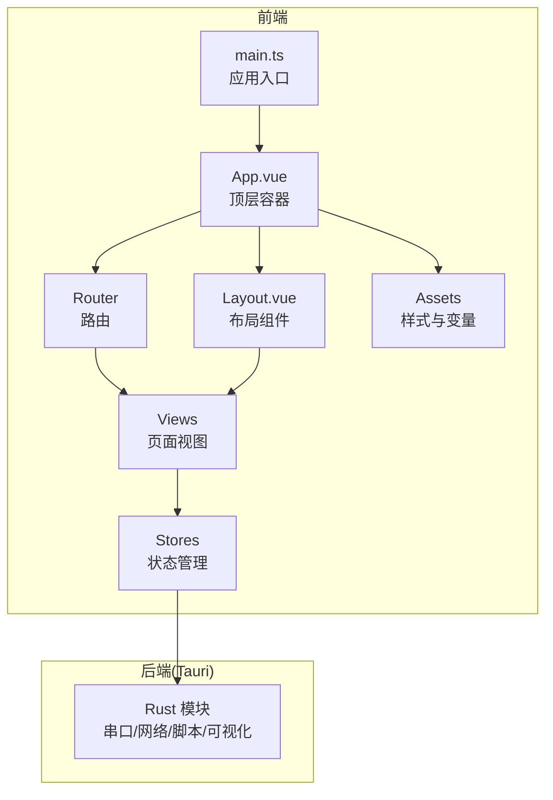
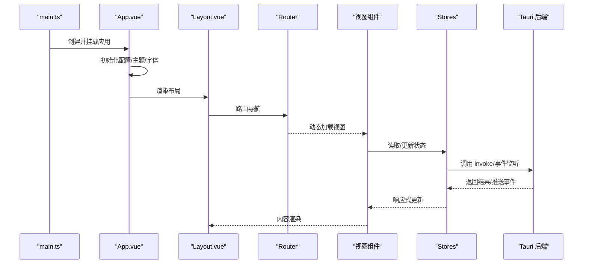
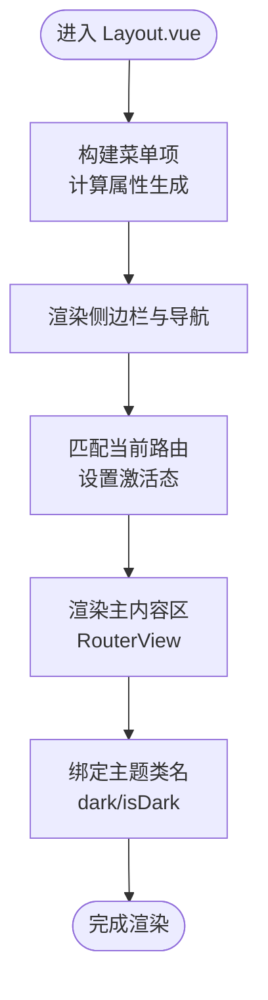
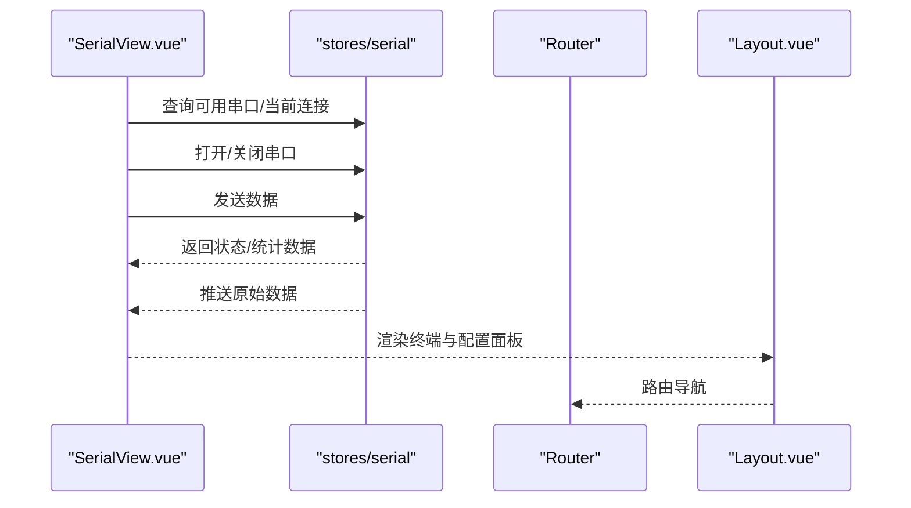
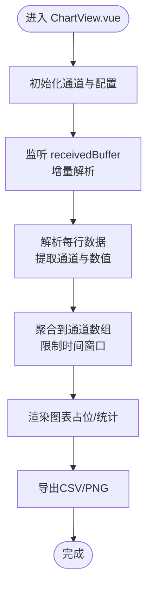
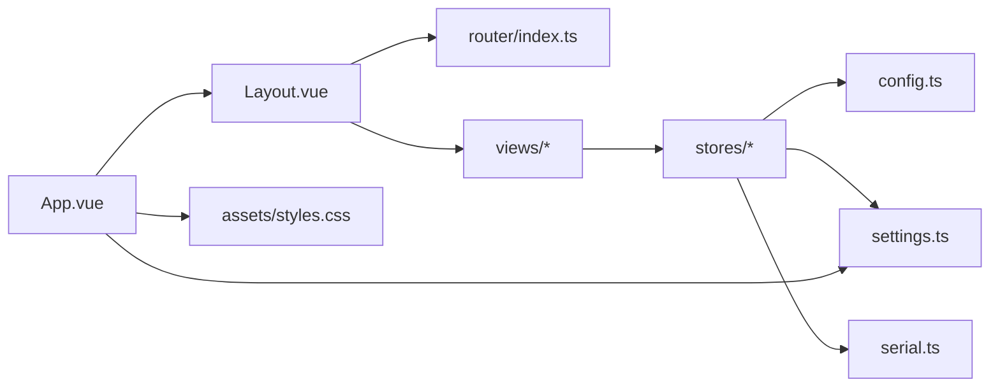

# 组件架构

<cite>
**本文引用的文件**
- [src/components/Layout.vue](file://src/components/Layout.vue)
- [src/App.vue](file://src/App.vue)
- [src/main.ts](file://src/main.ts)
- [src/router/index.ts](file://src/router/index.ts)
- [src/assets/styles.css](file://src/assets/styles.css)
- [src/stores/settings.ts](file://src/stores/settings.ts)
- [src/stores/config.ts](file://src/stores/config.ts)
- [src/stores/serial.ts](file://src/stores/serial.ts)
- [src/views/SerialView.vue](file://src/views/SerialView.vue)
- [src/views/ChartView.vue](file://src/views/ChartView.vue)
- [src/views/ScriptView.vue](file://src/views/ScriptView.vue)
- [src/views/SettingsView.vue](file://src/views/SettingsView.vue)
</cite>

## 目录
1. [简介](#简介)
2. [项目结构](#项目结构)
3. [核心组件](#核心组件)
4. [架构总览](#架构总览)
5. [详细组件分析](#详细组件分析)
6. [依赖关系分析](#依赖关系分析)
7. [性能考量](#性能考量)
8. [故障排查指南](#故障排查指南)
9. [结论](#结论)
10. [附录](#附录)

## 简介
本文件系统性梳理该 Vue3 + Tauri 项目的组件架构与工程实践，重点围绕以下目标展开：
- 布局组件（Layout.vue）的设计与实现：页面结构、导航菜单、响应式布局与主题适配。
- 组合式函数（composables）与工具函数（utils）的使用模式：可复用逻辑的抽象与封装思路。
- 组件间通信机制：Props、Events、Provide/Inject 的使用场景与最佳实践。
- 设计原则：单一职责、组件复用、性能优化。
- 测试策略与调试方法：基于现有代码结构给出可落地的建议。

## 项目结构
该项目采用“路由驱动 + 状态集中管理”的前端架构，结合 Tauri 后端进行系统级串口通信与配置持久化。核心目录与职责如下：
- src/components：可复用 UI 组件（如 Layout.vue）
- src/views：页面级视图组件（Serial/Chart/Script/Settings）
- src/stores：状态管理（settings/config/serial 等）
- src/router：前端路由配置
- src/assets：全局样式与变量
- src/main.ts：应用入口，注册插件与挂载根组件
- src/App.vue：顶层容器，注入主题、消息等上下文

**图表来源**
- [src/main.ts:1-14](file://src/main.ts#L1-L14)
- [src/App.vue:1-33](file://src/App.vue#L1-L33)
- [src/components/Layout.vue:1-121](file://src/components/Layout.vue#L1-L121)
- [src/router/index.ts:1-38](file://src/router/index.ts#L1-L38)
- [src/assets/styles.css:1-60](file://src/assets/styles.css#L1-L60)
- [src/stores/settings.ts:1-125](file://src/stores/settings.ts#L1-L125)
- [src/stores/config.ts:1-89](file://src/stores/config.ts#L1-L89)
- [src/stores/serial.ts:1-363](file://src/stores/serial.ts#L1-L363)

**章节来源**
- [src/main.ts:1-14](file://src/main.ts#L1-L14)
- [src/App.vue:1-33](file://src/App.vue#L1-L33)
- [src/router/index.ts:1-38](file://src/router/index.ts#L1-L38)
- [src/assets/styles.css:1-60](file://src/assets/styles.css#L1-L60)

## 核心组件
- 布局组件 Layout.vue：提供侧边导航、主内容区与响应式布局；通过计算属性动态生成菜单项，结合路由高亮实现导航联动。
- 视图组件 SerialView/ChartView/ScriptView/SettingsView：各自承担特定业务域，通过 stores 读取/写入状态，完成数据展示与交互。
- 应用入口与顶层容器：在 App.vue 中注入主题、消息上下文，并在 mounted 生命周期内初始化配置、主题与串口监听。

**章节来源**
- [src/components/Layout.vue:1-121](file://src/components/Layout.vue#L1-L121)
- [src/views/SerialView.vue:1-746](file://src/views/SerialView.vue#L1-L746)
- [src/views/ChartView.vue:1-800](file://src/views/ChartView.vue#L1-L800)
- [src/views/ScriptView.vue:1-442](file://src/views/ScriptView.vue#L1-L442)
- [src/views/SettingsView.vue:1-383](file://src/views/SettingsView.vue#L1-L383)
- [src/App.vue:1-33](file://src/App.vue#L1-L33)

## 架构总览
整体架构以“布局组件 + 页面视图 + 状态管理”为核心，配合路由与全局样式，形成清晰的分层与职责边界。下图展示了从入口到视图、再到状态与后端的调用链路。

**图表来源**
- [src/main.ts:1-14](file://src/main.ts#L1-L14)
- [src/App.vue:14-19](file://src/App.vue#L14-L19)
- [src/components/Layout.vue:17-43](file://src/components/Layout.vue#L17-L43)
- [src/router/index.ts:1-38](file://src/router/index.ts#L1-L38)
- [src/stores/serial.ts:312-341](file://src/stores/serial.ts#L312-L341)
- [src/stores/config.ts:42-64](file://src/stores/config.ts#L42-L64)

## 详细组件分析

### 布局组件 Layout.vue 分析
- 页面结构
  - 采用左右布局：左侧为固定宽度侧边栏，右侧为主内容区，主内容区通过 RouterView 展示当前路由对应的视图。
  - 通过 CSS 变量与主题开关控制背景、边框与文字颜色，实现明暗主题切换。
- 导航菜单
  - 菜单项通过计算属性动态生成，包含图标与本地化文案；当前路由激活态通过路由路径匹配实现。
  - 菜单项与路由路径一一对应，确保导航与视图的一致性。
- 响应式布局
  - 侧边栏固定宽度，主内容区使用弹性布局自适应剩余空间；滚动采用溢出隐藏与滚动条组件结合，保证良好体验。
- 与状态管理的协作
  - 主题状态来自 settings.store（isDark），通过类名切换实现主题切换；国际化来自 i18n.store（t 函数）。

**图表来源**
- [src/components/Layout.vue:9-14](file://src/components/Layout.vue#L9-L14)
- [src/components/Layout.vue:25-36](file://src/components/Layout.vue#L25-L36)
- [src/components/Layout.vue:39-42](file://src/components/Layout.vue#L39-L42)
- [src/stores/settings.ts:27-32](file://src/stores/settings.ts#L27-L32)

**章节来源**
- [src/components/Layout.vue:1-121](file://src/components/Layout.vue#L1-L121)
- [src/stores/settings.ts:100-117](file://src/stores/settings.ts#L100-L117)

### 视图组件通信与数据流分析

#### 串口调试视图（SerialView.vue）
- 组件职责
  - 提供串口配置、连接/断开、发送数据、终端显示与统计信息展示。
- 与状态管理的交互
  - 读取可用串口列表、当前连接状态、连接统计；通过 stores/serial 的方法执行打开/关闭连接、发送数据、轮询更新等。
  - 注册串口数据回调，接收后端推送的原始字节，按当前编码解码后展示。
- 与布局组件的关系
  - 作为 RouterView 的内容被 Layout.vue 包裹，共享主题与国际化上下文。

**图表来源**
- [src/views/SerialView.vue:13-28](file://src/views/SerialView.vue#L13-L28)
- [src/views/SerialView.vue:237-253](file://src/views/SerialView.vue#L237-L253)
- [src/stores/serial.ts:146-240](file://src/stores/serial.ts#L146-L240)
- [src/stores/serial.ts:312-341](file://src/stores/serial.ts#L312-L341)

**章节来源**
- [src/views/SerialView.vue:1-746](file://src/views/SerialView.vue#L1-L746)
- [src/stores/serial.ts:1-363](file://src/stores/serial.ts#L1-L363)

#### 波形图视图（ChartView.vue）
- 组件职责
  - 从全局接收缓存中解析并聚合通道数据，支持时间窗口、自动缩放、网格线与导出功能。
- 与状态管理的交互
  - 直接读取 stores/serial 的全局接收缓存，增量解析新增数据，维护通道集合与统计数据。
- 与布局组件的关系
  - 作为 RouterView 的内容被 Layout.vue 包裹，共享主题与国际化上下文。

**图表来源**
- [src/views/ChartView.vue:13](file://src/views/ChartView.vue#L13)
- [src/views/ChartView.vue:100-132](file://src/views/ChartView.vue#L100-L132)
- [src/stores/serial.ts:96-117](file://src/stores/serial.ts#L96-L117)

**章节来源**
- [src/views/ChartView.vue:1-800](file://src/views/ChartView.vue#L1-L800)
- [src/stores/serial.ts:96-117](file://src/stores/serial.ts#L96-L117)

#### 脚本编辑视图（ScriptView.vue）
- 组件职责
  - 提供脚本编辑、运行/停止、日志输出与文件管理。
- 与状态管理的交互
  - 通过本地响应式数据管理脚本内容、运行状态与日志；与 stores 无直接耦合。
- 与布局组件的关系
  - 作为 RouterView 的内容被 Layout.vue 包裹。

**章节来源**
- [src/views/ScriptView.vue:1-442](file://src/views/ScriptView.vue#L1-L442)

#### 设置视图（SettingsView.vue）
- 组件职责
  - 提供主题、语言、字体大小、数据相关配置的读取与保存。
- 与状态管理的交互
  - 读取与更新 settings.store 中的主题、语言、字体大小与数据配置；保存时调用 persistSettings。
  - 在 mounted 阶段加载配置，确保界面初始状态正确。
- 与布局组件的关系
  - 作为 RouterView 的内容被 Layout.vue 包裹。

**章节来源**
- [src/views/SettingsView.vue:1-383](file://src/views/SettingsView.vue#L1-L383)
- [src/stores/settings.ts:122-125](file://src/stores/settings.ts#L122-L125)
- [src/stores/config.ts:42-64](file://src/stores/config.ts#L42-L64)

### 组合式函数（composables）与工具函数（utils）使用模式
- 现状与建议
  - 项目中尚未显式提供 composables 与 utils 目录文件，但具备良好的可扩展基础。
  - 推荐将跨组件复用的逻辑抽象为组合式函数（如 useSerialConnection、useTheme），将纯函数抽离为工具模块（如字符串处理、数据格式化）。
  - 保持函数的无副作用与可测试性，参数与返回值明确，便于单元测试与集成测试。

[本节为概念性指导，不直接分析具体文件，故不附“章节来源”]

### 组件间通信机制
- Props
  - 通过 props 向子组件传递只读配置或状态快照，避免直接修改父组件状态。
- Events
  - 子组件通过 emits 向父组件派发事件（如用户操作、配置变更），父组件统一处理并更新 stores。
- Provide/Inject
  - 在 App.vue 中通过 NConfigProvider/NMessageProvider 注入主题、消息等全局上下文，布局与视图组件可直接 inject 使用，降低跨层级传参复杂度。

**章节来源**
- [src/App.vue:22-32](file://src/App.vue#L22-L32)

## 依赖关系分析
- 组件依赖
  - Layout.vue 依赖路由与 i18n/store，渲染 RouterView 并承载视图。
  - 视图组件依赖 stores（settings/config/serial）与 UI 组件库（Naive UI）。
- 状态依赖
  - settings.store 提供主题、语言、字体大小等全局配置；config.store 提供配置读写；serial.store 提供串口生命周期与数据缓存。
- 路由依赖
  - router/index.ts 定义页面路由，与 Layout.vue 的 RouterView 形成解耦的视图映射。

**图表来源**
- [src/components/Layout.vue:17-43](file://src/components/Layout.vue#L17-L43)
- [src/router/index.ts:1-38](file://src/router/index.ts#L1-L38)
- [src/stores/config.ts:1-89](file://src/stores/config.ts#L1-L89)
- [src/stores/settings.ts:1-125](file://src/stores/settings.ts#L1-L125)
- [src/stores/serial.ts:1-363](file://src/stores/serial.ts#L1-L363)
- [src/App.vue:1-33](file://src/App.vue#L1-L33)
- [src/assets/styles.css:1-60](file://src/assets/styles.css#L1-L60)

**章节来源**
- [src/components/Layout.vue:1-121](file://src/components/Layout.vue#L1-L121)
- [src/router/index.ts:1-38](file://src/router/index.ts#L1-L38)
- [src/stores/config.ts:1-89](file://src/stores/config.ts#L1-L89)
- [src/stores/settings.ts:1-125](file://src/stores/settings.ts#L1-L125)
- [src/stores/serial.ts:1-363](file://src/stores/serial.ts#L1-L363)
- [src/App.vue:1-33](file://src/App.vue#L1-L33)
- [src/assets/styles.css:1-60](file://src/assets/styles.css#L1-L60)

## 性能考量
- 响应式与计算属性
  - 使用 computed 生成菜单项与选项列表，减少重复计算；在视图中通过计算属性控制 UI 状态，避免不必要的重渲染。
- 数据缓存与截断
  - 串口接收缓存与图表通道数据均设置上限，超出则截断旧数据，防止内存膨胀。
- 轮询与事件
  - 串口状态轮询与事件监听分离，避免阻塞主线程；在组件卸载时及时清理轮询与监听，释放资源。
- 样式与主题
  - 通过 CSS 变量与主题类名切换实现主题切换，避免频繁重排与重绘。

**章节来源**
- [src/stores/serial.ts:105-117](file://src/stores/serial.ts#L105-L117)
- [src/views/ChartView.vue:92-98](file://src/views/ChartView.vue#L92-L98)
- [src/stores/serial.ts:348-362](file://src/stores/serial.ts#L348-L362)
- [src/stores/serial.ts:325-332](file://src/stores/serial.ts#L325-L332)
- [src/stores/settings.ts:100-117](file://src/stores/settings.ts#L100-L117)

## 故障排查指南
- 配置加载失败
  - 现象：应用启动后配置未生效。
  - 排查：确认 App.vue 中 loadConfig 调用顺序与错误日志；检查后端配置接口返回。
- 主题未切换
  - 现象：切换主题后界面未变化。
  - 排查：确认 settings.store 中 applyThemeToDOM 是否执行；检查 HTML 上的 dark 类名是否存在。
- 串口数据不显示
  - 现象：连接成功但终端无数据。
  - 排查：确认 stores/serial 的 startSerialDataListener 是否启动；检查 onSerialData 回调是否注册；验证编码设置与解码流程。
- 资源泄漏
  - 现象：组件切换后内存占用上升。
  - 排查：确认组件卸载时是否调用 stopStatusPolling 与取消监听；检查轮询与定时器是否清理。

**章节来源**
- [src/App.vue:14-19](file://src/App.vue#L14-L19)
- [src/stores/config.ts:42-64](file://src/stores/config.ts#L42-L64)
- [src/stores/settings.ts:100-117](file://src/stores/settings.ts#L100-L117)
- [src/stores/serial.ts:312-341](file://src/stores/serial.ts#L312-L341)
- [src/views/SerialView.vue:250-253](file://src/views/SerialView.vue#L250-L253)

## 结论
该架构以布局组件为中心，通过路由与状态管理实现清晰的职责划分与良好的可扩展性。建议后续补充 composables 与 utils 的模块化组织，进一步提升代码复用与可测试性；同时完善组件测试策略与调试流程，保障长期演进质量。

## 附录
- 组件设计最佳实践
  - 单一职责：每个组件聚焦一个领域或视图片段。
  - 组件复用：将跨页面的交互与状态抽离为组合式函数或工具函数。
  - 性能优化：合理使用计算属性、缓存与截断策略，避免过度渲染与内存泄漏。
- 组件测试策略与调试方法
  - 单元测试：针对组合式函数与工具函数编写独立测试，验证输入输出与边界条件。
  - 集成测试：通过路由与状态模拟，验证组件在真实场景下的行为。
  - 调试方法：利用浏览器开发者工具观察组件树、状态变化与事件流；在关键路径添加日志与断点。

[本节为通用指导，不直接分析具体文件，故不附“章节来源”]