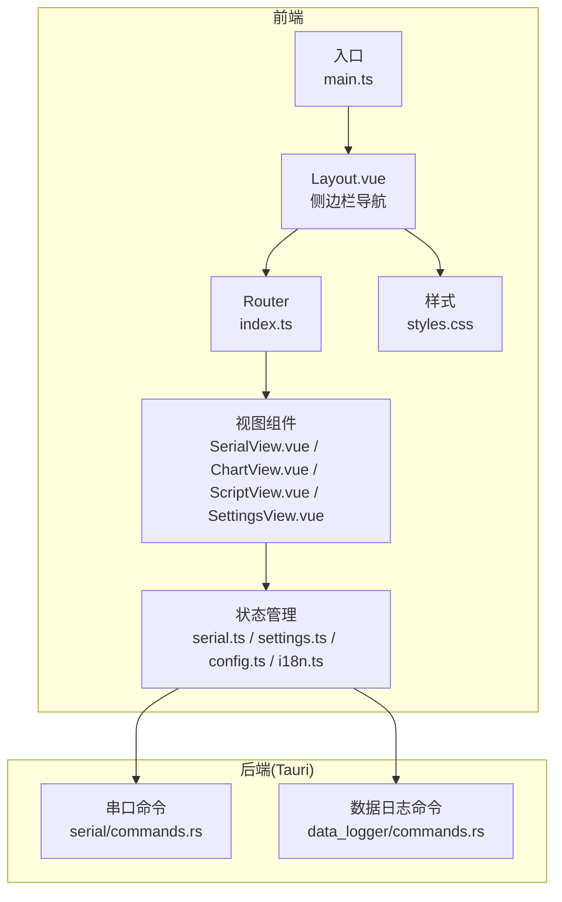
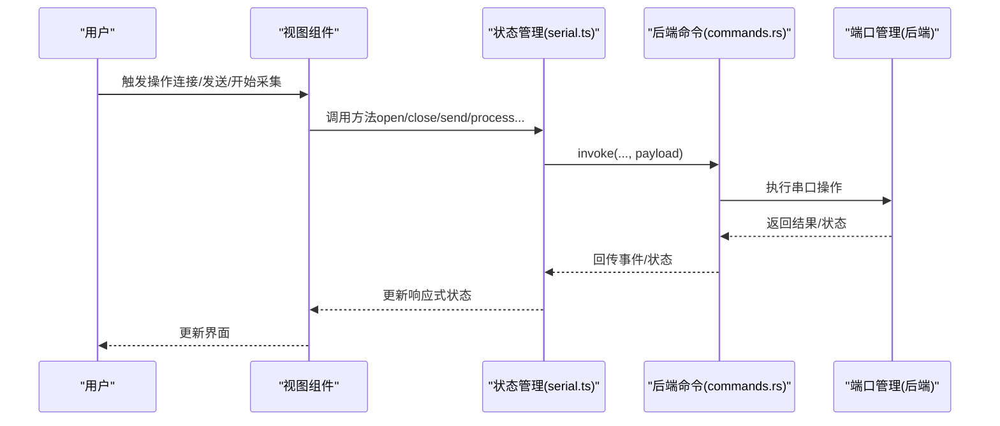
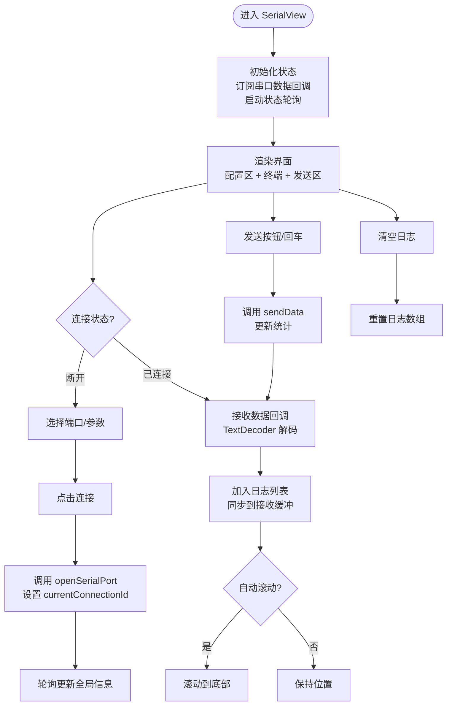
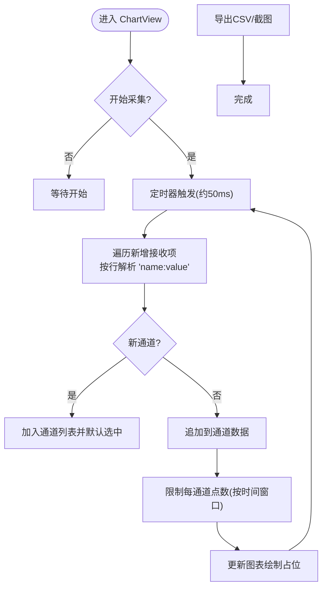
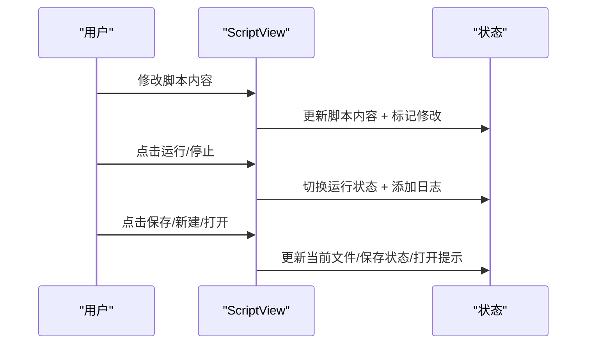
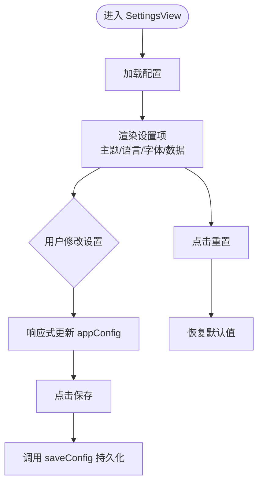
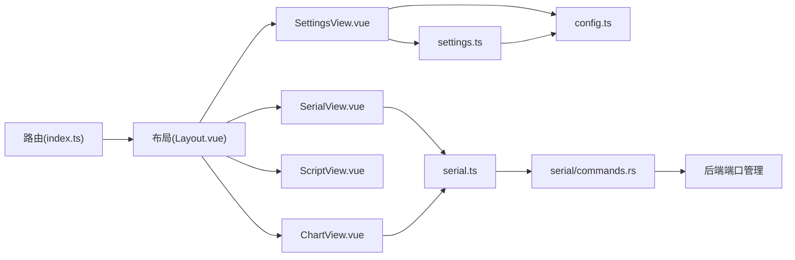

# 视图页面设计

<cite>
**本文档引用的文件**
- [SerialView.vue](file://src/views/SerialView.vue)
- [ChartView.vue](file://src/views/ChartView.vue)
- [ScriptView.vue](file://src/views/ScriptView.vue)
- [SettingsView.vue](file://src/views/SettingsView.vue)
- [Layout.vue](file://src/components/Layout.vue)
- [index.ts](file://src/router/index.ts)
- [serial.ts](file://src/stores/serial.ts)
- [settings.ts](file://src/stores/settings.ts)
- [config.ts](file://src/stores/config.ts)
- [i18n.ts](file://src/stores/i18n.ts)
- [styles.css](file://src/assets/styles.css)
- [main.ts](file://src/main.ts)
- [commands.rs](file://src-tauri/src/serial/commands.rs)
- [commands.rs (data_logger)](file://src-tauri/src/data_logger/commands.rs)
</cite>

## 目录
1. [简介](#简介)
2. [项目结构](#项目结构)
3. [核心组件](#核心组件)
4. [架构总览](#架构总览)
5. [详细组件分析](#详细组件分析)
6. [依赖分析](#依赖分析)
7. [性能考虑](#性能考虑)
8. [故障排除指南](#故障排除指南)
9. [结论](#结论)
10. [附录](#附录)

## 简介
本文件面向 KonSerial 的视图页面设计，系统性梳理串口调试、波形图、脚本编辑与设置四个页面的界面设计、数据绑定、事件处理与用户交互逻辑；阐明页面间导航与状态传递机制；解释实时数据更新的实现方式（基于 Tauri 命令与前端状态管理）；并提供性能优化策略与无障碍访问建议。

## 项目结构
KonSerial 采用前端 Vue 3 + Naive UI + Tauri 的混合架构。页面通过路由组织，布局组件提供统一侧边栏导航，视图组件通过状态管理模块与后端命令进行数据交互。

**图表来源**
- [Layout.vue:1-121](file://src/components/Layout.vue#L1-L121)
- [index.ts:1-38](file://src/router/index.ts#L1-L38)
- [serial.ts:1-363](file://src/stores/serial.ts#L1-L363)
- [settings.ts:1-125](file://src/stores/settings.ts#L1-L125)
- [config.ts:1-89](file://src/stores/config.ts#L1-L89)
- [i18n.ts:1-348](file://src/stores/i18n.ts#L1-L348)
- [styles.css:1-60](file://src/assets/styles.css#L1-L60)
- [main.ts:1-14](file://src/main.ts#L1-L14)
- [commands.rs:1-129](file://src-tauri/src/serial/commands.rs#L1-L129)
- [commands.rs (data_logger):1-49](file://src-tauri/src/data_logger/commands.rs#L1-L49)

**章节来源**
- [Layout.vue:1-121](file://src/components/Layout.vue#L1-L121)
- [index.ts:1-38](file://src/router/index.ts#L1-L38)
- [styles.css:1-60](file://src/assets/styles.css#L1-L60)
- [main.ts:1-14](file://src/main.ts#L1-L14)

## 核心组件
- 串口调试页面（SerialView）：负责串口连接、发送/接收数据展示、统计信息与编码切换。
- 波形图页面（ChartView）：解析“通道名:数值”格式数据，按时间窗口显示多通道曲线，支持导出与截图。
- 脚本编辑页面（ScriptView）：提供脚本编辑、运行/停止、日志输出与文件管理。
- 设置页面（SettingsView）：主题、语言、字体大小、数据缓冲与自动保存等全局设置。

**章节来源**
- [SerialView.vue:1-746](file://src/views/SerialView.vue#L1-L746)
- [ChartView.vue:1-855](file://src/views/ChartView.vue#L1-L855)
- [ScriptView.vue:1-442](file://src/views/ScriptView.vue#L1-L442)
- [SettingsView.vue:1-383](file://src/views/SettingsView.vue#L1-L383)

## 架构总览
前端通过 Tauri 命令与后端串口模块交互，串口数据通过事件回调回传至前端，前端再将数据写入全局接收缓冲供图表等页面消费。设置与国际化通过响应式状态驱动 UI。

**图表来源**
- [serial.ts:145-240](file://src/stores/serial.ts#L145-L240)
- [commands.rs:49-129](file://src-tauri/src/serial/commands.rs#L49-L129)

**章节来源**
- [serial.ts:1-363](file://src/stores/serial.ts#L1-L363)
- [commands.rs:1-129](file://src-tauri/src/serial/commands.rs#L1-L129)

## 详细组件分析

### 串口调试页面（SerialView）
- 功能定位与设计思路
  - 左侧配置区：串口参数选择、连接控制、连接状态与统计。
  - 右侧主区：终端显示（时间戳、方向标识、内容）、发送输入与选项（HEX/文本、换行追加、编码切换）。
  - 设计要点：分栏布局、紧凑控件、高对比度终端背景、自动滚动与清空能力。
- 数据绑定与状态
  - 响应式状态：端口名、波特率、数据位、停止位、校验、流控、编码、换行策略、自动滚动、发送文本等。
  - 全局状态：可用端口列表、当前连接信息、连接统计、接收缓冲（供图表使用）。
- 事件处理与交互
  - 刷新端口、连接/断开、发送数据、清空日志、下拉框打开时冻结选项防止抖动。
  - 接收数据通过回调注入，按编码解码显示，支持 HEX 展示与自动滚动。
- 实时数据更新
  - 后端通过事件推送原始字节，前端注册回调解码显示；同时启动状态轮询更新连接统计。
- 页面间导航与状态传递
  - 通过路由切换；连接状态与接收缓冲跨页面共享，图表页面直接读取全局缓冲。

**图表来源**
- [SerialView.vue:140-253](file://src/views/SerialView.vue#L140-L253)
- [serial.ts:297-363](file://src/stores/serial.ts#L297-L363)

**章节来源**
- [SerialView.vue:1-746](file://src/views/SerialView.vue#L1-L746)
- [serial.ts:1-363](file://src/stores/serial.ts#L1-L363)

### 波形图页面（ChartView）
- 功能定位与设计思路
  - 解析“通道名:数值”格式，按时间窗口维护多通道数据，支持自动缩放、网格、线宽等显示配置。
  - 提供通道选择、统计信息、开始/暂停采集、清空、导出 CSV、截图保存。
- 数据绑定与状态
  - 响应式状态：运行开关、时间窗口、自动缩放、Y 轴范围、网格、线宽、通道颜色。
  - 全局状态：接收缓冲（来自串口），解析增量处理。
- 事件处理与交互
  - 定时器周期性处理新增数据，解析每行并按通道存储；支持导出 CSV 与截图。
- 实时数据更新
  - 通过接收缓冲增量解析，限制每通道最大点数，维持时间窗口内的数据。
- 页面间导航与状态传递
  - 与串口页面共享接收缓冲，无需额外状态传递。

**图表来源**
- [ChartView.vue:100-208](file://src/views/ChartView.vue#L100-L208)
- [serial.ts:96-117](file://src/stores/serial.ts#L96-L117)

**章节来源**
- [ChartView.vue:1-855](file://src/views/ChartView.vue#L1-L855)
- [serial.ts:1-363](file://src/stores/serial.ts#L1-L363)

### 脚本编辑页面（ScriptView）
- 功能定位与设计思路
  - 提供脚本编辑区（行号、代码编辑器）、左侧文件列表、右侧运行日志输出。
  - 支持运行/停止、保存、新建、打开（预留）。
- 数据绑定与状态
  - 响应式状态：脚本内容、运行状态、当前文件、修改标记、日志列表。
  - 统计：行数、字符数。
- 事件处理与交互
  - 内容变更检测修改标记；运行/停止按钮切换状态；清空日志。
- 实时数据更新
  - 该页面不直接参与串口数据流，但可作为自动化流程的一部分（例如通过串口页面发送数据）。

**图表来源**
- [ScriptView.vue:1-442](file://src/views/ScriptView.vue#L1-L442)

**章节来源**
- [ScriptView.vue:1-442](file://src/views/ScriptView.vue#L1-L442)

### 设置页面（SettingsView）
- 功能定位与设计思路
  - 外观设置（主题、语言、字体大小）、数据设置（自动保存、保存间隔、缓冲区大小）、关于信息。
  - 提供保存与重置操作。
- 数据绑定与状态
  - 响应式设置：主题、语言、字体大小、自动保存、保存间隔、缓冲区大小。
  - 通过配置存储模块持久化到磁盘。
- 事件处理与交互
  - 保存设置、重置默认值、加载初始配置。
- 实时数据更新
  - 主题与字体大小通过响应式计算应用到 DOM 与 Naive UI 主题覆盖。

**图表来源**
- [SettingsView.vue:1-383](file://src/views/SettingsView.vue#L1-L383)
- [settings.ts:1-125](file://src/stores/settings.ts#L1-L125)
- [config.ts:1-89](file://src/stores/config.ts#L1-L89)

**章节来源**
- [SettingsView.vue:1-383](file://src/views/SettingsView.vue#L1-L383)
- [settings.ts:1-125](file://src/stores/settings.ts#L1-L125)
- [config.ts:1-89](file://src/stores/config.ts#L1-L89)

## 依赖分析
- 页面与路由
  - 路由定义了四个页面路径与元信息，Layout 提供侧边栏导航，RouterView 渲染当前视图。
- 页面与状态管理
  - SerialView 依赖串口状态与事件回调；ChartView 依赖全局接收缓冲；SettingsView 依赖配置与设置模块。
- 页面与后端
  - 串口操作通过 Tauri 命令执行，数据通过事件回调回传；数据日志相关命令用于历史数据管理。

**图表来源**
- [index.ts:1-38](file://src/router/index.ts#L1-L38)
- [Layout.vue:1-121](file://src/components/Layout.vue#L1-L121)
- [serial.ts:1-363](file://src/stores/serial.ts#L1-L363)
- [settings.ts:1-125](file://src/stores/settings.ts#L1-L125)
- [config.ts:1-89](file://src/stores/config.ts#L1-L89)
- [commands.rs:1-129](file://src-tauri/src/serial/commands.rs#L1-L129)

**章节来源**
- [index.ts:1-38](file://src/router/index.ts#L1-L38)
- [Layout.vue:1-121](file://src/components/Layout.vue#L1-L121)
- [serial.ts:1-363](file://src/stores/serial.ts#L1-L363)
- [settings.ts:1-125](file://src/stores/settings.ts#L1-L125)
- [config.ts:1-89](file://src/stores/config.ts#L1-L89)
- [commands.rs:1-129](file://src-tauri/src/serial/commands.rs#L1-L129)

## 性能考虑
- 懒加载与路由
  - 页面通过异步导入实现路由级别的懒加载，减少首屏体积与加载时间。
- 虚拟滚动与长列表
  - 终端与日志列表使用滚动容器，建议在超大数据量场景采用虚拟滚动组件以降低 DOM 节点数量。
- 内存管理
  - 接收缓冲区与通道数据点数受时间窗口与最大点数限制，避免无限增长；组件卸载时清理轮询与回调。
- 渲染优化
  - 使用计算属性与响应式状态，避免不必要的重渲染；对高频更新的列表项使用稳定 key。
- 事件与轮询
  - 串口状态轮询与数据解析定时器需在组件卸载时清理，防止内存泄漏与重复回调。
- 图表渲染
  - 图表占位尚未集成具体可视化库，建议在集成时启用 Canvas/WebGL 渲染优化与数据采样。

[本节为通用指导，不直接分析具体文件，故无“章节来源”]

## 故障排除指南
- 串口连接失败
  - 检查端口权限与占用；查看消息提示与错误日志；确认配置参数正确。
- 数据不显示或乱码
  - 检查编码设置（UTF-8/GBK）与 HEX/文本发送模式；确认后端解码一致。
- 图表无数据
  - 确认串口发送格式为“通道名:数值”，且已开始采集；检查时间窗口与通道发现逻辑。
- 设置不生效
  - 确认已点击保存；检查配置持久化是否成功；主题与字体大小通过响应式应用到 DOM。
- 页面卡顿
  - 检查是否有过多轮询或定时器未清理；适当降低缓冲区大小与时间窗口；启用虚拟滚动。

**章节来源**
- [SerialView.vue:140-253](file://src/views/SerialView.vue#L140-L253)
- [ChartView.vue:100-208](file://src/views/ChartView.vue#L100-L208)
- [SettingsView.vue:42-63](file://src/views/SettingsView.vue#L42-L63)
- [serial.ts:347-363](file://src/stores/serial.ts#L347-L363)

## 结论
KonSerial 的视图页面围绕“串口数据”的核心体验构建，通过清晰的分栏布局与响应式状态管理，实现了从连接、发送、接收、解析到可视化的完整闭环。页面间通过共享状态实现自然衔接，设置与国际化提供一致的用户体验。后续可在图表渲染、长列表虚拟化与内存监控方面进一步优化，以提升大规模数据场景下的稳定性与性能。

## 附录
- 国际化键值与页面映射
  - 串口页面键值：如“connected/disconnected/config/port/baudRate/...”
  - 设置页面键值：如“appearance/theme/language/fontSize/data/autoSave/saveInterval/bufferSize/about/...”
  - 波形图页面键值：如“running/stopped/formatHelp/channels/timeRange/display/autoScale/yMin/yMax/...”
  - 脚本页面键值：如“files/new/lines/chars/open/save/run/stop/log/...”
- 样式变量与主题
  - CSS 变量统一管理字体大小与主题色板；暗色主题通过类名切换实现。

**章节来源**
- [i18n.ts:1-348](file://src/stores/i18n.ts#L1-L348)
- [styles.css:1-60](file://src/assets/styles.css#L1-L60)
- [settings.ts:102-117](file://src/stores/settings.ts#L102-L117)