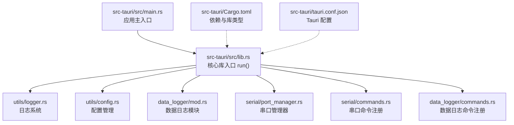
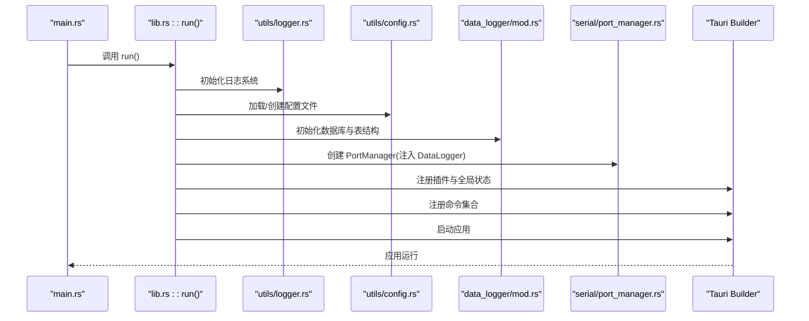
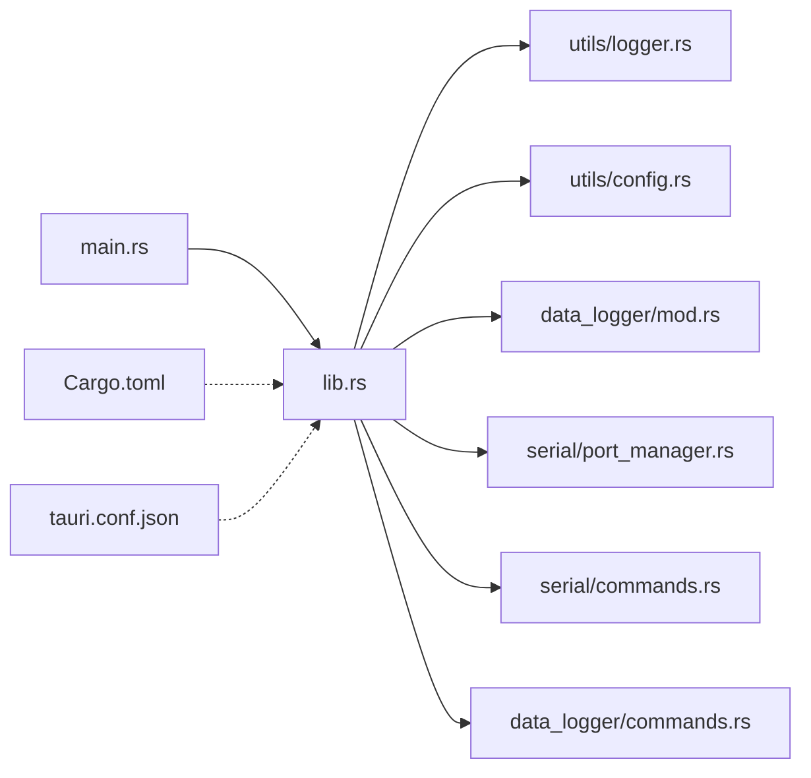

# Rust 核心库

<cite>
**本文引用的文件**
- [lib.rs](file://src-tauri/src/lib.rs)
- [main.rs](file://src-tauri/src/main.rs)
- [Cargo.toml](file://src-tauri/Cargo.toml)
- [tauri.conf.json](file://src-tauri/tauri.conf.json)
- [utils/mod.rs](file://src-tauri/src/utils/mod.rs)
- [utils/logger.rs](file://src-tauri/src/utils/logger.rs)
- [utils/config.rs](file://src-tauri/src/utils/config.rs)
- [serial/mod.rs](file://src-tauri/src/serial/mod.rs)
- [serial/port_manager.rs](file://src-tauri/src/serial/port_manager.rs)
- [serial/commands.rs](file://src-tauri/src/serial/commands.rs)
- [data_logger/mod.rs](file://src-tauri/src/data_logger/mod.rs)
- [data_logger/commands.rs](file://src-tauri/src/data_logger/commands.rs)
- [DESIGN.md](file://DESIGN.md)
- [README.md](file://README.md)
</cite>

## 目录
1. [简介](#简介)
2. [项目结构](#项目结构)
3. [核心组件](#核心组件)
4. [架构总览](#架构总览)
5. [详细组件分析](#详细组件分析)
6. [依赖关系分析](#依赖关系分析)
7. [性能考量](#性能考量)
8. [故障排查指南](#故障排查指南)
9. [结论](#结论)
10. [附录](#附录)

## 简介
本文件面向 KonSerial 的 Rust 核心库，聚焦于 lib.rs 作为应用入口点的设计与实现，系统性阐述模块导入、全局状态管理、Tauri 命令注册机制；详解 run() 启动流程（日志系统初始化、配置管理、数据库初始化、串口管理器创建）；解释 Arc<Mutex<T>> 模式在并发场景下的使用原因与线程安全考量；并给出 Tauri Builder 的配置项说明（插件系统集成与全局状态管理）。最后提供核心库架构图与启动时序图，帮助开发者快速理解应用初始化与运行时交互。

## 项目结构
后端采用 Tauri 2 + Rust，核心入口位于 src-tauri/src/lib.rs，应用主入口在 src-tauri/src/main.rs。模块按功能域划分：utils（日志、配置）、serial（串口管理与命令）、data_logger（SQLite 数据持久化与命令）、visualization（预留）、network/script（预留）。Cargo.toml 定义了库类型与依赖，tauri.conf.json 提供应用元数据与插件配置。

**图表来源**
- [lib.rs:1-84](file://src-tauri/src/lib.rs#L1-L84)
- [main.rs:1-7](file://src-tauri/src/main.rs#L1-L7)
- [Cargo.toml:1-40](file://src-tauri/Cargo.toml#L1-L40)
- [tauri.conf.json:1-47](file://src-tauri/tauri.conf.json#L1-L47)

**章节来源**
- [lib.rs:1-84](file://src-tauri/src/lib.rs#L1-L84)
- [main.rs:1-7](file://src-tauri/src/main.rs#L1-L7)
- [Cargo.toml:1-40](file://src-tauri/Cargo.toml#L1-L40)
- [tauri.conf.json:1-47](file://src-tauri/tauri.conf.json#L1-L47)

## 核心组件
- 应用入口与启动流程
  - 入口文件：src-tauri/src/lib.rs 中的 run() 函数负责应用启动与服务注册。
  - 主入口：src-tauri/src/main.rs 仅调用核心库 run()，实现最小化主入口。
- 模块导入与组织
  - utils 模块：日志、配置、通用命令导出。
  - serial 模块：串口管理器、命令、数据处理、协议。
  - data_logger 模块：SQLite 数据持久化、命令。
  - visualization/network/script 模块：预留扩展。
- 全局状态与插件
  - 通过 tauri::Builder::manage 注入全局状态（Arc<Mutex<PortManager>>、Arc<DataLogger>）。
  - 通过 .plugin(...) 注册 Tauri 插件（dialog、clipboard、fs、opener、cli）。
  - 通过 .invoke_handler(...) 统一注册命令集合。

**章节来源**
- [lib.rs:1-84](file://src-tauri/src/lib.rs#L1-L84)
- [main.rs:1-7](file://src-tauri/src/main.rs#L1-L7)
- [utils/mod.rs:1-6](file://src-tauri/src/utils/mod.rs#L1-L6)
- [serial/mod.rs:1-4](file://src-tauri/src/serial/mod.rs#L1-L4)
- [data_logger/mod.rs:1-273](file://src-tauri/src/data_logger/mod.rs#L1-L273)

## 架构总览
下图展示了 Rust 核心库在启动阶段的关键交互：日志初始化、配置加载、数据库初始化、串口管理器创建，并通过 Tauri Builder 注册插件与命令，最终进入运行时。

**图表来源**
- [lib.rs:24-83](file://src-tauri/src/lib.rs#L24-L83)
- [utils/logger.rs:41-83](file://src-tauri/src/utils/logger.rs#L41-L83)
- [utils/config.rs:65-94](file://src-tauri/src/utils/config.rs#L65-L94)
- [data_logger/mod.rs:62-111](file://src-tauri/src/data_logger/mod.rs#L62-L111)
- [serial/port_manager.rs:173-180](file://src-tauri/src/serial/port_manager.rs#L173-L180)

## 详细组件分析

### 应用入口与启动流程（lib.rs）
- 模块导入
  - 引入 utils、data_logger、network、script、serial、visualization 子模块。
  - 引入 AppConfig、Logger、LoggerConfig、PortManager、DataLogger 等类型。
- 命令定义
  - 定义 greet 命令作为示例，使用日志宏输出调用信息。
- 启动流程（run()）
  - 日志初始化：Logger::init(LoggerConfig::default())。
  - 配置初始化：default_config_path() + AppConfig::init(...)。
  - 数据库初始化：default_db_path() + DataLogger::new(...)，并包装为 Arc。
  - 串口管理器初始化：PortManager::new(Arc<DataLogger>)，并包装为 Arc<Mutex<...>>。
  - Tauri Builder 配置：
    - 插件：dialog、clipboard、cli（非移动端）、fs、opener。
    - 全局状态：.manage(port_manager)、.manage(data_logger)。
    - 命令注册：greet + utils commands + serial commands + data_logger commands。
    - 运行：.run(generate_context!())。

并发与线程安全要点
- PortManager 内部使用 Arc<RwLock<...>> 管理连接与可用串口缓存，保证多任务并发读写安全。
- 串口读取循环在独立线程中运行，通过 Atomic 标志与 JoinHandle 控制生命周期。
- DataLogger 内部使用 Mutex<Connection> 保护 SQLite 连接，避免并发写入冲突。

**章节来源**
- [lib.rs:1-84](file://src-tauri/src/lib.rs#L1-L84)
- [main.rs:1-7](file://src-tauri/src/main.rs#L1-L7)

### 日志系统（utils/logger.rs）
- LoggerConfig：控制是否启用颜色、显示位置、显示时间。
- Logger：提供 init 与 format_message，配合 log_info!/log_warn!/log_error! 宏输出带时间/级别/位置的日志。
- OnceLock 用于全局配置初始化，保证线程安全。

**章节来源**
- [utils/logger.rs:1-132](file://src-tauri/src/utils/logger.rs#L1-L132)

### 配置管理（utils/config.rs）
- default_config_path()：跨平台生成配置文件路径（Linux/macOS/Windows）。
- AppConfig：包含 SerialConfig、UiConfig、DataConfig 三部分，支持 init/new/save/load/reload/get_path。
- 初始化策略：若存在则加载，否则创建默认配置并保存。

**章节来源**
- [utils/config.rs:1-176](file://src-tauri/src/utils/config.rs#L1-L176)

### 数据日志模块（data_logger/mod.rs）
- 默认数据库路径：default_db_path()，与配置目录同路径。
- 数据模型：SessionInfo、DataRecord。
- DataLogger：线程安全封装，内部使用 Mutex<Connection> 保护 SQLite 连接。
- 核心能力：创建会话、结束会话、记录 RX/TX、查询会话与数据、删除会话、导出 CSV。
- 表结构：sessions、serial_data，外键约束 + 索引优化。

并发与线程安全要点
- DataLogger::new 返回 Arc<Mutex<Connection>>，确保多任务并发写入安全。
- 所有数据库操作通过 conn.lock() 获取互斥锁，避免竞态。

**章节来源**
- [data_logger/mod.rs:1-273](file://src-tauri/src/data_logger/mod.rs#L1-L273)

### 串口管理器（serial/port_manager.rs）
- SerialPortConfig：完整串口参数（波特率、数据位、停止位、校验、流控、超时）。
- PortStatus：断开、连接中、已连接、错误。
- ConnectionInfo：连接状态、统计信息、错误信息、创建时间。
- SerialConnection：包含串口句柄、运行标志、字节计数、会话 ID、读取任务。
- PortManager：
  - open：打开串口、创建会话、启动读取循环、插入连接表。
  - read_loop：固定超时读取、持久化 RX、推送事件给前端。
  - send/close/close_all：发送数据、关闭单个/全部连接。
  - get_connection_info/get_all_connections/get_global_info：查询状态。
  - is_connected：检查连接状态。

并发与线程安全要点
- connections 使用 Arc<RwLock<HashMap<...>>>，读多写少场景下提升并发性能。
- 串口句柄 port 使用 Arc<Mutex<Box<dyn SerialPort>>>，确保读写安全。
- bytes_received_counter 使用 AtomicU64，无锁更新计数。
- running 使用 AtomicBool，配合 JoinHandle 控制读取循环生命周期。

**章节来源**
- [serial/port_manager.rs:1-402](file://src-tauri/src/serial/port_manager.rs#L1-L402)

### 串口命令（serial/commands.rs）
- list_serial_ports/get_serial_ports_info：枚举串口名称与简单信息。
- refresh_serial_ports：刷新可用串口缓存并返回详细信息。
- open_serial_port/close_serial_port/close_all_serial_ports：连接管理。
- get_connection_info/get_all_connections/get_global_runtime_info：状态查询。
- send_serial_data/is_serial_connected：数据发送与连接状态检查。
- 命令均通过 State<Arc<Mutex<PortManager>>> 获取共享状态，配合异步锁访问。

**章节来源**
- [serial/commands.rs:1-129](file://src-tauri/src/serial/commands.rs#L1-L129)

### 数据日志命令（data_logger/commands.rs）
- get_sessions：获取会话列表。
- get_session_data：按会话查询数据记录，支持方向过滤、分页。
- delete_session：删除会话及其所有数据。
- export_session_csv：导出会话为 CSV 字符串。
- 命令通过 State<Arc<DataLogger>> 获取全局状态。

**章节来源**
- [data_logger/commands.rs:1-49](file://src-tauri/src/data_logger/commands.rs#L1-L49)

### Tauri Builder 配置与插件系统
- 插件集成：
  - dialog：文件对话框。
  - clipboard：剪贴板管理。
  - cli：命令行参数（非移动端）。
  - fs：文件系统访问。
  - opener：系统默认应用打开文件。
- 全局状态：
  - manage(port_manager)：注入 Arc<Mutex<PortManager>>。
  - manage(data_logger)：注入 Arc<DataLogger>。
- 命令注册：
  - generate_handler! 包含 greet 与各模块命令集合。
- 运行时：
  - generate_context!() 生成上下文，.run() 启动应用。

**章节来源**
- [lib.rs:47-82](file://src-tauri/src/lib.rs#L47-L82)
- [tauri.conf.json:24-34](file://src-tauri/tauri.conf.json#L24-L34)

## 依赖关系分析
- 依赖管理：Cargo.toml 定义了 tauri、serialport、tokio、rhai、rusqlite、serde_json 等核心依赖。
- 库类型：lib.rs 以静态库、CDYLIB、RLIB 形式发布，适配多平台集成。
- 插件依赖：tauri-plugin-* 系列插件按需引入，CLI 插件仅在非移动端平台启用。

**图表来源**
- [lib.rs:1-84](file://src-tauri/src/lib.rs#L1-L84)
- [main.rs:1-7](file://src-tauri/src/main.rs#L1-L7)
- [Cargo.toml:20-40](file://src-tauri/Cargo.toml#L20-L40)
- [tauri.conf.json:1-47](file://src-tauri/tauri.conf.json#L1-L47)

**章节来源**
- [Cargo.toml:1-40](file://src-tauri/Cargo.toml#L1-L40)
- [lib.rs:1-84](file://src-tauri/src/lib.rs#L1-L84)

## 性能考量
- 异步与并发
  - 串口读取在 tokio::task::spawn_blocking 中运行，避免阻塞事件循环。
  - 使用 Atomic 类型减少锁竞争，如 bytes_received_counter、running。
  - PortManager 使用 RwLock 提升读多写少场景下的吞吐。
- I/O 与数据库
  - DataLogger 使用 SQLite WAL 模式与外键约束，兼顾一致性与性能。
  - 通过索引 idx_serial_data_session 优化查询。
- 资源管理
  - 串口读取循环设置固定超时，确保能及时响应关闭信号。
  - 会话生命周期与数据库事务配合，避免数据不一致。

[本节为通用性能讨论，不直接分析具体文件，故无“章节来源”]

## 故障排查指南
- 日志定位
  - 使用 log_info!/log_warn!/log_error! 宏输出关键节点与错误信息，便于定位问题。
- 配置问题
  - 若配置文件损坏或缺失，AppConfig::init 会回退到默认配置并保存，检查配置路径与权限。
- 数据库问题
  - DataLogger::new 初始化失败通常与目录权限或路径有关，检查 default_db_path() 返回路径。
- 串口问题
  - 打开串口失败时查看 PortManager::open 的错误信息；确认端口名称、权限与占用情况。
  - 读取循环异常退出时检查 read_loop 的错误分支与 running 标志。

**章节来源**
- [utils/logger.rs:85-132](file://src-tauri/src/utils/logger.rs#L85-L132)
- [utils/config.rs:65-94](file://src-tauri/src/utils/config.rs#L65-L94)
- [data_logger/mod.rs:62-111](file://src-tauri/src/data_logger/mod.rs#L62-L111)
- [serial/port_manager.rs:196-272](file://src-tauri/src/serial/port_manager.rs#L196-L272)

## 结论
KonSerial 的 Rust 核心库以 lib.rs 为入口，采用模块化设计与清晰的并发模式（Arc<Mutex<T>>、RwLock、Atomic），在启动阶段完成日志、配置、数据库与串口管理器的初始化，并通过 Tauri Builder 注册插件与命令，形成稳定的运行时环境。该架构既满足多串口并发管理的需求，又为后续扩展（网络、脚本、可视化）提供了良好基础。

[本节为总结性内容，不直接分析具体文件，故无“章节来源”]

## 附录
- 设计理念与技术栈参考：参见 DESIGN.md 与 README.md，了解前后端分离、安全优先、性能优化与可维护性的设计原则。
- 串口通信与脚本引擎：DESIGN.md 中提供了串口异步读取与 Rhai 脚本引擎的实现思路，有助于理解并发与扩展性设计。

**章节来源**
- [DESIGN.md:1-1246](file://DESIGN.md#L1-L1246)
- [README.md:1-127](file://README.md#L1-L127)