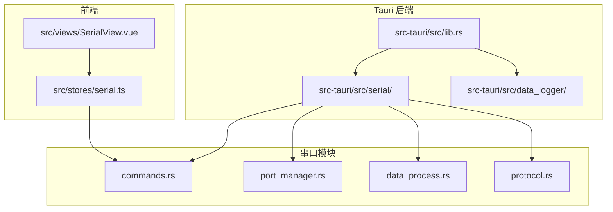
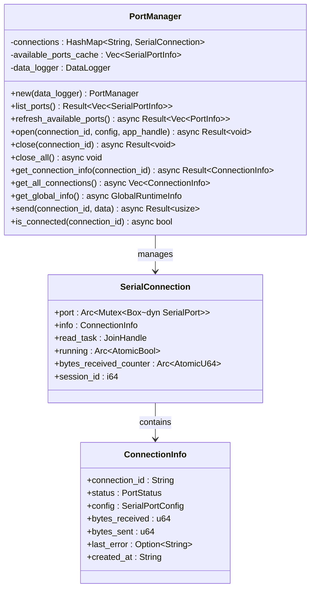
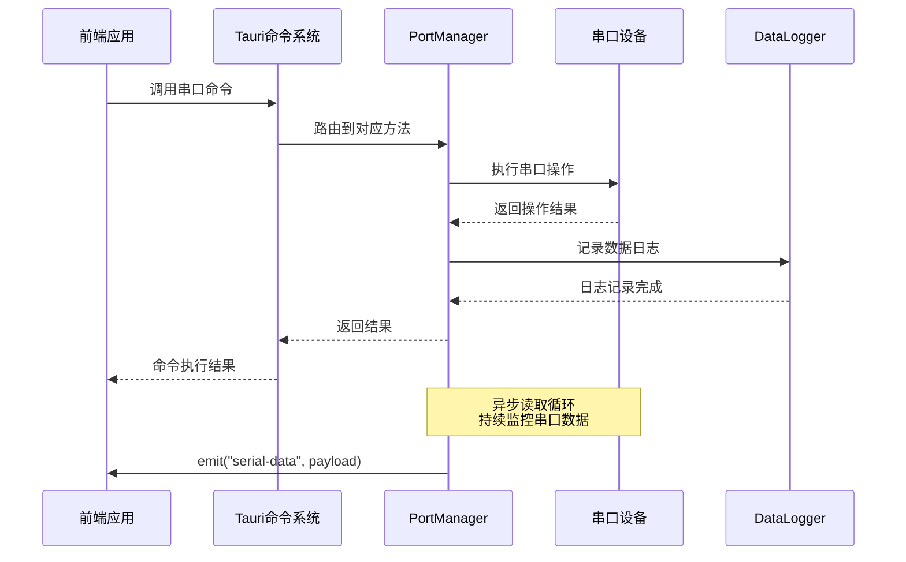
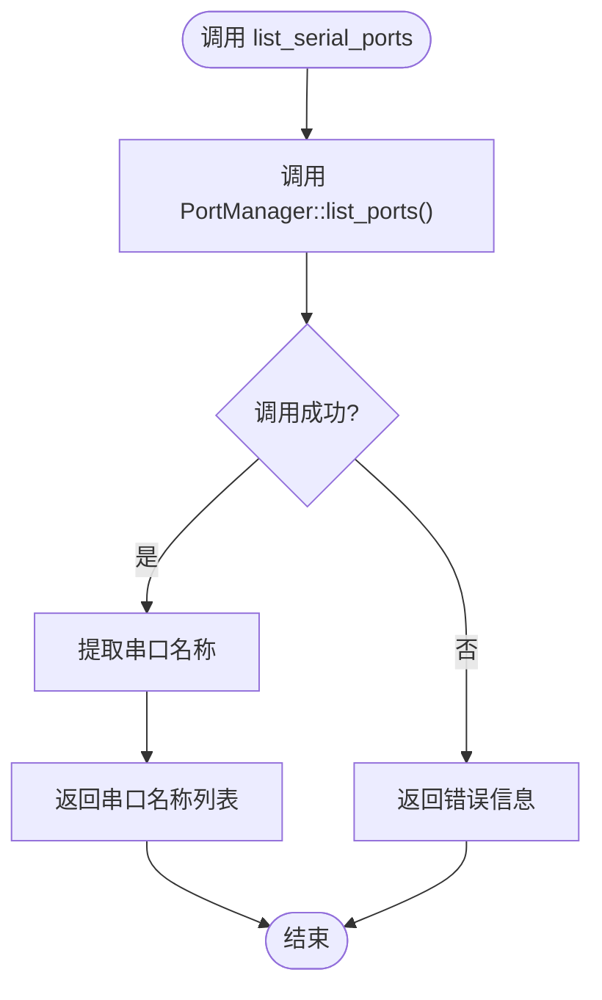
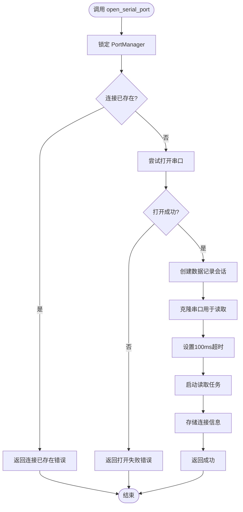
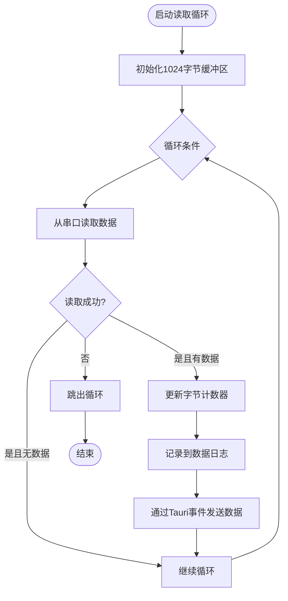
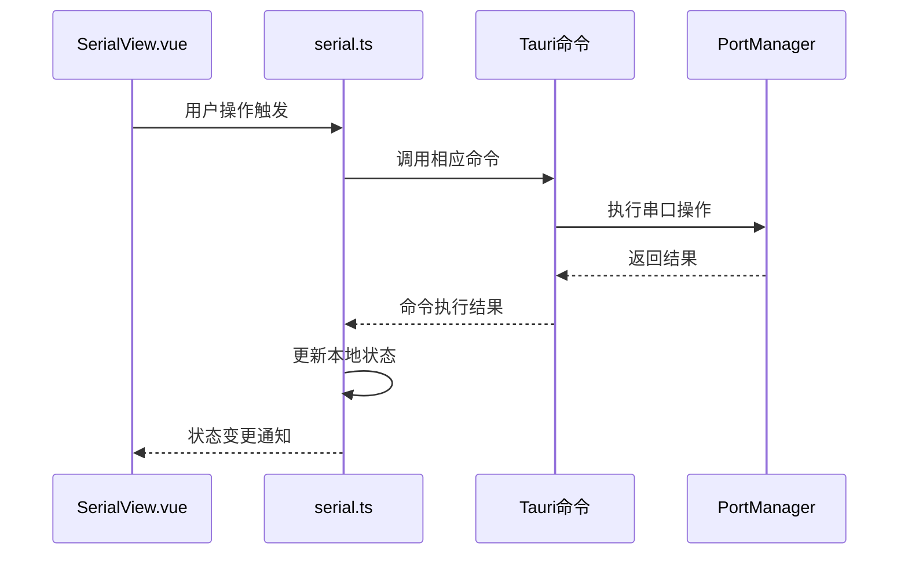
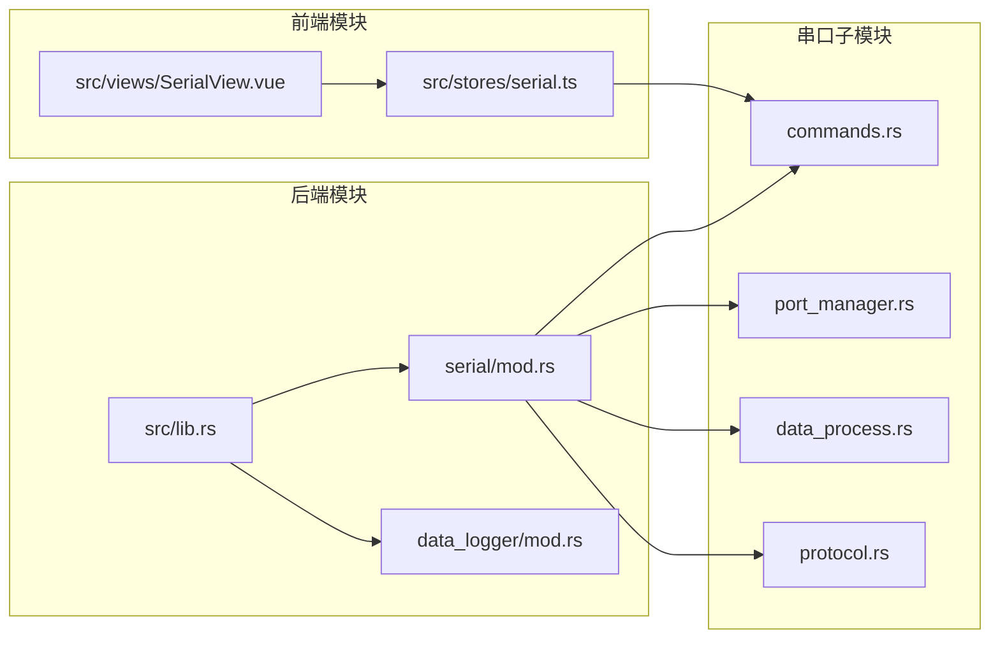

# 串口命令API

<cite>
**本文档引用的文件**
- [commands.rs](file://src-tauri/src/serial/commands.rs)
- [port_manager.rs](file://src-tauri/src/serial/port_manager.rs)
- [lib.rs](file://src-tauri/src/lib.rs)
- [Cargo.toml](file://src-tauri/Cargo.toml)
- [serial.ts](file://src/stores/serial.ts)
- [SerialView.vue](file://src/views/SerialView.vue)
- [data_logger/mod.rs](file://src-tauri/src/data_logger/mod.rs)
- [tauri.conf.json](file://src-tauri/tauri.conf.json)
</cite>

## 目录
1. [简介](#简介)
2. [项目结构](#项目结构)
3. [核心组件](#核心组件)
4. [架构概览](#架构概览)
5. [详细组件分析](#详细组件分析)
6. [依赖关系分析](#依赖关系分析)
7. [性能考虑](#性能考虑)
8. [故障排除指南](#故障排除指南)
9. [结论](#结论)

## 简介

KonSerial 是一个基于 Tauri 的串口调试工具，提供了完整的串口通信命令API。该系统采用 Rust 后端 + Vue 前端的架构设计，通过 Tauri 的命令系统实现了高效的串口通信功能。本文档详细介绍了串口相关的 Tauri 命令API，包括命令的实现细节、参数验证、错误处理、返回值格式以及与 PortManager 的交互流程。

## 项目结构

KonSerial 项目采用模块化的组织方式，串口功能主要集中在 `src-tauri/src/serial/` 目录下：



**图表来源**
- [lib.rs:1-84](file://src-tauri/src/lib.rs#L1-L84)
- [commands.rs:1-129](file://src-tauri/src/serial/commands.rs#L1-L129)

**章节来源**
- [lib.rs:1-84](file://src-tauri/src/lib.rs#L1-L84)
- [Cargo.toml:1-40](file://src-tauri/Cargo.toml#L1-L40)

## 核心组件

### PortManager 管理器

PortManager 是串口管理的核心组件，负责管理多个串口连接、状态跟踪和数据处理：



**图表来源**
- [port_manager.rs:162-401](file://src-tauri/src/serial/port_manager.rs#L162-L401)

### 串口配置结构

系统支持完整的串口配置参数，包括波特率、数据位、停止位、校验位和流控制：

| 参数名称 | 类型 | 默认值 | 描述 |
|---------|------|--------|------|
| port_name | String | 必填 | 串口设备名称（如 COM1、/dev/ttyUSB0） |
| baud_rate | u32 | 115200 | 波特率 |
| data_bits | u8 | 8 | 数据位（5,6,7,8） |
| stop_bits | u8 | 1 | 停止位（1,2） |
| parity | String | "None" | 校验位（"None","Odd","Even"） |
| flow_control | String | "None" | 流控制（"None","Software","Hardware"） |
| timeout_ms | u64 | 100 | 超时时间（毫秒） |

**章节来源**
- [port_manager.rs:17-64](file://src-tauri/src/serial/port_manager.rs#L17-L64)

## 架构概览

KonSerial 采用分层架构设计，实现了前后端分离的通信模式：



**图表来源**
- [commands.rs:15-129](file://src-tauri/src/serial/commands.rs#L15-L129)
- [port_manager.rs:197-303](file://src-tauri/src/serial/port_manager.rs#L197-L303)

## 详细组件分析

### 串口命令API

#### list_serial_ports 命令

列出所有可用的串口设备，返回串口名称数组。

**参数**: 无

**返回值**: 
- 成功: `Vec<String>` - 串口名称列表
- 失败: `String` - 错误信息

**实现流程**:


**图表来源**
- [commands.rs:15-24](file://src-tauri/src/serial/commands.rs#L15-L24)

**章节来源**
- [commands.rs:15-24](file://src-tauri/src/serial/commands.rs#L15-L24)

#### get_serial_ports_info 命令

获取串口详细信息，包括端口类型和硬件信息。

**参数**: 无

**返回值**: `Vec<SerialPortInfoSimple>` - 包含端口名称和类型

**数据结构**:
```rust
struct SerialPortInfoSimple {
    port_name: String,
    port_type: String,
}
```

**章节来源**
- [commands.rs:26-38](file://src-tauri/src/serial/commands.rs#L26-L38)

#### refresh_serial_ports 命令

刷新可用串口列表并返回详细信息。

**参数**: 
- `manager`: `State<Arc<Mutex<PortManager>>>` - PortManager 状态

**返回值**: `Vec<PortInfo>` - 详细的串口信息列表

**章节来源**
- [commands.rs:40-47](file://src-tauri/src/serial/commands.rs#L40-L47)

#### open_serial_port 命令

打开指定的串口连接。

**参数**:
- `app`: `AppHandle` - Tauri 应用句柄
- `manager`: `State<Arc<Mutex<PortManager>>>` - PortManager 状态
- `connection_id`: `String` - 连接标识符
- `config`: `SerialPortConfig` - 串口配置

**返回值**: `Result<(), String>` - 成功或错误信息

**实现流程**:


**图表来源**
- [commands.rs:49-59](file://src-tauri/src/serial/commands.rs#L49-L59)
- [port_manager.rs:197-272](file://src-tauri/src/serial/port_manager.rs#L197-L272)

**章节来源**
- [commands.rs:49-59](file://src-tauri/src/serial/commands.rs#L49-L59)

#### close_serial_port 命令

关闭指定的串口连接。

**参数**:
- `manager`: `State<Arc<Mutex<PortManager>>>` - PortManager 状态
- `connection_id`: `String` - 连接标识符

**返回值**: `Result<(), String>` - 成功或错误信息

**章节来源**
- [commands.rs:61-69](file://src-tauri/src/serial/commands.rs#L61-L69)

#### close_all_serial_ports 命令

关闭所有串口连接。

**参数**:
- `manager`: `State<Arc<Mutex<PortManager>>>` - PortManager 状态

**返回值**: `Result<(), String>` - 成功或错误信息

**章节来源**
- [commands.rs:71-79](file://src-tauri/src/serial/commands.rs#L71-L79)

#### get_connection_info 命令

获取指定连接的详细状态信息。

**参数**:
- `manager`: `State<Arc<Mutex<PortManager>>>` - PortManager 状态
- `connection_id`: `String` - 连接标识符

**返回值**: `Result<ConnectionInfo, String>` - 连接信息或错误

**章节来源**
- [commands.rs:81-89](file://src-tauri/src/serial/commands.rs#L81-L89)

#### get_all_connections 命令

获取所有活跃连接的状态信息。

**参数**:
- `manager`: `State<Arc<Mutex<PortManager>>>` - PortManager 状态

**返回值**: `Result<Vec<ConnectionInfo>, String>` - 连接信息列表

**章节来源**
- [commands.rs:91-98](file://src-tauri/src/serial/commands.rs#L91-L98)

#### get_global_runtime_info 命令

获取全局运行时信息。

**参数**:
- `manager`: `State<Arc<Mutex<PortManager>>>` - PortManager 状态

**返回值**: `Result<GlobalRuntimeInfo, String>` - 全局信息

**章节来源**
- [commands.rs:100-107](file://src-tauri/src/serial/commands.rs#L100-L107)

#### send_serial_data 命令

向指定串口发送数据。

**参数**:
- `manager`: `State<Arc<Mutex<PortManager>>>` - PortManager 状态
- `connection_id`: `String` - 连接标识符
- `data`: `Vec<u8>` - 要发送的字节数组

**返回值**: `Result<usize, String>` - 发送的字节数或错误

**章节来源**
- [commands.rs:109-118](file://src-tauri/src/serial/commands.rs#L109-L118)

#### is_serial_connected 命令

检查指定连接是否已连接。

**参数**:
- `manager`: `State<Arc<Mutex<PortManager>>>` - PortManager 状态
- `connection_id`: `String` - 连接标识符

**返回值**: `Result<bool, String>` - 连接状态

**章节来源**
- [commands.rs:120-129](file://src-tauri/src/serial/commands.rs#L120-L129)

### 数据处理和事件系统

#### 串口数据读取循环

PortManager 内部维护一个独立的读取任务，持续监控串口数据：



**图表来源**
- [port_manager.rs:274-303](file://src-tauri/src/serial/port_manager.rs#L274-L303)

**章节来源**
- [port_manager.rs:274-303](file://src-tauri/src/serial/port_manager.rs#L274-L303)

### 前端集成

#### Vue Store 集成

前端通过 `src/stores/serial.ts` 提供了完整的串口操作封装：



**图表来源**
- [serial.ts:145-221](file://src/stores/serial.ts#L145-L221)

**章节来源**
- [serial.ts:145-221](file://src/stores/serial.ts#L145-L221)

## 依赖关系分析

### 外部依赖

KonSerial 依赖以下关键外部库：

```mermaid
graph TB
subgraph "核心依赖"
A[tauri = "2.x"]
B[serialport = "4.8.1"]
C[tokio = "1.48.0"]
D[rusqlite = "0.31"]
end
subgraph "插件依赖"
E[tauri-plugin-fs]
F[tauri-plugin-dialog]
G[tauri-plugin-clipboard-manager]
H[tauri-plugin-opener]
end
subgraph "工具依赖"
I[serde]
J[chrono]
K[dirs]
L[colored]
end
A --> E
A --> F
A --> G
A --> H
B --> A
C --> A
D --> A
```

**图表来源**
- [Cargo.toml:20-40](file://src-tauri/Cargo.toml#L20-L40)

### 内部模块依赖



**图表来源**
- [lib.rs:1-84](file://src-tauri/src/lib.rs#L1-L84)
- [mod.rs:1-4](file://src-tauri/src/serial/mod.rs#L1-L4)

**章节来源**
- [Cargo.toml:20-40](file://src-tauri/Cargo.toml#L20-L40)

## 性能考虑

### 异步处理策略

1. **Tokio 异步运行时**: 使用 Tokio 提供高性能的异步运行时
2. **互斥锁保护**: 使用 `Arc<Mutex<T>>` 保护共享状态
3. **原子操作**: 使用原子类型进行计数器操作，避免锁竞争

### 内存管理

1. **缓冲区管理**: 读取循环使用固定大小的缓冲区（1024字节）
2. **连接池**: 支持多连接并发管理
3. **内存泄漏防护**: 使用 RAII 和智能指针管理资源

### I/O 优化

1. **非阻塞读取**: 设置串口超时时间为100ms，确保及时响应关闭信号
2. **批量写入**: 支持批量数据发送，减少系统调用次数
3. **事件驱动**: 使用事件系统异步推送数据，避免轮询

## 故障排除指南

### 常见错误类型

| 错误类型 | 触发条件 | 解决方案 |
|---------|---------|---------|
| 连接已存在 | 同一 connection_id 已存在 | 生成新的连接ID或关闭现有连接 |
| 打开失败 | 串口被占用或权限不足 | 检查串口占用情况和用户权限 |
| 连接不存在 | 操作不存在的连接ID | 确认连接ID正确性和连接状态 |
| 读取超时 | 串口长时间无数据 | 检查硬件连接和波特率设置 |

### 错误处理机制

1. **统一错误包装**: 所有错误都转换为 `String` 类型返回
2. **状态追踪**: 连接状态包含最后错误信息
3. **日志记录**: 使用 `log_info!` 和 `log_error!` 宏记录详细信息

### 资源清理

1. **连接关闭**: 自动终止读取任务并清理会话
2. **内存释放**: 使用智能指针确保资源自动释放
3. **文件句柄**: 数据库连接在应用退出时自动关闭

**章节来源**
- [port_manager.rs:305-331](file://src-tauri/src/serial/port_manager.rs#L305-L331)

## 结论

KonSerial 的串口命令API提供了完整、高效且易于使用的串口通信解决方案。通过合理的架构设计和完善的错误处理机制，该系统能够满足各种串口调试需求。主要特点包括：

1. **模块化设计**: 清晰的模块划分便于维护和扩展
2. **异步处理**: 高效的异步I/O处理能力
3. **状态管理**: 完善的连接状态跟踪和事件通知
4. **数据持久化**: 基于 SQLite 的数据记录和查询功能
5. **前端集成**: 无缝的Vue前端集成体验

该API为开发者提供了可靠的基础，可以在此基础上构建更复杂的串口通信应用。