# 串口管理器

<cite>
**本文档引用的文件**
- [port_manager.rs](file://src-tauri/src/serial/port_manager.rs)
- [commands.rs](file://src-tauri/src/serial/commands.rs)
- [mod.rs](file://src-tauri/src/serial/mod.rs)
- [lib.rs](file://src-tauri/src/lib.rs)
- [serial.ts](file://src/stores/serial.ts)
- [mod.rs](file://src-tauri/src/data_logger/mod.rs)
- [logger.rs](file://src-tauri/src/utils/logger.rs)
- [Cargo.toml](file://src-tauri/Cargo.toml)
- [README.md](file://README.md)
- [DESIGN.md](file://DESIGN.md)
</cite>

## 目录
1. [简介](#简介)
2. [项目结构](#项目结构)
3. [核心组件](#核心组件)
4. [架构概览](#架构概览)
5. [详细组件分析](#详细组件分析)
6. [依赖关系分析](#依赖关系分析)
7. [性能考量](#性能考量)
8. [故障排除指南](#故障排除指南)
9. [结论](#结论)

## 简介

KonSerial 是一款基于 Tauri + Vue3 和 Rust + TypeScript 构建的现代化、轻量化的串口调试工具。本文档专注于串口管理器的核心设计，深入解释 PortManager 的多串口连接管理、连接状态跟踪和并发控制机制，以及 SerialPortConfig 配置结构的设计理念。

该串口管理器采用前后端分离架构，后端使用 Rust + Tauri 提供高性能的串口通信能力，前端使用 Vue3 + TypeScript 提供现代化的用户界面。系统支持多串口同时管理、数据持久化、波形显示等多种功能。

## 项目结构

KonSerial 项目采用清晰的模块化组织结构：

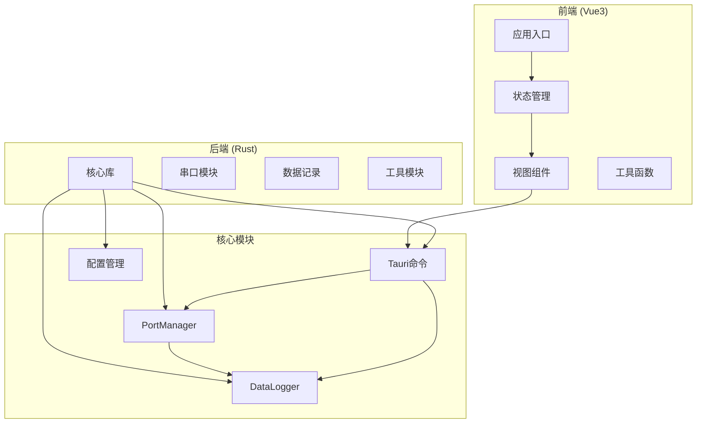

**图表来源**
- [mod.rs:1-4](file://src-tauri/src/serial/mod.rs#L1-L4)
- [lib.rs:1-84](file://src-tauri/src/lib.rs#L1-L84)

**章节来源**
- [README.md:1-127](file://README.md#L1-L127)
- [DESIGN.md:34-139](file://DESIGN.md#L34-L139)

## 核心组件

串口管理器系统由以下几个核心组件构成：

### 1. PortManager - 主要管理器
- 负责多串口连接的生命周期管理
- 维护连接状态和运行时信息
- 处理并发控制和线程安全

### 2. SerialPortConfig - 配置结构
- 完整的串口参数配置
- 支持波特率、数据位、停止位、校验位等
- 提供与底层串口库的参数映射

### 3. SerialConnection - 连接实体
- 封装单个串口连接的所有信息
- 包含串口实例、运行状态、读取任务等
- 管理计数器和会话标识

### 4. GlobalRuntimeInfo - 全局状态
- 提供系统级的运行时信息
- 包含所有可用串口和活跃连接状态
- 支持前端状态同步

**章节来源**
- [port_manager.rs:16-171](file://src-tauri/src/serial/port_manager.rs#L16-L171)
- [commands.rs:1-129](file://src-tauri/src/serial/commands.rs#L1-L129)

## 架构概览

串口管理器采用分层架构设计，确保了良好的可维护性和扩展性：

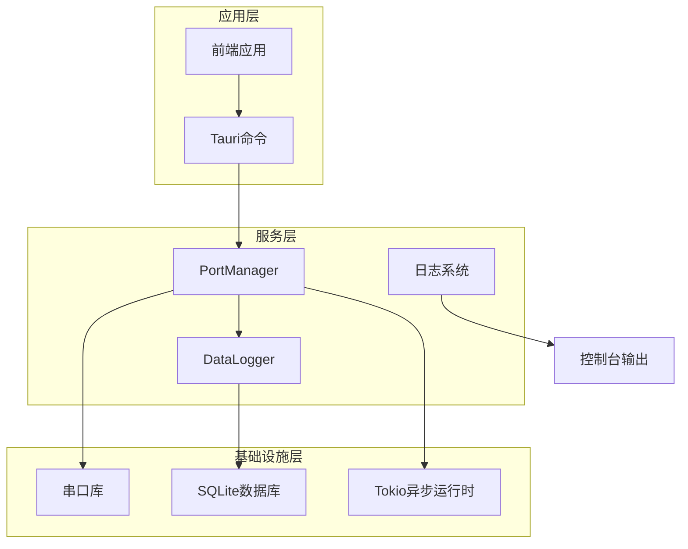

**图表来源**
- [lib.rs:25-84](file://src-tauri/src/lib.rs#L25-L84)
- [Cargo.toml:20-36](file://src-tauri/Cargo.toml#L20-L36)

### 数据流架构

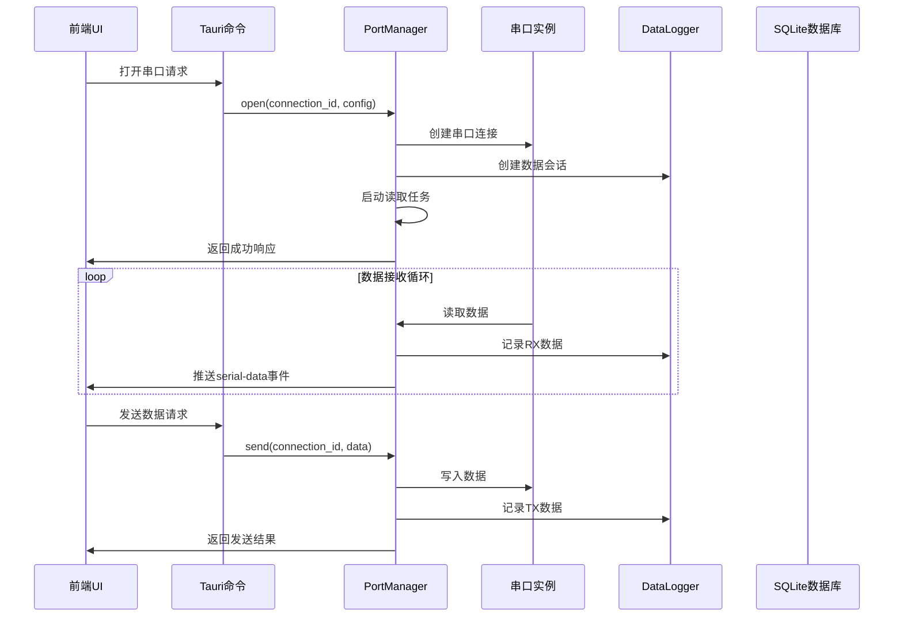

**图表来源**
- [port_manager.rs:196-303](file://src-tauri/src/serial/port_manager.rs#L196-L303)
- [commands.rs:49-118](file://src-tauri/src/serial/commands.rs#L49-L118)

## 详细组件分析

### PortManager - 多串口连接管理器

PortManager 是串口管理器的核心组件，负责管理多个串口连接的完整生命周期：

#### 核心数据结构

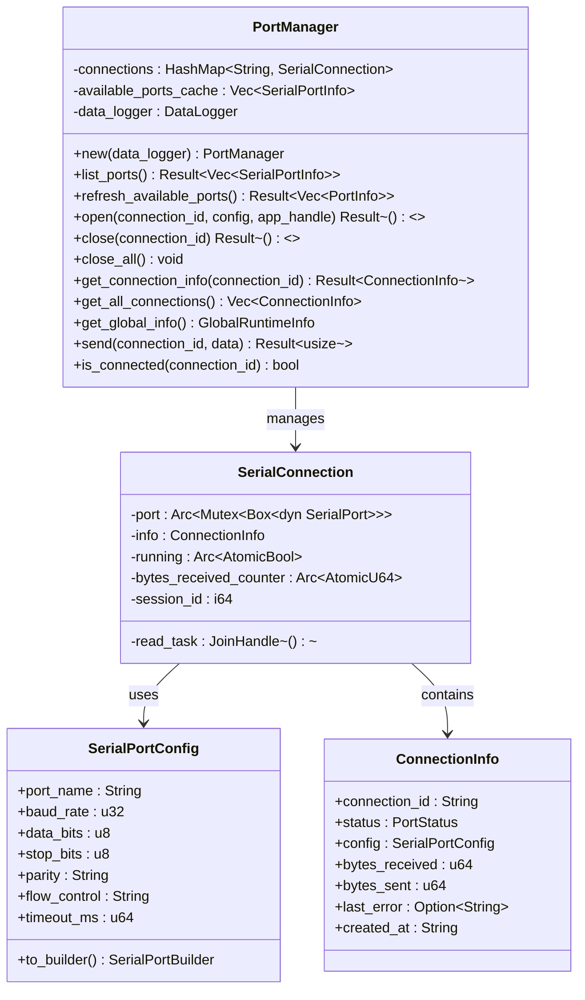

**图表来源**
- [port_manager.rs:161-171](file://src-tauri/src/serial/port_manager.rs#L161-L171)
- [port_manager.rs:96-104](file://src-tauri/src/serial/port_manager.rs#L96-L104)
- [port_manager.rs:17-64](file://src-tauri/src/serial/port_manager.rs#L17-L64)

#### 并发控制机制

PortManager 采用了多层次的并发控制策略：

1. **读写锁保护**: 使用 `Arc<RwLock<HashMap<...>>>` 保护连接映射
2. **原子操作**: 使用 `Arc<AtomicBool>` 和 `Arc<AtomicU64>` 管理运行状态和计数器
3. **互斥锁**: 使用 `Arc<Mutex<Box<dyn SerialPort>>>` 保护串口实例
4. **Tokio任务**: 使用独立的任务处理串口读取操作

#### 连接生命周期管理

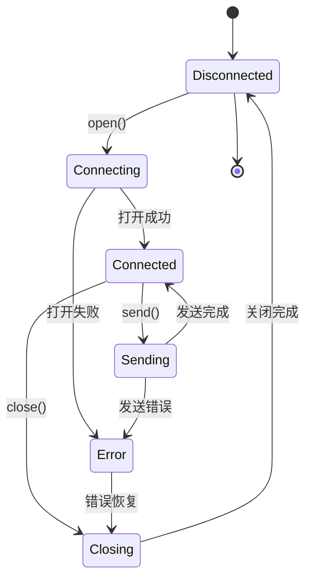

**图表来源**
- [port_manager.rs:68-75](file://src-tauri/src/serial/port_manager.rs#L68-L75)
- [port_manager.rs:196-303](file://src-tauri/src/serial/port_manager.rs#L196-L303)

**章节来源**
- [port_manager.rs:173-401](file://src-tauri/src/serial/port_manager.rs#L173-L401)

### SerialPortConfig - 配置结构设计

SerialPortConfig 是串口配置的核心数据结构，设计遵循以下原则：

#### 参数映射关系

| 配置项 | Rust类型 | 对应串口库 | 有效值范围 |
|--------|----------|------------|------------|
| port_name | String | SerialPortInfo.port_name | 系统串口名称 |
| baud_rate | u32 | SerialPortBuilder.baud_rate | 1-1000000 |
| data_bits | u8 | DataBits | 5, 6, 7, 8 |
| stop_bits | u8 | StopBits | 1, 2 |
| parity | String | Parity | "None", "Odd", "Even" |
| flow_control | String | FlowControl | "None", "Software", "Hardware" |
| timeout_ms | u64 | timeout | 0-∞ |

#### 转换机制

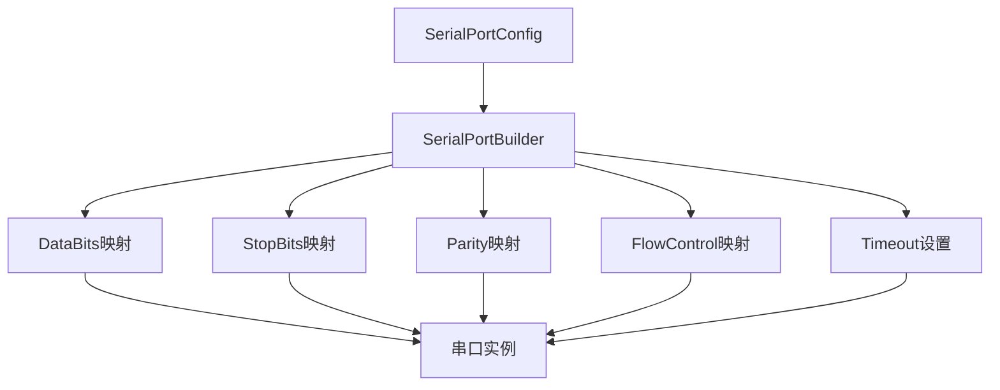

**图表来源**
- [port_manager.rs:28-63](file://src-tauri/src/serial/port_manager.rs#L28-L63)

**章节来源**
- [port_manager.rs:17-64](file://src-tauri/src/serial/port_manager.rs#L17-L64)

### SerialConnection - 内部结构组成

SerialConnection 是单个串口连接的完整封装，包含以下关键组件：

#### 核心组件职责

1. **串口实例**: `Arc<Mutex<Box<dyn SerialPort>>>`
   - 线程安全的串口访问
   - 支持并发读写操作
   
2. **运行状态**: `Arc<AtomicBool>`
   - 控制读取任务的生命周期
   - 支持优雅关闭
   
3. **读取任务**: `tokio::task::JoinHandle<()>`
   - 独立的Tokio任务处理串口读取
   - 使用spawn_blocking避免阻塞异步运行时
   
4. **计数器管理**: `Arc<AtomicU64>`
   - 原子性的字节数统计
   - 支持高并发下的准确计数

#### 内存管理策略

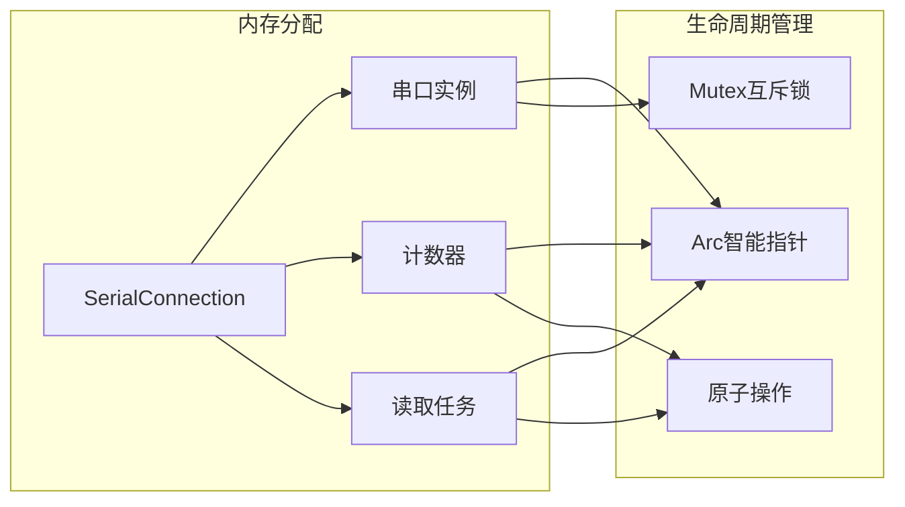

**图表来源**
- [port_manager.rs:96-104](file://src-tauri/src/serial/port_manager.rs#L96-L104)

**章节来源**
- [port_manager.rs:96-104](file://src-tauri/src/serial/port_manager.rs#L96-L104)

### GlobalRuntimeInfo - 全局运行时信息

GlobalRuntimeInfo 提供系统级的运行时状态，支持前端的实时状态同步：

#### 数据结构设计

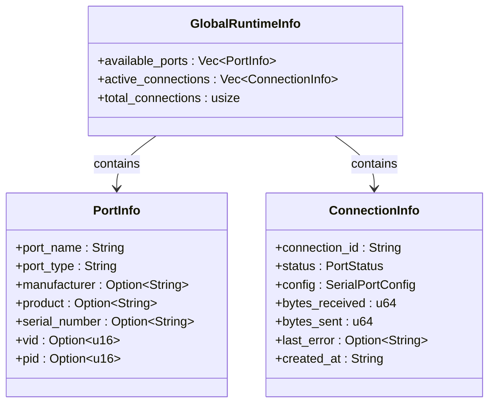

**图表来源**
- [port_manager.rs:106-124](file://src-tauri/src/serial/port_manager.rs#L106-L124)
- [port_manager.rs:77-87](file://src-tauri/src/serial/port_manager.rs#L77-L87)

**章节来源**
- [port_manager.rs:106-157](file://src-tauri/src/serial/port_manager.rs#L106-L157)

### 数据持久化 - DataLogger

DataLogger 负责串口数据的持久化存储，基于 SQLite 实现：

#### 数据模型

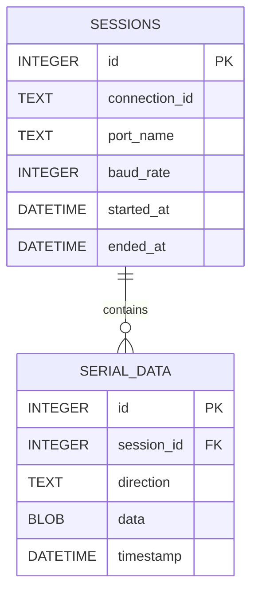

**图表来源**
- [mod.rs:84-106](file://src-tauri/src/data_logger/mod.rs#L84-L106)

**章节来源**
- [mod.rs:47-273](file://src-tauri/src/data_logger/mod.rs#L47-L273)

## 依赖关系分析

串口管理器的依赖关系体现了清晰的分层架构：

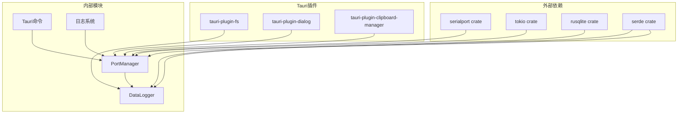

**图表来源**
- [Cargo.toml:20-36](file://src-tauri/Cargo.toml#L20-L36)
- [lib.rs:47-84](file://src-tauri/src/lib.rs#L47-L84)

### 前后端交互

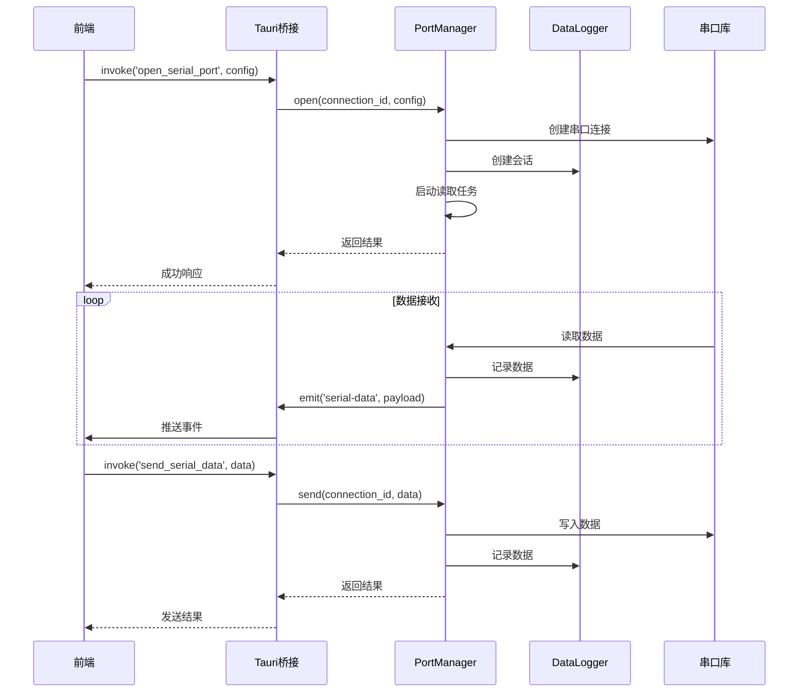

**图表来源**
- [commands.rs:49-118](file://src-tauri/src/serial/commands.rs#L49-L118)
- [port_manager.rs:274-303](file://src-tauri/src/serial/port_manager.rs#L274-L303)

**章节来源**
- [commands.rs:1-129](file://src-tauri/src/serial/commands.rs#L1-L129)
- [lib.rs:56-80](file://src-tauri/src/lib.rs#L56-L80)

## 性能考量

### 并发性能优化

1. **异步I/O处理**: 使用 Tokio 异步运行时处理串口读取，避免阻塞主线程
2. **原子操作**: 使用原子类型进行计数器操作，减少锁竞争
3. **内存池**: 重用缓冲区，减少内存分配开销
4. **批量操作**: 支持批量数据发送和接收

### 内存管理策略

1. **Arc智能指针**: 共享所有权，避免不必要的数据复制
2. **懒加载**: 延迟初始化昂贵的资源
3. **缓存机制**: 缓存可用串口列表，减少系统调用
4. **任务隔离**: 独立的任务处理串口读取，避免相互影响

### 错误处理机制

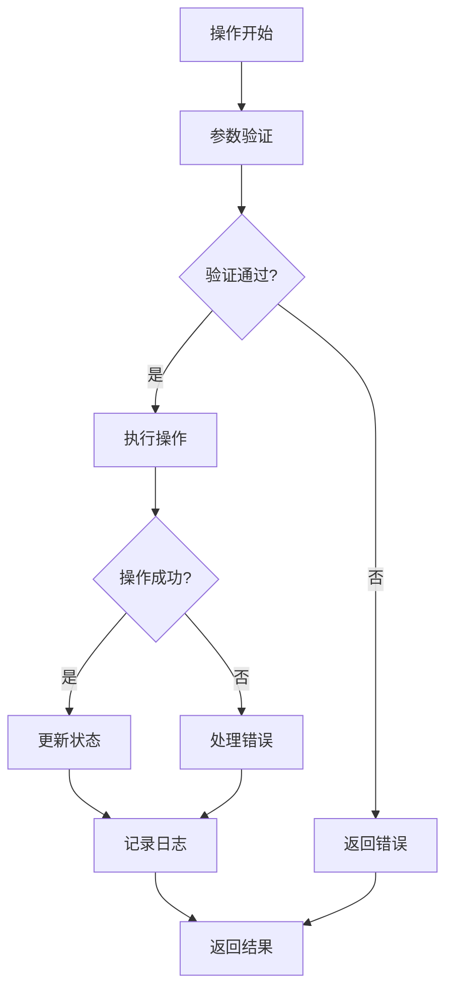

**图表来源**
- [port_manager.rs:206-271](file://src-tauri/src/serial/port_manager.rs#L206-L271)

## 故障排除指南

### 常见问题诊断

#### 串口打开失败
- **原因**: 串口被其他程序占用
- **解决方案**: 检查串口使用情况，关闭其他应用程序

#### 读取超时
- **原因**: 串口配置不匹配或硬件问题
- **解决方案**: 检查波特率、数据位、停止位配置

#### 内存泄漏
- **症状**: 应用程序内存持续增长
- **排查**: 检查连接关闭是否正确执行

### 调试工具

1. **日志系统**: 使用自定义日志宏记录详细信息
2. **状态监控**: 通过全局运行时信息监控系统状态
3. **连接检查**: 定期检查连接状态和计数器

**章节来源**
- [logger.rs:85-131](file://src-tauri/src/utils/logger.rs#L85-L131)
- [port_manager.rs:356-367](file://src-tauri/src/serial/port_manager.rs#L356-L367)

## 结论

KonSerial 的串口管理器展现了现代串口调试工具的设计理念和技术实现。通过精心设计的架构，系统实现了：

1. **高性能并发**: 采用异步编程和原子操作确保高并发场景下的稳定性
2. **完整的生命周期管理**: 从连接创建到销毁的全流程管理
3. **可靠的数据持久化**: 基于 SQLite 的数据记录和查询能力
4. **良好的用户体验**: 前后端分离架构提供流畅的用户交互

该系统为串口调试工具提供了坚实的技术基础，支持进一步的功能扩展和性能优化。通过模块化的架构设计，开发者可以轻松地添加新功能或改进现有功能。