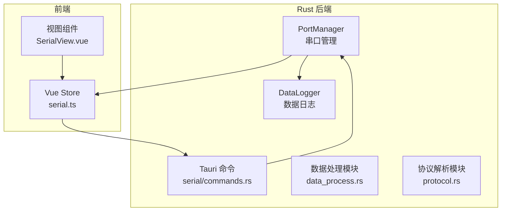
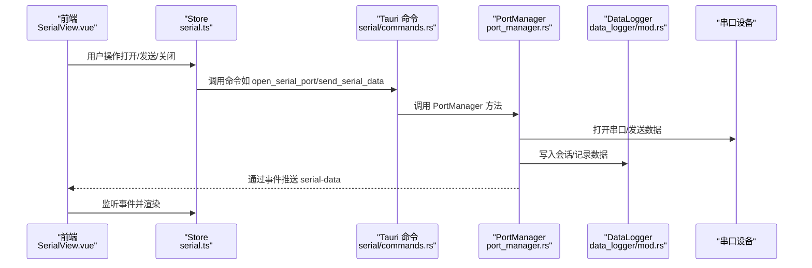
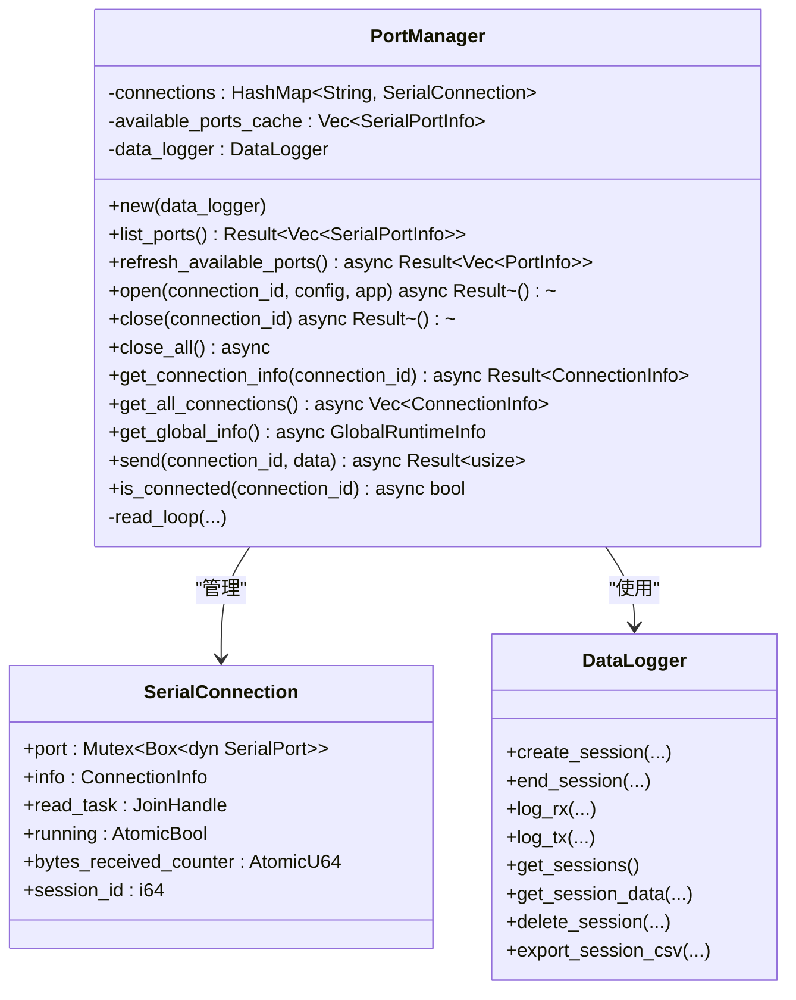
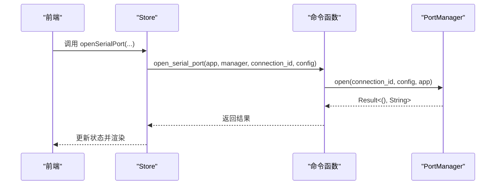
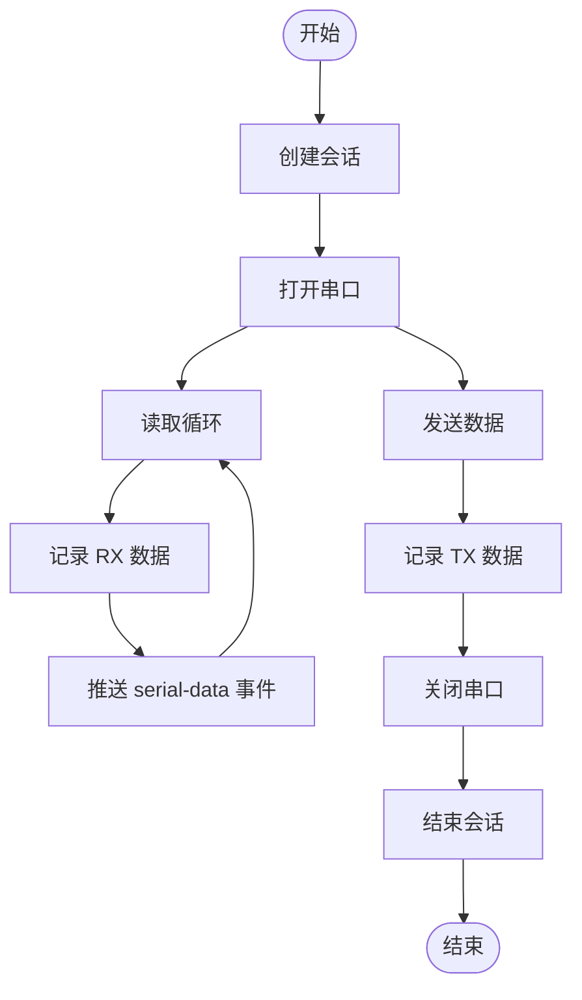
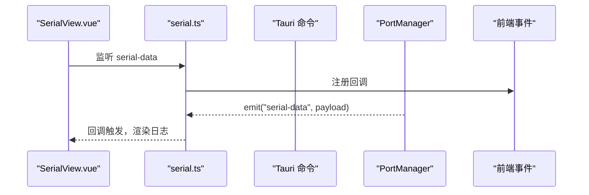
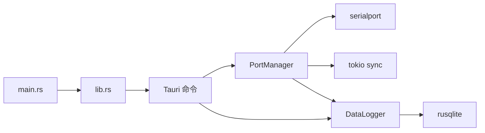

# 串口通信模块

<cite>
**本文档引用的文件**
- [src-tauri/src/serial/mod.rs](file://src-tauri/src/serial/mod.rs)
- [src-tauri/src/serial/port_manager.rs](file://src-tauri/src/serial/port_manager.rs)
- [src-tauri/src/serial/commands.rs](file://src-tauri/src/serial/commands.rs)
- [src-tauri/src/serial/data_process.rs](file://src-tauri/src/serial/data_process.rs)
- [src-tauri/src/serial/protocol.rs](file://src-tauri/src/serial/protocol.rs)
- [src-tauri/src/lib.rs](file://src-tauri/src/lib.rs)
- [src-tauri/src/main.rs](file://src-tauri/src/main.rs)
- [src-tauri/src/data_logger/mod.rs](file://src-tauri/src/data_logger/mod.rs)
- [src-tauri/src/data_logger/commands.rs](file://src-tauri/src/data_logger/commands.rs)
- [src-tauri/Cargo.toml](file://src-tauri/Cargo.toml)
- [src/stores/serial.ts](file://src/stores/serial.ts)
- [src/views/SerialView.vue](file://src/views/SerialView.vue)
</cite>

## 目录
1. [简介](#简介)
2. [项目结构](#项目结构)
3. [核心组件](#核心组件)
4. [架构总览](#架构总览)
5. [详细组件分析](#详细组件分析)
6. [依赖关系分析](#依赖关系分析)
7. [性能考虑](#性能考虑)
8. [故障排查指南](#故障排查指南)
9. [结论](#结论)
10. [附录](#附录)

## 简介
本文件为 KonSerial 串口通信模块的全面技术文档，重点覆盖以下方面：
- PortManager 的设计与实现：多串口连接管理、连接状态监控、并发控制机制
- 串口数据的读取、写入与处理流程：数据缓冲、格式转换、协议解析
- commands.rs 中 Tauri 命令的实现：串口列表获取、连接建立、数据发送、连接状态查询
- 数据处理模块与协议解析器的实现要点
- 错误处理策略、超时机制与重连逻辑
- 性能优化建议与最佳实践

## 项目结构
KonSerial 的串口通信模块位于 Rust 后端的 src-tauri 子目录中，采用“功能域”组织方式，核心模块包括：
- serial：串口管理、命令接口、数据处理与协议解析
- data_logger：串口数据持久化（SQLite）
- 前端 Vue Store 与视图层负责 UI 交互与事件监听

图表来源
- [src-tauri/src/serial/mod.rs:1-4](file://src-tauri/src/serial/mod.rs#L1-L4)
- [src-tauri/src/serial/port_manager.rs:161-171](file://src-tauri/src/serial/port_manager.rs#L161-L171)
- [src-tauri/src/serial/commands.rs:1-129](file://src-tauri/src/serial/commands.rs#L1-L129)
- [src-tauri/src/data_logger/mod.rs:47-50](file://src-tauri/src/data_logger/mod.rs#L47-L50)
- [src/stores/serial.ts:1-363](file://src/stores/serial.ts#L1-L363)
- [src/views/SerialView.vue:1-746](file://src/views/SerialView.vue#L1-L746)

章节来源
- [src-tauri/src/serial/mod.rs:1-4](file://src-tauri/src/serial/mod.rs#L1-L4)
- [src-tauri/src/serial/port_manager.rs:161-171](file://src-tauri/src/serial/port_manager.rs#L161-L171)
- [src-tauri/src/serial/commands.rs:1-129](file://src-tauri/src/serial/commands.rs#L1-L129)
- [src-tauri/src/data_logger/mod.rs:47-50](file://src-tauri/src/data_logger/mod.rs#L47-L50)
- [src/stores/serial.ts:1-363](file://src/stores/serial.ts#L1-L363)
- [src/views/SerialView.vue:1-746](file://src/views/SerialView.vue#L1-L746)

## 核心组件
- PortManager：多连接串口管理器，负责串口打开/关闭、读取循环、发送、状态查询与全局信息聚合
- DataLogger：基于 SQLite 的数据持久化，支持会话管理、数据记录、查询与导出
- Tauri 命令：提供串口列表、打开/关闭、发送、状态查询等命令接口
- 前端 Store/视图：负责 UI 交互、事件监听、数据展示与发送

章节来源
- [src-tauri/src/serial/port_manager.rs:161-401](file://src-tauri/src/serial/port_manager.rs#L161-L401)
- [src-tauri/src/data_logger/mod.rs:47-273](file://src-tauri/src/data_logger/mod.rs#L47-L273)
- [src-tauri/src/serial/commands.rs:15-129](file://src-tauri/src/serial/commands.rs#L15-L129)
- [src/stores/serial.ts:1-363](file://src/stores/serial.ts#L1-L363)

## 架构总览
后端通过 Tauri 将 Rust 与前端 Vue 连接，PortManager 在后台线程中执行串口读取，实时通过事件推送数据到前端；DataLogger 负责数据持久化。

图表来源
- [src-tauri/src/serial/commands.rs:49-129](file://src-tauri/src/serial/commands.rs#L49-L129)
- [src-tauri/src/serial/port_manager.rs:196-392](file://src-tauri/src/serial/port_manager.rs#L196-L392)
- [src-tauri/src/data_logger/mod.rs:115-164](file://src-tauri/src/data_logger/mod.rs#L115-L164)
- [src/stores/serial.ts:297-333](file://src/stores/serial.ts#L297-L333)

## 详细组件分析

### PortManager 设计与实现
PortManager 是串口通信的核心，负责：
- 多连接管理：以 connection_id 为键维护连接集合
- 并发控制：使用 Arc<Mutex> 和 Arc<RwLock> 管理共享状态
- 读取循环：独立线程中循环读取，使用短超时确保可中断
- 数据持久化：通过 DataLogger 记录 TX/RX
- 状态监控：维护 bytes_received/bytes_sent、last_error、created_at 等

关键数据结构与方法：
- SerialPortConfig：完整串口配置，支持转换为 serialport::SerialPortBuilder
- PortStatus：连接状态枚举（Disconnected/Connecting/Connected/Error)
- ConnectionInfo：单连接运行时信息
- SerialConnection：内部连接对象，包含串口句柄、读取任务、计数器等
- GlobalRuntimeInfo：全局运行时信息（可用端口、活跃连接、总数）

读取循环与发送流程：
- 读取循环：固定缓冲区大小，按需持久化 RX 数据并通过事件推送
- 发送：加锁访问串口，记录 TX 数据并返回发送字节数或错误

图表来源
- [src-tauri/src/serial/port_manager.rs:161-401](file://src-tauri/src/serial/port_manager.rs#L161-L401)
- [src-tauri/src/data_logger/mod.rs:47-273](file://src-tauri/src/data_logger/mod.rs#L47-L273)

章节来源
- [src-tauri/src/serial/port_manager.rs:161-401](file://src-tauri/src/serial/port_manager.rs#L161-L401)

### Tauri 命令实现（commands.rs）
commands.rs 提供了完整的串口命令接口，均通过 State<Arc<Mutex<PortManager>>> 获取 PortManager 实例，并进行异步操作：
- 列出串口：返回端口名或详细信息
- 刷新串口列表：返回 PortInfo 列表
- 打开串口：传入 SerialPortConfig 与 connection_id
- 关闭串口/全部关闭：释放资源并结束会话
- 获取连接信息/全部连接：查询运行时状态
- 发送数据：将字节发送至指定连接
- 连接状态查询：判断是否已连接

图表来源
- [src-tauri/src/serial/commands.rs:49-59](file://src-tauri/src/serial/commands.rs#L49-L59)
- [src-tauri/src/serial/port_manager.rs:196-272](file://src-tauri/src/serial/port_manager.rs#L196-L272)

章节来源
- [src-tauri/src/serial/commands.rs:15-129](file://src-tauri/src/serial/commands.rs#L15-L129)

### 数据处理与协议解析模块
- data_process.rs：声明数据处理模块职责（解析、格式转换、缓冲管理），当前为空实现，预留扩展点
- protocol.rs：声明协议解析模块职责（多种通信协议的解析与封装），当前为空实现，预留扩展点

章节来源
- [src-tauri/src/serial/data_process.rs:1-2](file://src-tauri/src/serial/data_process.rs#L1-L2)
- [src-tauri/src/serial/protocol.rs:1-2](file://src-tauri/src/serial/protocol.rs#L1-L2)

### 数据持久化（DataLogger）
DataLogger 基于 SQLite 实现，提供：
- 会话管理：创建/结束会话，关联 connection_id、端口名、波特率
- 数据记录：RX/TX 数据持久化，带时间戳
- 查询接口：会话列表、会话内数据分页查询
- 删除与导出：删除会话及数据，导出 CSV

图表来源
- [src-tauri/src/serial/port_manager.rs:274-303](file://src-tauri/src/serial/port_manager.rs#L274-L303)
- [src-tauri/src/data_logger/mod.rs:115-164](file://src-tauri/src/data_logger/mod.rs#L115-L164)

章节来源
- [src-tauri/src/data_logger/mod.rs:47-273](file://src-tauri/src/data_logger/mod.rs#L47-L273)

### 前端集成与事件监听
前端通过 Store 封装 Tauri 调用与事件监听：
- Store 提供刷新串口、打开/关闭连接、发送数据、状态轮询等方法
- 事件监听 serial-data：接收后端推送的原始字节，交由组件按编码解码显示
- 视图组件 SerialView.vue：负责 UI 布局、输入处理、日志渲染与统计展示

图表来源
- [src/stores/serial.ts:297-333](file://src/stores/serial.ts#L297-L333)
- [src/views/SerialView.vue:234-253](file://src/views/SerialView.vue#L234-L253)

章节来源
- [src/stores/serial.ts:1-363](file://src/stores/serial.ts#L1-L363)
- [src/views/SerialView.vue:1-746](file://src/views/SerialView.vue#L1-L746)

## 依赖关系分析
- PortManager 依赖 serialport 库进行串口操作，依赖 tokio 的 Mutex/RwLock 进行并发控制
- DataLogger 依赖 rusqlite 进行 SQLite 操作，启用 WAL 模式与外键约束
- Tauri 命令通过 State 注入 PortManager 与 DataLogger，统一注册到 Builder.invoke_handler
- 前端通过 @tauri-apps/api 调用命令并监听事件

图表来源
- [src-tauri/Cargo.toml:20-36](file://src-tauri/Cargo.toml#L20-L36)
- [src-tauri/src/lib.rs:42-55](file://src-tauri/src/lib.rs#L42-L55)

章节来源
- [src-tauri/Cargo.toml:1-40](file://src-tauri/Cargo.toml#L1-L40)
- [src-tauri/src/lib.rs:10-55](file://src-tauri/src/lib.rs#L10-L55)

## 性能考虑
- 读取缓冲与超时：读取循环使用固定大小缓冲与短超时，确保及时响应关闭信号
- 并发模型：使用 Arc<Mutex/_> 与 RwLock 管理共享状态，避免频繁锁竞争
- 异步发送：发送操作在持有锁的情况下进行，减少上下文切换
- 数据持久化：SQLite 使用 WAL 模式与外键约束，提升并发与一致性
- 前端渲染：日志缓冲区限制长度，避免内存膨胀
- 建议优化：
  - 根据波特率调整读取缓冲大小与超时
  - 对高频事件（如大量 RX）考虑批量处理或去抖
  - 使用更细粒度的锁或无锁数据结构（如原子计数器）进一步降低锁开销
  - 对 SQLite 写入进行批量化或异步队列

[本节为通用性能指导，不直接分析具体文件]

## 故障排查指南
- 打开串口失败：检查端口占用、权限与配置参数（波特率、数据位、停止位、校验、流控）
- 读取超时：确认串口设备是否正常工作，适当调整超时参数
- 发送错误：查看 last_error 字段，定位具体错误原因
- 事件未到达：确认前端已注册 serial-data 事件监听，检查 Store 的监听生命周期
- 数据未持久化：确认 DataLogger 初始化成功，数据库路径可写

章节来源
- [src-tauri/src/serial/port_manager.rs:266-271](file://src-tauri/src/serial/port_manager.rs#L266-L271)
- [src-tauri/src/serial/port_manager.rs:298-301](file://src-tauri/src/serial/port_manager.rs#L298-L301)
- [src-tauri/src/data_logger/mod.rs:115-164](file://src-tauri/src/data_logger/mod.rs#L115-L164)
- [src/stores/serial.ts:297-333](file://src/stores/serial.ts#L297-L333)

## 结论
KonSerial 的串口通信模块以 PortManager 为核心，结合 DataLogger 实现了可靠的多连接管理、并发控制与数据持久化。Tauri 命令层提供了清晰的接口，前端通过 Store 与事件实现良好的用户体验。模块目前在数据处理与协议解析方面预留扩展点，便于后续增强。

[本节为总结性内容，不直接分析具体文件]

## 附录
- 后端入口：lib.rs 中初始化日志、配置、DataLogger 与 PortManager，并注册所有命令
- 主程序入口：main.rs 调用 lib.rs::run
- 依赖清单：Cargo.toml 中列出 serialport、tokio、rusqlite 等关键依赖

章节来源
- [src-tauri/src/lib.rs:24-84](file://src-tauri/src/lib.rs#L24-L84)
- [src-tauri/src/main.rs:1-7](file://src-tauri/src/main.rs#L1-L7)
- [src-tauri/Cargo.toml:20-36](file://src-tauri/Cargo.toml#L20-L36)