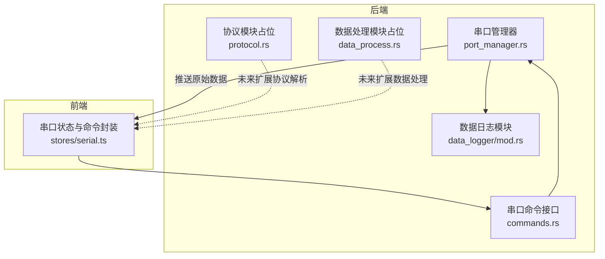
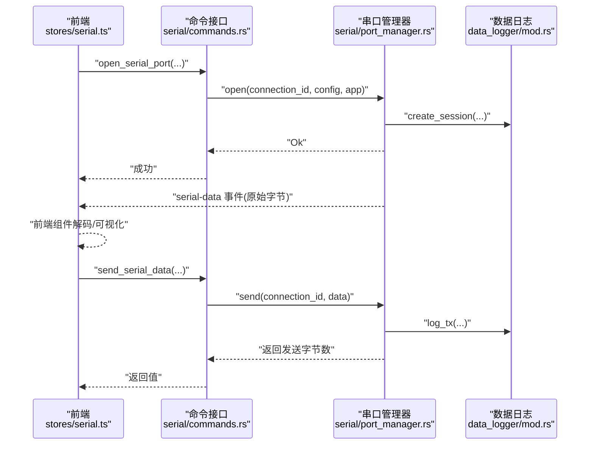
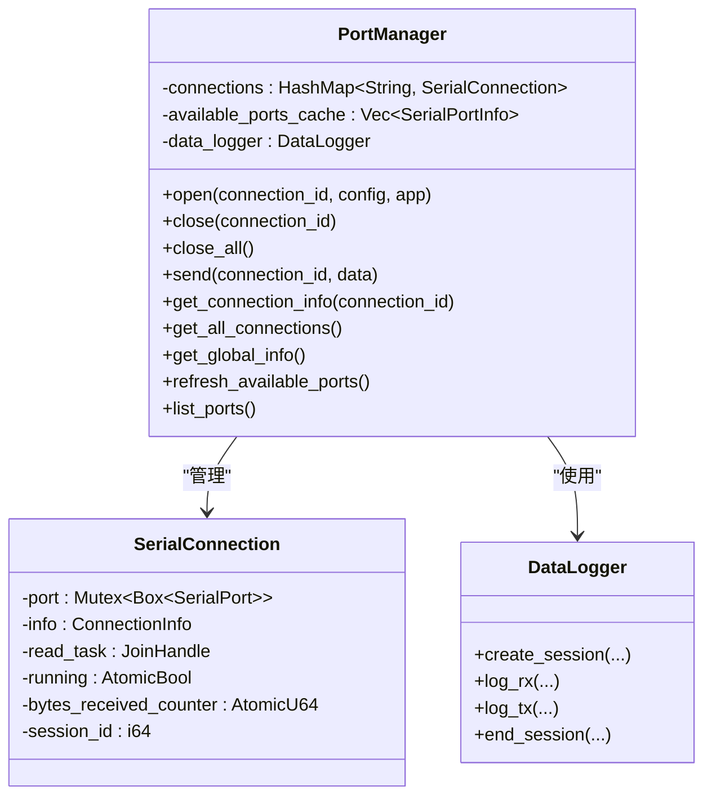
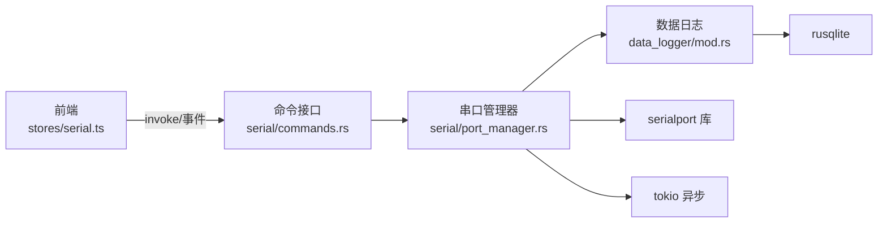
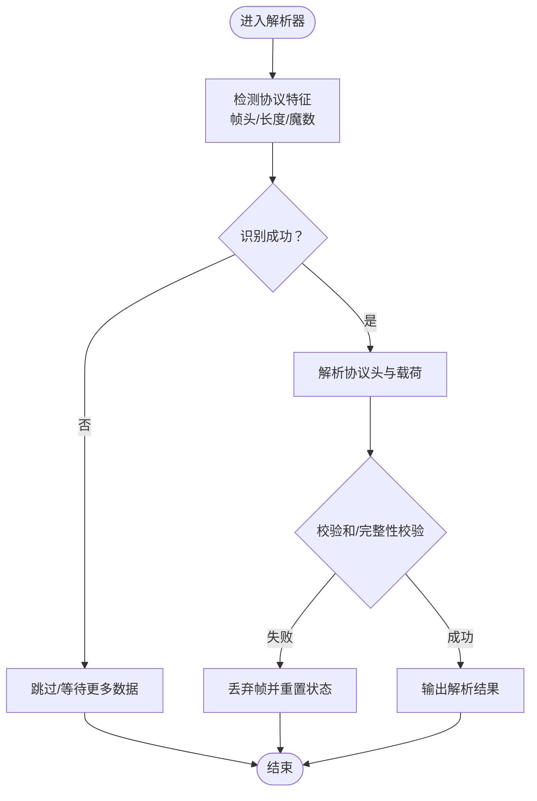

# 协议解析器

<cite>
**本文引用的文件**
- [README.md](file://README.md)
- [DESIGN.md](file://DESIGN.md)
- [src-tauri/src/serial/mod.rs](file://src-tauri/src/serial/mod.rs)
- [src-tauri/src/serial/port_manager.rs](file://src-tauri/src/serial/port_manager.rs)
- [src-tauri/src/serial/commands.rs](file://src-tauri/src/serial/commands.rs)
- [src-tauri/src/serial/protocol.rs](file://src-tauri/src/serial/protocol.rs)
- [src-tauri/src/serial/data_process.rs](file://src-tauri/src/serial/data_process.rs)
- [src-tauri/src/data_logger/mod.rs](file://src-tauri/src/data_logger/mod.rs)
- [src-tauri/src/data_logger/commands.rs](file://src-tauri/src/data_logger/commands.rs)
- [src/stores/serial.ts](file://src/stores/serial.ts)
</cite>

## 目录
1. [简介](#简介)
2. [项目结构](#项目结构)
3. [核心组件](#核心组件)
4. [架构总览](#架构总览)
5. [详细组件分析](#详细组件分析)
6. [依赖关系分析](#依赖关系分析)
7. [性能考量](#性能考量)
8. [故障排查指南](#故障排查指南)
9. [结论](#结论)
10. [附录](#附录)

## 简介
本文件面向“串口协议解析器”的技术文档，聚焦于后端 Rust 模块中的串口管理、数据处理与协议抽象层设计。当前仓库中，协议解析的后端模块位于 src-tauri/src/serial/ 下，其中 protocol.rs 与 data_process.rs 为协议解析与数据处理的核心位置；前端通过 Tauri 命令与后端交互，接收原始字节数据并交由前端组件完成协议解码与可视化。

根据项目设计文档与 README 的描述，系统支持 UART/RS232/RS485 串口协议，并具备多协议调试能力（包括 TCP/UDP、蓝牙串口），为后续扩展到 Modbus、CAN 等工业协议提供了良好的架构基础。

## 项目结构
后端采用模块化组织，串口相关功能集中在 src-tauri/src/serial/，数据记录与导出集中在 src-tauri/src/data_logger/，前端通过 src/stores/serial.ts 与后端命令交互。

**图表来源**
- [src-tauri/src/serial/mod.rs:1-4](file://src-tauri/src/serial/mod.rs#L1-L4)
- [src-tauri/src/serial/port_manager.rs:159-401](file://src-tauri/src/serial/port_manager.rs#L159-L401)
- [src-tauri/src/serial/commands.rs:1-129](file://src-tauri/src/serial/commands.rs#L1-L129)
- [src-tauri/src/serial/protocol.rs:1-2](file://src-tauri/src/serial/protocol.rs#L1-L2)
- [src-tauri/src/serial/data_process.rs:1-2](file://src-tauri/src/serial/data_process.rs#L1-L2)
- [src-tauri/src/data_logger/mod.rs:1-273](file://src-tauri/src/data_logger/mod.rs#L1-L273)
- [src/stores/serial.ts:1-363](file://src/stores/serial.ts#L1-L363)

**章节来源**
- [DESIGN.md:101-139](file://DESIGN.md#L101-L139)
- [README.md:104-119](file://README.md#L104-L119)

## 核心组件
- 串口管理器 PortManager：负责串口打开/关闭、读取循环、统计计数、错误状态维护、会话生命周期管理与数据持久化。
- 串口命令接口：提供列出串口、打开/关闭串口、发送数据、查询状态等 Tauri 命令。
- 数据日志 DataLogger：基于 SQLite 的会话与数据记录管理，支持会话创建/结束、RX/TX 数据写入、查询与导出。
- 前端状态与命令封装：通过 invoke 调用后端命令，监听 serial-data 事件接收原始字节，交由前端组件完成协议解码与显示。

**章节来源**
- [src-tauri/src/serial/port_manager.rs:159-401](file://src-tauri/src/serial/port_manager.rs#L159-L401)
- [src-tauri/src/serial/commands.rs:1-129](file://src-tauri/src/serial/commands.rs#L1-L129)
- [src-tauri/src/data_logger/mod.rs:47-273](file://src-tauri/src/data_logger/mod.rs#L47-L273)
- [src/stores/serial.ts:145-363](file://src/stores/serial.ts#L145-L363)

## 架构总览
后端以 PortManager 为核心，围绕其构建多连接管理、异步读取循环与数据持久化；前端通过命令与事件驱动，完成 UI 展示与用户交互。协议解析目前在后端预留模块（protocol.rs、data_process.rs），建议在这些模块中实现协议抽象层与扩展机制，前端仅负责展示与用户配置。

**图表来源**
- [src-tauri/src/serial/commands.rs:49-118](file://src-tauri/src/serial/commands.rs#L49-L118)
- [src-tauri/src/serial/port_manager.rs:196-392](file://src-tauri/src/serial/port_manager.rs#L196-L392)
- [src-tauri/src/data_logger/mod.rs:115-164](file://src-tauri/src/data_logger/mod.rs#L115-L164)
- [src/stores/serial.ts:157-285](file://src/stores/serial.ts#L157-L285)

## 详细组件分析

### 串口管理器 PortManager
- 多连接管理：使用 HashMap 存储连接，键为 connection_id，值包含串口句柄、运行状态、计数器与会话 ID。
- 异步读取循环：在独立线程中循环读取，遇到超时继续，非超时错误则退出；将 RX 数据持久化并推送至前端。
- 发送流程：加锁串口，写入数据，记录 TX 日志，更新统计；错误时更新状态与 last_error。
- 会话管理：打开串口时创建会话，关闭时结束会话；全局信息聚合活跃连接与可用串口缓存。
- 错误处理：捕获串口错误并映射为 PortStatus::Error，便于前端展示。

**图表来源**
- [src-tauri/src/serial/port_manager.rs:159-401](file://src-tauri/src/serial/port_manager.rs#L159-L401)
- [src-tauri/src/data_logger/mod.rs:47-164](file://src-tauri/src/data_logger/mod.rs#L47-L164)

**章节来源**
- [src-tauri/src/serial/port_manager.rs:159-401](file://src-tauri/src/serial/port_manager.rs#L159-L401)

### 串口命令接口
- 列出串口、刷新串口列表、打开/关闭串口、发送数据、查询状态、全局信息、连接状态检查等命令。
- 命令通过 State 获取 PortManager 实例，实现与后端核心逻辑的解耦。

**章节来源**
- [src-tauri/src/serial/commands.rs:1-129](file://src-tauri/src/serial/commands.rs#L1-L129)

### 数据日志 DataLogger
- 会话表 sessions 与数据表 serial_data，外键约束 + CASCADE 删除保证数据一致性。
- 支持创建会话、结束会话、记录 RX/TX、查询会话列表与会话数据、删除会话、导出 CSV。
- 使用 WAL 模式与 PRAGMA 优化 SQLite 性能与可靠性。

**章节来源**
- [src-tauri/src/data_logger/mod.rs:47-273](file://src-tauri/src/data_logger/mod.rs#L47-L273)

### 前端串口状态与命令封装
- 通过 invoke 调用后端命令，监听 serial-data 事件接收原始字节。
- 维护全局运行时信息、活跃连接、接收缓冲区，支持十六进制/文本发送模式。
- 提供连接生命周期管理与轮询更新。

**章节来源**
- [src/stores/serial.ts:145-363](file://src/stores/serial.ts#L145-L363)

### 协议抽象层与扩展机制（设计建议）
当前 protocol.rs 与 data_process.rs 为协议解析预留模块。建议采用如下设计：
- 抽象协议接口：定义统一的协议解析 trait，包含帧格式识别、校验和验证、协议头解析、报文组装/拆分等方法。
- 协议注册中心：集中管理协议实现，支持动态启用/禁用与优先级排序。
- 解析器工厂：根据帧头/长度/魔数等特征自动识别协议类型。
- 容错与恢复：对不完整帧、校验失败、超时等情况进行丢弃、重置或告警，避免污染后续解析。
- 前后端协作：后端仅负责原始数据的可靠传输与最小化处理，协议解码与可视化由前端完成，降低后端复杂度。

（本小节为概念性设计说明，不直接分析具体文件）

## 依赖关系分析
- 后端依赖：serialport（串口）、tokio（异步）、serde（序列化）、rusqlite（SQLite）、tauri（命令与事件）、chrono（时间戳）。
- 前端依赖：@tauri-apps/api（命令与事件）、Pinia（状态管理）。

**图表来源**
- [src-tauri/src/serial/commands.rs:1-129](file://src-tauri/src/serial/commands.rs#L1-L129)
- [src-tauri/src/serial/port_manager.rs:159-401](file://src-tauri/src/serial/port_manager.rs#L159-L401)
- [src-tauri/src/data_logger/mod.rs:47-164](file://src-tauri/src/data_logger/mod.rs#L47-L164)

**章节来源**
- [DESIGN.md:26-32](file://DESIGN.md#L26-L32)
- [src-tauri/src/serial/port_manager.rs:4-12](file://src-tauri/src/serial/port_manager.rs#L4-L12)

## 性能考量
- 异步与并发：使用 tokio::task::spawn_blocking 执行串口读取，避免阻塞事件循环；读取缓冲区大小与超时设置影响吞吐与延迟。
- 内存效率：前端接收缓冲区限制最大容量，避免无限增长；后端仅维护连接元信息与原子计数，减少锁竞争。
- I/O 优化：SQLite 使用 WAL 模式与 PRAGMA 调优，减少写放大；批量写入与索引设计（按会话+时间）有利于查询性能。
- 解析性能：协议解析建议采用零拷贝/流式解析策略，避免频繁分配；对高频协议可引入环形缓冲与滑动窗口匹配。

（本节为通用性能建议，不直接分析具体文件）

## 故障排查指南
- 串口打开失败：检查端口占用、权限与配置参数（波特率、数据位、停止位、校验位、流控）。后端会将错误映射为 PortStatus::Error，前端可读取 last_error 字段。
- 读取异常：串口读取循环对超时错误进行忽略并继续，非超时错误会导致循环退出；检查串口线缆、设备供电与驱动。
- 发送失败：发送流程失败时更新状态与 last_error，前端可通过 get_connection_info 获取详细信息。
- 数据丢失：确认前端监听 serial-data 事件是否正常；检查发送速率与缓冲区溢出。
- 数据持久化：若 SQLite 初始化失败或表创建失败，检查数据库路径与权限。

**章节来源**
- [src-tauri/src/serial/port_manager.rs:202-272](file://src-tauri/src/serial/port_manager.rs#L202-L272)
- [src-tauri/src/serial/port_manager.rs:283-302](file://src-tauri/src/serial/port_manager.rs#L283-L302)
- [src-tauri/src/serial/port_manager.rs:370-392](file://src-tauri/src/serial/port_manager.rs#L370-L392)
- [src-tauri/src/data_logger/mod.rs:64-111](file://src-tauri/src/data_logger/mod.rs#L64-L111)

## 结论
当前项目在后端实现了可靠的串口管理与数据持久化能力，前端通过命令与事件完成数据展示与交互。协议解析器的后端模块（protocol.rs、data_process.rs）为后续扩展多协议（如 Modbus、CAN）提供了清晰的扩展点。建议尽快完善协议抽象层与解析算法，同时保持前后端职责边界：后端专注稳定传输与最小处理，前端负责协议解码与可视化，从而获得更好的可维护性与性能表现。

## 附录

### 协议解析流程（概念示意）

（本图为概念流程图，不直接映射具体源文件）