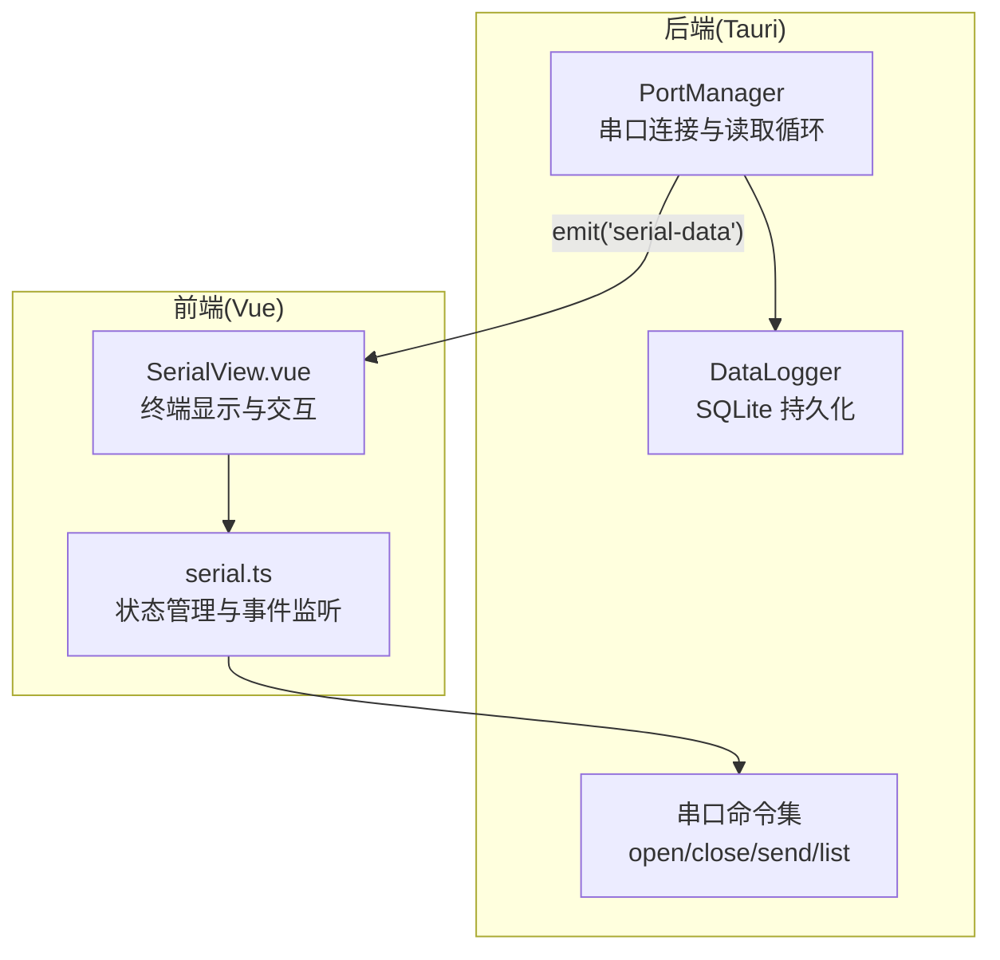
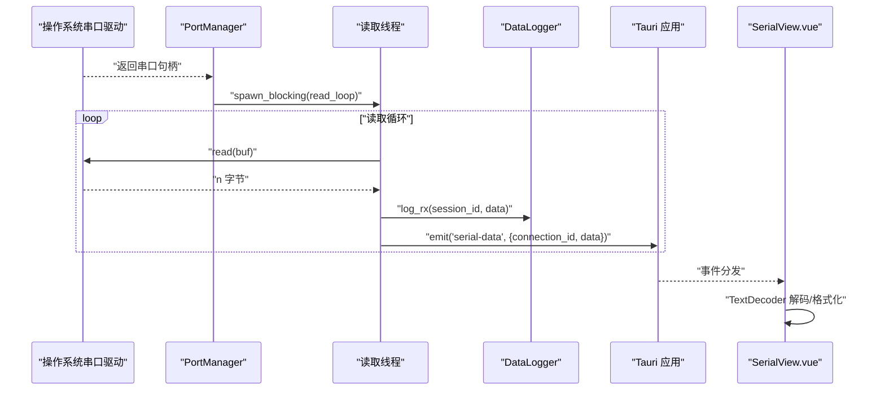
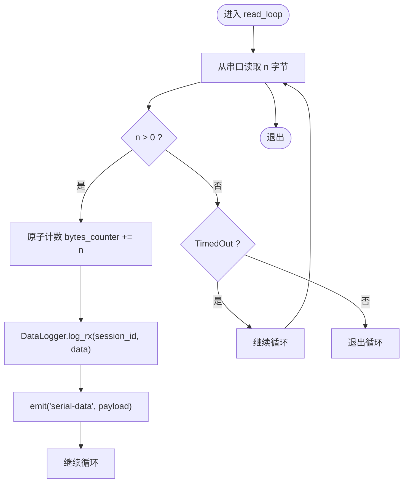
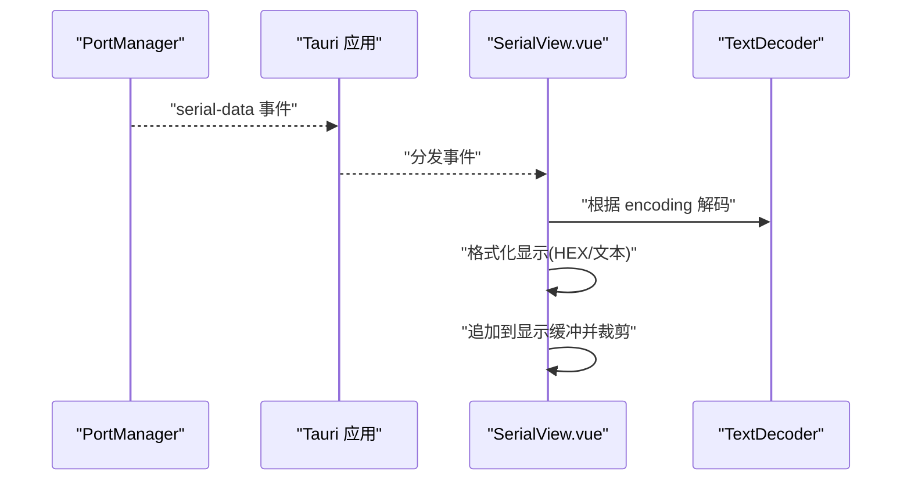
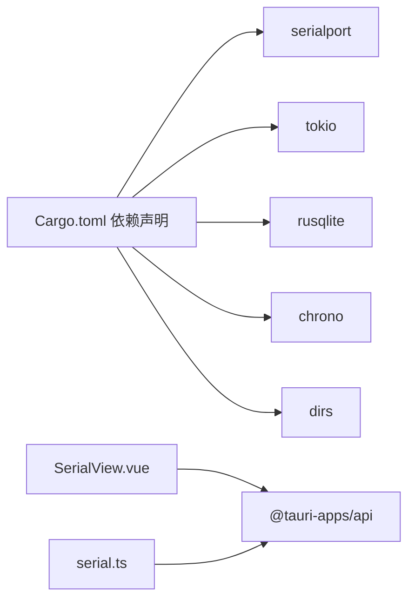

# 数据处理模块

<cite>
**本文引用的文件**
- [src-tauri/src/serial/mod.rs](file://src-tauri/src/serial/mod.rs)
- [src-tauri/src/serial/data_process.rs](file://src-tauri/src/serial/data_process.rs)
- [src-tauri/src/serial/commands.rs](file://src-tauri/src/serial/commands.rs)
- [src-tauri/src/serial/port_manager.rs](file://src-tauri/src/serial/port_manager.rs)
- [src-tauri/src/serial/protocol.rs](file://src-tauri/src/serial/protocol.rs)
- [src-tauri/src/data_logger/mod.rs](file://src-tauri/src/data_logger/mod.rs)
- [src-tauri/src/data_logger/commands.rs](file://src-tauri/src/data_logger/commands.rs)
- [src-tauri/src/lib.rs](file://src-tauri/src/lib.rs)
- [src/views/SerialView.vue](file://src/views/SerialView.vue)
- [src/stores/serial.ts](file://src/stores/serial.ts)
- [src-tauri/Cargo.toml](file://src-tauri/Cargo.toml)
</cite>

## 目录
1. [简介](#简介)
2. [项目结构](#项目结构)
3. [核心组件](#核心组件)
4. [架构总览](#架构总览)
5. [详细组件分析](#详细组件分析)
6. [依赖关系分析](#依赖关系分析)
7. [性能考量](#性能考量)
8. [故障排查指南](#故障排查指南)
9. [结论](#结论)
10. [附录](#附录)

## 简介
本技术文档聚焦 KonSerial 项目中的“串口数据处理模块”，系统性阐述从底层串口读取、缓冲与事件推送，到前端解码显示与持久化的完整数据处理链路。文档覆盖以下主题：
- 串口数据读取、缓冲与事件推送机制
- 原始字节到可读文本的解码与格式转换
- 数据过滤、去噪与预处理策略
- 数据统计与监控（字节数、传输速率、错误检测）
- 性能优化与内存管理
- 数据完整性验证与异常处理

## 项目结构
该模块位于 Rust 后端的 Tauri 应用中，采用“后端读取 + 事件推送 + 前端解码”的分层设计。核心文件组织如下：
- 串口子模块：port_manager（连接管理与读取循环）、commands（Tauri 命令）、data_process（数据处理占位）、protocol（协议解析占位）
- 数据日志模块：data_logger（SQLite 持久化、会话管理、查询导出）
- 前端视图与状态：SerialView.vue（UI 与事件监听）、stores/serial.ts（状态管理与命令封装）

图表来源
- [src-tauri/src/serial/port_manager.rs:274-303](file://src-tauri/src/serial/port_manager.rs#L274-L303)
- [src-tauri/src/data_logger/mod.rs:144-164](file://src-tauri/src/data_logger/mod.rs#L144-L164)
- [src/views/SerialView.vue:234-248](file://src/views/SerialView.vue#L234-L248)
- [src/stores/serial.ts:311-341](file://src/stores/serial.ts#L311-L341)
- [src-tauri/src/serial/commands.rs:49-118](file://src-tauri/src/serial/commands.rs#L49-L118)

章节来源
- [src-tauri/src/serial/mod.rs:1-4](file://src-tauri/src/serial/mod.rs#L1-L4)
- [src-tauri/src/lib.rs:47-83](file://src-tauri/src/lib.rs#L47-L83)

## 核心组件
- PortManager：负责串口打开、读取循环、发送、状态统计与会话生命周期管理；内置原子计数器统计字节数，通过 Tauri 事件向前端推送原始字节。
- DataLogger：基于 SQLite 的数据持久化，支持会话创建/结束、RX/TX 写入、查询与导出。
- 串口命令集：提供串口枚举、打开/关闭、发送、状态查询等 Tauri 命令。
- 前端 SerialView 与 stores/serial：负责事件监听、原始字节解码、显示与缓冲区管理。

章节来源
- [src-tauri/src/serial/port_manager.rs:162-401](file://src-tauri/src/serial/port_manager.rs#L162-L401)
- [src-tauri/src/data_logger/mod.rs:47-272](file://src-tauri/src/data_logger/mod.rs#L47-L272)
- [src-tauri/src/serial/commands.rs:1-129](file://src-tauri/src/serial/commands.rs#L1-L129)
- [src/views/SerialView.vue:1-746](file://src/views/SerialView.vue#L1-L746)
- [src/stores/serial.ts:1-363](file://src/stores/serial.ts#L1-L363)

## 架构总览
下图展示从串口读取到前端显示的全链路：

图表来源
- [src-tauri/src/serial/port_manager.rs:274-303](file://src-tauri/src/serial/port_manager.rs#L274-L303)
- [src-tauri/src/data_logger/mod.rs:144-164](file://src-tauri/src/data_logger/mod.rs#L144-L164)
- [src/views/SerialView.vue:234-248](file://src/views/SerialView.vue#L234-L248)

## 详细组件分析

### 串口读取与缓冲管理
- 读取缓冲：固定大小缓冲区，循环读取并统计字节数。
- 事件推送：每次读取到数据后，立即持久化并以事件形式推送到前端。
- 会话管理：每个连接对应一个会话 ID，用于区分不同连接的数据记录。
- 错误处理：超时视为正常等待，IO 错误则退出读取循环。

图表来源
- [src-tauri/src/serial/port_manager.rs:274-303](file://src-tauri/src/serial/port_manager.rs#L274-L303)

章节来源
- [src-tauri/src/serial/port_manager.rs:274-303](file://src-tauri/src/serial/port_manager.rs#L274-L303)

### 数据处理管道（原始字节到可读数据）
- 后端只负责推送原始字节，不进行解码或格式转换。
- 前端根据用户选择的编码（如 UTF-8、GBK）与显示模式（文本/HEX）进行解码与格式化。
- 显示缓冲：限制最大条目数量，避免内存膨胀；支持自动滚动与清空。

图表来源
- [src-tauri/src/serial/port_manager.rs:293-296](file://src-tauri/src/serial/port_manager.rs#L293-L296)
- [src/views/SerialView.vue:234-248](file://src/views/SerialView.vue#L234-L248)
- [src/stores/serial.ts:311-341](file://src/stores/serial.ts#L311-L341)

章节来源
- [src/views/SerialView.vue:234-248](file://src/views/SerialView.vue#L234-L248)
- [src/stores/serial.ts:311-341](file://src/stores/serial.ts#L311-L341)

### 数据过滤、去噪与预处理
- 去噪策略：前端可选择编码与换行符追加策略，减少噪声干扰。
- 预处理策略：在发送前对十六进制输入进行解析，在接收后按需解码；支持在 UI 层进行二次过滤（如仅显示特定连接）。
- 缓冲区裁剪：超过阈值时丢弃最早条目，保证内存占用可控。

章节来源
- [src/views/SerialView.vue:191-228](file://src/views/SerialView.vue#L191-L228)
- [src/stores/serial.ts:105-117](file://src/stores/serial.ts#L105-L117)

### 数据统计与监控
- 字节数统计：后端使用原子计数器累计 RX/TX 字节数；前端通过轮询获取最新状态。
- 传输速率：可在上层逻辑中基于时间戳与字节差计算瞬时速率（建议在前端或独立监控服务中实现）。
- 错误检测：发送失败时更新连接状态与最近错误；读取循环捕获 IO 错误并退出。

章节来源
- [src-tauri/src/serial/port_manager.rs:370-392](file://src-tauri/src/serial/port_manager.rs#L370-L392)
- [src-tauri/src/serial/port_manager.rs:333-354](file://src-tauri/src/serial/port_manager.rs#L333-L354)

### 数据完整性验证与异常处理
- 完整性：通过会话 ID 将同一连接的数据有序记录；SQLite 外键约束保障删除一致性。
- 异常处理：读取循环对超时与 IO 错误分别处理；发送失败更新状态并返回错误；前端统一提示。

章节来源
- [src-tauri/src/data_logger/mod.rs:131-140](file://src-tauri/src/data_logger/mod.rs#L131-L140)
- [src-tauri/src/serial/port_manager.rs:298-302](file://src-tauri/src/serial/port_manager.rs#L298-L302)
- [src-tauri/src/serial/port_manager.rs:382-387](file://src-tauri/src/serial/port_manager.rs#L382-L387)

### 协议解析模块（扩展点）
- 当前协议解析模块为占位，未来可在此实现帧校验、消息边界识别与协议封装。

章节来源
- [src-tauri/src/serial/protocol.rs:1-2](file://src-tauri/src/serial/protocol.rs#L1-L2)

## 依赖关系分析
- 后端依赖：serialport（串口访问）、tokio（异步并发）、rusqlite（SQLite）、chrono（时间戳）、dirs（配置路径）。
- 前端依赖：@tauri-apps/api（命令调用与事件监听）、naive-ui（界面组件）。

图表来源
- [src-tauri/Cargo.toml:20-36](file://src-tauri/Cargo.toml#L20-L36)
- [src/views/SerialView.vue:1-31](file://src/views/SerialView.vue#L1-L31)
- [src/stores/serial.ts:1-6](file://src/stores/serial.ts#L1-L6)

章节来源
- [src-tauri/Cargo.toml:20-36](file://src-tauri/Cargo.toml#L20-L36)

## 性能考量
- 读取缓冲与线程模型：使用 spawn_blocking 运行阻塞式读取，避免阻塞 Tokio 主事件循环；固定缓冲区大小降低分配成本。
- 事件推送频率：每次读取即推送，建议在前端侧做节流或批量合并以减少渲染压力。
- 内存管理：前端显示缓冲与接收缓冲均设置上限，超出即丢弃最旧条目；发送前对十六进制输入进行预解析，避免重复计算。
- 持久化策略：SQLite WAL 模式提升并发写入性能；索引按会话+时间排序，便于高效查询。

章节来源
- [src-tauri/src/serial/port_manager.rs:274-303](file://src-tauri/src/serial/port_manager.rs#L274-L303)
- [src-tauri/src/data_logger/mod.rs:76-106](file://src-tauri/src/data_logger/mod.rs#L76-L106)
- [src/views/SerialView.vue:212-228](file://src/views/SerialView.vue#L212-L228)
- [src/stores/serial.ts:105-117](file://src/stores/serial.ts#L105-L117)

## 故障排查指南
- 无法打开串口：检查端口名称、权限与占用情况；查看错误信息并确认配置参数。
- 无数据或延迟高：检查超时设置与读取循环是否被中断；确认前端监听是否正常。
- 发送失败：查看连接状态与最近错误；确认发送数据长度与目标连接有效性。
- 显示乱码：调整编码选择（UTF-8/GBK）与换行符追加策略；确认发送端编码一致。
- 内存占用过高：检查显示缓冲上限与接收缓冲上限；必要时降低上限或启用自动清空。

章节来源
- [src-tauri/src/serial/port_manager.rs:202-272](file://src-tauri/src/serial/port_manager.rs#L202-L272)
- [src-tauri/src/serial/port_manager.rs:370-392](file://src-tauri/src/serial/port_manager.rs#L370-L392)
- [src/views/SerialView.vue:191-228](file://src/views/SerialView.vue#L191-L228)
- [src/stores/serial.ts:105-117](file://src/stores/serial.ts#L105-L117)

## 结论
本模块采用“后端只读取、前端解码”的清晰分工，结合 SQLite 持久化与事件推送，实现了稳定高效的串口数据处理链路。通过原子计数与会话管理，提供了可靠的统计与监控能力；通过缓冲区裁剪与线程模型优化，兼顾了实时性与资源占用。后续可在协议解析模块中进一步增强帧级处理与校验能力，以满足更复杂的通信场景。

## 附录
- 数据库初始化与表结构：会话表与数据表，带外键约束与索引。
- 命令接口：串口枚举、打开/关闭、发送、状态查询与全局信息获取。
- 前端集成：事件监听、解码显示、缓冲区管理与统计展示。

章节来源
- [src-tauri/src/data_logger/mod.rs:84-106](file://src-tauri/src/data_logger/mod.rs#L84-L106)
- [src-tauri/src/serial/commands.rs:15-129](file://src-tauri/src/serial/commands.rs#L15-L129)
- [src/views/SerialView.vue:234-248](file://src/views/SerialView.vue#L234-L248)
- [src/stores/serial.ts:311-341](file://src/stores/serial.ts#L311-L341)