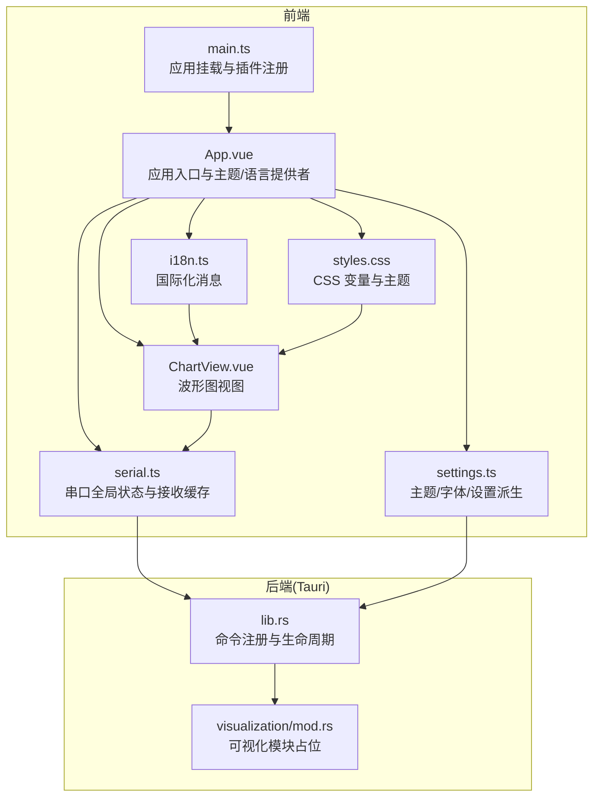
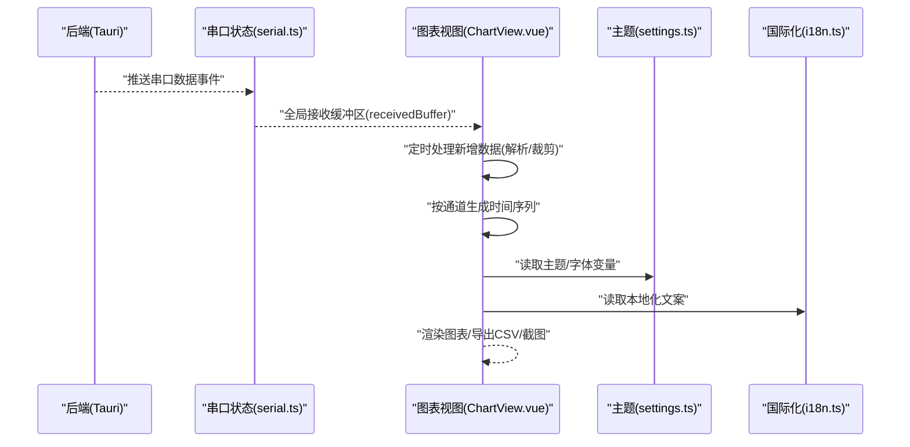
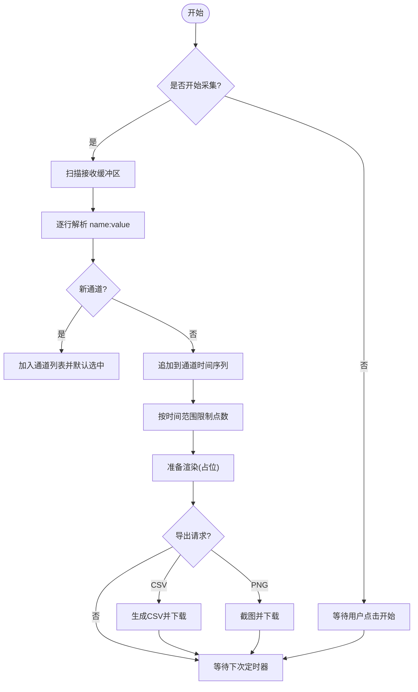
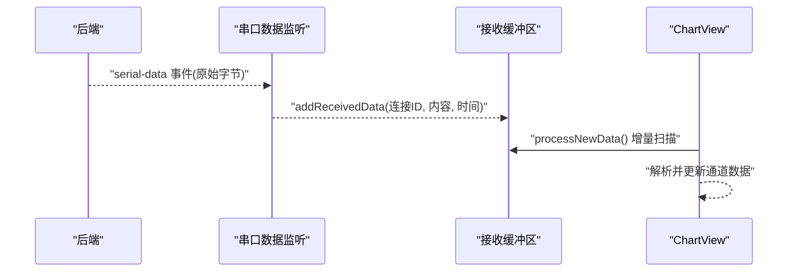
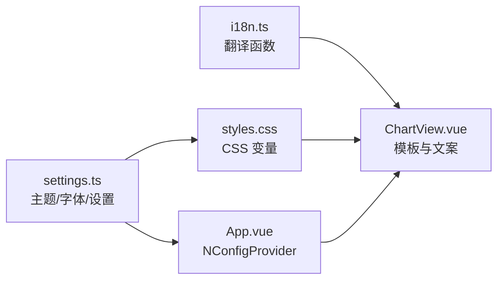
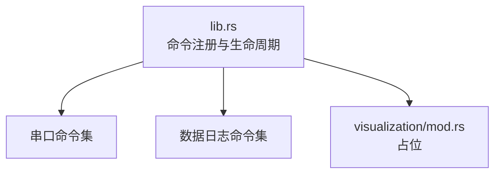
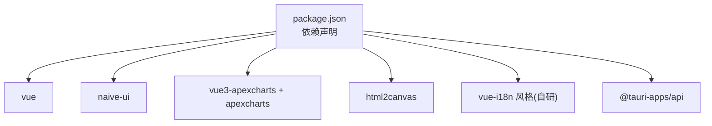

# 可视化模块

<cite>
**本文引用的文件**
- [src/views/ChartView.vue](file://src/views/ChartView.vue)
- [src/stores/serial.ts](file://src/stores/serial.ts)
- [src/stores/settings.ts](file://src/stores/settings.ts)
- [src/stores/i18n.ts](file://src/stores/i18n.ts)
- [src/stores/config.ts](file://src/stores/config.ts)
- [src/assets/styles.css](file://src/assets/styles.css)
- [src/App.vue](file://src/App.vue)
- [src/main.ts](file://src/main.ts)
- [package.json](file://package.json)
- [src-tauri/src/visualization/mod.rs](file://src-tauri/src/visualization/mod.rs)
- [src-tauri/src/lib.rs](file://src-tauri/src/lib.rs)
- [src-tauri/Cargo.toml](file://src-tauri/Cargo.toml)
</cite>

## 目录
1. [简介](#简介)
2. [项目结构](#项目结构)
3. [核心组件](#核心组件)
4. [架构总览](#架构总览)
5. [详细组件分析](#详细组件分析)
6. [依赖关系分析](#依赖关系分析)
7. [性能考量](#性能考量)
8. [故障排查指南](#故障排查指南)
9. [结论](#结论)
10. [附录](#附录)

## 简介
本文件面向 KonSerial 的可视化模块，聚焦“波形图/实时曲线”子系统的架构设计与实现要点，涵盖以下方面：
- 数据流：从前端串口接收缓存到图表数据生成、处理与传递
- 前端集成：如何将解析后的数据接入图表组件并实现动态渲染
- 数据类型支持：时间序列、数值范围、统计指标
- 性能优化：采样策略、缓存与渲染频率控制
- 自定义配置与主题：图表样式、显示参数与全局主题联动
- 数据格式标准与最佳实践：统一的键值对格式与导出规范

## 项目结构
可视化模块位于前端 Vue 应用中，核心由“图表视图 + 全局串口状态 + 主题与国际化 + 样式体系”构成；后端通过 Tauri 命令提供串口数据与配置能力。

**图表来源**
- [src/App.vue:12-33](file://src/App.vue#L12-L33)
- [src/views/ChartView.vue:1-210](file://src/views/ChartView.vue#L1-L210)
- [src/stores/serial.ts:96-117](file://src/stores/serial.ts#L96-L117)
- [src/stores/settings.ts:19-32](file://src/stores/settings.ts#L19-L32)
- [src/stores/i18n.ts:318-347](file://src/stores/i18n.ts#L318-L347)
- [src/assets/styles.css:4-37](file://src/assets/styles.css#L4-L37)
- [src/main.ts:1-14](file://src/main.ts#L1-L14)
- [src-tauri/src/lib.rs:47-83](file://src-tauri/src/lib.rs#L47-L83)
- [src-tauri/src/visualization/mod.rs:1-3](file://src-tauri/src/visualization/mod.rs#L1-L3)

**章节来源**
- [src/views/ChartView.vue:1-210](file://src/views/ChartView.vue#L1-L210)
- [src/stores/serial.ts:96-117](file://src/stores/serial.ts#L96-L117)
- [src/stores/settings.ts:19-32](file://src/stores/settings.ts#L19-L32)
- [src/stores/i18n.ts:318-347](file://src/stores/i18n.ts#L318-L347)
- [src/assets/styles.css:4-37](file://src/assets/styles.css#L4-L37)
- [src/main.ts:1-14](file://src/main.ts#L1-L14)
- [src-tauri/src/lib.rs:47-83](file://src-tauri/src/lib.rs#L47-L83)
- [src-tauri/src/visualization/mod.rs:1-3](file://src-tauri/src/visualization/mod.rs#L1-L3)

## 核心组件
- 图表视图组件：负责解析串口数据、维护通道数据、配置展示与导出
- 串口状态与接收缓存：提供全局共享的接收缓冲区，按时间戳组织每行数据
- 主题与国际化：驱动 UI 主题、字体与文案
- 样式体系：基于 CSS 变量的主题切换与布局

关键职责与交互：
- ChartView 从全局接收缓冲区消费数据，按通道组织时间序列
- 通过定时器周期性处理新增数据，限制每个通道的最大点数
- 提供导出 CSV 与截图能力
- 与主题/国际化/样式协同，保证一致的视觉体验

**章节来源**
- [src/views/ChartView.vue:18-140](file://src/views/ChartView.vue#L18-L140)
- [src/stores/serial.ts:96-117](file://src/stores/serial.ts#L96-L117)
- [src/stores/settings.ts:19-32](file://src/stores/settings.ts#L19-L32)
- [src/stores/i18n.ts:318-347](file://src/stores/i18n.ts#L318-L347)
- [src/assets/styles.css:4-37](file://src/assets/styles.css#L4-L37)

## 架构总览
下图展示了从前端串口接收、数据解析到图表渲染的整体流程，以及与后端命令的边界。

**图表来源**
- [src/stores/serial.ts:312-332](file://src/stores/serial.ts#L312-L332)
- [src/stores/serial.ts:105-112](file://src/stores/serial.ts#L105-L112)
- [src/views/ChartView.vue:100-132](file://src/views/ChartView.vue#L100-L132)
- [src/stores/settings.ts:19-32](file://src/stores/settings.ts#L19-L32)
- [src/stores/i18n.ts:318-347](file://src/stores/i18n.ts#L318-L347)

## 详细组件分析

### 图表视图组件（ChartView.vue）
职责与行为：
- 状态管理：运行开关、通道集合、选中通道、时间范围、缩放、网格、线宽等
- 数据解析：逐行解析“name:value”格式，按通道维护时间序列
- 数据处理：限制每个通道最大点数，避免内存膨胀
- 定时处理：以固定间隔扫描全局接收缓冲区，增量解析
- 导出能力：导出 CSV（按时间对齐）、截图 PNG
- 统计展示：通道当前值与平均值
- UI 集成：与 Naive UI、国际化、主题联动

**图表来源**
- [src/views/ChartView.vue:71-114](file://src/views/ChartView.vue#L71-L114)
- [src/views/ChartView.vue:142-201](file://src/views/ChartView.vue#L142-L201)

**章节来源**
- [src/views/ChartView.vue:18-140](file://src/views/ChartView.vue#L18-L140)
- [src/views/ChartView.vue:142-201](file://src/views/ChartView.vue#L142-L201)

### 串口状态与接收缓存（serial.ts）
- 全局接收缓冲区：存放来自后端推送的原始数据行，带时间戳与连接标识
- 缓存上限：超过阈值自动丢弃最早数据，防止内存无限增长
- 事件监听：启动/停止串口数据事件监听，向各组件分发原始字节
- 与前端视图的耦合：ChartView 通过全局缓冲区增量消费数据

**图表来源**
- [src/stores/serial.ts:312-332](file://src/stores/serial.ts#L312-L332)
- [src/stores/serial.ts:105-112](file://src/stores/serial.ts#L105-L112)
- [src/views/ChartView.vue:100-114](file://src/views/ChartView.vue#L100-L114)

**章节来源**
- [src/stores/serial.ts:96-117](file://src/stores/serial.ts#L96-L117)
- [src/stores/serial.ts:312-332](file://src/stores/serial.ts#L312-L332)

### 主题与国际化（settings.ts, i18n.ts, styles.css）
- 主题：基于 CSS 变量的明/暗主题，自动跟随系统或手动切换
- 字体：通过 CSS 变量统一控制字号，Naive UI 主题覆盖
- 国际化：响应式文案，ChartView 中大量使用 t() 函数
- 样式：全局背景、卡片、边框、阴影等变量，确保图表区域风格一致

**图表来源**
- [src/stores/settings.ts:19-32](file://src/stores/settings.ts#L19-L32)
- [src/stores/settings.ts:44-56](file://src/stores/settings.ts#L44-L56)
- [src/assets/styles.css:4-37](file://src/assets/styles.css#L4-L37)
- [src/App.vue:12-33](file://src/App.vue#L12-L33)
- [src/stores/i18n.ts:318-347](file://src/stores/i18n.ts#L318-L347)
- [src/views/ChartView.vue:13-16](file://src/views/ChartView.vue#L13-L16)

**章节来源**
- [src/stores/settings.ts:19-32](file://src/stores/settings.ts#L19-L32)
- [src/stores/settings.ts:44-56](file://src/stores/settings.ts#L44-L56)
- [src/assets/styles.css:4-37](file://src/assets/styles.css#L4-L37)
- [src/App.vue:12-33](file://src/App.vue#L12-L33)
- [src/stores/i18n.ts:318-347](file://src/stores/i18n.ts#L318-L347)

### 后端命令与可视化模块（lib.rs, visualization/mod.rs）
- 命令注册：Tauri 在启动时注册串口与数据日志相关命令
- 可视化模块：当前为占位，后续可扩展为 Rust 侧的图表数据处理或渲染桥接

**图表来源**
- [src-tauri/src/lib.rs:47-83](file://src-tauri/src/lib.rs#L47-L83)
- [src-tauri/src/visualization/mod.rs:1-3](file://src-tauri/src/visualization/mod.rs#L1-L3)

**章节来源**
- [src-tauri/src/lib.rs:47-83](file://src-tauri/src/lib.rs#L47-L83)
- [src-tauri/src/visualization/mod.rs:1-3](file://src-tauri/src/visualization/mod.rs#L1-L3)

## 依赖关系分析
- 前端依赖：Vue 3、Naive UI、ApexCharts（通过 vue3-apexcharts 集成）、html2canvas（截图）、国际化与配置管理
- 后端依赖：Tauri、serialport、tokio、rusqlite 等

**图表来源**
- [package.json:12-27](file://package.json#L12-L27)

**章节来源**
- [package.json:12-27](file://package.json#L12-L27)

## 性能考量
- 数据采样与缓存
  - 接收缓冲区上限：防止内存无限增长，超出阈值丢弃最早数据
  - 通道点数限制：按时间范围估算最大点数并进行队列裁剪
  - 增量处理：定时器只处理新增数据，避免重复解析
- 渲染频率控制
  - 固定间隔（毫秒级）触发数据处理，降低主线程压力
  - 图表占位区域，建议在集成具体图表库后按需渲染
- 导出与截图
  - CSV 导出按时间对齐，注意大数据量时的内存与 IO 压力
  - 截图采用 html2canvas，建议在需要时再异步加载与调用

优化建议（通用指导，非特定实现）：
- 对超长时间序列采用降采样或滑动窗口聚合
- 使用虚拟滚动或分页展示统计摘要
- 将重计算放入 Web Worker 或 Rust 后端处理（结合现有命令体系）

**章节来源**
- [src/stores/serial.ts:105-112](file://src/stores/serial.ts#L105-L112)
- [src/views/ChartView.vue:91-96](file://src/views/ChartView.vue#L91-L96)
- [src/views/ChartView.vue:121-122](file://src/views/ChartView.vue#L121-L122)
- [src/views/ChartView.vue:142-177](file://src/views/ChartView.vue#L142-L177)
- [src/views/ChartView.vue:179-201](file://src/views/ChartView.vue#L179-L201)

## 故障排查指南
- 无数据或显示空白
  - 确认已开始采集且串口连接正常
  - 检查接收缓冲区是否被清空或溢出
- 导出失败
  - CSV：确认存在可导出数据
  - PNG：确认图表容器存在且可截图
- 主题不生效
  - 检查主题设置与 CSS 变量是否正确应用到根节点
- 文案异常
  - 检查语言设置与翻译映射

**章节来源**
- [src/views/ChartView.vue:134-141](file://src/views/ChartView.vue#L134-L141)
- [src/views/ChartView.vue:179-201](file://src/views/ChartView.vue#L179-L201)
- [src/stores/settings.ts:102-110](file://src/stores/settings.ts#L102-L110)
- [src/stores/i18n.ts:318-347](file://src/stores/i18n.ts#L318-L347)

## 结论
KonSerial 的可视化模块以“前端解析 + 增量处理 + 主题/国际化协同”的方式实现了轻量、可扩展的波形图能力。当前图表渲染仍为占位，建议在后续版本中：
- 集成成熟的前端图表库（如 ApexCharts），替换 mock 图表
- 引入 Rust 后端的高性能数据处理与缓存
- 完善配置项与主题系统，支持更多图表样式与交互

## 附录

### 数据格式标准与最佳实践
- 输入格式：每行“name:value”，支持多通道并发
- 时间戳：由接收侧注入，保证时间序列一致性
- 通道管理：自动发现、默认选中、颜色区分
- 导出规范：
  - CSV：以时间为横轴，通道名为列头，缺失值留空
  - PNG：截图尺寸与背景色可配置

**章节来源**
- [src/views/ChartView.vue:71-98](file://src/views/ChartView.vue#L71-L98)
- [src/views/ChartView.vue:142-177](file://src/views/ChartView.vue#L142-L177)
- [src/views/ChartView.vue:179-201](file://src/views/ChartView.vue#L179-L201)