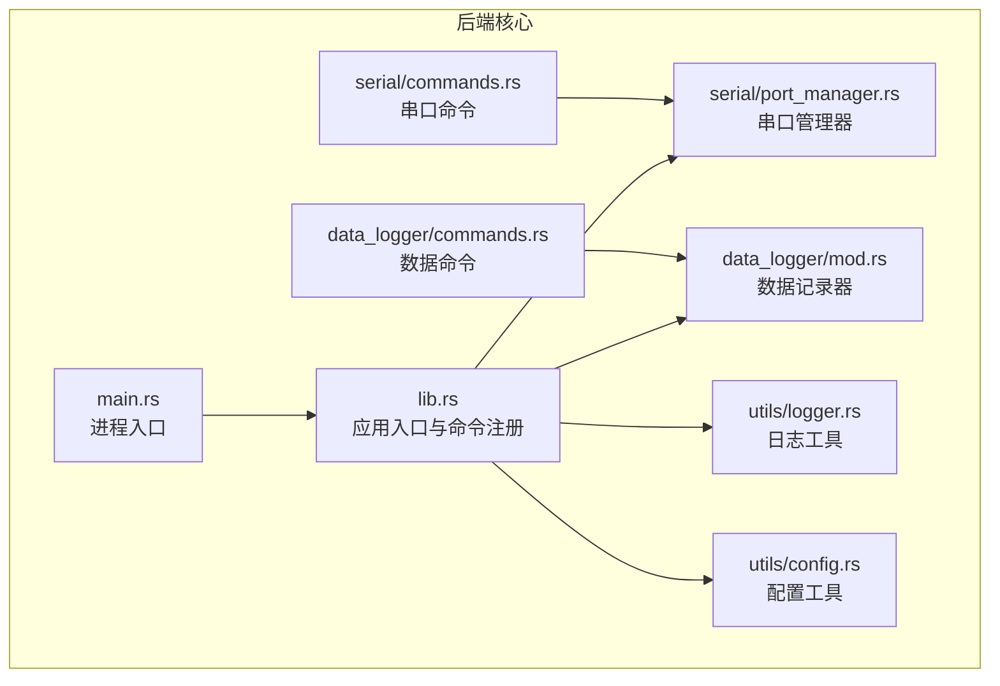
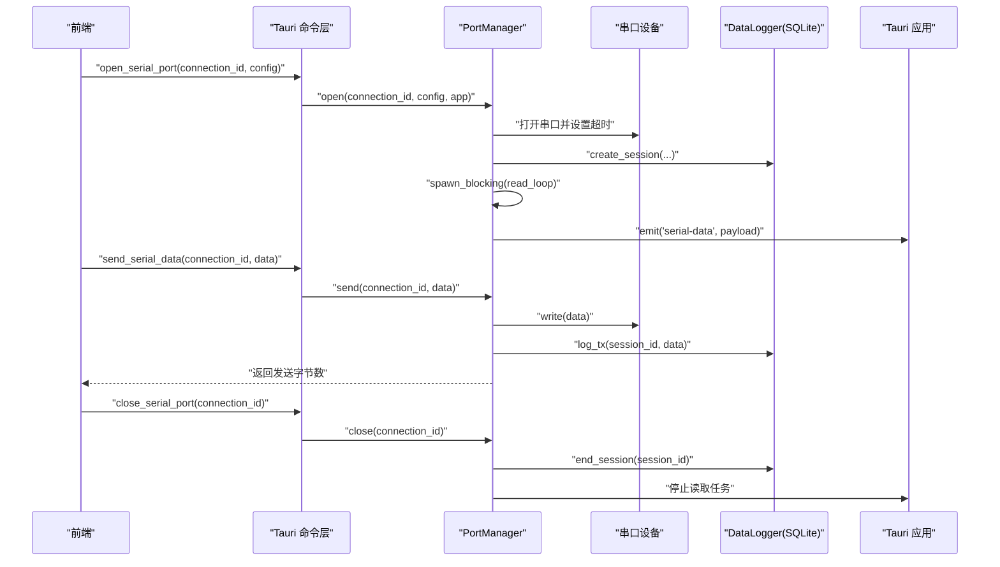
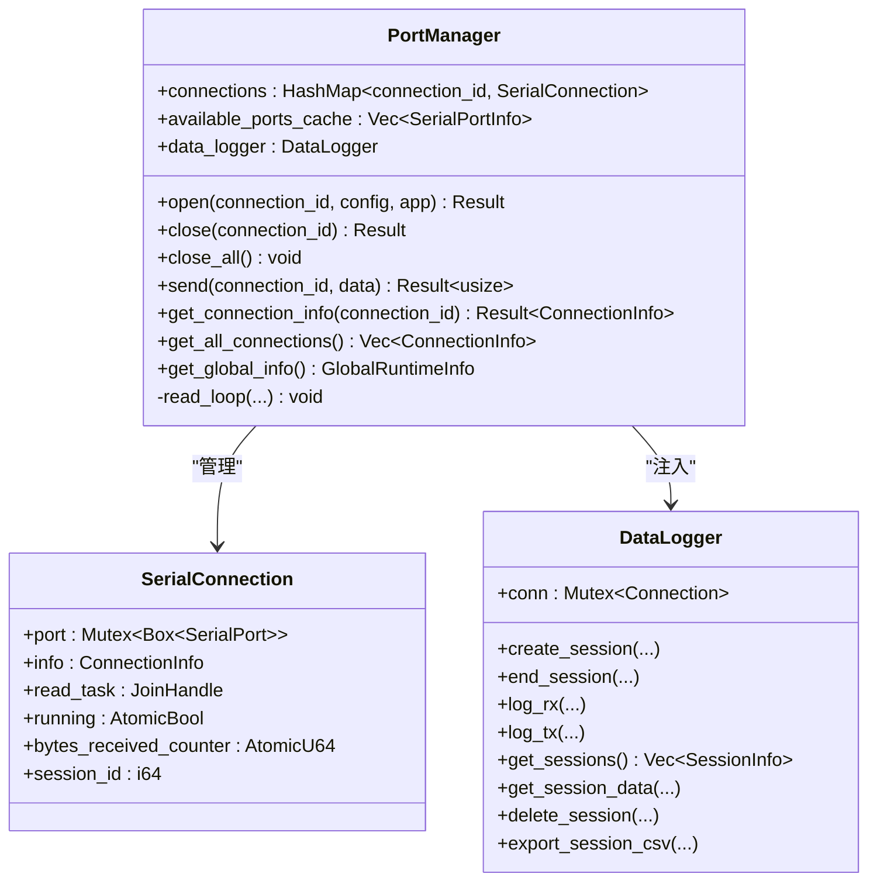
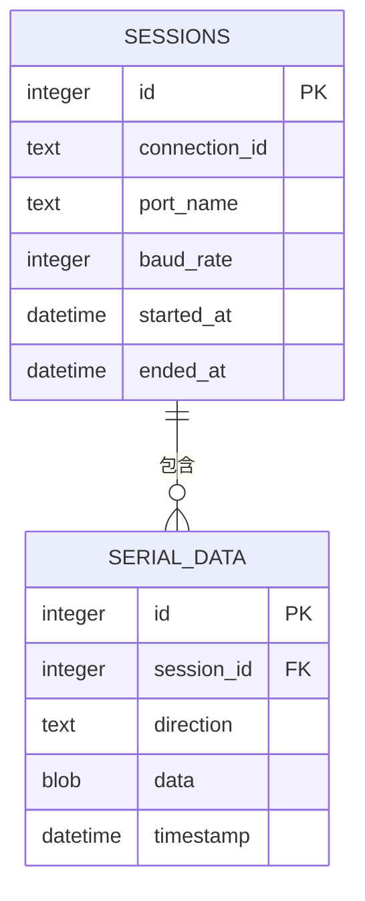
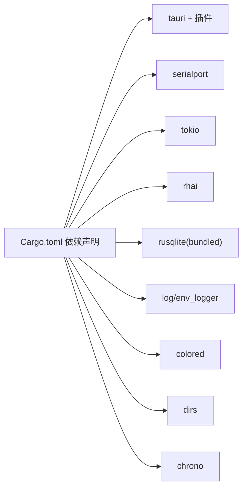

# 后端开发

<cite>
**本文引用的文件**
- [Cargo.toml](file://src-tauri/Cargo.toml)
- [lib.rs](file://src-tauri/src/lib.rs)
- [main.rs](file://src-tauri/src/main.rs)
- [DESIGN.md](file://DESIGN.md)
- [README.md](file://README.md)
- [serial/mod.rs](file://src-tauri/src/serial/mod.rs)
- [serial/port_manager.rs](file://src-tauri/src/serial/port_manager.rs)
- [serial/commands.rs](file://src-tauri/src/serial/commands.rs)
- [data_logger/mod.rs](file://src-tauri/src/data_logger/mod.rs)
- [data_logger/commands.rs](file://src-tauri/src/data_logger/commands.rs)
- [utils/mod.rs](file://src-tauri/src/utils/mod.rs)
- [utils/logger.rs](file://src-tauri/src/utils/logger.rs)
- [utils/config.rs](file://src-tauri/src/utils/config.rs)
- [visualization/mod.rs](file://src-tauri/src/visualization/mod.rs)
- [script/mod.rs](file://src-tauri/src/script/mod.rs)
</cite>

## 目录
1. [简介](#简介)
2. [项目结构](#项目结构)
3. [核心组件](#核心组件)
4. [架构总览](#架构总览)
5. [详细组件分析](#详细组件分析)
6. [依赖关系分析](#依赖关系分析)
7. [性能考量](#性能考量)
8. [故障排查指南](#故障排查指南)
9. [结论](#结论)
10. [附录](#附录)

## 简介
本文件面向 KonSerial 后端开发，围绕基于 Rust 的 Tauri 应用，系统梳理后端架构设计、模块组织与异步编程模型，并深入解析串口通信、数据记录、网络通信、脚本引擎、可视化与工具模块的职责与实现要点。重点阐述串口管理器的多连接支持、数据处理流程与协议解析机制；说明 SQLite 数据库设计、会话管理与数据持久化策略；解释 Rhai 脚本引擎的集成方式与脚本 API 设计；并总结错误处理机制、日志系统与性能优化策略，提供最佳实践与调试技巧。

## 项目结构
后端位于 src-tauri 目录，采用模块化组织，核心模块包括：
- serial：串口通信与管理（端口枚举、连接管理、数据读写、事件推送）
- data_logger：数据记录与持久化（会话管理、SQL 存储、查询与导出）
- network：网络通信（TCP/UDP/蓝牙，预留扩展）
- script：脚本引擎（Rhai 集成与 API 暴露）
- visualization：可视化数据处理（波形与图表数据）
- utils：通用工具（日志、配置、命令桥接）

**图表来源**
- [lib.rs:24-83](file://src-tauri/src/lib.rs#L24-L83)
- [main.rs:4-7](file://src-tauri/src/main.rs#L4-L7)
- [serial/port_manager.rs:161-180](file://src-tauri/src/serial/port_manager.rs#L161-L180)
- [data_logger/mod.rs:47-50](file://src-tauri/src/data_logger/mod.rs#L47-L50)
- [serial/commands.rs:1-129](file://src-tauri/src/serial/commands.rs#L1-L129)
- [data_logger/commands.rs:1-49](file://src-tauri/src/data_logger/commands.rs#L1-L49)
- [utils/logger.rs:41-83](file://src-tauri/src/utils/logger.rs#L41-L83)
- [utils/config.rs:65-94](file://src-tauri/src/utils/config.rs#L65-L94)

**章节来源**
- [DESIGN.md:101-139](file://DESIGN.md#L101-L139)
- [README.md:104-119](file://README.md#L104-L119)

## 核心组件
- 应用入口与生命周期
  - 进程入口 main.rs 调用 lib.rs::run，完成日志初始化、配置加载、数据库初始化、串口管理器初始化，并注册 Tauri 命令与全局状态。
- 串口管理器 PortManager
  - 支持多连接：以 connection_id 为键管理多个串口连接；每个连接包含端口句柄、运行时状态、读取任务、字节计数与会话 ID。
  - 异步读取循环：在独立线程中运行读取循环，遇到数据即持久化到 SQLite 并通过 Tauri 事件推送至前端。
  - 会话管理：打开连接时创建会话，关闭连接时结束会话，保证数据持久化与统计准确。
- 数据记录器 DataLogger
  - 基于 SQLite 的线程安全记录器，提供会话创建/结束、RX/TX 数据记录、会话查询、数据分页查询、会话删除与 CSV 导出。
- 日志与配置工具
  - Logger：封装彩色日志输出，支持时间戳、位置与颜色开关。
  - Config：跨平台配置文件路径管理，支持序列化/反序列化与热加载。

**章节来源**
- [lib.rs:24-83](file://src-tauri/src/lib.rs#L24-L83)
- [serial/port_manager.rs:161-401](file://src-tauri/src/serial/port_manager.rs#L161-L401)
- [data_logger/mod.rs:47-272](file://src-tauri/src/data_logger/mod.rs#L47-L272)
- [utils/logger.rs:41-131](file://src-tauri/src/utils/logger.rs#L41-L131)
- [utils/config.rs:65-175](file://src-tauri/src/utils/config.rs#L65-L175)

## 架构总览
后端采用“命令驱动 + 全局状态 + 异步任务”的模式：
- 前端通过 Tauri 命令调用后端能力（串口打开/关闭、发送数据、查询会话等）。
- 后端通过 State 注入全局状态（PortManager、DataLogger），命令在锁保护下访问。
- 串口读取在 tokio::task::spawn_blocking 中运行，避免阻塞事件循环；同时通过 Tauri 事件推送数据。
- 数据持久化与查询均通过 DataLogger 的互斥连接访问，保证并发安全。

**图表来源**
- [lib.rs:47-82](file://src-tauri/src/lib.rs#L47-L82)
- [serial/commands.rs:49-128](file://src-tauri/src/serial/commands.rs#L49-L128)
- [serial/port_manager.rs:196-392](file://src-tauri/src/serial/port_manager.rs#L196-L392)
- [data_logger/mod.rs:115-164](file://src-tauri/src/data_logger/mod.rs#L115-L164)

## 详细组件分析

### 串口通信模块（serial）
- 模块组织
  - port_manager：串口管理器、连接状态、读取循环、会话管理、发送与关闭。
  - commands：Tauri 命令桥接，暴露串口枚举、打开/关闭、发送、查询状态等。
  - data_process/protocol：预留数据处理与协议解析（当前仅声明，实现待完善）。
- 多连接支持
  - 以 connection_id 为键管理 HashMap，支持并发读写；使用 RwLock 保护连接表，AtomicBool 控制读取循环，AtomicU64 统计接收字节。
- 数据处理流程
  - 读取循环在独立线程中运行，遇到数据即持久化 RX 数据并推送事件；发送时更新发送字节并持久化 TX 数据。
- 协议解析机制
  - 当前模块声明了 protocol.rs，但未见具体实现；建议在该模块中扩展协议解析器，结合前端协议配置进行数据解码与可视化。

**图表来源**
- [serial/port_manager.rs:161-401](file://src-tauri/src/serial/port_manager.rs#L161-L401)
- [data_logger/mod.rs:47-111](file://src-tauri/src/data_logger/mod.rs#L47-L111)

**章节来源**
- [serial/mod.rs:1-4](file://src-tauri/src/serial/mod.rs#L1-L4)
- [serial/port_manager.rs:161-401](file://src-tauri/src/serial/port_manager.rs#L161-L401)
- [serial/commands.rs:1-129](file://src-tauri/src/serial/commands.rs#L1-L129)

### 数据记录模块（data_logger）
- 数据库设计
  - sessions：会话表，记录连接标识、端口名、波特率、开始/结束时间。
  - serial_data：数据表，记录会话 ID、方向（TX/RX）、二进制数据、时间戳；外键约束 + 级联删除。
  - 索引：对 (session_id, timestamp) 建立索引，提升分页查询性能。
- 会话管理
  - create_session：打开串口时创建会话；end_session：关闭串口时结束会话。
- 数据持久化
  - log_rx/log_tx：在读取循环与发送路径中分别记录 RX/TX 数据。
- 查询与导出
  - get_sessions：聚合统计 RX/TX 字节数；get_session_data：支持方向过滤与分页；delete_session：删除会话及其数据；export_session_csv：导出 CSV 字符串。

**图表来源**
- [data_logger/mod.rs:84-106](file://src-tauri/src/data_logger/mod.rs#L84-L106)

**章节来源**
- [data_logger/mod.rs:11-272](file://src-tauri/src/data_logger/mod.rs#L11-L272)
- [data_logger/commands.rs:1-49](file://src-tauri/src/data_logger/commands.rs#L1-L49)

### 网络通信模块（network）
- 模块组织
  - mod.rs 声明网络模块导出；tcp_client/udp_client/bluetooth 等文件预留实现。
- 设计理念
  - 与串口模块类似，建议在网络模块中实现异步客户端、连接池、事件推送与数据持久化策略。

**章节来源**
- [DESIGN.md:112-116](file://DESIGN.md#L112-L116)

### 脚本引擎模块（script）
- 模块组织
  - mod.rs 声明脚本模块；engine/context/api 等文件预留实现。
- 集成方式
  - 建议在 api 中注册串口/网络操作函数，使脚本可调用后端能力；在 engine 中管理 Rhai 引擎与作用域。

**章节来源**
- [DESIGN.md:117-121](file://DESIGN.md#L117-L121)
- [script/mod.rs:1-3](file://src-tauri/src/script/mod.rs#L1-L3)

### 可视化模块（visualization）
- 模块组织
  - mod.rs 声明可视化模块导出；chart_data/waveform 等文件预留实现。
- 设计理念
  - 与前端配合，提供波形数据处理与采样策略，优化前端渲染性能。

**章节来源**
- [DESIGN.md:126-129](file://DESIGN.md#L126-L129)
- [visualization/mod.rs:1-3](file://src-tauri/src/visualization/mod.rs#L1-L3)

### 工具模块（utils）
- 日志工具（logger）
  - LoggerConfig：控制颜色、位置、时间戳显示；提供 Info/Warn/Error 三类宏。
- 配置工具（config）
  - AppConfig：串口、界面、数据处理配置；支持跨平台路径、序列化/反序列化、热加载。

**章节来源**
- [utils/logger.rs:23-131](file://src-tauri/src/utils/logger.rs#L23-L131)
- [utils/config.rs:55-175](file://src-tauri/src/utils/config.rs#L55-L175)

## 依赖关系分析
- 依赖清单
  - Tauri 核心与插件：tauri、tauri-plugin-fs、tauri-plugin-dialog、tauri-plugin-clipboard-manager、tauri-plugin-cli（非移动端）。
  - 串口与异步：serialport、tokio。
  - 脚本引擎：rhai。
  - 数据库：rusqlite（捆绑）。
  - 日志与工具：log、env_logger、colored、dirs、chrono。

**图表来源**
- [Cargo.toml:20-39](file://src-tauri/Cargo.toml#L20-L39)

**章节来源**
- [Cargo.toml:1-40](file://src-tauri/Cargo.toml#L1-L40)

## 性能考量
- 异步与并发
  - 串口读取使用 spawn_blocking，避免阻塞 tokio 事件循环；读取循环设置固定超时，确保及时响应关闭信号。
  - 使用 RwLock 保护连接表，Atomic 类型减少锁粒度；Mutex 包裹 SQLite 连接，保证线程安全。
- 数据库优化
  - WAL 模式 + NORMAL 同步级别，提升并发写入性能；启用外键约束与级联删除，简化数据一致性。
  - 对 (session_id, timestamp) 建立索引，优化分页查询。
- 前后端协作
  - 读取循环直接推送事件，减少中间缓冲；前端负责渲染与采样，降低后端压力。
- I/O 与内存
  - 固定大小缓冲（如 1024B）平衡吞吐与延迟；发送路径仅持久化已写出数据，避免重复写入。

[本节为通用性能讨论，不直接分析具体文件]

## 故障排查指南
- 日志定位
  - 使用 log_info!/log_warn!/log_error! 宏输出带时间戳与位置的日志，便于定位问题。
- 常见问题
  - 串口打开失败：检查端口名称、权限与占用情况；查看错误消息并更新连接状态。
  - 读取异常：关注 TimedOut 错误，确认超时设置与设备行为；异常时中断读取循环并记录错误。
  - 数据持久化失败：检查数据库路径与权限；确认 PRAGMA 设置与表结构创建成功。
- 调试技巧
  - 在命令层打印关键参数与返回值；在 PortManager 中区分 RX/TX 路径的日志；在 DataLogger 中验证 SQL 执行结果。
  - 使用 Tauri Devtools 观察事件流与命令调用链路。

**章节来源**
- [utils/logger.rs:85-131](file://src-tauri/src/utils/logger.rs#L85-L131)
- [serial/port_manager.rs:274-303](file://src-tauri/src/serial/port_manager.rs#L274-L303)
- [data_logger/mod.rs:76-106](file://src-tauri/src/data_logger/mod.rs#L76-L106)

## 结论
KonSerial 后端以 Tauri 为核心，结合 Rust 的强类型与并发模型，构建了安全、高性能的串口调试平台。串口管理器实现了多连接与异步读取，数据记录模块提供了可靠的会话与持久化能力，日志与配置工具保障了可观测性与可维护性。后续可在 network、script、visualization 模块中完善相应能力，并在 protocol.rs 中实现协议解析，进一步增强平台的通用性与扩展性。

[本节为总结性内容，不直接分析具体文件]

## 附录
- 最佳实践
  - 命令层尽量薄，复杂逻辑下沉至模块；使用 State 注入全局状态，避免重复初始化。
  - 串口读取循环必须可中断，确保优雅关闭；发送失败时更新状态并记录错误。
  - 数据库事务与索引设计要兼顾查询与写入性能；导出功能应支持流式输出以降低内存占用。
- 调试建议
  - 在 lib.rs 中集中初始化与注册，便于统一观察启动流程；在命令层打印关键路径参数。
  - 使用 Tauri 事件命名规范，前后端约定一致；在前端对事件进行去抖与采样，避免过度刷新。

[本节为通用建议，不直接分析具体文件]