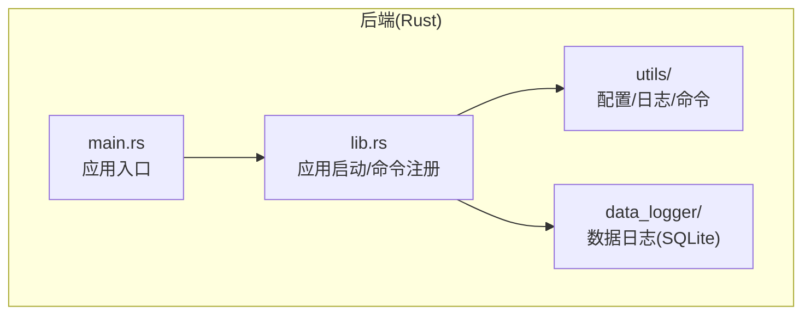
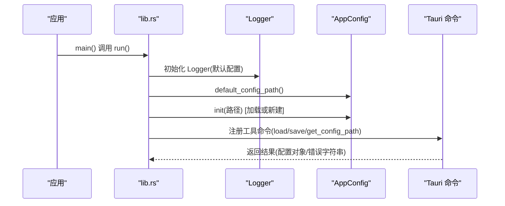
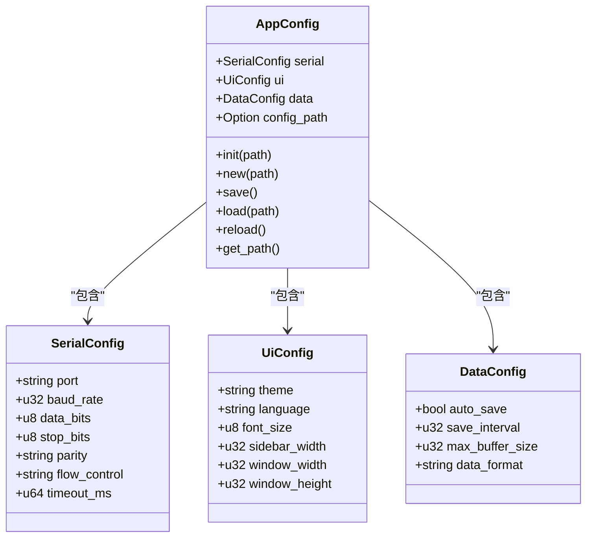
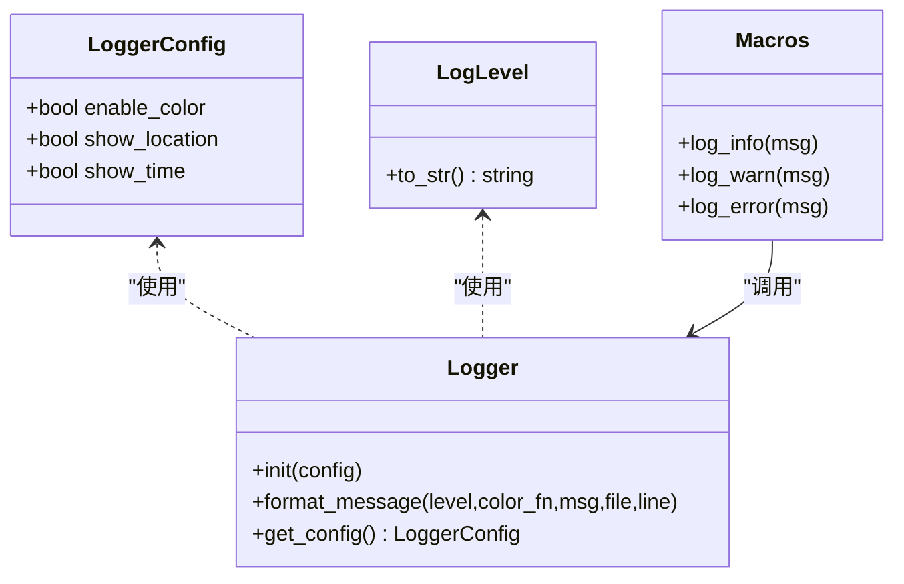
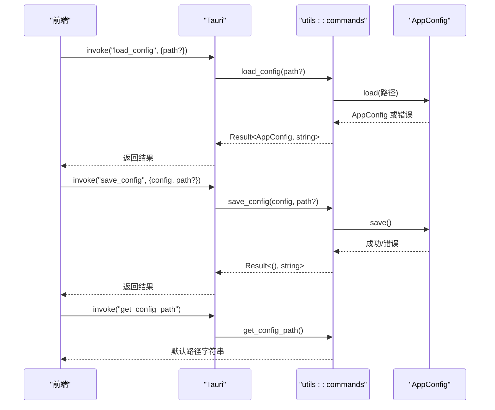
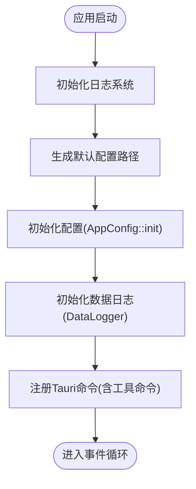
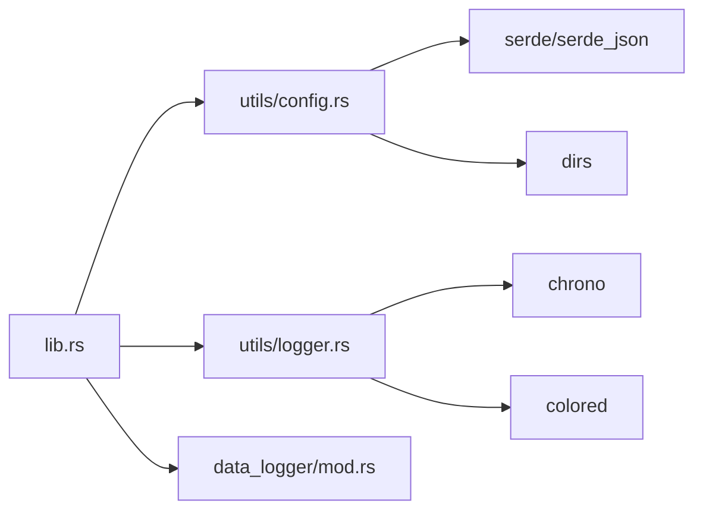

# 工具模块

<cite>
**本文引用的文件**
- [src-tauri/src/utils/mod.rs](file://src-tauri/src/utils/mod.rs)
- [src-tauri/src/utils/config.rs](file://src-tauri/src/utils/config.rs)
- [src-tauri/src/utils/logger.rs](file://src-tauri/src/utils/logger.rs)
- [src-tauri/src/utils/commands.rs](file://src-tauri/src/utils/commands.rs)
- [src-tauri/src/lib.rs](file://src-tauri/src/lib.rs)
- [src-tauri/src/main.rs](file://src-tauri/src/main.rs)
- [src-tauri/Cargo.toml](file://src-tauri/Cargo.toml)
- [src-tauri/src/data_logger/mod.rs](file://src-tauri/src/data_logger/mod.rs)
- [DESIGN.md](file://DESIGN.md)
- [README.md](file://README.md)
</cite>

## 目录
1. [简介](#简介)
2. [项目结构](#项目结构)
3. [核心组件](#核心组件)
4. [架构总览](#架构总览)
5. [详细组件分析](#详细组件分析)
6. [依赖关系分析](#依赖关系分析)
7. [性能考量](#性能考量)
8. [故障排查指南](#故障排查指南)
9. [结论](#结论)
10. [附录](#附录)

## 简介
本文件面向 KonSerial 的工具模块，聚焦以下目标：
- 配置管理模块：配置文件的读取、验证与初始化；提供跨平台默认路径与持久化能力；支持重新加载。
- 日志系统：日志级别控制、输出格式定制、颜色与时间戳开关、位置信息显示；统一的宏封装。
- 通用命令：提供配置加载、保存与默认路径查询的 Tauri 命令接口。
- 模块化设计与复用：通过模块导出、静态配置与宏实现跨模块共享。
- 错误处理与调试：统一的日志宏、错误传播与错误消息字符串化；结合应用启动流程中的初始化与注册。
- 扩展指南：如何新增工具命令、如何在现有日志/配置体系上扩展。

## 项目结构
工具模块位于后端 Rust 子工程中，采用“按功能域分层”的组织方式：
- utils：工具模块，包含配置、日志、通用命令等。
- data_logger：数据日志模块，提供 SQLite 存储、会话管理与导出能力（作为工具链生态的一部分）。
- lib.rs/main.rs：应用入口与命令注册，负责初始化日志、配置与全局状态，并注册工具命令。

**图示来源**
- [src-tauri/src/main.rs:1-7](file://src-tauri/src/main.rs#L1-L7)
- [src-tauri/src/lib.rs:1-84](file://src-tauri/src/lib.rs#L1-L84)
- [src-tauri/src/utils/mod.rs:1-6](file://src-tauri/src/utils/mod.rs#L1-L6)
- [src-tauri/src/data_logger/mod.rs:1-273](file://src-tauri/src/data_logger/mod.rs#L1-L273)

**章节来源**
- [src-tauri/src/main.rs:1-7](file://src-tauri/src/main.rs#L1-L7)
- [src-tauri/src/lib.rs:1-84](file://src-tauri/src/lib.rs#L1-L84)
- [src-tauri/src/utils/mod.rs:1-6](file://src-tauri/src/utils/mod.rs#L1-L6)
- [src-tauri/src/data_logger/mod.rs:1-273](file://src-tauri/src/data_logger/mod.rs#L1-L273)

## 核心组件
- 配置管理（AppConfig/SerialConfig/UiConfig/DataConfig）：提供结构化配置、默认值、序列化/反序列化、初始化/保存/加载/重新加载。
- 日志系统（Logger/LoggerConfig/LogLevel 宏）：提供统一日志入口、可配置输出格式、颜色与时间戳控制。
- 通用命令（load_config/save_config/get_config_path）：暴露 Tauri 命令，供前端调用以完成配置读写与路径查询。
- 应用启动与注册：在应用启动时初始化日志与配置，并注册工具命令。

**章节来源**
- [src-tauri/src/utils/config.rs:1-176](file://src-tauri/src/utils/config.rs#L1-L176)
- [src-tauri/src/utils/logger.rs:1-132](file://src-tauri/src/utils/logger.rs#L1-L132)
- [src-tauri/src/utils/commands.rs:1-31](file://src-tauri/src/utils/commands.rs#L1-L31)
- [src-tauri/src/lib.rs:18-84](file://src-tauri/src/lib.rs#L18-L84)

## 架构总览
工具模块在应用生命周期中的位置如下：

**图示来源**
- [src-tauri/src/main.rs:4-6](file://src-tauri/src/main.rs#L4-L6)
- [src-tauri/src/lib.rs:25-84](file://src-tauri/src/lib.rs#L25-L84)
- [src-tauri/src/utils/config.rs:12-94](file://src-tauri/src/utils/config.rs#L12-L94)
- [src-tauri/src/utils/commands.rs:3-29](file://src-tauri/src/utils/commands.rs#L3-L29)

## 详细组件分析

### 配置管理模块（AppConfig/SerialConfig/UiConfig/DataConfig）
- 数据模型
  - SerialConfig：串口参数（端口、波特率、数据位、停止位、校验、流控、超时）。
  - UiConfig：界面参数（主题、语言、字号、侧边栏宽度、窗口宽高）。
  - DataConfig：数据处理参数（自动保存、保存间隔、缓冲上限、数据格式）。
  - AppConfig：顶层聚合结构，包含上述三部分，并携带配置文件路径。
- 生命周期与行为
  - default_config_path：跨平台默认配置路径生成。
  - init：若存在则加载，否则新建并保存；失败时记录错误并回退到默认配置。
  - new：构造默认配置（含默认值）。
  - save：确保父目录存在，序列化为 JSON 并写入磁盘。
  - load：从磁盘读取并反序列化，保留路径。
  - reload：从已知路径重新加载并合并字段，保留路径。
  - get_path：返回当前配置文件路径。
- 错误处理
  - 统一使用 Result 包裹，错误通过日志记录并转换为字符串返回给前端。
- 性能与可靠性
  - 仅在必要时创建目录，避免频繁 IO。
  - 重新加载时仅替换字段，不重建实例，减少内存抖动。

**图示来源**
- [src-tauri/src/utils/config.rs:18-63](file://src-tauri/src/utils/config.rs#L18-L63)

**章节来源**
- [src-tauri/src/utils/config.rs:1-176](file://src-tauri/src/utils/config.rs#L1-L176)

### 日志系统（Logger/LoggerConfig/LogLevel 宏）
- 结构
  - LoggerConfig：enable_color、show_location、show_time。
  - Logger：单例配置（OnceLock），提供 init 与 format_message。
  - LogLevel：Info/Warn/Error 三种级别，映射为字符串。
  - 宏：log_info/log_warn/log_error，自动注入 file/line，并按配置输出带颜色的时间戳与位置信息。
- 输出格式
  - 可选时间戳、级别、文件位置、彩色级别名。
- 性能
  - 使用 OnceLock 保证初始化只发生一次。
  - 宏展开在编译期确定，运行时开销极低。
- 与配置的关系
  - AppConfig 在初始化时会打印日志，体现日志系统在应用启动阶段的作用。

**图示来源**
- [src-tauri/src/utils/logger.rs:23-83](file://src-tauri/src/utils/logger.rs#L23-L83)

**章节来源**
- [src-tauri/src/utils/logger.rs:1-132](file://src-tauri/src/utils/logger.rs#L1-L132)
- [src-tauri/src/lib.rs:25-45](file://src-tauri/src/lib.rs#L25-L45)

### 通用命令（配置相关）
- load_config：可选传入路径，否则使用默认路径；返回 AppConfig 或错误字符串。
- save_config：可选传入路径，设置 config_path 后保存；返回空结果或错误字符串。
- get_config_path：返回默认配置路径字符串。
- 注册位置：在 lib.rs 中集中注册，供前端通过 invoke 调用。

**图示来源**
- [src-tauri/src/utils/commands.rs:3-29](file://src-tauri/src/utils/commands.rs#L3-L29)
- [src-tauri/src/utils/config.rs:146-152](file://src-tauri/src/utils/config.rs#L146-L152)
- [src-tauri/src/utils/config.rs:127-143](file://src-tauri/src/utils/config.rs#L127-L143)
- [src-tauri/src/lib.rs:56-80](file://src-tauri/src/lib.rs#L56-L80)

**章节来源**
- [src-tauri/src/utils/commands.rs:1-31](file://src-tauri/src/utils/commands.rs#L1-L31)
- [src-tauri/src/lib.rs:56-80](file://src-tauri/src/lib.rs#L56-L80)

### 应用启动与模块化设计
- 启动流程
  - 初始化日志系统（Logger::init）。
  - 生成默认配置路径并初始化 AppConfig（init）。
  - 初始化数据日志管理器（DataLogger）与串口管理器（PortManager）。
  - 注册命令（含工具命令）。
- 模块化与复用
  - utils/mod.rs 导出子模块，便于统一引入。
  - 日志宏与配置结构在 lib.rs 中被广泛使用，体现跨模块共享。
  - 通过 OnceLock 与静态常量实现配置与日志的全局一致性。

**图示来源**
- [src-tauri/src/lib.rs:25-84](file://src-tauri/src/lib.rs#L25-L84)
- [src-tauri/src/utils/mod.rs:1-6](file://src-tauri/src/utils/mod.rs#L1-L6)

**章节来源**
- [src-tauri/src/lib.rs:18-84](file://src-tauri/src/lib.rs#L18-L84)
- [src-tauri/src/utils/mod.rs:1-6](file://src-tauri/src/utils/mod.rs#L1-L6)

## 依赖关系分析
- 依赖项
  - serde/serde_json：配置结构的序列化/反序列化。
  - dirs：跨平台配置目录定位。
  - chrono：时间戳格式化。
  - colored：日志颜色输出。
  - tokio：异步运行时（用于串口与脚本等模块，间接支撑工具模块的并发场景）。
- 模块间耦合
  - utils 与 data_logger 在应用层解耦，但通过 lib.rs 统一管理。
  - utils 与 lib.rs 之间通过宏与类型共享，耦合度低、内聚度高。

**图示来源**
- [src-tauri/Cargo.toml:20-36](file://src-tauri/Cargo.toml#L20-L36)
- [src-tauri/src/utils/config.rs:3-6](file://src-tauri/src/utils/config.rs#L3-L6)
- [src-tauri/src/utils/logger.rs:2-3](file://src-tauri/src/utils/logger.rs#L2-L3)
- [src-tauri/src/lib.rs:10-13](file://src-tauri/src/lib.rs#L10-L13)

**章节来源**
- [src-tauri/Cargo.toml:1-40](file://src-tauri/Cargo.toml#L1-L40)
- [src-tauri/src/utils/config.rs:1-10](file://src-tauri/src/utils/config.rs#L1-L10)
- [src-tauri/src/utils/logger.rs:1-6](file://src-tauri/src/utils/logger.rs#L1-L6)
- [src-tauri/src/lib.rs:10-13](file://src-tauri/src/lib.rs#L10-L13)

## 性能考量
- 配置读写
  - 仅在保存前确保父目录存在，避免重复 IO。
  - 重新加载时按字段替换，避免重建实例带来的额外分配。
- 日志输出
  - 宏在编译期展开，运行时仅做格式拼接与打印，开销可控。
  - 通过配置开关控制时间戳与位置信息，减少冗余输出。
- 数据日志（与工具模块协同）
  - 使用 SQLite WAL 模式与外键约束，提升并发写入与一致性。
  - 通过索引优化查询性能（会话与时间复合索引）。

**章节来源**
- [src-tauri/src/utils/config.rs:127-143](file://src-tauri/src/utils/config.rs#L127-L143)
- [src-tauri/src/utils/config.rs:154-169](file://src-tauri/src/utils/config.rs#L154-L169)
- [src-tauri/src/utils/logger.rs:48-82](file://src-tauri/src/utils/logger.rs#L48-L82)
- [src-tauri/src/data_logger/mod.rs:76-106](file://src-tauri/src/data_logger/mod.rs#L76-L106)

## 故障排查指南
- 配置加载失败
  - 现象：init 时加载失败并回退到默认配置；保存失败会记录错误。
  - 排查：检查默认路径是否存在写权限；确认 JSON 格式正确。
- 配置路径未设置
  - 现象：reload/save 时返回“路径未设置”错误。
  - 排查：确保在调用 save 前设置 config_path，或通过 save_config 传入路径。
- 日志无输出或格式异常
  - 现象：缺少时间戳/颜色/位置信息。
  - 排查：确认 Logger::init 已在应用启动早期调用；检查 LoggerConfig 的开关。
- 前端调用命令失败
  - 现象：invoke 返回错误字符串。
  - 排查：查看后端日志；确认命令已注册；检查路径与参数是否为空。

**章节来源**
- [src-tauri/src/utils/config.rs:70-94](file://src-tauri/src/utils/config.rs#L70-L94)
- [src-tauri/src/utils/config.rs:139-142](file://src-tauri/src/utils/config.rs#L139-L142)
- [src-tauri/src/utils/config.rs:165-168](file://src-tauri/src/utils/config.rs#L165-L168)
- [src-tauri/src/utils/logger.rs:44-50](file://src-tauri/src/utils/logger.rs#L44-L50)
- [src-tauri/src/lib.rs:56-80](file://src-tauri/src/lib.rs#L56-L80)

## 结论
工具模块以“配置 + 日志 + 通用命令”为核心，提供了：
- 跨平台、可恢复的配置管理能力；
- 可定制、高性能的日志输出；
- 与前端解耦的 Tauri 命令接口；
- 清晰的模块边界与良好的复用性。
在应用启动阶段完成初始化与注册，确保工具能力在全生命周期可用。

## 附录
- 扩展指南
  - 新增工具命令：在 utils/mod.rs 导出新模块，在 lib.rs 的 invoke_handler 中注册。
  - 新增配置项：在 AppConfig/子结构中添加字段，提供默认值与序列化支持。
  - 新增日志级别：在 LogLevel 中扩展枚举并在宏中映射。
- 最佳实践
  - 统一使用日志宏输出关键事件与错误。
  - 对外暴露命令时，始终将错误转换为字符串返回。
  - 配置变更后及时保存，并在必要时触发 reload 以同步到运行时。

**章节来源**
- [src-tauri/src/utils/mod.rs:1-6](file://src-tauri/src/utils/mod.rs#L1-L6)
- [src-tauri/src/lib.rs:56-80](file://src-tauri/src/lib.rs#L56-L80)
- [DESIGN.md:101-139](file://DESIGN.md#L101-L139)
- [README.md:104-119](file://README.md#L104-L119)