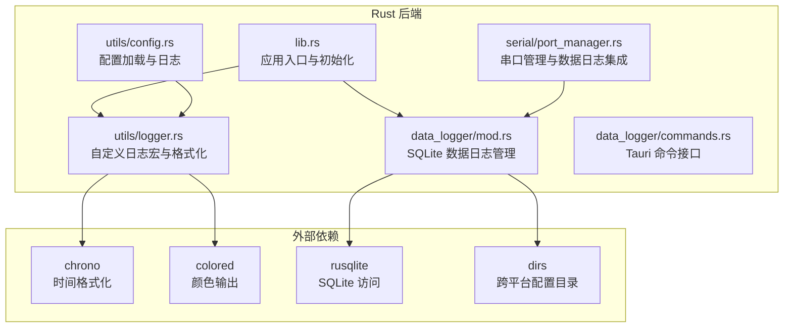
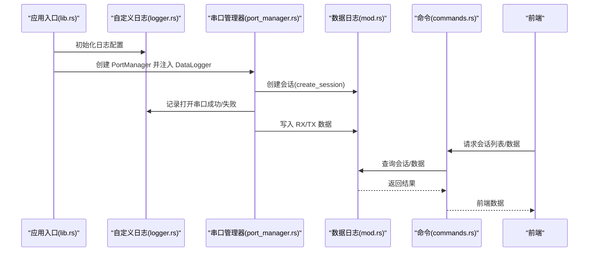
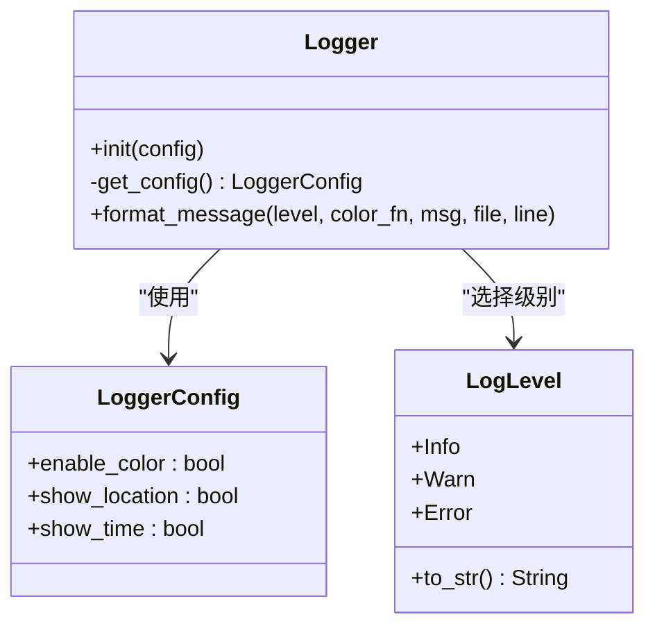
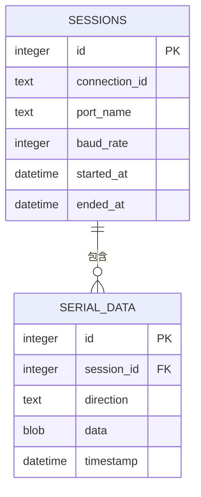
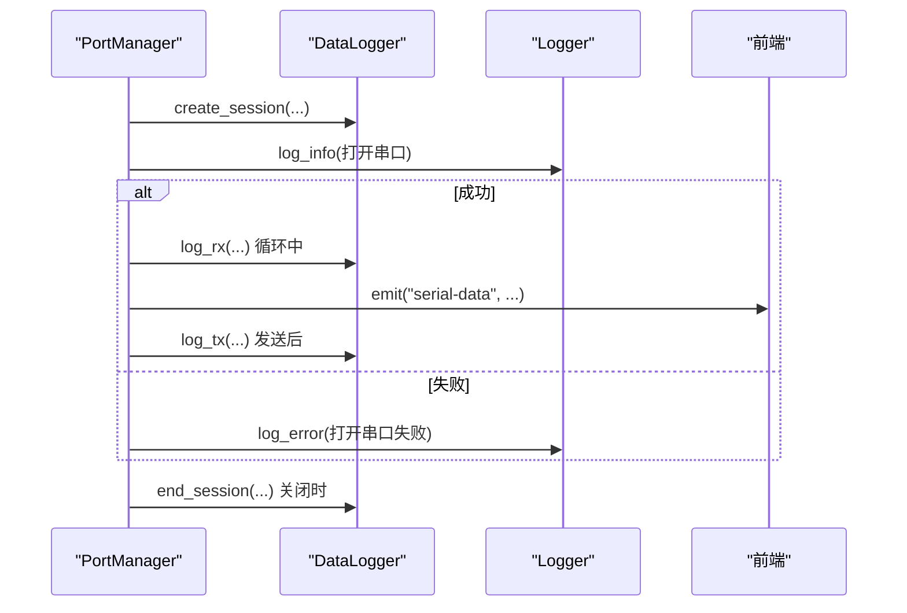
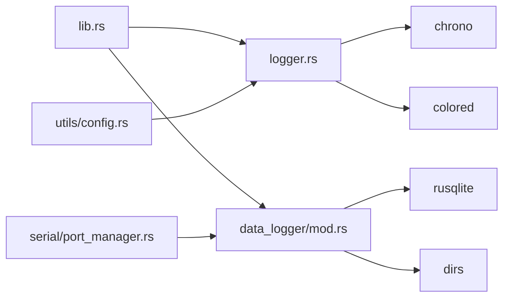

# 日志系统

<cite>
**本文引用的文件**
- [logger.rs](file://src-tauri/src/utils/logger.rs)
- [lib.rs](file://src-tauri/src/lib.rs)
- [Cargo.toml](file://src-tauri/Cargo.toml)
- [mod.rs](file://src-tauri/src/data_logger/mod.rs)
- [commands.rs](file://src-tauri/src/data_logger/commands.rs)
- [port_manager.rs](file://src-tauri/src/serial/port_manager.rs)
- [config.rs](file://src-tauri/src/utils/config.rs)
</cite>

## 目录
1. [简介](#简介)
2. [项目结构](#项目结构)
3. [核心组件](#核心组件)
4. [架构总览](#架构总览)
5. [详细组件分析](#详细组件分析)
6. [依赖关系分析](#依赖关系分析)
7. [性能考量](#性能考量)
8. [故障排查指南](#故障排查指南)
9. [结论](#结论)

## 简介
本文件面向 KonSerial 的日志系统，提供从设计到实现的全景式技术文档。内容覆盖：
- 日志级别定义与使用场景（调试、信息、警告、错误）
- 输出格式定制（时间戳、颜色、位置、消息模板）
- 异步写入与缓冲管理（当前实现为同步 stdout 输出）
- 文件轮转与大小限制（当前未实现，建议扩展方向）
- 过滤器与条件记录（当前未实现，建议扩展方向）
- 调试模式与可扩展性（建议方向）

## 项目结构
KonSerial 的日志系统由两部分组成：
- 内部日志：基于自定义宏与格式化函数，输出到标准输出（stdout），支持颜色、时间戳与源码位置显示。
- 数据日志：基于 SQLite 的持久化日志，记录串口收发数据与会话生命周期，供前端查询与导出。

**图表来源**
- [logger.rs:1-132](file://src-tauri/src/utils/logger.rs#L1-L132)
- [mod.rs:1-273](file://src-tauri/src/data_logger/mod.rs#L1-L273)
- [commands.rs:1-49](file://src-tauri/src/data_logger/commands.rs#L1-L49)
- [port_manager.rs:1-402](file://src-tauri/src/serial/port_manager.rs#L1-L402)
- [config.rs:1-176](file://src-tauri/src/utils/config.rs#L1-L176)
- [lib.rs:1-84](file://src-tauri/src/lib.rs#L1-L84)

**章节来源**
- [lib.rs:25-45](file://src-tauri/src/lib.rs#L25-L45)
- [Cargo.toml:20-40](file://src-tauri/Cargo.toml#L20-L40)

## 核心组件
- 自定义日志宏与格式化器：提供 INFO/WARN/ERROR 三类级别，支持颜色、时间戳与源码位置显示，并统一输出到标准输出。
- 数据日志管理器：基于 SQLite 的线程安全持久化，支持会话管理、数据写入、查询与导出。
- Tauri 命令接口：将数据日志能力暴露给前端，支持会话列表、数据分页查询、删除与 CSV 导出。
- 串口管理器：在串口生命周期关键节点记录日志，并将数据写入 SQLite。

**章节来源**
- [logger.rs:7-132](file://src-tauri/src/utils/logger.rs#L7-L132)
- [mod.rs:47-273](file://src-tauri/src/data_logger/mod.rs#L47-L273)
- [commands.rs:1-49](file://src-tauri/src/data_logger/commands.rs#L1-L49)
- [port_manager.rs:162-402](file://src-tauri/src/serial/port_manager.rs#L162-L402)

## 架构总览
下图展示日志系统的整体交互：应用启动时初始化内部日志；串口管理器在打开/关闭串口、发送/接收数据等关键路径记录日志；数据日志持久化到 SQLite；前端通过 Tauri 命令查询与导出。

**图表来源**
- [lib.rs:25-45](file://src-tauri/src/lib.rs#L25-L45)
- [port_manager.rs:202-272](file://src-tauri/src/serial/port_manager.rs#L202-L272)
- [mod.rs:115-164](file://src-tauri/src/data_logger/mod.rs#L115-L164)
- [commands.rs:1-49](file://src-tauri/src/data_logger/commands.rs#L1-L49)

## 详细组件分析

### 自定义日志系统（logger.rs）
- 日志级别
  - INFO：普通运行信息，如应用启动、功能执行完成。
  - WARN：潜在问题或非致命异常，如配置缺失但自动创建。
  - ERROR：错误事件，如打开串口失败、配置保存失败。
- 输出格式
  - 时间戳：可选，默认启用，格式为“HH:MM:SS”。
  - 等级标签：可选颜色，等级文本统一为大写。
  - 源码位置：可选，包含文件名与行号。
  - 消息模板：统一格式化后输出到标准输出。
- 初始化与配置
  - 通过静态 OnceLock 存储全局配置，支持默认值与按需覆盖。
  - 在应用入口处初始化，确保后续日志宏可用。

**图表来源**
- [logger.rs:24-82](file://src-tauri/src/utils/logger.rs#L24-L82)

**章节来源**
- [logger.rs:7-132](file://src-tauri/src/utils/logger.rs#L7-L132)

### 数据日志系统（data_logger/mod.rs）
- 数据模型
  - 会话（sessions）：记录连接标识、端口名、波特率、开始/结束时间与字节统计。
  - 数据记录（serial_data）：记录方向（TX/RX）、二进制数据与时间戳。
- 功能特性
  - 会话管理：创建与结束会话，自动维护关联计数。
  - 数据写入：线程安全地插入 RX/TX 数据。
  - 查询接口：支持按会话分页查询，支持方向筛选。
  - 删除与导出：删除会话级联删除数据；导出为 CSV 字符串。
- 性能与可靠性
  - 使用 WAL 模式与外键约束，提升并发与一致性。
  - 通过 Mutex 保证 SQLite 访问的线程安全。
  - 为会话与时间戳建立索引，优化查询性能。

**图表来源**
- [mod.rs:84-106](file://src-tauri/src/data_logger/mod.rs#L84-L106)

**章节来源**
- [mod.rs:47-273](file://src-tauri/src/data_logger/mod.rs#L47-L273)

### Tauri 命令接口（data_logger/commands.rs）
- 命令清单
  - 获取会话列表：返回每个会话的统计信息。
  - 获取会话数据：支持方向筛选、分页查询。
  - 删除会话：级联删除该会话的所有数据。
  - 导出会话为 CSV：生成 CSV 文本。
- 参数与默认值
  - 分页查询默认每页上限为 10000，偏移默认为 0。

**章节来源**
- [commands.rs:1-49](file://src-tauri/src/data_logger/commands.rs#L1-L49)

### 串口管理器与日志集成（serial/port_manager.rs）
- 生命周期日志
  - 打开串口：记录连接 ID、端口名与波特率；成功/失败分别记录 INFO/WARN/ERROR。
  - 关闭串口：记录关闭事件与已关闭数量。
  - 发送数据：记录发送字节数并持久化 TX 数据。
- 数据日志集成
  - 打开串口时创建会话，关闭时结束会话。
  - 读取循环中将 RX 数据持久化，并通过事件推送前端。
  - 发送成功后持久化 TX 数据。

**图表来源**
- [port_manager.rs:202-331](file://src-tauri/src/serial/port_manager.rs#L202-L331)
- [mod.rs:115-164](file://src-tauri/src/data_logger/mod.rs#L115-L164)

**章节来源**
- [port_manager.rs:196-331](file://src-tauri/src/serial/port_manager.rs#L196-L331)

### 配置模块中的日志（utils/config.rs）
- 行为
  - 加载配置：成功则记录 INFO，失败则记录 ERROR 并尝试创建新配置。
  - 创建新配置：若失败记录 ERROR。
  - 保存配置：成功记录 INFO，未设置路径记录 ERROR。
  - 重新加载：未设置路径记录 ERROR。
- 场景
  - 首次运行或配置损坏时的容错与提示。

**章节来源**
- [config.rs:66-176](file://src-tauri/src/utils/config.rs#L66-L176)

## 依赖关系分析
- 内部依赖
  - 应用入口依赖自定义日志进行初始化与运行期日志输出。
  - 串口管理器依赖数据日志进行会话与数据持久化。
  - 配置模块依赖自定义日志进行状态提示。
- 外部依赖
  - chrono：时间戳格式化。
  - colored：彩色输出。
  - rusqlite：SQLite 访问与 WAL 支持。
  - dirs：跨平台配置目录解析。

**图表来源**
- [lib.rs:10-15](file://src-tauri/src/lib.rs#L10-L15)
- [Cargo.toml:20-40](file://src-tauri/Cargo.toml#L20-L40)

**章节来源**
- [Cargo.toml:20-40](file://src-tauri/Cargo.toml#L20-L40)

## 性能考量
- 当前实现
  - 自定义日志采用同步 stdout 输出，简单直接，适合开发与调试阶段。
  - 数据日志通过 Mutex 保护 SQLite 连接，避免并发冲突；WAL 模式与索引提升查询效率。
- 潜在优化点
  - 异步日志：引入异步通道与后台线程，减少主线程阻塞。
  - 缓冲区管理：批量写入、背压控制与队列长度限制。
  - 文件轮转：按大小或时间轮转，结合压缩与清理策略。
  - 过滤器：按级别、模块、关键词过滤，降低 I/O 压力。
  - 调试模式：在开发构建中启用更详细的日志与采样。

[本节为通用性能讨论，不直接分析具体文件，故无“章节来源”]

## 故障排查指南
- 日志未输出
  - 检查应用入口是否调用初始化函数。
  - 确认运行环境是否支持颜色输出（CI 环境可能禁用颜色）。
- 数据日志异常
  - 检查数据库路径是否存在与权限是否足够。
  - 查看 SQLite 错误信息，确认 PRAGMA 设置与表结构创建是否成功。
- 串口日志缺失
  - 确认串口管理器正确注入 DataLogger。
  - 检查读取循环是否正常运行，以及会话创建/结束流程是否触发。
- 配置相关问题
  - 配置路径未设置会导致保存/加载失败，检查初始化逻辑与路径解析。

**章节来源**
- [lib.rs:25-45](file://src-tauri/src/lib.rs#L25-L45)
- [mod.rs:64-111](file://src-tauri/src/data_logger/mod.rs#L64-L111)
- [port_manager.rs:202-331](file://src-tauri/src/serial/port_manager.rs#L202-L331)
- [config.rs:127-143](file://src-tauri/src/utils/config.rs#L127-L143)

## 结论
KonSerial 的日志系统以简洁实用为目标：内部日志提供统一的格式化输出，数据日志提供可靠的持久化能力。当前实现满足开发与基本使用需求，未来可在异步写入、文件轮转、过滤与调试模式等方面进一步增强，以适配更复杂的生产环境与更高性能要求。