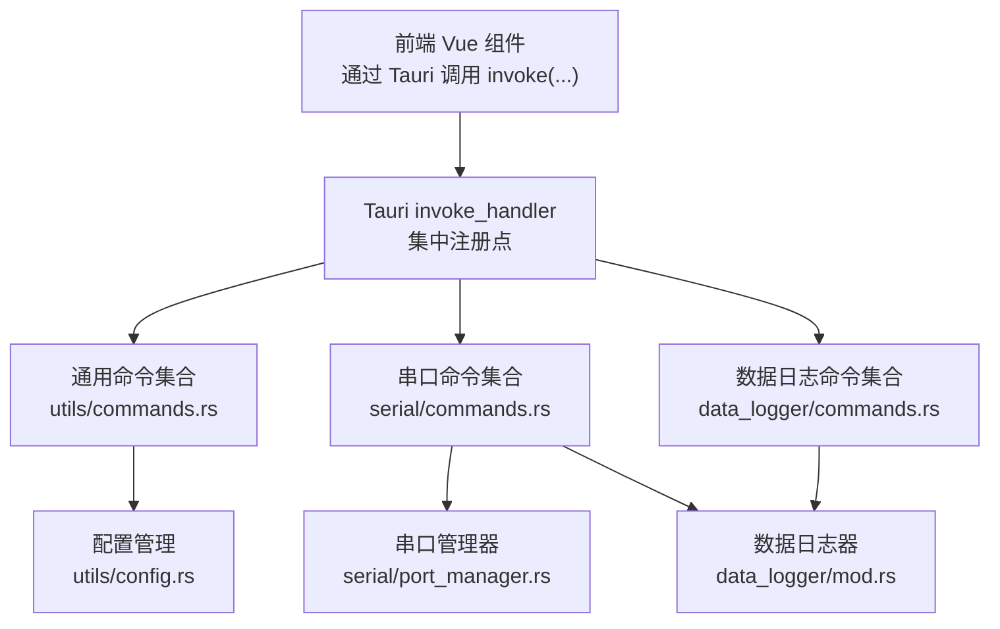
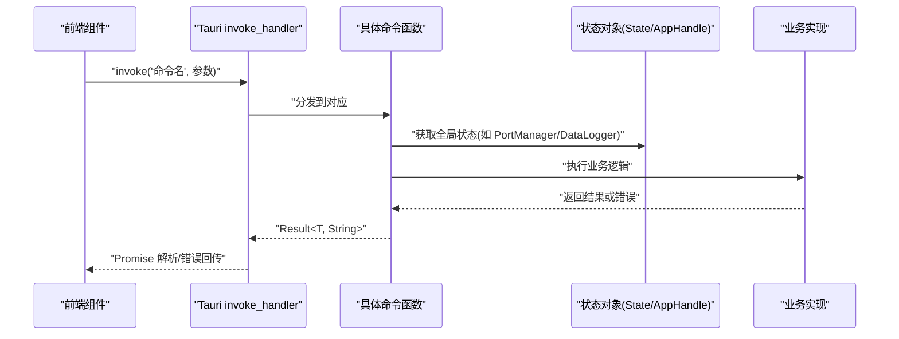
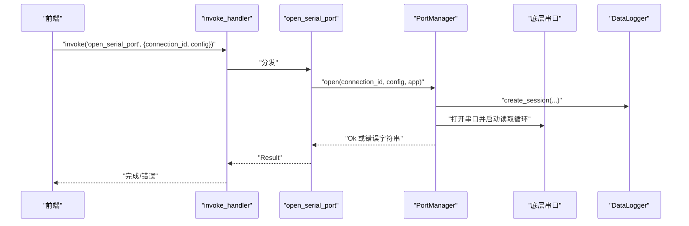
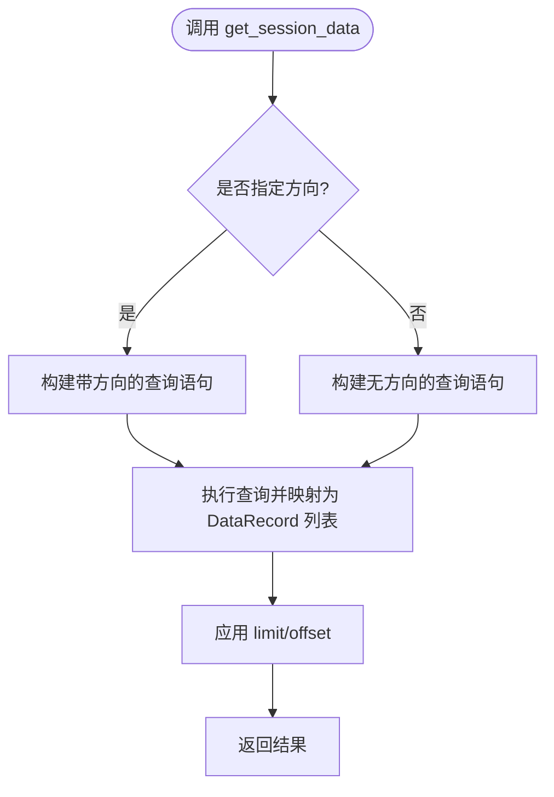
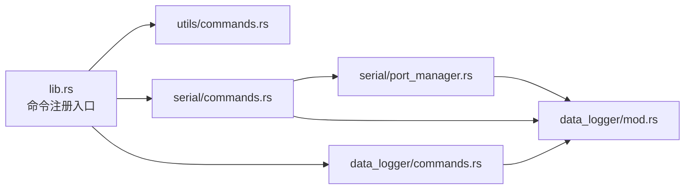

# 通用命令

<cite>
**本文引用的文件**
- [src-tauri/src/lib.rs](file://src-tauri/src/lib.rs)
- [src-tauri/src/main.rs](file://src-tauri/src/main.rs)
- [src-tauri/src/utils/mod.rs](file://src-tauri/src/utils/mod.rs)
- [src-tauri/src/utils/commands.rs](file://src-tauri/src/utils/commands.rs)
- [src-tauri/src/utils/config.rs](file://src-tauri/src/utils/config.rs)
- [src-tauri/src/utils/logger.rs](file://src-tauri/src/utils/logger.rs)
- [src-tauri/src/serial/commands.rs](file://src-tauri/src/serial/commands.rs)
- [src-tauri/src/serial/port_manager.rs](file://src-tauri/src/serial/port_manager.rs)
- [src-tauri/src/data_logger/commands.rs](file://src-tauri/src/data_logger/commands.rs)
- [src-tauri/src/data_logger/mod.rs](file://src-tauri/src/data_logger/mod.rs)
- [src-tauri/Cargo.toml](file://src-tauri/Cargo.toml)
- [src-tauri/tauri.conf.json](file://src-tauri/tauri.conf.json)
</cite>

## 目录
1. [简介](#简介)
2. [项目结构](#项目结构)
3. [核心组件](#核心组件)
4. [架构总览](#架构总览)
5. [详细组件分析](#详细组件分析)
6. [依赖关系分析](#依赖关系分析)
7. [性能考虑](#性能考虑)
8. [故障排查指南](#故障排查指南)
9. [结论](#结论)
10. [附录：命令扩展开发指南](#附录命令扩展开发指南)

## 简介
本文件面向 KonSerial 的“通用命令”模块，系统性梳理命令系统的架构设计与实现细节，覆盖命令注册、路由与执行机制；详解系统信息查询、文件操作、网络状态检查等通用命令的实现方式；阐述命令参数的验证、类型转换与错误处理；解释命令执行的权限控制、安全检查与异常捕获；并提供命令扩展的开发指南与前后端通信协议说明。

## 项目结构
KonSerial 使用 Tauri v2 作为桌面应用框架，Rust 在后端提供命令接口，Vue 在前端发起调用并通过事件通道接收数据。命令以 #[tauri::command] 形式声明，统一在 lib.rs 中集中注册，随后由 Tauri 的 invoke_handler 分发到对应实现。

图表来源
- [src-tauri/src/lib.rs:56-80](file://src-tauri/src/lib.rs#L56-L80)
- [src-tauri/src/utils/commands.rs:1-31](file://src-tauri/src/utils/commands.rs#L1-L31)
- [src-tauri/src/serial/commands.rs:1-129](file://src-tauri/src/serial/commands.rs#L1-L129)
- [src-tauri/src/data_logger/commands.rs:1-49](file://src-tauri/src/data_logger/commands.rs#L1-L49)
- [src-tauri/src/utils/config.rs:1-176](file://src-tauri/src/utils/config.rs#L1-L176)
- [src-tauri/src/serial/port_manager.rs:1-402](file://src-tauri/src/serial/port_manager.rs#L1-L402)
- [src-tauri/src/data_logger/mod.rs:1-273](file://src-tauri/src/data_logger/mod.rs#L1-L273)

章节来源
- [src-tauri/src/lib.rs:17-83](file://src-tauri/src/lib.rs#L17-L83)
- [src-tauri/src/main.rs:1-7](file://src-tauri/src/main.rs#L1-L7)

## 核心组件
- 命令注册与分发
  - 在 lib.rs 中通过 invoke_handler 将命令集中注册，前端通过 Tauri 的 invoke 机制调用。
  - 通用命令包括：配置加载/保存、默认配置路径获取。
  - 串口命令包括：枚举串口、刷新串口、打开/关闭串口、发送数据、查询连接状态、全局运行时信息等。
  - 数据日志命令包括：会话列表、会话数据查询、删除会话、导出 CSV。
- 状态与依赖注入
  - 通过 manage 注入全局状态：串口管理器 PortManager、数据日志器 DataLogger。
  - 命令通过 State 或 AppHandle 获取这些状态，实现跨命令共享与协作。
- 类型与序列化
  - 大量结构体使用 serde 的 Serialize/Deserialize，保证与前端的 JSON 互操作。
- 错误处理
  - 命令返回 Result<T, String>，错误以字符串形式传递至前端，便于统一处理与提示。

章节来源
- [src-tauri/src/lib.rs:47-82](file://src-tauri/src/lib.rs#L47-L82)
- [src-tauri/src/utils/commands.rs:1-31](file://src-tauri/src/utils/commands.rs#L1-L31)
- [src-tauri/src/serial/commands.rs:1-129](file://src-tauri/src/serial/commands.rs#L1-L129)
- [src-tauri/src/data_logger/commands.rs:1-49](file://src-tauri/src/data_logger/commands.rs#L1-L49)

## 架构总览
下图展示命令从前端到后端的调用链路，以及关键依赖关系：

图表来源
- [src-tauri/src/lib.rs:56-80](file://src-tauri/src/lib.rs#L56-L80)
- [src-tauri/src/serial/commands.rs:42-59](file://src-tauri/src/serial/commands.rs#L42-L59)
- [src-tauri/src/data_logger/commands.rs:8-13](file://src-tauri/src/data_logger/commands.rs#L8-L13)

## 详细组件分析

### 通用命令：配置管理
- 命令清单
  - 加载配置：根据可选路径加载配置，失败时返回错误字符串。
  - 保存配置：可选目标路径，保存前补全路径字段，失败返回错误字符串。
  - 获取默认配置路径：返回跨平台默认配置路径字符串。
- 参数与返回
  - 参数类型：Option<String>、AppConfig 结构体。
  - 返回类型：Result<T, String>，其中 T 为具体结果类型。
- 错误处理
  - 文件读写、JSON 序列化/反序列化错误均映射为字符串错误。
- 安全与权限
  - 仅访问本地文件系统，遵循默认配置路径策略，避免越权写入。

章节来源
- [src-tauri/src/utils/commands.rs:1-31](file://src-tauri/src/utils/commands.rs#L1-L31)
- [src-tauri/src/utils/config.rs:65-175](file://src-tauri/src/utils/config.rs#L65-L175)

### 串口命令：系统信息与设备交互
- 命令清单
  - 枚举串口：返回可用串口名称列表。
  - 获取串口详情：返回串口类型等简要信息。
  - 刷新串口列表：异步刷新并返回详细 PortInfo。
  - 打开串口：基于完整配置建立连接，注入 AppHandle 以便事件推送。
  - 关闭串口/全部关闭：优雅停止读取循环并结束会话。
  - 发送数据：向指定连接写入字节流，统计发送字节数。
  - 查询连接状态：获取单连接或全部连接的运行时信息。
  - 全局运行时信息：汇总可用串口与活跃连接。
  - 连接状态检查：判断指定连接是否处于已连接状态。
- 参数与返回
  - 大多数命令使用 State 注入 PortManager，部分命令携带 AppHandle。
  - 返回类型统一为 Result<T, String>。
- 错误处理
  - 串口打开失败、写入失败、连接不存在等情况均返回错误字符串。
- 安全与权限
  - 串口操作受系统权限限制，命令不进行额外权限校验，错误直接透传。

图表来源
- [src-tauri/src/serial/commands.rs:49-59](file://src-tauri/src/serial/commands.rs#L49-L59)
- [src-tauri/src/serial/port_manager.rs:196-272](file://src-tauri/src/serial/port_manager.rs#L196-L272)
- [src-tauri/src/data_logger/mod.rs:115-129](file://src-tauri/src/data_logger/mod.rs#L115-L129)

章节来源
- [src-tauri/src/serial/commands.rs:1-129](file://src-tauri/src/serial/commands.rs#L1-L129)
- [src-tauri/src/serial/port_manager.rs:182-401](file://src-tauri/src/serial/port_manager.rs#L182-L401)

### 数据日志命令：会话与数据管理
- 命令清单
  - 获取会话列表：按时间倒序聚合统计。
  - 获取会话数据：支持方向过滤、分页查询。
  - 删除会话：级联删除该会话下的所有数据。
  - 导出会话为 CSV：生成文本格式的 CSV 字符串。
- 参数与返回
  - 支持可选参数（方向、limit、offset），默认值在后端设定。
  - 返回类型统一为 Result<T, String>。
- 错误处理
  - SQL 查询、准备语句、文件写入等错误统一转为字符串错误。

图表来源
- [src-tauri/src/data_logger/commands.rs:15-30](file://src-tauri/src/data_logger/commands.rs#L15-L30)
- [src-tauri/src/data_logger/mod.rs:203-244](file://src-tauri/src/data_logger/mod.rs#L203-L244)

章节来源
- [src-tauri/src/data_logger/commands.rs:1-49](file://src-tauri/src/data_logger/commands.rs#L1-L49)
- [src-tauri/src/data_logger/mod.rs:168-271](file://src-tauri/src/data_logger/mod.rs#L168-L271)

### 命令参数验证、类型转换与错误处理
- 类型转换
  - 命令参数通过 #[tauri::command] 自动进行类型转换，支持基本类型、结构体与 Vec<u8>。
  - 结构体使用 serde 的 Serialize/Deserialize，确保与前端 JSON 格式一致。
- 参数验证
  - 对于枚举类参数（如串口校验位、流控制），在转换为底层库配置时进行匹配与默认处理。
  - 对于可选参数（如导出 CSV 的会话 ID），在命令层进行非空检查与默认值填充。
- 错误处理
  - 所有错误统一映射为 String 并通过 Result 返回，前端可据此显示错误消息或重试。

章节来源
- [src-tauri/src/serial/commands.rs:16-38](file://src-tauri/src/serial/commands.rs#L16-L38)
- [src-tauri/src/data_logger/commands.rs:15-30](file://src-tauri/src/data_logger/commands.rs#L15-L30)
- [src-tauri/src/utils/commands.rs:5-23](file://src-tauri/src/utils/commands.rs#L5-L23)

### 权限控制、安全检查与异常捕获
- 权限与安全
  - 文件系统访问：仅通过 Tauri 插件与默认路径策略进行受限访问。
  - 串口访问：受操作系统权限限制，命令不做额外校验，错误直接返回。
- 异常捕获
  - 命令层使用 Result<T, String>，避免异常传播到前端；日志模块提供统一的日志格式化输出。
- 配置与路径
  - 默认配置与数据库路径采用跨平台策略，避免硬编码与越权路径。

章节来源
- [src-tauri/src/utils/config.rs:8-16](file://src-tauri/src/utils/config.rs#L8-L16)
- [src-tauri/src/data_logger/mod.rs:11-18](file://src-tauri/src/data_logger/mod.rs#L11-L18)
- [src-tauri/src/utils/logger.rs:85-131](file://src-tauri/src/utils/logger.rs#L85-L131)

## 依赖关系分析
- 模块耦合
  - lib.rs 作为唯一入口，集中注册所有命令，降低前端与后端耦合度。
  - 串口命令依赖 PortManager，后者依赖 DataLogger；数据日志命令直接依赖 DataLogger。
- 外部依赖
  - Tauri v2 提供命令系统、状态注入与事件机制。
  - serialport 提供底层串口能力。
  - rusqlite 提供 SQLite 存储。
  - serde/serde_json 提供结构体序列化与前端互操作。

图表来源
- [src-tauri/src/lib.rs:56-80](file://src-tauri/src/lib.rs#L56-L80)
- [src-tauri/src/serial/commands.rs:1-129](file://src-tauri/src/serial/commands.rs#L1-L129)
- [src-tauri/src/data_logger/commands.rs:1-49](file://src-tauri/src/data_logger/commands.rs#L1-L49)
- [src-tauri/src/serial/port_manager.rs:1-402](file://src-tauri/src/serial/port_manager.rs#L1-L402)
- [src-tauri/src/data_logger/mod.rs:1-273](file://src-tauri/src/data_logger/mod.rs#L1-L273)

章节来源
- [src-tauri/src/lib.rs:47-82](file://src-tauri/src/lib.rs#L47-L82)
- [src-tauri/Cargo.toml:20-36](file://src-tauri/Cargo.toml#L20-L36)

## 性能考虑
- 异步与并发
  - 串口命令普遍使用 async，避免阻塞主线程；PortManager 内部使用 Arc<Mutex/_> 与 RwLock 管理并发访问。
- I/O 优化
  - SQLite 使用 WAL 模式与外键约束，提升并发与一致性；索引加速会话数据查询。
- 事件推送
  - 串口读取循环通过 Tauri 事件推送数据，避免轮询带来的 CPU 占用。
- 建议
  - 对高频查询增加分页与方向过滤，减少一次性传输大量数据。
  - 对长时间运行的串口任务，定期上报进度与统计信息。

## 故障排查指南
- 常见问题
  - 串口打开失败：检查端口占用、权限与配置参数；查看错误字符串中的具体原因。
  - 发送失败：确认连接状态、底层串口错误并检查 last_error 字段。
  - 配置读写失败：确认默认路径存在、权限允许写入；查看日志输出。
  - 数据查询为空：确认会话 ID 是否正确、方向参数是否匹配。
- 排查步骤
  - 查看后端日志输出（info/warn/error）定位错误来源。
  - 在前端打印 invoke 返回的错误字符串，结合后端日志分析。
  - 对串口命令，优先检查 PortManager 的全局运行时信息与连接状态。

章节来源
- [src-tauri/src/utils/logger.rs:85-131](file://src-tauri/src/utils/logger.rs#L85-L131)
- [src-tauri/src/serial/port_manager.rs:333-344](file://src-tauri/src/serial/port_manager.rs#L333-L344)
- [src-tauri/src/data_logger/commands.rs:15-30](file://src-tauri/src/data_logger/commands.rs#L15-L30)

## 结论
KonSerial 的通用命令模块以 Tauri 命令系统为核心，通过集中注册与状态注入实现清晰的职责分离。串口命令围绕 PortManager 展开，数据日志命令围绕 DataLogger 展开，二者协同完成数据采集、持久化与查询。整体设计具备良好的扩展性与可维护性，适合在此基础上继续扩展新的命令与功能。

## 附录：命令扩展开发指南
- 新增命令步骤
  - 在对应模块（如 utils、serial、data_logger）新增 #[tauri::command] 函数，并在 lib.rs 的 invoke_handler 中注册。
  - 若需要共享状态，使用 State 或 AppHandle 注入全局对象（如 PortManager、DataLogger）。
- 参数定义
  - 使用 serde 结构体定义复杂参数，确保与前端 JSON 一致；必要时提供默认值。
  - 对枚举类参数在命令内进行安全转换，避免非法值进入底层库。
- 返回值处理
  - 统一返回 Result<T, String>；T 必须可序列化（实现 Serialize）。
  - 错误字符串应简洁明确，便于前端展示与用户理解。
- 前端通信协议
  - 前端通过 Tauri 的 invoke(...) 调用命令，等待 Promise 解析；错误通过 catch 捕获并处理。
  - 串口数据通过 Tauri 事件通道推送（如 "serial-data"），前端监听事件更新 UI。
- 安全与权限
  - 遵循默认路径策略，避免硬编码敏感路径；对文件系统与串口操作，尊重系统权限。
  - 对外部输入进行最小化验证，错误统一上抛，避免泄露内部细节。

章节来源
- [src-tauri/src/lib.rs:56-80](file://src-tauri/src/lib.rs#L56-L80)
- [src-tauri/src/serial/commands.rs:1-129](file://src-tauri/src/serial/commands.rs#L1-L129)
- [src-tauri/src/data_logger/commands.rs:1-49](file://src-tauri/src/data_logger/commands.rs#L1-L49)
- [src-tauri/tauri.conf.json:24-33](file://src-tauri/tauri.conf.json#L24-L33)