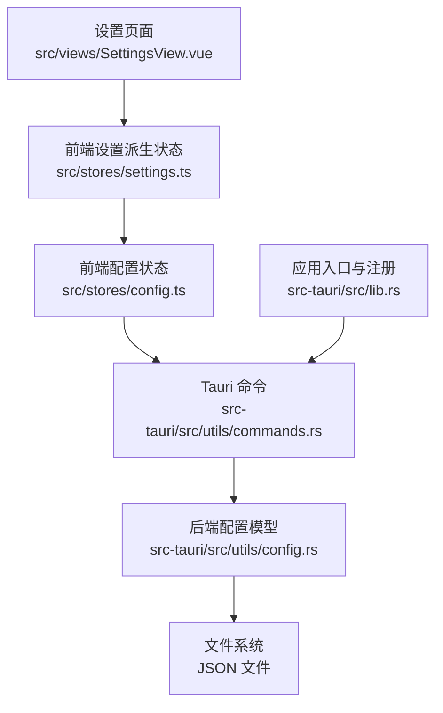
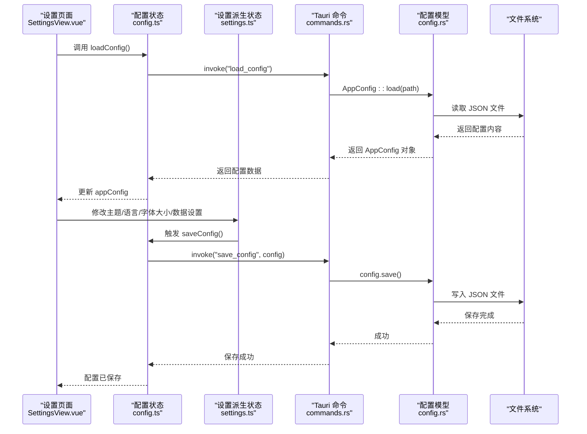
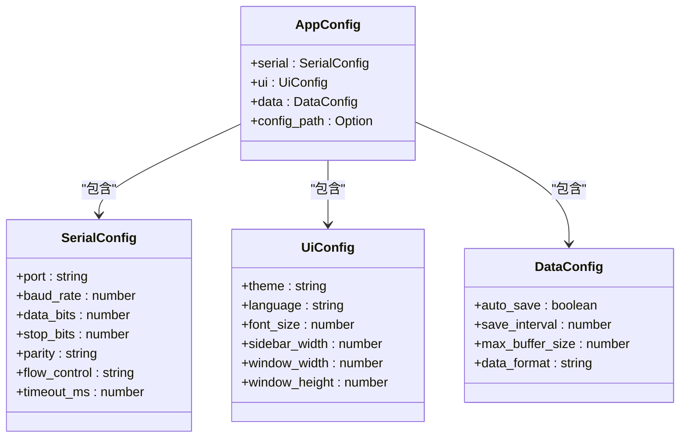
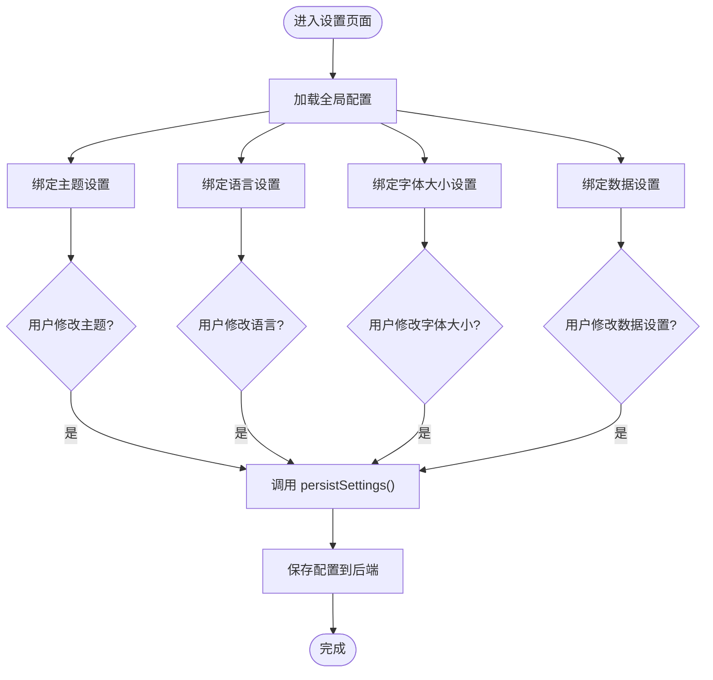
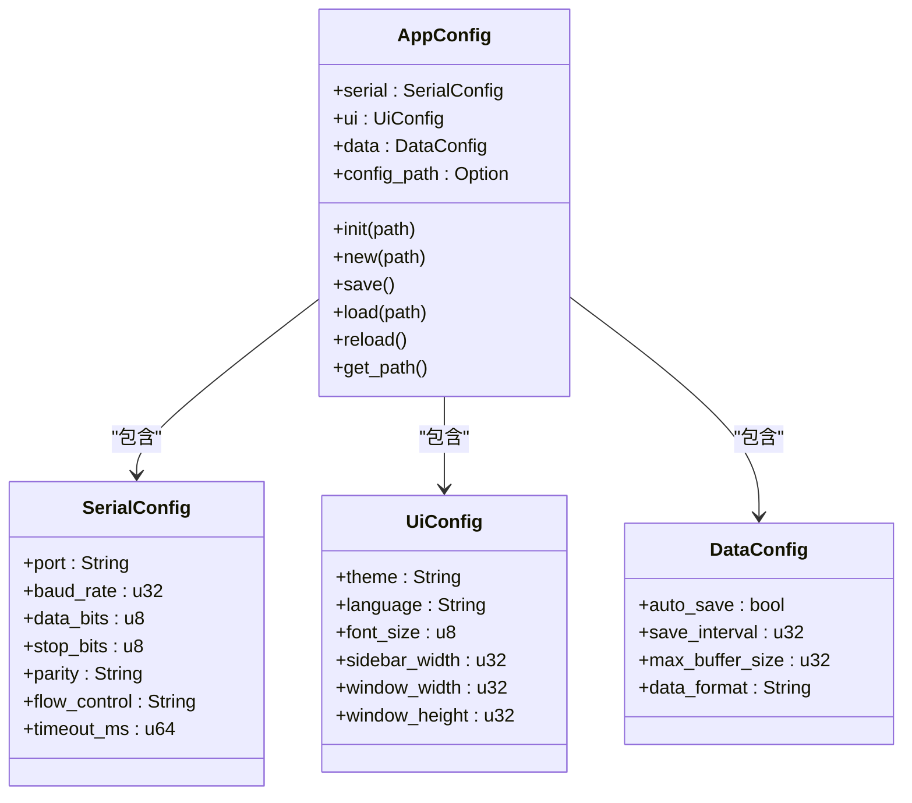
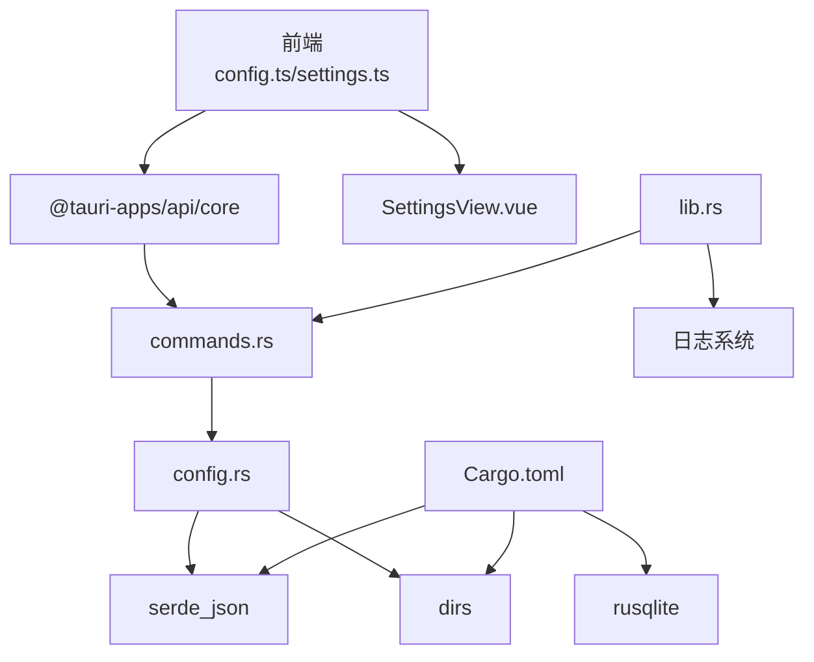

# 配置管理模块

<cite>
**本文档引用的文件**
- [src/stores/config.ts](file://src/stores/config.ts)
- [src/stores/settings.ts](file://src/stores/settings.ts)
- [src/views/SettingsView.vue](file://src/views/SettingsView.vue)
- [src-tauri/src/utils/config.rs](file://src-tauri/src/utils/config.rs)
- [src-tauri/src/utils/commands.rs](file://src-tauri/src/utils/commands.rs)
- [src-tauri/src/lib.rs](file://src-tauri/src/lib.rs)
- [src-tauri/Cargo.toml](file://src-tauri/Cargo.toml)
- [src-tauri/tauri.conf.json](file://src-tauri/tauri.conf.json)
- [DESIGN.md](file://DESIGN.md)
</cite>

## 目录
1. [简介](#简介)
2. [项目结构](#项目结构)
3. [核心组件](#核心组件)
4. [架构总览](#架构总览)
5. [详细组件分析](#详细组件分析)
6. [依赖关系分析](#依赖关系分析)
7. [性能考量](#性能考量)
8. [故障排查指南](#故障排查指南)
9. [结论](#结论)

## 简介
本文件针对 KonSerial 的配置管理模块进行深入技术文档整理，涵盖配置文件的存储结构、读取机制、验证规则、数据类型与默认值、动态更新策略、版本管理与迁移、缓存与性能优化、配置项的增删改查示例、变更通知机制、配置与应用状态同步方式以及错误恢复策略。文档面向不同技术背景的读者，既提供高层概览也包含代码级细节与可视化图示。

## 项目结构
配置管理模块横跨前端与后端，采用“前端响应式状态 + 后端持久化存储”的分层设计：
- 前端负责 UI 展示与即时响应式更新，并通过 Tauri 命令与后端交互
- 后端负责配置文件的读写、默认值设定、路径解析与错误处理
- 前后端通过 JSON 结构进行数据交换，确保跨平台一致性

**图表来源**
- [src/stores/config.ts:1-89](file://src/stores/config.ts#L1-L89)
- [src/stores/settings.ts:1-125](file://src/stores/settings.ts#L1-L125)
- [src/views/SettingsView.vue:1-383](file://src/views/SettingsView.vue#L1-L383)
- [src-tauri/src/utils/commands.rs:1-31](file://src-tauri/src/utils/commands.rs#L1-L31)
- [src-tauri/src/utils/config.rs:1-176](file://src-tauri/src/utils/config.rs#L1-L176)
- [src-tauri/src/lib.rs:1-84](file://src-tauri/src/lib.rs#L1-L84)

**章节来源**
- [src/stores/config.ts:1-89](file://src/stores/config.ts#L1-L89)
- [src/stores/settings.ts:1-125](file://src/stores/settings.ts#L1-L125)
- [src/views/SettingsView.vue:1-383](file://src/views/SettingsView.vue#L1-L383)
- [src-tauri/src/utils/commands.rs:1-31](file://src-tauri/src/utils/commands.rs#L1-L31)
- [src-tauri/src/utils/config.rs:1-176](file://src-tauri/src/utils/config.rs#L1-L176)
- [src-tauri/src/lib.rs:1-84](file://src-tauri/src/lib.rs#L1-L84)

## 核心组件
- 前端配置状态与命令封装：提供串口、UI、数据三类配置的读取、保存与部分字段的即时更新能力
- 前端设置派生状态：从全局配置派生主题、语言、字体大小、数据相关设置，支持即时生效与持久化
- 后端配置模型：定义配置结构、默认值、序列化/反序列化、路径解析与文件读写
- Tauri 命令：封装前端与后端之间的配置读写接口，支持自定义路径
- 应用入口注册：在应用启动时初始化日志与配置路径，注册配置相关命令

**章节来源**
- [src/stores/config.ts:1-89](file://src/stores/config.ts#L1-L89)
- [src/stores/settings.ts:1-125](file://src/stores/settings.ts#L1-L125)
- [src-tauri/src/utils/config.rs:1-176](file://src-tauri/src/utils/config.rs#L1-L176)
- [src-tauri/src/utils/commands.rs:1-31](file://src-tauri/src/utils/commands.rs#L1-L31)
- [src-tauri/src/lib.rs:1-84](file://src-tauri/src/lib.rs#L1-L84)

## 架构总览
配置管理的整体流程如下：
- 应用启动时解析默认配置路径，初始化配置对象
- 前端在设置页面加载配置，用户修改后通过命令保存至后端
- 后端将配置序列化为 JSON 并写入文件系统
- 前端响应式状态与 UI 即时反映配置变更

**图表来源**
- [src/views/SettingsView.vue:1-383](file://src/views/SettingsView.vue#L1-L383)
- [src/stores/config.ts:1-89](file://src/stores/config.ts#L1-L89)
- [src/stores/settings.ts:1-125](file://src/stores/settings.ts#L1-L125)
- [src-tauri/src/utils/commands.rs:1-31](file://src-tauri/src/utils/commands.rs#L1-L31)
- [src-tauri/src/utils/config.rs:1-176](file://src-tauri/src/utils/config.rs#L1-L176)

## 详细组件分析

### 前端配置状态与命令封装（config.ts）
- 定义配置接口：串口配置、UI 配置、数据配置
- 全局配置状态：使用响应式 ref 存储 AppConfig
- 加载与保存：通过 invoke 调用后端命令，返回 Promise
- 部分字段的即时更新：如波特率、串口号、主题等，更新后自动触发保存

**图表来源**
- [src/stores/config.ts:6-36](file://src/stores/config.ts#L6-L36)

**章节来源**
- [src/stores/config.ts:1-89](file://src/stores/config.ts#L1-L89)

### 前端设置派生状态（settings.ts）
- 主题：支持 light/dark/auto，自动监听系统偏好
- 字体大小：响应式计算并应用到 CSS 变量
- 语言：中英切换，配合 Naive UI 本地化
- 数据设置：自动保存开关、保存间隔、最大缓冲区大小
- 持久化：提供 persistSettings() 统一保存当前设置

**图表来源**
- [src/stores/settings.ts:1-125](file://src/stores/settings.ts#L1-L125)
- [src/views/SettingsView.vue:1-383](file://src/views/SettingsView.vue#L1-L383)

**章节来源**
- [src/stores/settings.ts:1-125](file://src/stores/settings.ts#L1-L125)
- [src/views/SettingsView.vue:1-383](file://src/views/SettingsView.vue#L1-L383)

### 后端配置模型与文件存储（config.rs）
- 跨平台默认配置路径解析：Linux/macOS/Windows 下的用户配置目录
- 配置结构与默认值：
  - 串口：波特率、数据位、停止位、校验、流控、超时
  - UI：主题、语言、字体大小、侧边栏宽度、窗口宽高
  - 数据：自动保存、保存间隔、最大缓冲区、数据格式
- 初始化策略：若配置文件存在则加载，否则创建默认配置并保存
- 读写方法：load/save/reload，支持从已知路径重新加载
- 路径管理：保存 config_path 以便后续写入

**图表来源**
- [src-tauri/src/utils/config.rs:18-63](file://src-tauri/src/utils/config.rs#L18-L63)

**章节来源**
- [src-tauri/src/utils/config.rs:1-176](file://src-tauri/src/utils/config.rs#L1-L176)

### Tauri 命令封装（commands.rs）
- load_config(path?): 从指定路径或默认路径加载配置
- save_config(config, path?): 将配置保存到指定路径或默认路径
- get_config_path(): 返回默认配置路径字符串
- 错误处理：将后端错误转换为字符串返回前端

**章节来源**
- [src-tauri/src/utils/commands.rs:1-31](file://src-tauri/src/utils/commands.rs#L1-L31)

### 应用入口与命令注册（lib.rs）
- 初始化日志系统
- 解析默认配置路径并初始化配置对象
- 注册配置相关命令（load_config/save_config/get_config_path）
- 注册其他业务命令（串口、数据日志等）

**章节来源**
- [src-tauri/src/lib.rs:1-84](file://src-tauri/src/lib.rs#L1-L84)

## 依赖关系分析
- 前端依赖 Tauri API 进行命令调用
- 后端依赖 serde_json 进行序列化/反序列化
- 路径解析依赖 dirs crate
- 日志系统依赖 log/env_logger/colored
- SQLite 依赖 rusqlite（与配置无直接耦合，但影响整体数据存储生态）

**图表来源**
- [src-tauri/Cargo.toml:20-36](file://src-tauri/Cargo.toml#L20-L36)
- [src-tauri/src/utils/commands.rs:1](file://src-tauri/src/utils/commands.rs#L1)
- [src-tauri/src/utils/config.rs:4](file://src-tauri/src/utils/config.rs#L4)
- [src-tauri/src/lib.rs:10-11](file://src-tauri/src/lib.rs#L10-L11)

**章节来源**
- [src-tauri/Cargo.toml:1-40](file://src-tauri/Cargo.toml#L1-L40)
- [src-tauri/src/utils/commands.rs:1-31](file://src-tauri/src/utils/commands.rs#L1-L31)
- [src-tauri/src/utils/config.rs:1-176](file://src-tauri/src/utils/config.rs#L1-L176)
- [src-tauri/src/lib.rs:1-84](file://src-tauri/src/lib.rs#L1-L84)

## 性能考量
- 前端响应式更新：通过 ref/computed/watch 实现局部状态更新，避免全量刷新
- 延迟保存策略：对频繁变更的设置（如字体大小）建议在用户停止输入或离开页面时批量保存
- 文件写入优化：后端在保存前确保父目录存在，减少 IO 失败概率；使用紧凑 JSON 序列化
- 跨平台路径解析：使用 dirs crate 统一路径，避免手动拼接导致的性能与兼容性问题
- 日志级别：生产环境建议降低日志级别，减少 I/O 压力

[本节为通用性能建议，不直接分析特定文件，故无“章节来源”]

## 故障排查指南
- 配置文件读取失败
  - 检查默认配置路径是否存在且可读
  - 查看后端日志输出，确认加载/保存错误信息
  - 前端捕获 invoke 错误并提示用户
- 配置文件写入失败
  - 确认目标目录权限
  - 检查磁盘空间
  - 使用 get_config_path() 验证路径
- 默认值未生效
  - 检查 serde default 标注是否正确
  - 确认旧版配置缺少字段时的兼容行为
- 配置未持久化
  - 确认调用了 persistSettings()/saveConfig()
  - 检查前端设置派生状态是否正确绑定到全局配置

**章节来源**
- [src-tauri/src/utils/config.rs:65-94](file://src-tauri/src/utils/config.rs#L65-L94)
- [src-tauri/src/utils/commands.rs:3-11](file://src-tauri/src/utils/commands.rs#L3-L11)
- [src-tauri/src/lib.rs:25-45](file://src-tauri/src/lib.rs#L25-L45)

## 结论
KonSerial 的配置管理模块通过清晰的前后端分工实现了跨平台、易扩展的配置体系：前端负责即时响应与用户体验，后端负责可靠存储与默认值管理。当前实现已覆盖基本的读取、保存与默认值策略，建议后续增强版本管理与迁移机制、完善配置验证与回滚策略，并引入更细粒度的变更通知与缓存优化，以进一步提升稳定性与可维护性。