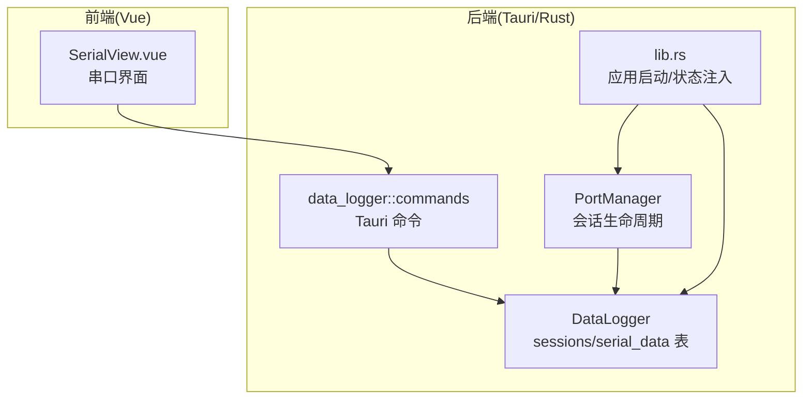
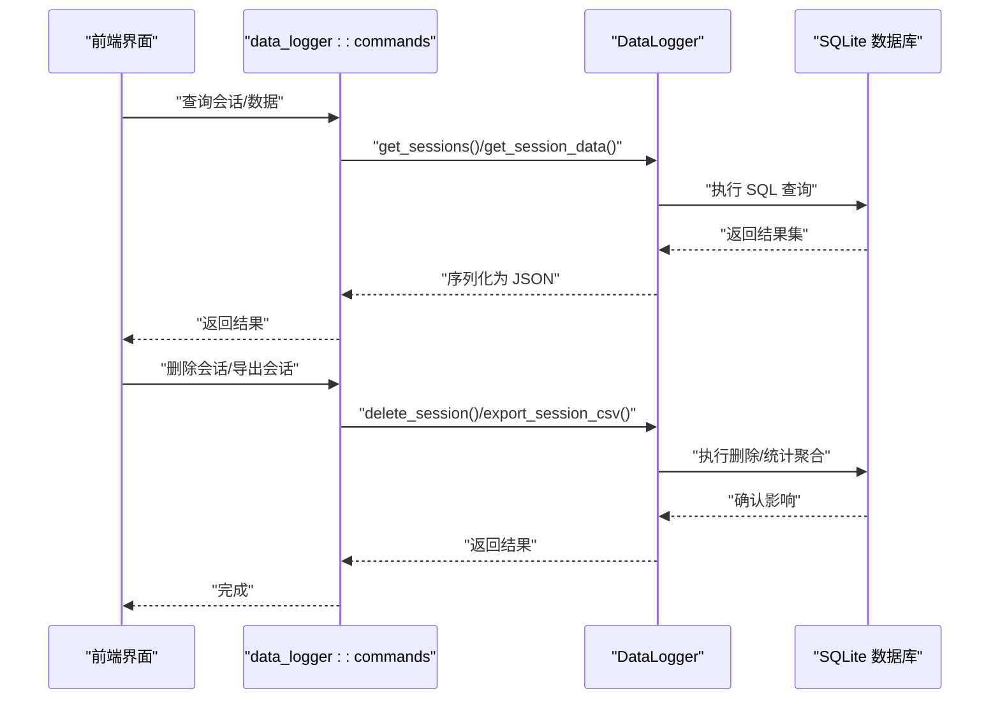
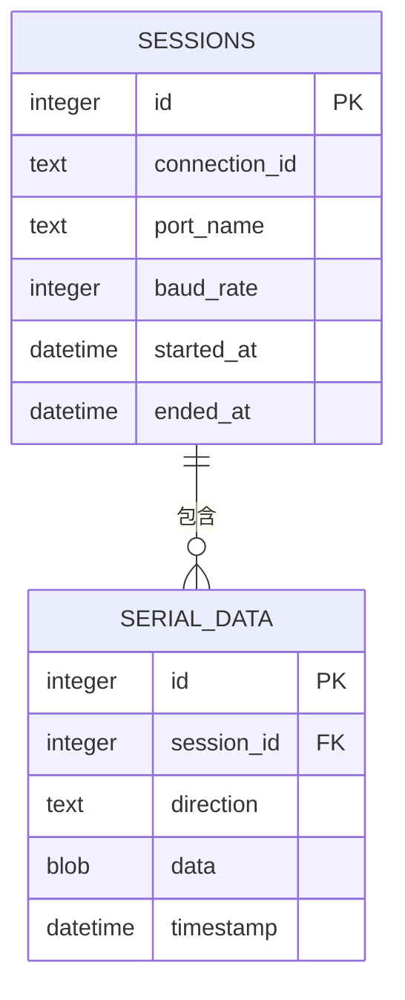
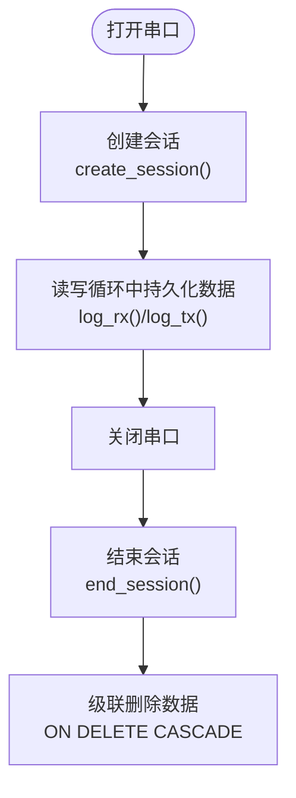
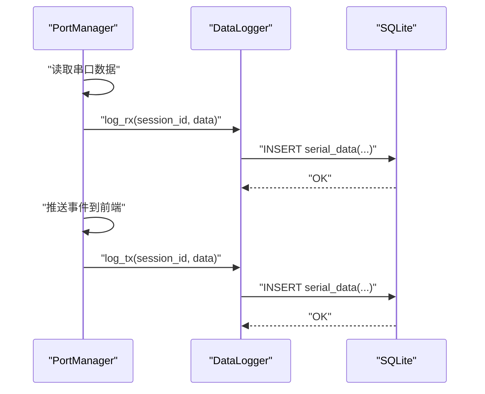
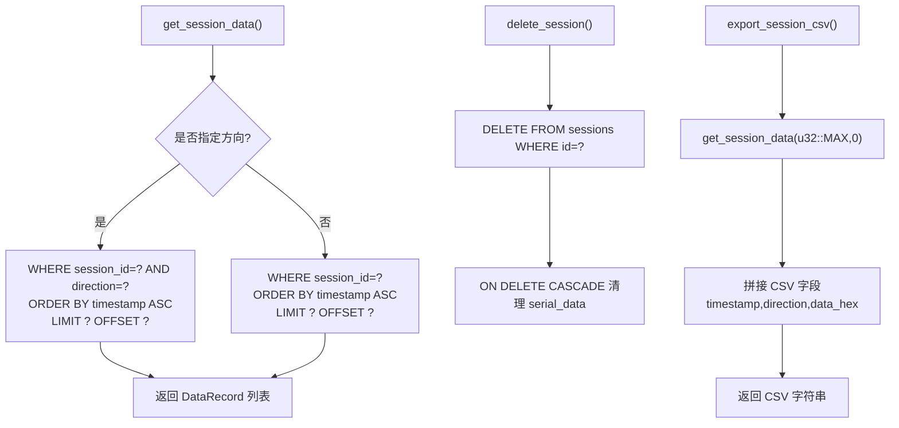
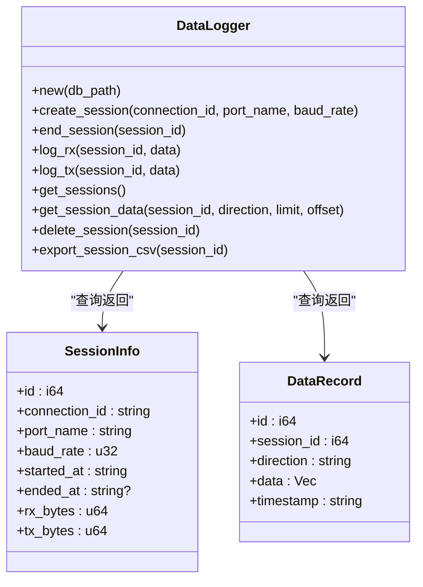
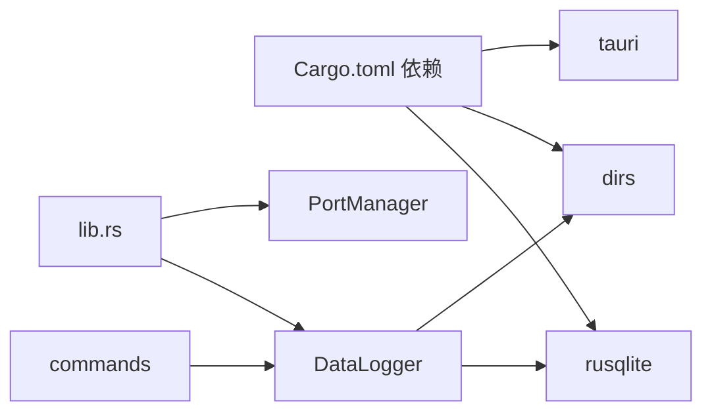

# 数据记录模块

<cite>
**本文引用的文件**
- [src-tauri/src/data_logger/mod.rs](file://src-tauri/src/data_logger/mod.rs)
- [src-tauri/src/data_logger/commands.rs](file://src-tauri/src/data_logger/commands.rs)
- [src-tauri/src/lib.rs](file://src-tauri/src/lib.rs)
- [src-tauri/src/serial/port_manager.rs](file://src-tauri/src/serial/port_manager.rs)
- [src-tauri/Cargo.toml](file://src-tauri/Cargo.toml)
- [DESIGN.md](file://DESIGN.md)
</cite>

## 目录
1. [简介](#简介)
2. [项目结构](#项目结构)
3. [核心组件](#核心组件)
4. [架构总览](#架构总览)
5. [详细组件分析](#详细组件分析)
6. [依赖关系分析](#依赖关系分析)
7. [性能考量](#性能考量)
8. [故障排查指南](#故障排查指南)
9. [结论](#结论)
10. [附录](#附录)

## 简介
本文件面向 KonSerial 的数据记录模块，围绕基于 SQLite 的数据存储架构展开，系统性说明数据库表结构设计、索引策略与查询优化；详解会话管理机制（创建、数据采集、生命周期）；阐述数据记录的存储流程（原始数据接收、格式化处理与持久化）；解释 commands.rs 中数据查询、删除与导出命令的实现；并提供数据备份策略、数据库维护与性能调优建议，以及数据迁移与版本兼容性处理方案。

## 项目结构
数据记录模块位于后端 Rust 子项目中，核心文件包括：
- 数据库与会话/数据模型：data_logger/mod.rs
- Tauri 命令接口：data_logger/commands.rs
- 应用启动与全局状态注入：src/lib.rs
- 串口管理与会话生命周期联动：serial/port_manager.rs
- 依赖声明：Cargo.toml
- 设计文档：DESIGN.md

**图表来源**
- [src-tauri/src/data_logger/mod.rs:1-273](file://src-tauri/src/data_logger/mod.rs#L1-L273)
- [src-tauri/src/data_logger/commands.rs:1-49](file://src-tauri/src/data_logger/commands.rs#L1-L49)
- [src-tauri/src/lib.rs:1-84](file://src-tauri/src/lib.rs#L1-L84)
- [src-tauri/src/serial/port_manager.rs:1-402](file://src-tauri/src/serial/port_manager.rs#L1-L402)

**章节来源**
- [DESIGN.md:101-139](file://DESIGN.md#L101-L139)
- [src-tauri/src/lib.rs:1-84](file://src-tauri/src/lib.rs#L1-L84)

## 核心组件
- DataLogger：线程安全的 SQLite 管理器，负责数据库初始化、表结构创建、会话与数据的增删改查、导出等。
- SessionInfo/DataRecord：面向前端的序列化数据模型。
- PortManager：串口管理器，在打开/关闭串口时驱动 DataLogger 的会话创建与结束，并在读写循环中持久化 RX/TX 数据。
- data_logger::commands：Tauri 命令层，封装 DataLogger 的查询、删除、导出能力。

**章节来源**
- [src-tauri/src/data_logger/mod.rs:20-110](file://src-tauri/src/data_logger/mod.rs#L20-L110)
- [src-tauri/src/serial/port_manager.rs:160-180](file://src-tauri/src/serial/port_manager.rs#L160-L180)
- [src-tauri/src/data_logger/commands.rs:1-49](file://src-tauri/src/data_logger/commands.rs#L1-L49)

## 架构总览
数据记录模块的运行链路如下：
- 应用启动时初始化 DataLogger 并注入全局状态。
- 打开串口时，PortManager 调用 DataLogger.create_session 创建会话并记录 session_id。
- 串口读取循环中，每批数据到达即持久化到 serial_data 表（RX/TX 分别记录）。
- 关闭串口时，PortManager 调用 DataLogger.end_session 结束会话。
- 前端通过 Tauri 命令调用 DataLogger 的查询、删除、导出接口。

**图表来源**
- [src-tauri/src/data_logger/commands.rs:7-48](file://src-tauri/src/data_logger/commands.rs#L7-L48)
- [src-tauri/src/data_logger/mod.rs:166-272](file://src-tauri/src/data_logger/mod.rs#L166-L272)

## 详细组件分析

### 数据库表结构与索引策略
- sessions 表：记录一次串口会话的元信息，包含连接标识、端口名、波特率、开始/结束时间等。
- serial_data 表：记录每次收发的数据，包含会话外键、方向（TX/RX）、原始字节数据、时间戳。
- 索引：对 serial_data(session_id, timestamp) 建立复合索引，支撑按会话与时间排序的高效查询。

**图表来源**
- [src-tauri/src/data_logger/mod.rs:84-106](file://src-tauri/src/data_logger/mod.rs#L84-L106)

**章节来源**
- [src-tauri/src/data_logger/mod.rs:84-106](file://src-tauri/src/data_logger/mod.rs#L84-L106)

### 会话管理机制
- 创建会话：打开串口时由 PortManager 调用 DataLogger.create_session，返回 session_id。
- 生命周期：串口关闭时由 PortManager 调用 DataLogger.end_session。
- 外键约束：sessions.id 作为 serial_data.session_id 的外键，并启用 ON DELETE CASCADE，删除会话将级联删除其全部数据。

**图表来源**
- [src-tauri/src/serial/port_manager.rs:196-272](file://src-tauri/src/serial/port_manager.rs#L196-L272)
- [src-tauri/src/data_logger/mod.rs:115-140](file://src-tauri/src/data_logger/mod.rs#L115-L140)

**章节来源**
- [src-tauri/src/serial/port_manager.rs:196-331](file://src-tauri/src/serial/port_manager.rs#L196-L331)
- [src-tauri/src/data_logger/mod.rs:115-140](file://src-tauri/src/data_logger/mod.rs#L115-L140)

### 数据记录存储流程
- 接收数据：PortManager.read_loop 在独立线程中读取串口数据，累计字节数并持久化到 SQLite。
- 写入方向：RX 数据调用 log_rx，TX 数据调用 log_tx。
- 时间戳：使用数据库内置时间函数生成本地时间戳。
- 原始字节：以 BLOB 形式存储，保证无损。

**图表来源**
- [src-tauri/src/serial/port_manager.rs:274-303](file://src-tauri/src/serial/port_manager.rs#L274-L303)
- [src-tauri/src/data_logger/mod.rs:144-164](file://src-tauri/src/data_logger/mod.rs#L144-L164)

**章节来源**
- [src-tauri/src/serial/port_manager.rs:274-303](file://src-tauri/src/serial/port_manager.rs#L274-L303)
- [src-tauri/src/data_logger/mod.rs:144-164](file://src-tauri/src/data_logger/mod.rs#L144-L164)

### 查询、删除与导出命令实现
- 查询会话列表：聚合每个会话的 RX/TX 字节统计，按开始时间倒序。
- 查询会话数据：支持按方向过滤、分页（limit/offset），按时间升序返回。
- 删除会话：删除 sessions 记录，触发级联删除 serial_data。
- 导出 CSV：将指定会话数据转为 CSV 字符串（时间戳、方向、十六进制数据）。

**图表来源**
- [src-tauri/src/data_logger/mod.rs:168-271](file://src-tauri/src/data_logger/mod.rs#L168-L271)
- [src-tauri/src/data_logger/commands.rs:7-48](file://src-tauri/src/data_logger/commands.rs#L7-L48)

**章节来源**
- [src-tauri/src/data_logger/mod.rs:168-271](file://src-tauri/src/data_logger/mod.rs#L168-L271)
- [src-tauri/src/data_logger/commands.rs:7-48](file://src-tauri/src/data_logger/commands.rs#L7-L48)

### 数据模型类图

**图表来源**
- [src-tauri/src/data_logger/mod.rs:22-110](file://src-tauri/src/data_logger/mod.rs#L22-L110)

**章节来源**
- [src-tauri/src/data_logger/mod.rs:22-110](file://src-tauri/src/data_logger/mod.rs#L22-L110)

## 依赖关系分析
- rusqlite：SQLite 驱动，提供连接、事务、SQL 执行能力。
- dirs：跨平台获取配置目录，确定数据库默认路径。
- 外键与 WAL：启用外键约束与 WAL 模式，提升并发与一致性。
- Tauri 命令：通过 data_logger::commands 暴露查询、删除、导出接口。

**图表来源**
- [src-tauri/Cargo.toml:20-36](file://src-tauri/Cargo.toml#L20-L36)
- [src-tauri/src/lib.rs:13-43](file://src-tauri/src/lib.rs#L13-L43)
- [src-tauri/src/data_logger/mod.rs:6-18](file://src-tauri/src/data_logger/mod.rs#L6-L18)

**章节来源**
- [src-tauri/Cargo.toml:20-36](file://src-tauri/Cargo.toml#L20-L36)
- [src-tauri/src/lib.rs:13-43](file://src-tauri/src/lib.rs#L13-L43)

## 性能考量
- WAL 模式与同步级别：初始化时设置 WAL 模式与同步级别，兼顾写入吞吐与可靠性。
- 复合索引：对 (session_id, timestamp) 建立索引，显著降低按会话分页查询的成本。
- 分页查询：查询接口支持 limit/offset，避免一次性返回大量数据。
- BLOB 存储：原始字节以 BLOB 存储，减少转换开销。
- 并发访问：DataLogger 内部使用互斥锁保护连接，避免并发写入竞争。
- 读写分离：读取循环在独立线程中进行，避免阻塞主线程。

**章节来源**
- [src-tauri/src/data_logger/mod.rs:76-106](file://src-tauri/src/data_logger/mod.rs#L76-L106)
- [src-tauri/src/serial/port_manager.rs:274-303](file://src-tauri/src/serial/port_manager.rs#L274-L303)

## 故障排查指南
- 数据库初始化失败：检查默认数据库路径是否存在可写权限，确认目录创建与连接打开成功。
- 查询结果为空：确认会话是否已创建并尚未结束；检查分页参数是否过大。
- 删除后仍有数据残留：确认外键约束已启用且删除语句正确执行。
- 导出 CSV 异常：确认目标会话存在且数据量在合理范围内。
- 串口读写异常：检查 PortManager 的读取循环是否正常运行，确认 session_id 传入正确。

**章节来源**
- [src-tauri/src/data_logger/mod.rs:64-111](file://src-tauri/src/data_logger/mod.rs#L64-L111)
- [src-tauri/src/data_logger/mod.rs:248-271](file://src-tauri/src/data_logger/mod.rs#L248-L271)
- [src-tauri/src/serial/port_manager.rs:305-331](file://src-tauri/src/serial/port_manager.rs#L305-L331)

## 结论
数据记录模块以 SQLite 为核心，通过合理的表结构与索引设计、严格的会话生命周期管理、以及清晰的命令接口，实现了稳定高效的串口数据持久化与查询能力。配合 WAL 模式与外键级联删除，既保证了数据一致性，也简化了维护成本。建议在生产环境中定期备份数据库文件，并根据数据规模调整分页参数与索引策略。

## 附录

### 数据备份策略
- 文件级备份：定期复制数据库文件至安全位置。
- 增量备份：结合 WAL 文件特性，可在应用空闲时段进行归档。
- 自动化脚本：通过系统计划任务或应用内定时任务执行备份。

### 数据库维护
- 索引健康：定期检查索引使用情况，必要时重建索引。
- 空间回收：在大量删除后可执行数据库清理（如 VACUUM，注意仅在低峰时段执行）。
- 参数调优：根据硬件与负载调整 WAL 与同步级别。

### 性能调优方法
- 分页参数：合理设置 limit/offset，避免超大数据集一次性传输。
- 查询优化：优先使用复合索引字段组合进行过滤与排序。
- 并发控制：避免在 UI 线程直接执行数据库操作，保持响应流畅。

### 数据迁移与版本兼容
- 版本升级：新增表或列时，提供迁移脚本，先升级 schema 再回填数据。
- 兼容性：对外暴露的命令与数据模型保持向后兼容，避免破坏前端契约。
- 回滚策略：迁移前备份数据库，失败时可快速回滚。