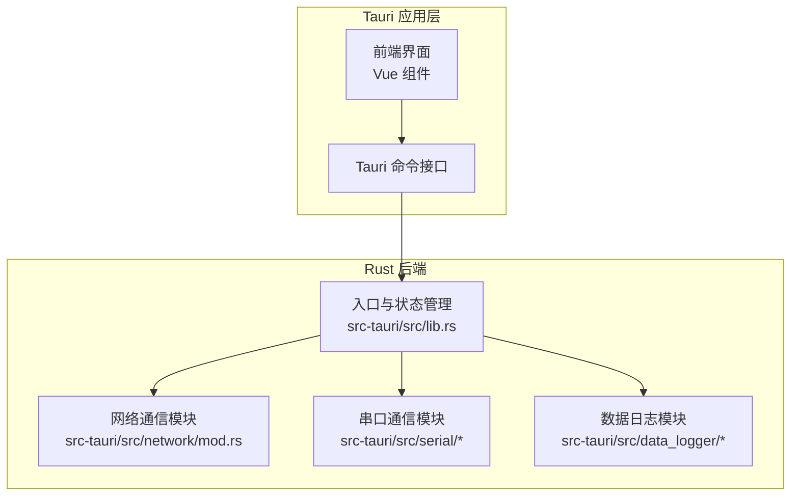
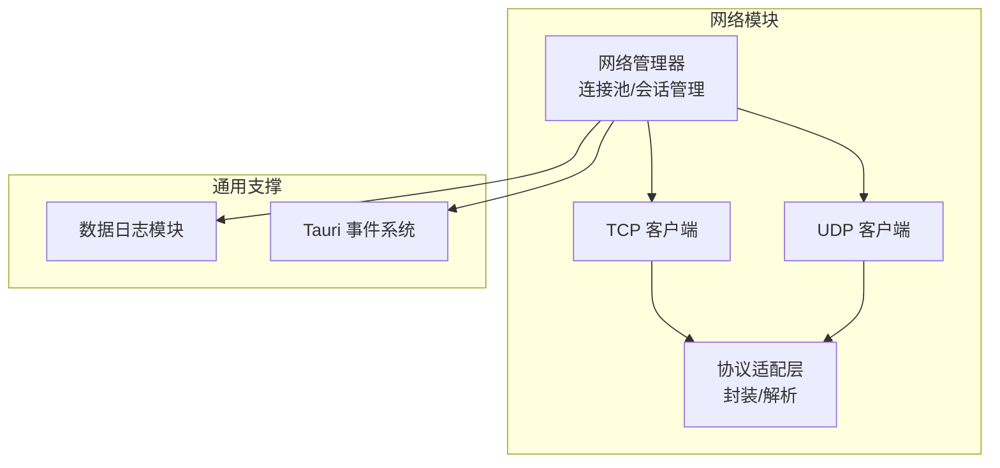
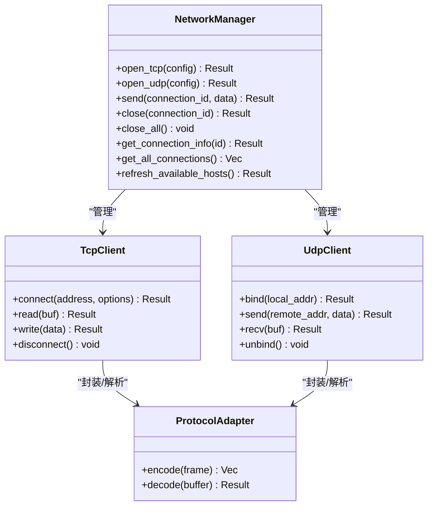
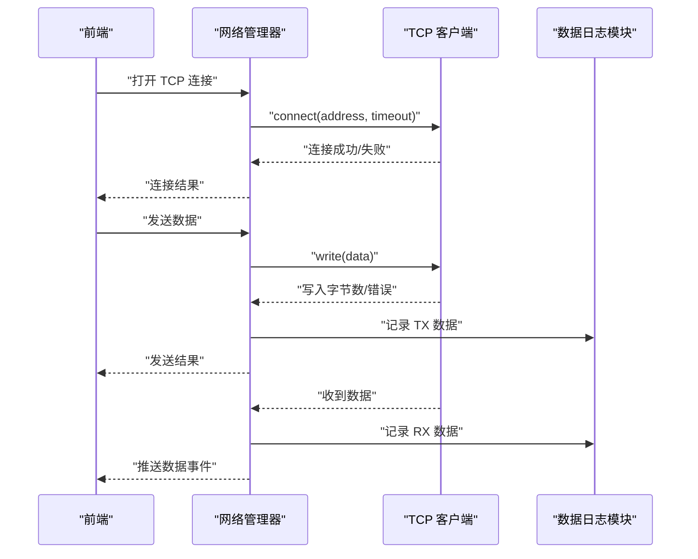
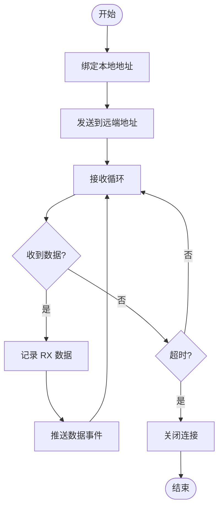
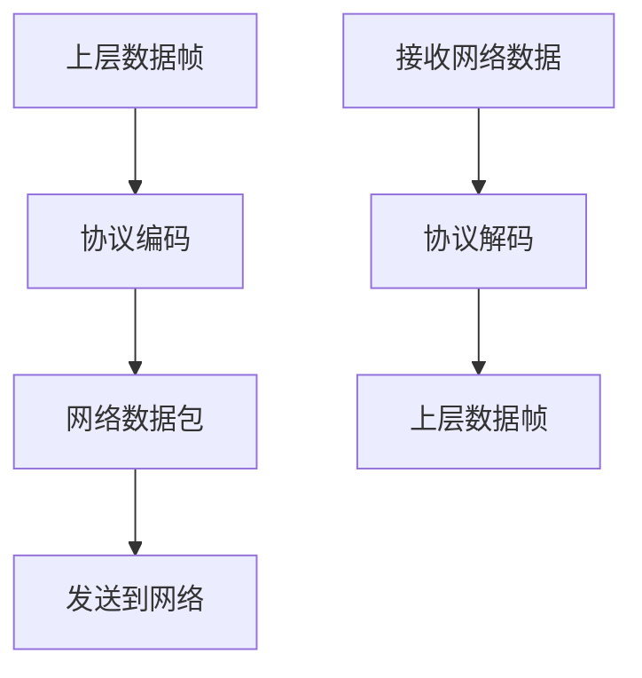
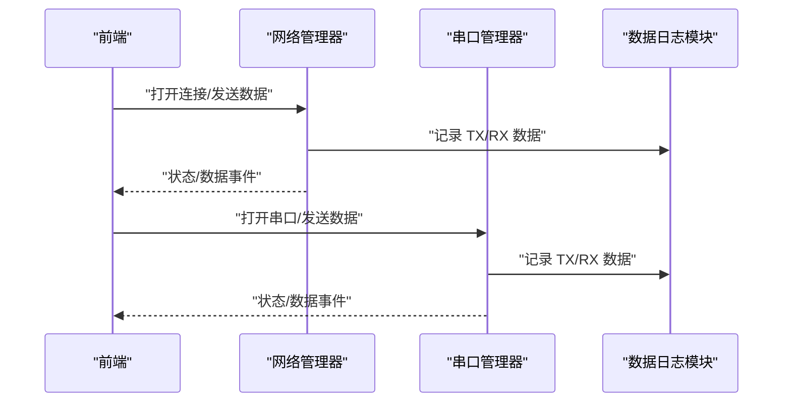
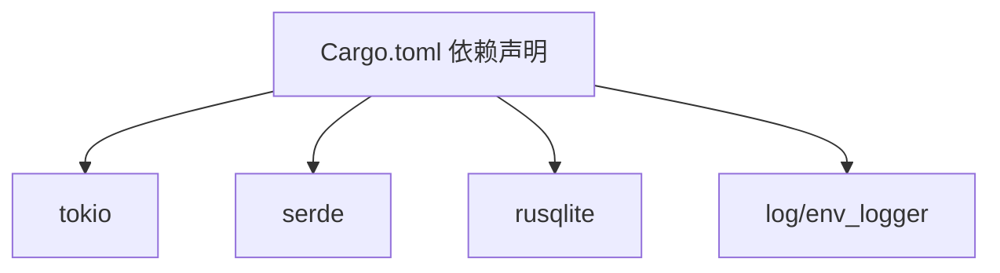

# 网络通信模块

<cite>
**本文档引用的文件**
- [src-tauri/src/network/mod.rs](file://src-tauri/src/network/mod.rs)
- [src-tauri/src/serial/mod.rs](file://src-tauri/src/serial/mod.rs)
- [src-tauri/src/serial/protocol.rs](file://src-tauri/src/serial/protocol.rs)
- [src-tauri/src/serial/data_process.rs](file://src-tauri/src/serial/data_process.rs)
- [src-tauri/src/serial/port_manager.rs](file://src-tauri/src/serial/port_manager.rs)
- [src-tauri/src/serial/commands.rs](file://src-tauri/src/serial/commands.rs)
- [src-tauri/src/data_logger/mod.rs](file://src-tauri/src/data_logger/mod.rs)
- [src-tauri/src/data_logger/commands.rs](file://src-tauri/src/data_logger/commands.rs)
- [src-tauri/src/lib.rs](file://src-tauri/src/lib.rs)
- [src-tauri/src/main.rs](file://src-tauri/src/main.rs)
- [src-tauri/Cargo.toml](file://src-tauri/Cargo.toml)
</cite>

## 目录
1. [简介](#简介)
2. [项目结构](#项目结构)
3. [核心组件](#核心组件)
4. [架构总览](#架构总览)
5. [详细组件分析](#详细组件分析)
6. [依赖关系分析](#依赖关系分析)
7. [性能考量](#性能考量)
8. [故障排查指南](#故障排查指南)
9. [结论](#结论)
10. [附录](#附录)

## 简介
本文件面向 KonSerial 的网络通信模块，系统性梳理其架构设计、实现要点与扩展方向。当前仓库中网络模块处于待实现状态（仅保留模块占位），但串口通信模块提供了完整的实现范式与可复用的设计模式，可作为网络模块的参考蓝图。本文将以“串口通信模块”为蓝本，结合网络模块的职责定位，给出网络通信模块的架构设计建议、数据流设计、错误恢复与性能优化策略，并说明与串口模块的集成思路。

## 项目结构
KonSerial 的后端采用 Tauri + Rust 架构，网络通信模块位于 src-tauri/src/network 目录下，目前为占位文件；串口通信模块位于 src-tauri/src/serial 目录下，包含端口管理、协议解析、数据处理与命令接口等子模块。整体结构如下：

图示来源
- [src-tauri/src/lib.rs:24-84](file://src-tauri/src/lib.rs#L24-L84)
- [src-tauri/src/network/mod.rs:1-3](file://src-tauri/src/network/mod.rs#L1-L3)
- [src-tauri/src/serial/mod.rs:1-4](file://src-tauri/src/serial/mod.rs#L1-L4)
- [src-tauri/src/data_logger/mod.rs:1-273](file://src-tauri/src/data_logger/mod.rs#L1-L273)

章节来源
- [src-tauri/src/lib.rs:24-84](file://src-tauri/src/lib.rs#L24-L84)
- [src-tauri/src/network/mod.rs:1-3](file://src-tauri/src/network/mod.rs#L1-L3)
- [src-tauri/src/serial/mod.rs:1-4](file://src-tauri/src/serial/mod.rs#L1-L4)
- [src-tauri/src/data_logger/mod.rs:1-273](file://src-tauri/src/data_logger/mod.rs#L1-L273)

## 核心组件
- 网络模块占位：定义网络通信模块的职责边界，明确支持 TCP/UDP 协议的调试通信能力。
- 串口模块（参考实现）：提供完整的串口连接生命周期管理、数据读写、状态统计与持久化记录，可直接迁移为网络模块的实现模板。
- 数据日志模块：提供 SQLite 持久化、会话管理、数据查询与导出能力，网络模块可复用该能力进行网络数据的记录与回放。

章节来源
- [src-tauri/src/network/mod.rs:1-3](file://src-tauri/src/network/mod.rs#L1-L3)
- [src-tauri/src/serial/port_manager.rs:161-402](file://src-tauri/src/serial/port_manager.rs#L161-L402)
- [src-tauri/src/data_logger/mod.rs:47-273](file://src-tauri/src/data_logger/mod.rs#L47-L273)

## 架构总览
网络模块的总体架构应遵循以下原则：
- 抽象统一接口：以 trait 或枚举统一封装 TCP/UDP 的连接与数据传输行为，屏蔽底层差异。
- 生命周期管理：与串口模块一致，提供连接建立、心跳/超时、断线重连、优雅关闭等能力。
- 数据流设计：统一的数据收发流程，支持缓冲、分包、校验与错误恢复。
- 集成与扩展：与数据日志模块无缝集成，支持网络数据的持久化与回放；与前端通过 Tauri 事件通信。

图示来源
- [src-tauri/src/network/mod.rs:1-3](file://src-tauri/src/network/mod.rs#L1-L3)
- [src-tauri/src/data_logger/mod.rs:47-273](file://src-tauri/src/data_logger/mod.rs#L47-L273)

## 详细组件分析

### 网络管理器（抽象设计）
目标：提供统一的网络连接管理接口，支持 TCP/UDP 的并发连接与会话生命周期管理。

图示来源
- [src-tauri/src/network/mod.rs:1-3](file://src-tauri/src/network/mod.rs#L1-L3)

章节来源
- [src-tauri/src/network/mod.rs:1-3](file://src-tauri/src/network/mod.rs#L1-L3)

### TCP 客户端实现要点
- 连接建立：支持主机地址解析、超时设置、TLS 握手（可选）。
- 数据传输：异步读写、缓冲区管理、分包与粘包处理。
- 连接管理：心跳检测、异常断线检测、自动重连策略。
- 错误恢复：IO 错误分类处理、资源释放与状态更新。

图示来源
- [src-tauri/src/network/mod.rs:1-3](file://src-tauri/src/network/mod.rs#L1-L3)
- [src-tauri/src/data_logger/mod.rs:115-164](file://src-tauri/src/data_logger/mod.rs#L115-L164)

章节来源
- [src-tauri/src/network/mod.rs:1-3](file://src-tauri/src/network/mod.rs#L1-L3)
- [src-tauri/src/data_logger/mod.rs:115-164](file://src-tauri/src/data_logger/mod.rs#L115-L164)

### UDP 客户端实现要点
- 绑定与发送：本地绑定、远程地址发送、广播/组播支持。
- 接收处理：非连接式接收、地址识别、丢包与乱序处理。
- 超时与重传：可选的请求-响应模式与超时重传策略。

图示来源
- [src-tauri/src/network/mod.rs:1-3](file://src-tauri/src/network/mod.rs#L1-L3)
- [src-tauri/src/data_logger/mod.rs:144-153](file://src-tauri/src/data_logger/mod.rs#L144-L153)

章节来源
- [src-tauri/src/network/mod.rs:1-3](file://src-tauri/src/network/mod.rs#L1-L3)
- [src-tauri/src/data_logger/mod.rs:144-153](file://src-tauri/src/data_logger/mod.rs#L144-L153)

### 协议抽象与数据封装
- 协议适配层：负责将上层数据帧转换为网络字节流（编码）以及从网络字节流解析为数据帧（解码）。
- 支持多种协议：如自定义二进制帧、文本协议、JSON 文本等，通过配置切换。
- 分包与粘包：通过长度前缀、定界符或时间片聚合策略处理。

图示来源
- [src-tauri/src/network/mod.rs:1-3](file://src-tauri/src/network/mod.rs#L1-L3)

章节来源
- [src-tauri/src/network/mod.rs:1-3](file://src-tauri/src/network/mod.rs#L1-L3)

### 与串口模块的集成方式
- 统一接口：网络模块提供与串口模块一致的命令接口与状态模型，便于前端统一处理。
- 生命周期对齐：连接建立、数据收发、错误上报、关闭流程与串口模块保持一致。
- 数据持久化：网络模块复用数据日志模块，实现网络数据的会话化记录与查询。

图示来源
- [src-tauri/src/serial/port_manager.rs:196-392](file://src-tauri/src/serial/port_manager.rs#L196-L392)
- [src-tauri/src/data_logger/mod.rs:115-164](file://src-tauri/src/data_logger/mod.rs#L115-L164)

章节来源
- [src-tauri/src/serial/port_manager.rs:196-392](file://src-tauri/src/serial/port_manager.rs#L196-L392)
- [src-tauri/src/data_logger/mod.rs:115-164](file://src-tauri/src/data_logger/mod.rs#L115-L164)

## 依赖关系分析
- 外部依赖：Tokio 异步运行时、Serde 序列化、SQLite（rusqlite）、日志库等。
- 内部依赖：数据日志模块为网络模块提供持久化能力；串口模块提供生命周期与状态管理的实现范式。

图示来源
- [src-tauri/Cargo.toml:20-37](file://src-tauri/Cargo.toml#L20-L37)

章节来源
- [src-tauri/Cargo.toml:20-37](file://src-tauri/Cargo.toml#L20-L37)

## 性能考量
- 异步 I/O：使用 Tokio 的异步套接字，避免阻塞主线程，提升并发吞吐。
- 缓冲与批处理：合理设置读写缓冲大小，合并小包减少系统调用次数。
- 超时与背压：为连接与读写设置合理超时，必要时引入背压策略防止内存膨胀。
- 日志持久化：SQLite 使用 WAL 模式与索引优化，避免频繁 IO 影响网络性能。
- 连接池：对多目标连接场景，维护连接池与空闲回收策略。

## 故障排查指南
- 连接失败：检查地址解析、端口占用、防火墙规则与 TLS 配置。
- 读写异常：区分超时与错误，记录最后一次错误并更新连接状态。
- 数据丢失：确认缓冲区大小、分包策略与协议完整性校验。
- 性能问题：监控 IO 吞吐、CPU 使用率与 SQLite 写入延迟，调整缓冲与批处理参数。

## 结论
网络通信模块应以串口模块为实现蓝本，构建统一的抽象接口与生命周期管理，结合数据日志模块实现网络数据的会话化记录与回放。通过异步 I/O、合理的超时与重连策略、以及协议适配层，实现高性能、可扩展且易维护的网络调试能力。

## 附录
- 网络模块开发清单
  - 定义统一的连接配置与状态模型
  - 实现 TCP/UDP 客户端与协议适配层
  - 建立连接池与会话管理
  - 集成数据日志模块与 Tauri 事件系统
  - 设计超时与重连策略
  - 提供完善的错误处理与诊断日志