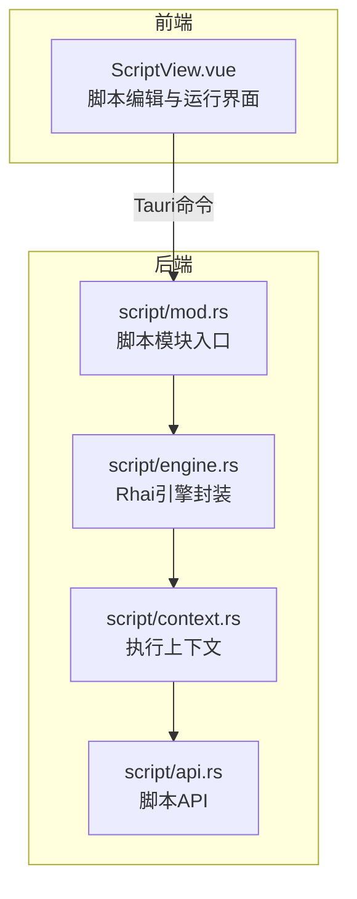
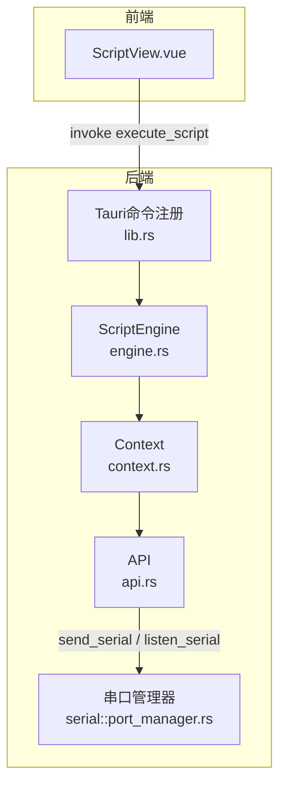
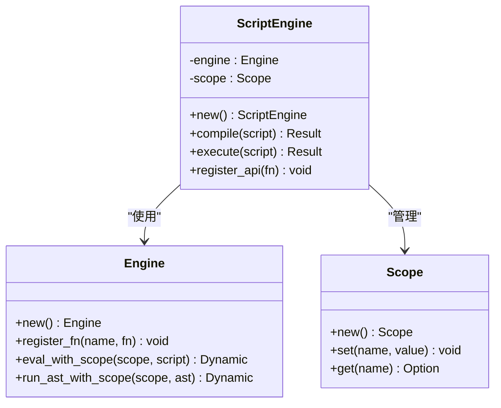
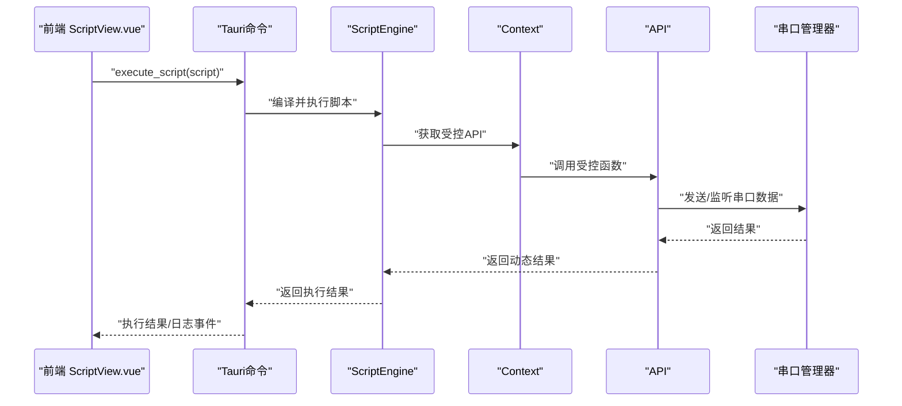
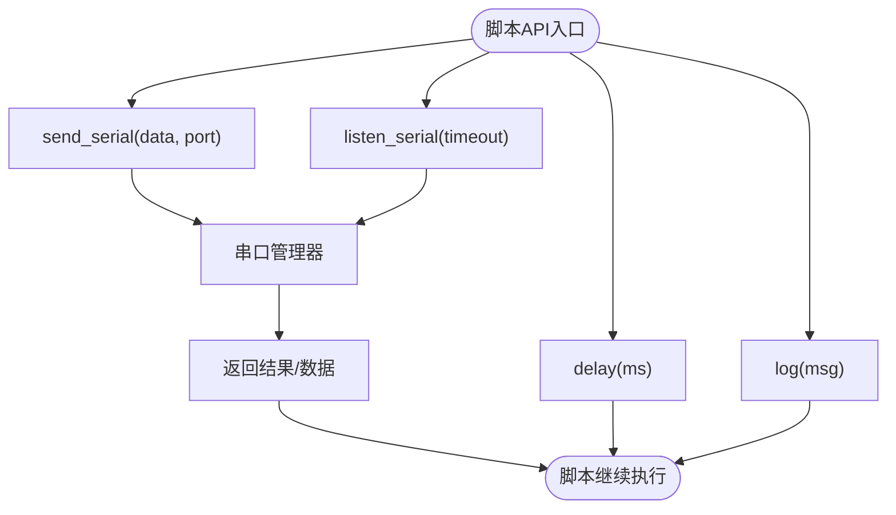
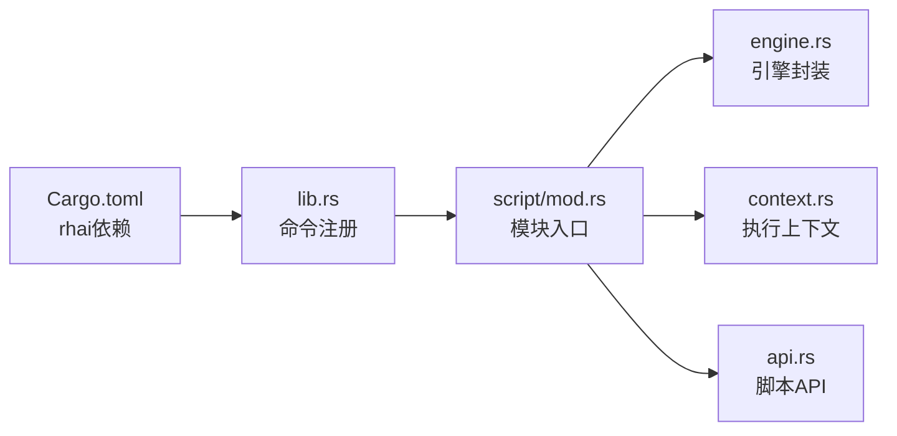

# 脚本引擎模块

<cite>
**本文档引用的文件**
- [Cargo.toml](file://src-tauri/Cargo.toml)
- [lib.rs](file://src-tauri/src/lib.rs)
- [mod.rs](file://src-tauri/src/script/mod.rs)
- [DESIGN.md](file://DESIGN.md)
- [ScriptView.vue](file://src/views/ScriptView.vue)
</cite>

## 目录
1. [简介](#简介)
2. [项目结构](#项目结构)
3. [核心组件](#核心组件)
4. [架构总览](#架构总览)
5. [详细组件分析](#详细组件分析)
6. [依赖关系分析](#依赖关系分析)
7. [性能考量](#性能考量)
8. [故障排查指南](#故障排查指南)
9. [结论](#结论)
10. [附录](#附录)

## 简介
本文件面向 KonSerial 的脚本引擎模块，系统化阐述 Rhai 脚本引擎的集成方案与实现要点，涵盖引擎初始化、脚本加载与执行环境配置、脚本 API 设计与暴露方式、安全机制（沙箱限制、资源访问控制、执行时间限制）、与串口通信的集成（自动化数据发送与条件判断）、调试支持、错误处理与性能监控，并提供最佳实践与常用示例。

当前仓库中，Rhai 已作为依赖引入，但后端尚未完成脚本引擎模块的实际实现；前端已具备脚本编辑界面，但脚本执行命令尚未对接后端。本文档基于设计文档中的完整架构蓝图，给出可落地的实现指导与可视化说明。

## 项目结构
KonSerial 的脚本引擎模块位于后端 Rust 源码树中，采用模块化组织：
- 后端模块：src-tauri/src/script/
  - mod.rs：脚本模块入口与注释
  - engine.rs：Rhai 脚本执行引擎封装
  - context.rs：脚本执行上下文（串口、网络等资源的受控访问）
  - api.rs：对外暴露给脚本的 API（如串口发送、监听、延时、日志等）

前端模块：
- ScriptView.vue：脚本编辑与运行界面，包含运行/停止、日志输出、文件管理等 UI

**图表来源**
- [mod.rs:1-3](file://src-tauri/src/script/mod.rs#L1-L3)
- [DESIGN.md:117-121](file://DESIGN.md#L117-L121)

**章节来源**
- [mod.rs:1-3](file://src-tauri/src/script/mod.rs#L1-L3)
- [DESIGN.md:117-121](file://DESIGN.md#L117-L121)

## 核心组件
- Rhai 引擎封装：负责引擎初始化、AST 编译、作用域管理、脚本执行与结果返回
- 执行上下文：集中管理串口、网络、文件系统等受限资源，提供安全的 API 注入点
- 脚本 API：对外暴露串口发送、十六进制发送、延时、日志、条件监听等函数
- 前端脚本界面：提供脚本编辑、运行控制、日志输出与文件管理

**章节来源**
- [DESIGN.md:348-396](file://DESIGN.md#L348-L396)
- [DESIGN.md:820-855](file://DESIGN.md#L820-L855)

## 架构总览
整体架构采用“前端编辑 + 后端执行”的模式，Rhai 引擎在后端安全沙箱内执行脚本，通过受控 API 访问串口等系统资源。

**图表来源**
- [lib.rs:56-80](file://src-tauri/src/lib.rs#L56-L80)
- [DESIGN.md:348-396](file://DESIGN.md#L348-L396)
- [DESIGN.md:820-855](file://DESIGN.md#L820-L855)

## 详细组件分析

### Rhai 引擎封装（engine.rs）
- 初始化：创建 Engine 实例，启用必要的特性（如 serde、std、sync）
- AST 编译：将脚本字符串编译为 AST，提升重复执行效率
- 作用域管理：使用 Scope 管理脚本变量与状态，支持跨执行会话的变量持久化
- 执行与结果：通过 eval_with_scope 或 run_ast_with_scope 执行脚本，返回 Dynamic 结果
- 错误处理：捕获编译与运行时错误，转换为统一的错误类型返回前端

**图表来源**
- [DESIGN.md:348-396](file://DESIGN.md#L348-L396)

**章节来源**
- [DESIGN.md:348-396](file://DESIGN.md#L348-L396)

### 执行上下文（context.rs）
- 资源聚合：聚合串口管理器、网络客户端、文件系统句柄等资源
- 权限控制：通过上下文方法暴露有限 API，避免脚本直接访问底层资源
- 生命周期：随应用启动初始化，随全局状态管理注入到 Tauri Builder
- 事件桥接：将脚本执行过程中的日志、状态变化通过事件推送到前端

**图表来源**
- [lib.rs:56-80](file://src-tauri/src/lib.rs#L56-L80)
- [DESIGN.md:348-396](file://DESIGN.md#L348-L396)

**章节来源**
- [DESIGN.md:348-396](file://DESIGN.md#L348-L396)

### 脚本 API 设计（api.rs）
- 串口发送：send_serial(data, port)，支持字符串与十六进制发送
- 条件监听：listen_serial(timeout?)，等待指定超时内的串口数据
- 延时控制：delay(ms)，在脚本中实现非阻塞式延时
- 日志输出：log(msg)，将消息写入应用日志并可转发到前端
- 数据处理：hex_encode/decode、字符串处理、数组/映射操作等

**图表来源**
- [DESIGN.md:348-396](file://DESIGN.md#L348-L396)

**章节来源**
- [DESIGN.md:348-396](file://DESIGN.md#L348-L396)

### 安全机制
- 沙箱限制：通过 Context 限制脚本可访问的资源集合，禁止文件系统、网络套接字等敏感操作
- 资源访问控制：所有串口操作必须通过受控 API，避免脚本直接调用底层系统接口
- 执行时间限制：设置最大执行步数、内存使用上限、递归深度限制，防止恶意或长耗时脚本
- 事件审计：记录脚本执行日志与异常，便于回溯与调试

**章节来源**
- [DESIGN.md:1183-1194](file://DESIGN.md#L1183-L1194)

### 与串口通信的集成
- 自动化发送：脚本通过 send_serial 定时发送预设数据，实现协议握手、轮询等场景
- 条件判断：通过 listen_serial 获取响应，结合 if/else、循环等控制流实现应答式通信
- 数据处理：脚本可对串口数据进行解析、过滤、格式化后再发送或记录

**章节来源**
- [DESIGN.md:800-818](file://DESIGN.md#L800-L818)

### 调试支持与错误处理
- 前端日志：ScriptView.vue 提供日志输出区域，展示脚本执行状态与错误信息
- 后端事件：执行过程中的日志与异常通过 Tauri 事件推送到前端
- 错误分类：编译错误、运行时错误、超时错误、资源访问错误等，分别处理与上报

**章节来源**
- [ScriptView.vue:40-100](file://src/views/ScriptView.vue#L40-L100)
- [DESIGN.md:1133-1141](file://DESIGN.md#L1133-L1141)

### 性能监控
- 执行统计：记录脚本执行次数、平均耗时、峰值内存
- 资源监控：串口读写速率、事件推送频率、上下文对象数量
- 优化建议：使用 AST 缓存、作用域复用、限制脚本复杂度

**章节来源**
- [DESIGN.md:1153-1171](file://DESIGN.md#L1153-L1171)

## 依赖关系分析
- Rhai 依赖：在 Cargo.toml 中声明，启用 serde、std、sync 特性
- Tauri 命令：在 lib.rs 中注册脚本执行命令，注入全局状态（串口管理器、数据记录器等）
- 前后端通信：前端通过 invoke 调用后端命令，后端通过事件推送执行结果

**图表来源**
- [Cargo.toml](file://src-tauri/Cargo.toml#L29)
- [lib.rs:56-80](file://src-tauri/src/lib.rs#L56-L80)
- [mod.rs:1-3](file://src-tauri/src/script/mod.rs#L1-L3)

**章节来源**
- [Cargo.toml](file://src-tauri/Cargo.toml#L29)
- [lib.rs:56-80](file://src-tauri/src/lib.rs#L56-L80)

## 性能考量
- 引擎优化：复用 Engine 实例与 AST 缓存，避免重复编译
- 作用域管理：合理使用 Scope，减少变量创建与销毁开销
- I/O 优化：串口读写采用异步非阻塞模型，避免脚本阻塞主线程
- 内存控制：限制脚本变量数量与数据结构大小，防止内存膨胀

## 故障排查指南
- 脚本无法执行：检查 Tauri 命令是否正确注册，确认前端 invoke 调用路径
- 串口无响应：确认串口已打开且参数正确，检查 API 调用是否被沙箱拦截
- 超时与崩溃：调整执行时间限制与资源配额，查看后端日志与前端事件
- 前端无输出：确认事件监听是否建立，日志区域是否清空或被覆盖

**章节来源**
- [lib.rs:56-80](file://src-tauri/src/lib.rs#L56-L80)
- [ScriptView.vue:40-100](file://src/views/ScriptView.vue#L40-L100)

## 结论
KonSerial 的脚本引擎模块以 Rhai 为核心，结合受控上下文与受限 API，实现了安全、可控、高性能的脚本执行能力。当前前端已具备完善的脚本编辑界面，后端需完成脚本引擎模块的实现并与串口管理器深度集成。按照本文档的架构蓝图与最佳实践，可快速构建稳定可靠的脚本自动化系统。

## 附录

### 最佳实践
- 脚本编写
  - 使用清晰的变量命名与注释，便于调试与维护
  - 将重复逻辑封装为函数，减少脚本体积与执行开销
  - 合理使用 delay 与超时，避免长时间阻塞
- API 使用
  - 优先使用 send_serial 与 listen_serial 的组合实现协议交互
  - 对外部输入进行严格校验，防止注入与越界访问
- 安全与性能
  - 限制脚本复杂度与执行时间，避免影响系统稳定性
  - 定期清理日志与临时变量，控制内存占用
- 调试与监控
  - 使用 log 输出关键节点信息，配合前端日志面板定位问题
  - 关注执行统计指标，持续优化脚本性能

### 常用示例（路径参考）
- 周期发送示例：[DESIGN.md:800-804](file://DESIGN.md#L800-L804)
- 条件发送示例：[DESIGN.md:806-811](file://DESIGN.md#L806-L811)
- Rhai 引擎集成示例：[DESIGN.md:348-396](file://DESIGN.md#L348-L396)
- 后端脚本引擎接口示例：[DESIGN.md:820-855](file://DESIGN.md#L820-L855)