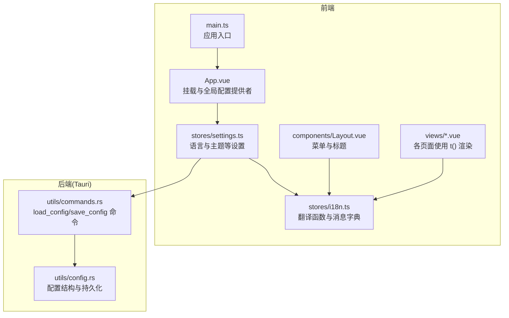
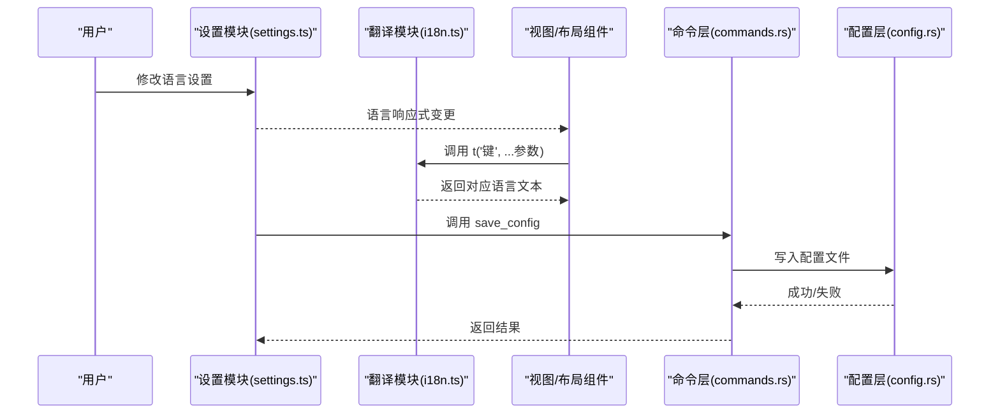
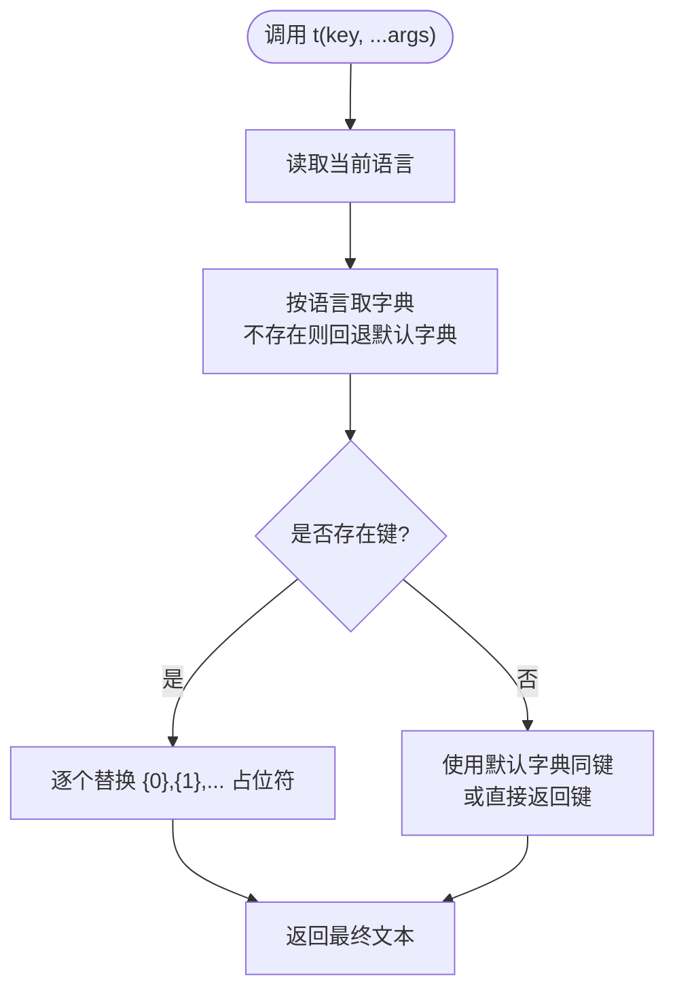
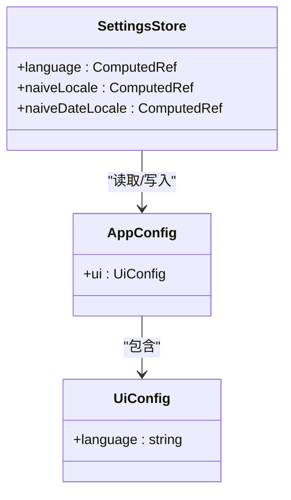
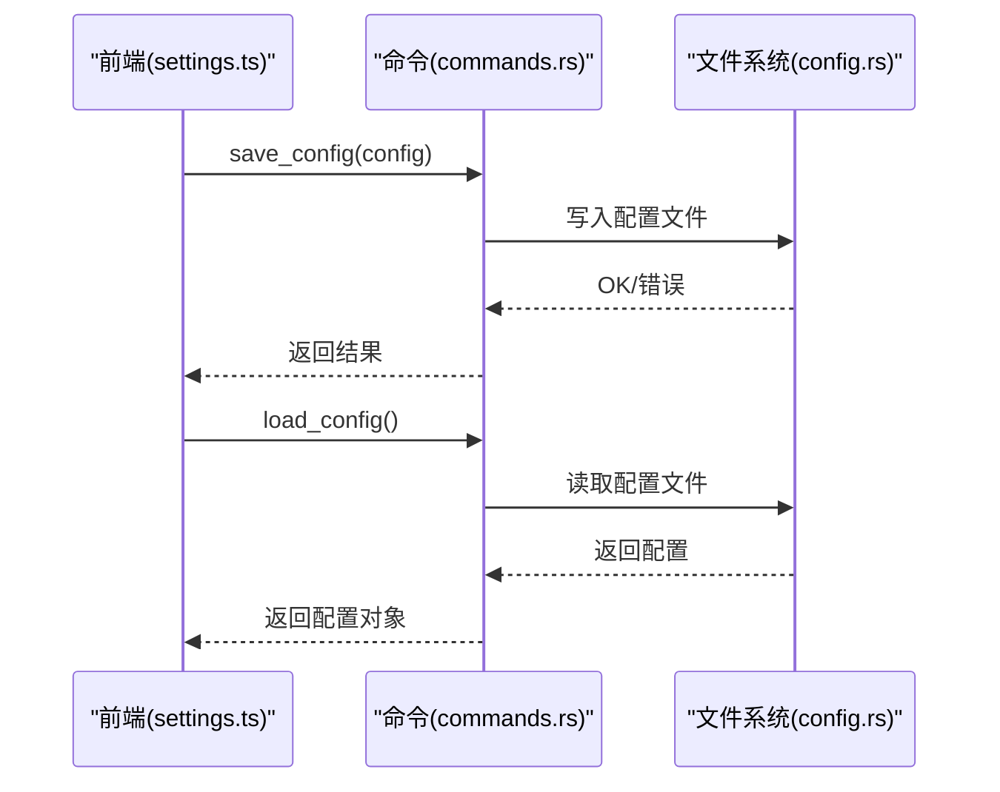
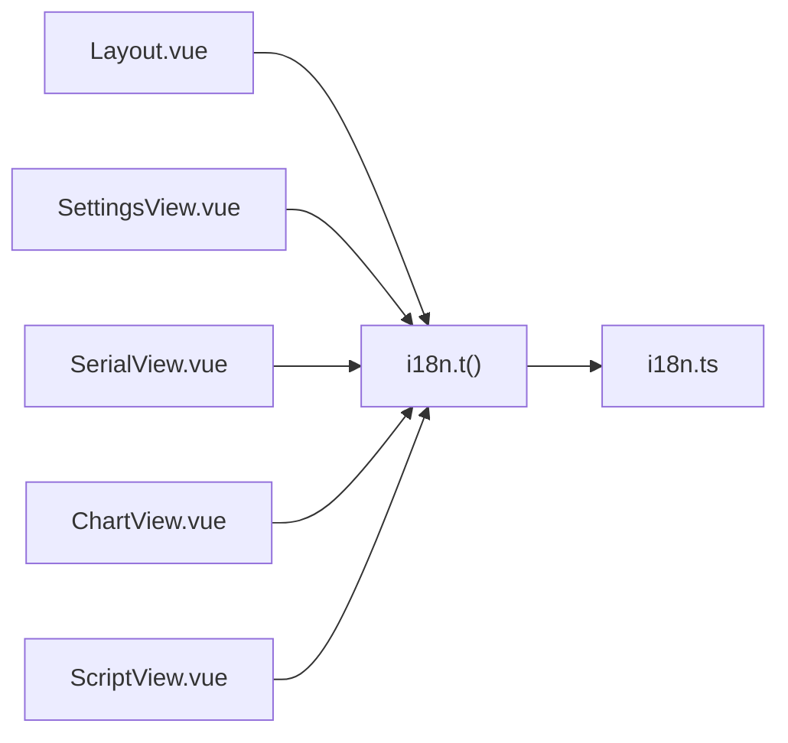
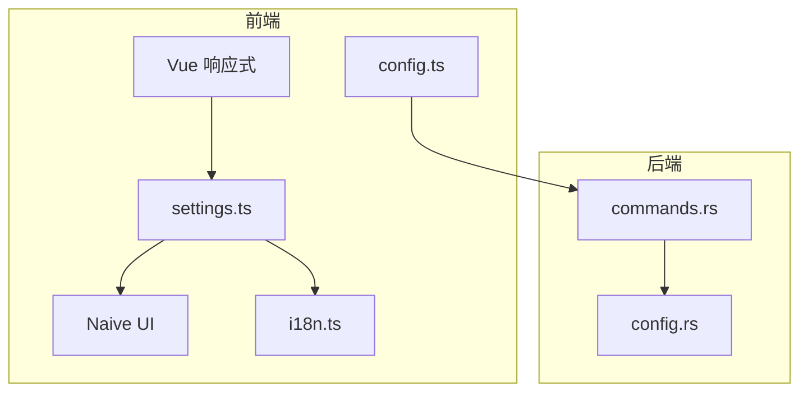

# 国际化支持

<cite>
**本文引用的文件**
- [src/stores/i18n.ts](file://src/stores/i18n.ts)
- [src/stores/settings.ts](file://src/stores/settings.ts)
- [src/stores/config.ts](file://src/stores/config.ts)
- [src/components/Layout.vue](file://src/components/Layout.vue)
- [src/views/SettingsView.vue](file://src/views/SettingsView.vue)
- [src/views/SerialView.vue](file://src/views/SerialView.vue)
- [src/views/ChartView.vue](file://src/views/ChartView.vue)
- [src/views/ScriptView.vue](file://src/views/ScriptView.vue)
- [src/App.vue](file://src/App.vue)
- [src/main.ts](file://src/main.ts)
- [src-tauri/src/utils/commands.rs](file://src-tauri/src/utils/commands.rs)
- [src-tauri/src/utils/config.rs](file://src-tauri/src/utils/config.rs)
- [package.json](file://package.json)
</cite>

## 更新摘要
**变更内容**
- 新增图表视图国际化支持，包含完整的波形图功能翻译键
- 新增脚本编辑器国际化支持，包含脚本管理、运行控制、日志显示等功能翻译键
- 扩展串口连接状态提示的国际化应用范围
- 完善翻译键值设计与命名规范，涵盖所有用户交互场景

## 目录
1. [简介](#简介)
2. [项目结构](#项目结构)
3. [核心组件](#核心组件)
4. [架构总览](#架构总览)
5. [详细组件分析](#详细组件分析)
6. [依赖关系分析](#依赖关系分析)
7. [性能考量](#性能考量)
8. [故障排查指南](#故障排查指南)
9. [结论](#结论)
10. [附录](#附录)

## 简介
本文件面向翻译人员与开发者，系统性阐述 KonSerial 的国际化（i18n）实现与管理策略。内容涵盖：
- 多语言配置与存储机制
- 翻译键值设计、命名规范与组织结构
- 语言切换逻辑与响应式更新
- 动态语言加载与缓存策略
- 新语言添加流程与最佳实践
- 翻译质量保证与一致性检查方法
- 实际翻译示例与本地化适配案例

**更新** 本次更新重点反映了新增的图表和脚本相关翻译键，包括连接状态提示、交互按钮文案等全面的国际化支持。

## 项目结构
KonSerial 的国际化主要由前端轻量级 i18n 存储模块与设置模块协作完成，并通过 Tauri 后端持久化配置。前端负责语言切换与文本渲染，后端负责配置读写。

**图表来源**
- [src/App.vue:1-33](file://src/App.vue#L1-L33)
- [src/main.ts:1-14](file://src/main.ts#L1-L14)
- [src/stores/settings.ts:1-125](file://src/stores/settings.ts#L1-L125)
- [src/stores/i18n.ts:1-358](file://src/stores/i18n.ts#L1-L358)
- [src/components/Layout.vue:1-121](file://src/components/Layout.vue#L1-L121)
- [src/views/SettingsView.vue:1-383](file://src/views/SettingsView.vue#L1-L383)
- [src-tauri/src/utils/commands.rs:1-29](file://src-tauri/src/utils/commands.rs#L1-L29)
- [src-tauri/src/utils/config.rs:126-175](file://src-tauri/src/utils/config.rs#L126-L175)

**章节来源**
- [src/main.ts:1-14](file://src/main.ts#L1-L14)
- [src/App.vue:1-33](file://src/App.vue#L1-L33)
- [src/stores/settings.ts:1-125](file://src/stores/settings.ts#L1-L125)
- [src/stores/i18n.ts:1-358](file://src/stores/i18n.ts#L1-L358)
- [src-tauri/src/utils/commands.rs:1-29](file://src-tauri/src/utils/commands.rs#L1-L29)
- [src-tauri/src/utils/config.rs:126-175](file://src-tauri/src/utils/config.rs#L126-L175)

## 核心组件
- i18n 存储模块：提供翻译函数与消息字典，支持参数占位符替换与响应式语言切换。
- 设置模块：维护语言设置并将其映射到 UI 组件库的语言环境。
- 配置模块：定义应用配置结构，包含语言字段；通过 Tauri 命令进行持久化。
- 视图与布局：在模板与逻辑中统一调用翻译函数，实现界面文本本地化。

**更新** 新增的图表和脚本视图进一步完善了国际化覆盖范围，确保所有用户交互场景都有对应的翻译键值。

**章节来源**
- [src/stores/i18n.ts:1-358](file://src/stores/i18n.ts#L1-L358)
- [src/stores/settings.ts:81-97](file://src/stores/settings.ts#L81-L97)
- [src/stores/config.ts:16-36](file://src/stores/config.ts#L16-L36)
- [src/components/Layout.vue:1-121](file://src/components/Layout.vue#L1-L121)
- [src/views/SettingsView.vue:1-383](file://src/views/SettingsView.vue#L1-L383)

## 架构总览
下图展示从前端语言设置到翻译渲染、再到配置持久化的整体流程。

**图表来源**
- [src/stores/settings.ts:81-97](file://src/stores/settings.ts#L81-L97)
- [src/stores/i18n.ts:328-358](file://src/stores/i18n.ts#L328-L358)
- [src/views/SettingsView.vue:42-59](file://src/views/SettingsView.vue#L42-L59)
- [src-tauri/src/utils/commands.rs:13-23](file://src-tauri/src/utils/commands.rs#L13-L23)
- [src-tauri/src/utils/config.rs:126-175](file://src-tauri/src/utils/config.rs#L126-L175)

## 详细组件分析

### i18n 存储与翻译机制
- 消息字典：以语言代码为键，映射到键值对对象，键采用"域.标识"命名，便于分组与查找。
- 翻译函数：
  - t(key, ...args)：根据当前语言返回文本，支持 {0}/{1}/... 占位符替换。
  - useI18n()：返回一个响应式翻译闭包，内部依赖语言设置，语言变更时自动重渲染。
- 回退策略：优先取当前语言字典，不存在则回退到默认语言字典；若仍无，则返回键本身，便于开发期定位缺失项。

**图表来源**
- [src/stores/i18n.ts:328-358](file://src/stores/i18n.ts#L328-L358)

**章节来源**
- [src/stores/i18n.ts:1-358](file://src/stores/i18n.ts#L1-L358)

### 语言设置与 UI 语言环境
- 语言设置来自配置结构中的 ui.language，默认 zh-CN。
- 设置模块将语言映射到 UI 组件库的语言环境，确保日期、控件文案等与界面语言一致。
- 应用启动时，全局配置提供者注入 UI 语言与日期语言，实现组件级国际化。

**图表来源**
- [src/stores/settings.ts:81-97](file://src/stores/settings.ts#L81-L97)
- [src/stores/config.ts:16-36](file://src/stores/config.ts#L16-L36)
- [src/App.vue:22-32](file://src/App.vue#L22-L32)

**章节来源**
- [src/stores/settings.ts:1-125](file://src/stores/settings.ts#L1-L125)
- [src/stores/config.ts:16-36](file://src/stores/config.ts#L16-L36)
- [src/App.vue:1-33](file://src/App.vue#L1-L33)

### 配置持久化与语言存储
- 前端配置结构包含 ui.language 字段；通过 Tauri 命令 load_config/save_config 与后端交互。
- 后端使用 JSON 文件存储配置，提供加载、保存、重载能力，并记录配置文件路径以便后续持久化。

**图表来源**
- [src-tauri/src/utils/commands.rs:1-29](file://src-tauri/src/utils/commands.rs#L1-L29)
- [src-tauri/src/utils/config.rs:126-175](file://src-tauri/src/utils/config.rs#L126-L175)
- [src/stores/config.ts:42-64](file://src/stores/config.ts#L42-L64)

**章节来源**
- [src-tauri/src/utils/commands.rs:1-29](file://src-tauri/src/utils/commands.rs#L1-L29)
- [src-tauri/src/utils/config.rs:126-175](file://src-tauri/src/utils/config.rs#L126-L175)
- [src/stores/config.ts:16-36](file://src/stores/config.ts#L16-L36)

### 视图与布局中的翻译使用
- 布局组件使用翻译函数渲染导航标签与副标题。
- 设置页使用翻译函数渲染标题、描述、选项标签与操作提示。
- 串口页、图表页与脚本页在状态提示、按钮文案、帮助信息等场景统一使用翻译函数。
- 所有页面通过 t() 或 useI18n() 的响应式版本实现语言切换即时生效。

**更新** 新增的图表和脚本视图涵盖了从连接状态到操作反馈的完整用户交互链路，确保国际化支持的全面性。

**图表来源**
- [src/components/Layout.vue:9-22](file://src/components/Layout.vue#L9-L22)
- [src/views/SettingsView.vue:23-63](file://src/views/SettingsView.vue#L23-L63)
- [src/views/SerialView.vue:141-205](file://src/views/SerialView.vue#L141-L205)
- [src/views/ChartView.vue:116-200](file://src/views/ChartView.vue#L116-L200)
- [src/views/ScriptView.vue:350-450](file://src/views/ScriptView.vue#L350-L450)
- [src/stores/i18n.ts:328-358](file://src/stores/i18n.ts#L328-L358)

**章节来源**
- [src/components/Layout.vue:1-121](file://src/components/Layout.vue#L1-L121)
- [src/views/SettingsView.vue:1-383](file://src/views/SettingsView.vue#L1-L383)
- [src/views/SerialView.vue:1-746](file://src/views/SerialView.vue#L1-L746)
- [src/views/ChartView.vue:1-1057](file://src/views/ChartView.vue#L1-L1057)
- [src/views/ScriptView.vue:1-617](file://src/views/ScriptView.vue#L1-L617)
- [src/stores/i18n.ts:1-358](file://src/stores/i18n.ts#L1-L358)

### 图表视图国际化支持
图表视图包含了完整的波形图功能国际化支持，涵盖以下关键领域：

- **运行状态与控制**：'chart.running'、'chart.stopped'、'chart.start'、'chart.pause'、'chart.clear'、'chart.export'
- **数据格式与帮助**：'chart.formatHelp'、'chart.collapse'、'chart.expand'、'chart.formatDesc'、'chart.examples'、'chart.formatNote'
- **通道管理**：'chart.channels'、'chart.noChannels'、'chart.selectChannels'、'chart.channelStats'
- **显示设置**：'chart.display'、'chart.autoScale'、'chart.yMin'、'chart.yMax'、'chart.showGrid'、'chart.lineWidth'
- **统计信息**：'chart.current'、'chart.average'、'chart.dataPoints'
- **消息提示**：'chart.noConnection'、'chart.startedMsg'、'chart.pausedMsg'、'chart.cleared'、'chart.exported'、'chart.savedPng'、'chart.exportFail'

**章节来源**
- [src/stores/i18n.ts:94-161](file://src/stores/i18n.ts#L94-L161)
- [src/views/ChartView.vue:550-749](file://src/views/ChartView.vue#L550-L749)

### 脚本视图国际化支持
脚本编辑器提供了完整的脚本管理功能国际化支持，包含：

- **文件管理**：'script.files'、'script.new'、'script.lines'、'script.chars'、'script.unsaved'
- **运行状态**：'script.running'、'script.started'、'script.completed'、'script.stoppedMsg'
- **操作按钮**：'script.open'、'script.save'、'script.stop'、'script.run'
- **日志显示**：'script.log'、'script.emptyLog'
- **消息提示**：'script.noConnection'、'script.startedMsg'、'script.savedMsg'、'script.newCreated'、'script.openWip'、'script.openedMsg'

**章节来源**
- [src/stores/i18n.ts:139-161](file://src/stores/i18n.ts#L139-L161)
- [src/views/ScriptView.vue:350-438](file://src/views/ScriptView.vue#L350-L438)

### 串口连接状态国际化
串口视图中的连接状态提示已经得到国际化支持，包括：
- 连接状态：'serial.connected'、'serial.disconnected'
- 操作反馈：'serial.connectedMsg'、'serial.disconnectedMsg'、'serial.connectedLog'
- 错误处理：'serial.operationFail'、'serial.sendFail'、'serial.refreshFail'

这些状态提示在图表和脚本视图中也得到了复用，确保用户体验的一致性。

**章节来源**
- [src/stores/i18n.ts:15-58](file://src/stores/i18n.ts#L15-L58)
- [src/views/SerialView.vue:161-180](file://src/views/SerialView.vue#L161-L180)

## 依赖关系分析
- 前端依赖：
  - Vue 响应式系统驱动语言设置与翻译函数的响应式更新。
  - Naive UI 提供语言与日期语言环境，与设置模块联动。
  - 包管理器管理依赖，确保 UI 组件与 i18n 相关资源可用。
- 后端依赖：
  - Tauri 命令层提供跨语言访问能力，配置层负责 JSON 文件读写。

**图表来源**
- [src/stores/i18n.ts:1-358](file://src/stores/i18n.ts#L1-L358)
- [src/stores/settings.ts:1-125](file://src/stores/settings.ts#L1-L125)
- [src/stores/config.ts:1-89](file://src/stores/config.ts#L1-L89)
- [src-tauri/src/utils/commands.rs:1-29](file://src-tauri/src/utils/commands.rs#L1-L29)
- [src-tauri/src/utils/config.rs:126-175](file://src-tauri/src/utils/config.rs#L126-L175)
- [package.json:12-27](file://package.json#L12-L27)

**章节来源**
- [src/stores/i18n.ts:1-358](file://src/stores/i18n.ts#L1-L358)
- [src/stores/settings.ts:1-125](file://src/stores/settings.ts#L1-L125)
- [src/stores/config.ts:1-89](file://src/stores/config.ts#L1-L89)
- [src-tauri/src/utils/commands.rs:1-29](file://src-tauri/src/utils/commands.rs#L1-L29)
- [src-tauri/src/utils/config.rs:126-175](file://src-tauri/src/utils/config.rs#L126-L175)
- [package.json:12-27](file://package.json#L12-L27)

## 性能考量
- 翻译函数为纯内存查找与字符串替换，开销极低，适合高频调用。
- useI18n() 返回的响应式闭包仅在语言变更时触发重渲染，避免不必要的组件更新。
- 语言切换不涉及网络请求或异步 IO，切换即时且稳定。
- 若未来扩展为多语言文件按需加载，建议结合路由懒加载与 Web Worker 进行预取与缓存，但当前实现已满足轻量需求。

## 故障排查指南
- 症状：界面出现键名而非翻译文本
  - 排查：确认键是否存在于当前语言字典；检查键拼写与大小写；确认回退字典中是否存在该键。
  - 参考：翻译函数的回退逻辑与键查找路径。
- 症状：语言切换无效
  - 排查：确认设置模块的 language 计算属性是否正确绑定；检查持久化保存是否成功；验证后端命令是否返回成功。
  - 参考：语言设置与持久化流程。
- 症状：UI 组件语言未同步
  - 排查：确认全局配置提供者已注入 naiveLocale 与 naiveDateLocale；检查语言值是否为受支持的枚举值。
  - 参考：UI 语言环境映射与应用入口。
- 症状：新增功能缺少翻译
  - 排查：检查新功能是否使用了正确的翻译键命名规范；确认翻译字典中是否包含相应键值。
  - 参考：翻译键值设计与命名规范。

**章节来源**
- [src/stores/i18n.ts:328-358](file://src/stores/i18n.ts#L328-L358)
- [src/stores/settings.ts:81-97](file://src/stores/settings.ts#L81-L97)
- [src/App.vue:22-32](file://src/App.vue#L22-L32)
- [src-tauri/src/utils/commands.rs:13-23](file://src-tauri/src/utils/commands.rs#L13-L23)

## 结论
KonSerial 的国际化方案以轻量、直观为核心：前端通过 i18n 存储模块与设置模块协同实现语言切换与文本渲染，后端通过 Tauri 命令与 JSON 文件完成配置持久化。本次更新进一步完善了图表和脚本相关功能的国际化支持，确保所有用户交互场景都有对应的翻译键值。该方案具备良好的可维护性与扩展性，适合在保持简洁的同时逐步引入更复杂的本地化策略。

## 附录

### 翻译键值设计与命名规范
- 域划分：按功能模块命名域，如 nav、app、serial、settings、chart、script，键名采用"域.标识"的层级结构，便于分类与检索。
- 键名风格：使用小驼峰或下划线风格保持一致，避免混用；避免使用 UI 控件或业务逻辑细节作为键名，保持键的语义化与稳定性。
- 文本风格：保持简洁、明确、口语化；避免在键中内嵌变量，使用占位符进行参数化。

**更新** 新增的图表和脚本翻译键遵循相同的命名规范，确保整体一致性。

**章节来源**
- [src/stores/i18n.ts:7-358](file://src/stores/i18n.ts#L7-L358)

### 翻译文件组织结构与命名规范
- 当前实现：翻译字典以内联常量形式存放于单一文件，便于快速迭代与本地开发。
- 扩展建议：未来可拆分为多文件（按域或页面），并在构建阶段合并；命名建议使用语言代码加域的组合，例如 zh-CN_serial.ts、en-US_settings.ts，便于按需加载与缓存。

**章节来源**
- [src/stores/i18n.ts:1-358](file://src/stores/i18n.ts#L1-L358)

### 动态语言加载与缓存机制
- 当前机制：语言切换通过响应式设置触发，翻译函数即时查找字典并替换占位符，无额外网络请求。
- 缓存策略：可在浏览器端基于语言代码缓存已加载的字典，减少重复初始化成本；或在 Electron/Tauri 场景下利用进程内缓存。
- 按需加载：若拆分翻译文件，可结合路由与懒加载实现按需加载，配合 Service Worker 或 preload 优化首屏体验。

**章节来源**
- [src/stores/i18n.ts:328-358](file://src/stores/i18n.ts#L328-L358)
- [src/stores/settings.ts:81-97](file://src/stores/settings.ts#L81-L97)

### 新语言添加的完整流程与最佳实践
- 步骤一：在 i18n 存储中新增语言字典与 locales 映射
  - 参考：新增语言字典与 locales 映射位置。
- 步骤二：在设置模块中扩展语言选项与 UI 语言环境映射
  - 参考：语言选项与 UI 语言环境映射。
- 步骤三：在视图中补充翻译键值，确保覆盖所有用户可见文本
  - 参考：视图中翻译函数的使用示例，特别是新增的图表和脚本相关翻译键。
- 步骤四：测试语言切换与回退行为，验证占位符替换
  - 参考：翻译函数与回退逻辑。
- 步骤五：验证配置持久化，确保语言设置可跨会话保持
  - 参考：配置持久化命令与实现。

**更新** 新增语言时需要特别注意图表和脚本相关翻译键的完整性，确保所有用户交互场景都有对应的翻译。

**章节来源**
- [src/stores/i18n.ts:319-322](file://src/stores/i18n.ts#L319-L322)
- [src/views/SettingsView.vue:30-33](file://src/views/SettingsView.vue#L30-L33)
- [src/stores/settings.ts:90-97](file://src/stores/settings.ts#L90-L97)
- [src/views/SerialView.vue:141-205](file://src/views/SerialView.vue#L141-L205)
- [src/views/ChartView.vue:116-200](file://src/views/ChartView.vue#L116-L200)
- [src/views/ScriptView.vue:350-450](file://src/views/ScriptView.vue#L350-L450)
- [src/stores/i18n.ts:328-358](file://src/stores/i18n.ts#L328-L358)
- [src-tauri/src/utils/commands.rs:13-23](file://src-tauri/src/utils/commands.rs#L13-L23)
- [src-tauri/src/utils/config.rs:126-175](file://src-tauri/src/utils/config.rs#L126-L175)

### 翻译质量保证与一致性检查
- 键完整性检查：建立 CI 流程扫描所有视图与组件，比对已使用键与字典中键集合，识别缺失或冗余键。
- 占位符一致性：统一占位符命名（{0}、{1}…），避免混用；在模板中显式传参，确保运行时替换正确。
- 文本一致性：制定术语表与风格指南，避免同一语义不同表达；对数值、单位、日期格式进行本地化适配。
- 回退策略验证：在开发环境中强制切换到未完全覆盖的语言，验证回退字典与键名回退行为。
- 新功能翻译检查：新增功能时，确保所有用户交互元素都有对应的翻译键值，特别是图表和脚本相关的新功能。

**更新** 新增功能的翻译检查需要特别关注图表和脚本视图的国际化完整性。

**章节来源**
- [src/stores/i18n.ts:328-358](file://src/stores/i18n.ts#L328-L358)

### 实际翻译示例与本地化适配案例
- 示例一：串口页状态提示
  - 中文：已连接、刷新失败: {0}
  - 英文：Connected、Refresh failed: {0}
  - 适配点：占位符 {0} 用于注入错误信息或端口号。
- 示例二：设置页语言选项
  - 中文：简体中文、English
  - 英文：Simplified Chinese、English
  - 适配点：选项标签与语言值分离，语言值保持标准化（如 zh-CN、en-US）。
- 示例三：图表页导出提示
  - 中文：数据已导出、图表已保存为 PNG、导出失败: {0}
  - 英文：Data exported、Chart saved as PNG、Export failed: {0}
  - 适配点：消息类型（成功/警告/错误）与文案统一，便于 UI 层一致呈现。
- 示例四：脚本页运行状态
  - 中文：运行中、脚本已启动、脚本已停止、脚本执行完成
  - 英文：Running、Script started、Script stopped、Script completed
  - 适配点：状态提示与操作反馈的本地化，确保用户能够理解脚本执行状态。

**更新** 新增了图表和脚本相关的翻译示例，涵盖从连接状态到操作反馈的完整用户交互链路。

**章节来源**
- [src/views/SerialView.vue:141-205](file://src/views/SerialView.vue#L141-L205)
- [src/views/SettingsView.vue:30-33](file://src/views/SettingsView.vue#L30-L33)
- [src/views/ChartView.vue:170-200](file://src/views/ChartView.vue#L170-L200)
- [src/views/ScriptView.vue:350-450](file://src/views/ScriptView.vue#L350-L450)
- [src/stores/i18n.ts:158-358](file://src/stores/i18n.ts#L158-L358)