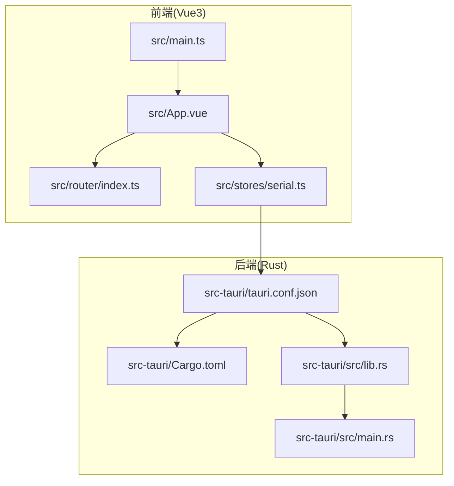
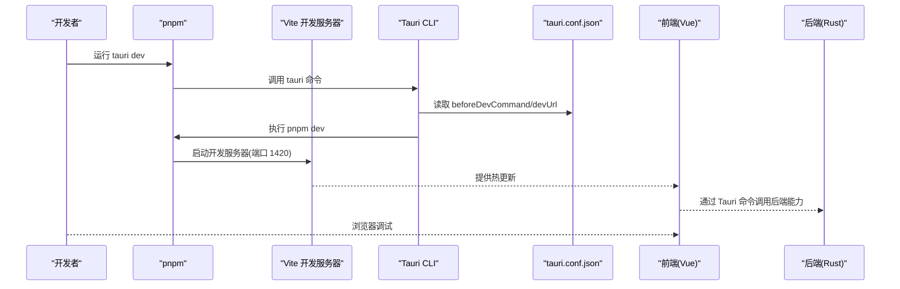
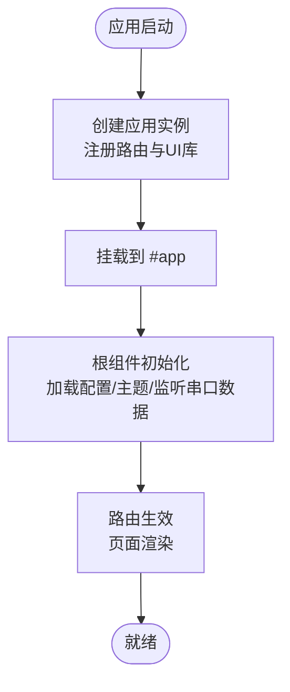
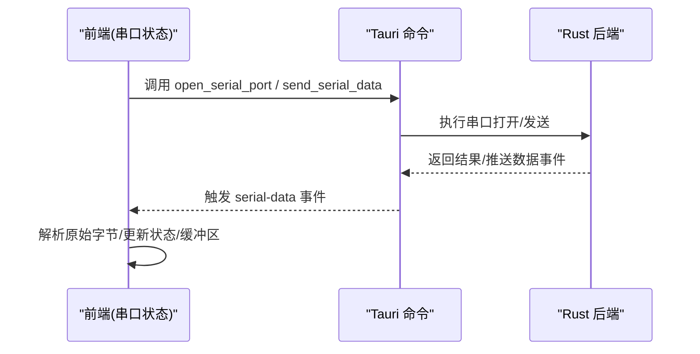
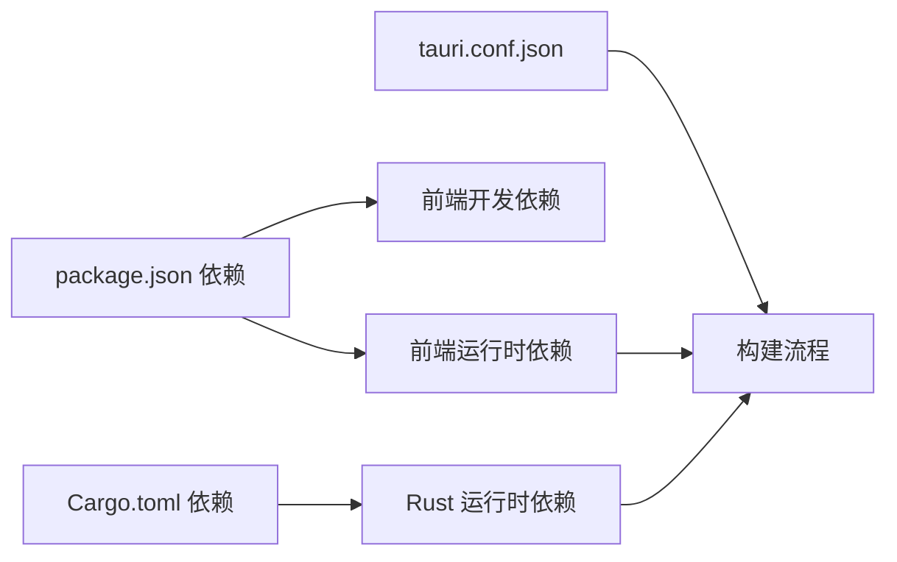

# 快速开始

<cite>
**本文引用的文件**   
- [README.md](file://README.md)
- [package.json](file://package.json)
- [vite.config.ts](file://vite.config.ts)
- [src-tauri/tauri.conf.json](file://src-tauri/tauri.conf.json)
- [src-tauri/Cargo.toml](file://src-tauri/Cargo.toml)
- [src/main.ts](file://src/main.ts)
- [src/App.vue](file://src/App.vue)
- [src/router/index.ts](file://src/router/index.ts)
- [src/stores/serial.ts](file://src/stores/serial.ts)
- [tsconfig.json](file://tsconfig.json)
- [tsconfig.node.json](file://tsconfig.node.json)
- [postcss.config.js](file://postcss.config.js)
- [DESIGN.md](file://DESIGN.md)
</cite>

## 目录
1. [简介](#简介)
2. [项目结构](#项目结构)
3. [核心组件](#核心组件)
4. [架构总览](#架构总览)
5. [详细组件分析](#详细组件分析)
6. [依赖关系分析](#依赖关系分析)
7. [性能注意事项](#性能注意事项)
8. [故障排除指南](#故障排除指南)
9. [结论](#结论)
10. [附录](#附录)

## 简介
本指南面向首次接触 KonSerial 的开发者，帮助你在 Windows、macOS、Linux 上快速完成环境准备、项目克隆、依赖安装、开发服务器启动以及生产构建。KonSerial 是一款基于 Tauri + Vue3 + Rust + TypeScript 的现代化串口调试工具，支持多协议、波形显示、脚本自动化与数据保存等功能。

## 项目结构
KonSerial 采用前后端分离架构：
- 前端：Vue 3 + TypeScript，使用 Vite 构建与热更新；通过 Tauri 命令与 Rust 后端交互。
- 后端：Rust + Tauri，负责串口、网络、脚本与文件系统等系统级能力。
- 构建与打包：Vite + pnpm + Tauri CLI，最终产出桌面应用。

**图表来源**
- [src/main.ts:1-14](file://src/main.ts#L1-L14)
- [src/App.vue:1-33](file://src/App.vue#L1-L33)
- [src/router/index.ts:1-38](file://src/router/index.ts#L1-L38)
- [src/stores/serial.ts:1-363](file://src/stores/serial.ts#L1-L363)
- [src-tauri/tauri.conf.json:1-47](file://src-tauri/tauri.conf.json#L1-L47)
- [src-tauri/Cargo.toml:1-40](file://src-tauri/Cargo.toml#L1-L40)

**章节来源**
- [README.md:104-119](file://README.md#L104-L119)
- [DESIGN.md:34-139](file://DESIGN.md#L34-L139)

## 核心组件
- 前端入口与挂载：应用在入口文件中创建并挂载根组件，注册路由与 UI 库。
- 应用根组件：负责主题、消息提供者与布局容器的初始化。
- 路由系统：定义页面路径与组件映射，提供标题与历史模式。
- 串口状态管理：封装多连接状态、事件监听、数据收发与全局信息轮询。
- Tauri 配置：定义开发/构建前命令、前端产物目录、窗口尺寸与打包目标。
- Rust 依赖：Tauri、串口库、脚本引擎、日志与数据库等。

**章节来源**
- [src/main.ts:1-14](file://src/main.ts#L1-L14)
- [src/App.vue:1-33](file://src/App.vue#L1-L33)
- [src/router/index.ts:1-38](file://src/router/index.ts#L1-L38)
- [src/stores/serial.ts:1-363](file://src/stores/serial.ts#L1-L363)
- [src-tauri/tauri.conf.json:1-47](file://src-tauri/tauri.conf.json#L1-L47)
- [src-tauri/Cargo.toml:1-40](file://src-tauri/Cargo.toml#L1-L40)

## 架构总览
下图展示了开发与构建的关键流程：前端通过 Vite 启动开发服务器，Tauri 在 dev 模式下加载该地址；构建阶段先编译前端产物，再由 Tauri 打包为桌面应用。

**图表来源**
- [vite.config.ts:18-39](file://vite.config.ts#L18-L39)
- [src-tauri/tauri.conf.json:6-11](file://src-tauri/tauri.conf.json#L6-L11)
- [package.json:6-11](file://package.json#L6-L11)

## 详细组件分析

### 环境要求与安装
- Node.js：推荐使用长期支持（LTS）版本。
- Rust：使用稳定版本即可。
- pnpm：作为包管理器与构建驱动。
- 平台依赖：根据目标平台安装系统依赖（如 Windows 的 Visual Studio 构建工具、macOS 的 Xcode Command Line Tools、Linux 的 build-essential 等）。

安装步骤（示例命令，按需替换为你的系统）：
- 安装 Node.js（LTS）与 pnpm
- 安装 Rust 工具链（使用官方安装器）
- 安装系统依赖（参考 Tauri 官方文档）

验证安装：
- node -v
- pnpm -v
- rustc --version

**章节来源**
- [README.md:32-36](file://README.md#L32-L36)

### 克隆与依赖安装
- 克隆仓库
- 进入项目目录
- 安装依赖

命令示例：
- git clone https://github.com/sratle/KonSerial.git
- cd KonSerial
- pnpm install

预期输出（示例）：
- 安装完成后会在终端看到依赖下载与安装进度，最终出现安装完成提示。

**章节来源**
- [README.md:37-48](file://README.md#L37-L48)

### 启动开发服务器
- 启动 Tauri 开发模式，内部会先执行前端开发服务器，再由 Tauri 加载前端页面。

命令示例：
- pnpm tauri dev

预期输出（示例）：
- Vite 启动并打印开发服务器地址（默认端口 1420）
- Tauri 输出窗口创建与加载前端资源的日志
- 浏览器打开应用界面

**章节来源**
- [README.md:46-48](file://README.md#L46-L48)
- [vite.config.ts:23-39](file://vite.config.ts#L23-L39)
- [src-tauri/tauri.conf.json:7-11](file://src-tauri/tauri.conf.json#L7-L11)

### 生产构建
- 构建前端产物与打包桌面应用

命令示例：
- pnpm tauri build

产物位置（示例）：
- 构建完成后在 src-tauri/target/release/bundle/ 下生成平台对应的安装包

**章节来源**
- [README.md:50-56](file://README.md#L50-L56)
- [src-tauri/tauri.conf.json:9-11](file://src-tauri/tauri.conf.json#L9-L11)

### 前端入口与路由
- 入口文件创建应用实例，注册路由与 UI 库，并挂载到 DOM。
- 根组件负责主题、消息与布局容器初始化。
- 路由定义了默认跳转与页面映射。

**图表来源**
- [src/main.ts:1-14](file://src/main.ts#L1-L14)
- [src/App.vue:14-19](file://src/App.vue#L14-L19)
- [src/router/index.ts:1-38](file://src/router/index.ts#L1-L38)

**章节来源**
- [src/main.ts:1-14](file://src/main.ts#L1-L14)
- [src/App.vue:1-33](file://src/App.vue#L1-L33)
- [src/router/index.ts:1-38](file://src/router/index.ts#L1-L38)

### 串口状态管理（前端）
- 多连接架构：每个连接拥有独立 ID、状态与统计信息。
- 事件监听：订阅后端推送的串口数据事件，转发给组件层解码与展示。
- 数据收发：支持文本与十六进制两种模式，自动编码与统计发送字节数。
- 全局信息轮询：定时拉取后端状态，保持 UI 与后端一致。

**图表来源**
- [src/stores/serial.ts:145-285](file://src/stores/serial.ts#L145-L285)
- [src-tauri/tauri.conf.json:1-47](file://src-tauri/tauri.conf.json#L1-L47)

**章节来源**
- [src/stores/serial.ts:1-363](file://src/stores/serial.ts#L1-L363)

### TypeScript 与构建配置
- TypeScript 编译选项：启用严格模式、Bundler 模式、路径别名等。
- Vite 配置：固定开发端口、禁用清屏、忽略 src-tauri 目录监控、HMR 配置。
- PostCSS：集成 Tailwind CSS 与 autoprefixer。

**章节来源**
- [tsconfig.json:1-32](file://tsconfig.json#L1-L32)
- [tsconfig.node.json:1-11](file://tsconfig.node.json#L1-L11)
- [vite.config.ts:1-40](file://vite.config.ts#L1-L40)
- [postcss.config.js:1-6](file://postcss.config.js#L1-L6)

## 依赖关系分析
- 前端依赖：Vue3、Vue Router、Pinia、Naive UI、ApexCharts 等。
- 开发依赖：Vite、TypeScript、PostCSS、Tailwind CSS、Tauri CLI 等。
- Rust 依赖：Tauri、serialport、tokio、rhai、serde_json、rusqlite 等。
- Tauri 配置：定义构建前命令、前端产物目录、窗口尺寸与打包目标。

**图表来源**
- [package.json:12-38](file://package.json#L12-L38)
- [src-tauri/Cargo.toml:20-36](file://src-tauri/Cargo.toml#L20-L36)
- [src-tauri/tauri.conf.json:6-11](file://src-tauri/tauri.conf.json#L6-L11)

**章节来源**
- [package.json:1-40](file://package.json#L1-L40)
- [src-tauri/Cargo.toml:1-40](file://src-tauri/Cargo.toml#L1-L40)
- [src-tauri/tauri.conf.json:1-47](file://src-tauri/tauri.conf.json#L1-L47)

## 性能注意事项
- 前端：Vite 固定端口与禁用清屏减少开发时的干扰；忽略 src-tauri 监控降低磁盘 IO。
- 串口：前端对接收缓冲区设置上限，避免内存膨胀；后端使用异步读取与事件推送，避免阻塞 UI。
- 构建：生产构建前先编译前端，再由 Tauri 打包，确保产物一致性。

**章节来源**
- [vite.config.ts:21-39](file://vite.config.ts#L21-L39)
- [src/stores/serial.ts:102-112](file://src/stores/serial.ts#L102-L112)

## 故障排除指南
常见问题与解决思路：
- 开发服务器无法启动或端口被占用
  - 确认端口 1420 未被占用；若被占用，修改 Vite 配置中的端口或释放占用进程。
  - 参考：[vite.config.ts:23-25](file://vite.config.ts#L23-L25)
- Tauri dev 启动后页面空白
  - 检查 beforeDevCommand 是否正确执行 pnpm dev；确认前端开发服务器已启动且可访问 devUrl。
  - 参考：[src-tauri/tauri.conf.json:7-11](file://src-tauri/tauri.conf.json#L7-L11)
- 串口无法打开或无数据
  - 检查系统串口权限与设备连接；在前端刷新可用串口列表并确认端口名称。
  - 参考：[src/stores/serial.ts:146-155](file://src/stores/serial.ts#L146-L155)
- 构建失败
  - 确保已安装系统依赖（平台工具链）；检查 Rust 版本与 Tauri CLI 版本兼容性。
  - 参考：[src-tauri/Cargo.toml:1-40](file://src-tauri/Cargo.toml#L1-L40)
- pnpm 安装报错
  - 清理缓存并重试：pnpm store prune；或更换镜像源后重试。
  - 参考：[package.json:6-11](file://package.json#L6-L11)

**章节来源**
- [vite.config.ts:23-25](file://vite.config.ts#L23-L25)
- [src-tauri/tauri.conf.json:7-11](file://src-tauri/tauri.conf.json#L7-L11)
- [src/stores/serial.ts:146-155](file://src/stores/serial.ts#L146-L155)
- [src-tauri/Cargo.toml:1-40](file://src-tauri/Cargo.toml#L1-L40)
- [package.json:6-11](file://package.json#L6-L11)

## 结论
按照本指南，你可以快速完成环境准备、项目克隆、依赖安装与开发启动，并顺利进行生产构建。遇到问题时，可依据故障排除章节逐项排查。随着对项目结构与配置的熟悉，你可以进一步扩展功能、优化性能并定制化界面与行为。

## 附录
- 快速命令清单
  - 克隆与安装：git clone + pnpm install
  - 开发启动：pnpm tauri dev
  - 生产构建：pnpm tauri build
- 目录与文件速览
  - 前端入口：src/main.ts
  - 根组件：src/App.vue
  - 路由：src/router/index.ts
  - 串口状态：src/stores/serial.ts
  - 前端配置：vite.config.ts、tsconfig.json、postcss.config.js
  - 后端配置：src-tauri/tauri.conf.json、src-tauri/Cargo.toml