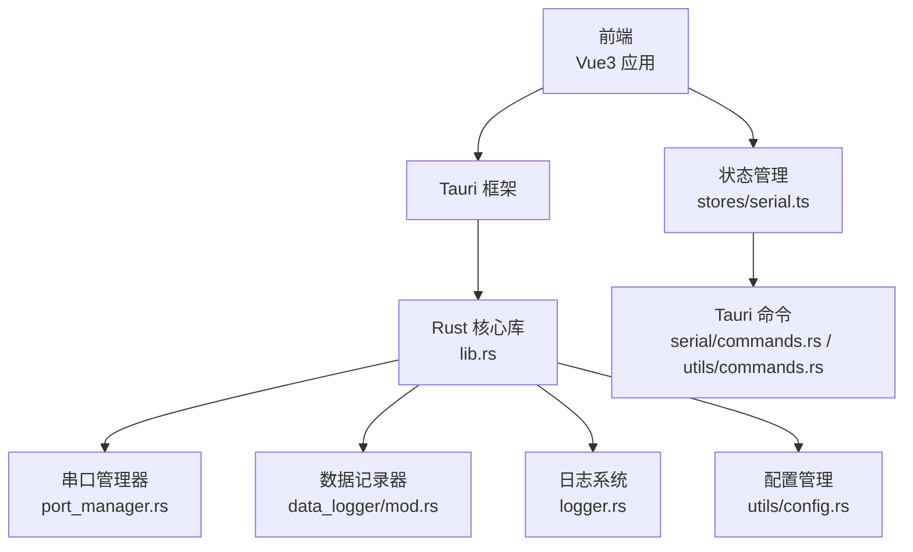
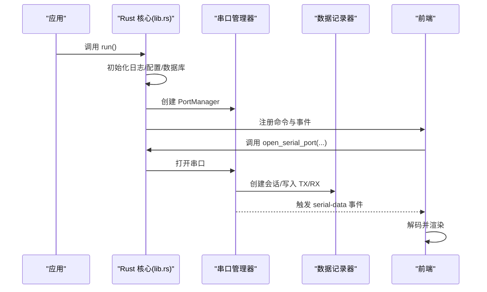
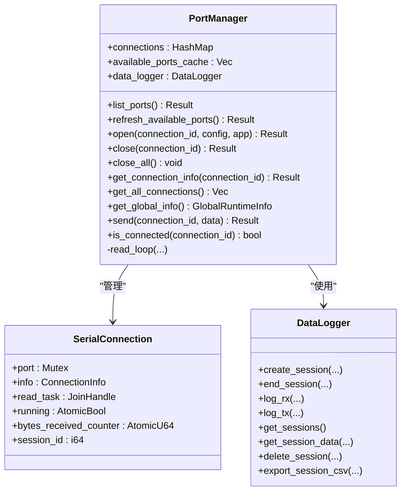
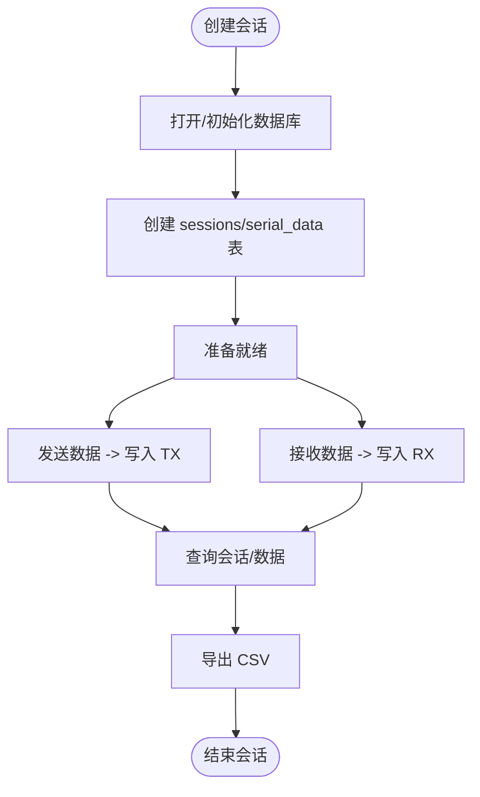
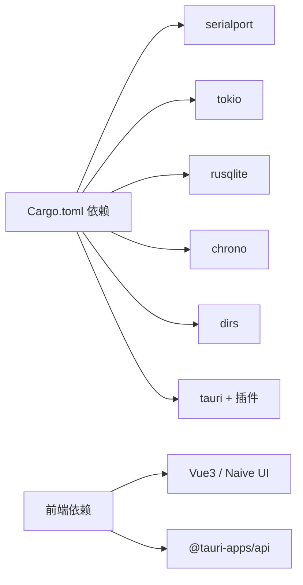

# 故障排除

<cite>
**本文引用的文件**
- [src-tauri/src/lib.rs](file://src-tauri/src/lib.rs)
- [src-tauri/src/main.rs](file://src-tauri/src/main.rs)
- [src-tauri/src/utils/logger.rs](file://src-tauri/src/utils/logger.rs)
- [src-tauri/src/serial/mod.rs](file://src-tauri/src/serial/mod.rs)
- [src-tauri/src/serial/port_manager.rs](file://src-tauri/src/serial/port_manager.rs)
- [src-tauri/src/serial/commands.rs](file://src-tauri/src/serial/commands.rs)
- [src-tauri/src/data_logger/mod.rs](file://src-tauri/src/data_logger/mod.rs)
- [src-tauri/src/utils/config.rs](file://src-tauri/src/utils/config.rs)
- [src-tauri/src/utils/commands.rs](file://src-tauri/src/utils/commands.rs)
- [src-tauri/Cargo.toml](file://src-tauri/Cargo.toml)
- [src-tauri/tauri.conf.json](file://src-tauri/tauri.conf.json)
- [src/views/SerialView.vue](file://src/views/SerialView.vue)
- [src/stores/serial.ts](file://src/stores/serial.ts)
- [src/stores/settings.ts](file://src/stores/settings.ts)
- [README.md](file://README.md)
</cite>

## 目录
1. [简介](#简介)
2. [项目结构](#项目结构)
3. [核心组件](#核心组件)
4. [架构总览](#架构总览)
5. [详细组件分析](#详细组件分析)
6. [依赖关系分析](#依赖关系分析)
7. [性能考虑](#性能考虑)
8. [故障排除指南](#故障排除指南)
9. [结论](#结论)
10. [附录](#附录)

## 简介
本指南面向 KonSerial 的用户与开发者，提供系统性的故障排除方法。内容涵盖环境配置、串口连接失败、数据传输异常、日志使用与分析、性能问题识别与优化、错误代码含义与解决步骤、社区支持与问题反馈渠道，以及紧急恢复与修复指导。文档以仓库现有实现为依据，结合前端与后端交互流程，帮助快速定位与解决问题。

## 项目结构
KonSerial 采用 Tauri + Vue3 + Rust 的前后端分离架构：
- 前端：Vue3 单页应用，通过 Tauri 命令与 Rust 后端交互，负责 UI、事件监听与状态管理。
- 后端：Rust 提供串口管理、数据记录、日志系统与插件集成，通过 Tauri 暴露命令接口。
- 配置与日志：统一的配置文件与日志宏，贯穿启动与运行期。

**图表来源**
- [src-tauri/src/lib.rs:24-82](file://src-tauri/src/lib.rs#L24-L82)
- [src-tauri/src/serial/port_manager.rs:162-180](file://src-tauri/src/serial/port_manager.rs#L162-L180)
- [src-tauri/src/data_logger/mod.rs:47-50](file://src-tauri/src/data_logger/mod.rs#L47-L50)
- [src-tauri/src/utils/logger.rs:41-50](file://src-tauri/src/utils/logger.rs#L41-L50)
- [src-tauri/src/utils/config.rs:65-94](file://src-tauri/src/utils/config.rs#L65-L94)
- [src/stores/serial.ts:145-240](file://src/stores/serial.ts#L145-L240)
- [src-tauri/src/serial/commands.rs:15-129](file://src-tauri/src/serial/commands.rs#L15-L129)

**章节来源**
- [README.md:1-127](file://README.md#L1-L127)
- [src-tauri/tauri.conf.json:1-47](file://src-tauri/tauri.conf.json#L1-L47)

## 核心组件
- 串口管理器：负责枚举串口、打开/关闭连接、读写数据、统计与错误状态维护。
- 数据记录器：基于 SQLite 的会话与数据持久化，支持查询、导出与清理。
- 日志系统：统一的日志初始化与输出格式，支持时间、级别、位置信息。
- 配置管理：跨平台配置文件路径与序列化/反序列化，支持加载、保存与重载。
- 前端状态与命令：通过 Tauri 命令与后端交互，监听串口数据事件，维护 UI 状态。

**章节来源**
- [src-tauri/src/serial/port_manager.rs:162-401](file://src-tauri/src/serial/port_manager.rs#L162-L401)
- [src-tauri/src/data_logger/mod.rs:47-273](file://src-tauri/src/data_logger/mod.rs#L47-L273)
- [src-tauri/src/utils/logger.rs:41-132](file://src-tauri/src/utils/logger.rs#L41-L132)
- [src-tauri/src/utils/config.rs:65-176](file://src-tauri/src/utils/config.rs#L65-L176)
- [src/stores/serial.ts:145-363](file://src/stores/serial.ts#L145-L363)

## 架构总览
后端启动时初始化日志、加载配置、初始化数据记录器与串口管理器，并注册 Tauri 命令。前端通过 invoke 调用命令，串口数据通过事件从后端推送至前端，同时写入 SQLite。

**图表来源**
- [src-tauri/src/lib.rs:24-82](file://src-tauri/src/lib.rs#L24-L82)
- [src-tauri/src/serial/port_manager.rs:196-272](file://src-tauri/src/serial/port_manager.rs#L196-L272)
- [src-tauri/src/data_logger/mod.rs:115-164](file://src-tauri/src/data_logger/mod.rs#L115-L164)
- [src/stores/serial.ts:311-332](file://src/stores/serial.ts#L311-L332)

## 详细组件分析

### 串口管理器（PortManager）
- 职责：多连接管理、串口枚举、打开/关闭、读写循环、状态统计、错误记录。
- 关键点：
  - 打开串口时创建会话并启动读取任务，读取循环每批读取并推送事件。
  - 发送失败时更新连接状态与最后错误，便于前端展示。
  - 关闭连接时终止读取任务并结束会话。

**图表来源**
- [src-tauri/src/serial/port_manager.rs:162-401](file://src-tauri/src/serial/port_manager.rs#L162-L401)
- [src-tauri/src/data_logger/mod.rs:47-273](file://src-tauri/src/data_logger/mod.rs#L47-L273)

**章节来源**
- [src-tauri/src/serial/port_manager.rs:196-392](file://src-tauri/src/serial/port_manager.rs#L196-L392)

### 数据记录器（DataLogger）
- 职责：会话生命周期管理、RX/TX 数据持久化、查询与导出。
- 关键点：
  - WAL 模式与外键约束提升并发与一致性。
  - 会话表与数据表关联，支持按会话查询与统计。
  - 导出 CSV 时将二进制数据转为十六进制字符串。

**图表来源**
- [src-tauri/src/data_logger/mod.rs:64-164](file://src-tauri/src/data_logger/mod.rs#L64-L164)
- [src-tauri/src/data_logger/mod.rs:203-271](file://src-tauri/src/data_logger/mod.rs#L203-L271)

**章节来源**
- [src-tauri/src/data_logger/mod.rs:115-271](file://src-tauri/src/data_logger/mod.rs#L115-L271)

### 日志系统（Logger）
- 职责：统一初始化与格式化输出，支持时间、级别、位置信息。
- 关键点：
  - 通过宏封装 Info/Warn/Error 输出，便于在各模块使用。
  - 启动时在应用入口初始化，保证后续日志可见。

**章节来源**
- [src-tauri/src/utils/logger.rs:41-132](file://src-tauri/src/utils/logger.rs#L41-L132)
- [src-tauri/src/lib.rs:26-29](file://src-tauri/src/lib.rs#L26-L29)

### 配置管理（AppConfig）
- 职责：跨平台配置文件路径、加载/保存/重载、默认值与字段定义。
- 关键点：
  - 默认路径在不同平台下自动确定，首次运行自动创建。
  - 保存前自动创建父目录，失败时记录错误日志。

**章节来源**
- [src-tauri/src/utils/config.rs:65-176](file://src-tauri/src/utils/config.rs#L65-L176)

### 前端交互与状态（SerialView.vue / stores/serial.ts）
- 职责：UI 控件、连接状态、发送/接收、事件订阅、轮询更新。
- 关键点：
  - 通过 invoke 调用后端命令，监听 serial-data 事件并解码显示。
  - 支持 HEX/文本两种发送模式，自动滚动与缓冲区裁剪。
  - 定时轮询更新全局信息，保持 UI 与后端状态一致。

**章节来源**
- [src/views/SerialView.vue:140-254](file://src/views/SerialView.vue#L140-L254)
- [src/stores/serial.ts:145-363](file://src/stores/serial.ts#L145-L363)

## 依赖关系分析
- Rust 核心依赖：serialport（串口）、tokio（异步）、rusqlite（SQLite）、chrono（时间）、dirs（路径）等。
- Tauri 插件：dialog、clipboard-manager、fs、opener、cli 等。
- 前端依赖：Vue3、Naive UI、@tauri-apps/api。

**图表来源**
- [src-tauri/Cargo.toml:20-40](file://src-tauri/Cargo.toml#L20-L40)

**章节来源**
- [src-tauri/Cargo.toml:20-40](file://src-tauri/Cargo.toml#L20-L40)

## 性能考虑
- 读取循环：每次读取固定缓冲区大小，超时控制确保及时响应关闭信号。
- 异步与并发：Tokio 任务与互斥锁保护串口句柄与状态，避免竞争。
- 数据持久化：WAL 模式与索引提升查询效率；导出 CSV 时逐条拼接，注意大数据量场景。
- 前端渲染：接收缓冲区上限裁剪，避免内存膨胀；自动滚动仅在开启时触发。

**章节来源**
- [src-tauri/src/serial/port_manager.rs:274-303](file://src-tauri/src/serial/port_manager.rs#L274-L303)
- [src-tauri/src/data_logger/mod.rs:76-106](file://src-tauri/src/data_logger/mod.rs#L76-L106)
- [src/views/SerialView.vue:212-228](file://src/views/SerialView.vue#L212-L228)

## 故障排除指南

### 一、环境配置问题
- 症状
  - 应用启动后无日志或日志不显示。
  - 配置文件未创建或加载失败。
- 排查步骤
  - 确认应用入口已初始化日志：查看启动流程中日志初始化调用。
  - 检查配置文件路径是否存在与权限是否正确：参考默认路径生成逻辑。
  - 若首次运行未创建配置，检查保存流程是否报错。
- 解决方案
  - 手动创建配置目录与文件，或以管理员权限运行应用。
  - 确保跨平台路径解析正常（Windows/macOS/Linux）。

**章节来源**
- [src-tauri/src/lib.rs:26-40](file://src-tauri/src/lib.rs#L26-L40)
- [src-tauri/src/utils/config.rs:65-94](file://src-tauri/src/utils/config.rs#L65-L94)

### 二、串口连接失败
- 症状
  - 打开串口时报错，状态停留在 Connecting 或出现 Error。
  - 刷新串口列表为空。
- 排查步骤
  - 检查串口名称是否正确、设备是否被占用。
  - 查看后端日志中的错误信息，确认打开串口失败原因。
  - 确认串口参数（波特率、数据位、停止位、校验、流控）与设备匹配。
- 解决方案
  - 更换串口名称或调整参数。
  - 关闭其他占用串口的程序后再试。
  - 使用“刷新可用串口列表”功能确认设备枚举结果。

**章节来源**
- [src-tauri/src/serial/port_manager.rs:182-194](file://src-tauri/src/serial/port_manager.rs#L182-L194)
- [src-tauri/src/serial/port_manager.rs:214-272](file://src-tauri/src/serial/port_manager.rs#L214-L272)
- [src/stores/serial.ts:145-155](file://src/stores/serial.ts#L145-L155)

### 三、数据传输异常
- 症状
  - 发送数据后无回显，或接收数据乱码。
  - 发送字节数与预期不符。
- 排查步骤
  - 检查发送模式（HEX/文本）与换行符追加策略。
  - 查看后端发送接口返回值与错误状态。
  - 确认编码设置（UTF-8/GBK）与前端解码一致。
- 解决方案
  - 在发送前确认数据格式与编码，必要时手动添加换行符。
  - 调整串口参数（尤其是校验与停止位），确保与设备一致。
  - 对于乱码问题，统一前后端编码设置并重启应用。

**章节来源**
- [src/views/SerialView.vue:191-205](file://src/views/SerialView.vue#L191-L205)
- [src/stores/serial.ts:242-274](file://src/stores/serial.ts#L242-L274)
- [src/views/SerialView.vue:237-244](file://src/views/SerialView.vue#L237-L244)

### 四、日志系统使用与分析
- 使用方法
  - 后端启动时初始化日志；在各模块使用日志宏输出 Info/Warn/Error。
  - 日志包含时间、级别、文件与行号，便于定位问题。
- 分析技巧
  - 关注串口打开/关闭、发送失败、读取超时等关键节点的日志。
  - 结合前端消息提示与后端日志，复现问题发生的时间线。
- 建议
  - 在排查复杂问题时临时提高日志详细度（如显示位置）。

**章节来源**
- [src-tauri/src/utils/logger.rs:41-132](file://src-tauri/src/utils/logger.rs#L41-L132)
- [src-tauri/src/lib.rs:26-40](file://src-tauri/src/lib.rs#L26-L40)

### 五、系统性问题诊断流程
- 步骤
  - 确认环境：Node.js、Rust、pnpm、系统串口驱动正常。
  - 启动应用并观察日志初始化与数据库初始化是否成功。
  - 刷新串口列表，确认设备可见。
  - 打开串口，检查状态与统计数据。
  - 发送测试数据，观察回显与事件推送。
  - 如异常，结合日志与错误提示定位模块（串口/数据库/配置）。
- 工具
  - Tauri CLI 插件参数：可通过命令行传参辅助调试。
  - 前端消息提示与状态轮询，辅助快速验证。

**章节来源**
- [src-tauri/tauri.conf.json:24-33](file://src-tauri/tauri.conf.json#L24-L33)
- [src/stores/serial.ts:347-362](file://src/stores/serial.ts#L347-L362)

### 六、性能问题识别与优化
- 识别
  - 接收缓冲区过大导致内存增长。
  - 导出 CSV 时卡顿，尤其在大量数据场景。
  - 串口读取阻塞或频繁超时。
- 优化建议
  - 调整最大缓冲区大小，避免无限增长。
  - 分批导出或限制导出范围，减少一次性处理量。
  - 适当增大串口超时或调整读取缓冲区大小。
  - 关闭不必要的连接，降低并发压力。

**章节来源**
- [src/stores/settings.ts:60-65](file://src/stores/settings.ts#L60-L65)
- [src-tauri/src/data_logger/mod.rs:257-271](file://src-tauri/src/data_logger/mod.rs#L257-L271)
- [src-tauri/src/serial/port_manager.rs:274-303](file://src-tauri/src/serial/port_manager.rs#L274-L303)

### 七、错误代码与解决步骤
- 常见错误类型
  - 串口打开失败：检查串口名称、权限与占用情况。
  - 发送失败：检查连接状态、参数配置与设备响应。
  - 数据库初始化失败：检查目录权限与路径有效性。
  - 配置保存失败：检查目标路径与父目录创建权限。
- 解决步骤
  - 逐一核对参数与设备状态。
  - 查看后端日志中的具体错误描述。
  - 必要时重置配置或重建数据库文件。

**章节来源**
- [src-tauri/src/serial/port_manager.rs:266-271](file://src-tauri/src/serial/port_manager.rs#L266-L271)
- [src-tauri/src/data_logger/mod.rs:67-71](file://src-tauri/src/data_logger/mod.rs#L67-L71)
- [src-tauri/src/utils/config.rs:127-143](file://src-tauri/src/utils/config.rs#L127-L143)

### 八、社区支持与问题反馈
- 反馈渠道
  - 提交 Issue：在项目仓库提交问题描述与日志片段。
  - 联系作者：通过 README 中提供的联系方式沟通。
- 建议
  - 提供操作系统版本、串口设备型号、参数配置与日志截图。

**章节来源**
- [README.md:125-127](file://README.md#L125-L127)

### 九、紧急恢复与修复指导
- 操作
  - 删除或重命名配置文件，重启应用以生成默认配置。
  - 删除数据库文件，重启应用以重建数据库。
  - 关闭所有串口连接，释放系统资源。
- 注意
  - 删除配置与数据库前请备份重要数据。
  - 如涉及系统权限问题，以管理员身份运行。

**章节来源**
- [src-tauri/src/utils/config.rs:86-94](file://src-tauri/src/utils/config.rs#L86-L94)
- [src-tauri/src/data_logger/mod.rs:67-71](file://src-tauri/src/data_logger/mod.rs#L67-L71)
- [src-tauri/src/serial/port_manager.rs:305-331](file://src-tauri/src/serial/port_manager.rs#L305-L331)

## 结论
本指南基于 KonSerial 的实际实现，提供了从环境配置、串口连接、数据传输到日志分析、性能优化与紧急修复的全流程排障方法。建议在日常使用中结合前端消息提示与后端日志，建立标准化的诊断流程，以便快速定位并解决问题。

## 附录

### A. 关键命令与事件映射
- 串口相关命令：列出串口、刷新串口、打开/关闭串口、发送数据、查询状态。
- 事件：serial-data（后端向前端推送原始字节）。
- 配置命令：加载/保存/获取配置路径。

**章节来源**
- [src-tauri/src/serial/commands.rs:15-129](file://src-tauri/src/serial/commands.rs#L15-L129)
- [src-tauri/src/utils/commands.rs:3-31](file://src-tauri/src/utils/commands.rs#L3-L31)
- [src/stores/serial.ts:311-332](file://src/stores/serial.ts#L311-L332)