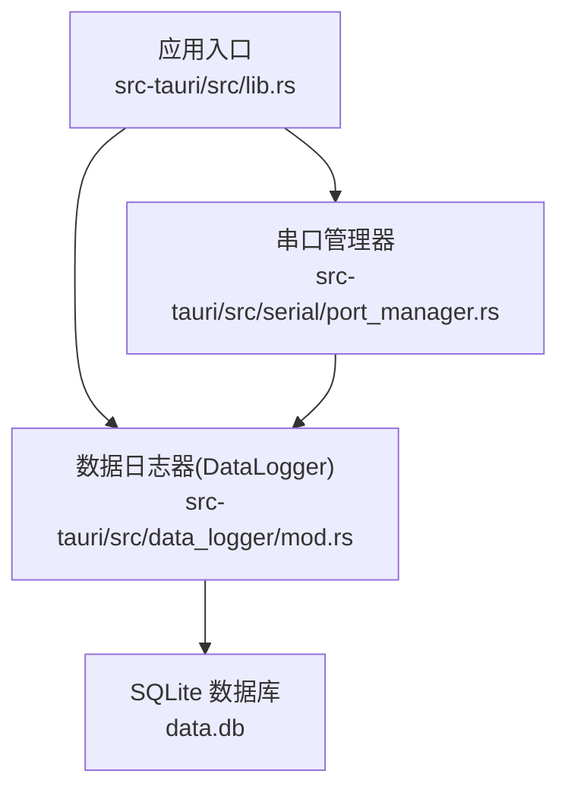
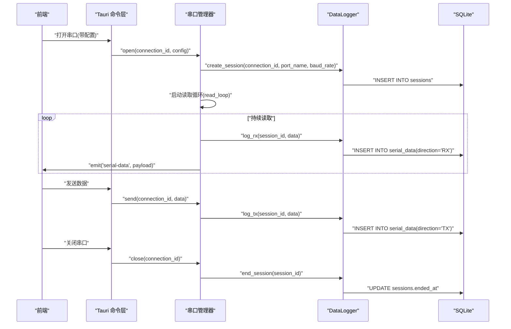
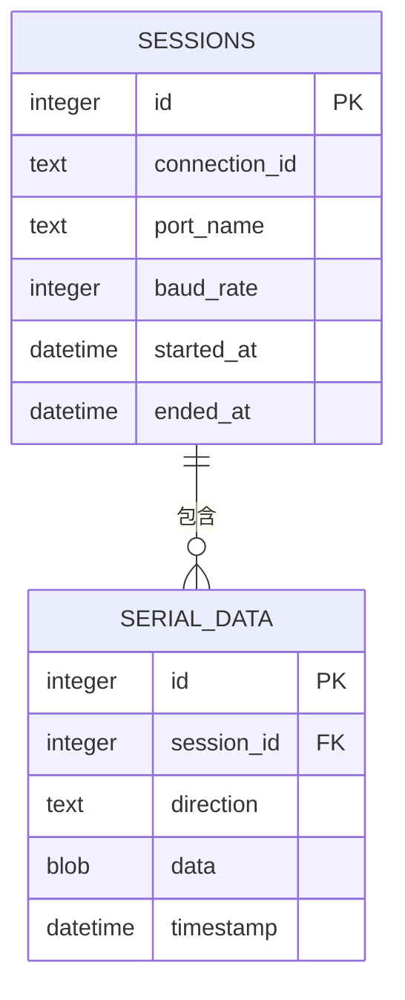
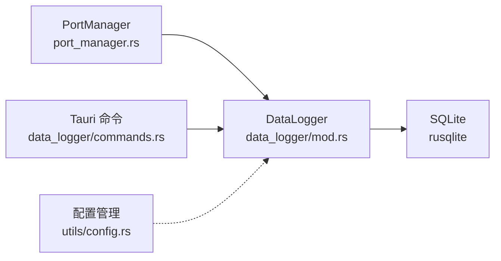

# 数据库设计

<cite>
**本文引用的文件**
- [src-tauri/src/lib.rs](file://src-tauri/src/lib.rs)
- [src-tauri/src/data_logger/mod.rs](file://src-tauri/src/data_logger/mod.rs)
- [src-tauri/src/data_logger/commands.rs](file://src-tauri/src/data_logger/commands.rs)
- [src-tauri/src/serial/port_manager.rs](file://src-tauri/src/serial/port_manager.rs)
- [src-tauri/src/utils/config.rs](file://src-tauri/src/utils/config.rs)
- [src-tauri/Cargo.toml](file://src-tauri/Cargo.toml)
- [DESIGN.md](file://DESIGN.md)
</cite>

## 目录
1. [引言](#引言)
2. [项目结构](#项目结构)
3. [核心组件](#核心组件)
4. [架构总览](#架构总览)
5. [详细组件分析](#详细组件分析)
6. [依赖分析](#依赖分析)
7. [性能考量](#性能考量)
8. [故障排查指南](#故障排查指南)
9. [结论](#结论)
10. [附录](#附录)

## 引言
本文件面向 KonSerial 的数据库设计，聚焦基于 SQLite 的数据存储架构。文档围绕会话信息模型、数据记录模型与配置信息模型展开，系统阐述表结构设计、关系映射与约束定义；解释数据访问模式、缓存策略与性能优化；给出数据生命周期管理、保留策略与归档建议；并提供数据库迁移路径与版本管理策略、数据验证与业务规则实现，以及实际 SQL 示例与数据操作参考路径。

## 项目结构
KonSerial 后端采用 Rust + Tauri 架构，数据库位于 Tauri 后端模块内，通过 DataLogger 统一管理 SQLite 存储。应用启动时初始化 DataLogger，并将其注入串口管理器，用于在串口读写过程中同步持久化数据。

图示来源
- [src-tauri/src/lib.rs:25-55](file://src-tauri/src/lib.rs#L25-L55)
- [src-tauri/src/serial/port_manager.rs:174-272](file://src-tauri/src/serial/port_manager.rs#L174-L272)
- [src-tauri/src/data_logger/mod.rs:64-111](file://src-tauri/src/data_logger/mod.rs#L64-L111)

章节来源
- [src-tauri/src/lib.rs:25-55](file://src-tauri/src/lib.rs#L25-L55)
- [src-tauri/src/data_logger/mod.rs:11-18](file://src-tauri/src/data_logger/mod.rs#L11-L18)

## 核心组件
- DataLogger：负责数据库初始化、表结构创建、事务安全访问、会话与数据记录的增删改查、CSV 导出等。
- PortManager：负责串口生命周期管理，打开串口时创建会话，关闭串口时结束会话，并在读写过程中调用 DataLogger 持久化数据。
- Tauri 命令：对外暴露会话查询、数据查询、删除会话、导出 CSV 等命令接口。
- 配置管理：独立的 JSON 配置文件，不涉及数据库，但与 DataLogger 的默认数据库路径配合使用。

章节来源
- [src-tauri/src/data_logger/mod.rs:47-111](file://src-tauri/src/data_logger/mod.rs#L47-L111)
- [src-tauri/src/serial/port_manager.rs:174-272](file://src-tauri/src/serial/port_manager.rs#L174-L272)
- [src-tauri/src/data_logger/commands.rs:7-48](file://src-tauri/src/data_logger/commands.rs#L7-L48)
- [src-tauri/src/utils/config.rs:65-94](file://src-tauri/src/utils/config.rs#L65-L94)

## 架构总览
下图展示了数据库相关模块之间的交互关系与数据流向：

图示来源
- [src-tauri/src/serial/port_manager.rs:197-272](file://src-tauri/src/serial/port_manager.rs#L197-L272)
- [src-tauri/src/data_logger/mod.rs:115-164](file://src-tauri/src/data_logger/mod.rs#L115-L164)
- [src-tauri/src/data_logger/mod.rs:144-164](file://src-tauri/src/data_logger/mod.rs#L144-L164)
- [src-tauri/src/data_logger/mod.rs:131-140](file://src-tauri/src/data_logger/mod.rs#L131-L140)

## 详细组件分析

### 数据模型与表结构
- sessions 表：记录一次串口会话的元信息，主键自增，包含连接标识、端口名、波特率、开始时间与结束时间。
- serial_data 表：记录每次读写的数据，外键关联 sessions.id，采用级联删除；方向字段限定为 TX/RX；时间戳默认当前本地时间；数据以 BLOB 存储。
- 索引 idx_serial_data_session：按会话与时间排序，支撑分页查询与时间序列检索。

图示来源
- [src-tauri/src/data_logger/mod.rs:84-106](file://src-tauri/src/data_logger/mod.rs#L84-L106)

章节来源
- [src-tauri/src/data_logger/mod.rs:84-106](file://src-tauri/src/data_logger/mod.rs#L84-L106)

### 数据访问模式与缓存策略
- 访问模式
  - 串口打开：创建会话(create_session)，返回 session_id。
  - 数据写入：log_rx/log_tx 分别记录接收/发送数据。
  - 查询会话：get_sessions 聚合统计 RX/TX 字节长度。
  - 查询数据：get_session_data 支持按方向过滤、分页(limit/offset)。
  - 删除与导出：delete_session(级联删除)、export_session_csv(导出为 CSV 字符串)。
- 缓存策略
  - sessions 表仅做会话元信息缓存，无额外内存缓存。
  - serial_data 表通过索引与分页查询满足高频读取场景。
  - 串口读取循环在独立线程中进行，避免阻塞主线程与 UI。

章节来源
- [src-tauri/src/data_logger/mod.rs:115-164](file://src-tauri/src/data_logger/mod.rs#L115-L164)
- [src-tauri/src/data_logger/mod.rs:168-244](file://src-tauri/src/data_logger/mod.rs#L168-L244)
- [src-tauri/src/data_logger/mod.rs:248-271](file://src-tauri/src/data_logger/mod.rs#L248-L271)
- [src-tauri/src/serial/port_manager.rs:274-303](file://src-tauri/src/serial/port_manager.rs#L274-L303)

### 数据生命周期管理与保留策略
- 生命周期
  - 创建：打开串口时创建会话。
  - 运行：读写过程中持续记录数据。
  - 结束：关闭串口时更新会话结束时间。
  - 归档/删除：删除会话时级联删除对应数据。
- 保留策略
  - 当前未内置自动清理策略，建议在应用层面提供“按天/按会话数量”等清理选项，或在导出后清理临时会话数据。
- 归档规则
  - 建议将历史会话导出为 CSV 并移动至归档目录，随后删除对应会话以释放空间。

章节来源
- [src-tauri/src/data_logger/mod.rs:115-140](file://src-tauri/src/data_logger/mod.rs#L115-L140)
- [src-tauri/src/data_logger/mod.rs:248-271](file://src-tauri/src/data_logger/mod.rs#L248-L271)
- [src-tauri/src/serial/port_manager.rs:305-331](file://src-tauri/src/serial/port_manager.rs#L305-L331)

### 数据验证与业务规则
- 方向字段约束：direction 限定为 'TX' 或 'RX'。
- 外键约束：serial_data.session_id 引用 sessions.id，并启用 ON DELETE CASCADE。
- 时间戳默认值：两个表的时间字段均使用本地时间默认值。
- 会话字节统计：get_sessions 使用聚合函数统计 RX/TX 字节长度，避免重复计算。

章节来源
- [src-tauri/src/data_logger/mod.rs:98](file://src-tauri/src/data_logger/mod.rs#L98)
- [src-tauri/src/data_logger/mod.rs:97](file://src-tauri/src/data_logger/mod.rs#L97)
- [src-tauri/src/data_logger/mod.rs:91](file://src-tauri/src/data_logger/mod.rs#L91)
- [src-tauri/src/data_logger/mod.rs:175-176](file://src-tauri/src/data_logger/mod.rs#L175-L176)

### 数据库迁移与版本管理
- 迁移策略
  - 采用“表结构初始化 + 版本号”的方式：首次运行时创建表结构；后续版本如需变更，可在 DataLogger::new 中追加迁移逻辑（例如 ALTER TABLE、REINDEX、新增索引等），并在迁移完成后更新版本号。
  - 对于破坏性变更，建议先备份 data.db，再执行迁移。
- 版本管理
  - 在应用启动时检查数据库版本，若低于当前版本则执行增量迁移。
  - 建议在 sessions 表中新增 version 字段或单独维护迁移日志表，记录已执行的迁移。

章节来源
- [src-tauri/src/data_logger/mod.rs:64-111](file://src-tauri/src/data_logger/mod.rs#L64-L111)

### 实际 SQL 示例与数据操作参考
- 创建数据库与表结构
  - 参考路径：[创建表与索引:84-106](file://src-tauri/src/data_logger/mod.rs#L84-L106)
- 写入会话
  - 参考路径：[create_session:115-129](file://src-tauri/src/data_logger/mod.rs#L115-L129)
- 结束会话
  - 参考路径：[end_session:131-140](file://src-tauri/src/data_logger/mod.rs#L131-L140)
- 记录接收/发送数据
  - 参考路径：[log_rx:144-153](file://src-tauri/src/data_logger/mod.rs#L144-L153)、[log_tx:155-164](file://src-tauri/src/data_logger/mod.rs#L155-L164)
- 查询会话列表（含字节统计）
  - 参考路径：[get_sessions:168-201](file://src-tauri/src/data_logger/mod.rs#L168-L201)
- 查询会话数据（分页与方向过滤）
  - 参考路径：[get_session_data:203-244](file://src-tauri/src/data_logger/mod.rs#L203-L244)
- 删除会话（级联删除）
  - 参考路径：[delete_session:248-255](file://src-tauri/src/data_logger/mod.rs#L248-L255)
- 导出会话为 CSV
  - 参考路径：[export_session_csv:257-271](file://src-tauri/src/data_logger/mod.rs#L257-L271)

## 依赖分析
- 外部依赖
  - rusqlite：SQLite 驱动，提供连接、事务、SQL 执行能力。
  - dirs：跨平台获取配置目录，决定数据库文件存放位置。
- 内部依赖
  - PortManager 依赖 DataLogger 进行数据持久化。
  - Tauri 命令层依赖 DataLogger 提供查询与导出能力。
  - 配置模块与数据库模块解耦，配置文件独立于 data.db。

图示来源
- [src-tauri/src/serial/port_manager.rs:174-179](file://src-tauri/src/serial/port_manager.rs#L174-L179)
- [src-tauri/src/data_logger/commands.rs:7-13](file://src-tauri/src/data_logger/commands.rs#L7-L13)
- [src-tauri/Cargo.toml:36](file://src-tauri/Cargo.toml#L36)

章节来源
- [src-tauri/Cargo.toml:36](file://src-tauri/Cargo.toml#L36)
- [src-tauri/src/utils/config.rs:65-94](file://src-tauri/src/utils/config.rs#L65-L94)

## 性能考量
- WAL 模式与同步级别
  - 启用 WAL 模式与 NORMAL 同步级别，提升并发读写性能与可靠性。
  - 参考路径：[PRAGMA 设置:77-82](file://src-tauri/src/data_logger/mod.rs#L77-L82)
- 外键约束与级联删除
  - 启用外键约束并使用 ON DELETE CASCADE，保证数据一致性，减少冗余清理逻辑。
  - 参考路径：[外键与级联:97-101](file://src-tauri/src/data_logger/mod.rs#L97-L101)
- 索引设计
  - 为 serial_data(session_id, timestamp) 建立复合索引，优化分页与时间序列查询。
  - 参考路径：[索引创建:103-104](file://src-tauri/src/data_logger/mod.rs#L103-L104)
- 查询优化
  - get_sessions 使用 LEFT JOIN + GROUP BY 聚合统计，避免多次往返查询。
  - get_session_data 支持 limit/offset，前端分页加载。
- I/O 与线程模型
  - 串口读取在独立线程中进行，避免阻塞主线程；数据写入为单条 INSERT，批量写入可通过前端缓冲合并实现（建议在前端或脚本层进行）。

章节来源
- [src-tauri/src/data_logger/mod.rs:77-82](file://src-tauri/src/data_logger/mod.rs#L77-L82)
- [src-tauri/src/data_logger/mod.rs:103-104](file://src-tauri/src/data_logger/mod.rs#L103-L104)
- [src-tauri/src/data_logger/mod.rs:168-201](file://src-tauri/src/data_logger/mod.rs#L168-L201)
- [src-tauri/src/data_logger/mod.rs:203-244](file://src-tauri/src/data_logger/mod.rs#L203-L244)
- [src-tauri/src/serial/port_manager.rs:274-303](file://src-tauri/src/serial/port_manager.rs#L274-L303)

## 故障排查指南
- 数据库初始化失败
  - 检查默认数据库路径是否存在写权限；确认目录已创建。
  - 参考路径：[默认数据库路径与目录创建:11-18](file://src-tauri/src/data_logger/mod.rs#L11-L18)、[目录创建:67-71](file://src-tauri/src/data_logger/mod.rs#L67-L71)
- PRAGMA 设置失败
  - 确认 SQLite 版本支持相关 PRAGMA；检查权限与磁盘空间。
  - 参考路径：[PRAGMA 设置:77-82](file://src-tauri/src/data_logger/mod.rs#L77-L82)
- 表创建失败
  - 检查 SQLite 权限与磁盘空间；确认未被其他进程占用。
  - 参考路径：[表创建语句:84-106](file://src-tauri/src/data_logger/mod.rs#L84-L106)
- 查询异常
  - 检查 session_id 是否存在；确认索引有效；必要时重建索引。
  - 参考路径：[get_session_data:203-244](file://src-tauri/src/data_logger/mod.rs#L203-L244)
- 导出 CSV 失败
  - 检查会话是否存在；确认数据量未超过预期；必要时分批导出。
  - 参考路径：[export_session_csv:257-271](file://src-tauri/src/data_logger/mod.rs#L257-L271)
- 串口读写异常
  - 检查串口是否被占用；确认超时设置合理；查看端口错误信息。
  - 参考路径：[read_loop:274-303](file://src-tauri/src/serial/port_manager.rs#L274-L303)

章节来源
- [src-tauri/src/data_logger/mod.rs:11-18](file://src-tauri/src/data_logger/mod.rs#L11-L18)
- [src-tauri/src/data_logger/mod.rs:67-71](file://src-tauri/src/data_logger/mod.rs#L67-L71)
- [src-tauri/src/data_logger/mod.rs:77-82](file://src-tauri/src/data_logger/mod.rs#L77-L82)
- [src-tauri/src/data_logger/mod.rs:84-106](file://src-tauri/src/data_logger/mod.rs#L84-L106)
- [src-tauri/src/data_logger/mod.rs:203-244](file://src-tauri/src/data_logger/mod.rs#L203-L244)
- [src-tauri/src/data_logger/mod.rs:257-271](file://src-tauri/src/data_logger/mod.rs#L257-L271)
- [src-tauri/src/serial/port_manager.rs:274-303](file://src-tauri/src/serial/port_manager.rs#L274-L303)

## 结论
KonSerial 的数据库设计以 SQLite 为核心，采用简洁而稳健的两表模型：sessions 与 serial_data，辅以外键约束与索引，满足会话管理与数据持久化需求。通过 WAL 模式与合理的查询设计，兼顾了并发性能与数据一致性。建议在后续版本中引入数据库迁移机制与自动清理策略，进一步提升可维护性与长期稳定性。

## 附录
- 默认数据库路径
  - 参考路径：[default_db_path:11-18](file://src-tauri/src/data_logger/mod.rs#L11-L18)
- 应用启动与 DataLogger 注入
  - 参考路径：[run 函数中的初始化与注册:25-55](file://src-tauri/src/lib.rs#L25-L55)
- Tauri 命令接口
  - 参考路径：[get_sessions/get_session_data/delete_session/export_session_csv:7-48](file://src-tauri/src/data_logger/commands.rs#L7-L48)
- 串口打开流程与会话创建
  - 参考路径：[open 与 create_session 调用链:197-221](file://src-tauri/src/serial/port_manager.rs#L197-L221)
- 设计背景与模块定位
  - 参考路径：[DESIGN.md 中的模块说明:122-126](file://DESIGN.md#L122-L126)