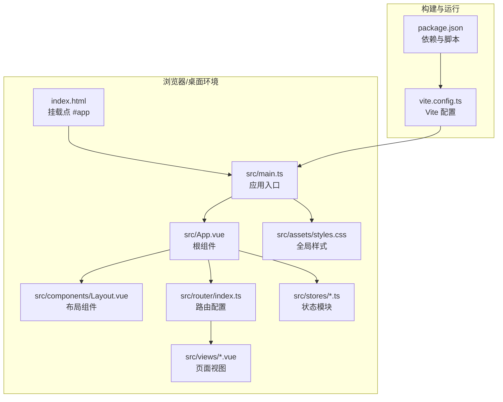
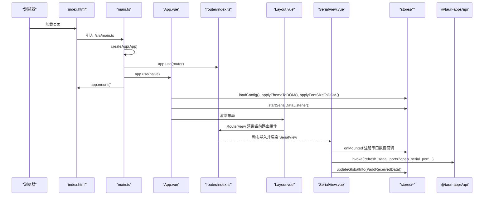
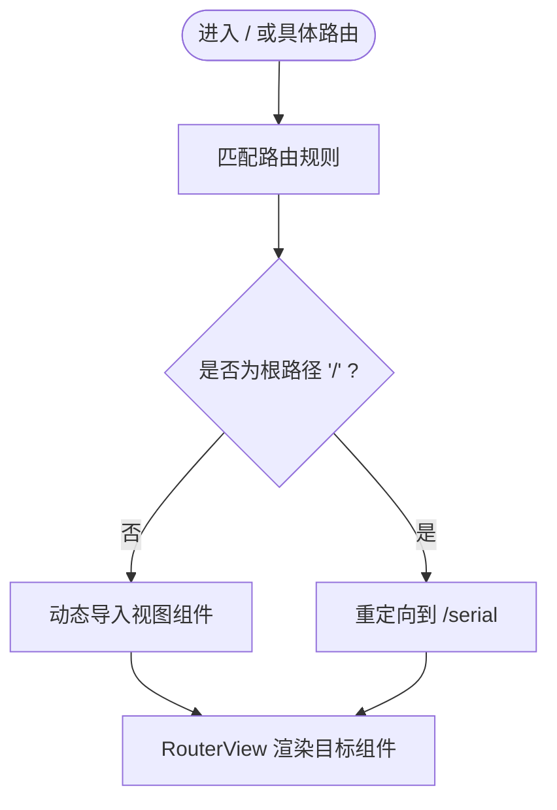
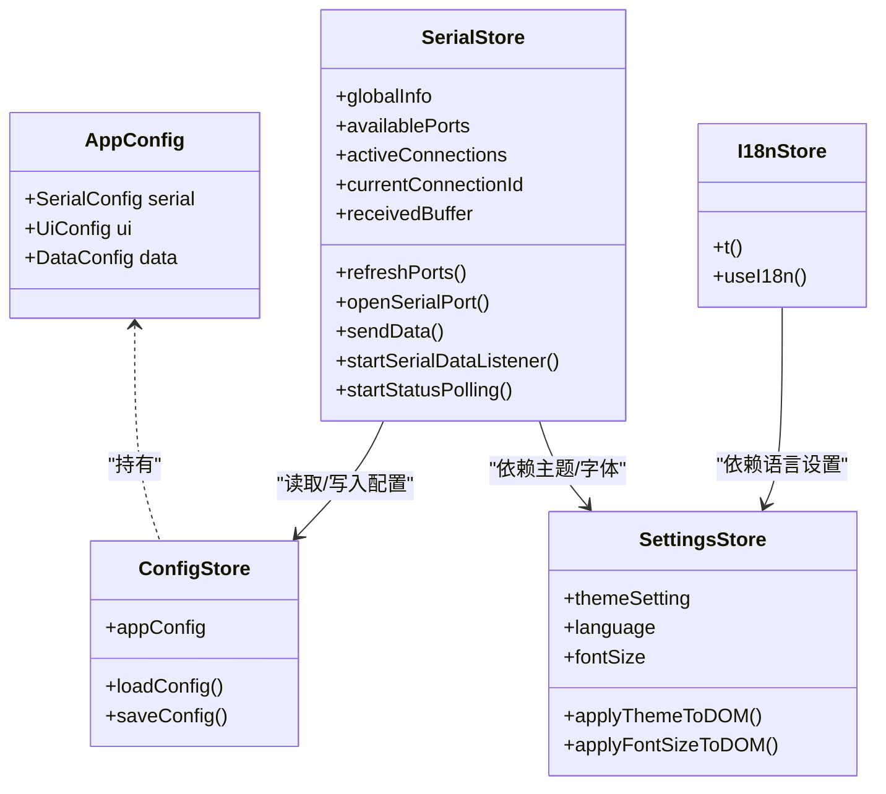
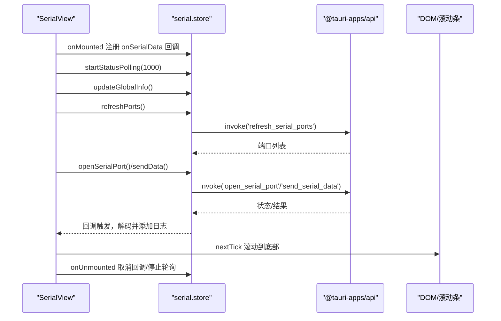
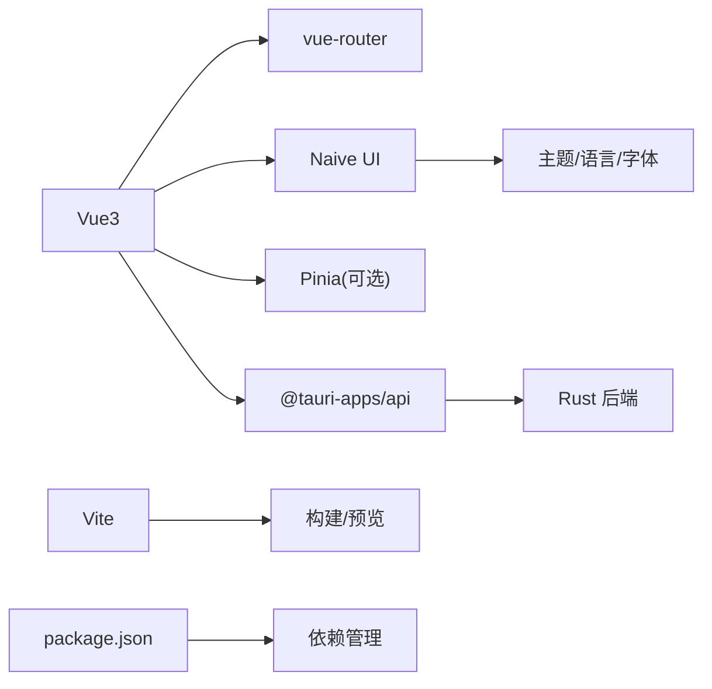

# Vue3 应用结构

<cite>
**本文引用的文件**
- [main.ts](file://src/main.ts)
- [App.vue](file://src/App.vue)
- [Layout.vue](file://src/components/Layout.vue)
- [router/index.ts](file://src/router/index.ts)
- [SerialView.vue](file://src/views/SerialView.vue)
- [config.ts](file://src/stores/config.ts)
- [serial.ts](file://src/stores/serial.ts)
- [settings.ts](file://src/stores/settings.ts)
- [i18n.ts](file://src/stores/i18n.ts)
- [styles.css](file://src/assets/styles.css)
- [index.html](file://index.html)
- [package.json](file://package.json)
- [vite.config.ts](file://vite.config.ts)
</cite>

## 目录
1. [简介](#简介)
2. [项目结构](#项目结构)
3. [核心组件](#核心组件)
4. [架构总览](#架构总览)
5. [详细组件分析](#详细组件分析)
6. [依赖关系分析](#依赖关系分析)
7. [性能考虑](#性能考虑)
8. [故障排查指南](#故障排查指南)
9. [结论](#结论)
10. [附录](#附录)

## 简介
本文件面向 KonSerial 的 Vue3 应用，系统性梳理应用入口、根组件设计、路由体系、状态管理与 Composition API 使用模式，并结合 Tauri 集成场景，给出生命周期管理、错误处理与性能优化建议。文档以“自顶向下”的方式组织，既适合初学者快速上手，也便于资深开发者深入理解架构细节。

## 项目结构
KonSerial 采用典型的 Vue3 + Vite + Tauri 前端架构：
- 前端层：Vue3 单页应用，通过 Vite 构建，使用 Naive UI 提供组件库，TailwindCSS 提供基础样式。
- 路由层：基于 vue-router 的历史模式路由，支持按需加载视图组件。
- 状态层：以组合式 Store（Composition API）为主，集中管理串口、配置、主题与国际化等状态。
- 平台集成：通过 @tauri-apps/api 与 Rust 后端交互，实现串口读写、事件监听与系统能力调用。

**图表来源**
- [index.html:10-12](file://index.html#L10-L12)
- [main.ts:1-14](file://src/main.ts#L1-L14)
- [App.vue:22-33](file://src/App.vue#L22-L33)
- [Layout.vue:17-42](file://src/components/Layout.vue#L17-L42)
- [router/index.ts:1-38](file://src/router/index.ts#L1-L38)
- [styles.css:1-60](file://src/assets/styles.css#L1-L60)
- [vite.config.ts:1-40](file://vite.config.ts#L1-L40)
- [package.json:1-40](file://package.json#L1-L40)

**章节来源**
- [index.html:10-12](file://index.html#L10-L12)
- [main.ts:1-14](file://src/main.ts#L1-L14)
- [App.vue:1-33](file://src/App.vue#L1-L33)
- [Layout.vue:1-121](file://src/components/Layout.vue#L1-L121)
- [router/index.ts:1-38](file://src/router/index.ts#L1-L38)
- [styles.css:1-60](file://src/assets/styles.css#L1-L60)
- [vite.config.ts:1-40](file://vite.config.ts#L1-L40)
- [package.json:1-40](file://package.json#L1-L40)

## 核心组件
- 应用入口 main.ts：创建 Vue 应用实例，注册路由与 UI 插件，挂载到 DOM。
- 根组件 App.vue：统一注入 Naive UI 的主题、消息与本地化上下文，初始化配置与串口监听。
- 布局组件 Layout.vue：提供侧边导航与主内容区，基于路由高亮当前菜单项。
- 路由系统：定义页面级路由，使用动态导入实现懒加载，支持页面标题元信息。
- 状态管理：以组合式 Store（ref/computed/watch）为核心，分别管理串口状态、应用配置、主题与国际化。
- 视图组件：以 SerialView 为例，展示 Composition API 在 setup 中的典型用法、事件监听与生命周期管理。

**章节来源**
- [main.ts:1-14](file://src/main.ts#L1-L14)
- [App.vue:1-33](file://src/App.vue#L1-L33)
- [Layout.vue:1-121](file://src/components/Layout.vue#L1-L121)
- [router/index.ts:1-38](file://src/router/index.ts#L1-L38)
- [config.ts:1-89](file://src/stores/config.ts#L1-L89)
- [serial.ts:1-363](file://src/stores/serial.ts#L1-L363)
- [settings.ts:1-125](file://src/stores/settings.ts#L1-L125)
- [i18n.ts:1-348](file://src/stores/i18n.ts#L1-L348)
- [SerialView.vue:1-746](file://src/views/SerialView.vue#L1-L746)

## 架构总览
下图展示了从应用启动到页面渲染的关键路径，以及与 Tauri 后端的交互点。

**图表来源**
- [index.html:10-12](file://index.html#L10-L12)
- [main.ts:9-13](file://src/main.ts#L9-L13)
- [App.vue:14-19](file://src/App.vue#L14-L19)
- [router/index.ts:10-35](file://src/router/index.ts#L10-L35)
- [Layout.vue:39-41](file://src/components/Layout.vue#L39-L41)
- [SerialView.vue:237-253](file://src/views/SerialView.vue#L237-L253)
- [config.ts:42-49](file://src/stores/config.ts#L42-L49)
- [serial.ts:312-323](file://src/stores/serial.ts#L312-L323)

## 详细组件分析

### 应用入口 main.ts 初始化流程
- 创建应用实例：通过 createApp(App) 将根组件注入应用。
- 注册插件：依次注册路由与 UI 插件（Naive UI），确保后续组件可直接使用路由与 UI 能力。
- 挂载应用：将应用挂载到 id 为 app 的 DOM 节点，完成首屏渲染。

最佳实践
- 将样式引入放在插件注册之前，确保 UI 主题与样式在应用早期生效。
- 如需全局错误处理，可在挂载前注册错误边界或全局异常捕获逻辑。

**章节来源**
- [main.ts:1-14](file://src/main.ts#L1-L14)
- [index.html:10-12](file://index.html#L10-L12)

### 根组件 App.vue 的设计模式与职责
- 设计模式：采用“容器组件”模式，在根组件中统一注入 UI 上下文（主题、消息、本地化），并将通用逻辑（配置加载、主题与字体应用、串口监听）集中在根组件生命周期钩子中执行。
- 职责划分：
  - 主题与本地化：通过 computed 从 settings.store 派生 Naive UI 主题与语言配置。
  - 生命周期：在 onMounted 中异步加载配置、应用主题与字体、启动串口数据监听。
  - 结构组织：以 NConfigProvider/NMessageProvider 包裹布局组件，保证全局 UI 行为一致。

**章节来源**
- [App.vue:1-33](file://src/App.vue#L1-L33)
- [settings.ts:1-125](file://src/stores/settings.ts#L1-L125)
- [config.ts:1-89](file://src/stores/config.ts#L1-L89)
- [serial.ts:312-323](file://src/stores/serial.ts#L312-L323)

### 路由系统设计（路由配置、导航守卫与动态路由）
- 路由配置：使用 createRouter + createWebHistory 定义页面路由，包含重定向与懒加载视图组件。
- 导航守卫：当前仓库未显式定义全局前置/后置守卫；如需权限控制或页面标题管理，可在 beforeEach 中扩展。
- 动态路由：通过动态 import 实现按需加载，减少首屏体积；页面 meta.title 可用于标题更新。

**图表来源**
- [router/index.ts:3-35](file://src/router/index.ts#L3-L35)

**章节来源**
- [router/index.ts:1-38](file://src/router/index.ts#L1-L38)

### Vue3 Composition API 使用模式
- setup 函数：在组件内集中声明响应式状态、计算属性与副作用，配合生命周期钩子完成初始化与清理。
- 响应式引用：使用 ref/computed 管理本地 UI 状态与派生状态；在 stores 中使用 ref/computed/watch 管理跨组件共享状态。
- 计算属性：通过 computed 对派生状态进行高效缓存，避免重复计算。
- 生命周期：在 onMounted/onUnmounted 中注册/注销事件监听、定时器与订阅回调，确保资源释放与内存安全。

示例参考
- SerialView 中的 setup 用法：本地状态（发送文本、编码、滚动）、计算属性（连接状态、统计数据）、事件监听与轮询控制。
- SerialView 的 onMounted/onUnmounted 流程：注册串口数据回调、启动状态轮询、刷新端口列表与全局信息。

**章节来源**
- [SerialView.vue:1-746](file://src/views/SerialView.vue#L1-L746)
- [serial.ts:312-323](file://src/stores/serial.ts#L312-L323)
- [serial.ts:348-362](file://src/stores/serial.ts#L348-L362)

### 应用生命周期管理、错误边界与性能优化
- 生命周期管理
  - 根组件：在 onMounted 中执行一次性初始化任务（加载配置、应用主题/字体、启动串口监听）。
  - 页面组件：在 onMounted 注册事件监听与轮询；在 onUnmounted 取消订阅与轮询，防止内存泄漏。
- 错误边界
  - 建议在根组件包裹错误边界组件，捕获子树异常并降级显示。
  - 对外部调用（invoke）进行 try/catch 包裹，记录错误并提示用户。
- 性能优化
  - 懒加载：路由与视图组件使用动态导入，降低首屏负载。
  - 响应式粒度：合理拆分状态，避免不必要的重渲染；对长列表使用虚拟滚动（如 NScrollbar）。
  - 资源释放：在组件卸载时取消事件监听、停止轮询、释放订阅。

**章节来源**
- [App.vue:14-19](file://src/App.vue#L14-L19)
- [SerialView.vue:237-253](file://src/views/SerialView.vue#L237-L253)
- [serial.ts:348-362](file://src/stores/serial.ts#L348-L362)
- [config.ts:42-49](file://src/stores/config.ts#L42-L49)

### 状态管理与数据流（串口、配置、主题与国际化）
- 配置管理（config.ts）
  - 定义串口、UI、数据三类配置的接口与全局状态。
  - 提供加载/保存配置的异步方法，通过 @tauri-apps/api 与后端交互。
- 串口状态（serial.ts）
  - 定义端口配置、状态枚举、连接信息与全局运行时信息。
  - 提供刷新端口、打开/关闭连接、发送数据、轮询状态、事件监听等方法。
  - 通过全局缓冲区与回调机制，向多个组件广播原始字节数据。
- 主题与字体（settings.ts）
  - 基于 appConfig 派生主题、语言、字体大小等设置。
  - 通过 watch 将主题与字体应用到 DOM，实现即时生效。
- 国际化（i18n.ts）
  - 提供 t 函数与 useI18n 计算函数，支持参数化文本与响应式语言切换。

**图表来源**
- [config.ts:32-89](file://src/stores/config.ts#L32-L89)
- [serial.ts:64-240](file://src/stores/serial.ts#L64-L240)
- [settings.ts:19-125](file://src/stores/settings.ts#L19-L125)
- [i18n.ts:318-347](file://src/stores/i18n.ts#L318-L347)

**章节来源**
- [config.ts:1-89](file://src/stores/config.ts#L1-L89)
- [serial.ts:1-363](file://src/stores/serial.ts#L1-L363)
- [settings.ts:1-125](file://src/stores/settings.ts#L1-L125)
- [i18n.ts:1-348](file://src/stores/i18n.ts#L1-L348)

### 视图组件：SerialView 的工作流
- 初始化：onMounted 注册串口数据回调、启动状态轮询、刷新端口列表与全局信息。
- 用户交互：连接/断开、发送数据、切换编码与显示模式、清空日志。
- 数据处理：将原始字节解码为文本，按类型分类记录日志；同步到全局缓冲区供图表使用。
- 资源清理：onUnmounted 取消回调与轮询，避免内存泄漏。

**图表来源**
- [SerialView.vue:237-253](file://src/views/SerialView.vue#L237-L253)
- [serial.ts:312-323](file://src/stores/serial.ts#L312-L323)
- [serial.ts:348-362](file://src/stores/serial.ts#L348-L362)

**章节来源**
- [SerialView.vue:1-746](file://src/views/SerialView.vue#L1-L746)
- [serial.ts:1-363](file://src/stores/serial.ts#L1-L363)

## 依赖关系分析
- 构建与运行
  - Vite 作为开发服务器与打包工具，配置别名与 HMR。
  - package.json 声明依赖与脚本，包含 Vue3、vue-router、Naive UI、ApexCharts 等。
- 前端框架与 UI
  - Vue3 + Composition API 提供响应式与组合能力。
  - Naive UI 提供主题、消息与本地化上下文。
- 平台集成
  - @tauri-apps/api 提供与后端的 IPC 调用与事件监听。
- 样式与主题
  - TailwindCSS 与自定义 CSS 变量实现主题与字体的响应式切换。

**图表来源**
- [package.json:12-27](file://package.json#L12-L27)
- [vite.config.ts:1-40](file://vite.config.ts#L1-L40)
- [main.ts:6-12](file://src/main.ts#L6-L12)

**章节来源**
- [package.json:1-40](file://package.json#L1-L40)
- [vite.config.ts:1-40](file://vite.config.ts#L1-L40)
- [main.ts:1-14](file://src/main.ts#L1-L14)

## 性能考虑
- 路由与组件懒加载：通过动态 import 降低首屏体积，提升加载速度。
- 响应式与计算属性：合理使用 computed 缓存派生状态，减少不必要重渲染。
- 列表渲染优化：对长列表使用虚拟滚动与最小化 DOM 更新。
- 资源释放：在组件卸载时及时取消事件监听、停止轮询与释放订阅。
- 样式与主题：通过 CSS 变量与 watch 应用主题与字体，避免频繁重排。

[本节为通用性能建议，无需特定文件引用]

## 故障排查指南
- 配置加载失败
  - 现象：应用启动后主题/字体未生效或串口不可用。
  - 排查：确认 loadConfig 是否抛错；检查后端命令是否可用。
  - 参考：配置加载与保存方法的错误处理。
- 串口连接异常
  - 现象：打开串口失败或无数据。
  - 排查：检查端口列表刷新、连接配置与后端命令；确认事件监听是否启动。
  - 参考：串口打开、发送与轮询状态的方法。
- 页面空白或样式异常
  - 现象：页面无法渲染或主题不正确。
  - 排查：确认 main.ts 中插件注册顺序与样式引入；检查根组件生命周期钩子。
  - 参考：根组件 onMounted 的初始化流程。

**章节来源**
- [config.ts:42-64](file://src/stores/config.ts#L42-L64)
- [serial.ts:146-240](file://src/stores/serial.ts#L146-L240)
- [App.vue:14-19](file://src/App.vue#L14-L19)
- [main.ts:6-12](file://src/main.ts#L6-L12)

## 结论
KonSerial 的 Vue3 应用以清晰的分层架构与组合式状态管理为核心，结合 Tauri 实现了高效的桌面端串口调试工具。通过路由懒加载、响应式状态与生命周期管理，应用在功能完整性与性能表现之间取得了良好平衡。建议在后续迭代中补充全局错误边界、导航守卫与更完善的日志追踪，以进一步提升稳定性与可观测性。

[本节为总结性内容，无需特定文件引用]

## 附录
- 全局样式与主题变量：通过 CSS 变量与 watch 应用到 DOM，实现主题与字体的即时切换。
- 国际化：提供 t 函数与 useI18n 计算函数，支持中英双语与参数化文本。

**章节来源**
- [styles.css:1-60](file://src/assets/styles.css#L1-L60)
- [settings.ts:102-117](file://src/stores/settings.ts#L102-L117)
- [i18n.ts:318-347](file://src/stores/i18n.ts#L318-L347)