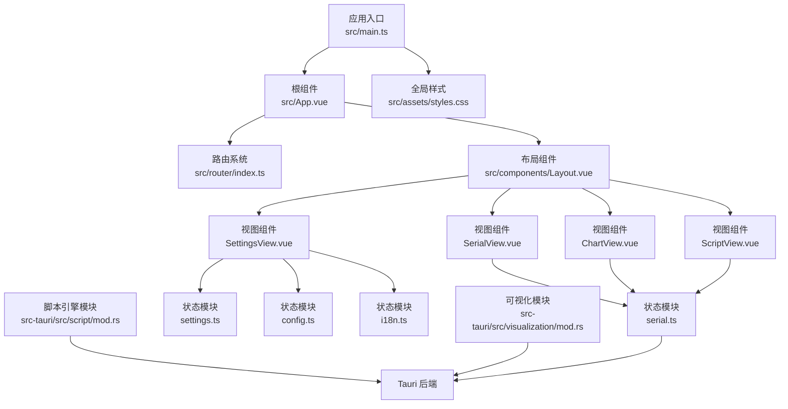
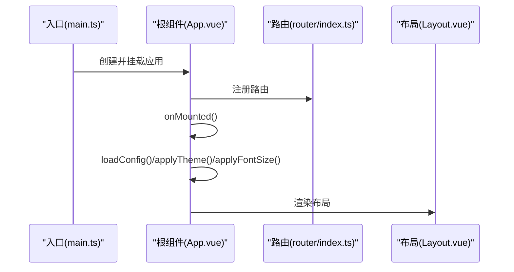
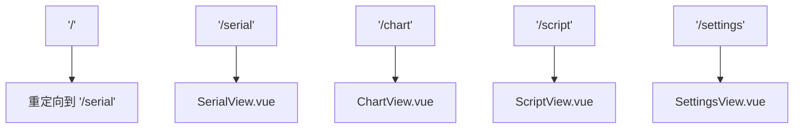
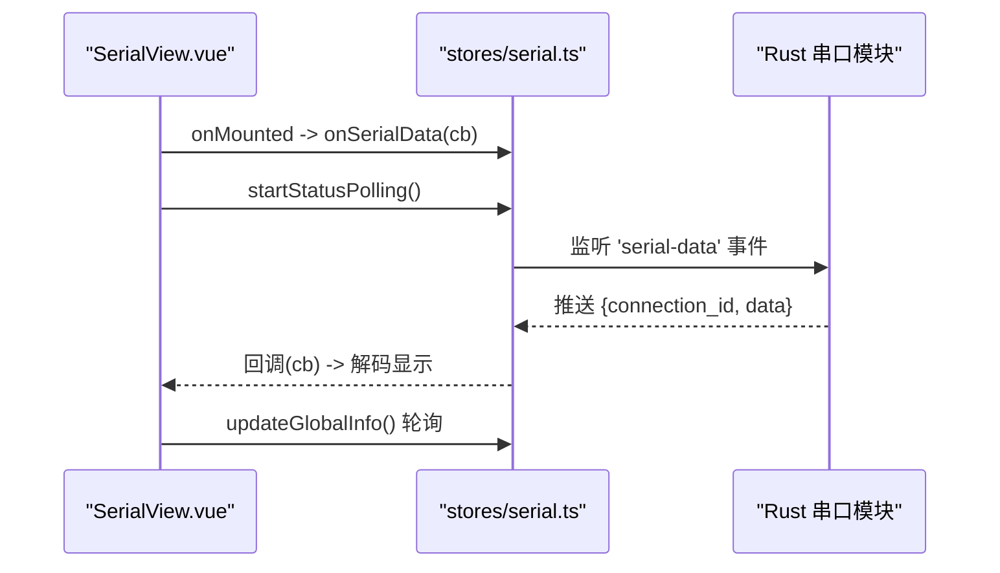
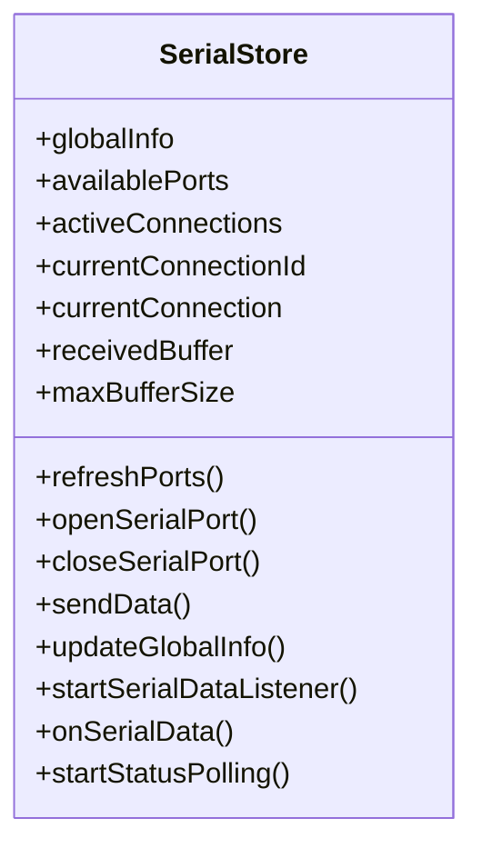
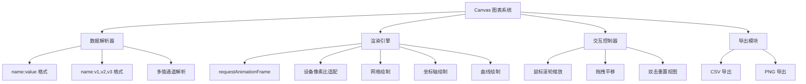
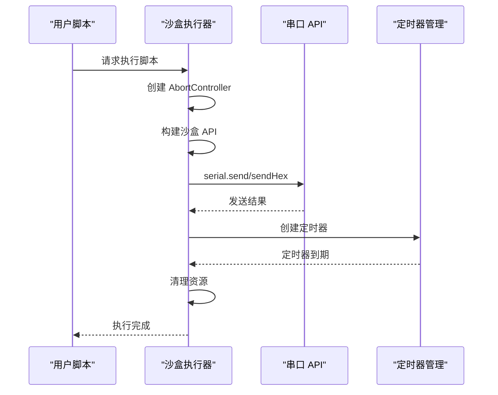
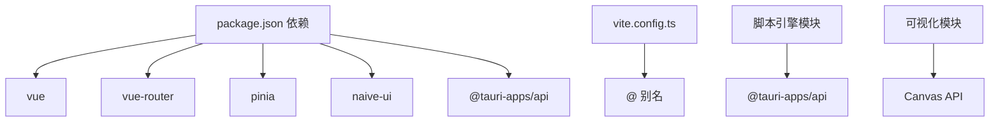

# 前端架构设计

<cite>
**本文档引用的文件**
- [src/main.ts](file://src/main.ts)
- [src/App.vue](file://src/App.vue)
- [src/router/index.ts](file://src/router/index.ts)
- [src/components/Layout.vue](file://src/components/Layout.vue)
- [src/stores/serial.ts](file://src/stores/serial.ts)
- [src/stores/config.ts](file://src/stores/config.ts)
- [src/stores/settings.ts](file://src/stores/settings.ts)
- [src/stores/i18n.ts](file://src/stores/i18n.ts)
- [src/views/SerialView.vue](file://src/views/SerialView.vue)
- [src/views/ChartView.vue](file://src/views/ChartView.vue)
- [src/views/ScriptView.vue](file://src/views/ScriptView.vue)
- [src/views/SettingsView.vue](file://src/views/SettingsView.vue)
- [src/assets/styles.css](file://src/assets/styles.css)
- [package.json](file://package.json)
- [vite.config.ts](file://vite.config.ts)
- [README.md](file://README.md)
- [src-tauri/src/script/mod.rs](file://src-tauri/src/script/mod.rs)
- [src-tauri/src/visualization/mod.rs](file://src-tauri/src/visualization/mod.rs)
</cite>

## 更新摘要
**所做更改**
- 新增 Canvas 图表系统的详细分析，包括实时数据渲染、交互式缩放和平移功能
- 更新脚本执行引擎的沙盒化实现，包括安全隔离、超时控制和中断机制
- 增强数据可视化模块的架构说明，涵盖前后端协作的数据处理流程
- 完善错误处理和性能优化策略，确保实时数据处理的稳定性

## 目录
1. [简介](#简介)
2. [项目结构](#项目结构)
3. [核心组件](#核心组件)
4. [架构总览](#架构总览)
5. [详细组件分析](#详细组件分析)
6. [Canvas 图表系统](#canvas-图表系统)
7. [脚本执行引擎沙盒化](#脚本执行引擎沙盒化)
8. [依赖关系分析](#依赖关系分析)
9. [性能考虑](#性能考虑)
10. [故障排除指南](#故障排除指南)
11. [结论](#结论)
12. [附录](#附录)

## 简介
本文件面向 KonSerial 前端架构，围绕基于 Vue 3 Composition API 的应用入口初始化、路由系统设计与组件层次结构进行深入解析；重点阐述 Pinia 状态管理模式，包括串口状态管理、配置状态管理与全局状态协调；总结组件架构原则（布局组件设计、业务组件分类与组件通信机制），并解释响应式数据绑定、事件处理与生命周期管理。文档还涵盖前端模块化组织、依赖注入与错误处理策略，并提供具体代码示例路径与最佳实践指导。

**更新** 本次更新重点关注两个关键改进：Canvas 图表系统的引入实现了高性能的实时数据可视化，以及脚本执行引擎的沙盒化改进确保了脚本运行的安全性和可控性。

## 项目结构
KonSerial 前端采用典型的 Vue 3 + Vite + Tauri 结构，核心目录与职责如下：
- src/main.ts：应用入口，创建 Vue 应用实例，挂载路由与 UI 框架插件。
- src/App.vue：根组件，负责全局主题、消息与布局容器的初始化。
- src/router/index.ts：路由配置，定义页面级视图与导航元信息。
- src/components/Layout.vue：布局组件，提供侧边栏导航与主内容区。
- src/views/*：页面级视图组件（串口调试、波形图、脚本编辑、设置）。
- src/stores/*：Pinia 状态模块（串口、配置、设置、国际化）。
- src/assets/styles.css：全局样式与 CSS 变量，支持明暗主题与字体缩放。
- vite.config.ts：Vite 配置，包含别名与 Tauri 开发服务器设置。
- package.json：依赖声明，包含 Vue、Vue Router、Naive UI、Pinia 等。
- src-tauri/src/script/mod.rs：脚本引擎模块，负责自定义脚本的解析与执行。
- src-tauri/src/visualization/mod.rs：数据可视化模块，负责波形图数据的处理与渲染支持。



**图表来源**
- [src/main.ts:1-14](file://src/main.ts#L1-L14)
- [src/App.vue:1-33](file://src/App.vue#L1-L33)
- [src/router/index.ts:1-38](file://src/router/index.ts#L1-L38)
- [src/components/Layout.vue:1-121](file://src/components/Layout.vue#L1-L121)
- [src/views/SerialView.vue:1-746](file://src/views/SerialView.vue#L1-L746)
- [src/views/ChartView.vue:1-1057](file://src/views/ChartView.vue#L1-L1057)
- [src/views/ScriptView.vue:1-617](file://src/views/ScriptView.vue#L1-L617)
- [src/views/SettingsView.vue:1-383](file://src/views/SettingsView.vue#L1-L383)
- [src/stores/serial.ts:1-363](file://src/stores/serial.ts#L1-L363)
- [src/stores/settings.ts:1-125](file://src/stores/settings.ts#L1-L125)
- [src/stores/config.ts:1-89](file://src/stores/config.ts#L1-L89)
- [src/stores/i18n.ts:1-348](file://src/stores/i18n.ts#L1-L348)
- [src/assets/styles.css:1-60](file://src/assets/styles.css#L1-L60)
- [src-tauri/src/script/mod.rs:1-3](file://src-tauri/src/script/mod.rs#L1-L3)
- [src-tauri/src/visualization/mod.rs:1-3](file://src-tauri/src/visualization/mod.rs#L1-L3)

**章节来源**
- [src/main.ts:1-14](file://src/main.ts#L1-L14)
- [src/App.vue:1-33](file://src/App.vue#L1-L33)
- [src/router/index.ts:1-38](file://src/router/index.ts#L1-L38)
- [src/components/Layout.vue:1-121](file://src/components/Layout.vue#L1-L121)
- [src/assets/styles.css:1-60](file://src/assets/styles.css#L1-L60)
- [vite.config.ts:1-40](file://vite.config.ts#L1-L40)
- [package.json:1-40](file://package.json#L1-L40)

## 核心组件
- 应用入口与初始化
  - 创建 Vue 应用实例，注册路由与 UI 框架插件，挂载到 DOM。
  - 示例路径：[src/main.ts:1-14](file://src/main.ts#L1-L14)
- 根组件与全局初始化
  - 在挂载阶段加载配置、应用主题与字体、启动串口数据监听。
  - 示例路径：[src/App.vue:14-19](file://src/App.vue#L14-L19)
- 布局组件
  - 提供侧边栏导航、路由视图容器与主题类名控制。
  - 示例路径：[src/components/Layout.vue:1-121](file://src/components/Layout.vue#L1-L121)
- 路由系统
  - 定义页面级视图与导航元信息，支持懒加载与标题设置。
  - 示例路径：[src/router/index.ts:1-38](file://src/router/index.ts#L1-L38)

**章节来源**
- [src/main.ts:1-14](file://src/main.ts#L1-L14)
- [src/App.vue:1-33](file://src/App.vue#L1-L33)
- [src/components/Layout.vue:1-121](file://src/components/Layout.vue#L1-L121)
- [src/router/index.ts:1-38](file://src/router/index.ts#L1-L38)

## 架构总览
KonSerial 前端采用"入口初始化 → 布局容器 → 页面视图 → 状态模块"的分层架构。数据流主要通过 Tauri 桥接 Rust 后端，串口数据经事件推送至前端，再由状态模块统一管理与分发。

```mermaid
graph TB
subgraph "前端"
M["main.ts"] --> N["App.vue"]
N --> O["Layout.vue"]
O --> P["SerialView.vue"]
O --> Q["ChartView.vue"]
O --> R["ScriptView.vue"]
O --> S["SettingsView.vue"]
P --> T["stores/serial.ts"]
Q --> T
R --> T
S --> U["stores/settings.ts"]
S --> V["stores/config.ts"]
S --> W["stores/i18n.ts"]
end
subgraph "后端(Tauri)"
X["Rust 串口模块"]
Y["脚本引擎模块"]
Z["可视化模块"]
end
T <- --> X
R <- --> Y
Q <- --> Z
```

**图表来源**
- [src/main.ts:1-14](file://src/main.ts#L1-L14)
- [src/App.vue:1-33](file://src/App.vue#L1-L33)
- [src/components/Layout.vue:1-121](file://src/components/Layout.vue#L1-L121)
- [src/views/SerialView.vue:1-746](file://src/views/SerialView.vue#L1-L746)
- [src/views/ChartView.vue:1-1057](file://src/views/ChartView.vue#L1-L1057)
- [src/views/ScriptView.vue:1-617](file://src/views/ScriptView.vue#L1-L617)
- [src/views/SettingsView.vue:1-383](file://src/views/SettingsView.vue#L1-L383)
- [src/stores/serial.ts:1-363](file://src/stores/serial.ts#L1-L363)
- [src/stores/settings.ts:1-125](file://src/stores/settings.ts#L1-L125)
- [src/stores/config.ts:1-89](file://src/stores/config.ts#L1-L89)
- [src/stores/i18n.ts:1-348](file://src/stores/i18n.ts#L1-L348)
- [src-tauri/src/script/mod.rs:1-3](file://src-tauri/src/script/mod.rs#L1-L3)
- [src-tauri/src/visualization/mod.rs:1-3](file://src-tauri/src/visualization/mod.rs#L1-L3)

## 详细组件分析

### 应用入口与初始化流程
- 初始化步骤
  - 创建应用实例并注册路由与 UI 框架。
  - 在根组件挂载阶段加载配置、应用主题与字体、启动串口数据监听。
- 生命周期与副作用
  - 使用 onMounted 执行一次性初始化任务，确保 DOM 与全局状态就绪后再启动监听。



**图表来源**
- [src/main.ts:1-14](file://src/main.ts#L1-L14)
- [src/App.vue:14-19](file://src/App.vue#L14-L19)
- [src/router/index.ts:1-38](file://src/router/index.ts#L1-L38)
- [src/components/Layout.vue:1-121](file://src/components/Layout.vue#L1-L121)

**章节来源**
- [src/main.ts:1-14](file://src/main.ts#L1-L14)
- [src/App.vue:1-33](file://src/App.vue#L1-L33)

### 路由系统设计
- 路由配置
  - 定义首页重定向、四个页面视图与导航元信息（标题）。
  - 使用动态导入实现按需加载，提升首屏性能。
- 导航与元信息
  - 通过 meta.title 为页面提供本地化标题支持。



**图表来源**
- [src/router/index.ts:1-38](file://src/router/index.ts#L1-L38)

**章节来源**
- [src/router/index.ts:1-38](file://src/router/index.ts#L1-L38)

### 布局组件设计
- 结构与交互
  - 侧边栏包含应用标题、副标题与导航项；主内容区由 RouterView 占位。
  - 导航项与国际化文本联动，支持动态主题类名切换。
- 样式与主题
  - 通过 CSS 变量与暗色类名实现主题切换；侧边栏宽度固定，主内容区自适应。

**章节来源**
- [src/components/Layout.vue:1-121](file://src/components/Layout.vue#L1-L121)
- [src/assets/styles.css:1-60](file://src/assets/styles.css#L1-L60)

### 页面视图组件

#### 串口调试视图（SerialView）
- 功能概览
  - 串口配置与连接控制、数据收发、统计信息展示、终端日志与自动滚动。
- 状态与数据流
  - 依赖串口状态模块（可用端口、当前连接、全局运行时信息、接收缓存）。
  - 通过 onSerialData 回调接收后端推送的原始字节，按编码解码显示。
- 生命周期与副作用
  - onMounted 注册数据回调与轮询，onUnmounted 清理回调与轮询。



**图表来源**
- [src/views/SerialView.vue:234-253](file://src/views/SerialView.vue#L234-L253)
- [src/stores/serial.ts:311-341](file://src/stores/serial.ts#L311-L341)

**章节来源**
- [src/views/SerialView.vue:1-746](file://src/views/SerialView.vue#L1-L746)
- [src/stores/serial.ts:1-363](file://src/stores/serial.ts#L1-L363)

#### 设置视图（SettingsView）
- 功能概览
  - 外观设置（主题、语言、字体）、数据设置（自动保存、保存间隔、缓冲区大小）与关于信息。
- 状态与持久化
  - 读取配置并在保存时调用持久化方法；重置时恢复默认值。

**章节来源**
- [src/views/SettingsView.vue:1-383](file://src/views/SettingsView.vue#L1-L383)
- [src/stores/settings.ts:1-125](file://src/stores/settings.ts#L1-L125)
- [src/stores/config.ts:1-89](file://src/stores/config.ts#L1-L89)

### Pinia 状态管理设计

#### 串口状态管理（serial.ts）
- 设计要点
  - 全局运行时信息（可用端口、活跃连接、总数）、当前连接 ID 与信息、接收缓存与最大容量。
  - 串口操作封装（打开/关闭/发送/刷新）、状态轮询、事件监听与回调分发。
- 数据结构与复杂度
  - 全局运行时信息为对象引用，计算属性访问降低重复查询成本。
  - 接收缓存为数组，入队/出队操作在容量限制下保持 O(1)。
- 错误处理
  - 所有异步操作包含 try/catch，记录错误并抛出，便于上层捕获与提示。



**图表来源**
- [src/stores/serial.ts:1-363](file://src/stores/serial.ts#L1-L363)

**章节来源**
- [src/stores/serial.ts:1-363](file://src/stores/serial.ts#L1-L363)

#### 配置状态管理（config.ts）
- 设计要点
  - 前端管理的 AppConfig 结构（串口、UI、数据），提供加载与保存方法。
  - 通过 invoke 与后端交互，实现配置持久化。
- 更新策略
  - 提供便捷更新方法（波特率、串口、主题），自动触发保存。

**章节来源**
- [src/stores/config.ts:1-89](file://src/stores/config.ts#L1-L89)

#### 全局设置状态（settings.ts）
- 设计要点
  - 从 AppConfig 派生响应式设置（主题、语言、字体、数据设置），支持即时生效。
  - 通过 watch 将主题与字体应用到 DOM，实现全局样式变更。
- 持久化
  - 提供持久化方法，将当前设置写回配置。

**章节来源**
- [src/stores/settings.ts:1-125](file://src/stores/settings.ts#L1-L125)

#### 国际化状态（i18n.ts）
- 设计要点
  - 基于语言设置返回对应文本，支持占位符替换。
  - 提供响应式翻译函数，模板中可直接使用。
- 语言与 UI 本地化
  - 与 Naive UI 的 locale/dateLocale 对接，实现界面与日期本地化。

**章节来源**
- [src/stores/i18n.ts:1-348](file://src/stores/i18n.ts#L1-L348)

### 组件架构原则
- 布局组件设计
  - Layout 作为单一职责的容器组件，仅负责导航与路由视图占位，降低耦合。
- 业务组件分类
  - SerialView：串口交互与终端展示；ChartView：数据解析与 Canvas 可视化；ScriptView：脚本编辑与沙盒执行；SettingsView：配置与持久化。
- 组件通信机制
  - 状态共享：通过 Pinia 模块集中管理，组件通过计算属性与方法读取/更新状态。
  - 事件回调：串口数据通过 onSerialData 分发，组件订阅并处理。

**章节来源**
- [src/components/Layout.vue:1-121](file://src/components/Layout.vue#L1-L121)
- [src/views/SerialView.vue:1-746](file://src/views/SerialView.vue#L1-L746)
- [src/views/ChartView.vue:1-1057](file://src/views/ChartView.vue#L1-L1057)
- [src/views/ScriptView.vue:1-617](file://src/views/ScriptView.vue#L1-L617)
- [src/views/SettingsView.vue:1-383](file://src/views/SettingsView.vue#L1-L383)
- [src/stores/serial.ts:334-341](file://src/stores/serial.ts#L334-L341)

### 响应式数据绑定、事件处理与生命周期管理
- 响应式数据绑定
  - 使用 ref/computed 管理本地状态与派生状态；computed 依赖全局状态，自动更新视图。
- 事件处理
  - 组件内部事件（按钮、开关、输入框）与全局事件（串口数据、系统主题变化）分离处理。
- 生命周期管理
  - onMounted 注册回调与轮询；onUnmounted 清理回调与轮询，防止内存泄漏。

**章节来源**
- [src/views/SerialView.vue:234-253](file://src/views/SerialView.vue#L234-L253)
- [src/stores/serial.ts:311-341](file://src/stores/serial.ts#L311-L341)
- [src/stores/settings.ts:102-117](file://src/stores/settings.ts#L102-L117)

### 前端模块化组织、依赖注入与错误处理策略
- 模块化组织
  - 采用按功能域划分的目录结构（components、views、stores），减少交叉依赖。
- 依赖注入
  - 通过 Vue 插件方式注入路由与 UI 框架；状态模块通过组合式函数暴露 API。
- 错误处理策略
  - 异步操作统一 try/catch，记录日志并向上抛出；组件内使用消息提示反馈用户。

**章节来源**
- [src/main.ts:1-14](file://src/main.ts#L1-L14)
- [src/App.vue:14-19](file://src/App.vue#L14-L19)
- [src/stores/serial.ts:146-155](file://src/stores/serial.ts#L146-L155)
- [src/stores/config.ts:42-49](file://src/stores/config.ts#L42-L49)

## Canvas 图表系统

### 实时数据渲染架构
KonSerial 引入了基于 HTML5 Canvas 的高性能图表系统，专门用于实时数据可视化。该系统通过以下核心组件实现：

- **Canvas 渲染引擎**：使用 requestAnimationFrame 实现流畅的动画渲染
- **数据解析器**：支持多种数据格式（name:value、name:v1,v2,v3）
- **交互式缩放系统**：鼠标滚轮缩放、拖拽平移、双击重置
- **多通道支持**：动态通道发现与颜色管理
- **导出功能**：CSV 数据导出与 PNG 图像导出



**图表来源**
- [src/views/ChartView.vue:144-290](file://src/views/ChartView.vue#L144-L290)
- [src/views/ChartView.vue:425-520](file://src/views/ChartView.vue#L425-L520)
- [src/views/ChartView.vue:360-414](file://src/views/ChartView.vue#L360-L414)

### 数据处理与缓存机制
图表系统采用增量式数据处理策略，通过以下机制确保性能：

- **增量处理**：只处理新增数据，避免全量重绘
- **时间窗口管理**：支持可配置的时间窗口（5-120秒）
- **内存优化**：自动清理超出时间窗口的数据点
- **多值通道支持**：单行数据可解析为多个数值通道

**章节来源**
- [src/views/ChartView.vue:88-140](file://src/views/ChartView.vue#L88-L140)
- [src/views/ChartView.vue:166-197](file://src/views/ChartView.vue#L166-L197)
- [src/views/ChartView.vue:322-358](file://src/views/ChartView.vue#L322-L358)

### 交互式缩放与平移
系统提供了完整的交互式缩放和平移功能：

- **时间轴缩放**：鼠标滚轮在光标位置进行缩放
- **Y轴独立缩放**：按住 Ctrl 键进行垂直缩放
- **拖拽平移**：鼠标拖拽进行时间轴平移
- **自动缩放**：根据可见数据自动调整Y轴范围
- **冻结视图**：暂停时冻结参考时间，支持回看历史数据

**章节来源**
- [src/views/ChartView.vue:425-520](file://src/views/ChartView.vue#L425-L520)
- [src/views/ChartView.vue:306-321](file://src/views/ChartView.vue#L306-L321)

### 性能优化策略
为确保实时数据可视化的流畅性，系统采用了多项性能优化：

- **设备像素比适配**：自动适配高分辨率屏幕
- **增量重绘**：仅重绘变化部分，避免全屏重绘
- **请求动画帧**：使用 requestAnimationFrame 实现高效动画
- **内存管理**：自动清理超出时间窗口的数据点
- **防抖处理**：窗口大小变化时的防抖处理

**章节来源**
- [src/views/ChartView.vue:150-156](file://src/views/ChartView.vue#L150-L156)
- [src/views/ChartView.vue:417-421](file://src/views/ChartView.vue#L417-L421)
- [src/views/ChartView.vue:522-527](file://src/views/ChartView.vue#L522-L527)

## 脚本执行引擎沙盒化

### 沙盒安全架构
KonSerial 的脚本执行引擎采用了严格的沙盒化设计，确保脚本运行的安全性和可控性：

- **API 限制**：仅暴露必要的串口通信 API
- **超时控制**：内置超时机制防止无限循环
- **中断机制**：支持脚本强制停止和定时器清理
- **错误隔离**：脚本错误不影响主应用稳定性
- **资源管理**：自动清理定时器和内存资源



**图表来源**
- [src/views/ScriptView.vue:104-185](file://src/views/ScriptView.vue#L104-L185)
- [src/views/ScriptView.vue:196-199](file://src/views/ScriptView.vue#L196-L199)

### 沙盒 API 设计
脚本执行引擎提供了受限但实用的 API 集合：

- **serial.send(data)**：发送文本数据到串口
- **serial.sendHex(hex)**：发送十六进制数据
- **sleep(ms)**：异步等待指定毫秒数
- **console.log/warn/error/info**：日志输出功能

所有 API 都在执行期间受到 AbortController 的监控，确保可以随时中断执行。

**章节来源**
- [src/views/ScriptView.vue:120-141](file://src/views/ScriptView.vue#L120-L141)
- [src/views/ScriptView.vue:143-157](file://src/views/ScriptView.vue#L143-L157)

### 超时控制与资源管理
系统实现了完善的超时控制和资源管理机制：

- **定时器追踪**：记录所有活动的定时器ID
- **自动清理**：脚本停止时清理所有定时器
- **中断响应**：AbortController 信号立即响应
- **内存保护**：防止内存泄漏和资源占用

**章节来源**
- [src/views/ScriptView.vue:101-102](file://src/views/ScriptView.vue#L101-L102)
- [src/views/ScriptView.vue:196-199](file://src/views/ScriptView.vue#L196-L199)

### 日志系统与错误处理
脚本执行过程中的所有输出都被捕获并显示在日志面板中：

- **多级别日志**：支持 info、warn、error、success 级别
- **时间戳记录**：每条日志包含精确的时间戳
- **错误过滤**：自动过滤"Script stopped"类型的中断错误
- **日志限制**：最多保留500条日志，避免内存溢出

**章节来源**
- [src/views/ScriptView.vue:82-96](file://src/views/ScriptView.vue#L82-L96)
- [src/views/ScriptView.vue:175-184](file://src/views/ScriptView.vue#L175-L184)

### 文件操作集成
脚本编辑器集成了完整的文件管理系统：

- **多文件支持**：支持同时编辑多个脚本文件
- **文件监控**：自动检测文件修改状态
- **打开/保存**：支持从文件系统读取和保存脚本
- **示例脚本**：内置示例脚本帮助用户快速上手

**章节来源**
- [src/views/ScriptView.vue:21-56](file://src/views/ScriptView.vue#L21-L56)
- [src/views/ScriptView.vue:232-284](file://src/views/ScriptView.vue#L232-L284)

## 依赖关系分析
- 前端依赖
  - Vue 3、Vue Router、Pinia、Naive UI、Vite、TypeScript。
- 构建与开发
  - Vite 提供开发服务器与热更新；Tauri CLI 用于打包与运行。
- 运行时桥接
  - @tauri-apps/api 提供 invoke 与事件监听能力，连接 Rust 后端。
- 后端模块
  - 脚本引擎模块负责自定义脚本的解析与执行。
  - 可视化模块负责波形图数据的处理与渲染支持。



**图表来源**
- [package.json:12-27](file://package.json#L12-L27)
- [vite.config.ts:12-16](file://vite.config.ts#L12-L16)
- [src-tauri/src/script/mod.rs:1-3](file://src-tauri/src/script/mod.rs#L1-L3)
- [src-tauri/src/visualization/mod.rs:1-3](file://src-tauri/src/visualization/mod.rs#L1-L3)

**章节来源**
- [package.json:1-40](file://package.json#L1-L40)
- [vite.config.ts:1-40](file://vite.config.ts#L1-L40)

## 性能考虑
- 懒加载与按需渲染
  - 路由组件动态导入，减少初始包体积。
- 状态与计算优化
  - 使用 computed 依赖最小化更新范围；串口数据缓存限制容量，避免内存膨胀。
- 轮询与事件驱动
  - 状态轮询与事件监听并存，事件优先，轮询作为补充保障。
- 样式与主题
  - CSS 变量与主题类名切换，避免频繁重排与重绘。
- Canvas 性能优化
  - 设备像素比适配、增量重绘、请求动画帧优化。
- 脚本执行优化
  - 沙盒化执行、超时控制、资源自动清理。

## 故障排除指南
- 串口刷新失败
  - 检查后端服务状态与权限；查看状态模块异常分支与日志输出。
  - 参考路径：[src/stores/serial.ts:146-155](file://src/stores/serial.ts#L146-L155)
- 发送失败
  - 确认当前连接存在与编码正确；查看发送方法异常分支。
  - 参考路径：[src/views/SerialView.vue:192-205](file://src/views/SerialView.vue#L192-L205)
- 主题或字体未生效
  - 检查设置模块的 watch 是否执行；确认 CSS 变量是否被覆盖。
  - 参考路径：[src/stores/settings.ts:102-117](file://src/stores/settings.ts#L102-L117)
- 配置未持久化
  - 确认保存方法调用与后端返回；查看配置模块保存逻辑。
  - 参考路径：[src/stores/config.ts:52-64](file://src/stores/config.ts#L52-L64)
- Canvas 图表渲染问题
  - 检查设备像素比设置与画布尺寸；确认 requestAnimationFrame 正常工作。
  - 参考路径：[src/views/ChartView.vue:150-156](file://src/views/ChartView.vue#L150-L156)
- 脚本执行异常
  - 检查串口连接状态与沙盒 API 权限；查看日志面板中的错误信息。
  - 参考路径：[src/views/ScriptView.vue:175-184](file://src/views/ScriptView.vue#L175-L184)

**章节来源**
- [src/stores/serial.ts:146-155](file://src/stores/serial.ts#L146-L155)
- [src/views/SerialView.vue:192-205](file://src/views/SerialView.vue#L192-L205)
- [src/stores/settings.ts:102-117](file://src/stores/settings.ts#L102-L117)
- [src/stores/config.ts:52-64](file://src/stores/config.ts#L52-L64)
- [src/views/ChartView.vue:150-156](file://src/views/ChartView.vue#L150-L156)
- [src/views/ScriptView.vue:175-184](file://src/views/ScriptView.vue#L175-L184)

## 结论
KonSerial 前端以 Vue 3 Composition API 为核心，结合 Pinia 状态管理与 Tauri 桥接，实现了清晰的模块化架构与高效的组件通信。通过全局样式与主题系统、响应式状态与事件驱动、以及合理的生命周期管理，系统在易用性与性能之间取得良好平衡。

**更新** 本次架构更新显著增强了系统的可视化能力和安全性。Canvas 图表系统提供了高性能的实时数据可视化，支持复杂的交互操作和多种数据格式。脚本执行引擎的沙盒化改进确保了脚本运行的安全性和可控性，为用户提供了强大的自动化工具。

建议在后续迭代中进一步完善错误边界与监控埋点，增强可观测性与可维护性。同时可以考虑扩展图表系统的功能，如添加更多图表类型、数据过滤和高级分析功能。

## 附录
- 快速参考
  - 应用入口：[src/main.ts:1-14](file://src/main.ts#L1-L14)
  - 根组件初始化：[src/App.vue:14-19](file://src/App.vue#L14-L19)
  - 路由配置：[src/router/index.ts:1-38](file://src/router/index.ts#L1-L38)
  - 布局组件：[src/components/Layout.vue:1-121](file://src/components/Layout.vue#L1-L121)
  - 串口状态模块：[src/stores/serial.ts:1-363](file://src/stores/serial.ts#L1-L363)
  - 配置状态模块：[src/stores/config.ts:1-89](file://src/stores/config.ts#L1-L89)
  - 设置状态模块：[src/stores/settings.ts:1-125](file://src/stores/settings.ts#L1-L125)
  - 国际化模块：[src/stores/i18n.ts:1-348](file://src/stores/i18n.ts#L1-L348)
  - 串口视图：[src/views/SerialView.vue:1-746](file://src/views/SerialView.vue#L1-L746)
  - Canvas 图表视图：[src/views/ChartView.vue:1-1057](file://src/views/ChartView.vue#L1-L1057)
  - 脚本视图：[src/views/ScriptView.vue:1-617](file://src/views/ScriptView.vue#L1-L617)
  - 设置视图：[src/views/SettingsView.vue:1-383](file://src/views/SettingsView.vue#L1-L383)
  - 全局样式：[src/assets/styles.css:1-60](file://src/assets/styles.css#L1-L60)
  - 依赖与构建：[package.json:1-40](file://package.json#L1-L40), [vite.config.ts:1-40](file://vite.config.ts#L1-L40)
  - 项目说明：[README.md:1-127](file://README.md#L1-L127)
  - 脚本引擎模块：[src-tauri/src/script/mod.rs:1-3](file://src-tauri/src/script/mod.rs#L1-L3)
  - 可视化模块：[src-tauri/src/visualization/mod.rs:1-3](file://src-tauri/src/visualization/mod.rs#L1-L3)