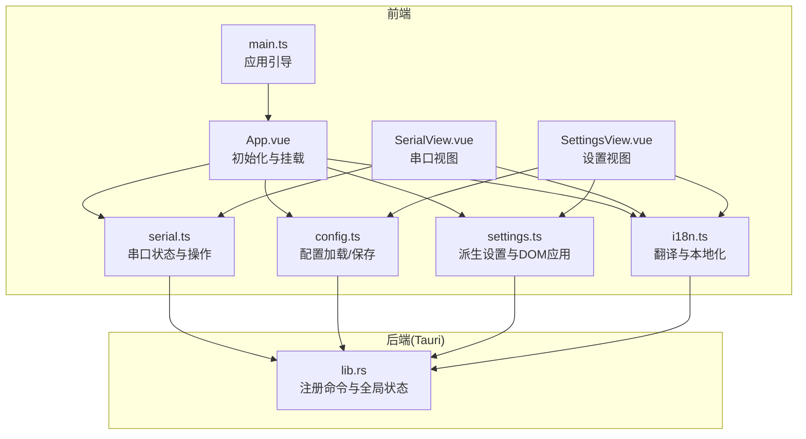
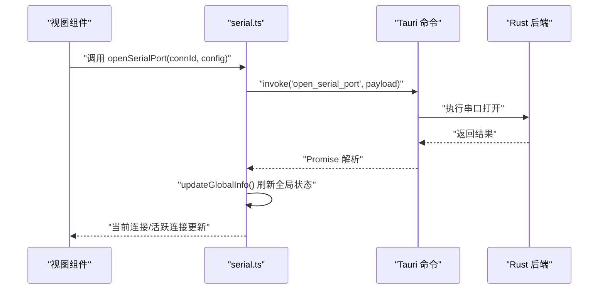
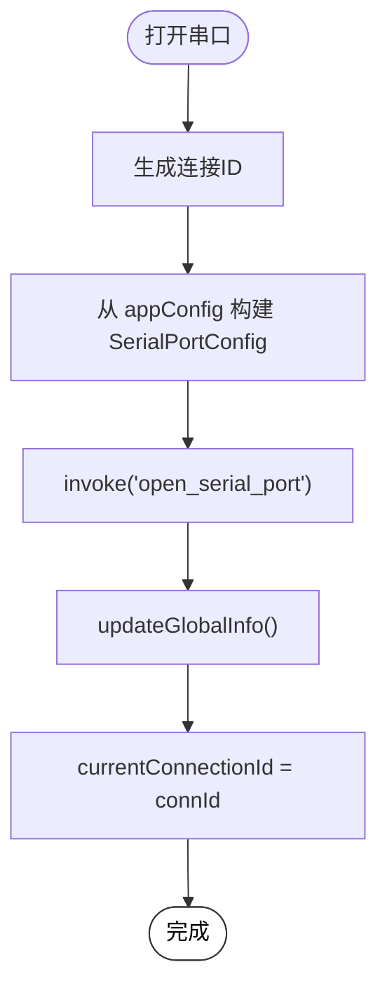
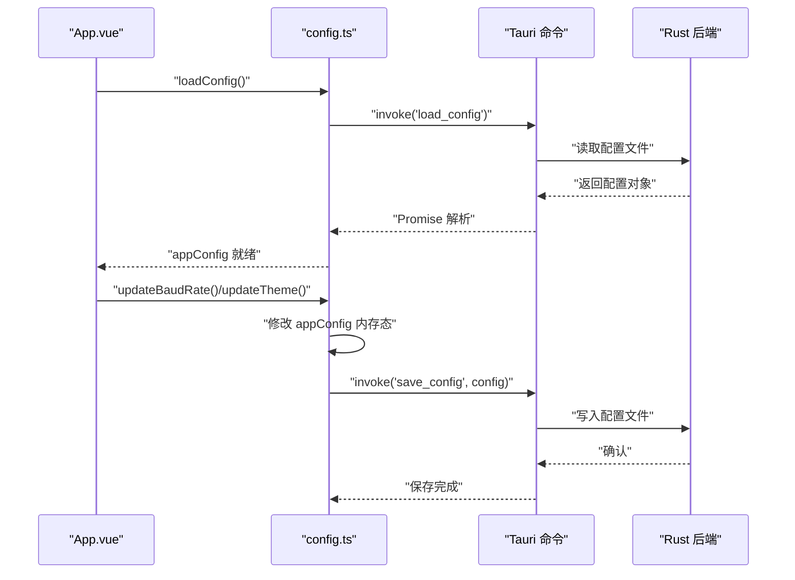
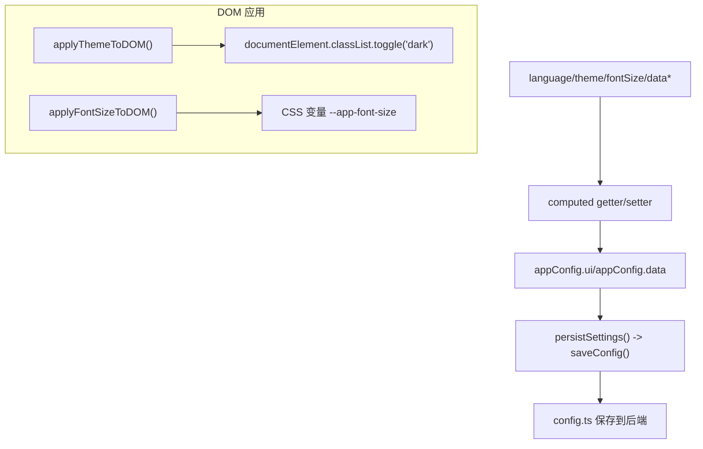
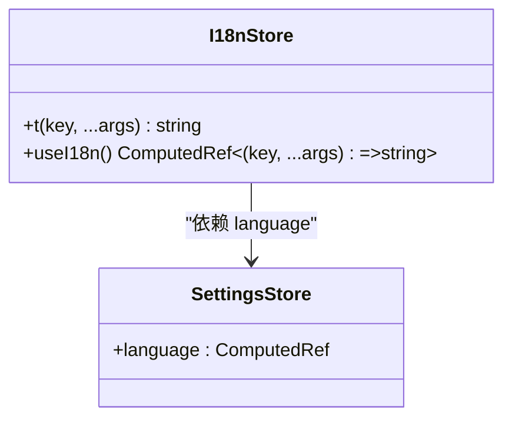
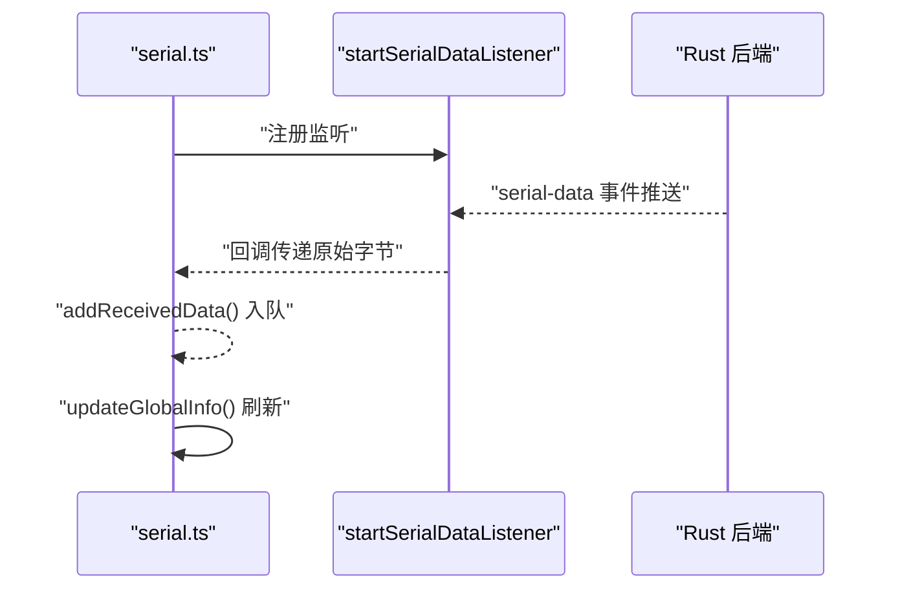
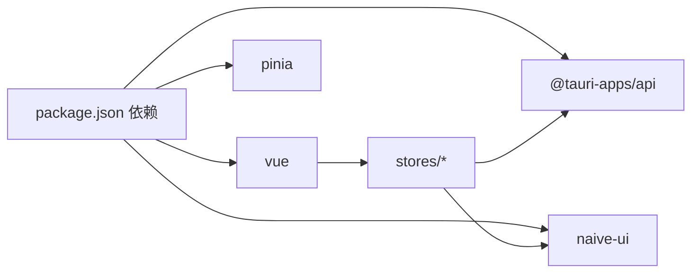

# 状态管理系统

<cite>
**本文引用的文件**
- [src/stores/serial.ts](file://src/stores/serial.ts)
- [src/stores/config.ts](file://src/stores/config.ts)
- [src/stores/settings.ts](file://src/stores/settings.ts)
- [src/stores/i18n.ts](file://src/stores/i18n.ts)
- [src/main.ts](file://src/main.ts)
- [src/App.vue](file://src/App.vue)
- [src/views/SerialView.vue](file://src/views/SerialView.vue)
- [src/views/SettingsView.vue](file://src/views/SettingsView.vue)
- [src-tauri/src/lib.rs](file://src-tauri/src/lib.rs)
- [package.json](file://package.json)
</cite>

## 目录
1. [简介](#简介)
2. [项目结构](#项目结构)
3. [核心组件](#核心组件)
4. [架构总览](#架构总览)
5. [详细组件分析](#详细组件分析)
6. [依赖分析](#依赖分析)
7. [性能考虑](#性能考虑)
8. [故障排查指南](#故障排查指南)
9. [结论](#结论)
10. [附录](#附录)

## 简介
本文件系统性梳理 KonSerial 的 Pinia 状态管理方案，聚焦以下方面：
- Store 组织与模块化设计：按领域拆分（串口、配置、设置、国际化），职责清晰、边界明确
- 串口状态管理（serial.ts）：连接生命周期、数据流控制、事件监听与轮询同步
- 配置状态管理（config.ts）：前端内存态与后端持久化的桥接
- 设置状态管理（settings.ts）：派生响应式设置、主题与语言联动、DOM 应用副作用
- 国际化状态管理（i18n.ts）：基于语言设置的响应式翻译函数
- 状态持久化、状态同步与异步更新：Tauri 命令桥接、轮询与事件驱动
- 最佳实践与性能优化建议

## 项目结构
KonSerial 的状态层位于前端 src/stores 目录，采用“按功能域划分”的模块化组织：
- serial.ts：串口连接、端口枚举、数据收发、事件监听、轮询同步
- config.ts：应用配置（串口、UI、数据）的加载/保存
- settings.ts：从 appConfig 派生的响应式设置（主题、语言、字体、数据参数），并应用到 DOM
- i18n.ts：轻量级国际化消息表与响应式翻译函数

**图表来源**
- [src/App.vue:14-19](file://src/App.vue#L14-L19)
- [src/main.ts:1-14](file://src/main.ts#L1-L14)
- [src/stores/serial.ts:146-240](file://src/stores/serial.ts#L146-L240)
- [src/stores/config.ts:42-64](file://src/stores/config.ts#L42-L64)
- [src/stores/settings.ts:102-117](file://src/stores/settings.ts#L102-L117)
- [src/stores/i18n.ts:318-347](file://src/stores/i18n.ts#L318-L347)
- [src-tauri/src/lib.rs:56-80](file://src-tauri/src/lib.rs#L56-L80)

**章节来源**
- [src/main.ts:1-14](file://src/main.ts#L1-L14)
- [src/App.vue:14-19](file://src/App.vue#L14-L19)
- [package.json:12-27](file://package.json#L12-L27)

## 核心组件
- 串口状态模块（serial.ts）
  - 全局运行时信息、活跃连接、当前连接、接收缓冲
  - 串口操作：刷新端口、打开/关闭连接、发送数据、查询连接状态
  - 事件监听：后端推送的串口数据事件
  - 同步策略：手动调用与轮询更新
- 配置状态模块（config.ts）
  - 前端内存态 appConfig，通过 Tauri 命令与后端持久化交互
  - 提供读取与保存配置的异步方法
- 设置状态模块（settings.ts）
  - 从 appConfig 派生的响应式设置项（主题、语言、字体、数据参数）
  - 将主题与字体应用到 DOM，Naive UI 本地化与主题覆盖
- 国际化模块（i18n.ts）
  - 中文/英文消息表与响应式翻译函数
  - 提供 t 与 useI18n 两种使用方式

**章节来源**
- [src/stores/serial.ts:64-240](file://src/stores/serial.ts#L64-L240)
- [src/stores/config.ts:39-64](file://src/stores/config.ts#L39-L64)
- [src/stores/settings.ts:19-117](file://src/stores/settings.ts#L19-L117)
- [src/stores/i18n.ts:7-347](file://src/stores/i18n.ts#L7-L347)

## 架构总览
状态管理遵循“前端内存态 + 后端持久化 + 事件/轮询同步”的模式：
- 前端 store 作为唯一真相源（Single Source of Truth），负责 UI 响应与用户交互
- 通过 Tauri invoke 调用后端命令，完成持久化与底层串口操作
- 串口数据通过事件从后端推送到前端，或通过轮询主动拉取状态

**图表来源**
- [src/stores/serial.ts:158-179](file://src/stores/serial.ts#L158-L179)
- [src-tauri/src/lib.rs:67-74](file://src-tauri/src/lib.rs#L67-L74)

## 详细组件分析

### 串口状态管理（serial.ts）
- 设计要点
  - 多连接架构：每个连接独立拥有 connection_id、状态、统计信息
  - 全局运行时信息：available_ports、active_connections、total_connections
  - 响应式派生：availablePorts、activeConnections、currentConnection
  - 数据缓冲：全局接收缓冲，支持上限控制与清空
  - 异步操作：所有串口操作通过 invoke 调用后端命令
  - 事件与轮询：startSerialDataListener 监听后端推送；startStatusPolling 定时轮询
- 关键流程
  - 打开串口：生成连接 ID → 构造配置 → 调用后端 → 更新全局信息 → 设置当前连接
  - 发送数据：文本/HEX 编码 → 调用后端发送 → 更新全局信息 → 返回发送字节数
  - 关闭串口：调用后端关闭 → 更新全局信息 → 若为当前连接则切换到其他连接
  - 刷新端口：调用后端刷新 → 更新全局信息
- 错误处理
  - 所有异步操作包裹 try/catch，并记录日志；调用方负责 UI 提示

**图表来源**
- [src/stores/serial.ts:182-188](file://src/stores/serial.ts#L182-L188)
- [src/stores/serial.ts:234-240](file://src/stores/serial.ts#L234-L240)
- [src/stores/serial.ts:88-94](file://src/stores/serial.ts#L88-L94)

**章节来源**
- [src/stores/serial.ts:9-61](file://src/stores/serial.ts#L9-L61)
- [src/stores/serial.ts:146-240](file://src/stores/serial.ts#L146-L240)
- [src/stores/serial.ts:299-341](file://src/stores/serial.ts#L299-L341)
- [src/stores/serial.ts:347-362](file://src/stores/serial.ts#L347-L362)

### 配置状态管理（config.ts）
- 设计思路
  - 前端内存态 appConfig，避免直接操作磁盘
  - 通过 load_config/save_config 与后端持久化交互
  - 提供便捷更新方法（波特率、串口、主题等），自动触发保存
- 生命周期
  - 应用启动时调用 loadConfig 初始化
  - 修改设置后立即保存（部分更新方法内部自动保存）

**图表来源**
- [src/App.vue:14-15](file://src/App.vue#L14-L15)
- [src/stores/config.ts:42-64](file://src/stores/config.ts#L42-L64)
- [src-tauri/src/lib.rs:60-62](file://src-tauri/src/lib.rs#L60-L62)

**章节来源**
- [src/stores/config.ts:32-64](file://src/stores/config.ts#L32-L64)

### 设置状态管理（settings.ts）
- 设计思路
  - 从 appConfig 派生响应式设置，双向绑定即时生效
  - 主题：支持 light/dark/auto，自动监听系统偏好
  - 语言：切换即刻影响翻译与 Naive UI 本地化
  - 字体：CSS 变量驱动，统一影响所有组件字号
  - 数据：最大缓冲、自动保存、保存间隔等
  - 副作用：applyThemeToDOM、applyFontSizeToDOM 将设置应用到 DOM
- 与 config 的关系
  - settings.ts 仅读写 appConfig，不直接访问磁盘；保存通过 persistSettings 调用 saveConfig 实现

**图表来源**
- [src/stores/settings.ts:19-117](file://src/stores/settings.ts#L19-L117)
- [src/stores/config.ts:52-64](file://src/stores/config.ts#L52-L64)

**章节来源**
- [src/stores/settings.ts:19-125](file://src/stores/settings.ts#L19-L125)

### 国际化状态管理（i18n.ts）
- 设计实现
  - 两套消息表：zhCN/enUS
  - t(key, ...args)：返回当前语言对应文本，支持占位符替换
  - useI18n()：返回一个响应式翻译函数，模板中可直接使用
  - 依赖 language 设置，语言变更自动触发响应式更新
- 与设置模块的关系
  - language 来自 settings.ts，二者通过 store 间依赖形成联动

**图表来源**
- [src/stores/i18n.ts:318-347](file://src/stores/i18n.ts#L318-L347)
- [src/stores/settings.ts:83-97](file://src/stores/settings.ts#L83-L97)

**章节来源**
- [src/stores/i18n.ts:7-347](file://src/stores/i18n.ts#L7-L347)

### 状态持久化、同步与异步更新
- 持久化
  - 配置持久化：config.ts 通过 save_config 命令写回后端
  - 串口状态：serial.ts 通过 get_global_runtime_info 等命令拉取最新状态
- 同步机制
  - 事件驱动：startSerialDataListener 监听后端推送的 serial-data 事件
  - 轮询同步：startStatusPolling 定时调用 updateGlobalInfo
- 异步更新
  - 所有串口与配置操作均为异步，调用方需处理 loading 与错误提示

**图表来源**
- [src/stores/serial.ts:312-341](file://src/stores/serial.ts#L312-L341)

**章节来源**
- [src/stores/serial.ts:234-240](file://src/stores/serial.ts#L234-L240)
- [src/stores/serial.ts:347-362](file://src/stores/serial.ts#L347-L362)

## 依赖分析
- 前端依赖
  - Vue 3 + Pinia：提供响应式与状态管理能力
  - Naive UI：提供 UI 组件与本地化、主题覆盖
  - @tauri-apps/api：与后端命令交互
- 后端依赖
  - Tauri 命令注册：串口、配置、数据日志等命令
  - Rust 层串口管理器与数据日志器：提供底层能力

**图表来源**
- [package.json:12-27](file://package.json#L12-L27)

**章节来源**
- [package.json:12-27](file://package.json#L12-L27)
- [src-tauri/src/lib.rs:56-80](file://src-tauri/src/lib.rs#L56-L80)

## 性能考虑
- 接收缓冲上限控制
  - 通过 maxBufferSize 控制全局接收缓冲长度，避免内存膨胀
  - 建议在视图层也做虚拟滚动或分页，进一步降低渲染压力
- 轮询频率与事件优先级
  - 默认轮询间隔可在业务需要时调整，避免频繁 invoke 导致主线程阻塞
  - 优先使用事件驱动（serial-data）减少轮询
- 编码与解码分离
  - 串口事件回调仅传递原始字节，解码逻辑放在组件侧，便于按需解码与缓存
- 主题与字体应用
  - 通过 CSS 变量与 Naive UI 主题覆盖，避免重复渲染与样式抖动

[本节为通用建议，无需特定文件引用]

## 故障排查指南
- 串口打开/关闭失败
  - 检查后端命令是否注册：确认 lib.rs 中 open/close 等命令存在
  - 查看前端控制台日志与错误提示，定位具体异常
- 刷新端口为空
  - 确认后端端口扫描逻辑与权限
  - 在 SerialView 中检查刷新按钮与消息提示
- 发送失败
  - 确认当前连接是否存在且已连接
  - 检查 HEX 文本格式与编码选项
- 配置保存无效
  - 确认已调用 persistSettings 或相关更新方法内部保存
  - 检查后端配置路径与权限
- 主题/语言未生效
  - 确认 settings.ts 的 applyThemeToDOM 与 applyFontSizeToDOM 是否执行
  - 检查 useI18n 的依赖链是否正确

**章节来源**
- [src-tauri/src/lib.rs:67-74](file://src-tauri/src/lib.rs#L67-L74)
- [src/stores/serial.ts:158-179](file://src/stores/serial.ts#L158-L179)
- [src/stores/serial.ts:242-285](file://src/stores/serial.ts#L242-L285)
- [src/stores/config.ts:52-64](file://src/stores/config.ts#L52-L64)
- [src/stores/settings.ts:102-117](file://src/stores/settings.ts#L102-L117)

## 结论
KonSerial 的状态管理以“store 模块化 + Tauri 命令桥接”为核心，实现了清晰的职责分离与良好的扩展性：
- 串口模块覆盖连接、数据、事件与轮询的完整生命周期
- 配置与设置模块分别承担“持久化”和“派生设置”，职责明确
- 国际化模块与设置模块协同，提供即时的语言切换体验
- 建议在后续迭代中引入更细粒度的状态切片与缓存策略，持续优化性能与用户体验

[本节为总结性内容，无需特定文件引用]

## 附录
- 使用示例参考
  - 串口视图：SerialView.vue 中对 serial.ts 的广泛使用
  - 设置视图：SettingsView.vue 中对 settings.ts 与 i18n.ts 的使用
- 启动流程
  - main.ts 引导应用，App.vue 在 mounted 中加载配置、应用主题与字体、启动串口数据监听

**章节来源**
- [src/views/SerialView.vue:141-189](file://src/views/SerialView.vue#L141-L189)
- [src/views/SettingsView.vue:42-59](file://src/views/SettingsView.vue#L42-L59)
- [src/App.vue:14-19](file://src/App.vue#L14-L19)