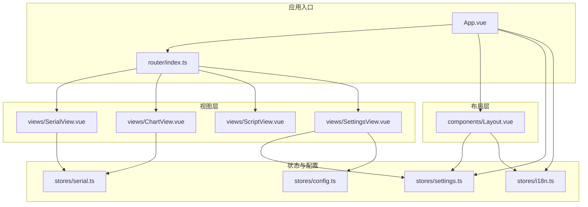
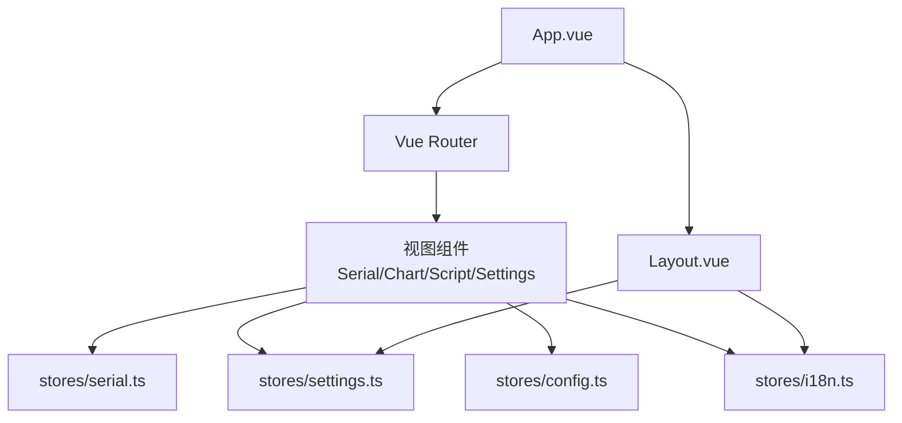
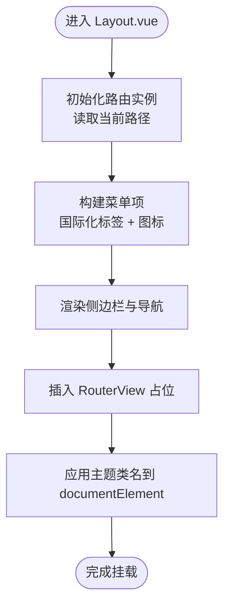
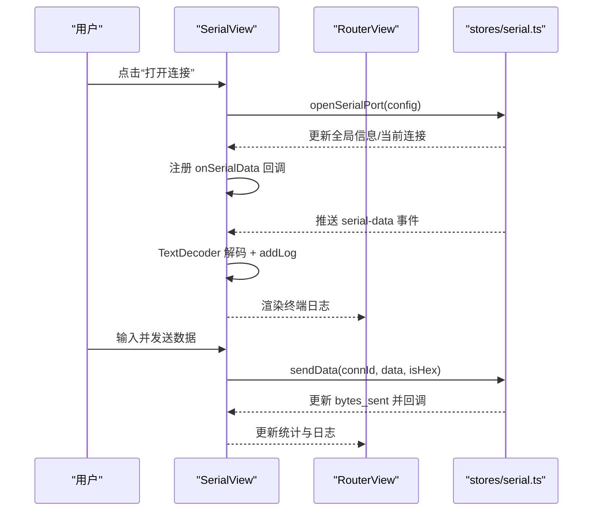
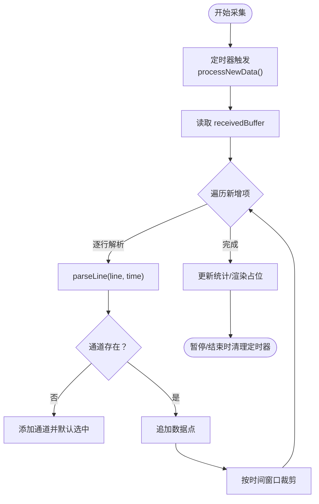
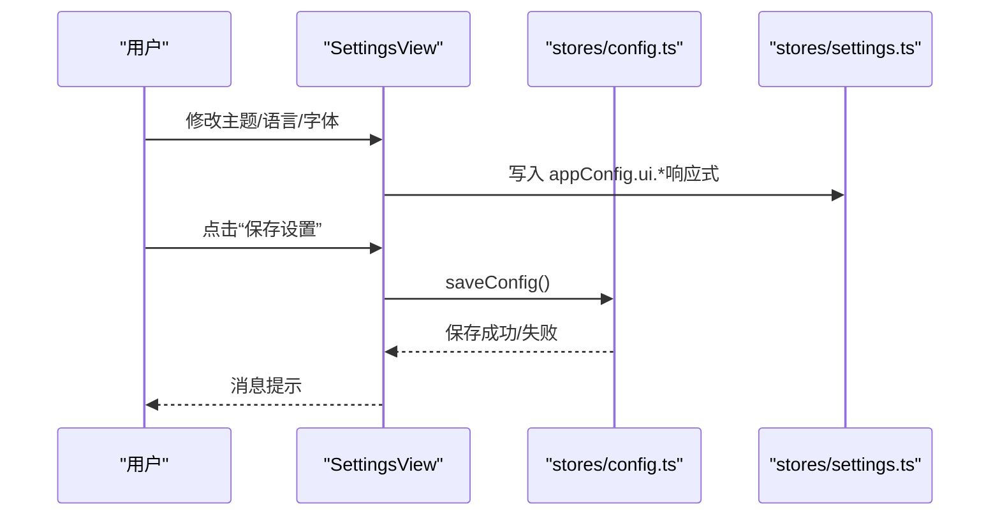
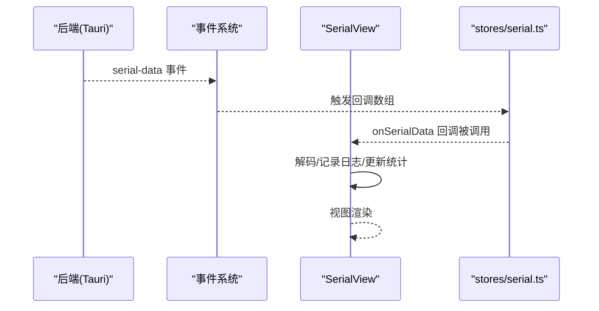
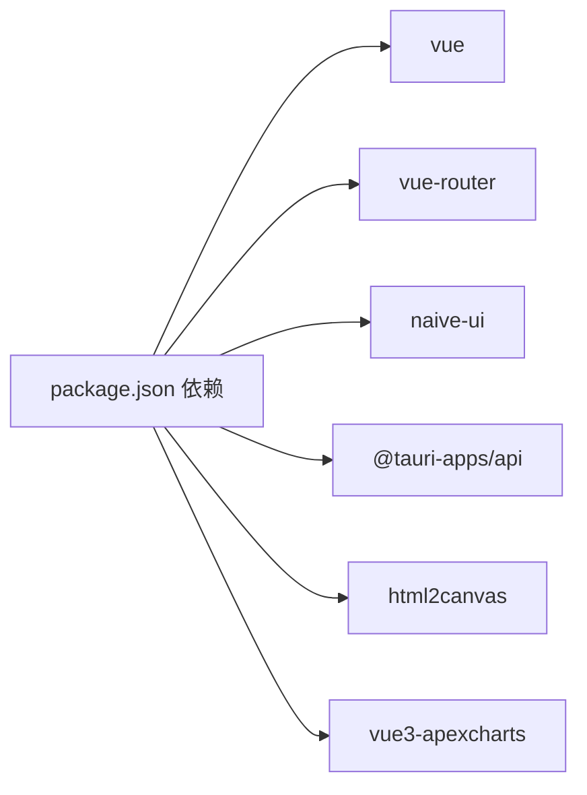

# 组件架构设计

<cite>
**本文档引用的文件**
- [Layout.vue](file://src/components/Layout.vue)
- [SerialView.vue](file://src/views/SerialView.vue)
- [ChartView.vue](file://src/views/ChartView.vue)
- [ScriptView.vue](file://src/views/ScriptView.vue)
- [SettingsView.vue](file://src/views/SettingsView.vue)
- [serial.ts](file://src/stores/serial.ts)
- [settings.ts](file://src/stores/settings.ts)
- [config.ts](file://src/stores/config.ts)
- [i18n.ts](file://src/stores/i18n.ts)
- [index.ts](file://src/router/index.ts)
- [App.vue](file://src/App.vue)
- [styles.css](file://src/assets/styles.css)
- [package.json](file://src/package.json)
</cite>

## 目录
1. [简介](#简介)
2. [项目结构](#项目结构)
3. [核心组件](#核心组件)
4. [架构总览](#架构总览)
5. [详细组件分析](#详细组件分析)
6. [依赖关系分析](#依赖关系分析)
7. [性能考量](#性能考量)
8. [故障排查指南](#故障排查指南)
9. [结论](#结论)
10. [附录](#附录)

## 简介
本文件面向 KonSerial 的组件架构设计，重点围绕布局组件 Layout.vue 的设计模式与职责，以及四个视图组件（SerialView、ChartView、ScriptView、SettingsView）的功能实现进行深入解析。文档还阐述了组件间的通信机制（props 传递、事件发射、插槽使用）、复用性与可扩展性设计、生命周期管理、性能优化策略与错误处理实践，并提供最佳实践与参考路径。

## 项目结构
KonSerial 采用基于路由的单页应用结构，组件通过 Vue Router 进行页面级导航，根组件 App.vue 提供全局配置与主题注入，Layout.vue 作为页面骨架承载侧边导航与主内容区，四个视图组件分别处理不同业务域。

**图表来源**
- [App.vue:1-33](file://src/App.vue#L1-L33)
- [index.ts:1-38](file://src/router/index.ts#L1-L38)
- [Layout.vue:1-121](file://src/components/Layout.vue#L1-L121)
- [serial.ts:1-363](file://src/stores/serial.ts#L1-L363)
- [settings.ts:1-125](file://src/stores/settings.ts#L1-L125)
- [config.ts:1-89](file://src/stores/config.ts#L1-L89)
- [i18n.ts:1-348](file://src/stores/i18n.ts#L1-L348)

**章节来源**
- [App.vue:1-33](file://src/App.vue#L1-L33)
- [index.ts:1-38](file://src/router/index.ts#L1-L38)

## 核心组件
- 布局组件 Layout.vue：提供统一的页面骨架、侧边导航菜单、路由视图容器与主题/国际化注入。
- 视图组件：
  - SerialView：串口连接、参数配置、数据收发与终端展示。
  - ChartView：通道解析、实时采集、图表占位与导出能力。
  - ScriptView：脚本编辑、运行控制与日志输出。
  - SettingsView：主题、语言、字体、数据缓冲等设置项。
- 状态与配置：
  - stores/serial.ts：串口连接、数据流、事件监听与轮询。
  - stores/settings.ts：主题、语言、字体、持久化设置。
  - stores/config.ts：应用配置加载/保存。
  - stores/i18n.ts：轻量级国际化消息映射与响应式翻译。

**章节来源**
- [Layout.vue:1-121](file://src/components/Layout.vue#L1-L121)
- [SerialView.vue:1-746](file://src/views/SerialView.vue#L1-L746)
- [ChartView.vue:1-855](file://src/views/ChartView.vue#L1-L855)
- [ScriptView.vue:1-442](file://src/views/ScriptView.vue#L1-L442)
- [SettingsView.vue:1-383](file://src/views/SettingsView.vue#L1-L383)
- [serial.ts:1-363](file://src/stores/serial.ts#L1-L363)
- [settings.ts:1-125](file://src/stores/settings.ts#L1-L125)
- [config.ts:1-89](file://src/stores/config.ts#L1-L89)
- [i18n.ts:1-348](file://src/stores/i18n.ts#L1-L348)

## 架构总览
KonSerial 采用“布局 + 视图 + 状态”的分层架构：
- 布局层：负责页面结构、导航与主题注入。
- 视图层：各自封装业务逻辑与 UI，通过状态库与后端交互。
- 状态层：集中管理串口、设置、配置与国际化，提供响应式数据与副作用。

**图表来源**
- [App.vue:1-33](file://src/App.vue#L1-L33)
- [index.ts:1-38](file://src/router/index.ts#L1-L38)
- [Layout.vue:1-121](file://src/components/Layout.vue#L1-L121)
- [serial.ts:1-363](file://src/stores/serial.ts#L1-L363)
- [settings.ts:1-125](file://src/stores/settings.ts#L1-L125)
- [config.ts:1-89](file://src/stores/config.ts#L1-L89)
- [i18n.ts:1-348](file://src/stores/i18n.ts#L1-L348)

## 详细组件分析

### 布局组件 Layout.vue 设计与作用
- 页面结构
  - 采用左右布局：左侧侧边栏（固定宽度）+ 右侧主内容区（自适应）。
  - 顶部标题与副标题来自国际化资源，支持中英切换。
- 导航菜单
  - 动态菜单项来源于国际化与计算属性，包含图标与标签。
  - 通过 RouterLink 实现导航，激活态样式根据当前路由高亮。
- 响应式设计
  - 侧边栏固定宽度，主内容区 flex 占满剩余空间。
  - 使用 CSS 变量与主题开关实现明暗主题切换。
- 国际化与主题
  - 引入 stores/i18n 与 stores/settings，确保菜单文案与主题状态一致。
- 与路由的关系
  - RouterView 作为主内容占位，配合路由配置实现页面切换。

**图表来源**
- [Layout.vue:1-121](file://src/components/Layout.vue#L1-L121)
- [i18n.ts:1-348](file://src/stores/i18n.ts#L1-L348)
- [settings.ts:1-125](file://src/stores/settings.ts#L1-L125)

**章节来源**
- [Layout.vue:1-121](file://src/components/Layout.vue#L1-L121)
- [styles.css:1-60](file://src/assets/styles.css#L1-L60)

### 视图组件设计原则与实现要点

#### SerialView（串口调试）
- 设计原则
  - 分区清晰：左侧配置区、右侧主区（终端 + 发送区）。
  - 状态驱动：通过 stores/serial.ts 的响应式状态驱动 UI。
  - 错误与提示：统一使用消息提示组件反馈用户操作结果。
- 关键实现
  - 串口配置：波特率、数据位、停止位、校验、流控等下拉选择。
  - 连接控制：打开/关闭串口、状态轮询、连接统计。
  - 数据处理：接收数据解码、日志记录、缓冲区裁剪、自动滚动。
  - 发送控制：文本/HEX 发送、换行追加、清空日志。
- 生命周期
  - onMounted：注册串口数据回调、启动状态轮询、更新全局信息、刷新端口。
  - onUnmounted：注销回调、停止轮询，避免内存泄漏。
- 与状态库交互
  - 读取/写入 stores/serial.ts 的全局信息、连接状态、接收缓冲。
  - 通过 stores/settings.ts 的 maxBufferSize 控制日志长度。

**图表来源**
- [SerialView.vue:1-746](file://src/views/SerialView.vue#L1-L746)
- [serial.ts:1-363](file://src/stores/serial.ts#L1-L363)

**章节来源**
- [SerialView.vue:1-746](file://src/views/SerialView.vue#L1-L746)
- [serial.ts:1-363](file://src/stores/serial.ts#L1-L363)

#### ChartView（波形显示）
- 设计原则
  - 数据驱动：从 stores/serial.ts 的全局接收缓冲解析通道数据。
  - 实时采集：定时器增量处理新增数据，支持暂停/继续。
  - 可视化占位：预留集成第三方图表库的空间。
- 关键实现
  - 通道解析：按“name:value”格式解析，动态发现通道并默认选中。
  - 时间窗口：按时间范围限制每通道数据点数量。
  - 显示配置：自动缩放、Y 轴范围、网格、线宽等。
  - 导出能力：CSV 导出与截图导出（依赖 html2canvas）。
- 生命周期
  - onMounted：无需额外挂载，但需注意定时器清理。
  - onUnmounted：清理定时器，避免后台持续运行。

**图表来源**
- [ChartView.vue:1-855](file://src/views/ChartView.vue#L1-L855)
- [serial.ts:96-117](file://src/stores/serial.ts#L96-L117)

**章节来源**
- [ChartView.vue:1-855](file://src/views/ChartView.vue#L1-L855)
- [serial.ts:96-117](file://src/stores/serial.ts#L96-L117)

#### ScriptView（脚本编辑）
- 设计原则
  - 三栏布局：左侧文件列表、中间编辑区、右侧输出面板。
  - 状态驱动：脚本内容、运行状态、修改标记、日志列表。
  - 交互友好：运行/停止、保存/新建、清空日志。
- 关键实现
  - 编辑器：基础 textarea，行号自动生成。
  - 日志系统：统一时间戳与类型区分（info/error/success）。
  - 文件管理：模拟文件树与当前文件标识。
- 生命周期
  - 无长驻定时任务，主要关注内容变更与运行状态切换。

**章节来源**
- [ScriptView.vue:1-442](file://src/views/ScriptView.vue#L1-L442)

#### SettingsView（设置页面）
- 设计原则
  - 分区明确：外观设置、数据设置、关于信息。
  - 响应式配置：主题、语言、字体、自动保存、缓冲区大小。
  - 持久化：统一保存到后端配置。
- 关键实现
  - 外观设置：主题（浅色/深色/跟随系统）、语言、字体大小。
  - 数据设置：自动保存开关、保存间隔、最大缓冲区。
  - 关于信息：版本、技术栈、许可证等。
  - 行为：重置默认值、保存设置（调用持久化方法）。

**图表来源**
- [SettingsView.vue:1-383](file://src/views/SettingsView.vue#L1-L383)
- [config.ts:52-64](file://src/stores/config.ts#L52-L64)
- [settings.ts:1-125](file://src/stores/settings.ts#L1-L125)

**章节来源**
- [SettingsView.vue:1-383](file://src/views/SettingsView.vue#L1-L383)
- [config.ts:1-89](file://src/stores/config.ts#L1-L89)
- [settings.ts:1-125](file://src/stores/settings.ts#L1-L125)

### 组件间通信机制
- Props 传递
  - 本项目中各视图组件主要通过状态库而非显式 props 传递数据；布局组件通过 RouterView 插槽承载视图。
- 事件发射
  - 串口数据通过 stores/serial.ts 的事件监听机制向订阅者广播，组件内部注册回调处理。
- 插槽使用
  - Layout.vue 在 RouterView 处使用默认插槽承载当前路由视图。
- 状态共享
  - stores/serial.ts、stores/settings.ts、stores/config.ts、stores/i18n.ts 提供全局响应式状态，视图组件通过组合式 API 访问。

**图表来源**
- [serial.ts:297-341](file://src/stores/serial.ts#L297-L341)
- [SerialView.vue:235-253](file://src/views/SerialView.vue#L235-L253)

**章节来源**
- [serial.ts:297-341](file://src/stores/serial.ts#L297-L341)
- [Layout.vue:39-42](file://src/components/Layout.vue#L39-L42)

### 复用性、可扩展性与维护性
- 复用性
  - 布局组件独立于业务，仅依赖国际化与主题状态，便于跨页面复用。
  - 视图组件内部状态集中于 stores，降低跨组件耦合。
- 可扩展性
  - 新增视图：在路由中注册新组件，遵循现有布局与状态访问模式。
  - 新增设置：在 stores/config.ts 与 stores/settings.ts 中扩展字段与持久化逻辑。
  - 新增串口功能：在 stores/serial.ts 扩展命令与事件，视图组件订阅即可。
- 维护性
  - 统一的消息提示与国际化，减少重复代码。
  - 生命周期钩子中统一注册/注销监听与定时器，降低资源泄漏风险。

**章节来源**
- [index.ts:1-38](file://src/router/index.ts#L1-L38)
- [config.ts:1-89](file://src/stores/config.ts#L1-L89)
- [settings.ts:1-125](file://src/stores/settings.ts#L1-L125)
- [serial.ts:1-363](file://src/stores/serial.ts#L1-L363)

## 依赖关系分析
- 外部依赖
  - Vue 3、Vue Router、Naive UI、@tauri-apps/api、html2canvas、apexcharts 等。
- 内部依赖
  - App.vue 依赖路由、配置提供器与布局组件。
  - 各视图组件依赖 stores 与国际化模块。
  - Layout.vue 依赖 stores/settings 与 stores/i18n。

**图表来源**
- [package.json:12-27](file://src/package.json#L12-L27)

**章节来源**
- [package.json:1-40](file://src/package.json#L1-L40)

## 性能考量
- 渲染优化
  - SerialView 对日志列表使用虚拟滚动容器，避免超大数据量渲染卡顿。
  - ChartView 限制每通道数据点数量，按时间窗口裁剪，防止内存膨胀。
- 事件与轮询
  - stores/serial.ts 提供状态轮询与事件监听，组件在卸载时必须清理，避免后台持续运行。
- 主题与字体
  - 通过 CSS 变量与 DOM 属性切换，避免频繁重绘。
- 图表集成
  - ChartView 保留占位区域，建议后续集成轻量图表库或按需懒加载，减少首屏体积。

**章节来源**
- [SerialView.vue:422-443](file://src/views/SerialView.vue#L422-L443)
- [ChartView.vue:91-98](file://src/views/ChartView.vue#L91-L98)
- [serial.ts:347-362](file://src/stores/serial.ts#L347-L362)
- [styles.css:1-60](file://src/assets/styles.css#L1-L60)

## 故障排查指南
- 串口无法打开/刷新失败
  - 检查 stores/serial.ts 的异常抛出与消息提示，确认权限与端口占用。
  - 确认 App.vue 中已启动串口数据监听。
- 数据不显示或显示乱码
  - 检查 SerialView 的编码选择与 HEX/文本模式切换。
  - 确认 stores/serial.ts 的事件回调是否正确注册与注销。
- 设置不生效
  - 确认 stores/settings.ts 的响应式写入与 stores/config.ts 的持久化调用。
- 图表无数据
  - 确认 ChartView 的采集开关与数据格式（name:value），检查定时器是否清理。

**章节来源**
- [serial.ts:145-155](file://src/stores/serial.ts#L145-L155)
- [SerialView.vue:140-154](file://src/views/SerialView.vue#L140-L154)
- [App.vue:14-19](file://src/App.vue#L14-L19)
- [SettingsView.vue:42-49](file://src/views/SettingsView.vue#L42-L49)
- [config.ts:52-64](file://src/stores/config.ts#L52-L64)

## 结论
KonSerial 的组件架构以布局组件为核心骨架，通过路由与视图组件实现功能分区，状态层集中管理串口、设置与配置，辅以国际化与主题系统，形成高内聚、低耦合且易于扩展的前端架构。组件间通过状态库与事件机制协作，生命周期管理规范，具备良好的性能与可维护性。

## 附录
- 最佳实践
  - 在组件卸载时统一清理事件监听与定时器。
  - 使用响应式状态驱动 UI，避免直接操作 DOM。
  - 将国际化与主题切换集中在 stores 层，保持视图简洁。
  - 对大数据量场景（日志/图表）实施裁剪与懒加载策略。
- 参考路径
  - 布局与导航：[Layout.vue:1-121](file://src/components/Layout.vue#L1-L121)
  - 串口调试：[SerialView.vue:1-746](file://src/views/SerialView.vue#L1-L746)、[serial.ts:1-363](file://src/stores/serial.ts#L1-L363)
  - 波形显示：[ChartView.vue:1-855](file://src/views/ChartView.vue#L1-L855)
  - 脚本编辑：[ScriptView.vue:1-442](file://src/views/ScriptView.vue#L1-L442)
  - 设置页面：[SettingsView.vue:1-383](file://src/views/SettingsView.vue#L1-L383)、[settings.ts:1-125](file://src/stores/settings.ts#L1-L125)、[config.ts:1-89](file://src/stores/config.ts#L1-L89)
  - 路由与入口：[index.ts:1-38](file://src/router/index.ts#L1-L38)、[App.vue:1-33](file://src/App.vue#L1-L33)
  - 样式与主题：[styles.css:1-60](file://src/assets/styles.css#L1-L60)
  - 国际化：[i18n.ts:1-348](file://src/stores/i18n.ts#L1-L348)