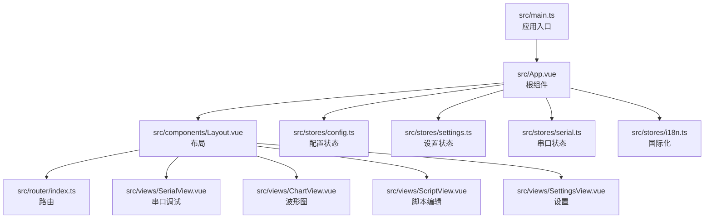
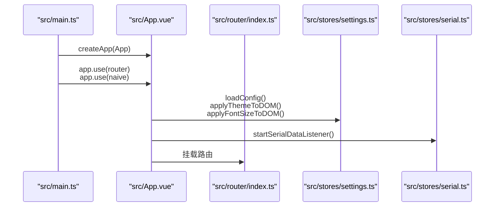
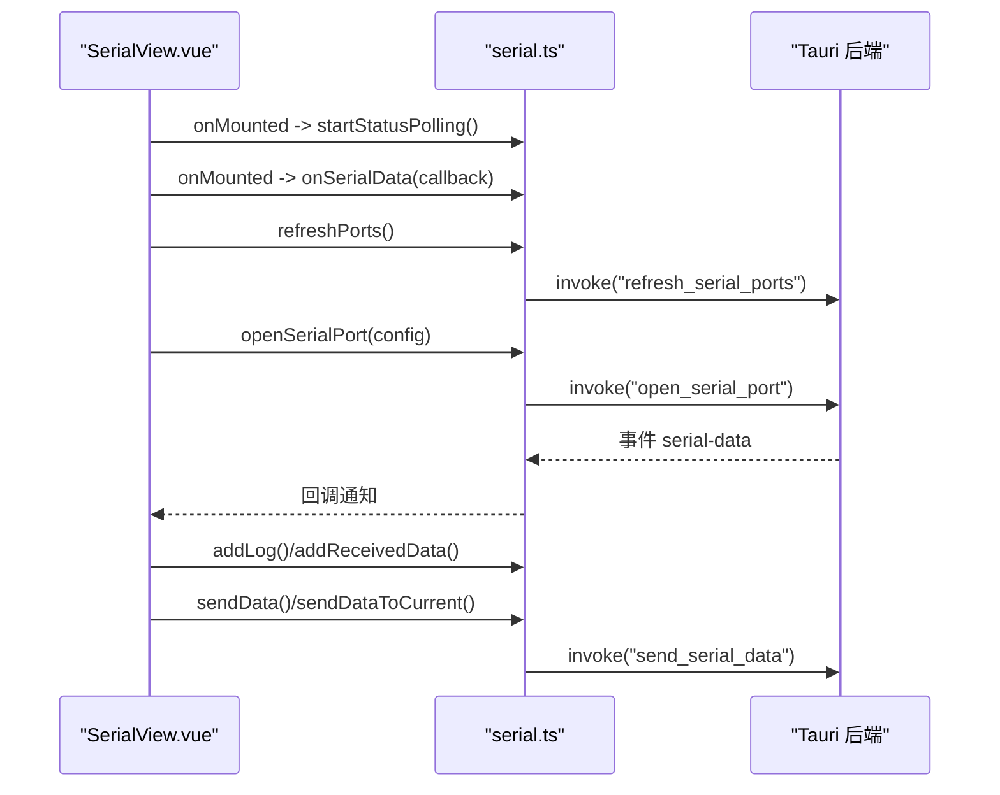
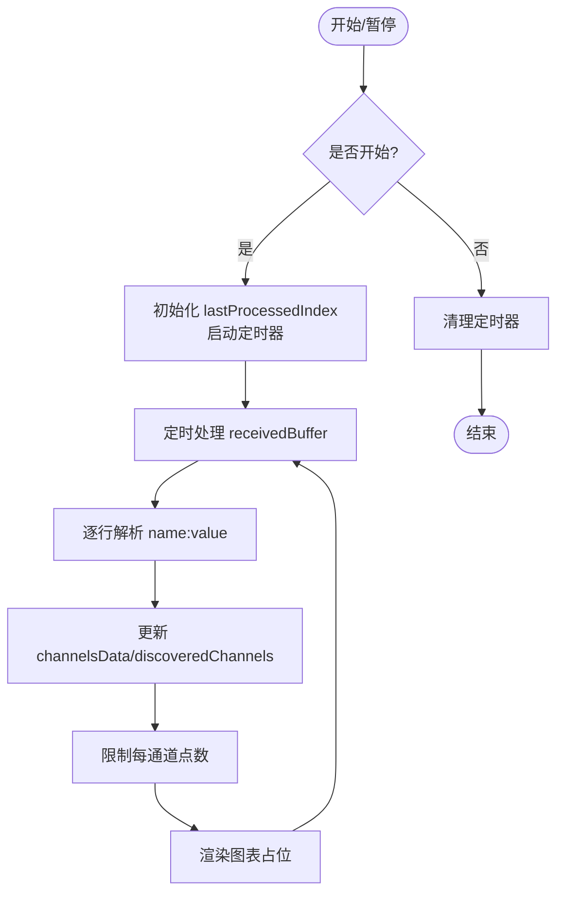
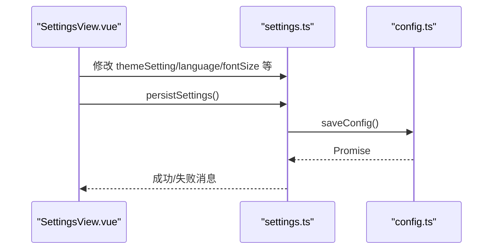
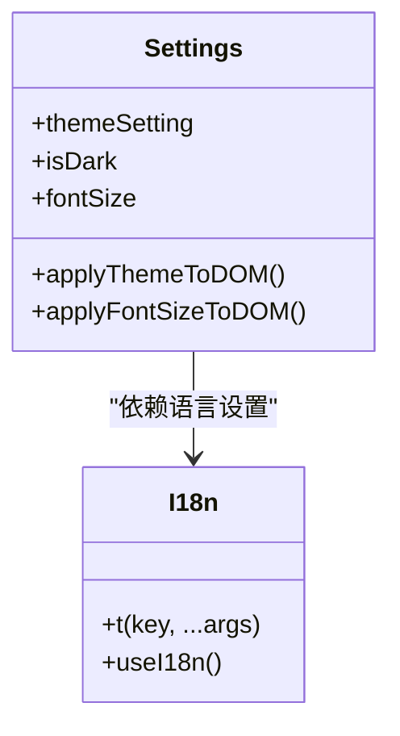
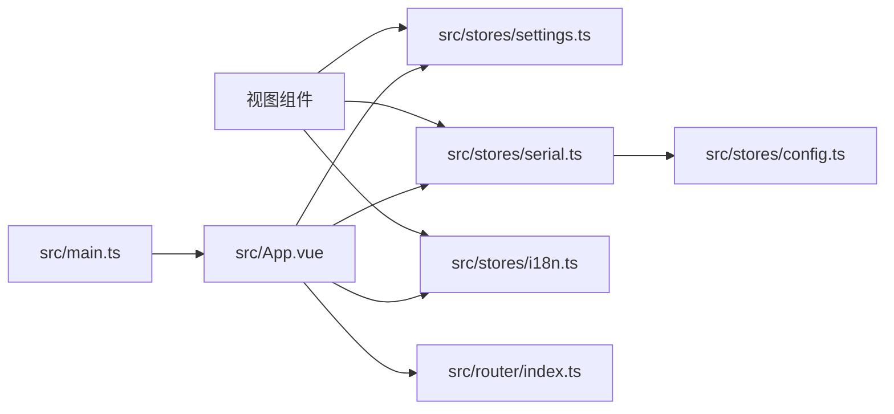

# 组合式函数与 Composition API

<cite>
**本文引用的文件**
- [src/main.ts](file://src/main.ts)
- [src/App.vue](file://src/App.vue)
- [src/components/Layout.vue](file://src/components/Layout.vue)
- [src/router/index.ts](file://src/router/index.ts)
- [src/stores/config.ts](file://src/stores/config.ts)
- [src/stores/settings.ts](file://src/stores/settings.ts)
- [src/stores/serial.ts](file://src/stores/serial.ts)
- [src/stores/i18n.ts](file://src/stores/i18n.ts)
- [src/views/SerialView.vue](file://src/views/SerialView.vue)
- [src/views/ChartView.vue](file://src/views/ChartView.vue)
- [src/views/ScriptView.vue](file://src/views/ScriptView.vue)
- [src/views/SettingsView.vue](file://src/views/SettingsView.vue)
</cite>

## 目录
1. [引言](#引言)
2. [项目结构](#项目结构)
3. [核心组件](#核心组件)
4. [架构总览](#架构总览)
5. [详细组件分析](#详细组件分析)
6. [依赖关系分析](#依赖关系分析)
7. [性能考虑](#性能考虑)
8. [故障排查指南](#故障排查指南)
9. [结论](#结论)
10. [附录](#附录)

## 引言
本文件围绕 KonSerial 的组合式函数与 Composition API 使用进行系统化梳理，重点阐释以下方面：
- 设计理念与使用模式：逻辑复用、状态封装、副作用管理
- 自定义组合式函数的实现方法：响应式数据处理、生命周期钩子、错误处理
- 与第三方库（Naive UI、ApexCharts/ECharts）的集成方式
- 测试策略与调试技巧
- 性能优化建议、内存泄漏防护与最佳实践
- 实际应用场景与代码示例路径

## 项目结构
KonSerial 前端采用 Vue 3 + Tauri 架构，核心目录组织如下：
- src/main.ts：应用入口，注册路由与 Naive UI 插件
- src/App.vue：根组件，统一注入主题、消息与布局
- src/components/Layout.vue：侧边导航与路由视图容器
- src/router/index.ts：SPA 路由配置
- src/stores/*：状态管理（配置、设置、串口、国际化）
- src/views/*：页面视图（串口调试、波形图、脚本、设置）
- src/assets/styles.css：全局样式

**图表来源**
- [src/main.ts:1-14](file://src/main.ts#L1-L14)
- [src/App.vue:1-33](file://src/App.vue#L1-L33)
- [src/components/Layout.vue:1-121](file://src/components/Layout.vue#L1-L121)
- [src/router/index.ts:1-38](file://src/router/index.ts#L1-L38)

**章节来源**
- [src/main.ts:1-14](file://src/main.ts#L1-L14)
- [src/App.vue:1-33](file://src/App.vue#L1-L33)
- [src/components/Layout.vue:1-121](file://src/components/Layout.vue#L1-L121)
- [src/router/index.ts:1-38](file://src/router/index.ts#L1-L38)

## 核心组件
本项目通过“状态仓库 + 视图组件”的分层设计实现组合式函数的落地：
- 状态仓库（stores）：集中管理全局状态与副作用，提供纯函数式 API，便于跨组件复用
- 视图组件（views）：消费状态、触发动作、管理本地 UI 状态与生命周期
- 国际化与设置：通过计算属性与副作用实现响应式主题、语言与字体大小

关键要点：
- 响应式数据：使用 ref/computed/watch 管理状态与派生状态
- 副作用：通过 watch、onMounted/onUnmounted 管理 DOM 与定时器
- 错误处理：统一使用 try/catch 并结合消息提示
- 生命周期：在 onMounted 启动轮询/监听，在 onUnmounted 清理资源

**章节来源**
- [src/stores/config.ts:1-89](file://src/stores/config.ts#L1-L89)
- [src/stores/settings.ts:1-124](file://src/stores/settings.ts#L1-L124)
- [src/stores/serial.ts:1-363](file://src/stores/serial.ts#L1-L363)
- [src/stores/i18n.ts:1-348](file://src/stores/i18n.ts#L1-L348)

## 架构总览
下图展示应用启动流程与关键交互：

**图表来源**
- [src/main.ts:1-14](file://src/main.ts#L1-L14)
- [src/App.vue:14-19](file://src/App.vue#L14-L19)
- [src/stores/settings.ts:101-117](file://src/stores/settings.ts#L101-L117)
- [src/stores/serial.ts:312-323](file://src/stores/serial.ts#L312-L323)

## 详细组件分析

### 串口调试视图（SerialView）与串口状态仓库（serial）
该视图通过组合式函数模式消费串口状态仓库，实现连接管理、数据接收与发送、统计展示等功能。

关键实现点：
- 事件监听：startSerialDataListener 通过 listen 订阅后端推送，回调通过数组维护，onUnmounted 中释放
- 状态轮询：startStatusPolling 以固定间隔更新全局信息
- 数据处理：收到原始字节后按当前编码解码，写入本地日志并同步到全局接收缓存
- 生命周期：onMounted 注册监听与轮询；onUnmounted 取消订阅与定时器

**图表来源**
- [src/views/SerialView.vue:234-254](file://src/views/SerialView.vue#L234-L254)
- [src/stores/serial.ts:312-362](file://src/stores/serial.ts#L312-L362)

**章节来源**
- [src/views/SerialView.vue:1-746](file://src/views/SerialView.vue#L1-L746)
- [src/stores/serial.ts:1-363](file://src/stores/serial.ts#L1-L363)

### 波形图视图（ChartView）与数据处理
该视图消费全局接收缓存，解析并可视化多通道数据，演示了“全局共享状态 + 局部 UI 状态”的组合式模式。

关键实现点：
- 全局共享：receivedBuffer 由串口仓库维护，波形图只读取
- 局部状态：channelsData、selectedChannels、timeRange 等仅在视图内使用
- 内存保护：限制每通道数据点数量与全局缓冲大小
- 资源清理：onUnmounted 清理定时器

**图表来源**
- [src/views/ChartView.vue:100-132](file://src/views/ChartView.vue#L100-L132)
- [src/views/ChartView.vue:71-98](file://src/views/ChartView.vue#L71-L98)
- [src/stores/serial.ts:96-117](file://src/stores/serial.ts#L96-L117)

**章节来源**
- [src/views/ChartView.vue:1-855](file://src/views/ChartView.vue#L1-L855)
- [src/stores/serial.ts:96-117](file://src/stores/serial.ts#L96-L117)

### 设置视图（SettingsView）与设置仓库（settings）
设置视图通过响应式设置项驱动 UI，并在保存时持久化到配置仓库。

关键实现点：
- 响应式设置：themeSetting、language、fontSize 等均为 computed/ref，变更即时生效
- DOM 副作用：applyThemeToDOM、applyFontSizeToDOM 将主题与字体应用到 document
- 持久化：persistSettings 调用 saveConfig 将配置写回后端

**图表来源**
- [src/views/SettingsView.vue:42-59](file://src/views/SettingsView.vue#L42-L59)
- [src/stores/settings.ts:101-124](file://src/stores/settings.ts#L101-L124)
- [src/stores/config.ts:52-64](file://src/stores/config.ts#L52-L64)

**章节来源**
- [src/views/SettingsView.vue:1-383](file://src/views/SettingsView.vue#L1-L383)
- [src/stores/settings.ts:1-124](file://src/stores/settings.ts#L1-L124)
- [src/stores/config.ts:1-89](file://src/stores/config.ts#L1-L89)

### 国际化（i18n）与主题（settings）
国际化系统基于响应式语言设置返回对应文本，主题系统基于系统偏好与用户设置动态切换。

**图表来源**
- [src/stores/settings.ts:19-32](file://src/stores/settings.ts#L19-L32)
- [src/stores/i18n.ts:318-347](file://src/stores/i18n.ts#L318-L347)

**章节来源**
- [src/stores/settings.ts:1-124](file://src/stores/settings.ts#L1-L124)
- [src/stores/i18n.ts:1-348](file://src/stores/i18n.ts#L1-L348)

### 脚本编辑视图（ScriptView）
脚本视图展示了本地 UI 状态与日志记录的组合式模式，强调“局部状态 + 事件驱动”的简单组合式函数。

**章节来源**
- [src/views/ScriptView.vue:1-442](file://src/views/ScriptView.vue#L1-L442)

## 依赖关系分析
- 应用入口依赖路由与 UI 库；根组件依赖设置与串口仓库；视图组件依赖对应仓库与国际化
- 串口仓库依赖 Tauri invoke 与事件监听，负责与后端通信与全局状态
- 设置仓库依赖配置仓库，负责主题与语言的响应式应用
- 国际化仓库依赖语言设置，提供响应式翻译函数

**图表来源**
- [src/main.ts:1-14](file://src/main.ts#L1-L14)
- [src/App.vue:1-33](file://src/App.vue#L1-L33)
- [src/stores/serial.ts:1-363](file://src/stores/serial.ts#L1-L363)
- [src/stores/settings.ts:1-124](file://src/stores/settings.ts#L1-L124)
- [src/stores/config.ts:1-89](file://src/stores/config.ts#L1-L89)
- [src/stores/i18n.ts:1-348](file://src/stores/i18n.ts#L1-L348)
- [src/router/index.ts:1-38](file://src/router/index.ts#L1-L38)

**章节来源**
- [src/main.ts:1-14](file://src/main.ts#L1-L14)
- [src/App.vue:1-33](file://src/App.vue#L1-L33)
- [src/stores/serial.ts:1-363](file://src/stores/serial.ts#L1-L363)
- [src/stores/settings.ts:1-124](file://src/stores/settings.ts#L1-L124)
- [src/stores/config.ts:1-89](file://src/stores/config.ts#L1-L89)
- [src/stores/i18n.ts:1-348](file://src/stores/i18n.ts#L1-L348)
- [src/router/index.ts:1-38](file://src/router/index.ts#L1-L38)

## 性能考虑
- 数据缓冲与裁剪
  - 串口日志与全局接收缓存均设置上限，超出则裁剪旧数据，避免内存膨胀
  - 波形图每通道数据点数量按时间范围限制，防止无限增长
- 轮询与定时器
  - 串口状态轮询默认 1 秒，可在不需要时停止，减少 CPU 占用
  - 波形图定时处理周期 50ms，可根据场景调整
- DOM 与副作用
  - 主题与字体大小通过一次性 watch 应用到 documentElement，避免频繁重排
- 第三方库集成
  - 图表库（ECharts/ApexCharts）建议按需引入与懒加载，避免首屏阻塞
  - html2canvas 导出图表时控制 scale 与尺寸，降低内存占用

[本节为通用性能建议，不直接分析具体文件]

## 故障排查指南
- 串口连接失败
  - 检查配置加载与串口权限；查看错误消息与日志条目
  - 确认轮询与监听已启动并在组件卸载时正确清理
- 数据不显示或显示乱码
  - 核对编码设置与换行追加策略；确认 onSerialData 回调已注册
- 波形图无数据
  - 确认串口日志中存在有效数据；检查 receivedBuffer 是否被裁剪
- 设置不生效
  - 确认 persistSettings 已调用且 saveConfig 成功；检查 DOM 副作用是否执行

**章节来源**
- [src/views/SerialView.vue:140-205](file://src/views/SerialView.vue#L140-L205)
- [src/stores/serial.ts:312-362](file://src/stores/serial.ts#L312-L362)
- [src/stores/settings.ts:101-124](file://src/stores/settings.ts#L101-L124)

## 结论
KonSerial 在前端层面充分运用了组合式函数与 Composition API 的优势：
- 通过状态仓库实现逻辑复用与跨组件共享
- 通过响应式与副作用管理实现主题、语言、字体等全局行为
- 通过生命周期钩子与资源清理避免内存泄漏
- 通过视图组件聚焦 UI 与交互，保持清晰的职责分离

后续可在以下方面进一步增强：
- 为关键仓库函数提供单元测试与集成测试
- 对图表库进行组合式封装，提升可测试性与可复用性
- 对高频副作用进行节流/防抖优化

[本节为总结性内容，不直接分析具体文件]

## 附录

### 自定义组合式函数实现清单
- 响应式数据处理
  - 使用 ref/computed/watch 管理状态与派生状态
  - 示例路径：[src/stores/settings.ts:19-41](file://src/stores/settings.ts#L19-L41)
- 生命周期钩子
  - onMounted/onUnmounted 注册/清理轮询与监听
  - 示例路径：[src/views/SerialView.vue:237-253](file://src/views/SerialView.vue#L237-L253)
- 错误处理
  - try/catch 包裹异步操作，结合消息提示
  - 示例路径：[src/views/SerialView.vue:140-205](file://src/views/SerialView.vue#L140-L205)
- 与第三方库集成
  - Naive UI：在入口注册插件，组件内按需使用
  - 示例路径：[src/main.ts:6-12](file://src/main.ts#L6-L12)
  - 图表库：按需引入与懒加载，导出时控制质量与尺寸
  - 示例路径：[src/views/ChartView.vue:179-201](file://src/views/ChartView.vue#L179-L201)

### 测试策略与调试技巧
- 单元测试
  - 对纯函数（如配置转换、数据解析）编写测试
  - 对副作用函数（如轮询、监听）使用 mock 与清理
- 集成测试
  - 模拟 Tauri invoke 与事件，验证状态仓库行为
- 调试技巧
  - 使用浏览器开发者工具观察响应式状态变化
  - 在关键路径添加日志与错误边界，捕获异常

[本节为通用指导，不直接分析具体文件]