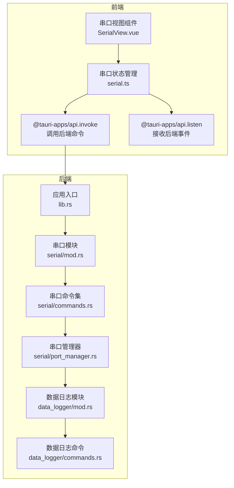
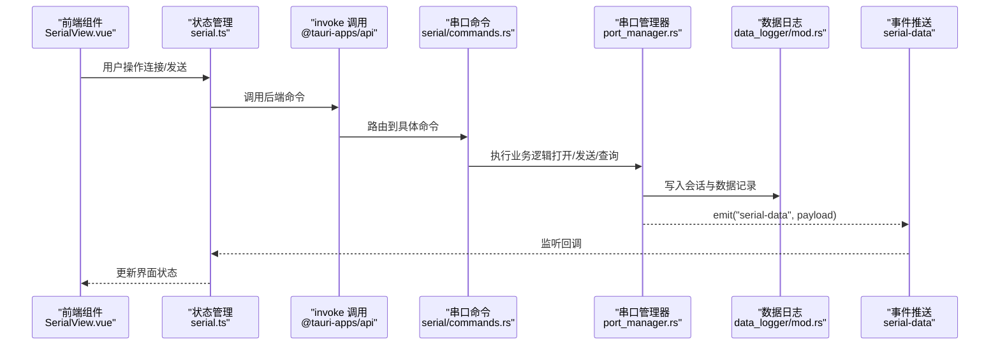
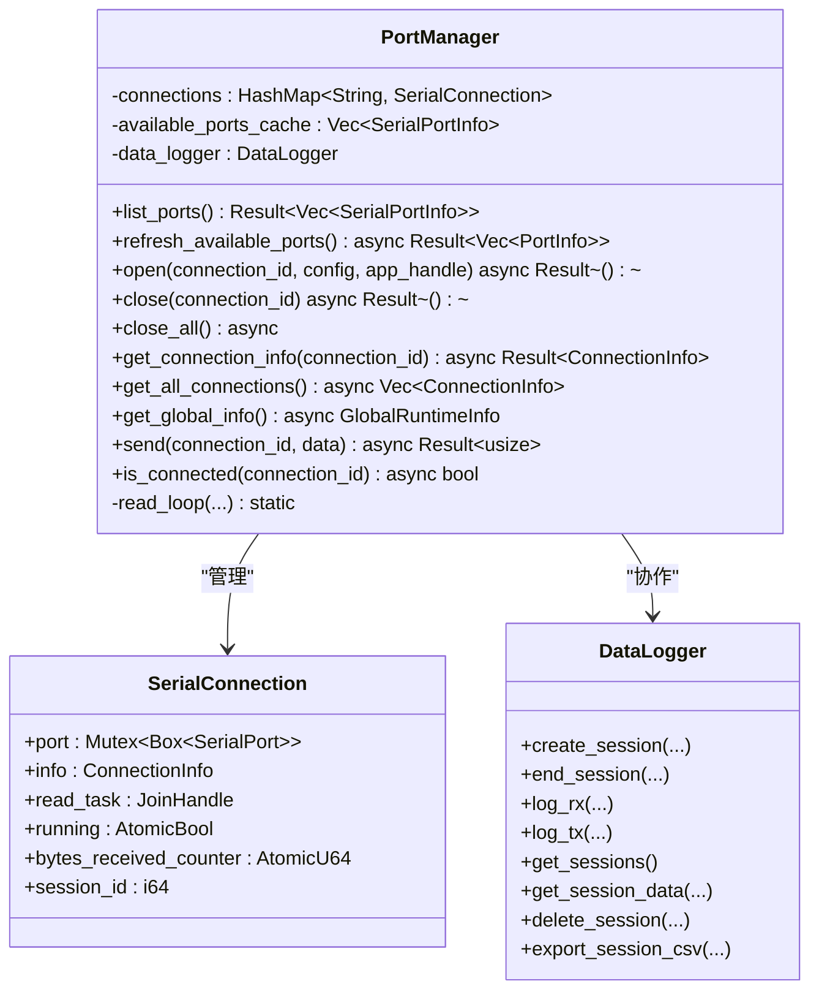
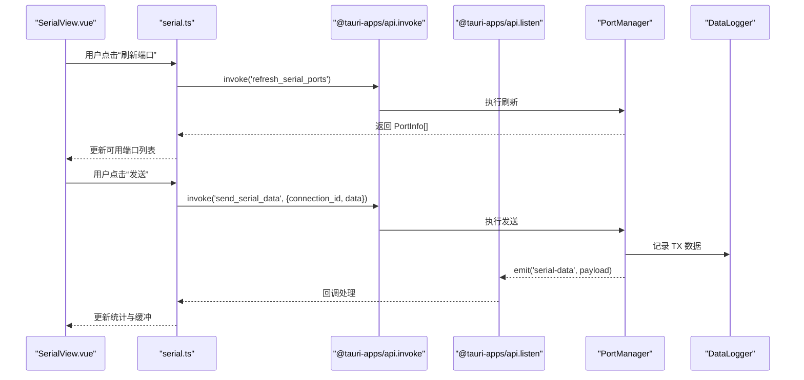
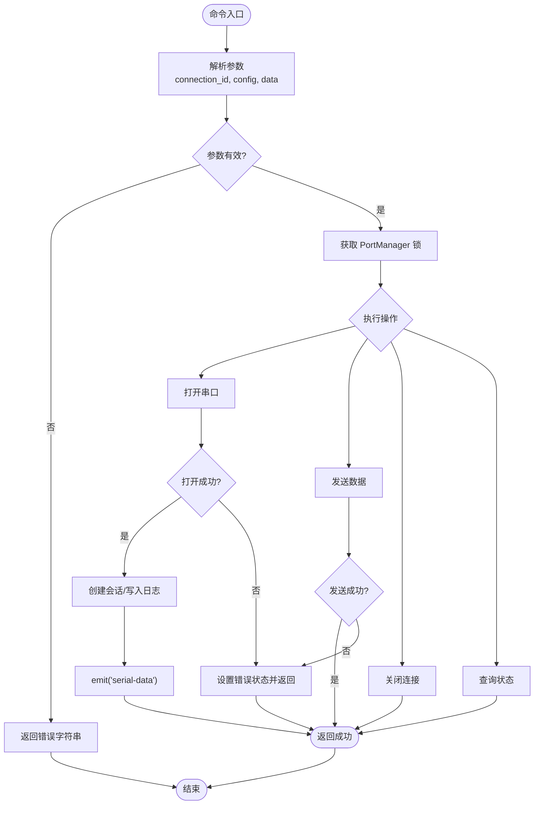
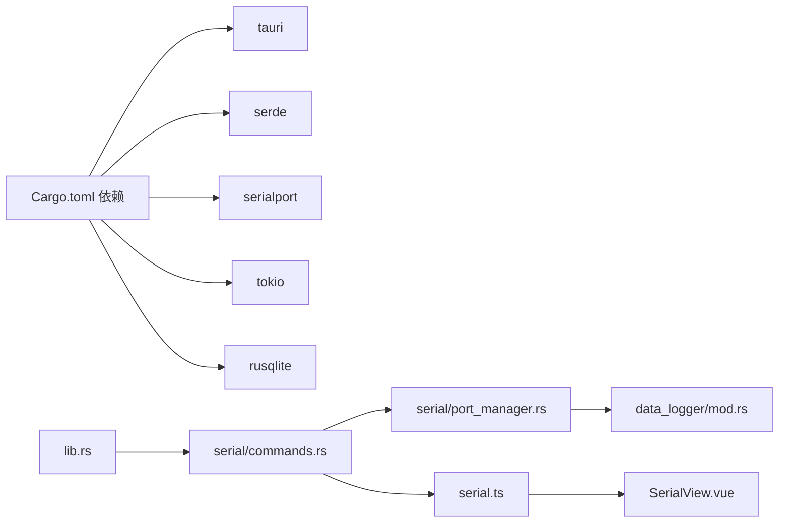

# 串口命令实现

<cite>
**本文档引用的文件**
- [src-tauri/src/serial/mod.rs](file://src-tauri/src/serial/mod.rs)
- [src-tauri/src/serial/commands.rs](file://src-tauri/src/serial/commands.rs)
- [src-tauri/src/serial/port_manager.rs](file://src-tauri/src/serial/port_manager.rs)
- [src-tauri/src/serial/data_process.rs](file://src-tauri/src/serial/data_process.rs)
- [src-tauri/src/lib.rs](file://src-tauri/src/lib.rs)
- [src-tauri/src/data_logger/mod.rs](file://src-tauri/src/data_logger/mod.rs)
- [src-tauri/src/data_logger/commands.rs](file://src-tauri/src/data_logger/commands.rs)
- [src-tauri/src/utils/commands.rs](file://src-tauri/src/utils/commands.rs)
- [src/stores/serial.ts](file://src/stores/serial.ts)
- [src/views/SerialView.vue](file://src/views/SerialView.vue)
- [src-tauri/Cargo.toml](file://src-tauri/Cargo.toml)
- [src-tauri/tauri.conf.json](file://src-tauri/tauri.conf.json)
</cite>

## 目录
1. [简介](#简介)
2. [项目结构](#项目结构)
3. [核心组件](#核心组件)
4. [架构总览](#架构总览)
5. [详细组件分析](#详细组件分析)
6. [依赖关系分析](#依赖关系分析)
7. [性能考量](#性能考量)
8. [故障排除指南](#故障排除指南)
9. [结论](#结论)
10. [附录](#附录)

## 简介
本文件面向 Tauri 应用中的串口命令实现，系统性梳理了串口相关的命令接口、参数定义、返回值格式、错误码规范、执行流程、异步处理机制、前端数据绑定与事件通知、命令注册机制、版本兼容性与安全考虑，并提供调用示例与最佳实践建议。目标读者既包括需要快速上手的开发者，也包括希望深入理解架构细节的技术人员。

## 项目结构
该应用采用前后端分离的 Tauri 架构：
- 后端（Rust）：通过 Tauri 命令系统暴露串口控制与数据传输能力，使用 Tokio 异步运行时与串口库进行底层通信。
- 前端（Vue + TypeScript）：通过 @tauri-apps/api 的 invoke 与 listen 与后端交互，实现串口扫描、连接控制、数据发送与接收事件监听。

图表来源
- [src-tauri/src/lib.rs:24-83](file://src-tauri/src/lib.rs#L24-L83)
- [src-tauri/src/serial/mod.rs:1-4](file://src-tauri/src/serial/mod.rs#L1-L4)
- [src-tauri/src/serial/commands.rs:1-129](file://src-tauri/src/serial/commands.rs#L1-L129)
- [src-tauri/src/serial/port_manager.rs:159-401](file://src-tauri/src/serial/port_manager.rs#L159-L401)
- [src-tauri/src/data_logger/mod.rs:47-273](file://src-tauri/src/data_logger/mod.rs#L47-L273)
- [src-tauri/src/data_logger/commands.rs:1-49](file://src-tauri/src/data_logger/commands.rs#L1-L49)
- [src/stores/serial.ts:145-363](file://src/stores/serial.ts#L145-L363)
- [src/views/SerialView.vue:1-746](file://src/views/SerialView.vue#L1-L746)

章节来源
- [src-tauri/src/lib.rs:24-83](file://src-tauri/src/lib.rs#L24-L83)
- [src-tauri/src/serial/mod.rs:1-4](file://src-tauri/src/serial/mod.rs#L1-L4)
- [src/stores/serial.ts:145-363](file://src/stores/serial.ts#L145-L363)

## 核心组件
- 串口命令集：提供端口扫描、连接控制、状态查询、数据发送与连接检测等命令。
- 串口管理器：封装多连接状态、异步读取循环、错误处理与会话管理。
- 数据日志模块：基于 SQLite 的会话与数据持久化，支持查询与导出。
- 前端状态管理：统一管理串口配置、连接状态、接收缓冲与事件监听。

章节来源
- [src-tauri/src/serial/commands.rs:15-129](file://src-tauri/src/serial/commands.rs#L15-L129)
- [src-tauri/src/serial/port_manager.rs:159-401](file://src-tauri/src/serial/port_manager.rs#L159-L401)
- [src-tauri/src/data_logger/mod.rs:47-273](file://src-tauri/src/data_logger/mod.rs#L47-L273)
- [src/stores/serial.ts:145-363](file://src/stores/serial.ts#L145-L363)

## 架构总览
Tauri 命令系统以 #[tauri::command] 宏声明，后端通过 State/Arc<Mutex<T>> 注入全局状态，前端通过 invoke 调用命令，通过事件推送实现异步数据回传。

图表来源
- [src/views/SerialView.vue:234-253](file://src/views/SerialView.vue#L234-L253)
- [src/stores/serial.ts:297-341](file://src/stores/serial.ts#L297-L341)
- [src-tauri/src/serial/commands.rs:49-129](file://src-tauri/src/serial/commands.rs#L49-L129)
- [src-tauri/src/serial/port_manager.rs:196-303](file://src-tauri/src/serial/port_manager.rs#L196-L303)
- [src-tauri/src/data_logger/mod.rs:115-164](file://src-tauri/src/data_logger/mod.rs#L115-L164)

## 详细组件分析

### 串口命令集（命令定义与参数）
以下命令均通过 #[tauri::command] 宏注册，参数与返回值遵循统一的 Result<T, String> 错误约定。

- 端口扫描类
  - list_serial_ports：无参数，返回可用串口名称数组。
  - get_serial_ports_info：无参数，返回串口简要信息数组（名称、类型）。
  - refresh_serial_ports：异步刷新可用串口列表，返回详细 PortInfo 数组。

- 连接控制类
  - open_serial_port：打开指定连接，需提供 connection_id 与 SerialPortConfig。
  - close_serial_port：关闭指定连接。
  - close_all_serial_ports：关闭所有连接。
  - is_serial_connected：检查连接是否处于已连接状态。

- 状态查询类
  - get_connection_info：获取单个连接的运行时信息。
  - get_all_connections：获取所有连接的运行时信息。
  - get_global_runtime_info：获取全局运行时信息（可用端口、活跃连接、总数）。

- 数据传输类
  - send_serial_data：向指定连接发送字节数组，返回发送字节数。

参数与返回值要点
- SerialPortConfig：包含端口名、波特率、数据位、停止位、校验位、流控制、超时毫秒数。
- ConnectionInfo：包含连接 ID、状态、配置、收发字节计数、最后错误、创建时间。
- PortInfo：包含端口名、类型、厂商、产品、序列号、VID/PID。
- 错误统一返回 String，便于前端展示与日志记录。

章节来源
- [src-tauri/src/serial/commands.rs:15-129](file://src-tauri/src/serial/commands.rs#L15-L129)
- [src-tauri/src/serial/port_manager.rs:14-124](file://src-tauri/src/serial/port_manager.rs#L14-L124)
- [src-tauri/src/serial/port_manager.rs:77-124](file://src-tauri/src/serial/port_manager.rs#L77-L124)

### 串口管理器（PortManager）
职责与特性
- 多连接管理：维护 HashMap<String, SerialConnection>，键为 connection_id。
- 异步读取循环：独立线程运行 read_loop，周期性读取串口数据，推送 "serial-data" 事件，同时持久化到 SQLite。
- 会话管理：与 DataLogger 协作，创建/结束会话，记录 TX/RX 数据。
- 状态统计：原子计数器维护 bytes_received，实时查询时合并最新计数。
- 错误处理：连接失败、发送失败均设置 PortStatus::Error 并记录 last_error。

图表来源
- [src-tauri/src/serial/port_manager.rs:159-401](file://src-tauri/src/serial/port_manager.rs#L159-L401)
- [src-tauri/src/data_logger/mod.rs:47-273](file://src-tauri/src/data_logger/mod.rs#L47-L273)

章节来源
- [src-tauri/src/serial/port_manager.rs:159-401](file://src-tauri/src/serial/port_manager.rs#L159-L401)

### 前端数据绑定与事件通知
- 命令调用：通过 invoke 调用后端命令，如 refresh_serial_ports、open_serial_port、send_serial_data 等。
- 事件监听：通过 listen('serial-data', callback) 接收后端推送的原始字节数据，前端自行解码显示。
- 状态轮询：定期调用 get_global_runtime_info 更新界面状态。
- 缓冲管理：全局 receivedBuffer 控制接收数据上限，避免内存膨胀。

图表来源
- [src/views/SerialView.vue:140-205](file://src/views/SerialView.vue#L140-L205)
- [src/stores/serial.ts:145-363](file://src/stores/serial.ts#L145-L363)
- [src-tauri/src/serial/commands.rs:49-129](file://src-tauri/src/serial/commands.rs#L49-L129)
- [src-tauri/src/serial/port_manager.rs:274-303](file://src-tauri/src/serial/port_manager.rs#L274-L303)

章节来源
- [src/views/SerialView.vue:140-205](file://src/views/SerialView.vue#L140-L205)
- [src/stores/serial.ts:145-363](file://src/stores/serial.ts#L145-L363)

### 命令执行流程与错误处理
- 参数验证：命令层不做复杂验证，主要依赖串口库与操作系统返回错误；前端可做基础输入校验（如端口名非空、数值范围）。
- 权限检查：串口访问受操作系统权限控制，若无权限或被占用，底层 open/read/write 会返回错误。
- 异步处理：Tokio 任务与 Mutex 保护共享状态；read_loop 在独立线程中运行，避免阻塞主线程。
- 错误码规范：统一返回 Result<T, String>，错误信息为底层错误字符串，便于前端直接展示与日志记录。

图表来源
- [src-tauri/src/serial/commands.rs:49-129](file://src-tauri/src/serial/commands.rs#L49-L129)
- [src-tauri/src/serial/port_manager.rs:196-392](file://src-tauri/src/serial/port_manager.rs#L196-L392)

章节来源
- [src-tauri/src/serial/commands.rs:49-129](file://src-tauri/src/serial/commands.rs#L49-L129)
- [src-tauri/src/serial/port_manager.rs:196-392](file://src-tauri/src/serial/port_manager.rs#L196-L392)

### 命令注册机制与版本兼容性
- 命令注册：在 lib.rs 中通过 generate_handler! 将串口命令注册到 Tauri Builder。
- 版本兼容：Tauri 2.x 特性启用，构建配置与插件版本与当前依赖保持一致。
- 安全考虑：通过 State 注入全局状态，避免命令函数携带可变状态；事件推送仅推送必要字段，减少敏感信息泄露。

章节来源
- [src-tauri/src/lib.rs:56-80](file://src-tauri/src/lib.rs#L56-L80)
- [src-tauri/Cargo.toml:20-40](file://src-tauri/Cargo.toml#L20-L40)
- [src-tauri/tauri.conf.json:1-47](file://src-tauri/tauri.conf.json#L1-L47)

## 依赖关系分析

图表来源
- [src-tauri/Cargo.toml:20-40](file://src-tauri/Cargo.toml#L20-L40)
- [src-tauri/src/lib.rs:47-83](file://src-tauri/src/lib.rs#L47-L83)
- [src-tauri/src/serial/commands.rs:1-129](file://src-tauri/src/serial/commands.rs#L1-L129)
- [src-tauri/src/serial/port_manager.rs:1-401](file://src-tauri/src/serial/port_manager.rs#L1-L401)
- [src-tauri/src/data_logger/mod.rs:1-273](file://src-tauri/src/data_logger/mod.rs#L1-L273)
- [src/stores/serial.ts:1-363](file://src/stores/serial.ts#L1-L363)
- [src/views/SerialView.vue:1-746](file://src/views/SerialView.vue#L1-L746)

章节来源
- [src-tauri/Cargo.toml:20-40](file://src-tauri/Cargo.toml#L20-L40)
- [src-tauri/src/lib.rs:47-83](file://src-tauri/src/lib.rs#L47-L83)

## 性能考量
- 异步读取：read_loop 在独立线程中运行，避免阻塞主线程；读取超时设置为 100ms，确保及时响应关闭信号。
- 原子计数：使用 AtomicU64 维护 bytes_received，降低锁竞争。
- 缓存策略：可用串口列表缓存于 PortManager，减少频繁扫描。
- 日志持久化：SQLite WAL 模式与外键约束提升并发与一致性，索引优化查询性能。
- 前端缓冲：最大缓冲区限制，避免内存暴涨。

章节来源
- [src-tauri/src/serial/port_manager.rs:274-303](file://src-tauri/src/serial/port_manager.rs#L274-L303)
- [src-tauri/src/data_logger/mod.rs:76-106](file://src-tauri/src/data_logger/mod.rs#L76-L106)
- [src/stores/serial.ts:105-117](file://src/stores/serial.ts#L105-L117)

## 故障排除指南
常见问题与处理建议
- 打开串口失败
  - 检查端口名是否正确、设备是否被占用、权限是否足够。
  - 查看 last_error 字段与日志输出，定位具体错误原因。
- 发送数据失败
  - 检查连接状态是否为 Connected，确认 connection_id 是否存在。
  - 查看 PortStatus::Error 与 last_error。
- 无法接收数据
  - 确认 read_loop 正常运行，事件监听已启动。
  - 检查编码设置与十六进制显示模式。
- 性能问题
  - 调整缓冲区上限，避免过多数据堆积。
  - 检查日志查询 limit/offset 参数，避免一次性加载过多数据。

章节来源
- [src-tauri/src/serial/port_manager.rs:333-344](file://src-tauri/src/serial/port_manager.rs#L333-L344)
- [src-tauri/src/serial/port_manager.rs:394-400](file://src-tauri/src/serial/port_manager.rs#L394-L400)
- [src/stores/serial.ts:297-341](file://src/stores/serial.ts#L297-L341)

## 结论
该串口命令实现以 Tauri 命令系统为核心，结合异步读取循环与 SQLite 持久化，提供了完整的串口扫描、连接控制、状态查询与数据传输能力。前端通过 invoke 与 listen 实现与后端的高效交互，具备良好的扩展性与可维护性。建议在生产环境中进一步完善参数校验、错误分类与用户提示，并持续关注 Tauri 生态的版本演进。

## 附录

### 命令清单与调用示例（路径参考）
- 端口扫描
  - 调用：invoke('refresh_serial_ports')
  - 返回：PortInfo[]
  - 路径参考：[src-tauri/src/serial/commands.rs:40-47](file://src-tauri/src/serial/commands.rs#L40-L47)，[src/stores/serial.ts:145-155](file://src/stores/serial.ts#L145-L155)
- 打开串口
  - 调用：invoke('open_serial_port', { connectionId, config })
  - 返回：void
  - 路径参考：[src-tauri/src/serial/commands.rs:49-59](file://src-tauri/src/serial/commands.rs#L49-L59)，[src/stores/serial.ts:157-179](file://src/stores/serial.ts#L157-L179)
- 发送数据
  - 调用：invoke('send_serial_data', { connectionId, data })
  - 返回：发送字节数
  - 路径参考：[src-tauri/src/serial/commands.rs:109-118](file://src-tauri/src/serial/commands.rs#L109-L118)，[src/stores/serial.ts:242-274](file://src/stores/serial.ts#L242-L274)
- 关闭串口
  - 调用：invoke('close_serial_port', { connectionId })
  - 返回：void
  - 路径参考：[src-tauri/src/serial/commands.rs:61-69](file://src-tauri/src/serial/commands.rs#L61-L69)，[src/stores/serial.ts:190-207](file://src/stores/serial.ts#L190-L207)
- 查询状态
  - 调用：invoke('get_global_runtime_info')
  - 返回：GlobalRuntimeInfo
  - 路径参考：[src-tauri/src/serial/commands.rs:100-107](file://src-tauri/src/serial/commands.rs#L100-L107)，[src/stores/serial.ts:233-240](file://src/stores/serial.ts#L233-L240)

### 错误处理最佳实践
- 前端：捕获 invoke 错误并提示用户；区分网络错误与业务错误。
- 后端：统一返回 String 错误信息；记录详细日志；必要时设置 PortStatus::Error。
- 数据持久化：异常时保证事务一致性，避免脏数据。

章节来源
- [src-tauri/src/serial/commands.rs:15-129](file://src-tauri/src/serial/commands.rs#L15-L129)
- [src-tauri/src/serial/port_manager.rs:266-271](file://src-tauri/src/serial/port_manager.rs#L266-L271)