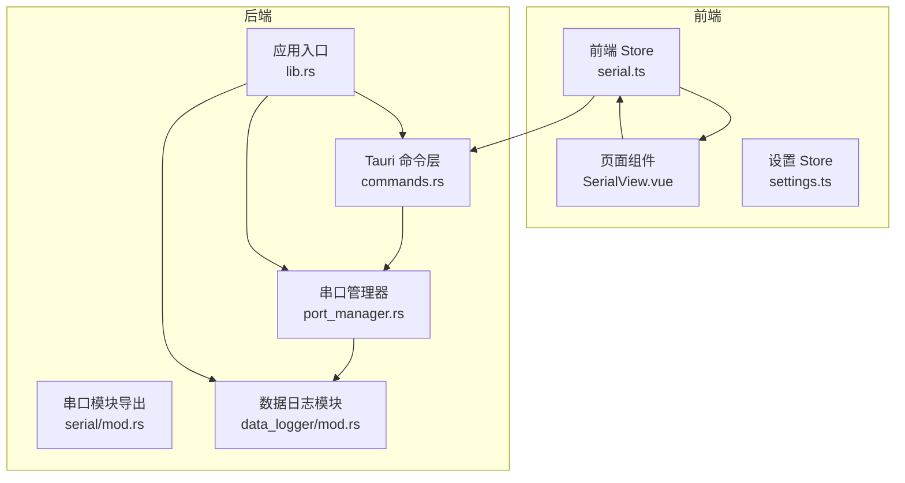
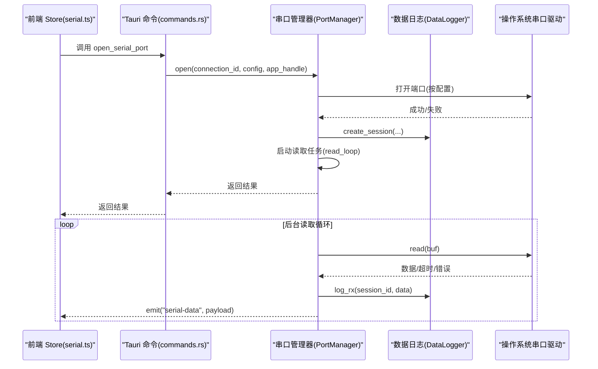
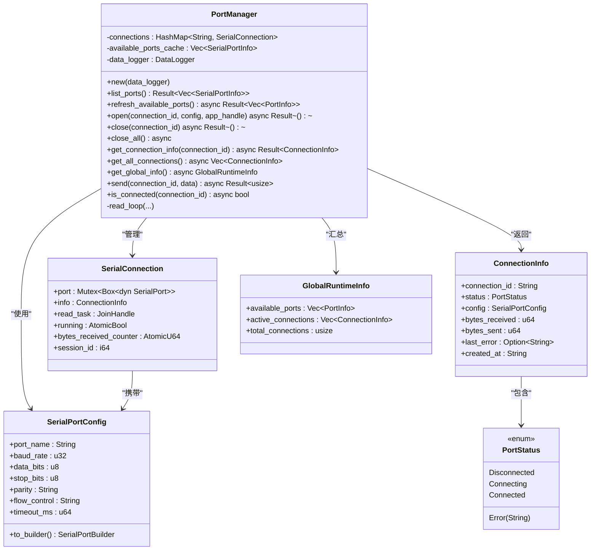
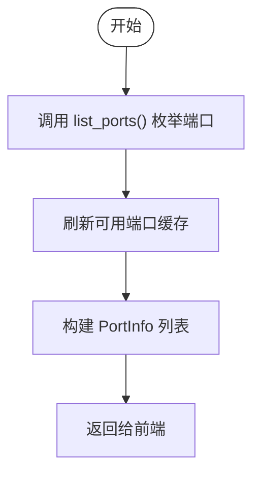
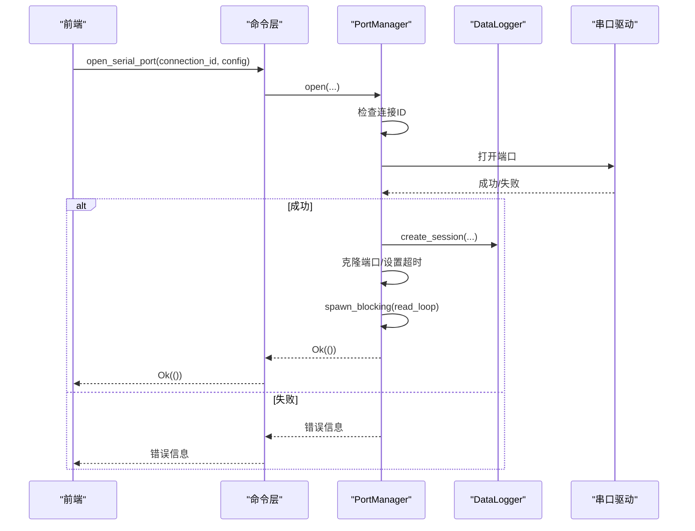
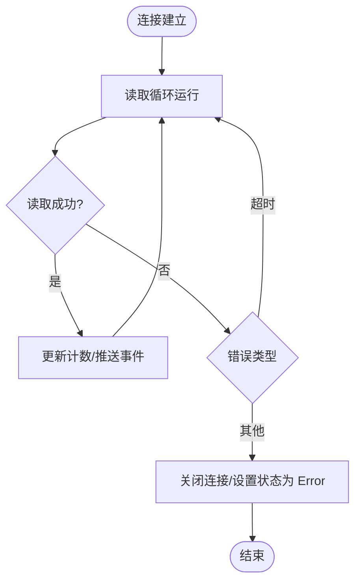
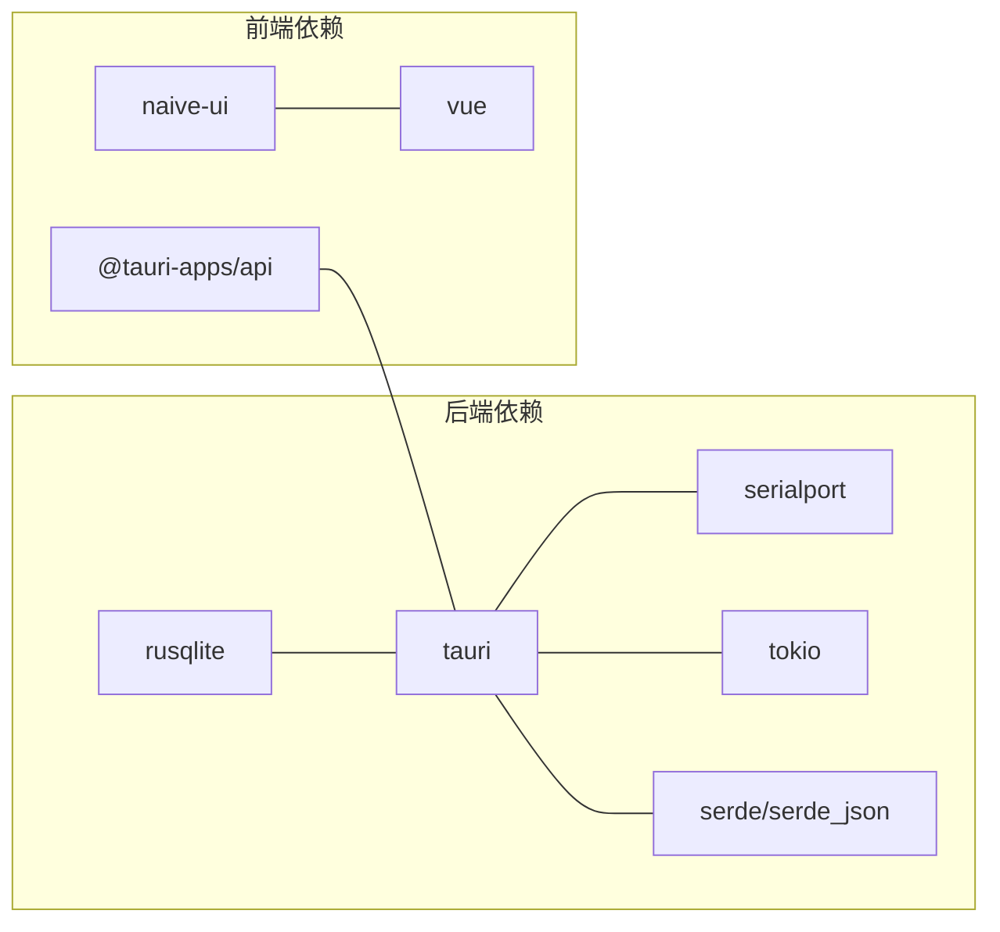

# 串口管理器

<cite>
**本文引用的文件**
- [port_manager.rs](file://src-tauri/src/serial/port_manager.rs)
- [commands.rs](file://src-tauri/src/serial/commands.rs)
- [lib.rs](file://src-tauri/src/lib.rs)
- [Cargo.toml](file://src-tauri/Cargo.toml)
- [serial.ts](file://src/stores/serial.ts)
- [SerialView.vue](file://src/views/SerialView.vue)
- [settings.ts](file://src/stores/settings.ts)
- [mod.rs](file://src-tauri/src/serial/mod.rs)
- [data_logger/mod.rs](file://src-tauri/src/data_logger/mod.rs)
</cite>

## 目录
1. [简介](#简介)
2. [项目结构](#项目结构)
3. [核心组件](#核心组件)
4. [架构总览](#架构总览)
5. [详细组件分析](#详细组件分析)
6. [依赖关系分析](#依赖关系分析)
7. [性能考量](#性能考量)
8. [故障排查指南](#故障排查指南)
9. [结论](#结论)
10. [附录](#附录)

## 简介
本文件面向“串口管理器”组件，系统性阐述其在 KonSerial 中的实现与使用。内容涵盖：
- 串口设备发现与端口枚举算法
- 设备状态监控与事件推送
- 多串口连接管理策略（连接池、并发限制、资源分配）
- 连接建立流程（端口打开、参数配置、握手验证）
- 连接状态管理（状态跟踪、异常断开检测、自动重连机制）
- 串口参数配置（波特率、数据位、停止位、校验位、流控制）
- 串口管理器类图与连接生命周期示例代码路径

## 项目结构
后端采用 Rust + Tauri，前端采用 Vue3 + TypeScript。串口管理器位于后端模块中，通过 Tauri 命令暴露给前端；前端通过 Pinia Store 管理状态与事件监听。

**图表来源**
- [lib.rs:47-82](file://src-tauri/src/lib.rs#L47-L82)
- [mod.rs:1-4](file://src-tauri/src/serial/mod.rs#L1-L4)
- [port_manager.rs:162-180](file://src-tauri/src/serial/port_manager.rs#L162-L180)
- [commands.rs:1-129](file://src-tauri/src/serial/commands.rs#L1-L129)
- [data_logger/mod.rs:47-111](file://src-tauri/src/data_logger/mod.rs#L47-L111)

**章节来源**
- [lib.rs:1-84](file://src-tauri/src/lib.rs#L1-L84)
- [mod.rs:1-4](file://src-tauri/src/serial/mod.rs#L1-L4)

## 核心组件
- 串口管理器（PortManager）：负责多连接管理、端口枚举、连接生命周期、状态统计与事件推送。
- Tauri 命令层：将后端能力暴露为命令，供前端调用。
- 前端 Store（serial.ts）：封装前端状态、事件监听、命令调用与 UI 行为。
- 数据日志模块（DataLogger）：基于 SQLite 的会话与数据持久化，支撑历史回放与导出。

**章节来源**
- [port_manager.rs:162-401](file://src-tauri/src/serial/port_manager.rs#L162-L401)
- [commands.rs:1-129](file://src-tauri/src/serial/commands.rs#L1-L129)
- [serial.ts:1-363](file://src/stores/serial.ts#L1-L363)
- [data_logger/mod.rs:47-273](file://src-tauri/src/data_logger/mod.rs#L47-L273)

## 架构总览
后端以 PortManager 为核心，围绕其构建“连接池”（HashMap），每个连接包含独立的读取任务与原子计数器。前端通过 Store 与命令层交互，实时接收后端推送的串口数据事件。

**图表来源**
- [commands.rs:49-59](file://src-tauri/src/serial/commands.rs#L49-L59)
- [port_manager.rs:196-272](file://src-tauri/src/serial/port_manager.rs#L196-L272)
- [port_manager.rs:274-303](file://src-tauri/src/serial/port_manager.rs#L274-L303)
- [data_logger/mod.rs:115-140](file://src-tauri/src/data_logger/mod.rs#L115-L140)

## 详细组件分析

### 串口管理器（PortManager）
- 角色定位：多连接管理、端口枚举、状态统计、事件推送、数据持久化。
- 关键数据结构：
  - SerialPortConfig：完整串口参数（端口名、波特率、数据位、停止位、校验位、流控制、超时）。
  - ConnectionInfo：单连接运行时信息（状态、字节数、错误、创建时间）。
  - SerialConnection：内部连接对象（端口句柄、信息、读取任务、运行标志、计数器、会话ID）。
  - GlobalRuntimeInfo：全局运行时信息（可用端口、活跃连接、总数）。
- 并发模型：
  - 连接池：HashMap<String, SerialConnection>，键为 connection_id。
  - 读取循环：spawn_blocking 线程内运行，避免阻塞 Tokio 异步运行时。
  - 状态与计数：使用 Arc<AtomicBool>/Arc<AtomicU64> 保证线程安全。
- 生命周期管理：
  - 打开：检查重复、打开端口、创建会话、克隆端口用于读取、启动读取任务、插入连接池。
  - 关闭：设置运行标志为 false、终止读取任务、结束会话。
  - 关闭全部：遍历并逐个关闭。
- 状态与事件：
  - 状态枚举：Disconnected、Connecting、Connected、Error(String)。
  - 事件：emit("serial-data", SerialDataPayload) 推送原始字节给前端。
  - 统计：bytes_received/bytes_sent 原子计数，按需读取。

**图表来源**
- [port_manager.rs:162-401](file://src-tauri/src/serial/port_manager.rs#L162-L401)

**章节来源**
- [port_manager.rs:162-401](file://src-tauri/src/serial/port_manager.rs#L162-L401)

### 串口参数配置与端口枚举
- 参数配置
  - 支持字段：端口名、波特率、数据位（5/6/7/8）、停止位（1/2）、校验位（None/Odd/Even）、流控制（None/Software/Hardware）、超时（毫秒）。
  - 转换：SerialPortConfig.to_builder() 将配置映射为 serialport::SerialPortBuilder。
- 端口枚举
  - 列表：PortManager::list_ports() 调用 serialport::available_ports()。
  - 缓存：refresh_available_ports() 刷新可用端口缓存并返回详细信息（含 USB 信息）。
- 前端对接
  - 前端 Store 提供 refreshPorts()/openSerialPort()/closeSerialPort() 等方法，通过 invoke 调用后端命令。

**图表来源**
- [port_manager.rs:182-194](file://src-tauri/src/serial/port_manager.rs#L182-L194)
- [port_manager.rs:126-157](file://src-tauri/src/serial/port_manager.rs#L126-L157)

**章节来源**
- [port_manager.rs:182-194](file://src-tauri/src/serial/port_manager.rs#L182-L194)
- [port_manager.rs:126-157](file://src-tauri/src/serial/port_manager.rs#L126-L157)
- [serial.ts:145-155](file://src/stores/serial.ts#L145-L155)

### 连接建立流程与握手验证
- 建立流程
  - 检查连接 ID 是否已存在。
  - 将 SerialPortConfig 转换为 Builder 并打开端口。
  - 创建数据记录会话（DataLogger.create_session）。
  - 克隆端口用于读取循环，设置短超时以快速响应关闭。
  - 启动读取任务（spawn_blocking），并将连接加入连接池。
- 握手验证
  - 代码中未实现特定握手协议，仅通过打开端口成功与否作为连接建立依据。
  - 若打开失败，记录错误并返回。

**图表来源**
- [commands.rs:49-59](file://src-tauri/src/serial/commands.rs#L49-L59)
- [port_manager.rs:196-272](file://src-tauri/src/serial/port_manager.rs#L196-L272)

**章节来源**
- [commands.rs:49-59](file://src-tauri/src/serial/commands.rs#L49-L59)
- [port_manager.rs:196-272](file://src-tauri/src/serial/port_manager.rs#L196-L272)

### 连接状态管理与异常断开检测
- 状态跟踪
  - PortStatus 枚举：Disconnected、Connecting、Connected、Error(String)。
  - ConnectionInfo.status 与 last_error 字段记录最新错误。
- 异常断开检测
  - 读取循环在遇到非超时错误时退出循环，随后连接被关闭。
  - 前端通过事件监听接收数据，若长时间无数据，仍可通过轮询或 UI 状态判断连接状态。
- 自动重连机制
  - 代码中未实现自动重连逻辑。可在前端 Store 层根据需要实现重试策略（例如：定时检查 is_connected，失败则重新 open）。

**图表来源**
- [port_manager.rs:274-303](file://src-tauri/src/serial/port_manager.rs#L274-L303)

**章节来源**
- [port_manager.rs:68-87](file://src-tauri/src/serial/port_manager.rs#L68-L87)
- [port_manager.rs:274-303](file://src-tauri/src/serial/port_manager.rs#L274-L303)

### 多串口连接管理策略
- 连接池设计
  - HashMap<String, SerialConnection>，键为 connection_id，值为连接对象。
  - 每个连接拥有独立的读取任务与计数器，互不干扰。
- 并发连接限制
  - 代码未显式限制最大并发连接数；受系统资源与串口驱动限制。
- 资源分配
  - 串口句柄：Arc<Mutex<Box<dyn SerialPort>>>，读取端使用克隆句柄。
  - 读取任务：spawn_blocking 线程，避免阻塞异步运行时。
  - 计数器：Arc<AtomicU64>，线程安全累加字节数。

**章节来源**
- [port_manager.rs:162-180](file://src-tauri/src/serial/port_manager.rs#L162-L180)
- [port_manager.rs:96-104](file://src-tauri/src/serial/port_manager.rs#L96-L104)

### 数据持久化与会话管理
- 会话创建与结束
  - 打开连接时创建会话，关闭连接时结束会话。
- 数据记录
  - RX/TX 分别记录，带时间戳与方向标识。
- 查询与导出
  - 支持查询会话列表、会话数据、删除会话、导出 CSV。

**章节来源**
- [data_logger/mod.rs:115-140](file://src-tauri/src/data_logger/mod.rs#L115-L140)
- [data_logger/mod.rs:168-244](file://src-tauri/src/data_logger/mod.rs#L168-L244)
- [data_logger/mod.rs:257-272](file://src-tauri/src/data_logger/mod.rs#L257-L272)

### 前端交互与事件监听
- 前端 Store
  - 提供 refreshPorts/openSerialPort/closeSerialPort/closeAllSerialPorts/getConnectionInfo/updateGlobalInfo/sendData/isConnected 等方法。
  - 通过 invoke 调用后端命令，使用 listen 监听后端推送的 "serial-data" 事件。
- 页面组件
  - SerialView.vue 展示端口选择、参数配置、连接状态、终端显示、发送输入等。
  - 通过 Store 方法与后端交互，定时轮询全局信息。

**章节来源**
- [serial.ts:145-240](file://src/stores/serial.ts#L145-L240)
- [serial.ts:297-342](file://src/stores/serial.ts#L297-L342)
- [SerialView.vue:140-189](file://src/views/SerialView.vue#L140-L189)
- [SerialView.vue:234-253](file://src/views/SerialView.vue#L234-L253)

## 依赖关系分析
- Rust 依赖
  - serialport：串口枚举与打开。
  - tokio：异步运行时与任务管理。
  - serde/serde_json：序列化与命令参数传输。
  - rusqlite：SQLite 数据库。
  - tauri：命令注册与事件推送。
- 前端依赖
  - @tauri-apps/api：与后端通信。
  - naive-ui：UI 组件库。
  - vue：响应式状态与组件。

**图表来源**
- [Cargo.toml:20-40](file://src-tauri/Cargo.toml#L20-L40)

**章节来源**
- [Cargo.toml:20-40](file://src-tauri/Cargo.toml#L20-L40)

## 性能考量
- 读取循环
  - 使用 spawn_blocking 线程运行 read_loop，避免阻塞 Tokio 异步运行时。
  - 读取端设置短超时（100ms），确保能及时响应关闭信号。
- 并发与锁
  - 连接池使用 Arc<RwLock<HashMap>>，读多写少场景下读锁开销较低。
  - 串口句柄使用 Arc<Mutex>，避免跨线程借用。
- 计数与统计
  - 使用原子计数器（AtomicU64）减少锁竞争。
- 前端缓冲
  - Store 维护接收缓冲区，限制最大长度，避免内存膨胀。

**章节来源**
- [port_manager.rs:225-242](file://src-tauri/src/serial/port_manager.rs#L225-L242)
- [port_manager.rs:321-331](file://src-tauri/src/serial/port_manager.rs#L321-L331)
- [serial.ts:101-117](file://src/stores/serial.ts#L101-L117)
- [settings.ts:60-65](file://src/stores/settings.ts#L60-L65)

## 故障排查指南
- 打开端口失败
  - 检查端口名是否正确、是否被其他程序占用。
  - 查看后端日志与前端错误提示。
- 读取无数据
  - 确认波特率、数据位、停止位、校验位配置一致。
  - 检查流控制设置（软件/硬件）。
- 断开频繁
  - 检查 read_loop 中的错误处理分支，确认是否因非超时错误导致退出。
  - 前端轮询状态，确认 is_connected 返回值。
- 数据丢失或乱码
  - 检查编码设置（UTF-8/GBK）与十六进制/文本发送模式。
  - 确认发送/接收缓冲区大小与自动滚动设置。

**章节来源**
- [port_manager.rs:266-271](file://src-tauri/src/serial/port_manager.rs#L266-L271)
- [port_manager.rs:298-302](file://src-tauri/src/serial/port_manager.rs#L298-L302)
- [serial.ts:287-295](file://src/stores/serial.ts#L287-L295)
- [SerialView.vue:191-205](file://src/views/SerialView.vue#L191-L205)

## 结论
串口管理器以 PortManager 为核心，结合 Tauri 命令层与前端 Store，实现了稳定的多串口连接管理与数据持久化。其设计具备良好的扩展性：可按需增加并发限制、自动重连策略与更丰富的握手验证。建议后续增强：
- 显式并发连接上限与队列策略。
- 自动重连与退避重试。
- 更细粒度的错误分类与恢复策略。
- 前端侧的连接池 UI 与批量操作。

## 附录

### 串口参数配置选项
- 端口名：字符串，如 COM1/Dev/ttyUSB0。
- 波特率：整数，常见值 9600/19200/38400/57600/115200/230400/460800/921600。
- 数据位：5/6/7/8。
- 停止位：1/2。
- 校验位：None/Odd/Even。
- 流控制：None/Software/Hardware。
- 超时：毫秒。

**章节来源**
- [port_manager.rs:18-64](file://src-tauri/src/serial/port_manager.rs#L18-L64)
- [SerialView.vue:96-134](file://src/views/SerialView.vue#L96-L134)

### 连接生命周期示例代码路径
- 打开端口：[open_serial_port 命令:49-59](file://src-tauri/src/serial/commands.rs#L49-L59)，[PortManager::open:196-272](file://src-tauri/src/serial/port_manager.rs#L196-L272)
- 关闭端口：[close_serial_port 命令:61-69](file://src-tauri/src/serial/commands.rs#L61-L69)，[PortManager::close:305-319](file://src-tauri/src/serial/port_manager.rs#L305-L319)
- 关闭全部：[close_all_serial_ports 命令:71-79](file://src-tauri/src/serial/commands.rs#L71-L79)，[PortManager::close_all:321-331](file://src-tauri/src/serial/port_manager.rs#L321-L331)
- 发送数据：[send_serial_data 命令:109-118](file://src-tauri/src/serial/commands.rs#L109-L118)，[PortManager::send:369-392](file://src-tauri/src/serial/port_manager.rs#L369-L392)
- 读取循环与事件推送：[read_loop:274-303](file://src-tauri/src/serial/port_manager.rs#L274-L303)，[emit("serial-data"):293-296](file://src-tauri/src/serial/port_manager.rs#L293-L296)