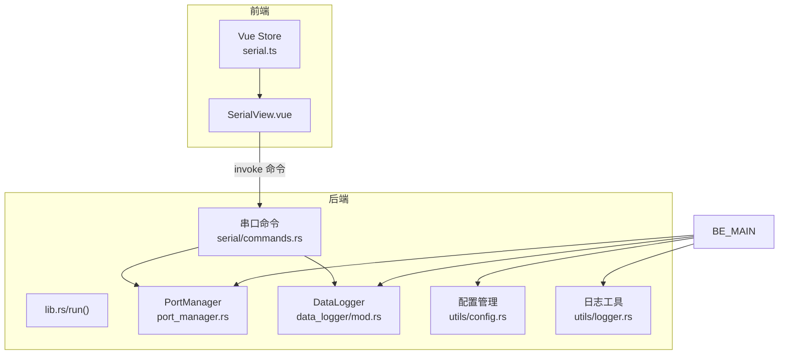
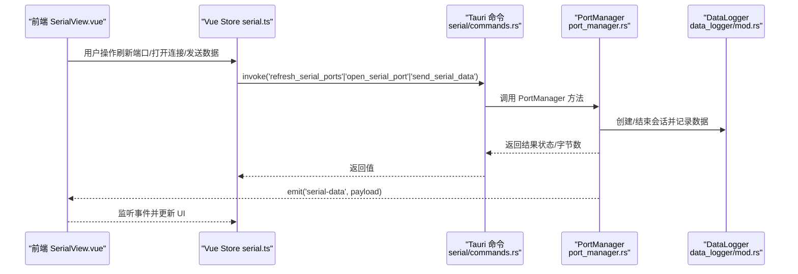
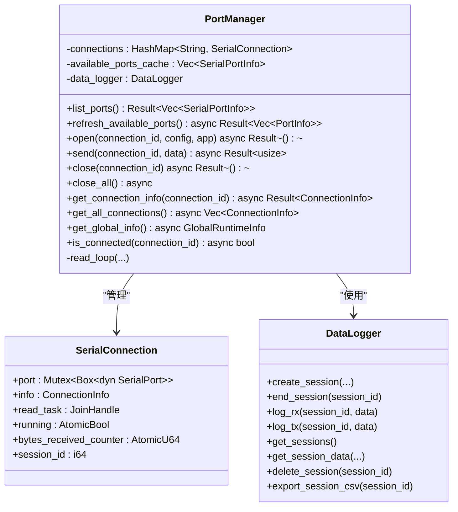
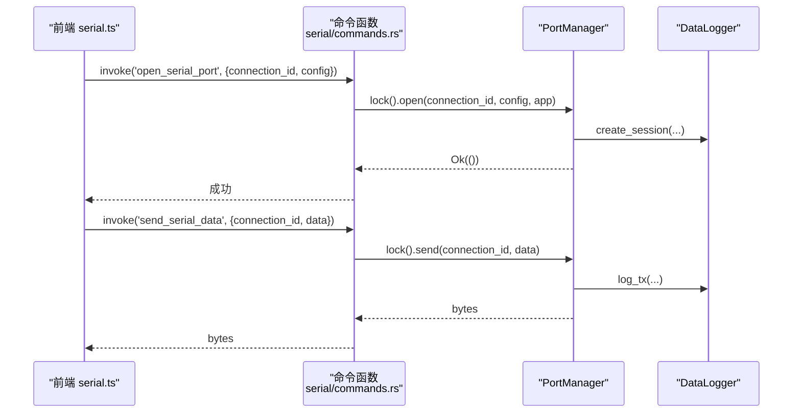
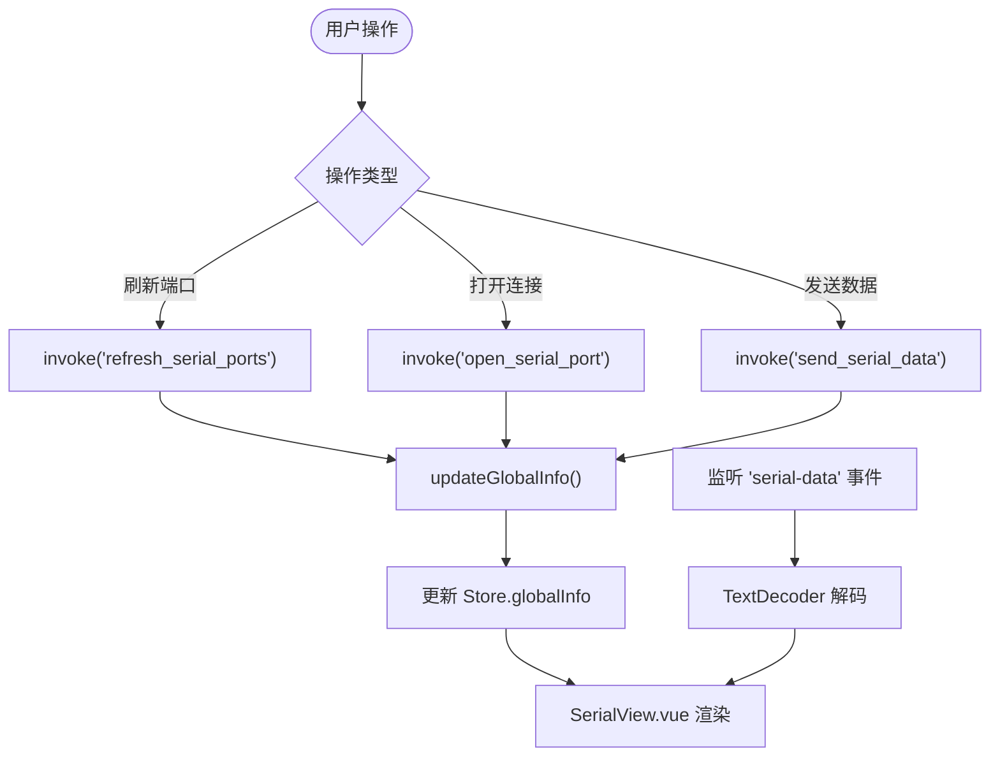
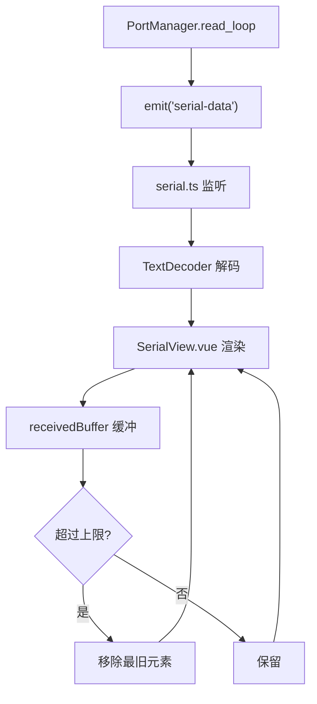
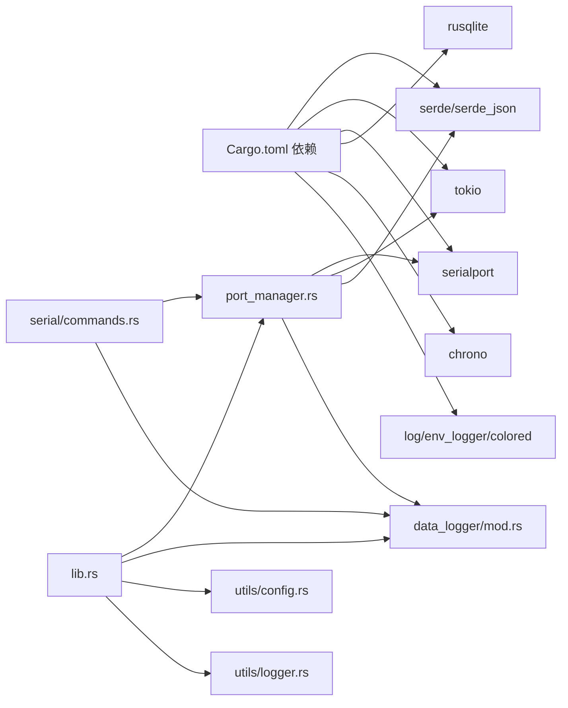

# 串口通信模块

<cite>
**本文档引用的文件**
- [src-tauri/src/serial/mod.rs](file://src-tauri/src/serial/mod.rs)
- [src-tauri/src/serial/port_manager.rs](file://src-tauri/src/serial/port_manager.rs)
- [src-tauri/src/serial/commands.rs](file://src-tauri/src/serial/commands.rs)
- [src-tauri/src/serial/data_process.rs](file://src-tauri/src/serial/data_process.rs)
- [src-tauri/src/serial/protocol.rs](file://src-tauri/src/serial/protocol.rs)
- [src-tauri/src/lib.rs](file://src-tauri/src/lib.rs)
- [src-tauri/src/main.rs](file://src-tauri/src/main.rs)
- [src-tauri/src/data_logger/mod.rs](file://src-tauri/src/data_logger/mod.rs)
- [src-tauri/src/data_logger/commands.rs](file://src-tauri/src/data_logger/commands.rs)
- [src-tauri/src/utils/logger.rs](file://src-tauri/src/utils/logger.rs)
- [src-tauri/src/utils/config.rs](file://src-tauri/src/utils/config.rs)
- [src-tauri/Cargo.toml](file://src-tauri/Cargo.toml)
- [src/stores/serial.ts](file://src/stores/serial.ts)
- [src/views/SerialView.vue](file://src/views/SerialView.vue)
- [DESIGN.md](file://DESIGN.md)
- [README.md](file://README.md)
</cite>

## 目录
1. [简介](#简介)
2. [项目结构](#项目结构)
3. [核心组件](#核心组件)
4. [架构总览](#架构总览)
5. [详细组件分析](#详细组件分析)
6. [依赖关系分析](#依赖关系分析)
7. [性能考量](#性能考量)
8. [故障排除指南](#故障排除指南)
9. [结论](#结论)
10. [附录](#附录)

## 简介
本文件针对 KonSerial 的串口通信模块进行全面技术文档化，重点涵盖：
- 串口管理器的设计架构与多连接支持机制
- 并发处理策略（Tokio 异步运行时、互斥锁与原子计数）
- 串口设备发现、连接建立、数据读写与连接状态管理
- 数据处理管道设计（缓冲区管理、格式转换与协议解析）
- Tauri 命令系统中的串口相关实现（端口列表获取、连接控制、数据发送）
- 串口参数配置、错误处理机制与性能优化策略
- 串口通信流程图与数据处理示例

## 项目结构
KonSerial 采用前后端分离架构，后端使用 Rust + Tauri，前端使用 Vue3 + TypeScript。串口模块位于后端的 `src-tauri/src/serial/` 目录，前端状态管理与视图位于 `src/stores/serial.ts` 与 `src/views/SerialView.vue`。

**图表来源**
- [src-tauri/src/lib.rs:24-84](file://src-tauri/src/lib.rs#L24-L84)
- [src-tauri/src/serial/port_manager.rs:159-401](file://src-tauri/src/serial/port_manager.rs#L159-L401)
- [src-tauri/src/serial/commands.rs:1-129](file://src-tauri/src/serial/commands.rs#L1-L129)
- [src-tauri/src/data_logger/mod.rs:47-273](file://src-tauri/src/data_logger/mod.rs#L47-L273)
- [src-tauri/src/utils/config.rs:65-176](file://src-tauri/src/utils/config.rs#L65-L176)
- [src-tauri/src/utils/logger.rs:41-132](file://src-tauri/src/utils/logger.rs#L41-L132)

**章节来源**
- [src-tauri/src/lib.rs:24-84](file://src-tauri/src/lib.rs#L24-L84)
- [src/stores/serial.ts:1-363](file://src/stores/serial.ts#L1-L363)
- [src/views/SerialView.vue:1-746](file://src/views/SerialView.vue#L1-L746)

## 核心组件
- 串口管理器（PortManager）：负责多连接生命周期管理、设备发现、连接状态维护、数据读写与错误处理。
- 数据记录器（DataLogger）：基于 SQLite 的会话与数据持久化，支持会话统计、数据查询与导出。
- Tauri 串口命令：提供前端调用的命令接口，包括端口枚举、连接控制、状态查询与数据发送。
- 前端状态与视图：Vue Store 管理连接状态、缓冲区与 UI 行为；SerialView.vue 提供串口配置、终端显示与发送功能。

**章节来源**
- [src-tauri/src/serial/port_manager.rs:159-401](file://src-tauri/src/serial/port_manager.rs#L159-L401)
- [src-tauri/src/data_logger/mod.rs:47-273](file://src-tauri/src/data_logger/mod.rs#L47-L273)
- [src-tauri/src/serial/commands.rs:1-129](file://src-tauri/src/serial/commands.rs#L1-L129)
- [src/stores/serial.ts:1-363](file://src/stores/serial.ts#L1-L363)

## 架构总览
后端通过 Tauri Builder 注册全局状态（PortManager、DataLogger），并在命令处理中暴露串口相关 API。前端通过 invoke 调用命令，监听后端推送的串口数据事件，实现双向通信与状态同步。

**图表来源**
- [src-tauri/src/serial/commands.rs:40-129](file://src-tauri/src/serial/commands.rs#L40-L129)
- [src-tauri/src/serial/port_manager.rs:182-392](file://src-tauri/src/serial/port_manager.rs#L182-L392)
- [src-tauri/src/data_logger/mod.rs:115-164](file://src-tauri/src/data_logger/mod.rs#L115-L164)
- [src/stores/serial.ts:297-342](file://src/stores/serial.ts#L297-L342)

## 详细组件分析

### 串口管理器（PortManager）
- 多连接支持：使用 HashMap 存储连接，键为 connection_id，值为 SerialConnection，包含串口句柄、运行状态、读取任务与计数器。
- 设备发现：通过 available_ports 枚举系统可用串口，并缓存为详细 PortInfo。
- 连接建立：将前端传入的 SerialPortConfig 转换为 serialport::SerialPortBuilder，打开串口并启动独立线程的读取循环。
- 数据读写：读取循环以固定超时读取，将原始字节推送给前端并持久化；发送接口对 TX 数据进行持久化。
- 状态管理：维护每个连接的 bytes_received/bytes_sent 计数与 last_error；提供 get_all_connections/get_global_info 查询。
- 并发策略：Tokio spawn_blocking 执行阻塞读取；Arc<AtomicBool> 控制读取循环；Arc<AtomicU64> 原子计数；Mutex/RwLock 保护共享状态。

**图表来源**
- [src-tauri/src/serial/port_manager.rs:159-401](file://src-tauri/src/serial/port_manager.rs#L159-L401)
- [src-tauri/src/data_logger/mod.rs:47-273](file://src-tauri/src/data_logger/mod.rs#L47-L273)

**章节来源**
- [src-tauri/src/serial/port_manager.rs:159-401](file://src-tauri/src/serial/port_manager.rs#L159-L401)

### Tauri 串口命令系统
- 端口列表：list_serial_ports（仅名称）、get_serial_ports_info（含类型）、refresh_serial_ports（返回详细信息）。
- 连接控制：open_serial_port、close_serial_port、close_all_serial_ports、is_serial_connected。
- 状态查询：get_connection_info、get_all_connections、get_global_runtime_info。
- 数据发送：send_serial_data，返回发送字节数。
- 命令注册：在 lib.rs 中通过 generate_handler 注册，注入全局状态（Arc<Mutex<PortManager>>、Arc<DataLogger>）。

**图表来源**
- [src-tauri/src/serial/commands.rs:15-129](file://src-tauri/src/serial/commands.rs#L15-L129)
- [src-tauri/src/serial/port_manager.rs:196-392](file://src-tauri/src/serial/port_manager.rs#L196-L392)
- [src-tauri/src/data_logger/mod.rs:115-164](file://src-tauri/src/data_logger/mod.rs#L115-L164)

**章节来源**
- [src-tauri/src/serial/commands.rs:1-129](file://src-tauri/src/serial/commands.rs#L1-L129)
- [src-tauri/src/lib.rs:56-81](file://src-tauri/src/lib.rs#L56-L81)

### 前端状态与视图（Vue Store 与 SerialView）
- Store 职责：生成 connection_id、刷新端口、打开/关闭连接、发送数据、监听 serial-data 事件、维护全局信息与接收缓冲区。
- 视图职责：提供串口配置面板、终端显示、发送区域、统计信息与自动滚动。
- 事件监听：startSerialDataListener 注册监听后端推送的原始字节，交由组件自行解码显示。

**图表来源**
- [src/stores/serial.ts:145-342](file://src/stores/serial.ts#L145-L342)
- [src/views/SerialView.vue:140-254](file://src/views/SerialView.vue#L140-L254)

**章节来源**
- [src/stores/serial.ts:1-363](file://src/stores/serial.ts#L1-L363)
- [src/views/SerialView.vue:1-746](file://src/views/SerialView.vue#L1-L746)

### 数据处理管道与缓冲区管理
- 原始数据流：后端 read_loop 读取固定大小缓冲区，推送原始字节给前端；前端接收后按所选编码解码显示。
- 缓冲区管理：前端 Store 维护 receivedBuffer，限制最大长度并支持清空；视图渲染时自动滚动至底部。
- 数据持久化：DataLogger 在会话期间记录 TX/RX 数据，支持查询、导出与删除。

**图表来源**
- [src-tauri/src/serial/port_manager.rs:274-303](file://src-tauri/src/serial/port_manager.rs#L274-L303)
- [src/stores/serial.ts:96-117](file://src/stores/serial.ts#L96-L117)
- [src/views/SerialView.vue:207-228](file://src/views/SerialView.vue#L207-L228)

**章节来源**
- [src-tauri/src/data_logger/mod.rs:115-164](file://src-tauri/src/data_logger/mod.rs#L115-L164)
- [src/stores/serial.ts:96-117](file://src/stores/serial.ts#L96-L117)

### 错误处理机制
- 打开端口失败：返回错误字符串并记录日志；连接状态设置为 Error。
- 发送失败：捕获 IO 错误，更新状态与 last_error。
- 读取超时：忽略 TimedOut 错误，持续循环。
- 日志宏：统一使用 log_info/log_warn/log_error 输出时间、位置与级别。

**章节来源**
- [src-tauri/src/serial/port_manager.rs:266-302](file://src-tauri/src/serial/port_manager.rs#L266-L302)
- [src-tauri/src/utils/logger.rs:41-132](file://src-tauri/src/utils/logger.rs#L41-L132)

## 依赖关系分析
后端依赖关系清晰：PortManager 依赖 serialport、tokio、serde；DataLogger 依赖 rusqlite；命令模块依赖 PortManager 与 DataLogger；前端通过 Tauri API 与后端交互。

**图表来源**
- [src-tauri/Cargo.toml:20-37](file://src-tauri/Cargo.toml#L20-L37)
- [src-tauri/src/serial/port_manager.rs:1-12](file://src-tauri/src/serial/port_manager.rs#L1-L12)
- [src-tauri/src/data_logger/mod.rs:6-9](file://src-tauri/src/data_logger/mod.rs#L6-L9)
- [src-tauri/src/lib.rs:1-16](file://src-tauri/src/lib.rs#L1-L16)

**章节来源**
- [src-tauri/Cargo.toml:20-37](file://src-tauri/Cargo.toml#L20-L37)
- [src-tauri/src/lib.rs:10-56](file://src-tauri/src/lib.rs#L10-L56)

## 性能考量
- 异步读取：使用 spawn_blocking 执行阻塞读取，避免阻塞 Tokio 主运行时；读取循环设置短超时以快速响应关闭信号。
- 原子计数：使用 AtomicU64 增量计数 bytes_received，减少锁竞争。
- 缓冲区大小：后端读取缓冲区大小适中，前端接收缓冲区可配置上限并自动裁剪。
- 数据库优化：SQLite 启用 WAL 模式与外键约束，索引按会话与时间排序优化查询。
- 前端渲染：视图自动滚动与缓冲区裁剪降低 DOM 压力。

[本节为通用性能指导，不直接分析特定文件]

## 故障排除指南
- 无法打开串口：检查端口名称、权限与占用情况；查看 last_error 与日志输出。
- 无数据接收：确认波特率、数据位、停止位、校验位配置一致；检查 read_loop 是否正常运行。
- 发送失败：检查连接状态与错误信息；确认串口未被其他进程占用。
- 数据丢失：调整前端缓冲区上限与后端读取超时；关注长时间运行后的内存增长。

**章节来源**
- [src-tauri/src/serial/port_manager.rs:333-344](file://src-tauri/src/serial/port_manager.rs#L333-L344)
- [src-tauri/src/utils/logger.rs:85-132](file://src-tauri/src/utils/logger.rs#L85-L132)

## 结论
KonSerial 的串口通信模块通过清晰的前后端分工、完善的并发模型与健壮的错误处理，实现了多连接、高性能与易用性的平衡。PortManager 作为核心控制器，配合 DataLogger 的持久化能力与 Tauri 命令系统，为上层 UI 提供了稳定可靠的串口服务。

[本节为总结性内容，不直接分析特定文件]

## 附录

### 串口参数配置
- 端口名称、波特率、数据位、停止位、校验位、流控制、超时。
- 前端通过 SerialView.vue 提供直观配置界面；Store.createConfigFromApp 从应用配置生成默认参数。

**章节来源**
- [src/stores/serial.ts:126-141](file://src/stores/serial.ts#L126-L141)
- [src/views/SerialView.vue:34-134](file://src/views/SerialView.vue#L34-L134)

### 数据处理示例
- 前端发送：支持 ASCII 与十六进制两种模式，自动转换为字节数组后调用 send_serial_data。
- 后端接收：read_loop 读取原始字节，推送至前端；同时持久化到 SQLite。
- 前端显示：根据选择的编码（UTF-8/GBK）解码显示；支持 HEX/文本切换。

**章节来源**
- [src/stores/serial.ts:242-285](file://src/stores/serial.ts#L242-L285)
- [src-tauri/src/serial/port_manager.rs:274-303](file://src-tauri/src/serial/port_manager.rs#L274-L303)
- [src/views/SerialView.vue:234-248](file://src/views/SerialView.vue#L234-L248)