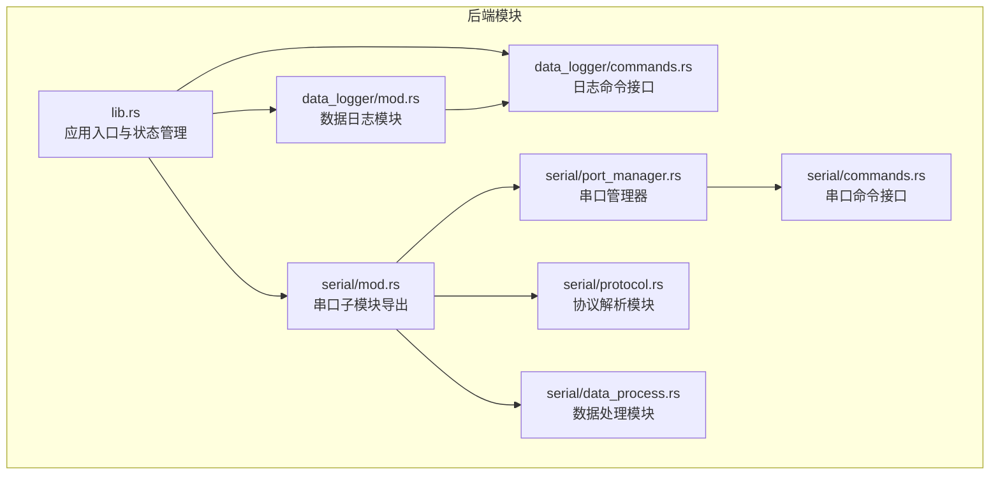
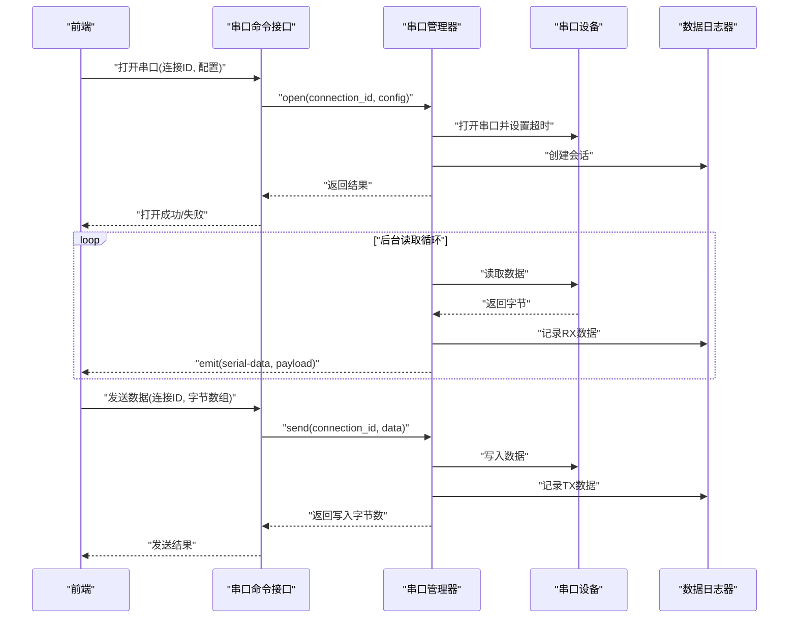
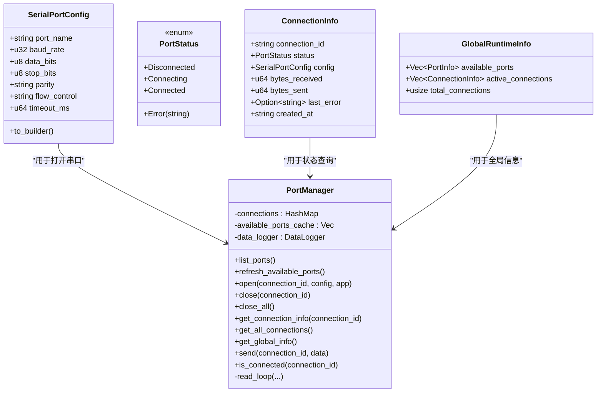
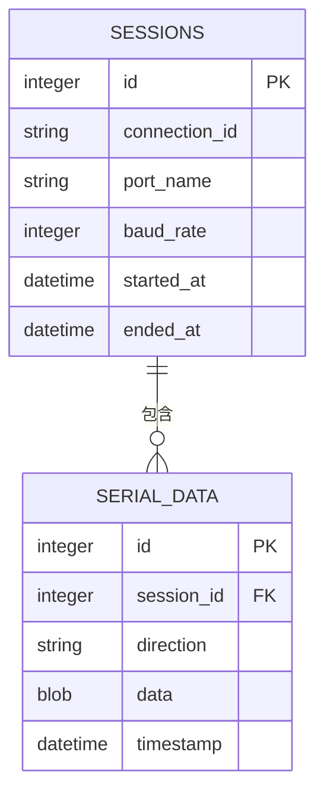
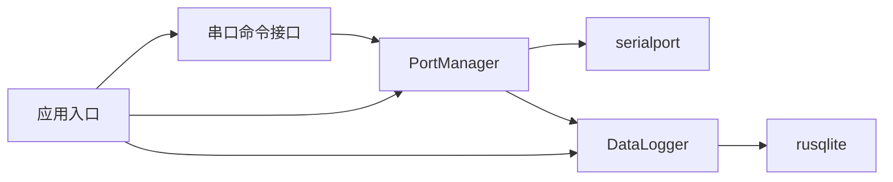
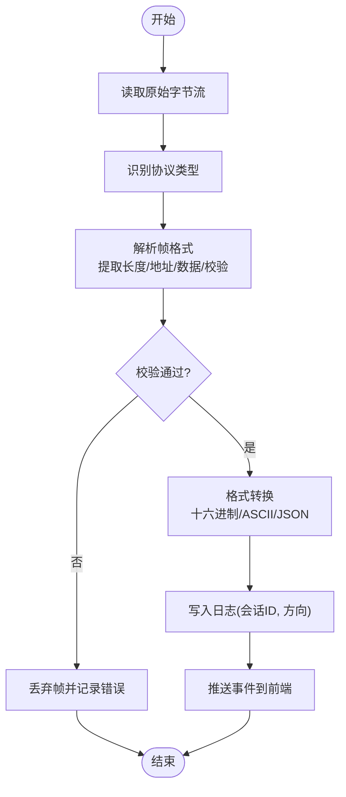

# 协议支持模块

<cite>
**本文引用的文件**
- [src-tauri/src/serial/mod.rs](file://src-tauri/src/serial/mod.rs)
- [src-tauri/src/serial/protocol.rs](file://src-tauri/src/serial/protocol.rs)
- [src-tauri/src/serial/data_process.rs](file://src-tauri/src/serial/data_process.rs)
- [src-tauri/src/serial/port_manager.rs](file://src-tauri/src/serial/port_manager.rs)
- [src-tauri/src/serial/commands.rs](file://src-tauri/src/serial/commands.rs)
- [src-tauri/src/data_logger/mod.rs](file://src-tauri/src/data_logger/mod.rs)
- [src-tauri/src/data_logger/commands.rs](file://src-tauri/src/data_logger/commands.rs)
- [src-tauri/src/lib.rs](file://src-tauri/src/lib.rs)
- [src-tauri/src/main.rs](file://src-tauri/src/main.rs)
- [DESIGN.md](file://DESIGN.md)
- [README.md](file://README.md)
</cite>

## 目录
1. [引言](#引言)
2. [项目结构](#项目结构)
3. [核心组件](#核心组件)
4. [架构总览](#架构总览)
5. [详细组件分析](#详细组件分析)
6. [依赖关系分析](#依赖关系分析)
7. [性能考量](#性能考量)
8. [故障排查指南](#故障排查指南)
9. [结论](#结论)
10. [附录](#附录)

## 引言
本文件面向“协议支持模块”，聚焦于串口通信协议的解析与封装能力，以及与之配套的协议配置管理、适配器设计、测试方法、兼容性处理与性能优化。当前代码库中，协议解析与封装位于后端 Rust 模块中的 serial 子模块，数据处理与持久化由 data_logger 模块负责，二者共同构成协议支持的基础能力。本文将从系统架构、组件关系、数据流、处理逻辑、集成点、错误处理与性能特征等方面进行深入说明，并提供流程图与类图帮助理解。

## 项目结构
后端采用 Tauri + Rust 架构，协议支持相关代码集中于 src-tauri/src/serial 目录，数据日志与持久化位于 src-tauri/src/data_logger 目录。整体组织采用“模块化 + 命令接口”的方式，通过 Tauri 命令暴露给前端使用。

**图示来源**
- [src-tauri/src/lib.rs:1-84](file://src-tauri/src/lib.rs#L1-L84)
- [src-tauri/src/serial/mod.rs:1-4](file://src-tauri/src/serial/mod.rs#L1-L4)
- [src-tauri/src/serial/port_manager.rs:1-402](file://src-tauri/src/serial/port_manager.rs#L1-L402)
- [src-tauri/src/serial/protocol.rs:1-2](file://src-tauri/src/serial/protocol.rs#L1-L2)
- [src-tauri/src/serial/data_process.rs:1-2](file://src-tauri/src/serial/data_process.rs#L1-L2)
- [src-tauri/src/serial/commands.rs:1-129](file://src-tauri/src/serial/commands.rs#L1-L129)
- [src-tauri/src/data_logger/mod.rs:1-273](file://src-tauri/src/data_logger/mod.rs#L1-L273)
- [src-tauri/src/data_logger/commands.rs:1-49](file://src-tauri/src/data_logger/commands.rs#L1-L49)

**章节来源**
- [src-tauri/src/lib.rs:1-84](file://src-tauri/src/lib.rs#L1-L84)
- [src-tauri/src/serial/mod.rs:1-4](file://src-tauri/src/serial/mod.rs#L1-L4)
- [src-tauri/src/data_logger/mod.rs:1-273](file://src-tauri/src/data_logger/mod.rs#L1-L273)

## 核心组件
- 串口管理器（PortManager）：负责串口枚举、打开/关闭、读写、状态统计与事件推送；提供全局运行时信息聚合。
- 协议解析模块（protocol.rs）：声明为“协议解析与封装模块”，当前文件仅含注释，实际解析逻辑可能在其他位置或待实现。
- 数据处理模块（data_process.rs）：声明为“数据解析、格式转换与缓冲管理”，当前文件仅含注释，实际处理逻辑可能在其他位置或待实现。
- 数据日志模块（DataLogger）：基于 SQLite 的会话与数据持久化，支持会话生命周期管理、数据写入、查询与导出。
- 串口命令接口（serial/commands.rs）：将 PortManager 与 DataLogger 的能力通过 Tauri 命令暴露给前端。
- 应用入口（lib.rs/main.rs）：初始化日志、配置、数据日志器与串口管理器，注册命令并启动应用。

**章节来源**
- [src-tauri/src/serial/port_manager.rs:162-401](file://src-tauri/src/serial/port_manager.rs#L162-L401)
- [src-tauri/src/serial/protocol.rs:1-2](file://src-tauri/src/serial/protocol.rs#L1-L2)
- [src-tauri/src/serial/data_process.rs:1-2](file://src-tauri/src/serial/data_process.rs#L1-L2)
- [src-tauri/src/data_logger/mod.rs:47-273](file://src-tauri/src/data_logger/mod.rs#L47-L273)
- [src-tauri/src/serial/commands.rs:1-129](file://src-tauri/src/serial/commands.rs#L1-L129)
- [src-tauri/src/lib.rs:24-84](file://src-tauri/src/lib.rs#L24-L84)
- [src-tauri/src/main.rs:1-7](file://src-tauri/src/main.rs#L1-L7)

## 架构总览
协议支持模块围绕“串口连接 + 数据处理 + 日志持久化 + 命令接口”展开，形成从前端到后端的闭环。前端通过 Tauri 命令发起串口操作，后端在独立线程中进行数据读取与事件推送，同时将数据持久化至 SQLite。

**图示来源**
- [src-tauri/src/serial/commands.rs:49-118](file://src-tauri/src/serial/commands.rs#L49-L118)
- [src-tauri/src/serial/port_manager.rs:196-392](file://src-tauri/src/serial/port_manager.rs#L196-L392)
- [src-tauri/src/data_logger/mod.rs:115-164](file://src-tauri/src/data_logger/mod.rs#L115-L164)

## 详细组件分析

### 串口管理器（PortManager）
- 职责
  - 枚举可用串口并缓存
  - 建立串口连接，设置超时与参数
  - 后台读取循环，推送数据事件并持久化
  - 统计收发字节、错误状态与会话生命周期
  - 提供查询与关闭连接的能力
- 关键数据结构
  - SerialPortConfig：串口参数（波特率、数据位、停止位、校验位、流控制、超时）
  - ConnectionInfo：连接运行时信息（状态、计数器、错误、创建时间）
  - GlobalRuntimeInfo：全局状态聚合（可用端口、活跃连接、总数）
- 错误处理
  - 打开串口失败、写入失败均记录错误并更新状态
  - 读取超时被忽略，保证循环可退出
- 性能特征
  - 读取循环使用固定短超时，避免阻塞
  - 使用原子计数器减少锁竞争
  - 通过 Tokio 任务与互斥锁管理并发

**图示来源**
- [src-tauri/src/serial/port_manager.rs:17-124](file://src-tauri/src/serial/port_manager.rs#L17-L124)
- [src-tauri/src/serial/port_manager.rs:162-401](file://src-tauri/src/serial/port_manager.rs#L162-L401)

**章节来源**
- [src-tauri/src/serial/port_manager.rs:17-124](file://src-tauri/src/serial/port_manager.rs#L17-L124)
- [src-tauri/src/serial/port_manager.rs:162-401](file://src-tauri/src/serial/port_manager.rs#L162-L401)

### 协议解析模块（protocol.rs）
- 当前状态：该模块仅包含注释，未见具体协议解析实现。
- 建议设计方向
  - 抽象协议接口：定义统一的解析/封装接口，便于扩展 Modbus、CAN、自定义协议等
  - 帧格式定义：为每种协议定义帧头、长度、负载、校验字段
  - 校验与错误检测：CRC、校验和、帧边界检测
  - 配置参数：超时、重试、最大帧长、对齐方式
  - 插件化扩展：通过工厂模式或注册表支持动态加载新协议

**章节来源**
- [src-tauri/src/serial/protocol.rs:1-2](file://src-tauri/src/serial/protocol.rs#L1-L2)

### 数据处理模块（data_process.rs）
- 当前状态：该模块仅包含注释，未见具体数据处理实现。
- 建议设计方向
  - 解析与格式转换：将原始字节流转换为协议帧对象
  - 缓冲管理：环形缓冲、滑动窗口、丢帧处理
  - 多协议适配：根据协议类型选择解析器
  - 输出格式：十六进制、ASCII、JSON、可视化数据

**章节来源**
- [src-tauri/src/serial/data_process.rs:1-2](file://src-tauri/src/serial/data_process.rs#L1-L2)

### 数据日志模块（DataLogger）
- 职责
  - 会话管理：创建/结束会话，关联连接ID、端口名、波特率
  - 数据持久化：记录 RX/TX 数据，带时间戳
  - 查询与导出：按会话查询数据，支持 CSV 导出
- 表结构
  - sessions：会话元数据
  - serial_data：数据记录（方向、数据、时间戳）
- 性能优化
  - WAL 模式 + 外键约束
  - 索引优化查询
  - 分页查询 limit/offset

**图示来源**
- [src-tauri/src/data_logger/mod.rs:84-106](file://src-tauri/src/data_logger/mod.rs#L84-L106)

**章节来源**
- [src-tauri/src/data_logger/mod.rs:47-273](file://src-tauri/src/data_logger/mod.rs#L47-L273)

### 串口命令接口（serial/commands.rs）
- 提供的命令
  - 列出串口、刷新串口列表、获取串口信息
  - 打开/关闭串口、关闭全部串口
  - 获取连接信息、全局运行时信息
  - 发送数据、检查连接状态
- 与 PortManager 的交互
  - 通过 State 获取 PortManager 实例
  - 调用相应方法并返回结果

**章节来源**
- [src-tauri/src/serial/commands.rs:1-129](file://src-tauri/src/serial/commands.rs#L1-L129)

### 应用入口（lib.rs/main.rs）
- 初始化顺序
  - 日志初始化
  - 配置初始化（跨平台路径）
  - 数据日志器初始化（SQLite）
  - 串口管理器初始化（注入 DataLogger）
  - 注册命令（串口、日志、配置）
- 全局状态
  - PortManager 与 DataLogger 作为全局状态注入，供命令使用

**章节来源**
- [src-tauri/src/lib.rs:24-84](file://src-tauri/src/lib.rs#L24-L84)
- [src-tauri/src/main.rs:1-7](file://src-tauri/src/main.rs#L1-L7)

## 依赖关系分析
- 模块耦合
  - PortManager 依赖 serialport 库与 DataLogger
  - DataLogger 依赖 rusqlite 与系统配置路径
  - 串口命令接口依赖 PortManager
  - 应用入口依赖各模块并注册命令
- 外部依赖
  - serialport：串口底层通信
  - tokio：异步运行时
  - serde：序列化
  - tauri：命令桥接与状态管理

**图示来源**
- [src-tauri/src/serial/port_manager.rs:2-12](file://src-tauri/src/serial/port_manager.rs#L2-L12)
- [src-tauri/src/data_logger/mod.rs:6-9](file://src-tauri/src/data_logger/mod.rs#L6-L9)
- [src-tauri/src/lib.rs:10-15](file://src-tauri/src/lib.rs#L10-L15)

**章节来源**
- [src-tauri/src/serial/port_manager.rs:2-12](file://src-tauri/src/serial/port_manager.rs#L2-L12)
- [src-tauri/src/data_logger/mod.rs:6-9](file://src-tauri/src/data_logger/mod.rs#L6-L9)
- [src-tauri/src/lib.rs:10-15](file://src-tauri/src/lib.rs#L10-L15)

## 性能考量
- 异步与并发
  - 读取循环在独立线程中运行，避免阻塞主线程
  - 使用原子计数器与互斥锁降低锁竞争
- I/O 与缓冲
  - 固定大小缓冲区（如 1024 字节）平衡吞吐与内存
  - 读取超时设置为短时（100ms），确保及时响应关闭
- 数据持久化
  - SQLite WAL 模式提升写入性能
  - 索引优化按会话查询
- 前后端解耦
  - 通过事件推送数据，避免前端阻塞

**章节来源**
- [src-tauri/src/serial/port_manager.rs:274-303](file://src-tauri/src/serial/port_manager.rs#L274-L303)
- [src-tauri/src/data_logger/mod.rs:76-106](file://src-tauri/src/data_logger/mod.rs#L76-L106)

## 故障排查指南
- 串口打开失败
  - 检查端口名称与权限
  - 查看错误状态与 last_error 字段
- 读取异常
  - 观察 PortStatus 是否进入 Error
  - 确认超时设置与硬件连接
- 写入失败
  - 检查连接状态与错误信息
  - 确认流控制与波特率匹配
- 数据缺失或乱码
  - 校验串口参数（波特率、数据位、停止位、校验位）
  - 检查缓冲与解析逻辑
- 日志查询异常
  - 确认会话 ID 与索引
  - 检查 limit/offset 参数

**章节来源**
- [src-tauri/src/serial/port_manager.rs:333-392](file://src-tauri/src/serial/port_manager.rs#L333-L392)
- [src-tauri/src/data_logger/mod.rs:168-244](file://src-tauri/src/data_logger/mod.rs#L168-L244)

## 结论
当前代码库已具备完善的串口连接管理与数据持久化能力，协议解析与封装模块尚处于预留阶段。建议在 protocol.rs 与 data_process.rs 中引入协议抽象层与插件化扩展机制，结合现有 PortManager 与 DataLogger，形成“协议适配器 + 数据处理 + 日志持久化”的完整链路。通过合理的帧格式定义、校验与错误检测、配置管理与超时重传策略，可逐步实现对 Modbus、CAN、自定义协议的支持，并在前端提供可视化与测试能力。

## 附录

### 协议解析流程（概念示意）

### 协议配置管理要点
- 参数设置
  - 波特率、数据位、停止位、校验位、流控制、超时
- 超时与重传
  - 建议基于 RTT 的指数退避重传
  - 最大重试次数与总超时上限
- 兼容性处理
  - 不同厂商/设备的帧边界差异
  - 可选的“智能探测”模式
- 测试方法
  - 单元测试：帧解析、校验、边界条件
  - 集成测试：端到端数据收发与日志一致性
  - 压力测试：高吞吐下的稳定性与丢帧率

### 协议定义示例（示意）
- Modbus RTU
  - 地址域（1字节）、功能码（1字节）、数据域（可变）、CRC（2字节）
  - 超时：基于帧间隔与波特率计算
- CAN（建议在后续扩展）
  - 标准帧/扩展帧、ID、DLC、数据域、FCS
- 自定义协议
  - 帧头标识、长度字段、负载、校验和/校验码
  - 对齐与填充规则