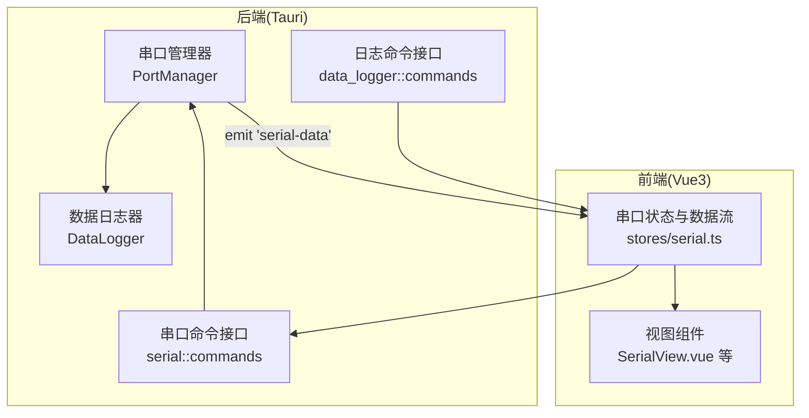
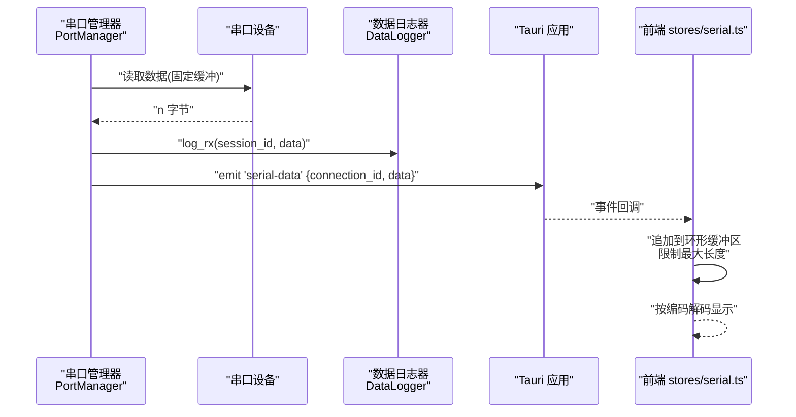
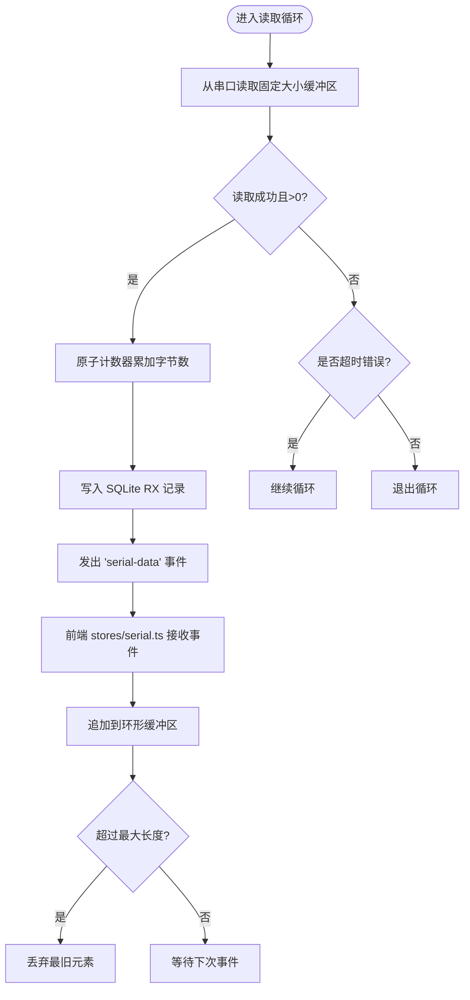
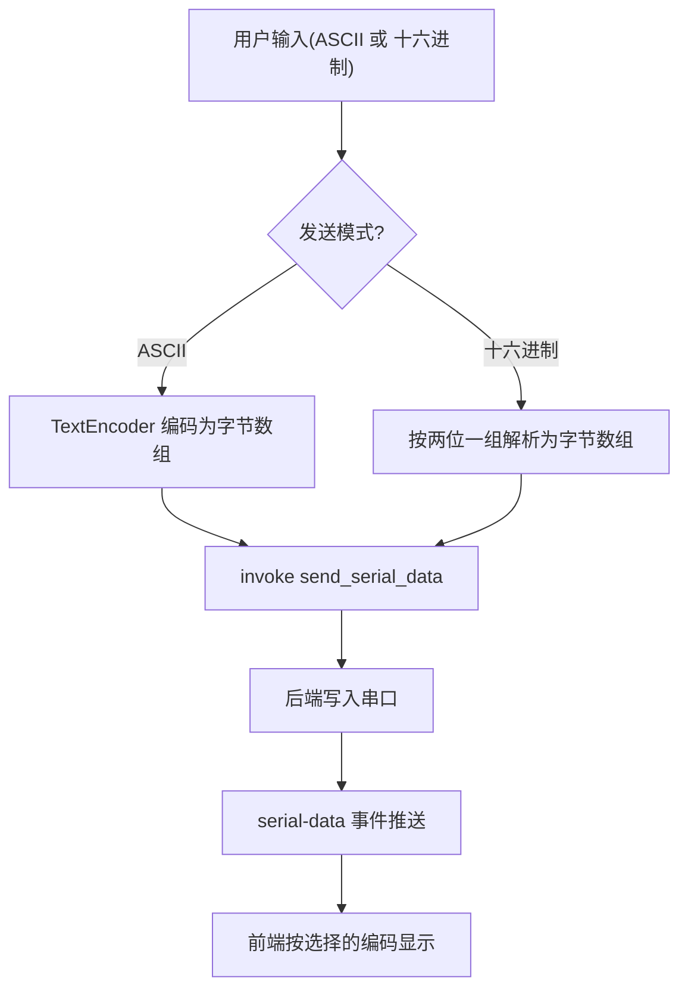
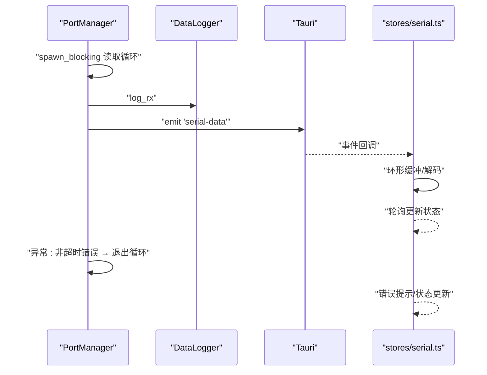
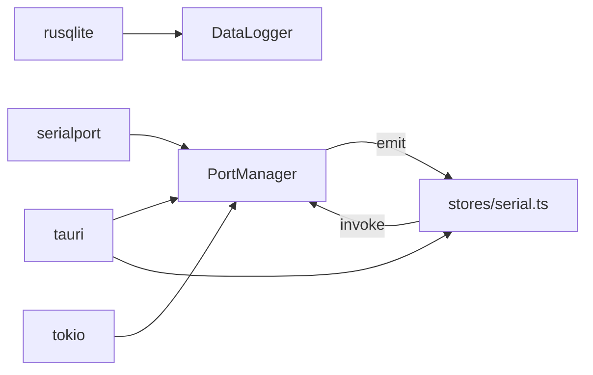

# 数据处理模块

<cite>
**本文引用的文件**
- [src-tauri/src/serial/mod.rs](file://src-tauri/src/serial/mod.rs)
- [src-tauri/src/serial/port_manager.rs](file://src-tauri/src/serial/port_manager.rs)
- [src-tauri/src/serial/commands.rs](file://src-tauri/src/serial/commands.rs)
- [src-tauri/src/data_logger/mod.rs](file://src-tauri/src/data_logger/mod.rs)
- [src-tauri/src/data_logger/commands.rs](file://src-tauri/src/data_logger/commands.rs)
- [src-tauri/src/lib.rs](file://src-tauri/src/lib.rs)
- [DESIGN.md](file://DESIGN.md)
- [src/stores/serial.ts](file://src/stores/serial.ts)
</cite>

## 目录
1. [简介](#简介)
2. [项目结构](#项目结构)
3. [核心组件](#核心组件)
4. [架构总览](#架构总览)
5. [详细组件分析](#详细组件分析)
6. [依赖关系分析](#依赖关系分析)
7. [性能考量](#性能考量)
8. [故障排查指南](#故障排查指南)
9. [结论](#结论)
10. [附录](#附录)

## 简介
本文件面向“数据处理模块”，聚焦于串口数据接收处理流程，涵盖数据缓冲、格式转换与协议解析的实现现状与扩展建议；说明数据类型支持（ASCII、十六进制、二进制）在前端的呈现与转换；阐述数据过滤与预处理机制（时间戳、清洗与标准化）在前端的实现位置；解释数据队列管理与内存优化策略（环形缓冲与背压）在前端的实现；给出数据处理管道设计、异步处理模式与错误恢复机制的建议；并提供数据处理流程图与典型数据转换示例。

## 项目结构
后端采用 Rust + Tauri 架构，串口数据处理位于后端的 serial 模块与 data_logger 模块；前端使用 Vue3 + TypeScript，通过 Tauri 命令与后端交互，并在前端完成数据的格式转换与显示。

**图表来源**
- [src-tauri/src/serial/port_manager.rs:274-303](file://src-tauri/src/serial/port_manager.rs#L274-L303)
- [src-tauri/src/serial/commands.rs:15-129](file://src-tauri/src/serial/commands.rs#L15-L129)
- [src-tauri/src/data_logger/mod.rs:144-164](file://src-tauri/src/data_logger/mod.rs#L144-L164)
- [src/stores/serial.ts:311-341](file://src/stores/serial.ts#L311-L341)

**章节来源**
- [src-tauri/src/serial/mod.rs:1-4](file://src-tauri/src/serial/mod.rs#L1-L4)
- [src-tauri/src/lib.rs:47-83](file://src-tauri/src/lib.rs#L47-L83)
- [DESIGN.md:101-139](file://DESIGN.md#L101-L139)

## 核心组件
- 串口管理器 PortManager：负责串口打开、读取循环、发送、状态统计与会话管理；在读取循环中将原始字节通过 Tauri 事件推送给前端，并持久化到 SQLite。
- 数据日志器 DataLogger：基于 SQLite 的会话与数据记录管理，提供会话创建/结束、RX/TX 写入、查询与导出能力。
- 串口命令接口 serial::commands：暴露列出串口、打开/关闭串口、发送数据、查询状态等 Tauri 命令。
- 日志命令接口 data_logger::commands：提供会话列表、会话数据查询、删除会话、导出 CSV 等命令。
- 前端 stores/serial.ts：负责事件监听、数据缓冲、格式转换（ASCII/十六进制）、显示与状态轮询；实现环形缓冲与背压策略。

**章节来源**
- [src-tauri/src/serial/port_manager.rs:162-401](file://src-tauri/src/serial/port_manager.rs#L162-L401)
- [src-tauri/src/data_logger/mod.rs:47-272](file://src-tauri/src/data_logger/mod.rs#L47-L272)
- [src-tauri/src/serial/commands.rs:15-129](file://src-tauri/src/serial/commands.rs#L15-L129)
- [src-tauri/src/data_logger/commands.rs:7-48](file://src-tauri/src/data_logger/commands.rs#L7-L48)
- [src/stores/serial.ts:1-363](file://src/stores/serial.ts#L1-L363)

## 架构总览
后端串口读取循环在独立线程中运行，每次读取固定大小缓冲区，将原始字节写入 SQLite 并通过 Tauri 事件推送至前端；前端 stores/serial.ts 接收事件，将原始字节放入环形缓冲区，按用户选择的编码（ASCII/十六进制）进行解码与显示，并限制缓冲区长度防止内存膨胀。

**图表来源**
- [src-tauri/src/serial/port_manager.rs:274-303](file://src-tauri/src/serial/port_manager.rs#L274-L303)
- [src-tauri/src/data_logger/mod.rs:144-164](file://src-tauri/src/data_logger/mod.rs#L144-L164)
- [src/stores/serial.ts:311-341](file://src/stores/serial.ts#L311-L341)

## 详细组件分析

### 串口数据接收与缓冲
- 读取循环：在独立线程中循环读取固定大小缓冲区，遇到超时忽略，其他错误退出循环；将读取到的字节切片转为 Vec<u8>，写入 SQLite 并通过事件推送。
- 事件推送：使用 Tauri 事件“serial-data”携带 connection_id 与原始字节数组，前端统一监听并处理。
- 前端缓冲：stores/serial.ts 维护全局接收缓冲数组，按时间戳追加，超过上限则丢弃最早元素，形成环形缓冲效果。

**图表来源**
- [src-tauri/src/serial/port_manager.rs:274-303](file://src-tauri/src/serial/port_manager.rs#L274-L303)
- [src-tauri/src/data_logger/mod.rs:144-164](file://src-tauri/src/data_logger/mod.rs#L144-L164)
- [src/stores/serial.ts:105-117](file://src/stores/serial.ts#L105-L117)

**章节来源**
- [src-tauri/src/serial/port_manager.rs:274-303](file://src-tauri/src/serial/port_manager.rs#L274-L303)
- [src/stores/serial.ts:96-117](file://src/stores/serial.ts#L96-L117)

### 数据类型支持与格式转换
- 前端支持的输入格式：
  - ASCII 文本：直接编码为字节数组发送。
  - 十六进制文本：按每两个字符一组解析为字节数组发送。
- 前端支持的显示格式：
  - ASCII：将原始字节解码为文本显示。
  - 十六进制：将原始字节转为十六进制字符串显示。
- 当前实现：发送侧在前端完成格式转换；接收侧在前端完成解码与显示；后端仅传输原始字节，不进行协议解析或格式转换。

**图表来源**
- [src/stores/serial.ts:242-274](file://src/stores/serial.ts#L242-L274)
- [src-tauri/src/serial/commands.rs:109-118](file://src-tauri/src/serial/commands.rs#L109-L118)

**章节来源**
- [src/stores/serial.ts:242-274](file://src/stores/serial.ts#L242-L274)

### 数据过滤与预处理机制
- 时间戳：前端在接收到事件时记录当前时间作为接收时间戳，用于后续显示与排序。
- 数据清洗与标准化：前端对 ASCII 文本进行编码，对十六进制文本进行解析与清洗；后端不做额外清洗。
- 显示标准化：前端根据用户选择的编码格式统一显示，避免混杂显示导致的误读。

**章节来源**
- [src/stores/serial.ts:105-117](file://src/stores/serial.ts#L105-L117)
- [src/stores/serial.ts:311-341](file://src/stores/serial.ts#L311-L341)

### 数据队列管理与内存优化
- 环形缓冲：前端维护接收缓冲数组，超过最大容量时丢弃最旧元素，保证内存稳定。
- 背压处理：后端读取循环在独立线程中运行，前端通过事件驱动消费；若前端处理慢，事件堆积在 UI 线程，可通过减少最大缓冲长度或降低刷新频率缓解。
- 会话持久化：后端将 RX/TX 数据写入 SQLite，前端可查询历史数据，避免仅依赖内存缓冲丢失历史。

**章节来源**
- [src-tauri/src/data_logger/mod.rs:144-164](file://src-tauri/src/data_logger/mod.rs#L144-L164)
- [src/stores/serial.ts:105-117](file://src/stores/serial.ts#L105-L117)

### 数据处理管道设计与异步处理
- 管道阶段：
  1) 串口读取 → 2) 写入 SQLite 会话 → 3) 推送 Tauri 事件 → 4) 前端事件监听 → 5) 环形缓冲与解码 → 6) 可视化/图表渲染
- 异步模式：后端使用 tokio 线程池与 spawn_blocking 运行读取循环；前端使用事件驱动与定时轮询更新状态。
- 错误恢复：串口读取遇到非超时错误即退出循环；前端监听错误事件并提示；后端在发送失败时更新连接状态与最后错误。

**图表来源**
- [src-tauri/src/serial/port_manager.rs:236-303](file://src-tauri/src/serial/port_manager.rs#L236-L303)
- [src-tauri/src/data_logger/mod.rs:144-164](file://src-tauri/src/data_logger/mod.rs#L144-L164)
- [src/stores/serial.ts:347-362](file://src/stores/serial.ts#L347-L362)

**章节来源**
- [src-tauri/src/serial/port_manager.rs:236-303](file://src-tauri/src/serial/port_manager.rs#L236-L303)
- [src/stores/serial.ts:347-362](file://src/stores/serial.ts#L347-L362)

### 协议解析模块现状与扩展建议
- 现状：协议解析模块存在但尚未实现具体协议解析逻辑，当前后端仅传输原始字节，协议解析应在前端完成。
- 建议：
  - 在前端 stores/serial.ts 中新增协议解析器，基于“serial-data”事件的原始字节进行帧校验、字段提取与结构化输出。
  - 将解析结果与原始字节分别存储，以便回溯与对比。
  - 对长帧或流式协议，可在前端实现粘包/拆包与超时重置逻辑。

**章节来源**
- [src-tauri/src/serial/protocol.rs:1-2](file://src-tauri/src/serial/protocol.rs#L1-L2)
- [src/stores/serial.ts:311-341](file://src/stores/serial.ts#L311-L341)

## 依赖关系分析
- 后端依赖：
  - serialport：串口读写与配置。
  - tokio：异步运行时与 spawn_blocking。
  - rusqlite：SQLite 数据持久化。
  - tauri：事件系统与命令接口。
- 前端依赖：
  - @tauri-apps/api：Tauri 事件监听与命令调用。
  - Vue3/Pinia：状态管理与组件化。

**图表来源**
- [src-tauri/src/serial/port_manager.rs:1-12](file://src-tauri/src/serial/port_manager.rs#L1-L12)
- [src-tauri/src/data_logger/mod.rs:6-9](file://src-tauri/src/data_logger/mod.rs#L6-L9)
- [src-tauri/src/lib.rs:47-83](file://src-tauri/src/lib.rs#L47-L83)

**章节来源**
- [src-tauri/src/serial/port_manager.rs:1-12](file://src-tauri/src/serial/port_manager.rs#L1-L12)
- [src-tauri/src/data_logger/mod.rs:6-9](file://src-tauri/src/data_logger/mod.rs#L6-L9)
- [src-tauri/src/lib.rs:47-83](file://src-tauri/src/lib.rs#L47-L83)

## 性能考量
- 后端：
  - 固定大小缓冲区与 spawn_blocking 降低锁竞争，提高吞吐。
  - SQLite 写入在单线程锁内完成，建议批量写入或异步写入以进一步提升。
- 前端：
  - 环形缓冲限制最大长度，避免内存暴涨。
  - 事件驱动解码，建议在组件层按需解码，避免重复解码。
  - 图表渲染建议采样与滑动窗口，减少 DOM 更新频率。

## 故障排查指南
- 串口打开失败：检查端口名称、权限与占用情况；查看后端日志与错误状态。
- 无数据接收：确认串口已打开、波特率与参数匹配；检查前端事件监听是否启动。
- 发送失败：查看后端发送错误状态与最后错误信息；确认连接是否存在。
- 数据乱码：检查前端编码选择（ASCII/十六进制）与后端发送编码一致性。
- 内存增长：检查前端最大缓冲长度配置与图表渲染频率。

**章节来源**
- [src-tauri/src/serial/port_manager.rs:369-392](file://src-tauri/src/serial/port_manager.rs#L369-L392)
- [src/stores/serial.ts:311-341](file://src/stores/serial.ts#L311-L341)

## 结论
当前数据处理模块以“后端只传原始字节、前端负责解码与显示”的模式实现，具备良好的扩展性与性能表现。建议在前端完善协议解析与数据清洗逻辑，在后端引入更细粒度的错误恢复与会话统计，以满足复杂场景下的数据处理需求。

## 附录

### 典型数据转换示例（路径指引）
- ASCII 文本发送：[src/stores/serial.ts:242-274](file://src/stores/serial.ts#L242-L274)
- 十六进制发送：[src/stores/serial.ts:242-274](file://src/stores/serial.ts#L242-L274)
- 接收事件监听与解码：[src/stores/serial.ts:311-341](file://src/stores/serial.ts#L311-L341)
- 串口读取循环与事件推送：[src-tauri/src/serial/port_manager.rs:274-303](file://src-tauri/src/serial/port_manager.rs#L274-L303)
- SQLite RX 写入：[src-tauri/src/data_logger/mod.rs:144-164](file://src-tauri/src/data_logger/mod.rs#L144-L164)