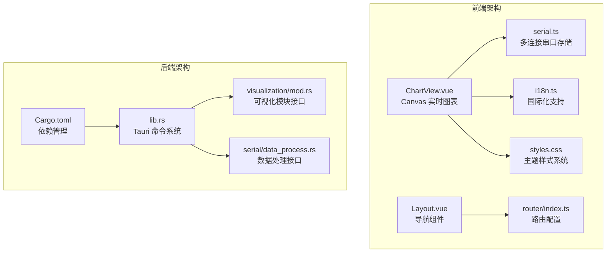
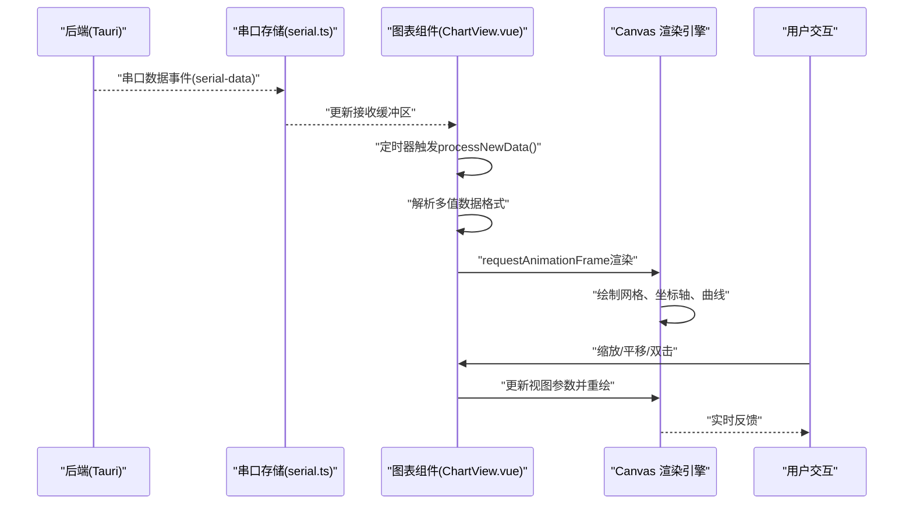
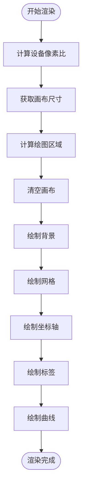
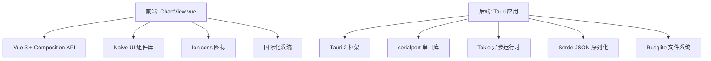

# 可视化模块

<cite>
**本文引用的文件**
- [ChartView.vue](file://src/views/ChartView.vue)
- [serial.ts](file://src/stores/serial.ts)
- [styles.css](file://src/assets/styles.css)
- [main.ts](file://src/main.ts)
- [index.ts](file://src/router/index.ts)
- [i18n.ts](file://src/stores/i18n.ts)
- [Layout.vue](file://src/components/Layout.vue)
- [mod.rs](file://src-tauri/src/visualization/mod.rs)
- [data_process.rs](file://src-tauri/src/serial/data_process.rs)
- [lib.rs](file://src-tauri/src/lib.rs)
- [Cargo.toml](file://src-tauri/Cargo.toml)
- [DESIGN.md](file://DESIGN.md)
</cite>

## 更新摘要
**变更内容**
- ChartView.vue 完全重构：从占位符实现升级为 Canvas 基础的实时交互图表系统
- 新增高级交互功能：缩放、平移、双击回到实时、多值数据解析
- 实现完整的 Canvas 渲染引擎：支持网格、坐标轴、多通道曲线绘制
- 优化数据处理流程：实时解析、缓冲区管理、性能渲染优化
- 增强用户体验：响应式设计、主题适配、导出功能完善

## 目录
1. [简介](#简介)
2. [项目结构](#项目结构)
3. [核心组件](#核心组件)
4. [架构总览](#架构总览)
5. [详细组件分析](#详细组件分析)
6. [依赖关系分析](#依赖关系分析)
7. [性能考量](#性能考量)
8. [故障排查指南](#故障排查指南)
9. [结论](#结论)
10. [附录](#附录)

## 简介
KonSerial 可视化模块现已完全重构为基于 Canvas 的实时交互图表系统。该模块提供高性能的波形图显示功能，支持多通道数据可视化、实时缩放与平移、双击回到实时模式等高级交互特性。系统采用前后端分离架构，前端负责实时渲染与用户交互，后端提供串口数据传输支持。

## 项目结构
可视化模块的核心文件包括：
- **ChartView.vue**：完全重构的 Canvas 基础图表组件，支持实时渲染与交互
- **serial.ts**：全局串口接收缓冲区管理，提供多连接架构支持
- **i18n.ts**：国际化支持，包含完整的图表界面本地化文案
- **styles.css**：CSS 变量与主题系统，支持深色/浅色主题切换
- **router/index.ts**：路由配置，将图表页面集成到应用导航
- **components/Layout.vue**：侧边栏导航，包含图表入口
- **visualization/mod.rs**：后端可视化模块预留接口
- **serial/data_process.rs**：串口数据处理模块预留

**图表来源**
- [ChartView.vue:1-1057](file://src/views/ChartView.vue#L1-L1057)
- [serial.ts:1-363](file://src/stores/serial.ts#L1-L363)
- [i18n.ts:94-293](file://src/stores/i18n.ts#L94-L293)
- [styles.css:1-60](file://src/assets/styles.css#L1-L60)
- [Layout.vue:1-121](file://src/components/Layout.vue#L1-L121)
- [index.ts:1-38](file://src/router/index.ts#L1-L38)
- [mod.rs:1-3](file://src-tauri/src/visualization/mod.rs#L1-L3)
- [data_process.rs:1-2](file://src-tauri/src/serial/data_process.rs#L1-L2)
- [lib.rs:1-84](file://src-tauri/src/lib.rs#L1-L84)
- [Cargo.toml:1-40](file://src-tauri/Cargo.toml#L1-L40)

## 核心组件

### Canvas 实时图表系统
**完全重构的图表渲染引擎**，采用原生 Canvas API 实现高性能实时渲染：

- **实时渲染循环**：使用 requestAnimationFrame 实现流畅的 60fps 渲染
- **多通道支持**：动态识别和显示多个数据通道，支持颜色区分
- **交互式缩放**：鼠标滚轮实现时间轴和 Y 轴双向缩放
- **平移功能**：鼠标拖拽实现数据浏览和探索
- **实时模式**：自动跟随最新数据，支持暂停和冻结
- **网格系统**：可配置的网格背景，辅助数据读取
- **坐标轴**：自动生成时间轴和数值轴标签

### 数据处理与解析
**增强的数据处理能力**，支持复杂的数据格式和实时解析：

- **多值数据解析**：支持 "name:v1,v2,v3" 格式，自动拆分为多个通道
- **实时缓冲区**：高效的接收缓冲区管理，支持多连接数据
- **时间窗口限制**：智能裁剪历史数据，控制内存使用
- **自动通道发现**：动态识别新通道并默认启用显示
- **数据统计**：实时计算通道统计数据（当前值、平均值、最小值、最大值）

### 用户界面与交互
**完整的用户界面系统**，提供直观的操作体验：

- **配置面板**：左侧可折叠的配置区域，包含所有显示选项
- **通道管理**：复选框组管理显示的通道列表
- **显示设置**：自动缩放、手动 Y 轴范围、网格、线宽等
- **控制按钮**：开始/暂停、清空、导出等核心功能
- **统计信息**：实时显示选中通道的关键指标
- **响应式设计**：自适应不同屏幕尺寸和分辨率

**章节来源**
- [ChartView.vue:18-58](file://src/views/ChartView.vue#L18-L58)
- [ChartView.vue:88-121](file://src/views/ChartView.vue#L88-L121)
- [ChartView.vue:142-290](file://src/views/ChartView.vue#L142-L290)
- [ChartView.vue:423-520](file://src/views/ChartView.vue#L423-L520)
- [serial.ts:96-117](file://src/stores/serial.ts#L96-L117)

## 架构总览
**现代化的前后端分离架构**，采用事件驱动的数据流：

**图表来源**
- [lib.rs:312-332](file://src-tauri/src/lib.rs#L312-L332)
- [serial.ts:297-332](file://src/stores/serial.ts#L297-L332)
- [ChartView.vue:123-140](file://src/views/ChartView.vue#L123-L140)
- [ChartView.vue:292-302](file://src/views/ChartView.vue#L292-L302)

## 详细组件分析

### Canvas 渲染引擎
**高性能的 Canvas 渲染系统**，实现完整的图表绘制：

#### 渲染流程
- **设备像素比适配**：自动检测高 DPI 屏幕，确保清晰显示
- **视口计算**：动态计算绘图区域，支持内边距和坐标轴空间
- **坐标变换**：将数据坐标转换为像素坐标
- **渐进式绘制**：只绘制可见区域内的数据点
- **抗锯齿优化**：使用合适的线宽和连接样式

#### 绘制元素
- **背景填充**：使用 CSS 变量获取主题背景色
- **网格系统**：水平 5 格 + 垂直 6 格的网格布局
- **坐标轴**：简洁的 X/Y 轴，包含刻度标签
- **时间标签**：每 10 秒显示一个时间标记
- **数值标签**：Y 轴 5 个等间距数值标签
- **曲线绘制**：多通道独立颜色，圆润连接点

**图表来源**
- [ChartView.vue:150-200](file://src/views/ChartView.vue#L150-L200)
- [ChartView.vue:202-284](file://src/views/ChartView.vue#L202-L284)

**章节来源**
- [ChartView.vue:142-290](file://src/views/ChartView.vue#L142-L290)

### 交互控制系统
**完整的用户交互系统**，支持多种操作方式：

#### 缩放控制
- **鼠标滚轮缩放**：滚轮向上放大，向下缩小
- **光标中心缩放**：以鼠标位置为中心进行缩放
- **时间轴缩放**：X 轴时间范围缩放
- **Y 轴同步缩放**：Ctrl+滚轮实现 Y 轴独立缩放
- **缩放范围限制**：0.05x 到 200x 的合理范围

#### 平移控制
- **鼠标拖拽平移**：左键拖拽实现数据浏览
- **时间轴平移**：向右拖拽查看历史数据
- **Y 轴平移**：上下拖拽调整数值范围
- **平移锁定**：自动缩放模式下禁用手动平移

#### 实时模式
- **双击回到实时**：双击图表回到最新数据
- **冻结时间**：暂停时冻结参考时间
- **自动缩放切换**：手动模式下禁用自动缩放
- **平移状态同步**：实时模式下的平移状态重置

**章节来源**
- [ChartView.vue:425-520](file://src/views/ChartView.vue#L425-L520)

### 数据处理与解析
**高效的数据处理管道**，支持复杂数据格式：

#### 多值数据解析
- **格式支持**：支持 "name:value" 和 "name:v1,v2,v3" 两种格式
- **自动拆分**：多值数据自动拆分为多个子通道
- **通道命名**：多值通道自动命名为 "name_0", "name_1" 等
- **类型转换**：自动将字符串转换为数值类型
- **错误处理**：无效数值自动跳过，不影响其他数据

#### 缓冲区管理
- **全局缓冲区**：所有连接的串口数据统一管理
- **索引跟踪**：记录已处理数据的位置，避免重复解析
- **容量限制**：最大 10000 条记录，防止内存溢出
- **自动清理**：超出容量时自动移除最旧数据

#### 时间窗口控制
- **动态窗口**：根据时间范围设置动态数据窗口
- **智能裁剪**：超出窗口的数据自动移除
- **内存优化**：控制每个通道的最大数据点数量
- **性能平衡**：平衡显示质量和内存使用

**章节来源**
- [ChartView.vue:88-121](file://src/views/ChartView.vue#L88-L121)
- [ChartView.vue:123-140](file://src/views/ChartView.vue#L123-L140)
- [serial.ts:96-117](file://src/stores/serial.ts#L96-L117)

### 用户界面系统
**现代化的用户界面设计**，提供直观的操作体验：

#### 配置面板
- **状态指示器**：实时显示采集状态和数据点数量
- **格式帮助**：可折叠的数据格式说明
- **通道选择**：复选框组管理显示的通道
- **时间范围**：滑块控制显示的时间窗口
- **显示设置**：自动缩放、网格、线宽等配置

#### 控制按钮
- **开始/暂停**：控制数据采集和渲染
- **清空**：重置所有数据和配置
- **导出**：CSV 数据导出和 PNG 图片导出
- **状态消息**：操作反馈和错误提示

#### 统计信息
- **通道统计**：显示当前值、平均值、最小值、最大值
- **实时更新**：统计数据随数据变化实时更新
- **颜色标识**：每个通道使用独立的颜色标识
- **紧凑布局**：节省空间的同时保持可读性

**章节来源**
- [ChartView.vue:548-748](file://src/views/ChartView.vue#L548-L748)
- [ChartView.vue:850-1057](file://src/views/ChartView.vue#L850-L1057)

## 依赖关系分析
**完整的依赖生态系统**，支持现代化的开发和部署：

### 前端依赖
- **Vue 3 + Composition API**：提供响应式数据绑定和组合式 API
- **Naive UI**：现代化的 UI 组件库，提供丰富的图表控件
- **图标系统**：Ionicons 图标库，支持多种界面图标
- **国际化**：完整的中英文本地化支持
- **样式系统**：CSS 变量和主题系统，支持深色/浅色切换

### 后端依赖
- **Tauri 2**：跨平台桌面应用框架
- **串口通信**：serialport 库，支持多平台串口操作
- **异步运行时**：Tokio 异步运行时，支持高性能并发
- **数据序列化**：Serde JSON 序列化，支持数据交换
- **文件系统**：Rusqlite，支持数据持久化

**图表来源**
- [main.ts:1-14](file://src/main.ts#L1-L14)
- [ChartView.vue:1-16](file://src/views/ChartView.vue#L1-L16)
- [i18n.ts:1-348](file://src/stores/i18n.ts#L1-L348)
- [styles.css:1-60](file://src/assets/styles.css#L1-L60)
- [lib.rs:56-82](file://src-tauri/src/lib.rs#L56-L82)
- [Cargo.toml:20-40](file://src-tauri/Cargo.toml#L20-L40)

**章节来源**
- [main.ts:1-14](file://src/main.ts#L1-L14)
- [ChartView.vue:1-16](file://src/views/ChartView.vue#L1-L16)
- [i18n.ts:1-348](file://src/stores/i18n.ts#L1-L348)
- [styles.css:1-60](file://src/assets/styles.css#L1-L60)
- [lib.rs:56-82](file://src-tauri/src/lib.rs#L56-L82)
- [Cargo.toml:20-40](file://src-tauri/Cargo.toml#L20-L40)

## 性能考量
**全面的性能优化策略**，确保流畅的用户体验：

### 渲染性能优化
- **requestAnimationFrame 循环**：60fps 自动渲染，避免过度重绘
- **增量更新**：只重绘变化的部分，减少不必要的绘制
- **设备像素比适配**：高 DPI 屏幕下自动优化分辨率
- **视口裁剪**：只绘制可见区域内的数据点
- **抗锯齿优化**：合理的线宽和连接样式，平衡清晰度和性能

### 内存管理
- **缓冲区限制**：最大 10000 条记录，防止内存泄漏
- **智能裁剪**：超出时间窗口的数据自动移除
- **响应式数据**：Vue 响应式系统自动管理数据更新
- **事件清理**：组件卸载时自动清理定时器和事件监听

### 数据处理优化
- **批量处理**：定时器批量处理新增数据，避免高频重绘
- **索引跟踪**：避免重复解析已处理的数据
- **类型转换缓存**：数值转换结果缓存，减少重复计算
- **内存池管理**：复用对象和数组，减少垃圾回收压力

### 用户体验优化
- **平滑动画**：CSS 过渡效果，提供流畅的界面交互
- **即时反馈**：操作立即响应，提供良好的用户体验
- **错误处理**：完善的错误处理和用户提示
- **性能监控**：实时显示数据点数量，帮助用户理解性能

## 故障排查指南
**全面的故障诊断和解决指南**：

### 常见问题诊断
- **无数据显示**
  - 检查串口连接状态和波特率设置
  - 确认数据格式符合 "name:value" 或 "name:v1,v2,v3" 格式
  - 验证通道名称是否正确，多值数据会自动拆分
  - 查看控制台是否有错误日志

- **渲染性能问题**
  - 减少显示的通道数量，建议不超过 8 个
  - 降低线宽设置，使用 1-2px 更佳
  - 增大时间范围，减少频繁的缩放操作
  - 关闭网格显示，减少绘制开销

- **交互功能异常**
  - 确认鼠标指针在图表区域内
  - 检查浏览器是否阻止了鼠标事件
  - 验证 Canvas 元素是否正确渲染
  - 重启应用尝试恢复

### 性能调优建议
- **数据采样频率**：根据实际需求调整采样频率
- **时间窗口设置**：平衡显示精度和内存使用
- **线宽优化**：在高 DPI 屏幕下使用 1px 线宽
- **缩放策略**：避免频繁的缩放操作，使用双击回到实时

### 开发者调试
- **控制台日志**：查看 Vue DevTools 中的状态变化
- **性能分析**：使用浏览器性能面板分析渲染瓶颈
- **内存监控**：监控内存使用情况，避免内存泄漏
- **事件监听**：检查定时器和事件监听器是否正确清理

**章节来源**
- [ChartView.vue:323-346](file://src/views/ChartView.vue#L323-L346)
- [ChartView.vue:360-414](file://src/views/ChartView.vue#L360-L414)
- [ChartView.vue:425-520](file://src/views/ChartView.vue#L425-L520)

## 结论
KonSerial 可视化模块已完成从占位符到专业级图表系统的重大升级。新架构提供了完整的 Canvas 渲染引擎、丰富的交互功能和优秀的性能表现。模块采用现代化的技术栈，具备良好的扩展性和维护性。

### 主要成就
- **Canvas 渲染引擎**：高性能的原生 Canvas 实现，支持实时渲染
- **交互式图表**：完整的缩放、平移、双击回到实时功能
- **多值数据支持**：灵活的数据格式解析，支持复杂应用场景
- **响应式设计**：适配不同屏幕尺寸和分辨率
- **主题系统**：深色/浅色主题自动切换

### 未来发展方向
- **图表库集成**：可选集成成熟的图表库（如 ApexCharts）
- **数据导出增强**：支持更多格式和批量导出功能
- **性能进一步优化**：针对大数据量场景的专门优化
- **移动端适配**：优化触摸交互和移动设备支持
- **插件系统**：支持自定义图表类型和扩展功能

## 附录

### 数据格式规范
**详细的数据显示格式说明**：

#### 基础格式
- **单值数据**：`channel_name:value`
  - 示例：`temperature:25.5`
  - 示例：`voltage:3.3`

#### 多值格式
- **多值数据**：`channel_name:v1,v2,v3`
  - 自动拆分为：`channel_name_0`, `channel_name_1`, `channel_name_2`
  - 示例：`imu:1.2,3.4,5.6` → 三个通道：`imu_0`, `imu_1`, `imu_2`

#### 有效数值范围
- **支持格式**：整数、小数、科学计数法
- **无效处理**：非数值字符自动跳过
- **单位支持**：支持常见的工程单位和缩写

### 性能配置指南
**优化图表性能的最佳实践**：

#### 显示设置优化
- **线宽设置**：1-2px 最佳，避免过粗影响性能
- **网格显示**：大数据量时建议关闭网格
- **通道数量**：建议不超过 8 个通道同时显示
- **时间范围**：根据数据密度合理设置时间窗口

#### 交互优化
- **缩放策略**：避免频繁缩放，使用双击回到实时
- **平移操作**：长距离平移时可暂时暂停数据采集
- **自动缩放**：大数据量时建议使用手动缩放

### 用户操作指南
**图表使用的详细步骤**：

#### 基本操作
1. **开始采集**：点击"开始"按钮启动数据采集
2. **查看数据**：图表自动显示实时波形
3. **暂停查看**：点击"暂停"按钮冻结当前视图
4. **回到实时**：双击图表或点击"回到实时"按钮

#### 高级功能
1. **缩放查看**：鼠标滚轮缩放，Ctrl+滚轮垂直缩放
2. **平移浏览**：按住鼠标左键拖拽查看历史数据
3. **通道管理**：在左侧面板选择要显示的通道
4. **导出数据**：点击"导出"按钮保存 CSV 或 PNG 文件

#### 故障排除
- **无数据显示**：检查串口连接和数据格式
- **渲染卡顿**：减少通道数量或关闭网格显示
- **交互失效**：刷新页面或重启应用
- **内存不足**：清空图表或重启应用

**章节来源**
- [ChartView.vue:88-121](file://src/views/ChartView.vue#L88-L121)
- [ChartView.vue:323-346](file://src/views/ChartView.vue#L323-L346)
- [ChartView.vue:425-520](file://src/views/ChartView.vue#L425-L520)
- [i18n.ts:94-136](file://src/stores/i18n.ts#L94-L136)