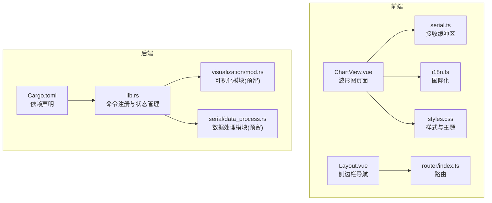
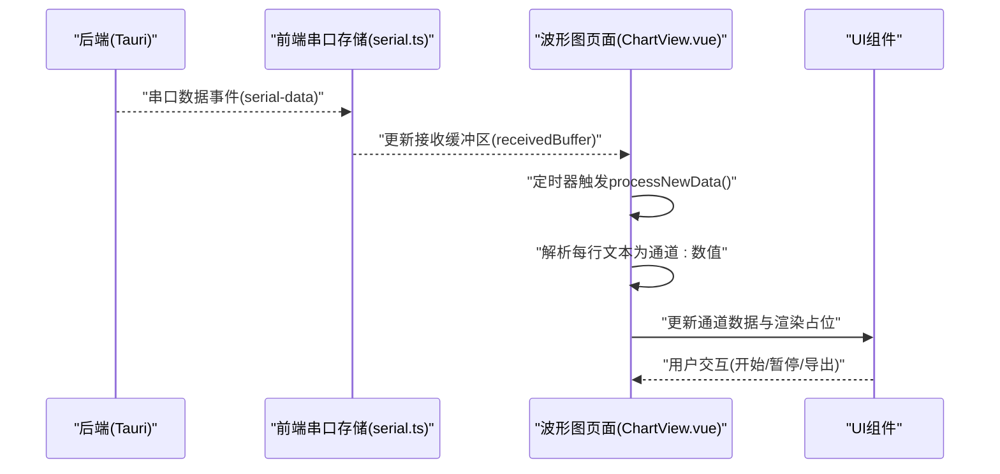
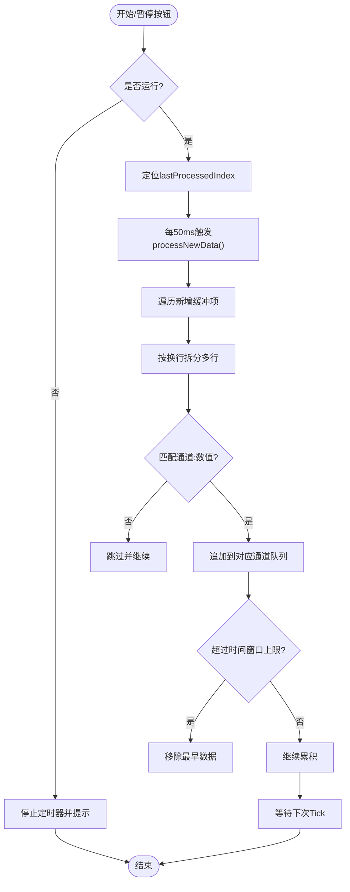
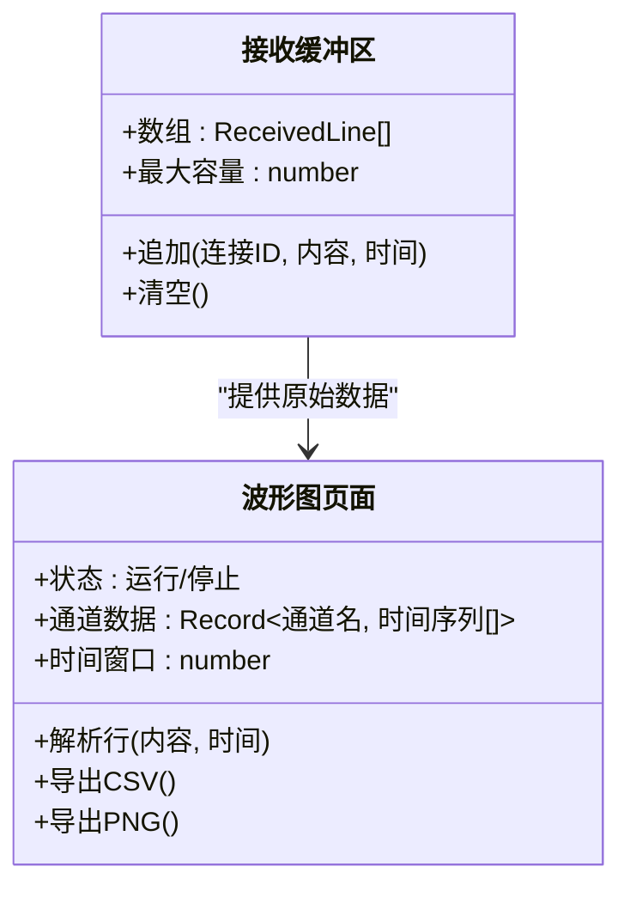
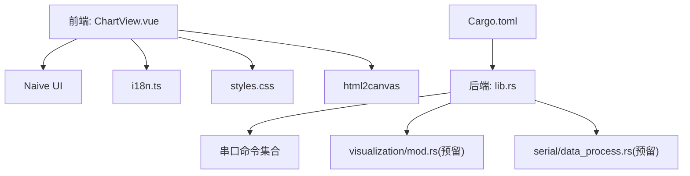

# 可视化模块

<cite>
**本文引用的文件**
- [ChartView.vue](file://src/views/ChartView.vue)
- [serial.ts](file://src/stores/serial.ts)
- [styles.css](file://src/assets/styles.css)
- [main.ts](file://src/main.ts)
- [index.ts](file://src/router/index.ts)
- [i18n.ts](file://src/stores/i18n.ts)
- [Layout.vue](file://src/components/Layout.vue)
- [mod.rs](file://src-tauri/src/visualization/mod.rs)
- [data_process.rs](file://src-tauri/src/serial/data_process.rs)
- [lib.rs](file://src-tauri/src/lib.rs)
- [Cargo.toml](file://src-tauri/Cargo.toml)
- [DESIGN.md](file://DESIGN.md)
</cite>

## 目录
1. [简介](#简介)
2. [项目结构](#项目结构)
3. [核心组件](#核心组件)
4. [架构总览](#架构总览)
5. [详细组件分析](#详细组件分析)
6. [依赖关系分析](#依赖关系分析)
7. [性能考量](#性能考量)
8. [故障排查指南](#故障排查指南)
9. [结论](#结论)
10. [附录](#附录)

## 简介
本文件聚焦 KonSerial 的可视化模块，围绕“波形图”页面的实现，系统阐述数据处理、波形渲染与实时更新机制；详解数据格式转换、图表配置与样式定制；说明实时数据流处理策略、缓冲区管理与渲染优化；并给出不同图表类型的实现思路、交互功能与响应式设计建议。最后提供性能优化、内存管理与用户体验方面的实践建议，并附带可视化示例与配置指南。

## 项目结构
可视化模块位于前端页面层，核心文件包括：
- ChartView.vue：波形图页面，负责数据解析、通道管理、配置项与渲染占位
- serial.ts：全局串口接收缓冲区与连接状态管理，为图表提供数据源
- i18n.ts：国际化文案，支撑图表界面文案
- styles.css：全局样式与主题变量，支撑图表区域的视觉风格
- router/index.ts：路由注册，将“波形图”页面纳入导航
- components/Layout.vue：侧边栏导航，包含“波形图”入口
- tauri 后端 visualization/mod.rs：预留可视化数据处理模块
- tauri 后端 serial/data_process.rs：预留数据处理模块
- DESIGN.md：设计文档中包含基于 ApexCharts 的波形图实现示例

**图表来源**
- [ChartView.vue:1-855](file://src/views/ChartView.vue#L1-L855)
- [serial.ts:1-363](file://src/stores/serial.ts#L1-L363)
- [i18n.ts:1-348](file://src/stores/i18n.ts#L1-L348)
- [styles.css:1-60](file://src/assets/styles.css#L1-L60)
- [Layout.vue:1-121](file://src/components/Layout.vue#L1-L121)
- [index.ts:1-38](file://src/router/index.ts#L1-L38)
- [mod.rs:1-3](file://src-tauri/src/visualization/mod.rs#L1-L3)
- [data_process.rs:1-2](file://src-tauri/src/serial/data_process.rs#L1-L2)
- [lib.rs:1-84](file://src-tauri/src/lib.rs#L1-L84)
- [Cargo.toml:1-40](file://src-tauri/Cargo.toml#L1-L40)

**章节来源**
- [ChartView.vue:1-855](file://src/views/ChartView.vue#L1-L855)
- [serial.ts:1-363](file://src/stores/serial.ts#L1-L363)
- [i18n.ts:1-348](file://src/stores/i18n.ts#L1-L348)
- [styles.css:1-60](file://src/assets/styles.css#L1-L60)
- [Layout.vue:1-121](file://src/components/Layout.vue#L1-L121)
- [index.ts:1-38](file://src/router/index.ts#L1-L38)
- [mod.rs:1-3](file://src-tauri/src/visualization/mod.rs#L1-L3)
- [data_process.rs:1-2](file://src-tauri/src/serial/data_process.rs#L1-L2)
- [lib.rs:1-84](file://src-tauri/src/lib.rs#L1-L84)
- [Cargo.toml:1-40](file://src-tauri/Cargo.toml#L1-L40)

## 核心组件
- 波形图页面（ChartView.vue）
  - 负责解析串口接收缓冲区中的文本行，按“通道名:数值”格式提取数据
  - 维护多通道时间序列数据，支持时间窗口限制与自动缩放
  - 提供通道选择、显示配置（网格、线宽、Y轴范围）、导出 CSV 与截图
  - 使用定时器周期性处理新增数据，实现近实时更新
- 接收缓冲区（serial.ts）
  - 全局共享的 ReceivedLine 数组，承载来自串口的原始文本与时间戳
  - 提供最大缓冲区大小限制，避免内存无限增长
- 国际化（i18n.ts）
  - 为图表页面提供中英文文案，涵盖格式说明、按钮与提示语
- 样式与主题（styles.css）
  - 定义 CSS 变量与深色/浅色主题，支撑图表容器与控件的视觉一致性
- 路由与导航（router/index.ts、Layout.vue）
  - “波形图”页面通过路由暴露，侧边栏提供入口

**章节来源**
- [ChartView.vue:1-855](file://src/views/ChartView.vue#L1-L855)
- [serial.ts:96-117](file://src/stores/serial.ts#L96-L117)
- [i18n.ts:94-136](file://src/stores/i18n.ts#L94-L136)
- [styles.css:1-60](file://src/assets/styles.css#L1-L60)
- [index.ts:17-21](file://src/router/index.ts#L17-L21)
- [Layout.vue:9-14](file://src/components/Layout.vue#L9-L14)

## 架构总览
可视化模块采用“前端解析 + 后端串口”的架构。后端负责串口读写与事件推送，前端负责数据解析、缓冲区管理与渲染。当前 ChartView.vue 中的解析与渲染为“前端占位”，后续可替换为成熟的图表库（如 ApexCharts），并与后端命令对接。

**图表来源**
- [lib.rs:312-332](file://src-tauri/src/lib.rs#L312-L332)
- [serial.ts:297-332](file://src/stores/serial.ts#L297-L332)
- [ChartView.vue:100-132](file://src/views/ChartView.vue#L100-L132)

**章节来源**
- [lib.rs:312-332](file://src-tauri/src/lib.rs#L312-L332)
- [serial.ts:297-332](file://src/stores/serial.ts#L297-L332)
- [ChartView.vue:100-132](file://src/views/ChartView.vue#L100-L132)

## 详细组件分析

### 数据处理与实时更新机制
- 数据来源
  - 来自串口事件监听，后端推送原始字节，前端将其加入全局接收缓冲区
  - ChartView.vue 通过定时器周期性扫描缓冲区尾部，逐行解析
- 解析策略
  - 行格式：通道名:数值（支持整数/小数）
  - 自动发现通道并默认勾选显示
  - 每通道维护固定长度的时间窗口，按时间范围上限限制数据点数量
- 实时更新
  - 开始采集后，每 50ms 扫描一次新增数据
  - 通过 Vue 响应式更新通道数据，驱动渲染占位

**图表来源**
- [ChartView.vue:116-132](file://src/views/ChartView.vue#L116-L132)
- [ChartView.vue:100-114](file://src/views/ChartView.vue#L100-L114)
- [ChartView.vue:71-98](file://src/views/ChartView.vue#L71-L98)

**章节来源**
- [ChartView.vue:116-132](file://src/views/ChartView.vue#L116-L132)
- [ChartView.vue:100-114](file://src/views/ChartView.vue#L100-L114)
- [ChartView.vue:71-98](file://src/views/ChartView.vue#L71-L98)

### 图表数据模型与缓冲区管理
- 数据模型
  - 通道数据结构：时间戳 + 数值
  - 多通道以字典形式组织，键为通道名
- 缓冲区管理
  - 全局接收缓冲区：按时间顺序追加，支持最大容量限制
  - 通道数据：按时间窗口上限裁剪，避免内存膨胀
- 统计与导出
  - 计算当前值与平均值，支持导出 CSV（按时间对齐）
  - 支持将图表区域截图保存为 PNG

**图表来源**
- [serial.ts:96-117](file://src/stores/serial.ts#L96-L117)
- [ChartView.vue:24-28](file://src/views/ChartView.vue#L24-L28)
- [ChartView.vue:142-177](file://src/views/ChartView.vue#L142-L177)
- [ChartView.vue:179-201](file://src/views/ChartView.vue#L179-L201)

**章节来源**
- [serial.ts:96-117](file://src/stores/serial.ts#L96-L117)
- [ChartView.vue:24-28](file://src/views/ChartView.vue#L24-L28)
- [ChartView.vue:142-177](file://src/views/ChartView.vue#L142-L177)
- [ChartView.vue:179-201](file://src/views/ChartView.vue#L179-L201)

### 图表配置与样式定制
- 配置项
  - 时间范围（秒）：决定每个通道保留的数据点数量
  - 自动缩放：启用后 Y 轴范围随数据动态变化
  - Y 轴范围：手动设定最小/最大值
  - 网格：开启网格背景辅助读数
  - 线条粗细：调节折线宽度
  - 通道选择：勾选显示的通道
- 样式与主题
  - 使用 CSS 变量定义字体、颜色与阴影
  - 支持浅色/深色主题，适配不同视觉偏好
  - 响应式布局，保证在不同屏幕尺寸下良好体验

**章节来源**
- [ChartView.vue:35-44](file://src/views/ChartView.vue#L35-L44)
- [ChartView.vue:268-309](file://src/views/ChartView.vue#L268-L309)
- [styles.css:1-60](file://src/assets/styles.css#L1-L60)

### 不同图表类型的实现思路
- 当前实现
  - 使用“占位渲染”展示 Y 轴刻度与网格，尚未接入成熟图表库
- 建议实现（基于 DESIGN.md 的 ApexCharts 示例）
  - 前端引入 ApexCharts + vue3-apexcharts
  - 将通道数据映射为 series，X 轴为时间戳，Y 轴为数值
  - 支持多通道叠加、缩放、平移、图例与工具提示
  - 通过 Tauri 命令从后端推送解析后的数值序列，减少前端解析压力

**图表来源**
- [DESIGN.md:599-720](file://DESIGN.md#L599-L720)

**章节来源**
- [DESIGN.md:599-720](file://DESIGN.md#L599-L720)

### 交互功能与响应式设计
- 交互
  - 开始/暂停：控制数据采集与解析节奏
  - 清空：重置通道数据与索引
  - 导出 CSV/PNG：离线保存数据与图像
- 响应式
  - 侧边栏导航与主内容区域自适应
  - 图表容器占满右侧区域，内部网格与占位元素自适应
  - 深色/浅色主题自动切换

**章节来源**
- [ChartView.vue:116-140](file://src/views/ChartView.vue#L116-L140)
- [ChartView.vue:179-201](file://src/views/ChartView.vue#L179-L201)
- [Layout.vue:45-121](file://src/components/Layout.vue#L45-L121)

## 依赖关系分析
- 前端依赖
  - Vue 3 + Naive UI：提供组件化与 UI 控件
  - html2canvas：用于截图导出
  - 国际化与样式：i18n.ts 与 styles.css
- 后端依赖
  - Tauri 命令：注册串口相关命令与事件
  - 可视化模块预留：visualization/mod.rs
  - 数据处理模块预留：serial/data_process.rs
  - 依赖清单：Cargo.toml

**图表来源**
- [main.ts:1-14](file://src/main.ts#L1-L14)
- [ChartView.vue:1-20](file://src/views/ChartView.vue#L1-L20)
- [i18n.ts:1-348](file://src/stores/i18n.ts#L1-L348)
- [styles.css:1-60](file://src/assets/styles.css#L1-L60)
- [lib.rs:56-82](file://src-tauri/src/lib.rs#L56-L82)
- [mod.rs:1-3](file://src-tauri/src/visualization/mod.rs#L1-L3)
- [data_process.rs:1-2](file://src-tauri/src/serial/data_process.rs#L1-L2)
- [Cargo.toml:20-40](file://src-tauri/Cargo.toml#L20-L40)

**章节来源**
- [main.ts:1-14](file://src/main.ts#L1-L14)
- [ChartView.vue:1-20](file://src/views/ChartView.vue#L1-L20)
- [i18n.ts:1-348](file://src/stores/i18n.ts#L1-L348)
- [styles.css:1-60](file://src/assets/styles.css#L1-L60)
- [lib.rs:56-82](file://src-tauri/src/lib.rs#L56-L82)
- [mod.rs:1-3](file://src-tauri/src/visualization/mod.rs#L1-L3)
- [data_process.rs:1-2](file://src-tauri/src/serial/data_process.rs#L1-L2)
- [Cargo.toml:20-40](file://src-tauri/Cargo.toml#L20-L40)

## 性能考量
- 前端解析与渲染
  - 采用定时器批量处理新增数据，避免高频重绘
  - 通道数据按时间窗口裁剪，控制内存占用
  - 使用响应式数据结构，仅更新变更部分
- 导出与截图
  - 导出 CSV 采用一次性拼接，注意大数据量时的内存峰值
  - 截图导出使用 html2canvas，建议在低分辨率或缩放后导出以降低内存
- 后端与网络
  - 串口事件推送由后端完成，前端专注解析与渲染，降低 UI 线程阻塞风险
  - 建议后续将解析逻辑迁移至后端，前端仅消费结构化数据

[本节为通用性能指导，不直接分析特定文件]

## 故障排查指南
- 无法看到数据
  - 确认已连接串口且有数据到达
  - 检查“开始”按钮是否处于运行状态
  - 查看“数据格式说明”提示，确保发送格式为“通道名:数值”
- 导出失败
  - CSV：确认存在数据点；若无数据会提示“没有数据可导出”
  - PNG：确认图表区域存在；若不存在会提示“图表区域未找到”
- 性能问题
  - 适当增大采集间隔（当前为 50ms），或减少通道数量
  - 降低时间范围或线宽，减少渲染负担
- 主题与样式异常
  - 检查 CSS 变量是否正确加载，确认深色/浅色主题切换生效

**章节来源**
- [ChartView.vue:116-140](file://src/views/ChartView.vue#L116-L140)
- [ChartView.vue:142-177](file://src/views/ChartView.vue#L142-L177)
- [ChartView.vue:179-201](file://src/views/ChartView.vue#L179-L201)
- [i18n.ts:94-136](file://src/stores/i18n.ts#L94-L136)

## 结论
可视化模块当前以“前端占位渲染”为核心，实现了稳定的实时数据采集与基本的图表配置能力。后续建议：
- 引入成熟图表库（如 ApexCharts），实现高性能渲染与丰富交互
- 将数据解析与格式转换迁移至后端，减轻前端压力
- 优化导出流程，支持增量导出与压缩
- 增强主题与无障碍支持，提升用户体验

[本节为总结性内容，不直接分析特定文件]

## 附录

### 可视化示例与配置指南
- 数据格式
  - 每行一条“通道名:数值”，支持整数与小数
  - 示例：通道 temp 的值为 25.5，应发送 temp:25.5
- 时间窗口
  - 通过“时间范围(秒)”控制每个通道保留的数据点数量
  - 建议根据采样频率与显示需求合理设置
- 显示配置
  - 自动缩放：适合波动较大的信号
  - 手动 Y 轴范围：适合需要固定阈值告警的场景
  - 网格与线宽：提升可读性与对比度
- 导出
  - CSV：按时间对齐导出多通道数据
  - PNG：将当前可视区域截图保存

**章节来源**
- [ChartView.vue:71-98](file://src/views/ChartView.vue#L71-L98)
- [ChartView.vue:106-114](file://src/views/ChartView.vue#L106-L114)
- [ChartView.vue:142-177](file://src/views/ChartView.vue#L142-L177)
- [ChartView.vue:179-201](file://src/views/ChartView.vue#L179-L201)
- [i18n.ts:94-136](file://src/stores/i18n.ts#L94-L136)