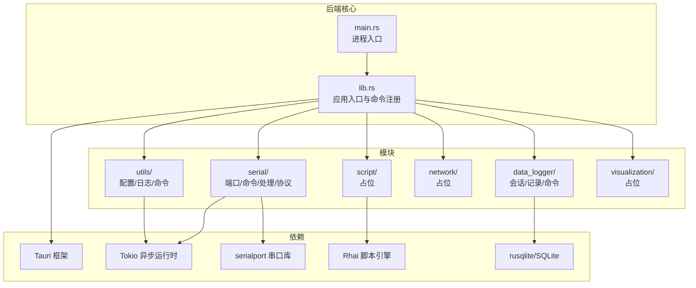
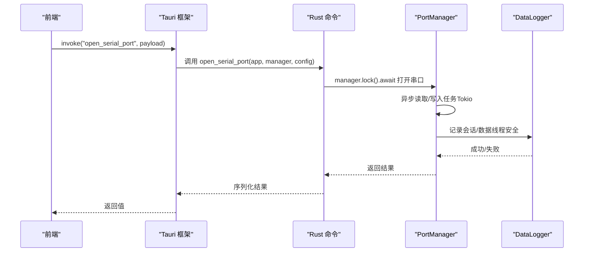
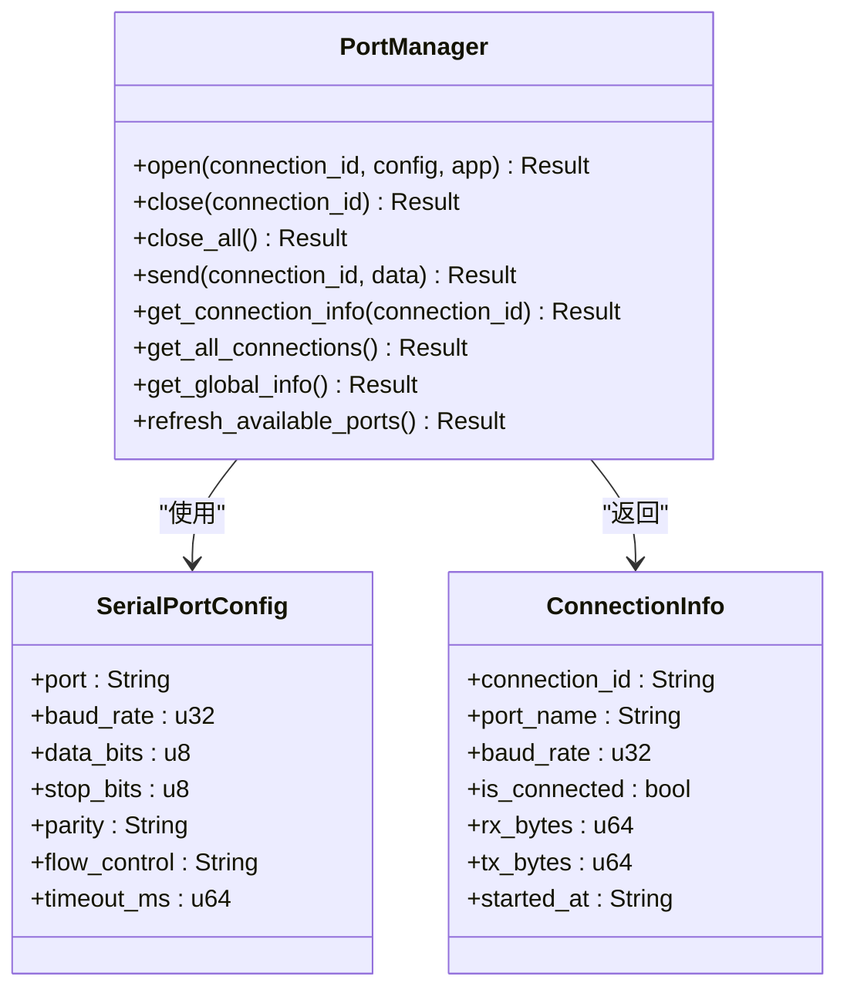
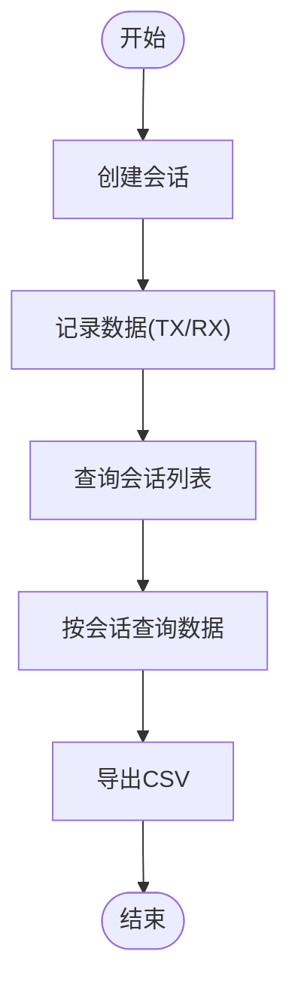
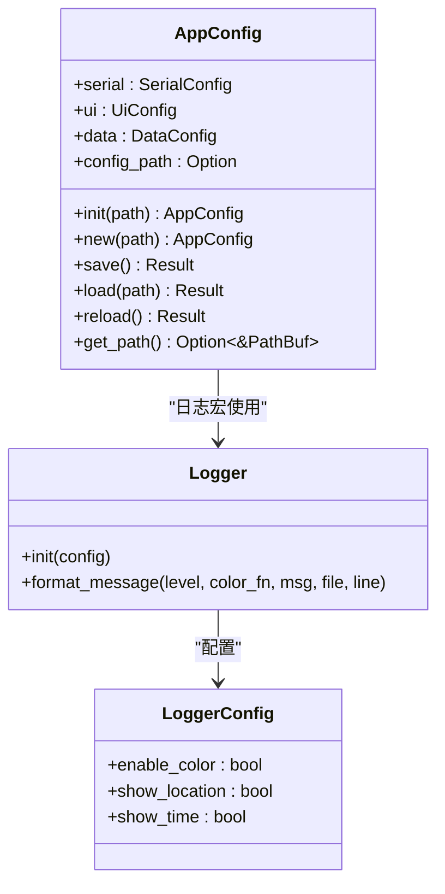
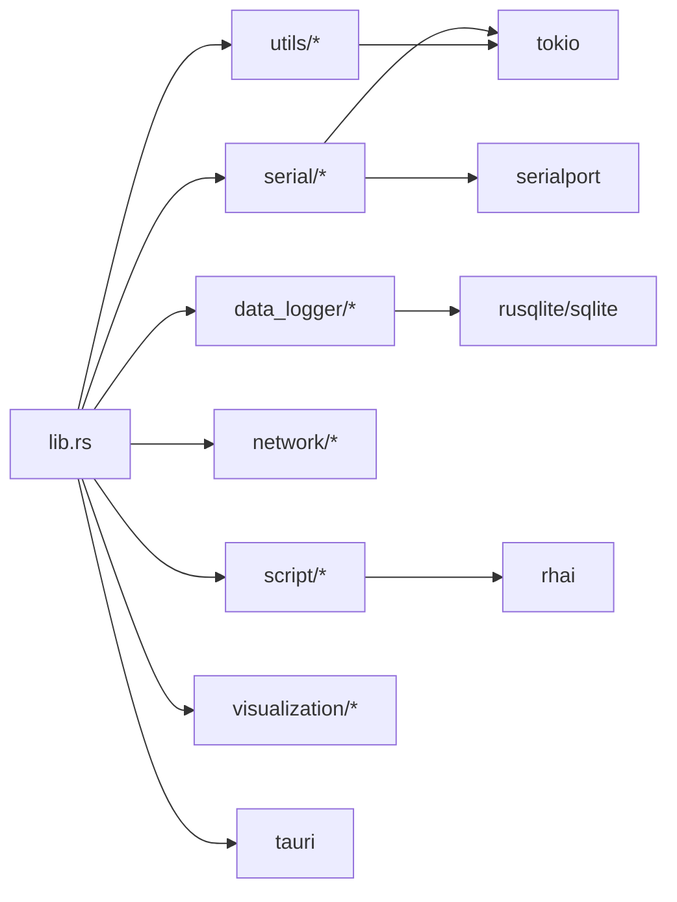

# 后端架构设计

<cite>
**本文引用的文件**
- [Cargo.toml](file://src-tauri/Cargo.toml)
- [lib.rs](file://src-tauri/src/lib.rs)
- [main.rs](file://src-tauri/src/main.rs)
- [DESIGN.md](file://DESIGN.md)
- [README.md](file://README.md)
- [utils/mod.rs](file://src-tauri/src/utils/mod.rs)
- [utils/commands.rs](file://src-tauri/src/utils/commands.rs)
- [utils/config.rs](file://src-tauri/src/utils/config.rs)
- [utils/logger.rs](file://src-tauri/src/utils/logger.rs)
- [serial/mod.rs](file://src-tauri/src/serial/mod.rs)
- [serial/commands.rs](file://src-tauri/src/serial/commands.rs)
- [data_logger/mod.rs](file://src-tauri/src/data_logger/mod.rs)
- [data_logger/commands.rs](file://src-tauri/src/data_logger/commands.rs)
</cite>

## 目录
1. [引言](#引言)
2. [项目结构](#项目结构)
3. [核心组件](#核心组件)
4. [架构总览](#架构总览)
5. [详细组件分析](#详细组件分析)
6. [依赖关系分析](#依赖关系分析)
7. [性能考量](#性能考量)
8. [故障排查指南](#故障排查指南)
9. [结论](#结论)
10. [附录](#附录)

## 引言
本文件面向 KonSerial 后端架构，聚焦基于 Rust 的模块化后端设计，涵盖核心库入口、模块组织结构、异步处理机制与并发策略；详解串口通信、数据记录、网络通信、脚本引擎与工具模块的职责边界；阐述 Tokio 异步运行时的应用、线程安全设计与并发处理策略；解释 Tauri 命令系统的实现原理、前后端通信机制与数据序列化；并提供错误处理策略、内存管理与性能优化建议，以及模块间依赖关系图与数据流向分析。

## 项目结构
KonSerial 后端位于 src-tauri 目录，采用“模块化 + 命令注册”的组织方式：
- 核心库入口：lib.rs 中集中初始化日志、配置、数据库与全局状态，并注册 Tauri 命令。
- 模块划分：
  - utils：配置管理、日志工具、通用命令。
  - serial：串口管理、命令、数据处理与协议。
  - data_logger：会话与数据记录、查询与导出。
  - network：网络通信模块（当前仅占位）。
  - script：脚本引擎模块（当前仅占位）。
  - visualization：可视化数据处理模块（当前仅占位）。
- 依赖管理：Cargo.toml 统一声明 Tauri、Tokio、serialport、rhai、rusqlite 等依赖。

**图表来源**
- [lib.rs:24-83](file://src-tauri/src/lib.rs#L24-L83)
- [main.rs:4-6](file://src-tauri/src/main.rs#L4-L6)
- [Cargo.toml:20-36](file://src-tauri/Cargo.toml#L20-L36)

**章节来源**
- [lib.rs:1-84](file://src-tauri/src/lib.rs#L1-L84)
- [main.rs:1-7](file://src-tauri/src/main.rs#L1-L7)
- [Cargo.toml:1-40](file://src-tauri/Cargo.toml#L1-L40)

## 核心组件
- 应用入口与生命周期
  - main.rs 调用 konserial_lib::run()。
  - lib.rs::run() 完成日志初始化、配置初始化、数据库初始化、全局状态注入与命令注册。
- 全局状态
  - DataLogger：Arc<Mutex<Connection>> 包裹的 SQLite 管理器，提供线程安全的会话与数据记录能力。
  - PortManager：Arc<Mutex<...>> 包裹的串口管理器，负责多连接管理与异步读写。
- 命令系统
  - 通过 #[tauri::command] 宏注册命令，统一暴露给前端调用；命令通过 State/Arc<Mutex<T>> 获取共享状态。

**章节来源**
- [lib.rs:24-83](file://src-tauri/src/lib.rs#L24-L83)
- [data_logger/mod.rs:47-50](file://src-tauri/src/data_logger/mod.rs#L47-L50)
- [serial/commands.rs:49-59](file://src-tauri/src/serial/commands.rs#L49-L59)

## 架构总览
后端采用“命令驱动 + 异步运行时”的模式：
- 前端通过 Tauri invoke 调用 Rust 命令。
- 命令通过 State 获取全局状态（如 PortManager、DataLogger），执行业务逻辑。
- 异步任务由 Tokio 执行，避免阻塞主线程。
- 数据通过 serde_json 序列化/反序列化在前后端传递。

**图表来源**
- [lib.rs:56-81](file://src-tauri/src/lib.rs#L56-L81)
- [serial/commands.rs:49-59](file://src-tauri/src/serial/commands.rs#L49-L59)
- [data_logger/mod.rs:115-140](file://src-tauri/src/data_logger/mod.rs#L115-L140)

## 详细组件分析

### 串口通信模块（serial）
职责边界
- 端口枚举与刷新：列出系统可用串口并返回详细信息。
- 连接管理：打开/关闭指定连接，维护多连接状态。
- 数据收发：发送字节流，触发异步读取循环。
- 运行时信息：提供连接状态与全局统计信息。

关键实现要点
- 命令接口集中在 serial/commands.rs，通过 State<Arc<Mutex<PortManager>>> 获取共享状态。
- 异步读写通过 Tokio 任务执行，避免阻塞。
- 与 DataLogger 协作记录会话与数据，确保线程安全。

**图表来源**
- [serial/commands.rs:1-129](file://src-tauri/src/serial/commands.rs#L1-L129)

**章节来源**
- [serial/commands.rs:1-129](file://src-tauri/src/serial/commands.rs#L1-L129)

### 数据记录模块（data_logger）
职责边界
- 会话管理：创建/结束会话，记录连接参数与时间戳。
- 数据记录：区分 TX/RX 方向，持久化字节数据。
- 查询与导出：按会话查询数据记录，导出 CSV。

关键实现要点
- 使用 rusqlite + WAL 模式 + 外键约束，保证一致性与性能。
- 通过 Arc<Mutex<Connection>> 提供线程安全访问。
- 提供命令接口供前端查询与导出。

**图表来源**
- [data_logger/mod.rs:115-164](file://src-tauri/src/data_logger/mod.rs#L115-L164)
- [data_logger/commands.rs:7-48](file://src-tauri/src/data_logger/commands.rs#L7-L48)

**章节来源**
- [data_logger/mod.rs:1-273](file://src-tauri/src/data_logger/mod.rs#L1-L273)
- [data_logger/commands.rs:1-49](file://src-tauri/src/data_logger/commands.rs#L1-L49)

### 网络通信模块（network）
职责边界
- 当前为占位模块，后续将实现 TCP/UDP 调试与蓝牙串口通信能力。

**章节来源**
- [network/mod.rs:1-3](file://src-tauri/src/network/mod.rs#L1-L3)

### 脚本引擎模块（script）
职责边界
- 当前为占位模块，后续将集成 Rhai 引擎，提供脚本化自动化发送与数据处理能力。

**章节来源**
- [script/mod.rs:1-3](file://src-tauri/src/script/mod.rs#L1-L3)

### 可视化数据处理模块（visualization）
职责边界
- 当前为占位模块，后续将实现波形数据处理与渲染支持。

**章节来源**
- [visualization/mod.rs:1-3](file://src-tauri/src/visualization/mod.rs#L1-L3)

### 工具模块（utils）
职责边界
- 配置管理：跨平台配置路径、序列化/反序列化、初始化与保存。
- 日志工具：统一日志格式、级别宏封装。
- 通用命令：加载/保存配置、获取默认配置路径。

**图表来源**
- [utils/config.rs:56-175](file://src-tauri/src/utils/config.rs#L56-L175)
- [utils/logger.rs:41-83](file://src-tauri/src/utils/logger.rs#L41-L83)

**章节来源**
- [utils/mod.rs:1-6](file://src-tauri/src/utils/mod.rs#L1-L6)
- [utils/commands.rs:1-31](file://src-tauri/src/utils/commands.rs#L1-L31)
- [utils/config.rs:1-176](file://src-tauri/src/utils/config.rs#L1-L176)
- [utils/logger.rs:1-132](file://src-tauri/src/utils/logger.rs#L1-L132)

## 依赖关系分析
- 模块内聚与耦合
  - lib.rs 作为唯一入口，集中管理全局状态与命令注册，降低模块间耦合。
  - serial 与 data_logger 存在协作关系（串口读写时记录数据），但通过 DataLogger 的线程安全接口隔离。
- 外部依赖
  - Tauri：命令系统、窗口事件、插件生态。
  - Tokio：异步运行时，支撑串口读写与后台任务。
  - serialport：底层串口通信。
  - rhai：脚本引擎（未来扩展）。
  - rusqlite：SQLite 数据持久化。

**图表来源**
- [lib.rs:47-81](file://src-tauri/src/lib.rs#L47-L81)
- [Cargo.toml:20-36](file://src-tauri/Cargo.toml#L20-L36)

**章节来源**
- [lib.rs:47-81](file://src-tauri/src/lib.rs#L47-L81)
- [Cargo.toml:20-36](file://src-tauri/Cargo.toml#L20-L36)

## 性能考量
- 异步与并发
  - 串口读写与事件推送使用 Tokio 任务，避免阻塞主线程。
  - 全局状态使用 Arc<Mutex<T>> 包裹，确保线程安全的同时减少锁粒度。
- 数据持久化
  - SQLite 启用 WAL 模式与外键约束，提升并发写入性能与数据一致性。
  - 查询使用索引（会话+时间戳），限制分页参数，避免全表扫描。
- 序列化与传输
  - 使用 serde_json 对配置与数据进行序列化，前端通过 Tauri invoke 传输，减少中间层复杂度。
- 资源管理
  - 配置与数据库路径跨平台适配，避免重复 IO。
  - 日志统一格式，便于定位性能瓶颈。

[本节为通用性能指导，不直接分析具体文件]

## 故障排查指南
- 常见错误类型
  - 串口打开失败：检查端口占用、权限与参数配置。
  - 数据库初始化失败：检查路径权限与目录创建。
  - 命令调用异常：确认命令注册与参数序列化正确。
- 错误处理策略
  - 命令返回 Result<String, String>，前端捕获错误消息。
  - 日志宏统一输出 INFO/WARN/ERROR，便于定位问题。
  - DataLogger 与 PortManager 的错误路径均返回可读字符串，便于前端提示。
- 调试建议
  - 启用详细日志，观察命令调用链路。
  - 分段测试命令（如 list_serial_ports → open_serial_port → send_serial_data）。
  - 检查 SQLite 数据库文件是否存在与权限是否正确。

**章节来源**
- [utils/logger.rs:85-131](file://src-tauri/src/utils/logger.rs#L85-L131)
- [data_logger/mod.rs:64-111](file://src-tauri/src/data_logger/mod.rs#L64-L111)
- [serial/commands.rs:16-24](file://src-tauri/src/serial/commands.rs#L16-L24)

## 结论
KonSerial 后端以 lib.rs 为核心入口，通过模块化组织与 Tauri 命令系统实现前后端解耦；Tokio 异步运行时保障串口读写的非阻塞与高吞吐；DataLogger 以 SQLite 提供可靠的会话与数据持久化；utils 模块统一配置与日志，提升可维护性。整体架构清晰、职责明确、易于扩展与测试。

[本节为总结性内容，不直接分析具体文件]

## 附录
- 命令注册清单（节选）
  - 基础命令：greet
  - 配置管理：load_config、save_config、get_config_path
  - 串口管理：list_serial_ports、get_serial_ports_info、refresh_serial_ports、open_serial_port、close_serial_port、close_all_serial_ports、get_connection_info、get_all_connections、get_global_runtime_info、send_serial_data、is_serial_connected
  - 数据记录：get_sessions、get_session_data、delete_session、export_session_csv

**章节来源**
- [lib.rs:56-81](file://src-tauri/src/lib.rs#L56-L81)
- [utils/commands.rs:3-29](file://src-tauri/src/utils/commands.rs#L3-L29)
- [serial/commands.rs:16-129](file://src-tauri/src/serial/commands.rs#L16-L129)
- [data_logger/commands.rs:7-48](file://src-tauri/src/data_logger/commands.rs#L7-L48)