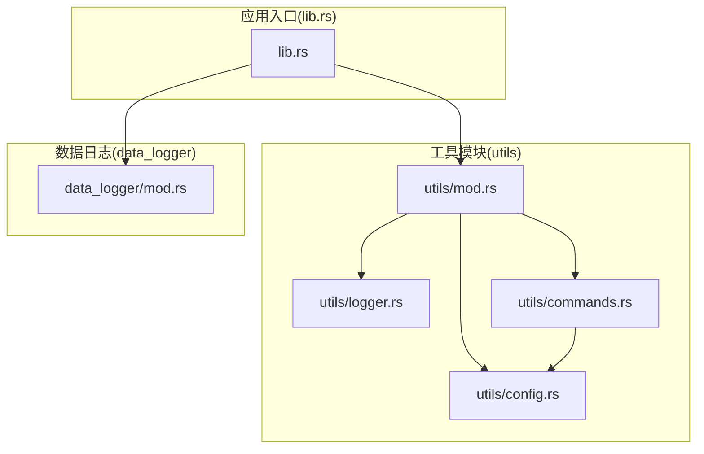
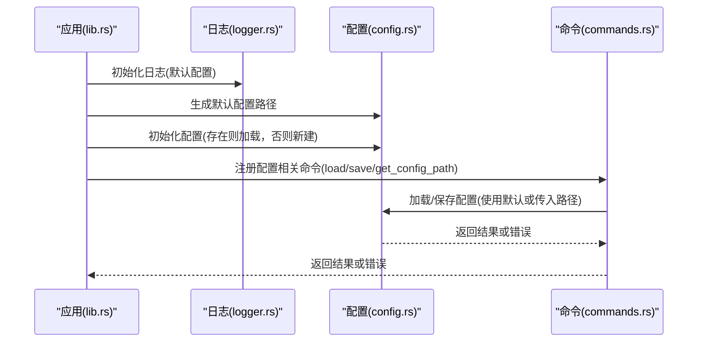
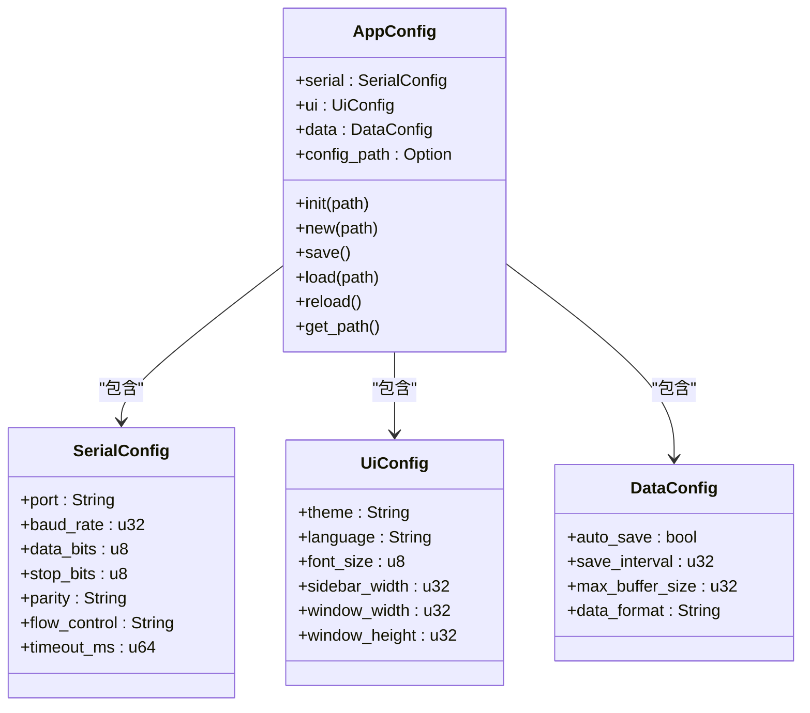
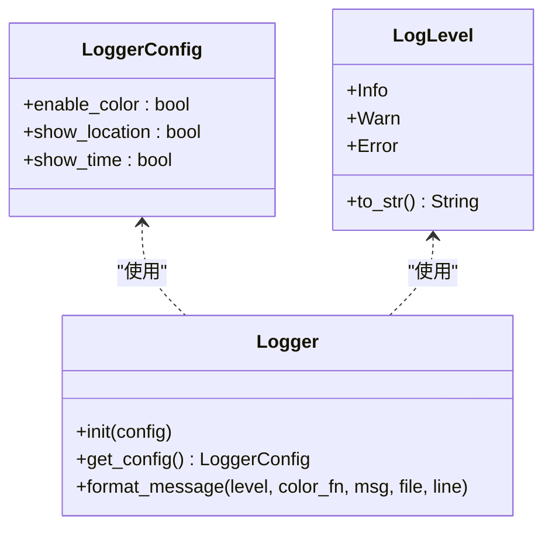
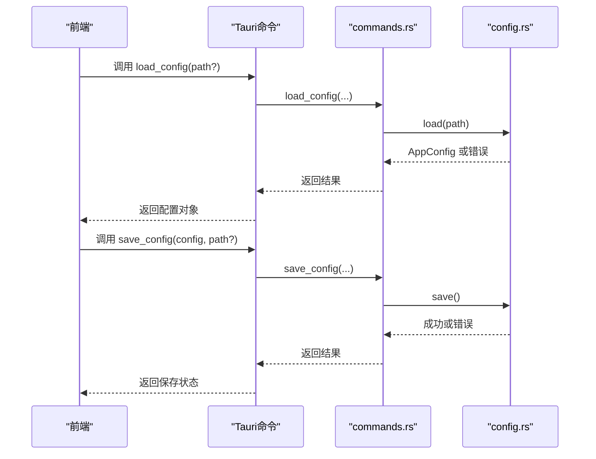
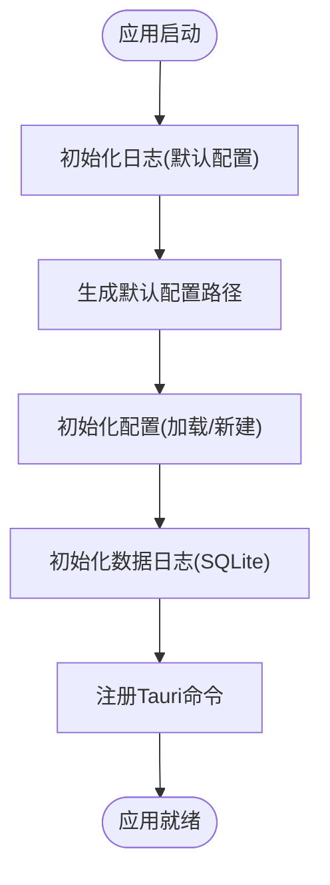
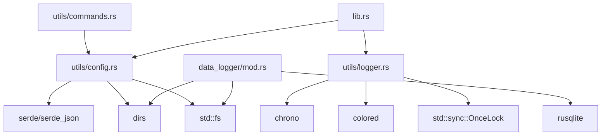

# 工具模块

<cite>
**本文引用的文件**
- [src-tauri/src/utils/mod.rs](file://src-tauri/src/utils/mod.rs)
- [src-tauri/src/utils/config.rs](file://src-tauri/src/utils/config.rs)
- [src-tauri/src/utils/logger.rs](file://src-tauri/src/utils/logger.rs)
- [src-tauri/src/utils/commands.rs](file://src-tauri/src/utils/commands.rs)
- [src-tauri/src/lib.rs](file://src-tauri/src/lib.rs)
- [src-tauri/Cargo.toml](file://src-tauri/Cargo.toml)
- [DESIGN.md](file://DESIGN.md)
- [docs/rust_utils_module_tutorial.md](file://docs/rust_utils_module_tutorial.md)
- [docs/rust_struct_nesting_config_storage_tutorial.md](file://docs/rust_struct_nesting_config_storage_tutorial.md)
- [src-tauri/src/data_logger/mod.rs](file://src-tauri/src/data_logger/mod.rs)
</cite>

## 目录
1. [引言](#引言)
2. [项目结构](#项目结构)
3. [核心组件](#核心组件)
4. [架构总览](#架构总览)
5. [详细组件分析](#详细组件分析)
6. [依赖分析](#依赖分析)
7. [性能考虑](#性能考虑)
8. [故障排查指南](#故障排查指南)
9. [结论](#结论)
10. [附录](#附录)

## 引言
本文件聚焦 KonSerial 工具模块，系统性梳理其配置管理系统、日志系统与通用工具函数的设计与实现。文档围绕以下目标展开：
- 配置管理：跨平台配置文件路径、结构化配置模型、加载/保存/重载流程与错误处理。
- 日志系统：级别管理、输出格式、颜色与位置信息控制、初始化与宏封装。
- 通用工具函数：数据转换、字符串处理、文件操作的实现思路与最佳实践。
- 错误处理与异常管理：统一的错误传播、日志记录与调试支持。
- 使用示例与最佳实践：通过 Tauri 命令与应用启动流程展示工具的实际用法。

## 项目结构
工具模块位于 Rust 后端 src-tauri/src/utils 下，采用模块化组织：
- utils/mod.rs：工具模块入口，导出子模块并可进行重新导出。
- utils/config.rs：配置管理，包含配置结构、默认路径、初始化、加载、保存、重载与路径获取。
- utils/logger.rs：日志系统，包含日志级别枚举、配置结构、格式化输出与宏封装。
- utils/commands.rs：Tauri 命令，封装配置的加载、保存与默认路径查询。
- lib.rs：应用入口，负责初始化日志、加载配置、初始化数据日志与注册命令。
- data_logger/mod.rs：数据日志模块（与工具模块协同），提供会话与数据持久化能力。

**图示来源**
- [src-tauri/src/utils/mod.rs:1-6](file://src-tauri/src/utils/mod.rs#L1-L6)
- [src-tauri/src/utils/config.rs:1-176](file://src-tauri/src/utils/config.rs#L1-L176)
- [src-tauri/src/utils/logger.rs:1-132](file://src-tauri/src/utils/logger.rs#L1-L132)
- [src-tauri/src/utils/commands.rs:1-31](file://src-tauri/src/utils/commands.rs#L1-L31)
- [src-tauri/src/lib.rs:1-84](file://src-tauri/src/lib.rs#L1-L84)
- [src-tauri/src/data_logger/mod.rs:1-273](file://src-tauri/src/data_logger/mod.rs#L1-L273)

**章节来源**
- [src-tauri/src/utils/mod.rs:1-6](file://src-tauri/src/utils/mod.rs#L1-L6)
- [src-tauri/src/lib.rs:10-33](file://src-tauri/src/lib.rs#L10-L33)
- [DESIGN.md:101-139](file://DESIGN.md#L101-L139)

## 核心组件
- 配置管理模块：提供 AppConfig 及其子结构（SerialConfig、UiConfig、DataConfig），支持跨平台默认路径、初始化、加载、保存、重载与路径获取。
- 日志模块：提供 LoggerConfig 与 LogLevel，支持时间戳、级别、位置与颜色控制；通过宏封装 info/warn/error 输出。
- Tauri 命令：封装配置加载、保存与默认路径查询，便于前端调用。
- 应用入口：在启动时初始化日志、加载配置、初始化数据日志并注册命令。

**章节来源**
- [src-tauri/src/utils/config.rs:56-176](file://src-tauri/src/utils/config.rs#L56-L176)
- [src-tauri/src/utils/logger.rs:7-132](file://src-tauri/src/utils/logger.rs#L7-L132)
- [src-tauri/src/utils/commands.rs:3-31](file://src-tauri/src/utils/commands.rs#L3-L31)
- [src-tauri/src/lib.rs:25-83](file://src-tauri/src/lib.rs#L25-L83)

## 架构总览
工具模块与应用入口协作，形成“配置-日志-命令”闭环：
- 应用启动时初始化日志与配置。
- Tauri 命令通过 utils/commands.rs 与 utils/config.rs 协作完成配置的持久化与读取。
- 日志系统贯穿应用生命周期，提供统一的错误与调试输出。

**图示来源**
- [src-tauri/src/lib.rs:25-83](file://src-tauri/src/lib.rs#L25-L83)
- [src-tauri/src/utils/logger.rs:44-50](file://src-tauri/src/utils/logger.rs#L44-L50)
- [src-tauri/src/utils/config.rs:67-94](file://src-tauri/src/utils/config.rs#L67-L94)
- [src-tauri/src/utils/commands.rs:3-31](file://src-tauri/src/utils/commands.rs#L3-L31)

## 详细组件分析

### 配置管理系统
- 结构设计
  - AppConfig：聚合 SerialConfig、UiConfig、DataConfig，并携带配置文件路径。
  - SerialConfig：串口参数（端口、波特率、数据位、停止位、校验、流控、超时）。
  - UiConfig：界面主题、语言、字号、侧边栏宽度、窗口尺寸等。
  - DataConfig：自动保存、保存间隔、缓冲区大小、数据格式等。
- 默认路径
  - default_config_path()：基于 dirs crate 返回跨平台默认配置路径（Linux/macOS/Windows）。
- 生命周期
  - init(path)：若配置存在则加载，失败则回退到新建并保存；不存在则新建并保存。
  - new(path)：构造默认配置并绑定路径。
  - save()：确保父目录存在，序列化为 JSON 并写入磁盘。
  - load(path)：从磁盘读取并反序列化，保留路径。
  - reload()：从已知路径重新加载并更新当前配置。
  - get_path()：返回配置文件路径。
- 错误处理
  - 统一使用 Result 与 Box<dyn std::error::Error> 传播错误。
  - 日志记录关键节点（加载成功、创建失败、保存失败、路径未设置）。

**图示来源**
- [src-tauri/src/utils/config.rs:18-63](file://src-tauri/src/utils/config.rs#L18-L63)

**章节来源**
- [src-tauri/src/utils/config.rs:8-176](file://src-tauri/src/utils/config.rs#L8-L176)

### 日志系统
- 级别管理
  - LogLevel：Info/Warn/Error 三种级别，内部转为字符串。
- 配置结构
  - LoggerConfig：enable_color、show_location、show_time 控制输出格式。
  - 默认配置：全部开启。
- 格式化输出
  - Logger::format_message：按配置拼接时间戳、级别、位置与消息。
  - 宏封装：log_info/log_warn/log_error，自动注入 file!() 与 line!()。
- 初始化
  - Logger::init：使用 OnceLock 保存全局配置，保证线程安全初始化一次。
- 性能考虑
  - 仅在需要时拼接字符串，避免无谓的格式化。
  - 通过配置开关控制输出细节，减少冗余信息。

**图示来源**
- [src-tauri/src/utils/logger.rs:23-83](file://src-tauri/src/utils/logger.rs#L23-L83)

**章节来源**
- [src-tauri/src/utils/logger.rs:1-132](file://src-tauri/src/utils/logger.rs#L1-L132)

### 通用工具函数与 Tauri 命令
- 命令定义
  - load_config(path?)：加载配置，支持传入路径或使用默认路径。
  - save_config(config, path?)：保存配置，支持传入路径或使用默认路径。
  - get_config_path()：返回默认配置路径。
- 与配置模块协作
  - commands.rs 直接调用 AppConfig::load/save，实现跨平台配置持久化。
- 与应用入口集成
  - lib.rs 在启动时初始化日志与配置，并注册上述命令。

**图示来源**
- [src-tauri/src/utils/commands.rs:3-31](file://src-tauri/src/utils/commands.rs#L3-L31)
- [src-tauri/src/utils/config.rs:127-152](file://src-tauri/src/utils/config.rs#L127-L152)

**章节来源**
- [src-tauri/src/utils/commands.rs:1-31](file://src-tauri/src/utils/commands.rs#L1-L31)
- [src-tauri/src/lib.rs:56-83](file://src-tauri/src/lib.rs#L56-L83)

### 应用启动与工具模块集成
- 启动流程
  - 初始化日志系统（默认配置）。
  - 生成默认配置路径并初始化 AppConfig（加载或新建）。
  - 初始化数据日志（SQLite），并注册相关命令。
- 与数据日志模块协同
  - data_logger/mod.rs 提供默认数据库路径与会话/数据持久化能力，与工具模块共同支撑应用数据管理。

**图示来源**
- [src-tauri/src/lib.rs:25-83](file://src-tauri/src/lib.rs#L25-L83)
- [src-tauri/src/data_logger/mod.rs:11-18](file://src-tauri/src/data_logger/mod.rs#L11-L18)

**章节来源**
- [src-tauri/src/lib.rs:25-83](file://src-tauri/src/lib.rs#L25-L83)
- [src-tauri/src/data_logger/mod.rs:11-18](file://src-tauri/src/data_logger/mod.rs#L11-L18)

## 依赖分析
- 依赖关系
  - utils/config.rs 依赖 serde/serde_json 进行序列化与反序列化，依赖 dirs 获取跨平台配置目录，依赖 std::fs 进行文件读写。
  - utils/logger.rs 依赖 chrono 进行时间戳格式化，依赖 colored 进行颜色输出，依赖 std::sync::OnceLock 进行全局配置初始化。
  - utils/commands.rs 依赖 utils/config.rs 提供的配置操作。
  - lib.rs 依赖 utils/logger.rs 与 utils/config.rs，并注册命令。
  - data_logger/mod.rs 依赖 rusqlite 进行 SQLite 操作，依赖 dirs 与 std::fs 进行路径与目录管理。
- 外部依赖
  - Cargo.toml 中声明了 serde、serde_json、chrono、colored、dirs、rusqlite 等依赖。

**图示来源**
- [src-tauri/Cargo.toml:20-36](file://src-tauri/Cargo.toml#L20-L36)
- [src-tauri/src/utils/config.rs:3-6](file://src-tauri/src/utils/config.rs#L3-L6)
- [src-tauri/src/utils/logger.rs:2-4](file://src-tauri/src/utils/logger.rs#L2-L4)
- [src-tauri/src/utils/commands.rs:1](file://src-tauri/src/utils/commands.rs#L1)
- [src-tauri/src/lib.rs:10-11](file://src-tauri/src/lib.rs#L10-L11)
- [src-tauri/src/data_logger/mod.rs:6-9](file://src-tauri/src/data_logger/mod.rs#L6-L9)

**章节来源**
- [src-tauri/Cargo.toml:20-36](file://src-tauri/Cargo.toml#L20-L36)

## 性能考虑
- 配置文件
  - 仅在必要时创建父目录，避免重复 IO。
  - 使用 serde_json::to_string_pretty 便于阅读但注意在高频写入场景下可切换为紧凑格式以降低体积。
- 日志系统
  - 通过配置开关控制时间戳与位置输出，减少冗余信息。
  - 宏封装避免重复样板代码，提升可维护性。
- 数据日志
  - SQLite 使用 WAL 模式与外键约束，兼顾一致性与并发性能。
  - 查询使用索引与分页参数，避免全表扫描。

[本节为通用性能建议，不直接分析具体文件，故无“章节来源”]

## 故障排查指南
- 配置加载失败
  - 现象：初始化配置时加载失败并回退到新建。
  - 排查：检查配置文件是否存在、权限是否足够、JSON 格式是否正确。
  - 参考：[src-tauri/src/utils/config.rs:67-94](file://src-tauri/src/utils/config.rs#L67-L94)
- 配置保存失败
  - 现象：保存配置时报错“配置文件路径未设置”或写入失败。
  - 排查：确认 config_path 已设置；检查父目录权限与磁盘空间。
  - 参考：[src-tauri/src/utils/config.rs:127-143](file://src-tauri/src/utils/config.rs#L127-L143)
- 日志输出异常
  - 现象：颜色或时间戳未按预期显示。
  - 排查：确认 Logger::init 已调用且 LoggerConfig 配置正确；检查终端对颜色的支持。
  - 参考：[src-tauri/src/utils/logger.rs:44-50](file://src-tauri/src/utils/logger.rs#L44-L50)
- Tauri 命令调用失败
  - 现象：前端调用 load_config/save_config 报错。
  - 排查：确认命令已注册；检查路径参数与配置对象结构是否匹配。
  - 参考：[src-tauri/src/lib.rs:56-83](file://src-tauri/src/lib.rs#L56-L83)，[src-tauri/src/utils/commands.rs:3-31](file://src-tauri/src/utils/commands.rs#L3-L31)

**章节来源**
- [src-tauri/src/utils/config.rs:67-143](file://src-tauri/src/utils/config.rs#L67-L143)
- [src-tauri/src/utils/logger.rs:44-50](file://src-tauri/src/utils/logger.rs#L44-L50)
- [src-tauri/src/lib.rs:56-83](file://src-tauri/src/lib.rs#L56-L83)
- [src-tauri/src/utils/commands.rs:3-31](file://src-tauri/src/utils/commands.rs#L3-L31)

## 结论
工具模块通过清晰的模块边界与职责划分，实现了跨平台配置管理与可定制的日志系统，并通过 Tauri 命令桥接前端与后端。配置系统具备完善的加载/保存/重载机制与错误处理；日志系统提供灵活的格式化与颜色控制；二者与数据日志模块协同，为应用提供了稳健的基础设施。

[本节为总结性内容，不直接分析具体文件，故无“章节来源”]

## 附录

### 使用示例与最佳实践
- 配置使用示例
  - 初始化配置：在应用启动时生成默认路径并调用 init，自动处理加载或新建。
  - 保存配置：通过 save_config 命令保存，支持自定义路径。
  - 参考路径：
    - [src-tauri/src/lib.rs:31-33](file://src-tauri/src/lib.rs#L31-L33)
    - [src-tauri/src/utils/commands.rs:13-23](file://src-tauri/src/utils/commands.rs#L13-L23)
- 日志使用示例
  - 初始化日志：在应用启动时调用 Logger::init。
  - 输出日志：使用 log_info!/log_warn!/log_error! 宏。
  - 参考路径：
    - [src-tauri/src/lib.rs:27](file://src-tauri/src/lib.rs#L27)
    - [src-tauri/src/utils/logger.rs:85-131](file://src-tauri/src/utils/logger.rs#L85-L131)
- 最佳实践
  - 配置文件：使用 serde_json 保持结构稳定；在高频写入场景下权衡可读性与体积。
  - 日志：生产环境可关闭位置信息与时间戳以减少冗余；严格区分级别以利于问题定位。
  - 错误处理：统一使用 Result 与错误日志记录，避免静默失败。
  - 参考教程：
    - [docs/rust_utils_module_tutorial.md:1-184](file://docs/rust_utils_module_tutorial.md#L1-L184)
    - [docs/rust_struct_nesting_config_storage_tutorial.md:1-109](file://docs/rust_struct_nesting_config_storage_tutorial.md#L1-L109)

**章节来源**
- [src-tauri/src/lib.rs:25-33](file://src-tauri/src/lib.rs#L25-L33)
- [src-tauri/src/utils/commands.rs:3-31](file://src-tauri/src/utils/commands.rs#L3-L31)
- [docs/rust_utils_module_tutorial.md:1-184](file://docs/rust_utils_module_tutorial.md#L1-L184)
- [docs/rust_struct_nesting_config_storage_tutorial.md:1-109](file://docs/rust_struct_nesting_config_storage_tutorial.md#L1-L109)